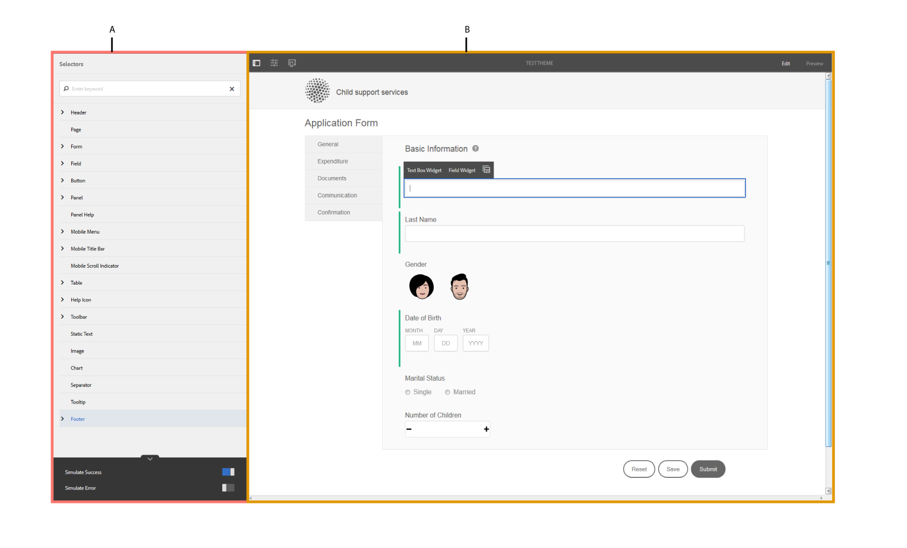
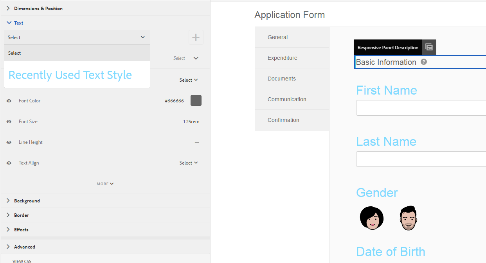

# 建立和使用主題{#creating-and-using-themes}

## 簡介 {#introduction}

您可以建立並套用主題，使最適化表單或互動式通訊變得風格化。 主題包含元件和面板的樣式詳細資訊。 樣式包括背景顏色、狀態顏色、透明度、對齊方式和大小等屬性。 當您套用主題時，指定的樣式會反映在對應的元件上。 主題是獨立管理的，不參考自適應形式或交互通信。

您可以：

* 建立主題
* 編輯和複製現有主題
* 下載現有主題並上傳至AEM Forms伺服器
* 管理主題的相依性

## 建立、下載或上傳主題 {#creating-downloading-or-uploading-a-theme}

有了AEM Forms，您可以建立、下載或上傳主題。 主題的建立方式與其他資產（例如表單、檔案和字母）類似。 主題會儲存為個別的實體，並加上表單等中繼屬性。 主題是個別的實體，可讓多種調適性表單和互動式通訊重複使用。 您也可以將主題移至AEM Forms的不同例項，然後加以重複使用。

### 建立主題 {#creating-a-theme}

執行下列步驟以建立主題：

1. 按一 **下「Adobe Experience Manager**」、「 **Forms**」，然後按一下「 **主題**」。

1. 在「主題」頁面中，按一下「 **建立>主題」**。
會啟動建立主題的精靈。

1. 在「建立主題」精靈的「基本」索引標籤中， **提供****主題的「標題** 」和「名稱」。 這些是必填欄位。

1. 在「進階」索引標籤中，您會看到兩個欄位：

   * **Clientlib位置**:儲存主題客戶端庫的儲存庫中的位置。

   * **Clientlib類別**:提供文本欄位，以輸入主題的clientlib類別名稱。

1. 按一 **下「建立** 」，然後按一下「編 **輯」以在「主題編輯器」中開啟主題，或按一** 下「完成 **** 」以返回主題頁面。

### 下載主題 {#downloading-a-theme}

您可以將主題匯出為zip檔案，並在其他專案或AEM例項中使用這些主題。 若要下載主題：

1. 按一 **下「Adobe Experience Manager**」、「 **Forms**」，然後按一下「 **主題**」。

1. 在「主題」頁面中，選 **取主題** ，然後按一下「 **下載」**。 此時將顯示一個包含主題詳細資訊的對話框。

1. 按一 **下下載**。 主題會下載為zip檔案。

>[!NOTE]
>
>如果您下載具有與其相關聯的最適化表單且相關聯的最適化表單是以自訂範本為基礎的主題，則也請下載自訂範本。 當您將下載的主題和最適化表單上傳至AEM Forms伺服器時，也請上傳相關的自訂範本。

### 上傳主題 {#uploading-a-theme}

您可以在專案中使用已建立的主題和樣式預設集。 您可以將其他人建立的主題套件上傳至您的專案，以匯入這些主題套件。

若要上傳主題：

1. 按一 **下「Adobe Experience Manager**」、「 **Forms**」，然後按一下「 **主題**」。

1. 在「主題」頁面中，按一下「 **建立>檔案上傳」**。
1. 在「檔案上傳」提示中，瀏覽並選取電腦上的主題套件，然後按一下「上 **傳**」。
已上傳的主題可在主題頁面中使用。

## 主題的中繼資料 {#metadata-of-a-theme}

主題的中繼屬性清單（可在主題的屬性頁面中找到）。

<table>
 <tbody>
  <tr>
   <th>
<strong>ID</strong>
 
 
 </th>
   <th><strong>名稱</strong></th>
   <th><strong>可編輯</strong></th>
   <th><strong>屬性說明</strong></th>
  </tr>
  <tr>
   <td>1.</td>
   <td>標題</td>
   <td>是</td>
   <td>主題的顯示名稱。</td>
  </tr>
  <tr>
   <td>2.</td>
   <td>說明</td>
   <td>是</td>
   <td>主題說明。</td>
  </tr>
  <tr>
   <td>3.</td>
   <td>類型</td>
   <td>否</td>
   <td>
    <ul>
     <li>資產類型。</li>
     <li>值永遠是主題。</li>
    </ul> </td>
  </tr>
  <tr>
   <td>4.</td>
   <td>建立日期</td>
   <td>否</td>
   <td>主題建立日期</td>
  </tr>
  <tr>
   <td>5.</td>
   <td>作者名稱</td>
   <td>是</td>
   <td>主題的作者。 在建立主題時計算。</td>
  </tr>
  <tr>
   <td>6.</td>
   <td>上次修改日期</td>
   <td>否</td>
   <td>上次修改主題的日期。</td>
  </tr>
  <tr>
   <td>7.</td>
   <td>狀態</td>
   <td>否</td>
   <td>主題狀態（已修改／已發佈）。</td>
  </tr>
  <tr>
   <td>8.</td>
   <td>準時發佈</td>
   <td>是</td>
   <td>該自動發佈主題了。</td>
  </tr>
  <tr>
   <td>9.</td>
   <td>發佈關閉時間</td>
   <td>是</td>
   <td>該自動取消發佈主題了。</td>
  </tr>
  <tr>
   <td>10.</td>
   <td>標記</td>
   <td>是</td>
   <td>一種附加在主題上用於識別的標籤，用於改進搜索。</td>
  </tr>
  <tr>
   <td>11.</td>
   <td>引用</td>
   <td>連結</td>
   <td>
    <ul>
     <li>包含「反向連結者」區段。 列出使用主題的表單。</li>
     <li>由於主題不指任何其他資產，因此沒有「參考」區段。</li>
    </ul> </td>
  </tr>
  <tr>
   <td>12.</td>
   <td>Clientlib 位置</td>
   <td>是</td>
   <td>
    <ul>
     <li>在「/etc」中儲存與此主題對應的客戶端庫的用戶定義儲存庫路徑。</li>
     <li>預設值- '/etc/clientlibs/fd/themes' +主題資產的相對路徑。</li>
     <li>如果位置不存在，則會自動產生資料夾階層。</li>
     <li>更改此值時，clientlib節點結構將移到輸入的新位置。 <em> 注 <strong></strong>意：如果更改了預設clientlib位置，則在CRXDE儲存庫中 <code>crx:replicate, rep:write, rep:glob:*, rep:itemNames:: js.txt, jcr:read </code>將 <code>forms-users</code> 分配給和， <code>crx:replicate</code>在新 <code>jcr:read </code><code>fd-service</code> 位置中將分配給。 另外，通過添加 <code>deny jcr:addChildNodes</code><code>forms-user</code></em></li>
    </ul> </td>
  </tr>
  <tr>
   <td>13.</td>
   <td>Clientlib 類別名稱</td>
   <td>是</td>
   <td>
    <ul>
     <li>此主題的用戶定義clientlib類別名稱。</li>
     <li>如果名稱已由某些其他現有主題使用，則會顯示錯誤。</li>
     <li>預設值——使用主題位置計算。</li>
     <li>更改此值時，類別名稱將在相應的clientlib節點上更新。 不需要在jsp檔案中更新Clientlib類別名稱，因為引用使用clientlib類別名稱。</li>
    </ul> </td>
  </tr>
 </tbody>
</table>

## 關於主題編輯器 {#about-the-theme-editor}

AEM Forms隨附於主題編輯器。 它是商業使用者和網頁設計人員／開發人員友好介面，提供所需功能，以輕鬆指定各種調適性表單和互動式通訊元素的樣式。 當您建立主題時，主題會儲存為個別的實體，例如表單、互動式通訊、字母、檔案片段和資料字典。

「主題編輯器」可讓您自訂主題中樣式化元件的樣式。 您可以自訂表單或互動式通訊在裝置上的外觀。

主題編輯器分為兩個面板：

* **畫布** -顯示在右側。 它顯示樣本的自適應表單或互動式通訊，讓所有樣式變更都能立即反映。 您也可以直接從畫布選取物件，以尋找與其相關的樣式，並編輯這些樣式。 頂部的裝置解析度尺標控制畫布。 從尺標中選擇解析度斷點，可顯示各解析度的範例表單預覽或互動式通訊。 Canvas將在下面詳細討 [論](../../forms/using/themes.md#using-canvas)。

* **側欄**-顯示在左側。 它包含下列項目：

   * **** 選擇器：顯示為樣式選擇的元件及其可設定樣式的屬性。 選取器表示類型的所有元件。 如果您在主題中選擇文本框元件以進行樣式設定，則表單或互動式通信中的所有文本框都將繼承樣式。 選擇器可讓您選擇一般元件或特定元件來建立樣式。 例如，欄位元件是通用元件，文本框是特定元件。

      ****樣式通用元件：欄位可以是數值方塊欄位，例如年齡，或文字方塊欄位，例如位址。
當您設定欄位樣式時，所有欄位（例如年齡、名稱、位址）都會設定樣式。

      **樣式特定元件**:特定元件會影響特定類別的對象。 當您對主題中的數字框元件進行樣式設定時，只有該樣式中的數字框對象繼承該樣式。

      例如，文字方塊欄位（例如位址）的長度較長，而數值方塊欄位（例如年齡）的長度較短。 您可以選取數值方塊欄位、縮短欄位長度並套用至表格。 所有數值方塊欄位的寬度會以您的格式縮小。

      當您使用特定背景顏色自訂所有欄位元件時，所有欄位（例如年齡、名稱和位址）都會繼承背景顏色。 當您選取數值方塊（例如年齡）時，會縮小其寬度、所有數值方塊的寬度（例如年齡）、家庭中的人數會減少。 文字方塊的寬度不會變更。

   * **** 州：可讓您自訂特定狀態物件的樣式。 例如，您可以指定物件處於預設、對焦、停用、暫留或錯誤狀態時的外觀。
   * **** 屬性類別：樣式屬性被分為不同類別。 例如「維度與位置」、「文字」、「背景」、「邊框」和「效果」。 在每個類別下，您都會提供樣式資訊。 例如，在「背景」下，您可以提供「背景顏色」和「影像與漸層」。

   * **** 進階：可讓您將自訂CSS新增至物件，以覆寫視覺控制項在有重疊時所定義的屬性。

   * **檢視CSS**:可讓您檢視所選元件的CSS
   此外，在側欄中，底部有箭頭。 當您按一下箭頭時，您會再看到兩個選項：模 **擬成功****和模擬錯誤。** 這些選項以及上述選項將在下文中詳 [細討論](../../forms/using/themes.md#using-rail)。

[ 反白顯 ](assets/themes-1.png)**** **A.側**&#x200B;欄B.畫布

### 樣式元件 {#styling-components}

您可以在多種調適性表單和互動式通訊中使用主題，這可匯入您在主題中指定的元件格式。 您可以設定各種元件的樣式，例如標題、說明、面板、欄位、圖示和文字方塊。 使用Widget來設定主題中的元件屬性。 您不需具備CSS或LESS的先前知識，但是也需要，不過「CSS覆寫」區段可讓您編寫CSS程式碼或提供自訂選擇器。 當您在側欄中選取元件時，會顯示「CSS覆寫」區段。

邊欄中的選項，可讓您選取不同的元件並設定其樣式。

按一下側邊欄中元件的編輯按鈕，即可在畫布中選取元件，並讓您使用側邊欄中的選項來設定元件的樣式。

某些元件（例如文字方塊、數值方塊、選項按鈕和核取方塊）會分類在「欄位」等一般元件下。 例如，您想要自訂選項按鈕的樣式。 要選擇樣式的單選按鈕，請選 **擇欄位>構件>單選按鈕**。

在側 **欄中按一下** 「全部展開」，檢視、選取前期不可見的分類元件，並設定其樣式。

### 樣式面板版面 {#styling-panel-layouts-br}

AEM Forms中的主題支援在表單和互動式通訊的面板版面中設定元素樣式。 支援立即可用的版面和自訂版面中的元素樣式。

現成可用的面板包括：

* 左側的索引標籤
* 索引標籤在頂端
* 折疊式面板
* 回應式
* 精靈
* 行動版面

   * 標題中的面板標題
   * 標題中不含面板標題

選擇器會因每個版面而異。
從主題編輯器設定自訂版面的樣式包括：

* 定義可設定樣式的版面元件，以及CSS選擇器，以唯一識別這些元件
* 定義可套用至這些元件的CSS屬性
* 從使用者介面以互動方式定義這些元件的樣式

### 不同螢幕大小的不同樣式 {#different-styles-for-different-screen-sizes-br}

案頭和行動裝置版面的樣式可能略有不同或完全不同。 針對行動裝置，平板電腦和手機共用的版面與元件大小不同。

使用「主題編輯器」中斷點來定義不同螢幕大小的替代樣式。 您可以選取開始建立主題的基本裝置或解析度，並自動產生其他解析度的樣式變化。 您可以顯式修改所有解析度的樣式。

>[!NOTE]
>
>首先使用表單或互動式通訊建立主題，然後套用至不同的表單或互動式通訊。 在主題建立中使用的中斷點可以與應用主題的表單或互動式通訊不同。 CSS媒體查詢是以建立主題時使用的表單或互動式通訊為基礎，而非套用主題的表單或互動式通訊。

### 在選擇對象時在側欄中樣式屬性上下文更改 {#styling-properties-context-changes-in-sidebar-on-selecting-objects}

當您在畫布中選取元件時，其樣式屬性會列在側欄中。 選擇對象類型及其狀態，然後提供其樣式。

### 主題編輯器中最近使用的樣式 {#recently-used-styles-in-theme-editor}

主題編輯器會快取套用至元件的多達10種樣式。 您可以將快取樣式與主題的其他元件搭配使用。 最近使用的樣式會直接在側欄中選取的元件下方做為清單方塊。 最初，最近使用的樣式清單是空的。

當您設定元件樣式時，這些樣式會快取並列在清單方塊中。 在此示例中，文本框的標籤將設定樣式以更改字型大小和顏色。 您可以依照類似的步驟選擇影像或變更顏色以設定元件的樣式。 觀察當欄位標籤樣式更改時，如何快取樣式並列在清單框中。

在此範例中，欄位標籤的樣式已變更，當選取「自適應面板描述」做為樣式時，資產程式庫中會新增清單項目。 資產庫中的項目可用來變更「自適應面板描述」的樣式。

在資產庫中新增樣式時，其他主題和表格編輯器或互動式通訊編輯 [器](../../forms/using/inline-style-adaptive-forms.md) UI的樣式模式都可使用。 同樣地，當您使用表單編輯器或互動式通訊編輯器UI的樣式模式來設定元件的樣式時，會快取樣式，並可在主題中使用。

資產庫的加號按鈕可讓您永久儲存樣式，並使用您提供的名稱。 即使您未在側欄中按一下「保存」按鈕將樣式應用於元件，加號按鈕也會保存樣式。 在樣式模式中，不提供用於保存樣式以供以後使用的加號按鈕。

當您為樣式提供自訂名稱時，樣式會系結至主題，而不再適用於其他主題。 要刪除保存的樣式：

1. 在「畫布」工具列上，按一 **下「主題選項** >管  理樣式」 ****。
1. 在「管理樣式」對話方塊中，選取儲存的樣式，按一下「刪 **除」**。

   

### 即時預覽、儲存和放棄變更 {#live-preview-save-and-discard-changes}

樣式中所做的修改會立即反映在畫布中載入的表單或互動式通訊中。 即時預覽可讓您以互動方式定義並檢視樣式的影響。 當您變更元件的樣式時，側欄中會啟 **用「完成** 」按鈕。 若要保留變更，請使用「完 **成** 」按鈕。

>[!NOTE]
>
>在欄位中輸入無效字元時，欄位邊界顏色會變成紅色，畫面的左上角會顯示錯誤訊息。 例如，如果在接受數字字元作為輸入的文本框中輸入字母，則輸入框邊界顏色將更改為紅色。 如果沒有解決顯示在頂部的錯誤，則無法保存此類主題。

### 具有其他自適應形式或互動式通訊的主題 {#theme-with-another-adaptive-form-or-interactive-communication}

當您建立主題時，會使用主題編輯器隨附的表單來建立主題。 您在此表單中提供元件的樣式。 您可以選取您選擇的表單或互動式通訊，以提供樣式並預覽結果，而不是隨主題編輯器一起提供的表單。

若要取代主題編輯器畫布中目前的表單或互動式通訊：

1. 在「主題編輯器」面板中，按一 **下「主題選項** >設 **定」**。

1. 在「一般」索引標籤中，瀏覽並選取「最適化表單／檔案」欄位 **的表單或互動式通訊** 。

### 重做／還原 {#redo-undo}

您可以還原或重做意外發生的意外變更。 使用畫布中的重做／復原按鈕。

畫布中的還原／重做按鈕

在主題編輯器中對元件進行樣式設定時，將顯示重做／撤消按鈕。

## 使用主題編輯器 {#using-the-theme-editor}

主題編輯器可讓您編輯您建立或上傳的主題。 導覽至「 **表單與檔案>主題**」，然後選取並開啟主題。 主題在主題編輯器中開啟。

如上所述，主題編輯器有兩個面板：側欄和畫布。

在主題編輯器中自訂文字方塊Widget元件的成功狀態樣式。 在畫布中選取元件，並在側欄中選取其狀態。 側欄中可用的樣式選項可用來自訂元件的外觀。

### 使用畫布 {#using-canvas}

主題是使用現成可用的表單建立，或是使用您選擇的表單或互動式通訊。 「畫布」會顯示用於建立主題的表單或互動式通訊的預覽，以及主題中指定的自訂項目。 表格上方的尺標會用來根據裝置的顯示大小來決定版面配置。

在「畫布」工具列中，您會看到：

* **切換側面板** (Toggle Side Panel 切換側面板(Toggle-side-panel):可讓您顯示或隱藏邊欄。
* **主題選項**:提供3種選項

   * 設定：提供選項來選擇預覽表單或互動式通訊、基本clientlib和typekit設定。
   * 檢視主題CSS:為選取的主題產生CSS。
   * 管理樣式：提供管理文字和影像樣式的選項
   * 說明：執行主題編輯器的影像導覽指南。

* **模擬器** 尺標 :模擬不同顯示大小的主題外觀。 顯示大小在模擬器中被視為斷點。 可以選擇斷點並為其指定樣式。 例如，Desktop和Tablet是兩個中斷點。 您可以為每個斷點指定不同的樣式。

當您在畫布中選取元件時，會在其上方看到元件工具列。 元件工具列可讓您選取元件，或切換至一般元件。 例如，您在面板中選擇一個數字文本框。 您可在元件工具列中看到下列選項：

* **數值方塊介面工具集**:可讓您選取元件，以自訂其側邊欄中的外觀。
* **欄位介面工具集**:可讓您選擇用於樣式的通用元件。 在此示例中，所有文本輸入元件（文本框／數字框／數字步進器／日期輸入）都被選定為樣式。

* :可讓您切換至一般元件以進行樣式設定。 如果您選取數值方塊並點選此圖示，則會選取欄位元件。 如果您選取欄位元件並點選此圖示，則會選取面板。 如果您繼續點選此圖示以進行選取，最後會選取樣式的版面。

>[!NOTE]
>
>元件工具欄中的可用選項會根據您選擇的元件而有所不同。

畫布中數值方塊上的元件工具列

### 使用側欄 {#using-rail}

主題編輯器中的側欄提供選項，可自訂主題中元件的樣式，並使用選擇器。 選擇器可讓您選擇一組元件或個別元件，並可在側欄中搜尋選擇器。 您可以編寫自訂元件的選擇器。

當您從側欄的畫布或選擇器中選取元件時，側欄會顯示可讓您自訂其樣式的所有選項。
以下是您在選取元件時，在側邊欄中看到的選項：

* 狀態
* 屬性表
* 模擬錯誤／成功

#### 狀態 {#state}

狀態是指使用者與元件互動的指標。 例如，當使用者在文字方塊中輸入錯誤資料時，文字方塊的狀態會變更為錯誤狀態。 主題編輯器可讓您指定特定狀態的樣式。

自訂狀態樣式的選項會因不同元件而異。

#### 屬性表 {#property-sheet}

<table>
 <tbody>
  <tr>
   <td><strong>屬性</strong></td>
   <td><strong>使用</strong></td>
  </tr>
  <tr>
   <td>
尺寸及位置
 </td>
   <td>
可讓您在主題中設定元件對齊方式、大小、定位和放置方式。 
 
您的選項有顯示設定、填補空白、邊界、寬度、高度和Z索引。
 
您也可以使用簡易的拖放介面，使用「版面」模式來定義元件的寬度。 如需詳細資訊，請參 <a href="../../forms/using/resize-using-layout-mode.md">閱「使用版面模式調整元件大小</a>」。
 </td>
  </tr>
  <tr>
   <td>
文字
 </td>
   <td>
可讓您自訂主題元件中的文字樣式。
 
例如，您想要變更在文字方塊中輸入的文字外觀。
 
您的選項包括字型系列、粗細、顏色、大小、行高、文字對齊、黑邊間距、文字縮進、底線、斜體、文字轉換、垂直對齊、基線和方向。 
 </td>
  </tr>
  <tr>
   <td>
背景 
 </td>
   <td>
可讓您以影像或顏色填入元件背景。 
 </td>
  </tr>
  <tr>
   <td>
邊框
 </td>
   <td>
可讓您選擇元件的邊框外觀。 例如，您希望文字方塊有深紅色的粗邊，加上虛線。 
 
您的選項包括邊框的寬度、樣式、半徑和顏色。
 </td>
  </tr>
  <tr>
   <td>
效果
 </td>
   <td>
可讓您為元件加入特殊效果，例如不透明度、混合模式和陰影。 
 </td>
  </tr>
  <tr>
   <td>
進階
 </td>
   <td>
可讓您新增：

    <ul>
     <li>在選取器 <code>::before</code> 中 <code>::after</code> 預設內容之後或之前新增內容的元素和偽元素屬性，並設定其樣式。  請參 <a href="https://www.w3schools.com/css/css_pseudo_elements.asp" target="_blank">閱CSS偽元素</a>。</li>
     <li>將自訂CSS程式碼內嵌至元件並編寫自訂選擇器。 </li>
    </ul> 
當您新增自訂CSS程式碼時，它會覆寫您使用側邊欄中的選項所新增的自訂。 
 </td>
  </tr>
 </tbody>
</table>

#### 模擬錯誤／成功 {#simulate-error-success}

側欄底部提供模擬錯誤和成功選項。 您可以使用側欄底部可見的顯示／隱藏箭頭來查看這些項目。 使用主題編輯器，可以對元件的各種狀態進行樣式設定。

例如，您在表單中新增數值欄位，並在主題編輯器中指定其樣式。 當使用者在欄位中輸入英數字元值時，您會希望文字方塊的背景顏色變更。 您可在主題中選取數值欄位，並使用側邊欄中的狀態選項。 在側欄中選取「錯誤」狀態，並將背景顏色變更為紅色。 若要預覽行為，您可以使用側欄中的「模擬錯誤」選項。 模擬錯誤和成功選項的詳細說明如下：

* **模擬成功**:可讓您查看元件在您指定其成功狀態的樣式時的外觀。 例如，在表單中，客戶設定密碼。 使用者可以根據您提供的准則設定密碼。 當使用者依照您提供的所有准則輸入密碼時，文字方塊會變成綠色。 當文字方塊變成綠色時，會處於成功狀態。 您可以指定成功狀態中元件的樣式，並使用「模擬成功」選項模擬其外觀。

* **模擬錯誤**:可讓您查看元件在您指定錯誤狀態的樣式時的外觀。 例如，在表單中，客戶設定密碼。 使用者可以根據您提供的准則設定密碼。 當使用者輸入密碼時，不會遵循您提供的所有准則，文字方塊會變成紅色。 當文字方塊變成紅色時，會出現錯誤狀態。 可以為處於錯誤狀態的元件指定樣式，並使用「模擬錯誤」(Simulate Error)選項模擬其外觀。

### 設定元件的樣式 {#styling-a-component}

例如，在您的表單中，您有兩種文字方塊：一個僅接受數字值，另一個接受字母數字值。 您可以為僅接受數值的文本框（數字框）定制樣式。

執行以下步驟為特定元件定制樣式（本示例中的數字框）:

1. 在「主題編輯器」中，選取「畫布」中的數值方塊。
1. 當您選取數值方塊時，可看到元件工具列包含三個選項：

   * **數值方塊Widget**
   * **欄位介面工具** 集 

1. 選擇 **數值框構件**。
1. 邊欄標題會變更為「數值方塊介面工具集」，並顯示自訂其外觀的選項。
使用 **側欄中的「維度與位置** 」選項，自訂元件的大小。 請確定「狀態」為「 **預設」**。

與其選擇「 **數值方塊介面工具集**」，請在元件工具列 **中選取「欄位介面工具集** 」，然後執行上述步驟。 當您選取欄位介面工具集 **選項的維度時** ，除了數值方塊外，所有文字方塊的大小都相同。

### 指定狀態的樣式欄位 {#styling-fields-given-state}

使用元件工具列，您也可以指定不同狀態的元件樣式。 例如，如果元件已停用，則會處於停用狀態。 您可在主題編輯器中設定元件樣式的常用狀態為：預設值、對焦、停用、錯誤、成功和暫留。 您可以在畫布中選取元件，並使用側邊欄中的「狀態」選項來自訂其外觀。

執行以下步驟為特定狀態的元件定制樣式：

1. 在「畫布」中選取元件，並從元件工具列中選取適當的選項。
側欄顯示用於定制元件樣式的選項。
1. 在側欄中選取狀態。 例如，錯誤狀態。
1. 使用側邊欄中 **的「邊框」** 、「背景」等選項來自訂元件的外觀。
1. 使用側 **欄底部的「模擬錯誤** 」選項，查看樣式在編輯時的外觀。

在指定元件狀態後自訂元件的樣式時，只會針對指定狀態顯示元件的自訂。 例如，如果您在選取暫留狀態時自訂元件的樣式。 當您將指標移至套用主題的轉譯表單或互動式通訊中的元件上時，就會顯示元件的自訂。

若要模擬除錯誤和成功以外的狀態行為，請使用「預覽」模式。 若要使用「預覽」模式，請按一 **下頁面工具** 列中的「預覽」。

### 小螢幕的樣式配置 {#styling-layouts-for-smaller-displays}

使用畫布中的尺標，為顯示較小的裝置選取中斷點。 在「畫布  「模擬器尺標」，以檢視尺標和中斷點。 中斷點可讓您預覽與手機和平板電腦等不同裝置相關的顯示尺寸的表格或互動式通訊。 主題編輯器支援多種顯示大小。

要為不同斷點設定元件的樣式：

1. 在「畫布」中，選取標尺上方的斷點。
斷點表示移動設備及其顯示大小。
1. 使用邊欄，針對選取的顯示大小自訂主題中表單或互動式通訊元件的樣式。
1. 請確定已儲存自訂。

您可以為多種裝置設定表單或互動式通訊元件的樣式。 桌上型電腦和行動裝置專用的表單和互動式通訊元件，可有完全不同的樣式。

### 在主題中使用網頁字型 {#using-web-fonts-in-a-theme}

您現在可以以最適化形式或互動式通訊方式，在web-service中使用可用的字型。 Adobe的網頁字型服務 [Typekit](https://typekit.com/)，現成可用的設定。 若要使用Typekit，請建立套件及其中的字型，並從 [Typekit網站取得套件ID](https://typekit.com/)。

執行下列步驟，在AEM中設定Typekit:

1. 在作者例項中，按一 下「Adobe Experience Manager >工具槌  >部署>雲端服務」。
1. 在「 **Cloud Services** 」頁面上，導覽至「協力 **廠商服務** > **Typekit」，然後按一下「Typekit下****** 的「立即設定」。 如果配置已可用，請按一下 **+** 按鈕以建立新實例。
1. 在「創 **建配置** 」對話框中，指定配置的標題，然後按一下「 **建立」**。

   系統會將您重新導向至設定頁面。

1. 在出現的「編輯元件」對話方塊中，提供您的套件ID，然後按一下「 **確定**」。

執行以下步驟來配置主題以使用TypeKit配置：

1. 在作者實例上，在主題編輯器中開啟一個主題。
1. 在主題編輯器中，導覽至「主 **題選項** >設 **定**」。
1. 在「 **Typekit設定** 」欄位中，選取套件，然後按一下「 **儲存」**。

   現在，您可以看到這些字型已新增至主題的font-family屬性中。

### 在主題編輯器中列出和選擇字型 {#listing-and-selecting-fonts-in-theme-editor}

您可以使用主題設定服務，將更多字型新增至主題編輯器。 執行下列步驟以新增字型：

1. 以管理權限登入AEM Web Console。 AEM Web Console的URL為 `https://[server]:[port]/system/console/configMgr`。
1. 開啟 **最適化表單主題設定服務**。

   

1. 按一下+，指定字型名稱，然後按一下「儲 **存」**。 此字型已新增，並可在主題編輯器中使用。

#### 在主題編輯器中選取字型 {#selecting-fonts-in-theme-editor}

您可以使用+按鈕來新增字型。 當您新增字型時，該字型會列在側欄中。

除了主題設定選項外，您也可以從主題編輯器本身新增字型。 在側欄下方的字型系列欄位中輸入您要使用的字型，然後按鍵盤上的回車鍵。

當您選取字型時，該字型會新增至字型系列清單下。 您可以使用主題編輯器中的「遮色片」選項來停用或啟用列出的字型。

您可以看到元件字型變更。

「字型系列」欄位支援多種字型。 當您輸入字型時，瀏覽器會尋找字型並將它套用至選取的元件。 如果瀏覽器找不到字型，它會在系列中尋找字型旁邊的字型。 您可以先輸入您要尋找的特定字型。 如果找不到要使用的字型，可以在系列中鍵入通用字型並使用它。

#### 在主題編輯器中套用遮色片樣式 {#mask-styles-applied-in-theme-editor}

您可以遮色主題中套用的樣式。 在主題編輯器邊欄中，您可以使 eyeicon來停用套用的樣式。 例如，如果您以表單或互動式通訊方式變更元件的尺寸，則可使用屬性左側的遮色片按鈕來停用它。 儲存主題時，會保留選取的遮色片選項。

以下範例顯示主題中的遮色片和未遮色片樣式。

## 將主題套用至表單或互動式通訊 {#applying-a-theme-to-a-form-or-interactive-communication-br}

若要將主題套用至最適化表單：

1. 在編輯模式下開啟表格。 要在編輯模式下開啟表單，請選擇一個表單，然後按一下「打 **開」**。
1. 在編輯模式中，選取元件，然後按一下欄  > **最適化表單容器**，然後按 。

   您可以在側欄中編輯表單的屬性。

1. 在側欄中，按一下「樣 **式」**。
1. 從「最適化表單主 **題」下拉式清單中選取您的主題** ，然後按一下「完成 **** 」核取按鈕 。

若要將主題套用至互動式通訊：

1. 以編輯模式開啟您的互動式通訊。 要在編輯模式下開啟互動式通信，請選擇一個表單並按一下「打 **開」**。
1. 在編輯模式中，選取元件，然後按一  >**檔案容器**，然後按 。

   您可以在側欄中編輯表單的屬性。

1. 在側欄中，在** Basic**下，從 **Theme** （主題）下拉式清單中選取您的主題，然後按一下 **Done**

### 在執行時期變更表格主題 {#change-theme-of-a-form-at-runtime}

主題為表單的不同元件設定樣式。 您可以使用 `themeOverride` 屬性動態變更表單的主題。 表單的典型URL為：

`https://<server>:<port>/content/forms/af/test.html`

您可以使用themeOverride參數，在執行時期上套用主題。

`https://<server>:<port>/content/forms/af/test.html?themeOverride=/content/dam/formsanddocuments-themes/simpleEnrollmentTheme`

選 `themeOverride` 項可讓您提供主題的路徑。 它會變更表單的主題，並以更新的樣式重新整理表單。

## 使用主題取得特定外觀 {#specific-af-appearance}

有了AEM Forms以及預設的現成可用的畫布主題，還有許多其他主題。 如果您想要使用其他主題來設計表單或互動式通訊，以及進行其他變更，請從「主題庫」檔案夾複製主題。 將複製的主題貼到「主題庫」檔案夾外，並根據您想要的變更編輯複製的主題。

要複製主題，請執行以下步驟：

1. 在製作例項中，導覽至「 **Adobe Experience Manager >表單>主題」**。
1. 開啟「主題庫」檔案夾。
1. 在「主題庫」檔案夾中，將指標暫留在對應的現成可用主題上，然後點選「復 **制」**。
1. 將複製的主題貼在「主題庫」檔案夾外。
1. 自訂複製的主題。

自訂主題後，將它套用至表單或互動式通訊。

>[!NOTE]
>
>請勿修改「主題庫」檔案夾中的可用主題。 此資料夾包含系統主題。 在安裝較新版本或AEM Forms Hot Fix時，您對這些主題所做的任何變更都會被覆寫。

## 對其他最適化表單使用案例的影響 {#impact-on-other-adaptive-form-use-cases}

* **** 發佈／取消發佈表單：發佈表格時，套用至的主題也會發佈（如果尚未發佈）
* **** 匯入／匯出表單：在匯入或匯出表單時，其相關主題也會自動匯入或匯出。
* **** 表單的參考：表單參照中的「參考」區段包含主題的額外項目。
* **** 表單的上次修改時間：已在相關主題變更時更新。
* **** A/B測試：在A/B測試中，您可以將不同的主題套用至兩個版本的表單。 兩個主題的資訊分別儲存在兩個引導容器上。

## CSS產生順序 {#css-generation-sequence}

當您選取檢視CSS時，主題編輯器會收集所有樣式資訊並建立CSS。 它會依下列順序收集資訊：

1. 在主題的基本用戶端程式庫中定義的樣式。
1. 用戶定義的樣式，使用邊欄中的屬性指定。
1. 使用「CSS覆寫」選項提供的CSS樣式。

例如，文本框的背景顏色在基本客戶端庫中為藍色。 您會使用側邊欄中的屬性，將其變更為粉紅色。 當您產生CSS時，文字方塊的背景顏色會顯示為粉紅色。 使用屬性變更背景顏色後，另一位作者會使用CSS覆寫選項，將背景顏色文字方塊變更為白色。 當您產生CSS時，在產生的CSS中，背景顏色會顯示為白色。

## 除錯樣式 {#debugging-styles}

當您在「主題編輯器」中指定元件的樣式時，會產生CSS。 當設定通用元件的樣式時，其中包含的多個元件也會設定樣式。 例如，當您設定欄位樣式時，其中的文本框和標籤也會設定樣式。 當您在欄位中設定文字方塊樣式時，它會取得自己的CSS。 如果您想要除錯為欄位和元件產生的CSS,「主題編輯器」會提供可讓您檢視CSS的選項。

您可使用下列選項來查看產生的CSS:

* **在側欄中** ，檢視CSS選項：當您在「主題」中選取元件時，可在側欄中看到「檢視CSS」選項。 它會顯示產生的CSS，包括CSS的元素 `::before` 和偽 `::after` 元素。
* **在畫布工具列中** ，檢視主題CSS選項：在「畫布工具列」中，按一  >檢 **視主題CSS**」。 您可以看到從「主題編輯器」中定義的屬性所產生的整個主題CSS。

## 疑難排解、建議和最佳實務 {#troubleshooting-recommendations-and-best-practices}

* **避免其他主題中的資產**

   當您編輯主題時，可以瀏覽並新增其他主題的資產（例如影像）。 例如，您正在編輯頁面的背景。 例如，當您選取「 **Page** > **Background** > ******** AddImage」時，您會看到對話方塊，讓您瀏覽並在其他主題中新增影像。

* 如果資產是從另一個主題新增，而另一個主題是移動或刪除，您就會面臨目前主題的問題。 建議您避免瀏覽及新增其他主題的資產。
* **使用基本clientlib、主題編輯器和內嵌樣式**

   * **基本clientlib**:

      基本用戶端程式庫包含樣式資訊。 若要在主題的用戶端程式庫中使用樣式資訊。

      1. 導覽至 **Experience Manager >表單>主題**。
      1. 在「主題」頁面中，選擇一個主題，然後按一下「查 **看屬性」**。
      1. 在開啟的「屬性」頁面中，按一下「進 **階」**。
      1. 在「進階」索引標籤的「Clientlib位置」欄位中，瀏覽並選取您要使用的client-library。
      1. 按一下&#x200B;**「儲存」**。
      您在用戶端程式庫中指定的樣式，會匯入使用該樣式的主題中。 例如，您可指定文字方塊、數值方塊的樣式，以及在用戶端程式庫中切換。 當您在主題中匯入用戶端程式庫時，會匯入文字方塊、數值方塊和切換器的樣式。 然後，您可以使用主題編輯器來設定其他元件的樣式。
您也可以建立主題、建立主題副本，然後修改複製主題中提供的樣式，以利類似的使用案例。
請參閱 [使用主題取得特定外觀](#specific-af-appearance)

   * **主題編輯器:**

      主題編輯器可讓您建立主題，以設定表單或互動式通訊的樣式。 您可以指定主題中元件的樣式，讓您開發的多種表單或互動式通訊，在外觀和感覺上保持一致。 建議在主題中指定樣式資訊，然後將主題套用至表單。

   * **內嵌樣式：**

      使用表單時，您可以使用表單中的樣式模式或互動式通訊多頻道編輯器來設定元件樣式。 使用樣式模式更改表單元件樣式會覆蓋主題中指定的樣式。 如果要更改特定表單中某些元件的樣式，請參閱 [元件的內嵌樣式](../../forms/using/inline-style-adaptive-forms.md)。

* **使用用戶端程式庫**

   如果您想要建立用戶端程式庫以匯入樣式資訊，請參 [閱使用用戶端程式庫](/help/sites-developing/clientlibs.md)。 建立用戶端程式庫後，您可使用上述步驟，在主題中匯入它。

* **變更容器面板版面寬度**

   不建議變更容器面板版面寬度。 當您指定容器面板的寬度時，它會變成靜態，而不會適應不同的顯示。

* **何時使用表單編輯器或主題編輯器來處理頁首和頁尾**

   如果您想要使用字型樣式、背景和透明度等樣式選項來設定頁首和頁尾的樣式，請使用主題編輯器。
如果您想要提供標誌影像、頁首中的公司名稱，以及頁尾中的版權資訊等資訊，請使用表單編輯器選項。
