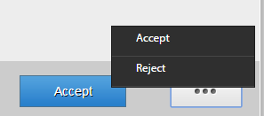

# 使用待辦事項清單{#working-with-to-do-lists}

在查看待辦事項清單時，您可能會看到業務流程中分配給您的任務，或您所屬的任何組的任務，或是其他用戶的共用任務。 您可以根據需要開啟、處理和完成任務，例如批准或拒絕請求或添加更多資訊。 完成任務後，將其發送給業務流程中的下一個人員，

## 關於待辦事項清單 {#about-todo-lists}

AEM Forms工作區有以下三種待辦事項清單：

* 單個清單，其中包含直接分配給您的任務。
* 組清單，其中包含分配給組的任務。 組的任何成員都可以開啟和完成任務。 要開啟任務，組的成員必須首先聲明該任務。
* 共用清單，包含分配給已與您（可能還有其他用戶）共用其待辦事項清單的用戶的任務。 共用清單的任何用戶都可以聲明、開啟和完成共用任務。

通過按一下將指針懸停在任務上時顯示的表徵圖，可以執行某些操作而不開啟任務。

>[!NOTE]
>
>感嘆號表徵圖表示任務具有高優先順序。

## 典型任務 {#typical-tasks}

開啟和處理任務時，您可用的工具取決於任務。 不同的任務要求您執行不同的操作，因此，某些工具可能或可能不可用。 下面介紹了您可能接收的典型任務。

* **提供資訊**:您會收到要求您完成並提交表單的任務。

* **查看資訊**:您會收到一個任務，該任務要求您查看資訊並註銷內容。

* **多用戶審閱**:您在其他用戶接收任務的同時接收任務。 您和其他用戶必須提供資訊或查看內容，或同時提供兩者。 以下工具可用於此類任務：

   * 查看任務的說明
   * 查看已分配任務的所有用戶的完成狀態
   * 查看所有分配了任務的用戶的注釋
   * 自己向任務添加註釋

可用於上述任一任務的其他工具包括：

* 前進
* 共用
* 咨詢
* 返回
* 附註
* 附件

## 正在開啟任務 {#opening-tasks}

您可以從待辦事項清單或聲明中開啟和鎖定任務，從組或共用待辦事項清單中開啟任務。 開啟任務時，它將顯示在主窗格中。 其它任務顯示在待辦事項清單旁邊的任務清單中。

如果存在「任務摘要URL」，則預設情況下會開啟「任務摘要」視圖，而不是與任務關聯的表單。 即使用戶在分配任務中啟用「以最大化模式開啟表單」選項，表單也不會以最大化模式開啟。

>[!NOTE]
>
>開啟任務時，根據任務預設值，關聯的表單可能顯示在全視圖中。

### 開啟並鎖定清單中的任務 {#open-and-lock-a-task-from-your-list}

當您從待辦事項清單中開啟任務時，如果您的清單是共用的，則可以鎖定該任務，以阻止有權訪問您的清單的其他用戶處理該任務。

1. 在待辦事項頁面的左窗格中，選擇您的單個待辦事項清單。 所有任務都顯示在中間窗格中。

   >[!NOTE]
   >
   >通過在「待辦事項」(To-do)清單中選擇進程類型，可以篩選任務。 您可以選擇待辦事項清單，以再次查看待辦事項清單中的所有任務。

1. 如有必要，請鎖定任務。 要鎖定任務，請按一下任務上的「所有選項」表徵圖，然後選擇「鎖定」。 將指針懸停在任務上以使選項可用。

   >[!NOTE]
   >
   >當任務開啟時，也可以在任何頁籤上鎖定或解鎖任務。

   

   任務上的「所有選項」菜單

1. 按一下任務以開啟該任務。

### 從共用或組清單中開啟並聲明任務 {#open-and-claim-a-task-from-a-shared-or-group-list}

當您開啟並從組或共用清單中聲明任務時，該任務將從組或共用清單移入您的單個待辦事項清單。 禁止對清單具有訪問權限的其他用戶處理該任務。

1. 在待辦事項頁面的左窗格中，選擇組或共用待辦事項清單。 所有任務都顯示在中間窗格中。
1. 執行以下步驟之一：

   * 要從組或共用待辦事項清單中聲明任務（不開啟任務），請按一下  **索賠** 將指針懸停在任務上。 或者，當任務開啟時，「聲明」按鈕可在任務窗格下方的操作欄中使用。 在申請後，任務將從組或共用待辦事項清單移到您的清單。
   * 要從組或共用待辦事項清單聲明並開啟任務，請按一下 **索賠和未結**。

## 處理任務 {#working-with-tasks}

開啟任務後，主窗格中顯示的頁籤和可供您使用的工具取決於任務。 您可能看到的頁籤如下所述：

* **任務摘要**:當任務開啟時，「任務摘要」窗格允許您使用在「分配任務」步驟的流程中指定的URL顯示有關該任務的資訊（如果存在）。 使用「任務摘要窗格」可以顯示任務的附加和相關資訊，以為AEM Forms工作區的最終用戶增加更多價值。 如果「任務摘要URL」不存在，則此頁籤不可用。

* **詳細資訊**:提供有關當前任務及其所屬進程的一些資訊。

* **窗體**:顯示與任務關聯的表單。 表單可以是多種檔案類型，包括PDF、HTML、指南和SWF檔案。 該表單看起來像一個常規可打印或基於Web的表單，或指導您通過一系列嚮導式面板來收集資訊。

* **歷史**:列出屬於流程實例的任務以及每個任務的關聯表單、任務分配和附件。

* **附件**:顯示與任務關聯的現有附件，並添加附件（如有必要）。

* **注釋**:顯示與任務關聯的現有附註，並添加附註（如有必要）。

在處理任務時，您可能看到的工具以及可以執行的操作將在下面介紹。

### 轉發、共用或查詢任務 {#forward-share-or-consult-on-a-task}

您可以將任務連同任何附註或附件轉發給其他用戶，或共用任務，或與其他用戶協商任務。 如果更改了與任務關聯的表單資料，請在轉發、共用或查閱任務之前將表單另存為草稿。 否則，任務將在不更新表單的情況下發送。 轉發和共用任務後，接收任務的用戶可以聲明並完成任務或將其返回給您。 如果您查詢任務，則用戶只能將任務返回給您。

1. 如果更改了與要保留的任務關聯的表單，請按一下 **保存**。 「保存」(Save)選項可在每個頁籤底部的操作欄中使用。 否則，任務將在不更新表單的情況下發送。

   >[!NOTE]
   >
   >「保存」按鈕對於某些表單不可用，具體取決於您正在處理的任務。

1. 在任何頁籤上，按一下以下按鈕之一：

   * **前進**
   * **共用**
   * **咨詢**

   >[!NOTE]
   >
   >根據任務的不同，您也可以從待辦事項清單執行這些操作，而不開啟任務。

1. 在彈出式對話框窗口中，搜索並選擇要轉發、共用或查閱任務的用戶名稱。

### 返回任務 {#return-a-task}

1. 在任何頁籤上，按一下 **返回**。 該任務將返回到先前將任務轉發給您、或與您共用或咨詢任務的用戶的待辦事項清單。

### 使任務離線 {#take-a-task-offline}

您可以離線處理任務，稍後從Adobe®Reader®或Adobe®Acrobat®專業®或Adobe®Acrobat®標準提交其表單。 提交表單後，您的電子郵件客戶端將使用相應的伺服器電子郵件地址啟動。 然後，您可以將填寫好的表單通過電子郵件發送至伺服器。

1. 在任何頁籤上，按一下 **離線**。
1. 指定檔案名以保存窗體，然後按一下 **保存**。 與任務關聯的表單將保存在本地，並且該任務將保留在待辦事項清單中，直到提交該表單為止。

### 使用附件 {#work-with-attachments}

您可以在本地添加、更新、刪除或保存任何附件。

**添加附件**

1. 在 **附件** 頁籤 **瀏覽** 的子菜單。
1. 選擇 **權限** 其他參與流程的用戶的附件級別。 如果選擇 **閱讀**，其他用戶可以將檔案保存到本地。 如果選擇了編輯權限之一，其他用戶也可以上載新檔案以替換附件。

   >[!NOTE]
   >
   >您還可以在附件旁邊添加註釋。

1. 按一下 **上載**。 檔案附加到窗體。

**查看附件**

1. 在 **附件** 頁籤，按一下要查看的附件的檔案名。

**在本地保存附件**

1. 按一下附件以開啟它。 將開啟的附件保存到本地。

**更新附件**

1. 按一下 **編輯** 的雙曲餘切值。 通過按一下 **瀏覽**。

**刪除附件**

1. 按一下 **刪除** 附件。

### 保存您的工作而不完成任務 {#save-your-work-without-completing-the-task}

1. 在任意頁籤上，點擊 **保存**。

   出現「另存為拔模」(Save As Draft)對話框。 草稿的預設名稱是任務模板中的任務名稱。

   

   >[!NOTE]
   >
   >可以配置工作區，以定期自動將用戶輸入的資訊另存為草稿。 如果啟用了自動保存，並且用戶正在處理草稿，則定期保存草稿。 如果自動保存，則自動獲取任務的預設名稱。
   >
   >
   >有關詳細資訊，請參閱定期在中保存草稿 [管理首選項](/help/forms/using/getting-started-livecycle-html-workspace.md)。

1. 在「另存為草稿」對話框中，為任務指定唯一名稱，然後點擊 **確定**。

   

   繪製將使用指定的名稱保存。 該任務將保留在「待辦事項」清單中，並且您在表單中所做的任何更改都將保存在「草稿」資料夾中。 此外，在「待辦事項」(To-do)清單中，可以使用草稿名稱搜索草稿以繼續處理草稿。

   

## 完成任務 {#completing-tasks}

任務的完成方式取決於任務本身和您在進程中的角色。 您可能被要求批准或拒絕請求、提供內容、查看和驗證資訊，或指示您已採取行動。

您可以以多種方式完成任務：

* 使用任何頁籤中的可用操作
* 使用窗體本身中生成的操作
* 從待辦事項清單，不開啟任務

>[!NOTE]
>
>如果 `isMustOpenToComplete` 未在 `Assign Task` 步驟，同時設計流程。

* 通過電子郵件，如果您收到電子郵件通知

完成任務後，可能會出現確認對話框，重申您的操作。 例如，您可能會看到一個對話框，提示您證明您提供的資訊的有效性。

>[!NOTE]
>
>如果更改了任務，但未準備完成任務，則可以通過按一下「保存」將您的工作另存為草稿，稍後返回。

### 完成任務 {#complete-a-task}

1. 執行以下步驟之一：

   * 選擇任務，然後按一下清單底部流程中所需的下一步的相應按鈕。
   * 如果表單沒有按鈕且「完成」按鈕在AEM Forms工作區中可用，請按一下 **完成**。
   * 如果表單具有按鈕且AEM Forms工作區中的「完成」按鈕不可用，請按一下表單上相應的按鈕，以執行流程中需要的下一步。

   如果表單沒有按鈕且AEM Forms工作區中的「完成」按鈕不可用，則會顯示一條消息，指出無法提交表單。

1. 如果出現「確認」(Confirmation)對話框，請執行以下操作之一：

   * 按一下 **確定** 如果您已完成該任務並準備登錄。
   * 按一下 **取消** 的子菜單。

>[!NOTE]
>
>在表單中使用「流程屬性」時，您可能會在HTML表單內看到「提交」按鈕。 當將同一窗體呈現為PDF時，此按鈕不可見。 要完成任務，請按一下位於AEM Forms工作區底部的「提交」按鈕，該按鈕位於表單外部，而不是表單內的「提交」按鈕。

### 批量審批任務 {#bulk-approve-tasks}

您可以從「待辦事項」清單提交多個任務。 只能同時提交具有相同任務名稱和相同路由選項的同一進程的任務。

>[!NOTE]
>
>如果在設計流程時未在工作台的「分配任務」步驟中選擇isMustOpenToComplete欄位，則此選項可用。

1. 在待辦事項頁面的左窗格中，選擇您的單個待辦事項清單。 所有任務都顯示在中間窗格中。
1. 選擇 **啟用批量模式**。 複選框顯示在清單中的任務前面。

   >[!NOTE]
   >
   >此選項不適用於在設計流程時在工作台的「分配任務」步驟中為其選擇了isMustOpenToComplete欄位的任務。 「待辦事項」清單中此類任務的複選框始終處於禁用狀態。

1. 選擇批量審批的任務。 可以選擇同一進程的多個任務，其任務名稱相同，路由選項相同。 選擇一個任務進行審批後，將只啟用具有相同進程、相同任務名稱和相同路由選項的任務。 其餘部分已禁用。

   

1. 按一下可用的「提交」選項。 將提交所選任務。

   

## 通過電子郵件參與任務 {#participating-in-tasks-through-email}

您可以通過電子郵件接收和完成任務。 通過電子郵件參與任務，無需定期檢查待辦事項清單以查找新任務，或檢查「跟蹤」頁以瞭解任務的狀態。

首先，設定您的AEM Forms工作區首選項以接收電子郵件通知。 AEM Forms工作區可以為「待辦事項」清單或您所屬的任何組「待辦事項」清單中的任務發送電子郵件通知。 管理員確定何時發送電子郵件通知消息以及接收者。

電子郵件可能包含在AEM Forms工作區中開啟任務的連結、用於任務的表單的附件或通過電子郵件完成任務的操作。 如果電子郵件中包含表單，則如果表單中內置了用於完成任務的按鈕，則可以開啟表單並完成任務。 如果用於完成任務的操作包含在電子郵件中，則可以通過按一下電子郵件中的操作或通過回復電子郵件來完成任務，操作在電子郵件正文中鍵入為第一行。

>[!NOTE]
>
>* 要配置工作區以使用相應的電子郵件模板，請參閱 [AEM FormsJEE管理員指南](https://help.adobe.com/en_US/AEMForms/6.1/AdminHelp/)。
>
>* 如果在AEM Forms工作區中提交任務後轉發草稿，則會發送電子郵件通知。 如果從AEM Forms工作區的起點轉發草稿，則不會發送電子郵件通知。

通過電子郵件完成任務時，該任務將從AEM Forms工作區的待辦事項清單中刪除。

>[!NOTE]
>
>如果用戶未登錄到瀏覽器中的AEM Forms工作區並開啟指向待辦事項的連結，則直接待辦事項連結無法開啟並顯示異常。 在按一下電子郵件中的連結之前，請登錄AEM Forms工作區。

>[!NOTE]
>
>您不能轉發電子郵件通知將任務分配給其他人。 您只能將任務從AEM Forms工作區轉發給其他用戶。

### 接收電子郵件通知消息 {#receive-email-notification-messages}

1. 按一下 **首選項**。
1. 在 **通過電子郵件通知任務事件** 清單，選擇 **是**。
1. 要將表單和資料與電子郵件一起包含，請在 **在電子郵件中附加Forms** 清單，選擇 **是**。

## 通過移動設備參與任務 {#participating-in-tasks-through-mobile-devices}

您可以使用AEM Forms工作區應用從移動設備參與任務。 在安裝應用程式之前，請與系統管理員聯繫，以確保您的組織支援使用AEM Forms工作區應用。

## 關於截止日期和提醒 {#about-deadlines-and-reminders}

A *截止* 確定任務完成日期和時間。 當最後期限過後，伺服器將任務路由到進程的下一步（可以是其他用戶的待辦事項清單），然後任務上會顯示最後期限表徵圖。 無論與進程關聯的規則如何，都會顯示截止時間表徵圖。

A *提醒* 通知您需要您注意的任務。 提醒在預定時間發生，然後定期發生，直到您完成相關任務。 收到提醒時，該任務上會顯示提醒表徵圖。

業務流程確定截止日期和提醒的行為和時間。 並非所有進程都有截止日期和提醒。 管理員指定是否發送電子郵件通知以確定截止日期和提醒。 您可以設定是否接收電子郵件通知的首選項。

## 處理來自組和共用隊列的任務 {#working-with-tasks-from-group-and-shared-queues}

分配給您的所有任務都將顯示在「待辦事項」清單（隊列）中。

您有權訪問的任何組和共用待辦事項清單也顯示在待辦事項頁面的左側窗格中。 您可以從您有權訪問的任何待辦事項清單中完成任務。

組待辦事項清單可能具有多個成員。 管理員根據組織的特定要求設定組待辦事項清單。 組待辦事項清單提供了一種將工作分配給具有類似職責的幾個人的方法。

例如，您團隊的每個成員都處理貸款申請表。 所有這些任務都發送到組的每個成員都有權訪問的組待辦事項清單。 組中的每個成員都可以從該待辦事項清單訪問任務。

當其他用戶與您共用其待辦事項清單，或明確與您共用任務時，將顯示共用待辦事項清單。 然後，您可以查看該用戶的待辦事項清單中的任務，並代表該用戶完成這些任務。 例如，如果您正在休假，您可以選擇與在您不在時完成任務的同事共用待辦事項清單。

>[!NOTE]
>
>您還可以指定外出設定，以便在您不在時將任務轉發給其他用戶。

要從組或共用待辦事項清單中處理任務，請先聲明該任務。 然後，在完成任務或將其轉發給其他用戶之前，您將成為任務的所有者。

### 共用隊列 {#sharing-queues}

您可以與其他用戶共用待辦事項清單，然後該用戶可以查看待辦事項清單中的新任務，並為您執行這些任務。 如果在共用待辦事項清單之前，待辦事項清單中存在任何任務，則其他用戶無法查看這些任務。 在您授予對待辦事項清單的訪問權限後，用戶只能查看並聲明到達待辦事項清單中的任務。

請記住，對於用戶要查看共用隊列中的任務，進程設計器必須在用戶服務的「任務訪問控制清單(ACL)」頁籤上啟用「為共用隊列添加ACL」選項。

>[!NOTE]
>
>如果您計畫離開辦公室，您還可以指定離開辦公室設定，以便在您離開時將任務轉發給其他用戶，而不是共用整個待辦事項清單。

**共用隊列**

1. 在 **隊列** 的 **首選項** 頁籤，按一下「當前共用我的隊列的用戶」的「+」表徵圖。
1. 搜索並選擇用戶的名稱。
1. 按一下 **共用** 按鈕與選定用戶共用隊列。
1. 選擇用戶名稱，然後按一下 **共用**。

   >[!NOTE]
   >
   >通過按一下，可以刪除用戶共用待辦事項清單 **X** 表徵圖。

### 訪問其他隊列 {#accessing-other-queues}

您可以請求訪問其他用戶的待辦事項清單，以查看和聲明用戶待辦事項清單中的任何新任務。

當您請求訪問其他用戶的待辦事項清單時，用戶將在其待辦事項清單中接收任務，以批准或拒絕您的請求。 用戶完成任務後，您將在「待辦事項」清單中收到通知。

如果您被授予對其他用戶的待辦事項清單的訪問權限，則在您被授予訪問權限之前，您不能查看用戶的待辦事項清單中存在的任何任務。 您只能查看在被授予對待辦事項清單的訪問權限後，到達用戶待辦事項清單的任務。

**訪問其他隊列**

1. 在 **首選項** ，開啟 **隊列** 頁籤。
1. 按一下「+」以查看「我有權訪問的用戶隊列」。 在彈出式對話框中搜索用戶的名稱。
1. 選擇用戶名稱，然後按一下 **請求**。

   >[!NOTE]
   >
   >您可以從「我有權訪問的用戶隊列」清單中選擇用戶名並按一下，從而刪除對另一個待辦事項清單的訪問權限 **X** 在行的末尾提及用戶名。 當訪問待辦事項清單的請求仍處於掛起狀態時，您無法刪除對其他待辦事項清單的訪問權限。

## 設定外出首選項 {#setting-out-of-office-preferences}

如果您計畫外出，則可以指定在該期間分配給您的任務的處理方式。

您可以選擇指定開始日期和時間以及結束日期和時間，以使您的離職設定生效。 如果您位於與伺服器不同的時區，則使用的時區是伺服器的時區。

您可以設定將所有任務發送到的預設人員。 您還可以指定特定進程中的任務的例外，這些任務將發送到其他用戶或保留在待辦事項清單中，直到您返回。 如果指定的人員也不在辦公室，則任務將交給他們指定的用戶。 如果無法將任務分配給不在辦公室的用戶，則任務將保留在待辦事項清單中。

>[!NOTE]
>
>當您外出時，先前在「待辦事項」清單中的任何任務都會保留，不會轉發給其他用戶。

### 設定外出首選項 {#set-out-of-office-preferences}

1. 按一下 **首選項** 按一下 **離職**。
1. 要指定您離開辦公室的時間，請執行以下步驟之一：

   * 要指定您現在不在辦公室，請在 **我當前** 清單，選擇 **外出** 但不要添加日期範圍。
   * 要指定您不在辦公室的開始日期和時間，請按一下「+」 **外出計畫**。 使用日曆和時間清單指定開始日期和時間。 如果未指定結束日期和時間，則從開始日期和時間開始，直到更改首選項為止，您將被視為無限期離開辦公室。

1. 要指定預設處理任務的方式，請從 **外出時：外出任務的預設用戶** 清單：

   * 選擇 **不分配** 將任務保留在待辦事項清單中，直到您返回。
   * 選擇 **查找用戶** 以搜索要將任務分配給的用戶。 選擇用戶時，您還可以查看其外出時間表。

1. 要將異常設定為預設值，請按一下+ **處理異常**，選擇要為其建立異常的流程，然後選擇其他用戶或選擇 **不分配** 從 **分配給** 清單框。

   >[!NOTE]
   >
   >進程設計器可以指定某些進程的任務始終保持為私有，而不是轉發給其他用戶。 此設定將覆蓋您所做的任何設定。

1. 完成設定首選項後，按一下 **保存**。 如果您的設定表明您當前不在辦公室，則您的更改將立即生效。 否則，它們將在指定的開始日期和時間生效。 如果您在離開辦公室時登錄，則在更改設定之前，不會考慮在辦公室中。
