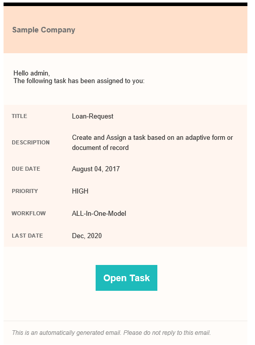

# 在電子郵件通知中使用中繼資料 {#use-metadata-in-an-email-notification}

您可以使用「分配任務」步驟來建立任務並將其分配給用戶或組。 將任務分配給用戶或組時，會向定義的用戶或定義組的每個成員發送電子郵件通知。 典型的 [電子郵件通知](../../forms/using/use-custom-email-template-assign-task-step.md) 包含已分配任務的連結和與任務相關的資訊。

您可以在電子郵件範本中使用中繼資料，以動態填入電子郵件通知中的資訊。 例如，在執行階段（產生電子郵件通知時）動態選取下列電子郵件通知中的標題、說明、到期日、優先順序、工作流程和最後日期的值。



中繼資料儲存在索引鍵值配對中。 您可以在電子郵件範本中指定金鑰，而金鑰在執行階段（產生電子郵件通知時）會以值取代。 例如，在以下程式碼範例中，「$ {workitem_title} 」是索引鍵。 在執行階段會以「Loan-Request」值取代。

```html
subject=Task Assigned - ${workitem_title}

message=<html><body>\n\
 <table style="width: 480px; font-family: Helvetica, Arial, sans-serif; border: 0; padding: 0; vertical-align: top; text-align: left; word-wrap: break-word; margin: 16px auto; color:#323232; background-color:#FFFCF9; border-collapse: collapse;">\n\
  <tbody>\n\
   <tr>\n\
    <td style="height: 100px; width: 480px; background-color: #FFE0CB; border-top: 5pt solid black; font-family: Helvetica, Arial, sans-serif; font-weight: bold; font-size: 15px; line-height: 20px; padding: 12px; color: #707070;">\n\
      Sample Company\n\
    </td>\n\
   </tr>\n\
   <tr>\n\
    <td style="font-family: Helvetica, Arial, sans-serif; height: auto; background-color: #FFFCF9; padding: 32px 16px 20px 16px; ">\n\
     <pre style="font-size: 13px; font-family: Helvetica, Arial, sans-serif;  font-weight: normal; color: #323232;"> Hello ${workitem_assignee},\n\
 The following task has been assigned to you:</pre>\n\
    </td>\n\
   </tr>\n\
   <tr>\n\
    <td style="width: 480px;">\n\
     <table style="height: auto; width: 480px; background-color:#FFFBF9; font-family: Helvetica, Arial, sans-serif; border-collapse: collapse;">\n\
      <tbody>\n\
       <tr style="border-bottom: solid 2px #FFFCF9;">\n\
        <td style="font-family: Helvetica, Arial, sans-serif; width: auto; height: auto; background-color:#FFF5EF; font-weight: bold; font-size: 11px; line-height: 20px; padding: 12px; color: #707070;"> TITLE</td>\n\
        <td style="font-family: Helvetica, Arial, sans-serif; background-color:#FFF5EF; text-align: left; vertical-align: middle; height: auto; font-weight: normal; font-size: 13px; line-height: 20px; padding: 10px 16px 10px 32px; color: #323232;">\n\
         <p>${workitem_title}</p>\n\
        </td>\n\
       </tr>\n\
                            <tr style="border-bottom: solid 2px #FFFCF9;">\n\
        <td style="font-family: Helvetica, Arial, sans-serif; width: auto; height: auto; background-color:#FFF5EF; font-weight: bold; font-size: 11px; line-height: 20px; padding: 12px; color: #707070;"> DESCRIPTION</td>\n\
        <td style="font-family: Helvetica, Arial, sans-serif; background-color:#FFF5EF; text-align: left; vertical-align: middle; height: auto; font-weight: normal; font-size: 13px; line-height: 20px; padding: 10px 16px 10px 32px; color: #323232;">\n\
         <p>${workitem_description}</p>\n\
        </td>\n\
       </tr>\n\
       <tr style="border-bottom: solid 2px #FFFCF9;">\n\
        <td style="font-family: Helvetica, Arial, sans-serif; width: auto; height: auto; background-color:#FFF5EF; font-weight: bold; font-size: 11px; line-height: 20px; padding: 12px; color: #707070;"> DUE DATE</td>\n\
        <td style="font-family: Helvetica, Arial, sans-serif; background-color:#FFF5EF; text-align: left; vertical-align: middle; height: auto; font-weight: normal; font-size: 13px; line-height: 20px; padding: 10px 16px 10px 32px; color: #323232;">\n\
         <p>${workitem_due_date}</p>\n\
        </td>\n\
       </tr>\n\
       <tr style="border-bottom: solid 2px #FFFCF9;">\n\
        <td style="font-family: Helvetica, Arial, sans-serif; width: auto; height: auto; background-color:#FFF5EF; font-weight: bold; font-size: 11px; line-height: 20px; padding: 12px; color: #707070;"> PRIORITY</td>\n\
        <td style="font-family: Helvetica, Arial, sans-serif; background-color:#FFF5EF; text-align: left; vertical-align: middle; height: auto; font-weight: normal; font-size: 13px; line-height: 20px; padding: 10px 16px 10px 32px; color: #323232;">\n\
         <p>${workitem_priority}</p>\n\
        </td>\n\
       </tr>\n\
       <tr>\n\
        <td style="font-family: Helvetica, Arial, sans-serif; width: auto; height: auto; background-color:#FFF5EF; font-weight: bold; font-size: 11px; line-height: 20px; padding: 12px; color: #707070;"> WORKFLOW</td>\n\
        <td style="font-family: Helvetica, Arial, sans-serif; background-color:#FFF5EF; text-align: left; vertical-align: middle; height: auto; font-weight: normal; font-size: 13px; line-height: 20px; padding: 10px 16px 10px 32px; color: #323232;">\n\
         <p>${workitem_workflow}</p>\n\
        </td>\n\
       </tr>\n\
      </tbody>\n\
     </table>\n\
    </td>\n\
   </tr>\n\
   <tr style = "text-align: center; vertical-align: middle;">\n\
    <td style="padding:48px 0 72px 0;"> \n\
     <a href="${workitem_url}" target="_blank" style="background-color: #1EBBBB; font-size: 18px; line-height: 25px; font-weight: bold; color: #FFFFFF; text-decoration: none; padding: 15px 15px 15px 15px;">Open Task</a>\n\
    </td>\n\
   </tr>\n\
   <tr>\n\
    <td style="border-top: solid 1px #EDEAE7; padding: 16px;">\n\
     <p><span style="font-size: 12px; font-weight: normal; font-style: italic; color: #919191;">This is an automatically generated email. Please do not reply to this email.</code></p>\n\
    </td>\n\
   </tr>\n\
  </tbody>\n\
 </table>\n\
</body>\n\
</html>\n\
```

## 在電子郵件通知中使用系統產生的中繼資料 {#using-system-generated-metadata-in-an-email-notification}

AEM Forms應用程式提供數個立即可用的中繼資料變數（索引鍵值配對）。 您可以在電子郵件範本中使用這些變數。 變數的值以相關聯的表單應用程式為基礎。 下表列出所有可立即使用的中繼資料變數：

<table>
 <tbody> 
  <tr> 
   <td>關鍵</td> 
   <td>說明</td> 
  </tr> 
  <tr> 
   <td>workitem_title</td> 
   <td>關聯表單應用程式的標題。</td> 
  </tr> 
  <tr> 
   <td>workitem_url</td> 
   <td>存取相關表單應用程式的URL。</td> 
  </tr> 
  <tr> 
   <td>workitem_description</td> 
   <td>關聯表單應用程式的說明。</td> 
  </tr> 
  <tr> 
   <td>workitem_priority</td> 
   <td>為關聯的表單應用程式指定的優先順序。</td> 
  </tr> 
  <tr> 
   <td>workitem_due_date</td> 
   <td>對相關表單應用程式執行操作的最後日期。</td> 
  </tr> 
  <tr> 
   <td>workitem_workflow</td> 
   <td>與表單應用程式相關聯的工作流程名稱。</td> 
  </tr> 
  <tr> 
   <td>workitem_assign_timestamp</td> 
   <td>將工作流項目分配給當前受託人的日期和時間。</td> 
  </tr> 
  <tr> 
   <td>workitem_assignee</td> 
   <td>當前受託人的名稱。</td> 
  </tr> 
  <tr> 
   <td>host_prefix</td> 
   <td>作者伺服器的URL。 例如， https://10.41.42.66:4502<br /> </td> 
  </tr> 
  <tr> 
   <td>publish_prefix</td> 
   <td>發佈伺服器的URL。 例如， https://10.41.42.66:4503</td> 
  </tr> 
 </tbody> 
</table>

## 在電子郵件通知中使用自訂中繼資料 {#using-custom-metadata-in-an-email-notification}

您也可以在電子郵件通知中使用自訂中繼資料。 自訂中繼資料除了系統產生的中繼資料外，還包含資訊。 例如，從資料庫檢索的策略詳細資訊。 您可以使用ECMAScript或OSGi套件組合，在crx-repository中新增自訂中繼資料：

### 使用ECMAScript來新增自訂中繼資料  {#use-ecmascript-to-add-custom-metadata}

[ECMAScript](https://en.wikipedia.org/wiki/ECMAScript) 是指令碼語言。 用於用戶端指令碼和伺服器應用程式。 執行下列步驟以使用ECMAScript來為電子郵件範本新增自訂中繼資料：

1. 使用管理帳戶登入CRX DE。 URL為https://&#39;[伺服器]:[埠]&#39;/crx/de/index.jsp

1. 導覽至/apps/fd/dashboard/scripts/metadataScripts。 建立副檔名為.ecma的檔案。 例如， usermetadata.ecma

   如果上述路徑不存在，請建立它。

1. 將程式碼新增至.ecma檔案，此檔案具有在索引鍵值配對中產生自訂中繼資料的邏輯。 例如，以下ECMAScript代碼為保險單生成自定義元資料：

   ```javascript
   function getUserMetaData()  {
       //Commented lines below provide an overview on how to set user metadata in map and return it.
       var HashMap = Packages.java.util.HashMap;
       var valuesMap = new HashMap();
       valuesMap.put("policyNumber", "2017568972695");
       valuesMap.put("policyHolder", "Adobe Systems");
   
       return valuesMap;
   }
   ```

1. 按一下「全部儲存」 。 現在，指令碼可供AEM工作流程模型中選取。

   

1. （選用）指定指令碼的標題：

   如果未指定標題，則「自定義元資料」欄位將顯示ECMAScript檔案的完整路徑。 執行下列步驟以指定指令碼有意義的標題：

   1. 展開指令碼節點，按一下右鍵 **[!UICONTROL jcr:content]** 節點，然後按一下 **[!UICONTROL Mixins]**.
   1. 在「編輯Mixin」對話方塊中輸入mix:title ，然後按一下 **+**.
   1. 新增包含下列值的屬性。

      | 名稱 | jcr:title |
      |---|---|
      | 類型 | 字串 |
      | 值 | 指定指令碼的標題。 例如，策略保持器的自定義元資料。 指定值顯示在分配任務步驟中。 |

### 使用OSGi套件組合和Java介面來新增自訂中繼資料 {#use-an-osgi-bundle-and-java-interface-to-add-custom-metadata}

您可以使用WorkitemUserMetadataService Java介面為電子郵件範本新增自訂中繼資料。 您可以建立使用WorkitemUserMetadataService Java介面的OSGi套件組合，並將其部署至AEM Forms伺服器。 它使元資料在「分配任務」步驟中可供選擇。

若要使用Java介面建立OSGi套件組合，請新增 [AEM Forms用戶端SDK](https://helpx.adobe.com/aem-forms/kb/aem-forms-releases.html) 罐子 [花崗岩](https://repo1.maven.org/maven2/com/adobe/granite/com.adobe.granite.workflow.api/1.0.2/) 檔案作為OSGi套件專案的外部相依性。 您可以使用任何Java IDE來建立OSGi套件組合。 下列程式提供使用Eclipse建立OSGi套件組合的步驟：

1. 開啟Eclipse IDE。 導覽至「檔案>新增專案」。

1. 在「選擇嚮導」螢幕上，選擇「Maven項目」，然後按一下「下一步」。

1. 在New Maven專案中保留預設值，然後按一下「下一步」 。 選取原型，然後按「下一步」 。 例如， maven-archetype-quickstart。 指定項目的組ID、對象ID、版本和包，然後按一下「完成」。 專案隨即建立。

1. 開啟pom.xml檔案以進行編輯，並以下列項目取代檔案的所有內容：

1. 新增使用WorkitemUserMetadataService Java介面的原始碼，以新增電子郵件範本的自訂中繼資料。 以下列出范常式式碼：

   ```java
   package com.aem.impl;
   
   import com.adobe.fd.workspace.service.external.WorkitemUserMetadataService;
   import org.apache.felix.scr.annotations.Component;
   import org.apache.felix.scr.annotations.Properties;
   import org.apache.felix.scr.annotations.Property;
   import org.apache.felix.scr.annotations.Service;
   import org.osgi.framework.Constants;
   
   import java.util.HashMap;
   import java.util.Map;
   
   @Component
   @Service
   @Properties({
           @Property(name = Constants.SERVICE_DESCRIPTION, value = "A sample implementation of a user metadata service."),
           @Property(name = WorkitemUserMetadataService.SERVICE_PROPERTY_LABEL, value = "Default User Metadata Service")})
   
   public class WorkitemUserMetadataServiceImpl
     implements WorkitemUserMetadataService
   {
     public WorkitemUserMetadataServiceImpl() {}
   
     public Map<String, String> getUserMetadataMap()
     {
       HashMap<String, String> metadataMap = null;
       metadataMap = new HashMap();
       metadataMap.put("test_metadata", "tested-interface implementation");
       return metadataMap;
     }
   }
   ```

1. 開啟命令提示字元，並導覽至包含OSGi套件專案的目錄。 使用以下命令建立OSGi捆綁包：

   `mvn clean install`

1. 將套件組合上傳至AEM Forms伺服器。 您可以使用AEM Package Manager將套件組合匯入AEM Forms伺服器。

匯入套件組合後，您可以在「指派任務」步驟中選取中繼資料，並將其用於電子郵件範本。
