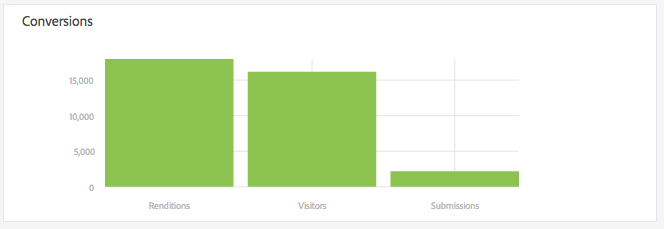

# 檢視並瞭解AEM Forms分析報表 {#view-and-understand-aem-forms-analytics-reports}

Adobe Experience Manager Forms與Adobe Analytics整合，可讓您擷取並追蹤已發佈表單和檔案的效能量度。 分析這些量度的目的，是根據使表單或檔案更有用所需變更的資料，做出明智的決策。

## 設定分析 {#setting-up-analytics}

AEM Forms中的分析功能是AEM Forms附加套件的一部分。 如需安裝附加元件套件的詳細資訊，請參 [閱安裝與設定AEM Forms](../../forms/using/installing-configuring-aem-forms-osgi.md)。

除了附加元件套件外，您還需要Adobe Analytics帳戶。 如需解決方案的詳細資訊，請參 [閱Adobe Analytics](https://www.adobe.com/solutions/digital-analytics.html)。

在您取得AEM Forms附加元件套件和Adobe Analytics帳戶後，請將Adobe Analytics帳戶與AEM Forms整合，並啟用表單或檔案的追蹤，如「設定分析和報 [告」所述](../../forms/using/configure-analytics-forms-documents.md)。

### 如何記錄使用者互動資訊 {#how-user-interaction-information-is-recorded}

當使用者與表單互動時，互動會被記錄並傳送至Analytics伺服器。 下列清單指出伺服器對各種使用者活動的呼叫：

* 每次瀏覽每個欄位2次呼叫
* 1個小組瀏覽
* 儲存1個
* 2.提交
* 2：節省
* 1個協助
* 1個驗證錯誤
* 表單轉譯1個+預設面板1個+預設第1個欄位瀏覽1個
* 2表單放棄

>[!NOTE]
>
>這份清單並非完整無遺。

### 檢視分析報表 {#summary-report}

執行下列步驟以檢視分析報表：

1. 登入AEM入口網站： `https://[hostname]:[port]`
1. 按一 **下「表單>表單與檔案」**。
1. 選取您要檢視分析報表的表單。
1. 選取 **更多> Analytics報表**。

**** 答：Analytics報表命令

AEM Forms會針對表單和表單中每個面板顯示分析報表，如下所示。

************ 答：轉換 **B.表單層級摘**&#x200B;要C.**面板層級摘**&#x200B;要D.訪客的瀏覽器——篩選 **器E。訪客作業系統——篩選**&#x200B;器F。訪客語言——篩選

依預設，會顯示最近7天的分析報表。 您可以檢視最近15天、最近1個月等的報表，或指定日期範圍。

>[!NOTE]
>
>「最近7天」和「最近15天」等選項不包含您產生分析報表當日的資料。 若要包含目前日期的資料，您必須指定包含目前日期的日期範圍，然後執行報表。

### 最適化和HTML5表單的轉換圖 {#conversions-graph-for-adaptive-and-html-forms}

表單層級轉換圖可讓您深入瞭解表單在下列關鍵績效指標(KPI)上的績效：

* **轉譯**:表單的開啟次數
* **訪客**:表單的訪客數
* **提交**:提交表單的次數

### 最適化和HTML5表單的分析報表 {#analytics-report-for-adaptive-and-html-forms}

表單層級摘要區段可讓您深入瞭解表單在下列關鍵績效指標(KPI)上的績效：

* **平均填寫時間**:填寫表格的平均時間。 當使用者花時間在表單上但未提交時，該時間不會納入此計算中。
* **轉譯**:表單已轉譯或開啟的次數
* **草稿**:表單已儲存為草稿的次數
* **提交**:提交表單的次數
* **中止**:使用者開始填寫表格，然後離開而未填寫表格的次數
* **獨特訪客**:獨特訪客呈現表單的次數。 如需獨特訪客的詳細資訊，請參 [閱獨特訪客、瀏覽和客戶行為](https://helpx.adobe.com/analytics/kb/unique-visitors-visitor-behavior.html)。

### Panel report {#bottom-summary-report}

面板層級摘要區段提供下清單單中每個面板的相關資訊：

* **平均填滿時間**:在面板上的平均逗留時間，不論表單是否提交
* **遇到錯誤**:使用者在面板欄位上遇到的平均錯誤數。 「遇到的錯誤」是透過將欄位中的錯誤總數除以表單的轉譯數來達到的。
* **存取的說明**:使用者存取面板中欄位之內容相關說明的平均次數。 「存取的說明」是透過將欄位的「說明」存取總次數除以表格轉譯數來到達。

#### 詳細的面板報告 {#detailed-panel-report}

您也可以按一下「面板報表」中的面板名稱，以檢視每個面板的詳細資訊。

詳細報表顯示面板中所有欄位的值。

「面板報表」有三個標籤：

* **時間報表**（預設值）:顯示在面板中填寫每個欄位所花費的時間（秒數）
* **錯誤報告**:顯示使用者在填寫欄位時遇到的錯誤數
* **說明報告**:存取特定欄位說明的次數

如果有多個面板可用，您可以在面板之間導覽。

### 篩選條件：瀏覽器、作業系統和語言 {#filters-browser-os-and-language}

「瀏覽器分發」、「作業系統分發」和「語言分發」表格會依瀏覽器、作業系統和表單使用者的語言來顯示轉譯、訪客和提交內容。 這些表預設顯示最多5個條目。 您可以按一下「顯示更多」以顯示更多項目，然後按一下「顯示更少」返回一般的五個或更少項目。

若要進一步篩選分析資料，您可以按一下任何表格中的項目。 例如，如果您按一下「瀏覽器分發」表格中的「Google Chrome」，報表會再次呈現，並包含與Google Chrome瀏覽器相關的資料，如下所示：

如果您在套用篩選後檢視面板報表，面板報表資料也會根據套用的篩選顯示。

套用篩選後：

* 分發表變成唯讀，因為一次只能套用一個篩選。
* 所套用篩選的表格會消失。
* 您可以按一下「關閉」按鈕（反白顯示於下方），移除已套用的篩選。

### A/B測試 {#a-b-testing}

如果您已啟用A/B測試並設定表單，報表頁面會有下拉式清單，您可用來顯示A/B測試報表。 A/B測試報表會顯示您所設定之兩個表單版本的比較效能。

如需A/B測試的詳細資訊，請參 [閱建立和管理最適化表單的A/B測試](../../forms/using/ab-testing-adaptive-forms.md)。
