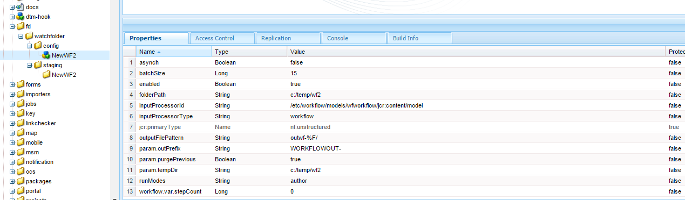

# AEM Forms中的Watched資料夾{#watched-folder-in-aem-forms}

管理員可以設定網路資料夾（稱為「Watched Folder」），如此當使用者將檔案（例如PDF檔案）置於「Watched Folder」中時，就會啟動預先設定的工作流程、服務或指令碼操作，以處理新增的檔案。 服務執行指定的操作後，會將結果檔案保存到指定的輸出資料夾中。 如需工作流程、服務和指令碼的詳細資訊，請參 [閱各種檔案處理方法](../../forms/using/watched-folder-in-aem-forms.md#main-pars-header-4)。

## 建立Watched資料夾 {#create-a-watched-folder}

您可以使用下列其中一種方法，在檔案系統上建立「Watched資料夾」:

* 在配置Watched資料夾配置節點的屬性時，在folderPath屬性中鍵入父目錄的完整路徑，並附加要建立的Watched資料夾的名稱，如下例所示： `C:/MyPDFs/MyWatchedFolder`\
   資 `MyWatchedFolder`料夾不存在，AEM Forms會嘗試在指定的路徑上建立資料夾。

* 在配置「監視資料夾」端點之前，在檔案系統上建立資料夾，然後在folderPath屬性中提供完整路徑。 如需folderPath屬性的詳細資訊，請參閱「 [Watched資料夾屬性」](../../forms/using/watched-folder-in-aem-forms.md#main-pars-header-1)。

>[!NOTE]
>
>在叢集環境中，用作「Watched」（監視）資料夾的資料夾必須可在檔案系統或網路上存取、可寫入及共用。 群集的每個應用程式伺服器實例都必須具有對同一共用資料夾的訪問權限。 在Windows上，在所有伺服器上建立映射的網路驅動器，並在folderPath屬性中指定映射的網路驅動器的路徑。

## 「建立監視資料夾」配置節點 {#create-watched-folder-configuration-node}

要配置「監視資料夾」，請建立「監視資料夾」配置節點。 執行以下步驟建立配置節點：

1. 以管理員身分登入CRX-DE Lite，並導覽至/etc/fd/watchfolder/config資料夾。

1. 建立類型節點 `nt:unstructured`。 例如，watchedfolder

   >[!NOTE]
   >
   >「監視資料夾」節點名稱不能包含空格和特殊字元。

1. 將以下屬性添加到節點：

   * `folderPath`
   * `inputProcessorType`
   * `inputProcessorId`
   * `outputFilePattern`
   如需支援屬性的完整清單，請參閱「 [Watched資料夾屬性」](../../forms/using/watched-folder-in-aem-forms.md#main-pars-header-1)。

1. 按一下「 **全部儲存**」。 建立節點並保存屬性後。 在屬 `input`性中指 `result`定的路徑上建立、、、 `failure`和 `preserve`資料夾 `stage``folderPath` 。

   掃描作業會在定義的時間間隔開始掃描「監視資料夾」。

## Watched資料夾屬性 {#watchedfolderproperties}

您可以為「Watched」（監視）資料夾配置以下屬性。

* **folderPath（字串）**:要在定義的時間間隔內掃描的資料夾路徑。 對於群集環境，資料夾必須位於與所有具有伺服器完全訪問權限的伺服器共用的位置。 這是強制屬性。
* **inputProcessorType（字串）**:要啟動的進程的類型。 您可以指定工作流程、指令碼或服務。 這是強制屬性。
* **inputProcessorId（字串）**:inputProcessorId屬性的行為基於為inputProcessorType屬性指定的值。 這是強制屬性。 以下清單詳細說明了inputProcessorType屬性的所有可能值以及inputProcessorType屬性的相應必要條件：

   * 對於工作流，指定要執行的工作流模型。 例如，/etc/workflow/models/&lt;workflow_name>/jcr:content/model
   * 對於指令碼，指定要執行的指令碼的JCR路徑。 例如，/etc/fd/watchfolder/test/testScript.ecma
   * 對於服務，請指定用於查找OSGi服務的篩選器。 此服務已註冊為com.adobe.aemfd.watchfolder.service.api.ContentProcessor Interface的實作。

* **runModes（字串）**:以逗號分隔的允許執行工作流程模式清單。 以下是幾個例子：

   * 作者

   * 發佈

   * author,publish

   * 發佈，作者

**注意**:如 *果代管Watched資料夾的伺服器沒有任何指定的執行模式，則無論伺服器上的執行模式為何，Watched資料夾都會一律啟動。*

* **outputFilePattern(String)**:輸出檔案的模式。 可以指定資料夾或檔案模式。 如果指定了資料夾模式，則輸出檔案的名稱將如工作流中所述。 如果指定了檔案模式，則輸出檔案的名稱如檔案模式中所述。 [檔案和資料夾模式](../../forms/using/watched-folder-in-aem-forms.md#p-file-and-folder-patterns-p) ，也可以指定輸出檔案的目錄結構。 這是強制屬性。

* **stageFileExpirationDuration(Long, default -1)**:在已被擷取以進行處理的輸入檔案／資料夾之前等待的秒數，應視為已逾時並標示為失敗。 只有當此屬性的值為正數時，才會啟動此過期機制。

   **** 注意：即 *使使用此機制將輸入標示為已逾時，它仍可能在背景中處理，但所花的時間卻比預期多。 如果在逾時機制啟動之前已使用輸入內容，處理程式甚至可能在稍後繼續完成，並將輸出轉儲到結果資料夾。 如果內容未在逾時前被使用，則處理很可能會在稍後嘗試使用內容時發生錯誤，而且此錯誤也會記錄在相同輸入的失敗資料夾中。 另一方面，如果由於間歇性工作／工作流失火（即失效機制所要解決的情況）而未啟動輸入的處理，那麼當然，這兩種情況都不會發生。 因此，對於因超時而標籤為失敗的故障資料夾中的任何條目（查找「在經過相當長的時間後未處理檔案，標籤為失敗！」格式的消息） 在故障日誌中)，建議掃描結果資料夾（以及失敗資料夾本身，以查找相同輸入的另一個條目），以檢查是否實際發生了先前描述的任何意外情況。*

* 
* **** deleteExpiredStageFileOnlyWhenTachled（布林值，預設為true）:過期機制是否應僅在監控資料夾已調節時啟動。 該機制與調節的監控資料夾更相關，因為在未處理狀態中遊蕩的少量檔案（由於間歇性作業／工作流失火）在啟用調節時有可能阻塞整個批的處理。 如果此屬性保留為true（預設值），則未調節的監看資料夾的過期機制將不會啟動。 如果屬性保持為false，則只要stageFileExpirationDuration屬性為正數，機制就一律會啟動。

* **pollInterval（長）**:掃描「監視資料夾」進行輸入的間隔（秒）。 除非啟用「限制」設定，否則輪詢間隔應比處理平均作業的時間長；否則，系統可能會超載。 預設值為5。 如需詳細資訊，請參閱批次大小的說明。 輪詢間隔的值必須大於或等於1。
* **excludeFilePattern（字串）**:分號(;)分隔的模式清單，「Watched Folder」會使用它來判斷要掃描和擷取的檔案和檔案夾。 不會掃描任何具有此模式的檔案或資料夾以進行處理。 當輸入是包含多個檔案的檔案夾時，此設定很實用。 資料夾的內容可以複製到名稱由「監視資料夾」挑選的資料夾中。 這可防止「監視資料夾」在資料夾完全複製至輸入資料夾之前，先擷取資料夾以進行處理。 預設值為null。\
   您可以使用 [檔案模式](../../forms/using/watched-folder-in-aem-forms.md#p-file-and-folder-patterns-p) 來排除：

   * 具有特定檔案副檔名的檔案；例如*.dat、*.xml、.pdf、*。*
   * 具有特定名稱的檔案；例如，data*會排除名為data1、data2等的檔案和資料夾。
   * 名稱和副檔名中包含複合表達式的檔案，如下例所示：

      * 資料[0-9][0-9][0-9]。[dD][aA][tT]
      * *.[dD][Aa][Tt]
      * *.[Xx]毫[米][Ll]

有關檔案模式的詳細資訊，請參 [閱關於檔案模式](../../forms/using/watched-folder-in-aem-forms.md#p-file-and-folder-patterns-p)。

* **includeFilePattern（字串）**:分號(;)分隔的模式清單，供「Watched Folder」用來判斷要掃描和擷取的檔案夾和檔案。 例如，如果輸入了IncludeFilePattern*，則會選取所有符合輸入*的檔案和檔案夾。 這包括名為input1、input2等的檔案和資料夾。 預設值為*，並指出所有檔案和檔案夾。 您可以使用檔案模式來包含：

   * 具有特定檔案副檔名的檔案；例如*.dat、*.xml、.pdf、*。*
   * 具有特定名稱的檔案；例如，資料。*會包含名為data1、data2等的檔案和資料夾。

* 名稱和副檔名中包含複合表達式的檔案，如下例所示：

   * 資料[0-9][0-9][0-9]。[dD][aA][tT]

      * *.[dD][Aa][Tt]
      * *.[Xx]毫[米][Ll]

如需檔案模式的詳細資訊，請參 [閱關於檔案模式](../../forms/using/watched-folder-in-aem-forms.md#p-file-and-folder-patterns-p)

* **waitTime（長）**:建立資料夾或檔案後掃描檔案之前等待的時間（以毫秒為單位）。 例如，如果等待時間為3,600,000毫秒（1小時），而檔案是在一分鐘前建立的，則此檔案會在59分鐘或更久之後被擷取。 預設值為0。 此設定對於確保檔案或資料夾被完全複製到輸入資料夾非常有用。 例如，如果您有大型檔案要處理，而檔案下載需要10分鐘，請將等候時間設定為10*60 *1000毫秒。 如果「Watched Folder」（監視資料夾）的存在時間不是10分鐘，則無法掃描該檔案。
* **purgeDuration(Long)**:結果資料夾中的檔案和資料夾在其早於此值時被清除。 此值以天計。 此設定在確保結果資料夾未滿時非常有用。 值為-1天表示從不刪除結果資料夾。 預設值為-1。
* **resultFolderName（字串）**:儲儲存存結果的資料夾。 如果結果未顯示在此資料夾中，請檢查失敗資料夾。 只讀檔案不會被處理，並保存在失敗資料夾中。 此值可以是具有下列檔案模式的絕對或相對路徑：

   * %F =檔案名前置詞
   * %E =副檔名
   * %Y =年（已滿）
   * %y =年（最後兩位）
   * %M =月
   * %D =月中的某天
   * %d =年
   * %H =小時（24小時時鐘）
   * %h =小時（12小時時鐘）
   * %m =分鐘
   * %s =秒
   * %l =毫秒
   * %R =隨機數（介於0和9之間）
   * %P =進程或作業ID
   例如，如果在2009年7月17日下午8點，而您指定C:/Test/WF0/failure/%Y/%M/%D/%H/，則結果資料夾為C:/Test/WF0/failure/2009/07/17/20

   如果路徑不是絕對的，而是相對的，則會在「監視」資料夾內建立資料夾。 預設值為result/%Y/%M/%D/，這是「監視」資料夾內的「結果」資料夾。 有關檔案模式的詳細資訊，請參 [閱關於檔案模式](../../forms/using/watched-folder-in-aem-forms.md#p-file-and-folder-patterns-p)。

>[!NOTE]
>
>結果資料夾的大小越小，「受監視資料夾」的執行效果越好。 例如，如果「監視資料夾」的預計載入是每小時1000個檔案，請嘗試類似result/%Y%M%D%H的模式，如此每小時就會建立新的子資料夾。 如果載入較小（例如，每天1000個檔案），則可使用結果/%Y%M%D等模式。

* **failureFolderName（字串）**:保存失敗檔案的資料夾。 此位置始終相對於「監視」資料夾。 可以使用檔案模式，如「結果資料夾」中所述。 只讀檔案不會被處理，並保存在失敗資料夾中。 預設值為failure/%Y/%M/%D/。
* **** preserveFolderName（字串）:檔案在成功處理後儲存的位置。 路徑可以是絕對路徑、相對路徑或空目錄路徑。 可以使用檔案模式，如「結果資料夾」中所述。 預設值為preserve/%Y/%M/%D/。
* **batchSize（長）**:每次掃描要拾取的檔案或資料夾數。 用於防止系統過載；一次掃描太多檔案可能會造成當機。 預設值為2。

   「民調問答間隔」和「批次大小」設定會決定「監視資料夾」在每次掃描中擷取多少個檔案。 Watched資料夾使用Quartz線程池掃描輸入資料夾。 線程池與其他服務共用。 如果掃描間隔較小，線程會經常掃描輸入資料夾。 如果檔案經常被放入「監視資料夾」中，則應將掃描間隔保持在較小。 如果檔案不常被丟棄，請使用較大的掃描間隔，以便其他服務可以使用線程。

   如果要丟棄的檔案數量很大，請使批處理大小較大。 例如，如果Watched folder端點啟動的服務每分鐘可處理700個檔案，而使用者以相同的速率將檔案拖放至輸入資料夾，則將「批次大小」設為350，將「民調問答間隔」設為30秒，有助於Watched資料夾的效能，而不會造成經常掃描Watched資料夾的成本。

   將檔案拖放至「Watched Folder」（監視檔案夾）時，會在輸入中列出檔案，如此一來，當每秒進行掃描時，就會降低效能。 增加掃描間隔可以改善效能。 如果要丟棄的檔案數量較小，請相應調整「批次大小」和「輪詢間隔」。 例如，如果每秒丟棄10個檔案，請嘗試將pollInterval設為1秒，將批次大小設為10

* **throttleOn（布林值）**:選取此選項時，它會限制AEM Forms在任何指定時間處理的「監視資料夾」工作數。 作業的最大數量由「批大小」值確定。 預設值為true。 (請參 [閱關於頻寬限制](../../forms/using/watched-folder-in-aem-forms.md#p-about-throttling-p)。)

* **overwriteDuplicateFilename（布林）**:當設定為True時，將覆蓋結果資料夾和保留資料夾中的檔案。 當設定為False時，名稱將使用帶有數字索引尾碼的檔案和資料夾。 預設值為False。
* **preserveOnFailure（布林）**:在無法對服務執行操作時保留輸入檔案。 預設值為true。
* **inputFilePattern(String)**:指定「監視」資料夾的輸入檔案模式。 建立檔案的白名單。
* **asynch（布林值）**:將調用類型標識為非同步或同步。 預設值為true（非同步）。 檔案處理是一項耗用資源的任務，請將非同步標誌的值保持為true以防止阻塞掃描作業的主線程。 在叢集環境中，請務必使標幟為true，以便在可用伺服器上處理檔案時，能夠進行負載平衡。 如果標籤為false，則掃描作業會嘗試對其自身線程內的每個頂層檔案／資料夾按順序執行處理。 請勿在沒有特定原因的情況下將標幟設為false，例如在單一伺服器設定上進行以工作流程為基礎的處理。

>[!NOTE]
>
>根據設計，工作流程是非同步的。 即使您將值設為false，工作流程也會以非同步模式啟動。

* **enabled（布林）**:停用並啟動「監視資料夾」的掃描。 設為enabled（啟用）為true，開始掃描「Watched」（監視）資料夾。 預設值為true。
* **** payloadMapperFilter:將資料夾配置為監視資料夾時，會在監視資料夾內建立資料夾結構。 該結構具有資料夾，用於提供輸入、接收輸出（結果）、為故障保存資料、為長期進程保存資料，以及為不同階段保存資料。 「監看」資料夾的資料夾結構可當成表單導向工作流程的裝載。 有效負載映射器允許您定義使用「監視資料夾」進行輸入、輸出和處理的有效負載結構。 例如，如果您使用預設映射器，它會將Watched資料夾的內容與 [payload]\input和 [payload]\output資料夾對應。 有兩種現成可用的裝載映射器實現。 如果您沒有 [自訂實作](../../forms/using/watched-folder-in-aem-forms.md#creating-a-custom-payload-mapper-filter)，請使用一個現成可用的實作：

   * **** 預設映射器：使用預設裝載映射器，將受監視資料夾的輸入和輸出內容保留在裝載中單獨的輸入和輸出資料夾中。 此外，在工作流的裝載路徑中，使 [用裝載]/輸入／和 [裝載]/輸出路徑來擷取和儲存內容。

   * **** 簡單的基於檔案的負載映射器：使用簡單檔案式裝載映射程式，將輸入和輸出內容直接保留在裝載資料夾中。 它不建立任何額外的層次，如預設映射器。

### 自訂設定參數 {#custom-configuration-parameters}

除了上述列出的Watched folder配置屬性外，您也可以指定自訂配置參數。 自訂參數會傳遞至檔案處理程式碼。 它可讓程式碼根據參數值變更其行為。 要指定參數：

1. 登入CRXDE-Lite並導覽至「監看資料夾」設定節點。
1. 新增屬性參數。&lt;property_name>到「Watched資料夾」配置節點。 屬性的類型只能是布林、日期、小數、雙重、長和字串。 您可以指定單一和多值屬性。

**** 注意：如果屬性的資料類型為Double，則在這些屬性的值中指定小數點。 對於所有屬性（其中資料類型為Double且值中未指定小數點），類型將轉換為Long。

這些屬性會作為Map&lt;String, Object>類型的不可變映射傳遞至處理代碼。 處理代碼可以是ECMAScript、Workflow或Service。 為屬性提供的值可作為映射中的鍵值對使用。 鍵是屬性的名稱，值是屬性的值。 如需自訂設定參數的詳細資訊，請參閱下列影像：


具有強制屬性的示例watch-folder配置節點、一些可選屬性和一些配置參數。

#### 工作流程的可變變數 {#mutable-variables-for-workflows}

您可以為以工作流程為基礎的檔案處理方法建立可變變數。 這些變數可做為在工作流程步驟之間流動的資料容器。 若要建立此類變數：

1. 登入CRXDE-Lite並導覽至「監看資料夾」設定節點。

1. 新增屬性workflow.var。&lt;variable_name>到「監視資料夾」配置節點。

   屬性的類型只能是布林、日期、小數、雙重、長和字串。 也支援多值屬性。 對於多值屬性，工作流步驟可用的值是指定類型的陣列。

   >[!NOTE]
   >
   >如果屬性的資料類型為Double，則在這些屬性的值中指定小數點。 對於所有屬性（其中資料類型為Double且值中未指定小數點），類型將轉換為Long。

>[!NOTE]
>
>JCR規範要求屬性的預設值。 預設值可用於處理工作流的步驟。 因此，請指定適當的預設值。



## 各種處理檔案的方法 {#variousmethodsforprocessingfiles}

您可以啟動工作流、服務或指令碼，以處理文檔放在監視資料夾中。

### 使用服務處理受監視資料夾的檔案 {#using-a-service-to-process-files-of-a-watched-folder-nbsp}

服務是介面的自訂實 `com.adobe.aemfd.watchfolder.service.api.ContentProcessor` 作。 它已與OSGi一起註冊，並有一些自訂屬性。 實作的自訂屬性使它變得獨特，並有助於識別實作。

#### 自訂實作ContentProcessor介面 {#custom-implementation-of-the-contentprocessor-interface}

自訂實作接受處理內容（com.adobe.aemfd.watchfolder.service.api.ProcessorContext類型的物件）、從內容讀取輸入檔案和組態參數、處理輸入，並將輸出新增至\
內容。 ProcessorContext具有下列API:

* **getWatchFolderId**:傳回「監視資料夾」的ID。
* **getInputMap**:傳回映射類型的映射。 映射的鍵是輸入檔案的檔案名和包含檔案內容的文檔對象。 使用getinputMap API讀取輸入檔案。
* **getConfigParameters**:傳回類型Map的不可變映射。 地圖包含\
   監視資料夾的配置參數。

* **setResult**:ContentProcessor實作\
   使用API將輸出文檔寫入結果資料夾。 您可以為setResult API的輸出檔案提供名稱。 API可能會根據指定的輸出資料夾／檔案模式選擇使用或忽略所提供的檔案。 如果指定了資料夾模式，則輸出檔案的名稱將如工作流中所述。 如果指定了檔案模式，則輸出檔案的名稱如檔案模式中所述。

例如，以下代碼是ContentProcessor介面的自訂實作，具有custom foo=bar屬性。

```java
@Component(metatype = true, immediate = true, label = "WF Test Service", description = "WF Test Service")
@Service(value = {OutputWriter.class, ContentProcessor.class})
@Property(name = "foo", value = "bar")
public class OutputWriter implements ContentProcessor {
```

在設 [定Watched資料夾時](../../forms/using/watched-folder-in-aem-forms.md#p-create-watched-folder-configuration-node-p)，如果您將inputProcessorId屬性指定為(foo=bar)，將inputProcessorType屬性指定為Service，則會使用上述服務（自訂實作）來處理Watched資料夾的輸入檔案。

以下範例也是ContentProcessor介面的自訂實作。 在示例中，服務接受輸入檔案，將檔案複製到臨時位置，並返回帶有檔案內容的文檔對象。 文檔對象的內容將保存到結果資料夾。 結果資料夾的物理路徑是在「監視資料夾」配置節 [點中配置的](../../forms/using/watched-folder-in-aem-forms.md#p-create-watched-folder-configuration-node-p)。

```java
@Component(immediate = true)
@Service(value = ContentProcessor.class)
@Property(name = "serviceSelector", value = "testProcessor1")
public class TestContentProcessor1 implements ContentProcessor {
    @Override
    public void processInputs(ProcessorContext context) throws Exception {
        Map.Entry<String, Document> e = context.getInputMap().entrySet().iterator().next();
        File f = new File((String) context.getConfigParameters().get("tempDir"),
                context.getConfigParameters().get("outPrefix") + e.getKey());
        e.getValue().copyToFile(f);
        context.setResult(f.getName(), new Document(f, true));
    }
}
```

### 使用指令碼處理監視資料夾的檔案 {#using-scripts-to-process-files-of-a-watched-folder}

指令碼是ECMAScript的自訂程式碼，可寫入至處理置入「Watched」（監視）資料夾中的檔案。 指令碼表示為JCR節點。 除了標準ECMAScript變數（log、sling等）外，指令碼還包含變數processorContext。 此變數的類型為ProcessorContext。 ProcessorContext具有下列API:

* **getWatchFolderId**:傳回「監視資料夾」的ID。
* **getInputMap**:傳回映射類型的映射。 映射的鍵是輸入檔案的檔案名和包含檔案內容的文檔對象。 使用getinputMap API讀取輸入檔案。
* **getConfigParameters**:傳回類型Map的不可變映射。 此地圖包含「監視資料夾」的設定參數。
* **setResult**:ContentProcessor實作使用API將輸出文檔寫入結果資料夾。 您可以為setResult API的輸出檔案提供名稱。 API可能會根據指定的輸出資料夾／檔案模式選擇使用或忽略所提供的檔案。 如果指定了資料夾模式，則輸出檔案的名稱將如工作流中所述。 如果指定了檔案模式，則輸出檔案的名稱如檔案模式中所述。

以下代碼是ECMAScript示例。 它接受輸入檔案，將檔案複製到臨時位置，並返回帶有檔案內容的文檔對象。 文檔對象的內容將保存到結果資料夾。 結果資料夾的物理路徑是在「監視資料夾」配置節 [點中配置的](../../forms/using/watched-folder-in-aem-forms.md#p-create-watched-folder-configuration-node-p)。

>[!NOTE]
>
>輸出資料夾和檔案名稱首碼是根據Watched資料夾組態參數來決定。

```java
var inputMap = processorContext.getInputMap();
var params = processorContext.getConfigParameters();
var entry = inputMap.entrySet().iterator().next();
var tempFile = new Packages.java.io.File(params.get("tempDir"), params.get("outPrefix") + entry.getKey());
entry.getValue().copyToFile(tempFile);    
processorContext.setResult(tempFile.getName(), new Packages.com.adobe.aemfd.docmanager.Document(tempFile, true));
```

#### 指令碼位置和安全注意事項 {#location-of-scripts-and-security-considerations}

依預設，會提供容器資料夾(/etc/fd/watchfolder/scripts)，讓客戶可放置其指令碼，而watch-folder架構使用的預設服務使用者具有從此位置讀取指令碼的必要權限。

如果您打算將指令碼放在自訂位置，則預設服務使用者可能沒有自訂位置的讀取權限。 對於這種情況，請執行下列步驟，為自訂位置提供必要的權限：

1. 以程式設計方式或透過主控台https://[server]:[port]/crx/explorer建立系統使用者。 您也可以使用現有的系統使用者。 在這裡與系統使用者合作很重要，而非與一般使用者合作。
1. 為新建立或現有系統使用者提供儲存指令碼之自訂位置的讀取權限。 您可以有多個自訂位置。 為所有自訂位置提供至少讀取權限。
1. 在Felix組態主控台(/system/console/configMgr)中，找出watch-folders的服務使用者對應。 此對應看起來類似「對應：adobe-aemds-core-watch-folder=...&#39;。
1. 按一下對應。 對於&#39;adobe-aemds-core-watch-folder:scripts=fd-service&#39;項目，請將fd-service變更為自訂系統使用者的ID。 按一下「儲存」。

現在，您可以使用已設定的自訂位置來儲存指令碼。

### 使用工作流處理監視資料夾的檔案 {#using-a-workflow-to-process-files-of-a-watched-folder}

工作流程可讓您自動化Experience manager活動。 工作流程由一系列以特定順序執行的步驟組成。 每個步驟都會執行不同的活動，例如啟動頁面或傳送電子郵件訊息。 工作流程可與儲存庫、使用者帳戶和Experience manager服務中的資產互動。 因此，工作流可以協調複雜的工作。

* 在建立工作流之前，請考慮以下幾點：
* 步驟的輸出必須可用於所有後續步驟。\
   這些步驟必須能夠更新（甚至刪除）前述步驟生成的現有輸出。
* 可變變數可用來在步驟之間傳送自訂動態資料。

使用工作流程執行下列步驟以處理檔案：

1. 建立介面的實 `com.adobe.aemfd.watchfolder.workflow.api.WorkflowContextProcessor` 作。 它類似於為服務建立的實作。

   >[!NOTE]
   >
   >您可以在ECMAScript中完全建立完整的實作。

1. 在「工作流程」的步驟中，找出com.adobe.aemfd.watchfolder.api.WorkflowContextService類型的OSGi服務，並使用下列引數呼叫該服務的execute()方法。

   * 您對WorkflowContextProcessor介面的自訂實作
   * workItem
   * workflowSession
   * 中繼資料

如果您使用Java程式設計語言來實作工作流程，AEM工作流程引擎會為workItem、workflowSession和中繼資料變數提供值。 這些變數會作為引數傳遞至自訂WorkflowProcess實作的execute()方法。

如果您使用ECMAScript來實作工作流程，AEM工作流程引擎會為graniteWorkItem、graniteWorkflowSession和中繼資料變數提供值。 這些變數會作為引數傳遞至WorkflowContextService.execute()方法。

processWorkflowContext()的引數是com.adobe.aemfd.watchfolder.workflow.api.WorkflowContext類型的物件。 WorkflowContext介面有下列API，可協助進行上述特定工作流程的考量事項：

* getWorkItem:傳回WorkItem變數的值。 變數會傳遞至WorkflowContextService.execute()方法。
* getWorkflowSession:傳回WorkflowSession變數的值。 變數會傳遞至WorkflowContextService.execute()方法。
* getMetadata:傳回中繼資料變數的值。 變數會傳遞至WorkflowContextService.execute()方法。
* getCommittedVariables:傳回唯讀物件地圖，代表由先前步驟設定的變數。 如果變數未在先前的任何步驟中修改，則會傳回設定「監看資料夾」時指定的預設值。
* getCommittedResults:傳回唯讀檔案地圖。 映射表示由前述步驟生成的輸出檔案。
* setVariable:WorkflowContextProcessor實作使用變數來控制代表在步驟間流動的自訂動態資料的變數。 變數的名稱和類型與設定「監視資料夾」期間所指定之變數 [的名稱相同](../../forms/using/watched-folder-in-aem-forms.md#p-configure-the-watched-folder-p)。 若要變更變數的值，請以非null值呼叫setVariable API。 若要移除變數，請以null值呼叫setVariable()。

也提供下列ProcessorContext API:

* getWatchFolderId:傳回「監視資料夾」的ID。
* getInputMap:傳回Map&lt;String, Document>類型的映射。 映射的鍵是輸入檔案的檔案名和包含檔案內容的文檔對象。 使用getinputMap API讀取輸入檔案。
* getConfigParameters:傳回類型為Map&lt;String, Object>的不可變映射。 此地圖包含「監視資料夾」的設定參數。
* setResult:ContentProcessor實作使用API將輸出文檔寫入結果資料夾。 您可以為setResult API的輸出檔案提供名稱。 API可能會根據指定的輸出資料夾／檔案模式選擇使用或忽略所提供的檔案。 如果指定了資料夾模式，則輸出檔案的名稱將如工作流中所述。 如果指定了檔案模式，則輸出檔案的名稱與檔案模式中所述的名稱相同

在工作流程中使用setResult API時的考量事項：

* 若要新增對整個工作流程輸出有貢獻的輸出檔案，請使用先前任何步驟未用作輸出檔案名稱的檔案名稱來呼叫setResult API。
* 若要更新由上一步驟產生的輸出，請使用先前步驟已使用的檔案名稱呼叫setResult API。
* 要刪除由上一步生成的輸出，請調用setResult，其檔案名已由上一步使用，而空值作為內容。

>[!NOTE]
>
>在任何其他案例中，以空內容呼叫setResult API會導致錯誤。

以下範例是以工作流程步驟實作。 在此範例中，ECMAscript使用變數stepCount來追蹤目前工作流程例項中呼叫某個步驟的次數。\
輸出資料夾的名稱是當前步驟編號、原始檔案名和outPrefix參數中指定的前置詞的組合。

ECMAScript會取得工作流程內容服務的參考，並建立WorkflowContextProcessor介面的實作。 WorkflowContextProcessor實作可接受輸入檔案、將檔案複製至暫存位置，並傳回代表複製檔案的檔案。 根據Boolean變數purgePrevious的值，目前步驟會依目前工作流程例項中啟動步驟時的相同步驟，刪除上次產生的輸出。 最後，調用wfSvc.execute方法來執行WorkflowContextProcessor實現。 輸出文檔的內容將保存到「監視資料夾」配置節點中提及的物理路徑上的結果資料夾。

```java
log.error("Watch-folder workflow script called for step: " + graniteWorkItem.getNode().getTitle());
var wfSvc = sling.getService(Packages.com.adobe.aemfd.watchfolder.workflow.api.WorkflowContextService);
// Custom WorkflowContextProcessor implementation which defines the processWorkflowContext() method purely in JS
var impl = { processWorkflowContext: function (wfContext) {
    var wfId = wfContext.getWatchFolderId();
    var inputMap = wfContext.getInputMap();
    var paramMap = wfContext.getConfigParameters();
    var preResults = wfContext.getCommittedResults();
    var preVars = wfContext.getCommittedVariables();
    log.info("WF ID: " + wfId); // workflowId of type String
    log.info("Inputs: " + inputMap); // Input map of type Map<String, Document>
    log.info("Params: " + paramMap); // Config params of type Map<String, Object>
    log.info("Old results: " + preResults);
    log.info("Old variables: " + preVars);            
    var currStepNumber = new Packages.java.lang.Long(new Packages.java.lang.Long(preVars.get("stepCount")).longValue() + 1);    
    log.info("Current step number: " + currStepNumber);
    wfContext.setVariable("stepCount", currStepNumber);
    var entry = inputMap.entrySet().iterator().next();
    var tempFile = new Packages.java.io.File(paramMap.get("tempDir"), paramMap.get("outPrefix") + "STEP-" + currStepNumber + "-" + entry.getKey());
    entry.getValue().copyToFile(tempFile);
    var fName = tempFile.getName();
    var outDoc = new Packages.com.adobe.aemfd.docmanager.Document(tempFile, true);
    wfContext.setResult(tempFile.getName(), outDoc);
    var prevStepOutName = paramMap.get("outPrefix") + "STEP-" + (currStepNumber - 1) + "-" + entry.getKey();
    if (preResults.containsKey(prevStepOutName) && paramMap.get("purgePrevious").booleanValue()) {
        log.info("Purging previous step output " + prevStepOutName);        
        wfContext.setResult(prevStepOutName, null);
    }
} }
wfSvc.execute(impl, graniteWorkItem, graniteWorkflowSession, metaData);
log.info("Exiting workflow script!")
```

### 建立裝載映射器篩選器，將受監視資料夾的結構對應至工作流程的裝載 {#create-payload-mapper-filter-to-map-structure-of-a-watched-folder-to-the-payload-of-a-workflow}

當您建立受監視的檔案夾時，會在受監視的檔案夾中建立檔案夾結構。 資料夾結構具有舞台、結果、保留、輸入和失敗資料夾。 該資料夾結構可以用作工作流的輸入負載並接受來自工作流的輸出。 它還可以列出故障點（如果有）。

如果裝載的結構與受監視資料夾的結構不同，您可以編寫自定義指令碼，將受監視資料夾的結構映射到有效載荷。 這種指令碼稱為負載映射器過濾器。 AEM Forms現成可用，提供裝載映射器篩選器，將受監視資料夾的結構對應至裝載。

#### 建立自訂裝載映射器篩選器 {#creating-a-custom-payload-mapper-filter}

1. 下載 [Adobe Client SDK](https://repo.adobe.com/nexus/content/groups/public/com/adobe/aemfd/aemfd-client-sdk/6.3.0/aemfd-client-sdk-6.3.0.jar)。
1. 在以Maven為基礎專案的建置路徑中設定用戶端SDK。 若要開始，您可以在您選擇的IDE中下載並開啟下列以Maven為基礎的專案。
1. 編輯範例套裝中可用的裝載映射器篩選程式碼，以符合您的需求。
1. 使用maven可建立自訂裝載映射器篩選器的套裝。
1. 使用 [AEM Bundles主控台](https://localhost:4502/system/console/bundles) ，安裝此整合。

   現在，自訂的「裝載映射器篩選」會列在「AEM Watched資料夾UI」中。 您可將它用於工作流程。

   以下示例代碼為相對於裝載保存的檔案實現了基於檔案的簡單映射器。 您可使用它開始使用。

   ```java
   package com.adobe.aemfd.watchfolder.workflow;
   import com.adobe.aemfd.docmanager.Document;
   import com.adobe.aemfd.watchfolder.workflow.api.payload.PayloadMapper;
   import com.adobe.aemfd.watchfolder.workflow.api.payload.WorkflowExecutionContext;
   import com.adobe.aemfd.watchfolder.workflow.api.payload.WorkflowInitializationContext;
   import com.adobe.aemfd.watchfolder.workflow.api.payload.WorkflowVariable;
   import com.adobe.granite.workflow.exec.Workflow;
   import org.apache.felix.scr.annotations.Component;
   import org.apache.felix.scr.annotations.Service;
   import org.apache.sling.api.resource.ResourceResolver;
   import javax.jcr.Binary;
   import javax.jcr.Node;
   import java.util.Collection;
   import java.util.HashMap;
   import java.util.Map;
   @Component(immediate = true)
   @Service(value = PayloadMapper.class)
   public class SimpleFileBasedPayloadMapper implements PayloadMapper {
   @Override
   public Node createPayload(WorkflowInitializationContext wfInitCtxt, Node stagingFolder, String uniquePayloadName,
   Map<String, Binary> inputs, Collection<WorkflowVariable> variableDefs) throws Exception {
   Node dirNode = stagingFolder.addNode(uniquePayloadName, "sling:Folder");
   for (Map.Entry<String, Binary> bins: inputs.entrySet()) {
   Node fileNode = dirNode.addNode(bins.getKey(), "nt:file");
   Node resNode = fileNode.addNode ("jcr:content", "nt:resource");
   resNode.setProperty("jcr:data", bins.getValue());
   }
   return dirNode;
   }
   @Override
   public Map<String, Document> getInputs(WorkflowInitializationContext wfInitCtxt, WorkflowExecutionContext wfExecCtxt,
   Node payload, ResourceResolver resourceResolver) throws Exception {
   return null; //To change body of implemented methods use File | Settings | File Templates.
   }
   @Override
   public void setOutput(WorkflowInitializationContext wfInitCtxt, WorkflowExecutionContext wfExecCtxt, Node payload,
   String fileName, Binary contents, int outputMode) throws Exception {
   //To change body of implemented methods use File | Settings | File Templates.
   }
   @Override
   public Map<String, Document> getIntermediateOutputs(WorkflowInitializationContext wfInitCtxt,
   WorkflowExecutionContext wfExecCtxt, Node payload,
   ResourceResolver resourceResolver) throws Exception {
   return null; //To change body of implemented methods use File | Settings | File Templates.
   }
   @Override
   public Map<String, Document> getFinalOutputs(WorkflowInitializationContext wfInitCtxt, Workflow workflow, Node payload,
   ResourceResolver resourceResolver) throws Exception {
   Map<String, Object> params = wfInitCtxt.getConfigParameters();
   Map<String, Document> result = new HashMap<String, Document>();
   for (Map.Entry<String, Object> me: params.entrySet()) {
   String key = me.getKey();
   if (key.startsWith("pm.outfile.")) {
   String fName = (String) me.getValue();
   Document d = new Document(payload.getPath() + "/" + fName, resourceResolver);
   result.put(fName, d);
   }
   }
   return result;
   }
   @Override
   public void setVariable(WorkflowInitializationContext wfInitCtxt, WorkflowExecutionContext wfExecCtxt, Node payload,
   WorkflowVariable variable) throws Exception {
   //To change body of implemented methods use File | Settings | File Templates.
   }
   @Override
   public Map<String, Object> getVariables(WorkflowInitializationContext wfInitCtxt, WorkflowExecutionContext wfExecCtxt,
   Node payload) throws Exception {
   return null; //To change body of implemented methods use File | Settings | File Templates.
   }
   }
   ```

## 使用者如何與Watched資料夾互動 {#how-users-interact-with-a-watched-folder}

對於「監視資料夾」端點，用戶可以通過將輸入檔案或資料夾從案頭複製或拖動到「監視資料夾」來啟動檔案處理操作。 檔案按到達順序處理。

對於「監視資料夾」端點，如果作業只需要一個輸入檔案，用戶可以將該檔案複製到「監視資料夾」的根目錄。

如果作業包含多個輸入檔案，使用者必須在「監視資料夾」階層外部建立資料夾，其中包含所有必要檔案。 此新資料夾應包含輸入檔案（若程式需要，也可選擇包含DDX檔案）。 建立工作資料夾後，使用者會將其複製至「Watched資料夾」的輸入資料夾。

>[!NOTE]
>
>請確定應用程式伺服器已刪除對「Watched」（監視）資料夾中檔案的存取權。 如果AEM Forms在掃描檔案後無法從輸入檔案夾刪除檔案，關聯的程式將無限期地啟動。

## 有關「監視的資料夾」的其他資訊 {#additional-information-about-the-watched-folders}

### 關於頻寬限制 {#about-throttling}

為監視資料夾端點啟用頻寬限制時，它會限制在任何指定時間處理的監視資料夾作業數。 作業的最大數量由批次大小值確定，該值也可在「監視資料夾」端點中配置。 達到限制限制時，不會輪詢「監視資料夾」輸入目錄中的傳入文檔。 在完成其他Watched Folder作業並進行另一次民調問答之前，該文檔仍保留在輸入目錄中。 對於同步處理，在單次輪詢中處理的所有作業都會計入限制，即使這些作業在單個線程中連續處理。

>[!NOTE]
>
>頻寬限制不會隨群集而擴展。 啟用頻寬限制時，集群整體處理的作業數不會超過「批大小」中指定的任何給定時間。 此限制是整個群集的，並非群集中每個節點的特定限制。 例如，如果批處理大小為2，則單個節點處理兩個作業時可以達到限制限制，而且在完成一個作業之前，其他節點都不會輪詢輸入目錄。

#### 調節的運作方式 {#how-throttling-works}

Watched folder會在每個pollInterval掃描輸入資料夾，選擇「批次大小」中指定的檔案數，並為每個檔案調用目標服務。 例如，如果「批次大小」為4，則在每次掃描時，「監視資料夾」會擷取4個檔案，建立4個呼叫請求，並叫用目標服務。 在完成這些請求之前，如果調用了「監視資料夾」，則無論前四個作業是否完成，都會再次啟動四個作業。

調節功能可防止「監視資料夾」在先前的作業未完成時調用新作業。 「監視資料夾」檢測正在進行中的作業，並根據批處理大小減去正在進行的作業來處理新作業。 例如，在第二次調用中，如果完成的作業數只有3個，而一個作業仍在進行中，則「監視資料夾」只調用3個作業。

* 「監視資料夾」依賴於舞台資料夾中存在的檔案數，以瞭解正在進行的作業數。 如果檔案在舞台檔案夾中仍未處理，「監看檔案夾」不會叫用任何其他工作。 例如，如果批處理大小為4且3個作業已停止，則「監視資料夾」在後續調用中僅調用一個作業。 有多種情形會導致檔案在舞台檔案夾中仍未處理。 當作業停止時，管理員可以終止「流程管理」頁面上的流程，以便「監視資料夾」將檔案移出舞台資料夾。
* 如果AEM Forms伺服器在「監視資料夾」叫用工作之前關閉，管理員可將檔案移出舞台資料夾。 有關資訊，請參 [閱故障點和恢復](../../forms/using/watched-folder-in-aem-forms.md#p-failure-points-and-recoveryfailure-points-and-recovery-p)。
* 如果AEM Forms伺服器正在執行，但Job Manager服務回呼時（當服務未依序啟動時）,Watched資料夾卻未執行，則管理員可將檔案移出舞台資料夾。 有關資訊，請參 [閱故障點和恢復](../../forms/using/watched-folder-in-aem-forms.md#p-failure-points-and-recoveryfailure-points-and-recovery-p)。

### 故障點和恢復故障點和恢復 {#failure-points-and-recoveryfailure-points-and-recovery}

在每個民調問答事件中，「Watched資料夾」會鎖定輸入資料夾、將符合包含檔案模式的檔案移至舞台資料夾，然後解除鎖定輸入資料夾。 需要鎖定，這樣兩個線程就不會提取同一組檔案並處理它們兩次。 發生此情況的機率會隨著小型pollInterval和大批次大小而增加。 將檔案移動到舞台資料夾後，輸入資料夾將被解鎖，以便其他線程可以掃描該資料夾。 此步驟有助於提供高吞吐量，因為其他線程可以在一個線程處理檔案時進行掃描。

將檔案移動到舞台資料夾後，將為每個檔案建立調用請求，並調用目標服務。 有時候，「監視資料夾」無法恢復舞台資料夾中的檔案：

* 如果伺服器在「監視資料夾」建立調用請求之前關閉，則舞台資料夾中的檔案將保留在舞台資料夾中，並且不會恢復。

* 如果「監視資料夾」已成功為舞台資料夾中的每個檔案建立調用請求，並且伺服器崩潰，則基於調用類型有兩種行為：

   * **同步**:如果「監視資料夾」設定為同步叫用服務，則舞台資料夾中的所有檔案在舞台資料夾中仍未處理。
   * **非同步**:在這種情況下，「監視資料夾」依賴於「作業管理器」服務。 如果作業管理器服務回叫「監視資料夾」，則舞台資料夾中的檔案會根據呼叫結果移至「保留」或「失敗」資料夾。 如果作業管理員服務未回叫「監視資料夾」，則檔案在「階段」資料夾中仍將保留未處理。 當「作業管理員」回呼時，「監視資料夾」未執行時，就會發生這種情況。

#### 在舞台檔案夾中恢復未處理的來源檔案 {#recover-unprocessed-source-files-in-the-stage-folder}

當「監視資料夾」無法處理舞台資料夾中的來源檔案時，您可以復原未處理的檔案。

1. 重新啟動應用程式伺服器或節點。

1. 停止「監視資料夾」處理新輸入檔案。 如果您略過此步驟，將更難判斷哪些檔案在舞台檔案夾中未處理。 若要防止「監視資料夾」處理新的輸入檔案，請執行下列任一項工作：

   * 將「Watched資料夾」的includeFilePattern屬性變更為不符合任何新輸入檔案的項目（例如，輸入NOMATCH）。
   * 暫停正在建立新輸入檔案的進程。
   等到AEM Forms恢復並處理所有檔案。 大部分的檔案都應該復原，而且任何新的輸入檔案都應正確處理。 您等待Watched資料夾恢復和處理檔案的時間長度取決於要調用的操作長度和要恢復的檔案數。

1. 決定哪些檔案無法處理。 如果您等了適當的時間並完成上一步驟，而且舞台檔案夾中仍保留未處理的檔案，請前往下一個步驟。

   >[!NOTE]
   >
   >您可以查看舞台目錄中檔案的日期和時間戳。 您可以根據檔案的數量和正常處理時間來判斷哪些檔案已過時，可視為卡住。

1. 將未處理檔案從舞台目錄複製到輸入目錄。

1. 如果您在步驟2中阻止「監視資料夾」處理新的輸入檔案，請將「包含檔案模式」變更為其上一個值，或重新啟用您停用的程式。

### 將監控的資料夾連結在一起 {#chain-watched-folders-together}

可以將「監視資料夾」連結在一起，以便一個「監視資料夾」的結果文檔是下一個「監視資料夾」的輸入文檔。 每個「監視資料夾」都可以叫用不同的服務。 通過以此方式配置「監視資料夾」，可以調用多個服務。 例如，一個「Watched」檔案夾可將PDF檔案轉換為Adobe postScript®，另一個「Watched」檔案夾可將PostScript檔案轉換為PDF/A格式。 為此，只需將由第一個端點定義的「監視資料夾」的結果資料夾設定為指向由第二個端點定義的「監視資料夾」的輸入資料夾即可。

第一次轉換的輸出將移至\path\result。 第二個轉換的輸入為\path\result，第二個轉換的輸出將移至\path\result\result （或您在「結果資料夾」方塊中為第二個轉換定義的目錄）。

### 檔案和資料夾模式 {#file-and-folder-patterns}

管理員可以指定可叫用服務的檔案類型。 可為每個「Watched」（監視）資料夾建立多個檔案模式。 檔案模式可以是下列檔案屬性之一：

* 具有特定檔案名副檔名的檔案；例如*.dat、*.xml、.pdf、*。*
* 具有特定名稱的檔案；例如，資料。*
* 名稱和副檔名中包含複合表達式的檔案，如下例所示：

   * 資料[0-9][0-9][0-9]。[dD][aA][tT]
   * *.[dD][Aa][Tt]
   * *.[Xx]毫[米][Ll]

* 管理員可以定義輸出資料夾的檔案模式，以儲存結果。 對於輸出資料夾（結果、保留和失敗），管理員可以指定以下任一檔案模式：
* %Y =年（已滿）
* %y =年（最後兩位）
* %M =月、
* %D =月中的某天，
* %d =年份中的某天，
* %h =小時，
* %m =分鐘，
* %s =秒，
* %R = 0-9之間的隨機數
* %J =作業名稱

例如，結果資料夾的路徑可能是C:\Adobe\Adobe LiveCycle ES4\BarcodedForms\%y\%m\%d。

輸出參數映射也可以指定其他模式，例如：

* %F =源檔案名
* %E =源檔案名副檔名

如果輸出參數映射模式以&quot;File.separator&quot;（路徑分隔符）結尾，則會建立一個資料夾並將內容複製到該資料夾中。 如果模式未以&quot;File.separator&quot;結束，則會以該名稱建立內容（結果檔案或資料夾）。

## 搭配使用PDF產生器與監看的檔案夾 {#using-pdf-generator-with-a-watched-folder}

您可以設定「監看資料夾」，以啟動處理輸入檔案的工作流程、服務或指令碼。 在下節中，我們將配置一個Watched資料夾以啟動ECMAScript。 ECMAScript會使用PDF產生器將Microsoft Word(.docx)檔案轉換為PDF檔案。

執行下列步驟，以使用PDF產生器設定「Watched Folder」（監看資料夾）:

1. [建立ECMAScript](../../forms/using/watched-folder-in-aem-forms.md#p-create-an-ecmascript-p)
1. [建立工作流程](../../forms/using/watched-folder-in-aem-forms.md#p-create-a-workflow-p)
1. [設定Watched資料夾](../../forms/using/watched-folder-in-aem-forms.md#p-configure-the-watched-folder-p)

### 建立ECMAScript {#create-an-ecmascript}

ECMAScript會使用PDF產生器的createPDF API，將Microsoft Word(.docx)檔案轉換為PDF檔案。 執行以下步驟以建立指令碼：

1. 在瀏覽器視窗中開啟CRXDE lite。 URL是https://[server]:[port]/crx/de。

1. 導覽至/etc/workflow/scripts並建立名為PDFG的檔案夾。

1. 在PDFG檔案夾中，建立名為pdfg-openOffice-sample.ecma的檔案，並新增下列程式碼至檔案：

   ```java
   var wfSvc = sling.getService(Packages.com.adobe.aemfd.watchfolder.workflow.api.WorkflowContextService);
   // Custom ContentProcessor implementation which defines the processInputs() method purely in JS
   var impl = { processWorkflowContext: function (wrkfContext) {
   
     //  var logger = Packages.org.slf4j.LoggerFactory.getLogger("cmb-mergeandprint-sample.ecma");
                   var inputMap=wrkfContext.getInputMap();
   
                   var distiller = sling.getService(com.adobe.pdfg.service.api.DistillerService);
                   var generatePDF = sling.getService(com.adobe.pdfg.service.api.GeneratePDFService);
                   var pdfgConfig = sling.getService(com.adobe.pdfg.service.api.PDFGConfigService);
       var result = new Packages.java.util.HashMap();
       var entry = inputMap.entrySet().iterator().next();
       var pdfgOut = generatePDF.createPDF(entry.getValue(), ".docx", "Standard OpenOffice", "Standard", "No Security", null, null);
                   var convertedDoc = pdfgOut.get("ConvertedDoc");
   //   logger.info("SuccessFully saved the document to Ouput Node");
       wrkfContext.setResult(entry.getKey().substring(0, entry.getKey().lastIndexOf('.'))+".pdf",convertedDoc); // Ownership flag set to true for auto temp-file deletion.
   
   } }
   
   wfSvc.execute(impl, graniteWorkItem, graniteWorkflowSession, metaData);
   ```

1. 儲存並關閉檔案。

### 建立工作流程 {#create-a-workflow}

1. 在瀏覽器視窗中開啟AEM Workflow UI。\
   https://服[務器名]:[port]/worklow

1. 在「模型」視圖中，按一下「 **新建」**。 在「新建工作流」對話框中，指定「 **標題**」，然後按一下「 **確定」**。

   

1. 選擇新建立的工作流，然後按一下「 **編輯」**。 工作流程會在新視窗中開啟。

1. 刪除預設的工作流程步驟。 將「流程步驟」從「側腳」拖放至「工作流」。

   .png)

1. 按一下右鍵「流程步驟」並選擇「編 **輯」**。 出現「Step Properties（步驟屬性）」窗口。

1. 在「處理」(Process)頁籤中，選擇ECMAScript。 例如，在「建立ECMAScript」中建立的pdf-openOffice-sample.ecma [指令碼](#p-create-an-ecmascript-p)。 啟用「處 **理程式高級** 」選項，然後按一下 **「確定」**。

   

### 設定Watched資料夾 {#configure-the-watched-folder}

1. 在瀏覽器視窗中開啟CRXDE lite。 https://[server]:[port]/crx/de/

1. 導航到/etc/fd/watchfolder/config/資料夾並建立nt:unstructured類型的節點。

   

1. 將以下屬性添加到節點：

   * folderPath（字串）:要在定義的時間間隔內掃描的資料夾路徑。 該資料夾必須位於與所有具有伺服器完全訪問權限的伺服器共用的位置。\
      inputProcessorType（字串）:要啟動的進程的類型。 在本教學課程中，請指定工作流程。

   * inputProcessorId（字串）:inputProcessorId屬性的行為基於為inputProcessorType屬性指定的值。 在此示例中，inputProcessorType屬性的值為workflow。 因此，對於inputProcessorId屬性，請指定PDFG工作流的以下路徑：/etc/workflow/models/pdfg/jcr:content/model

   * outputFilePattern（字串）:輸出檔案的模式。 可以指定資料夾或檔案模式。 如果指定了資料夾模式，則輸出檔案的名稱將如工作流中所述。 如果指定了檔案模式，則輸出檔案的名稱如檔案模式中所述。
   除了上述必要屬性外，「監視資料夾」也支援一些選用屬性。 如需選用屬性的完整清單和說明，請參閱「 [Watched資料夾屬性」](../../forms/using/watched-folder-in-aem-forms.md#main-pars-header-1)。

