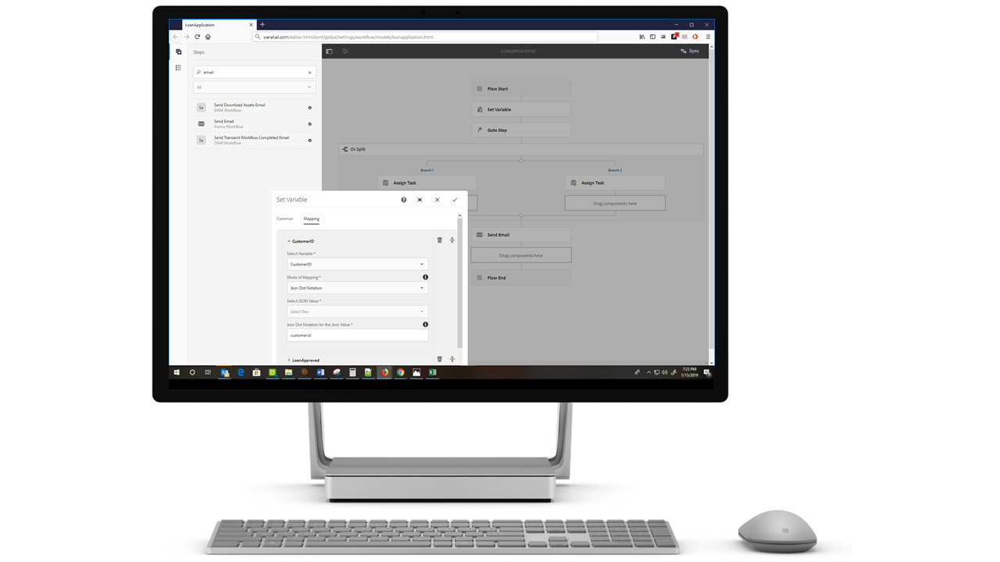

# 新功能摘要| AEM 6.5 Forms{#new-features-summary-aem-forms}

## 交易報表 {#transaction-reports}

交易報表可讓您擷取並追蹤已提交表單、已處理檔案和已轉譯檔案的數量。 追蹤這些交易的目的，是為產品使用做出明智的決定，並重新平衡對硬體和軟體的投資。 交易的一些範例包括：

* 提交最適化表單、HTML5表單或表單集
* 互動式通訊的列印版或網頁版轉譯
* 將文檔從一種檔案格式轉換為另一種檔案格式

有關配置和使用事務報表的資訊，請參 [閱事務報表概述](../../forms/using/transaction-reports-overview.md)。

## 互動式通訊 {#interactive-communications}

**定義資料顯示模式**

互動式通訊的作者現在可 [以定義欄位](../../forms/using/create-interactive-communication.md#main-pars-header-1162517146) 、變數和表單資料模型元素的資料顯示模式。 例如，日期、貨幣或電話格式。

**使用新類型的圖表**

您現在可以將多 [系列的像限圖表和圖表新增至](../../forms/using/chart-component-interactive-communications.md) 「互動式通訊」。

**對表中的列進行排序**

您現在可 [以在互動式通訊中](../../forms/using/create-interactive-communication.md#sortcolumns) ，對表格欄排序。 您可以使用靜態文字或資料模型物件來系結和排序表格欄。

**在網頁頻道中使用新元件**

您現在可以將「按鈕」和「分隔符號」元件新增至Web頻道。 如需詳細資訊，請 [參閱「新增按鈕元件至Web頻道中的Web頻道](../../forms/using/create-interactive-communication.md#add-button-component-to-the-web-channel)[和Separator元件」](../../forms/using/create-interactive-communication.md#separatorcomponent)。

**版面模式，以調整元件大小**

您現在可以切換至 [「版面」模式](../../forms/using/resize-using-layout-mode.md) ，以使用WYSIWYG介面來調整網頁頻道中的元件大小。

**可用性改進**

互動式通訊的作者現在可以運用各種簡單易用的作業來建立通訊。 操作清單包括：

* [在列印和網頁通道中執行還原重做動作](../../forms/using/create-interactive-communication.md#undoredoactions)
* [使用@符號在檔案片段中新增變數](../../forms/using/texts-interactive-communications.md#searchvariables)
* [使用@符號在檔案片段中新增資料模型元素](../../forms/using/texts-interactive-communications.md#searchdatamodelproperties)
* [刪除或新增網路頻道至現有的互動式通訊](../../forms/using/create-interactive-communication.md#edit-interactive-communication-properties)
* [使用拖放動作，將資料來源元素與欄位和變數系結](../../forms/using/create-interactive-communication.md#binddatasourceelements)
* [在製作互動式通訊時反白標示未系結的欄位和變數](../../forms/using/create-interactive-communication.md#distinguishunboundfields)
* [對Web頻道中繼承的元件執行其他動作，例如複製、群組等](../../forms/using/create-interactive-communication.md#componenttoolbar)

**同步程式的改進**

使用列印頻道自動產生的網頁頻道版面有幾項改良。

## 適用性表單 {#adaptive-forms}

### 在Adaptive Forms中使用Adobe Sign的雲端數位簽名 {#use-adobe-sign-s-cloud-based-digital-signatures-in-adaptive-forms}

[雲端數位簽名](https://helpx.adobe.com/sign/kb/digital-certificate-providers.html) 或遠端簽名是新一代的數位簽名，可跨桌上型電腦、行動裝置和網路運作。 並符合簽署者驗證的最高等級合規性與保證。 您現在可以 [使用雲端數位簽名](../../forms/using/working-with-adobe-sign.md) ，簽署最適化表單。

#### 在AEM Sites單頁應用程式中內嵌最適化表單或互動式通訊 {#embed-an-adaptive-form-or-interactive-communcation-in-aem-sites-single-page-applications}

AEM Forms可讓您將「 [最適化表單](../../forms/using/embed-adaptive-form-aem-sites-spa.md) 」或「互動式通訊」順暢地內嵌在AEM Sites單頁應用程式(SPA)中。 內嵌的最適化表單和互動式通訊功能完整，使用者可填寫並提交表單，而不需離開頁面。 它可協助使用者在網頁上保留其他元素的上下文，並同時與最適化表單或互動式通訊互動。

#### 對最適化表單表的列排序 {#sort-columns-of-adaptive-form-tables}

您可以 [按升序或降序對Adaptive Form表的任何列](../../forms/using/adaptive-forms-tables.md#sortcolumnstable) 進行排序。 可以對具有靜態文本、資料模型對象屬性或靜態文本和資料模型對象屬性組合的表列應用排序。

#### 將最適化表單範本的可用性限制在特定路徑 {#restrict-the-availability-of-adaptive-forms-templates-to-specific-paths}

最適化表單新增了對cq:allowedPaths屬性的支援。 該屬性將 [Adaptive Forms模板的可用性限制為特定路徑](../../forms/using/creating-adaptive-form.md#main-pars-text)。

#### 將核取方塊動態新增至最適化表單 {#add-check-boxes-to-the-adaptive-form-dynamically}

您現在可以定義規則， [以根據自訂函式、表單物件或物件屬性，動態地將核取方塊新增至Adaptive Form](../../forms/using/rule-editor.md#setpropertyrule) 。

## AEM 工作流程 {#aem-workflows}

### 在AEM工作流程中使用變數 {#use-variables-in-aem-workflows}

變數可讓工作流程步驟在執行時期中保留並傳遞跨工作流程步驟的中繼資料。 您可以建立不同類型的變數，以儲存不同的資料類型。 例如，整數、字串、檔案或表單資料模型例項。 通常，當您需要根據變數所包含的值做出決策，或儲存流程稍後需要的資訊時，會使用變數或變數集合。

變數是舊版 [MetaDataMap](https://helpx.adobe.com/experience-manager/6-5/sites/developing/using/reference-materials/javadoc/com/adobe/granite/workflow/metadata/MetaDataMap.html) 介面的擴充功能。 它有助於節省開發自訂ECMAScript程式碼所花費的時間，以擷取和更新中繼資料值。 您可繼續使用MetaDataMap介面和ECMAScript程式碼來控制中繼資料。 使用變數比MetaDataMap和ECMAScript的優點包括：

* 在整個工作流程中動態儲存、更新及使用儲存在變數中的值，而不需依賴自訂代碼
* 直接擷取並更新值至已提交表單的表單資料模型和資料檔案(XML/JSON)
* 將完整的檔案儲存在變數中，以執行檔案處理

「跳至」步驟、「或分割」步驟和所有AEM Forms工作流程步驟都支援變數。 您可以使用MetaDataMap介面，在不支援變數的工作流程步驟中存取變數。 如需詳細資訊，請參 [閱「AEM工作流程中的變數」](../../forms/using/variable-in-aem-workflows.md)。

#### 使用具有不同最適化表單的工作流程 {#use-a-workflow-with-different-adaptive-forms}

您可以 [在執行時期中為表單導向工作流程的指派任務和記錄步驟](../../forms/using/aem-forms-workflow-step-reference.md#assign-task-step) ，指定最適化表單。 它允許工作流使用不同的最適化表單。 在設計工作流時，可以決定選擇最適化表單的方法。 「最適化表單」可位於絕對路徑、以裝載方式提交至工作流程，或以變數計算的路徑提供。

#### 使用表單導向工作流程步驟的增強記錄功能 {#use-enhanced-logging-capabilities-of-forms-centric-workflow-steps}

表單導向工作流程步驟的記錄功能已標準化。 現在，所有表單導向的工作流程步驟都會產生類似的標準化記錄檔。 它有助於提高除錯速度。

## 資料整合 {#data-integration}

您現在可以：

* [根據限制清單](../../forms/using/work-with-form-data-model.md#automated-validation-of-input-data) ，驗證輸入資料。 它有助於確保僅將有效資料提交到資料源。
* [覆寫在](../../forms/using/configure-data-sources.md#configure-soap-web-services) WSDL（網站服務說明語言）檔案中定義的預設端點。

* [覆寫Swagger](../../forms/using/configure-data-sources.md#configure-restful-web-services) 定義 [檔案中定義的預設配置](../../forms/using/configure-data-sources.md#configure-restful-web-services) 、主機和基本路徑。

## 平台與安全性更新 {#platform-and-security-updates}

### 主要平台更新 {#major-platform-updates}

AEM Forms可使用支援的作業系統、應用程式伺服器、資料庫、資料庫驅動程式、JDK、LDAP伺服器和電子郵件伺服器的任何組合來設定。 以下是支援平台的主 [要變更](../../forms/using/aem-forms-jee-supported-platforms.md):

<table>
 <tbody>
  <tr>
   <td>元件</td>
   <td>已移除支援</td>
  </tr>
  <tr>
   <td>作業系統</td>
   <td>
    <ul>
     <li>Microsoft Windows Server 2012 R2</li>
     <li>IBM AIX*</li>
     <li>Sun Solaris*</li>
    </ul> </td>
  </tr>
  <tr>
   <td>應用程式伺服器  </td>
   <td>
    <ul>
     <li>Oracle Weblogic</li>
    </ul> </td>
  </tr>
  <tr>
   <td>資料庫</td>
   <td>
    <ul>
     <li>IBM DB2   </li>
     <li>Oracle RAC</li>
    </ul> </td>
  </tr>
  <tr>
   <td>LDAP伺服器</td>
   <td>
    <ul>
     <li>Microsoft Active Directory 2012</li>
     <li>Novell eDirectory 8.8.7 </li>
     <li>IBM Lotus Domino 8.5.0 </li>
    </ul> </td>
  </tr>
  <tr>
   <td>電子郵件伺服器</td>
   <td>
    <ul>
     <li>IBM Lotus Domino 8.5.0 </li>
    </ul> </td>
  </tr>
  <tr>
   <td>連接器</td>
   <td>
    <ul>
     <li>Microsoft Sharepoint 2013的連接器</li>
     <li>EMC Documentum 7.0的連接器</li>
    </ul> </td>
  </tr>
  <tr>
   <td>AEM Forms應用程式  </td>
   <td>
    <ul>
     <li>Windows 8.1支援</li>
    </ul> </td>
  </tr>
  <tr>
   <td>Java </td>
   <td>
    <ul>
     <li>Java 11</li>
    </ul> </td>
  </tr>
 </tbody>
</table>

*如需移轉至不同平台的相關資訊，請洽詢Adobe支援

#### 新的HTML5架構UI {#new-html-based-uis}

AEM 6.5 Forms已根據Adobe Flash Player的計畫EOL以及將Flash內容移轉至開放標準的整體方向，以HTML5為主的UI取代JEE Administration Console上AEM Forms的Flash UI、流程管理、Reader Extension和類別管理UI。

#### 安全性改進 {#security-improvements}

* AEM 6.5 Forms on JEE管理主控台UI現在是以Apache Struts 2.5為基礎。
* AEM 6.5 Forms現在使用jQuery至3.2.1和jQuery UI 1.12.1。請參 [閱升級檔案](/help/forms/home.md) ，瞭解變更的影響。

#### 協助工具改進 {#accessibility-improvements}

AEM 6.5 Forms已改善AEM Forms Workspace的協助功能。
