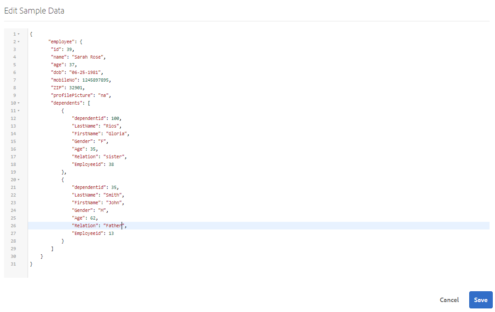

# 使用表單資料模型{#work-with-form-data-model}


表單資料模型編輯器提供直覺式使用者介面和工具，以編輯和設定表單資料模型。 使用編輯器，您可以在表單資料模型中，從相關資料來源新增及設定資料模型物件、屬性和服務。 此外，它還可讓您建立資料模型物件和屬性，毋需使用資料來源，並在稍後以個別的資料模型物件和屬性加以系結。 您也可以針對資料模型物件屬性產生和編輯範例資料，以便在預覽時用來預先填寫最適化表單和互動式通訊。 您可以測試在表單資料模型中設定的資料模型物件和服務，以確保它與資料來源正確整合。

如果您是Forms資料整合的新手，但尚未設定資料來源或建立表單資料模型，請參閱下列主題：

* [AEM Forms資料整合](/help/forms/using/data-integration.md)
* [設定資料來源](/help/forms/using/configure-data-sources.md)
* [建立表單資料模型](/help/forms/using/create-form-data-models.md)

請參閱，以取得有關您可以使用表單資料模型編輯器執行之各種工作和設定的詳細資訊。

>[!NOTE]
>
>您必須同時是&#x200B;**fdm-author**&#x200B;和&#x200B;**forms-user**&#x200B;群組的成員，才能建立和使用表單資料模型。 請連絡您AEM的管理員，以成為群組的成員。

## 添加資料模型對象和服務{#add-data-model-objects-and-services}

如果您使用資料來源建立表單資料模型，則可使用表單資料模型編輯器來新增資料模型物件和服務、設定其屬性、建立資料模型物件之間的關聯，以及測試表單資料模型和服務。

您可以從可用資料來源以資料模型的形式新增資料模型物件和服務。 添加的資料模型對象顯示在「模型」頁籤中，添加的服務顯示在「服務」頁籤中。

要添加資料模型對象和服務：

1. 登入作AEM者例項，導覽至「**[!UICONTROL Forms>資料整合]**」，並開啟您要新增資料模型物件的表單資料模型。
1. 在「資料來源」窗格中，展開資料來源以檢視可用的資料模型物件和服務。
1. 選擇要添加到表單資料模型的資料模型對象和服務，並點選&#x200B;**[!UICONTROL 添加選定項]**。

   

   所選資料模型對象和服務

   「模型」(Model)頁籤顯示所有資料模型對象及其添加到表單資料模型的屬性的圖形表示。 每個資料模型對象由表單資料模型中的框表示。

   

   「模型」頁籤顯示添加的資料模型對象

   >[!NOTE]
   >
   >您可以按住並拖曳資料模型物件方塊，以在內容區域中組織它們。 在「資料來源」窗格中，表格資料模型中新增的所有資料模型物件都會變灰。

   「服務」標籤列出新增的服務。

   

   「服務」頁籤顯示資料模型服務

   >[!NOTE]
   >
   >除了資料模型對象和服務外，OData服務元資料文檔還包括定義兩個資料模型對象之間的關聯的導航屬性。 有關詳細資訊，請參閱[使用OData服務的導航屬性](#work-with-navigation-properties-of-odata-services)。

1. 點選&#x200B;**[!UICONTROL Save]**&#x200B;以儲存表單模型物件。

   >[!NOTE]
   >
   >您可以使用自適應表單規則來調用在表單資料模型的「服務」頁籤中配置的服務。 規則編輯器的「調用服務」操作中提供了已配置的服務。有關在自適應形式規則中使用這些服務的詳細資訊，請參閱[規則編輯器](/help/forms/using/rule-editor.md)中的調用服務和設定規則值。

## 建立資料模型對象和子屬性{#create-data-model-objects-and-child-properties}

### 建立資料模型對象{#create-data-model-objects}

雖然您可以從已設定的資料來源新增資料模型物件，但您也可以建立沒有資料來源的資料模型物件或實體。 尤其當您未在表單資料模型中設定資料來源時，這會很有幫助。

要建立沒有資料源的資料模型對象，請執行以下操作：

1. 登入作AEM者例項，導覽至「**[!UICONTROL Forms>資料整合]**」，並開啟您要建立資料模型物件或實體的表單資料模型。
1. 點選&#x200B;**[!UICONTROL 建立實體]**。
1. 在「建立資料模型」對話框中，指定資料模型對象的名稱，然後點選&#x200B;**[!UICONTROL 添加]**。 資料模型對象被添加到表單資料模型中。 請注意，新添加的資料模型對象不綁定到資料源，並且沒有任何屬性，如下圖所示。

   

接下來，可以在未綁定的資料模型對象中添加子屬性。

### 添加子屬性{#child-properties}

表單資料模型編輯器允許您在資料模型對象中建立子屬性。 建立時的屬性不會綁定到資料源中的任何屬性。 您稍後可以在包含資料模型對象中將子屬性與另一個屬性綁定。

要建立子屬性：

1. 在表單資料模型中，選擇資料模型對象並點選&#x200B;**[!UICONTROL 建立子屬性]**。
1. 在&#x200B;**[!UICONTROL 建立子屬性]**&#x200B;對話框中，分別在&#x200B;**[!UICONTROL 名稱]**&#x200B;和&#x200B;**[!UICONTROL 類型]**&#x200B;欄位中指定屬性的名稱和資料類型。 您可以選擇指定屬性的標題和說明。
1. 如果屬性是計算屬性，則啟用計算。 計算屬性的值會根據規則或運算式來評估。 如需詳細資訊，請參閱[編輯屬性](#edit-properties)。
1. 如果資料模型對象綁定到資料源，則添加的子屬性將自動綁定到具有相同名稱和資料類型的父資料模型對象的屬性。

   要手動將子屬性與資料模型對象屬性綁定，請點選&#x200B;**[!UICONTROL 綁定引用]**&#x200B;欄位旁邊的瀏覽表徵圖。 **[!UICONTROL 選擇對象]**&#x200B;對話框列出父資料模型對象的所有屬性。 選取要系結的屬性並點選勾選圖示。 請注意，您只能選擇與子屬性具有相同資料類型的屬性。

1. 點選&#x200B;**[!UICONTROL Done]**&#x200B;以儲存子屬性，點選&#x200B;**[!UICONTROL Save]**&#x200B;以儲存表單資料模型。 子屬性現在會新增至資料模型物件。

在建立資料模型物件和屬性後，您可以繼續根據表單資料模型建立最適化表單和互動式通訊。 之後，當您有可用的資料來源並加以設定時，您就可以將表單資料模型與資料來源系結。 系結會自動在相關的調適性表單和互動式通訊中更新。 有關使用表單資料模型建立自適應表單和互動式通信的詳細資訊，請參閱[使用表單資料模型](/help/forms/using/using-form-data-model.md)。

### 綁定資料模型對象和屬性{#bind-data-model-objects-and-properties}

當您要與表單資料模型整合的資料來源可供使用時，您可以將其新增至表單資料模型，如[更新資料來源](/help/forms/using/create-form-data-models.md#update)所述。 然後，執行下列動作來系結未系結的資料模型物件和屬性：

1. 在表單資料模型中，選取您要與資料來源系結的未系結資料來源。
1. 點選&#x200B;**[!UICONTROL 編輯屬性]**。
1. 在&#x200B;**[!UICONTROL 編輯屬性]**&#x200B;窗格中，點選&#x200B;**[!UICONTROL 綁定]**&#x200B;欄位旁的瀏覽圖示。 它會開啟&#x200B;**[!UICONTROL 選擇物件]**&#x200B;對話方塊，列出在表單資料模型中新增的資料來源。

   

1. 展開資料來源樹狀結構，並選取要與勾選圖示系結的資料模型物件。
1. 點選「**[!UICONTROL Done]**」儲存屬性，然後點選「**[!UICONTROL 儲存]**」儲存表單資料模型。 資料模型物件現在會與資料來源系結。 請注意，資料模型物件不再標示為「未系結」。

   

## 配置服務{#configure-services}

要讀取和寫入資料模型對象的資料，請執行以下操作以配置讀取和寫入服務：

1. 選中資料模型對象頂部的複選框以將其選中，然後點選&#x200B;**[!UICONTROL 編輯屬性]**。

   

   編輯屬性以配置資料模型對象的讀和寫服務

   「編輯屬性」(Edit Properties)對話框隨即開啟。

   

   編輯屬性對話框

   >[!NOTE]
   >
   >除了資料模型對象和服務外，OData服務元資料文檔還包括定義兩個資料模型對象之間的關聯的導航屬性。 將OData服務資料源添加到表單資料模型時，表單資料模型中有一個服務可用於資料模型對象中的所有導航屬性。 您可以使用此服務讀取相應資料模型對象的導航屬性。
   >
   >
   >有關使用服務的詳細資訊，請參閱[使用OData服務的導航屬性](#work-with-navigation-properties-of-odata-services)。

1. 切換&#x200B;**[!UICONTROL 頂層物件]**&#x200B;以指定資料模型物件是否為頂層模型物件。

   在表單資料模型中配置的資料模型對象可用於基於表單資料模型的自適應表單的內容瀏覽器中的「資料模型對象」頁籤。 在兩個資料模型對象之間添加關聯時，與關聯的資料模型對象在「資料模型對象」(Data Model Objects)頁籤中關聯的資料模型對象下嵌套。 如果巢狀資料模型是頂層對象，它也將單獨顯示在「資料模型對象」(Data Model Objects)頁籤中。 因此，您會看到其中兩個項目，一個在巢狀階層內，另一個在巢狀階層外，這可能會混淆表單作者。 要使關聯的資料模型對象僅顯示在嵌套層次中，請禁用「頂層對象」屬性。

1. 為所選資料模型對象選擇「讀取和寫入服務」。 服務的引數隨即出現。

   

   為員工資料源配置的讀寫服務

1. 點選，將讀取服務引數系結至[使用者描述檔屬性、請求屬性或常值](#bindargument)，並指定系結值。
1. 點選&#x200B;**[!UICONTROL Done]**&#x200B;以儲存引數，點選&#x200B;**[!UICONTROL Done]**&#x200B;以儲存屬性，然後點選&#x200B;**[!UICONTROL Save]**&#x200B;以儲存表單資料模型。

### 綁定讀取服務參數{#bindargument}

根據綁定值將Read服務參數綁定到用戶配置檔案屬性、請求屬性或常值。 該值作為參數傳遞給服務，以便從資料源中獲取與指定值相關聯的詳細資訊。

#### 常值{#literal-value}

從&#x200B;**[!UICONTROL 綁定到]**&#x200B;下拉菜單中選擇&#x200B;**[!UICONTROL 常值]**，然後在&#x200B;**[!UICONTROL 綁定值]**&#x200B;欄位中輸入值。 從資料源中檢索與該值相關聯的詳細資訊。 使用此選項可檢索與靜態值關聯的詳細資訊。

在此示例中，與&#x200B;**436765678**&#x200B;關聯的詳細資訊作為`mobilenum`參數的值，從資料源中檢索。 如果您傳遞行動編號引數的值，關聯的詳細資料可包含客戶名稱、客戶地址和城市等屬性。


#### 使用者檔案屬性 {#user-profile-attribute}

從&#x200B;**[!UICONTROL 綁定到]**&#x200B;下拉菜單中選擇&#x200B;**[!UICONTROL 用戶配置檔案屬性]**，並在&#x200B;**[!UICONTROL 綁定值]**&#x200B;欄位中輸入屬性名稱。 根據屬性名稱，從資料源AEM檢索登錄到實例的用戶的詳細資訊。

在&#x200B;**[!UICONTROL 綁定值]**&#x200B;欄位中指定的屬性名必須包括完整的綁定路徑，直到用戶的屬性名。 開啟下列URL以存取CRXDE的使用者詳細資訊：

`https://[server-name]:[port]/crx/de/index.jsp#/home/users/`


在此示例中，在&#x200B;**[!UICONTROL `grios`用戶的「綁定值]**」欄位中指定`profile.empid`。


`id`引數會取用戶配置檔案的`empid`屬性的值，並將其作為參數傳遞給讀取服務。 它從與登錄用戶關聯的`empid`員工資料模型對象讀取並返回相關屬性的值。

#### 要求屬性 {#request-attribute}

使用request屬性從資料源中檢索關聯的屬性。

1. 從&#x200B;**[!UICONTROL 綁定到]**&#x200B;下拉菜單中選擇&#x200B;**[!UICONTROL 請求屬性]**，然後在&#x200B;**[!UICONTROL 綁定值]**&#x200B;欄位中輸入屬性名稱。

1. 為head.jsp建立[overlay](../../../help/sites-developing/overlays.md)。 若要建立覆蓋，請開啟CRX DE並將`https://<server-name>:<port number>/crx/de/index.jsp#/libs/fd/af/components/page2/afStaticTemplatePage/head.jsp`檔案複製至`https://<server-name>:<port number>/crx/de/index.jsp#/apps/fd/af/components/page2/afStaticTemplatePage/head.jsp`

   >[!NOTE]
   >
   > * 如果您使用靜態範本，請在以下位置覆蓋head.jsp:
      >   `/libs/fd/af/components/page2/afStaticTemplatePage/head.jsp`
   > * 如果您使用可編輯的範本，請覆蓋aftemplatedpage.jsp，網址為：
      >   `/libs/fd/af/components/page2/aftemplatedpage/aftemplatedpage.jsp`


1. 為請求屬性設定[!DNL paramMap]。 例如，在apps資料夾的。jsp檔案中加入下列程式碼：

   ```javascript
   <%Map paraMap = new HashMap();
    paraMap.put("<request_attribute>",request.getParameter("<request_attribute>"));
    request.setAttribute("paramMap",paraMap);
   ```

   例如，使用以下代碼從資料源中檢索petid值：


   ```javascript
   <%Map paraMap = new HashMap();
   paraMap.put("petId",request.getParameter("petId"));
   request.setAttribute("paramMap",paraMap);%>
   ```

根據請求中指定的屬性名稱從資料源檢索詳細資訊。

例如，在請求中指定屬性為`petid=100`會從資料源中檢索與屬性值關聯的屬性。

## 添加關聯{#add-associations}

通常，資料源中的資料模型對象之間會建立關聯。 關聯可以是一對一或一對多。 例如，可以有多個與員工關聯的家屬。 它稱為一對多關聯，由`1:n`在連接相關資料模型對象的線上描繪。 但是，如果關聯為給定的員工ID返回唯一的員工名稱，則稱為一對一關聯。

將資料源中的關聯資料模型對象添加到表單資料模型時，它們的關聯將保留並顯示為通過箭頭線連接。 您可以在表單資料模型中，跨不同資料來源新增資料模型物件之間的關聯。

>[!NOTE]
>
>JDBC資料源中的預定義關聯不會保留在表單資料模型中。 您必須手動建立。

要添加關聯，請：

1. 選擇資料模型對象頂部的複選框以選擇它，然後點選&#x200B;**[!UICONTROL 添加關聯]**。 將開啟「添加關聯」對話框。

   

   >[!NOTE]
   >
   >除了資料模型對象和服務外，OData服務元資料文檔還包括定義兩個資料模型對象之間的關聯的導航屬性。 在表單資料模型中新增關聯時，可使用這些導覽屬性。 有關詳細資訊，請參閱[使用OData服務的導航屬性](#work-with-navigation-properties-of-odata-services)。

   將開啟「添加關聯」對話框。

   

   「添加關聯」對話框

1. 在「添加關聯」窗格中：

   * 指定關聯的標題。
   * 選擇關聯類型— 一對一或一對多。
   * 選擇要與關聯的資料模型對象。
   * 選擇讀取服務以從所選模型對象讀取資料。 將顯示讀取服務參數。 編輯以變更引數（如有必要），並將其系結至資料模型物件的屬性以建立關聯。

   在以下示例中，Dependents資料模型對象的讀取服務的預設參數為`dependentid`。

   

   Dependents讀取服務的預設參數為dependentid

   但是，參數必須是關聯資料模型對象之間的公用屬性，在此示例中為`Employeeid`。 因此，`Employeeid`參數必須綁定到Employee資料模型對象的`id`屬性，才能從Dependents資料模型對象中獲取相關的依存對象詳細資訊。

   

   更新的引數和系結

   點選&#x200B;**[!UICONTROL Done]**&#x200B;以儲存引數。

1. 點選&#x200B;**[!UICONTROL Done]**&#x200B;儲存關聯，然後點選&#x200B;**[!UICONTROL 儲存]**&#x200B;儲存表單資料模型。
1. 重複步驟，視需要建立更多關聯。

>[!NOTE]
>
>添加的關聯會以指定的標題和連接關聯資料模型對象的一行出現在資料模型對象框中。
>
>您可以通過選中相應的複選框來編輯關聯，然後按一下「編輯關聯」(Edit Association)]**。**[!UICONTROL 


## 編輯屬性 {#properties}

您可以編輯資料模型對象的屬性、其屬性以及在表單資料模型中添加的服務。

要編輯屬性：

1. 選中資料模型對象、屬性或表單資料模型中服務旁邊的複選框。
1. 點選&#x200B;**[!UICONTROL 編輯屬性]**。 將開啟選定模型對象、屬性或服務的&#x200B;**[!UICONTROL 編輯屬性]**&#x200B;窗格。

   * **資料模型物件**:指定讀寫服務並編輯引數。
   * **屬性**:指定屬性的類型、子類型和格式。您也可以指定所選屬性是否為資料模型對象的主鍵。
   * **服務**:指定服務的輸入模型對象、輸出類型和參數。對於Get服務，您可以指定是否需要返回陣列。

   

   獲取服務的編輯屬性對話框

1. 點選&#x200B;**[!UICONTROL Done]**&#x200B;以儲存屬性，然後點選&#x200B;**[!UICONTROL Save]**&#x200B;以儲存表單資料模型。

### 建立計算屬性{#computed}

計算屬性是根據規則或表達式計算其值的屬性。 使用規則，可以將計算屬性的值設定為文本字串、數字、數學表達式的結果或表單資料模型中其他屬性的值。

例如，您可以建立計算屬性&#x200B;**FullName**，其值是現有&#x200B;**FirstName**&#x200B;和&#x200B;**LastName**&#x200B;屬性串連的結果。 若要這麼做：

1. 建立名為`FullName`的新屬性，其資料類型為String。
1. 啟用&#x200B;**[!UICONTROL Computed]**&#x200B;並點選&#x200B;**[!UICONTROL Done]**&#x200B;以建立屬性。

   

   將建立FullName計算屬性。 請注意屬性旁的圖示，以描繪計算屬性。

   

1. 選擇FullName屬性，然後點選&#x200B;**[!UICONTROL 編輯規則]**。 規則編輯器窗口隨即開啟。
1. 在規則編輯器視窗中，點選&#x200B;**[!UICONTROL Create]**。 將開啟&#x200B;**[!UICONTROL 設定值]**&#x200B;規則窗口。

   從「選擇選項」下拉式清單中，選擇「數學運算式」。 ****&#x200B;其他可用選項為&#x200B;**[!UICONTROL 表單資料模型物件]**&#x200B;和&#x200B;**[!UICONTROL 字串]**。

1. 在數學表達式中，分別在第一和第二對象中選擇&#x200B;**[!UICONTROL FirstName]**&#x200B;和&#x200B;**[!UICONTROL LastName]**。 選擇&#x200B;**[!UICONTROL plus]**&#x200B;作為運算子。

   點選「**[!UICONTROL Done]**」，然後點選「**[!UICONTROL Close]**」以關閉規則編輯器視窗。 規則看起來類似下列。

   

1. 在表單資料模型上，點選&#x200B;**[!UICONTROL 儲存]**。 已配置計算屬性。

## 使用OData服務{#work-with-navigation-properties-of-odata-services}的導航屬性

在OData服務中，導航屬性用於定義兩個資料模型對象之間的關聯。 這些屬性是在實體類型或複雜類型上定義的。 例如，在以下摘取範例[TripPin](https://www.odata.org/blog/trippin-new-odata-v4-sample-service/) OData範例服務的中繼資料檔案中，人員實體包含三個導覽屬性——朋友、BestFriend和旅行。

如需導覽屬性的詳細資訊，請參閱[OData檔案](https://docs.oasis-open.org/odata/odata/v4.0/errata03/os/complete/part3-csdl/odata-v4.0-errata03-os-part3-csdl-complete.html#_Toc453752536)。

```xml
<edmx:Edmx xmlns:edmx="https://docs.oasis-open.org/odata/ns/edmx" Version="4.0">
<script/>
<edmx:DataServices>
<Schema xmlns="https://docs.oasis-open.org/odata/ns/edm" Namespace="Microsoft.OData.Service.Sample.TrippinInMemory.Models">
<EntityType Name="Person">
<Key>
<PropertyRef Name="UserName"/>
</Key>
<Property Name="UserName" Type="Edm.String" Nullable="false"/>
<Property Name="FirstName" Type="Edm.String" Nullable="false"/>
<Property Name="LastName" Type="Edm.String"/>
<Property Name="MiddleName" Type="Edm.String"/>
<Property Name="Gender" Type="Microsoft.OData.Service.Sample.TrippinInMemory.Models.PersonGender" Nullable="false"/>
<Property Name="Age" Type="Edm.Int64"/>
<Property Name="Emails" Type="Collection(Edm.String)"/>
<Property Name="AddressInfo" Type="Collection(Microsoft.OData.Service.Sample.TrippinInMemory.Models.Location)"/>
<Property Name="HomeAddress" Type="Microsoft.OData.Service.Sample.TrippinInMemory.Models.Location"/>
<Property Name="FavoriteFeature" Type="Microsoft.OData.Service.Sample.TrippinInMemory.Models.Feature" Nullable="false"/>
<Property Name="Features" Type="Collection(Microsoft.OData.Service.Sample.TrippinInMemory.Models.Feature)" Nullable="false"/>
<NavigationProperty Name="Friends" Type="Collection(Microsoft.OData.Service.Sample.TrippinInMemory.Models.Person)"/>
<NavigationProperty Name="BestFriend" Type="Microsoft.OData.Service.Sample.TrippinInMemory.Models.Person"/>
<NavigationProperty Name="Trips" Type="Collection(Microsoft.OData.Service.Sample.TrippinInMemory.Models.Trip)"/>
</EntityType>
```

當您在表單資料模型中設定OData服務時，實體容器中的所有導覽屬性都可透過表單資料模型中的服務取得。 在此TripPin OData服務範例中，使用表單資料模型中的一項`GET LINK`服務，可讀取`Person`實體容器中的三個導覽屬性。

以下將突出顯示表單資料模型中的`GET LINK of Person /People`服務，該服務是TripPin OData服務`Person`實體中三個導航屬性的組合服務。


將`GET LINK`服務添加到「表單資料模型」中的「服務」頁籤後，可以編輯屬性以選擇輸出模型對象和要在服務中使用的導航屬性。 例如，以下示例中的`GET LINK of Person /People`服務使用Trip作為輸出模型對象，導航屬性使用Trips。


>[!NOTE]
>
>**NavigationPropertyName**&#x200B;引數的&#x200B;**Default Value**&#x200B;欄位中可用的值取決於&#x200B;**Return陣列的狀態？** 切換按鈕。啟用後，會顯示系列類型的導覽屬性。

在此示例中，您還可以選擇輸出模型對象作為Person，並選擇導航屬性參數作為Friends或BestFriend(取決於&#x200B;**Return陣列？** 啟用或停用)。


同樣地，在表單資料模型中新增關聯時，您可以選擇`GET LINK`服務並設定其導覽屬性。 但是，要能夠選擇導航屬性，請確保&#x200B;**[!UICONTROL 「綁定到」欄位]**&#x200B;設定為&#x200B;**Literal**。


## 產生並編輯範例資料{#sample}

表單資料模型編輯器允許您在表單資料模型中為所有資料模型對象屬性生成示例資料，包括計算屬性。 它是一組隨機值，符合為每個屬性設定的資料類型。 您也可以編輯和儲存資料，即使重新產生範例資料，也會保留這些資料。

執行下列動作以產生和編輯範例資料：

1. 開啟表單資料模型，然後點選&#x200B;**[!UICONTROL 編輯範例資料]**。 它會在「編輯樣本資料」窗口中生成並顯示樣本資料。

   

1. 在&#x200B;**[!UICONTROL 編輯範例資料]**&#x200B;視需要編輯資料，然後點選&#x200B;**[!UICONTROL 儲存]**。

接下來，您可以使用範例資料，根據表單資料模型來預先填寫和測試互動式通訊。 如需詳細資訊，請參閱[使用表單資料模型](/help/forms/using/using-form-data-model.md)。

## 測試資料模型對象和服務{#test-data-model-objects-and-services}

您的表單資料模型已設定，但在投入使用前，您可能想要測試已設定的資料模型物件和服務是否如預期般運作。 要測試資料模型對象和服務：

1. 以資料模型的形式選取資料模型物件或服務，並分別點選&#x200B;**[!UICONTROL 測試模型物件]**&#x200B;或&#x200B;**[!UICONTROL 測試服務]**。

   將開啟「測試表單資料模型」窗口。

   

1. 在「測試表單資料模型」窗口中，從「輸入」窗格中選擇要測試的資料模型對象或服務。

1. 在測試程式碼中指定引數值，然後點選&#x200B;**[!UICONTROL Test]**。 成功的測試會傳回「輸出」窗格中的輸出。

   

同樣地，您可以測試表單資料模型中的其他資料模型物件和服務。

## 輸入資料的自動驗證{#automated-validation-of-input-data}

表單資料模型會驗證在叫用DermisBridge API時收到的輸入資料（根據表單資料模型中可用的驗證准則）。 驗證是以`ValidationOptions`標幟為基礎，該標幟是在用於叫用API的查詢物件中設定。

此標幟可設為下列任一值：

* **完整**:FDM基於所有約束執行驗證
* **關閉**:無驗證
* **基本**:FDM基於「必需」和「可空」約束執行驗證

如果沒有為`ValidationOptions`標誌設定值，則對輸入資料執行&#x200B;**BASIC**&#x200B;驗證。

以下是將驗證標誌設定為&#x200B;**FULL**&#x200B;的示例：

```java
operationOptions.setValidationOptions(ValidationOptions.FULL);
```

>[!NOTE]
>
>輸入資料中為屬性提供的值必須與元資料文檔中為屬性定義的資料類型相匹配。\
>如果值與為屬性定義的資料類型不匹配，則DermisBridge API會顯示例外，而不考慮`ValidationOptions`標籤的值。 如果日誌級別設定為「調試」，則將錯誤記錄到&#x200B;**error.log**&#x200B;檔案。

表單資料模型基於資料類型約束清單驗證輸入資料。 輸入資料的限制清單可能會因資料來源而異。

下表列出基於資料源的輸入資料約束：

<table>
 <tbody> 
  <tr> 
   <td>限制</td> 
   <td>說明</td> 
   <td>輸入資料來源</td> 
  </tr> 
  <tr> 
   <td>必要</td> 
   <td>如果為true，則參數必須包含在輸入資料中。</td> 
   <td>Swagger、WSDL和資料庫</td> 
  </tr> 
  <tr> 
   <td>null</td> 
   <td>如果為true，則可在輸入資料中將參數的值設定為Null。</td> 
   <td>WSDL、Odata和資料庫</td> 
  </tr> 
  <tr> 
   <td>最大值</td> 
   <td>指定數值的上界。 指定為上界的最大值也可以分配給輸入資料中的參數。</td> 
   <td>Swagger和WSDL</td> 
  </tr> 
  <tr> 
   <td>最小</td> 
   <td>指定數值的下界。 指定為下界的最小值也可以指派給輸入資料中的參數。</td> 
   <td>Swagger和WSDL</td> 
  </tr> 
  <tr> 
   <td>exclusiveMaximum</td> 
   <td>指定數值的上界。 指定為上界的最大值不能分配給輸入資料中的參數。</td> 
   <td>Swagger和WSDL</td> 
  </tr> 
  <tr> 
   <td>exclusiveMinum</td> 
   <td>指定數值的下界。 指定為下界的最小值不能分配給輸入資料中的參數。</td> 
   <td>Swagger和WSDL</td> 
  </tr> 
  <tr> 
   <td>minLength</td> 
   <td>指定字串中包含的字元數的下界。 指定為下界的最小值也可以指派給輸入資料中的參數。</td> 
   <td>Swagger和WSDL</td> 
  </tr> 
  <tr> 
   <td>maxLength</td> 
   <td>指定字串中包含的字元數的上界。 指定為上界的最大值也可以分配給輸入資料中的參數。</td> 
   <td>Swagger、WSDL、Odata和資料庫</td> 
  </tr> 
  <tr> 
   <td>模式</td> 
   <td>指定固定的字元順序。 只有在字元符合指定模式時，才成功驗證輸入字串。</td> 
   <td>斯瓦格</td> 
  </tr> 
  <tr> 
   <td>minItems</td> 
   <td>指定陣列中項目的最小數量。 指定為下界的最小值也可以指派給輸入資料中的參數。</td> 
   <td>Swagger和WSDL</td> 
  </tr> 
  <tr> 
   <td>maxItems</td> 
   <td>指定陣列中項目的最大數目。 指定為上界的最大值也可以分配給輸入資料中的參數。</td> 
   <td>Swagger和WSDL</td> 
  </tr> 
  <tr> 
   <td>uniqueItems</td> 
   <td>如果為true，則陣列的所有元素在輸入資料中必須是唯一的。</td> 
   <td>斯瓦格</td> 
  </tr> 
  <tr> 
   <td>列舉（字串）<br /> <br /> </td> 
   <td>將輸入資料中的參數值限制為一組固定字串值。 它必須是至少包含一個元素的陣列，其中每個元素都是唯一的。</td> 
   <td>Swagger、WSDL和Odata</td> 
  </tr> 
  <tr> 
   <td>列舉（數字）<br /> <br /> </td> 
   <td>將輸入資料中的參數值限制為一組固定的數值。 它必須是至少包含一個元素的陣列，其中每個元素都是唯一的。</td> 
   <td>WSDL</td> 
  </tr> 
 </tbody> 
</table>

在此示例中，根據Swagger檔案中定義的最大、最小和所需約束來驗證輸入資料。 只有當訂單ID存在且其值介於1和10之間時，輸入資料才符合驗證標準。

```json
   parameters: [
   {
   name: "orderId",
   in: "path",
   description: "ID of pet that needs to be fetched",
   required: true,
   type: "integer",
   maximum: 10,
   minimum: 1,
   format: "int64"
   }
   ]
```

如果輸入資料不符合驗證標準，則顯示例外。 如果日誌級別設定為&#x200B;**Debug**，則將錯誤記錄到&#x200B;**error.log**&#x200B;檔案。 例如，

```verilog
21.01.2019 17:26:37.411 *ERROR* com.adobe.aem.dermis.core.validation.JsonSchemaValidator {"errorCode":"AEM-FDM-001-044","errorMessage":"Input validations failed during operation execution.","violations":{"/orderId":["numeric instance is greater than the required maximum (maximum: 10, found: 16)"]}}
```

## 後續步驟{#next-steps}

您有一個工作表單資料模型，現在可以在最適化表單和互動式通訊工作流程中使用。 如需詳細資訊，請參閱[使用表單資料模型](/help/forms/using/using-form-data-model.md)。
