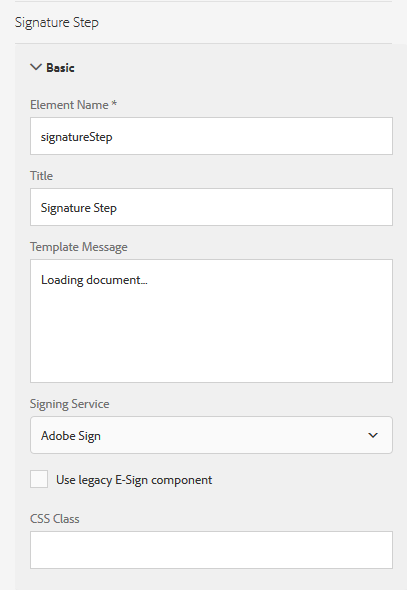

# 在最適化表單中使用[!DNL Adobe Sign]{#using-adobe-sign-in-an-adaptive-form}

Adobe 建議使用新式且可擴充的資料擷取[核心元件](https://experienceleague.adobe.com/docs/experience-manager-core-components/using/adaptive-forms/introduction.html)，用來[建立新的最適化表單](/help/forms/using/create-an-adaptive-form-core-components.md)或[將最適化表單新增到 AEM Sites 頁面](/help/forms/using/create-or-add-an-adaptive-form-to-aem-sites-page.md)。這些元件代表最適化表單建立方面的重大進步，可確保令人印象深刻的使用者體驗。本文會介紹使用基礎元件編寫最適化表單的舊方法。

| 版本 | 文章連結 |
| -------- | ---------------------------- |
| AEM as a Cloud Service  | [按一下這裡](https://experienceleague.adobe.com/docs/experience-manager-cloud-service/content/forms/adaptive-forms-authoring/authoring-adaptive-forms-foundation-components/use-adobe-sign/working-with-adobe-sign.html) |
| AEM 6.5 | 本文章 |

[!DNL Adobe Sign]啟用最適化表單的電子簽章工作流程。 電子簽章可改善處理法律、銷售、薪資、人力資源管理及更多領域檔案的工作流程。

在一般[!DNL Adobe Sign]和調適型表單案例中，使用者會填寫調適型表單來申請服務。 例如，抵押貸款與信用卡申請需要所有借方與共同申請者的合法簽章。 若要針對類似案例啟用電子簽章工作流程，您可以將[!DNL Adobe Sign]與AEM [!DNL Forms]整合。 再舉幾個範例，您可以使用[!DNL Adobe Sign]來：

* 透過完全自動化的提案、報價及合約程式，完成任何裝置的交易。
* 更快地完成人力資源程式，並為員工提供數位體驗。
* 縮短合約週期時間，讓您的廠商更快上線。
* 建立自動化常見流程的數位工作流程。

[!DNL Adobe Sign]與AEM的整合[!DNL Forms]支援：

* 單一和多使用者簽署工作流程
* 循序簽名與同步簽名工作流程
* 表單內和表單外簽署體驗
* 以匿名或登入使用者身分簽署表單
* 動態簽署程式(與AEM [!DNL Forms]工作流程整合)
* 透過知識庫、電話和社交設定檔進行驗證

瞭解搭配最適化表單使用Adobe Sign的[最佳實務](https://medium.com/adobetech/using-adobe-sign-to-e-sign-an-adaptive-form-heres-the-best-way-to-do-it-dc3e15f9b684)，以建立更好的簽署體驗。

## 先決條件 {#prerequisites}

在最適化表單中使用[!DNL Adobe Sign]之前：

* 請確定AEM [!DNL Forms]雲端服務設定為使用[!DNL Adobe Sign]。 如需詳細資訊，請參閱[整合Adobe Sign與AEM Forms](../../forms/using/adobe-sign-integration-adaptive-forms.md)。
* 保持簽名者清單準備就緒。 您至少需要每個簽署者的電子郵件地址。

## 為最適化表單設定[!DNL Adobe Sign] {#configure-adobe-sign-for-an-adaptive-form}

執行以下步驟，為最適化表單設定[!DNL Adobe Sign]：

1. [編輯Adobe簽署的適用性表單屬性](../../forms/using/working-with-adobe-sign.md#enableadobesign)
1. [將Adobe Sign欄位新增至最適化表單](../../forms/using/working-with-adobe-sign.md#addadobesignfieldstoanadaptiveform)
1. [為最適化表單啟用Adobe Sign](../../forms/using/working-with-adobe-sign.md#enableadobsignforanadaptiveform)
1. [為最適化表單選取Adobe Sign Cloud Service](../../forms/using/working-with-adobe-sign.md#selectadobesigncloudserviceforanadaptiveform)

1. [將Adobe Sign簽署者新增至最適化表單](../../forms/using/working-with-adobe-sign.md#addsignerstoanadaptiveform)
1. [選擇最適化表單的提交動作](../../forms/using/working-with-adobe-sign.md#selectsubmitactionforanadaptiveform)

### 編輯[!DNL Adobe Sign]的最適化表單屬性 {#enableadobesign}

為現有或新的最適化表單設定[!DNL Adobe Sign]的最適化表單屬性。

[為Adobe Sign建立最適化表單](../../forms/using/working-with-adobe-sign.md#create-an-adaptive-form-for-adobe-sign)說明建立基本最適化表單的步驟。 如需建立最適化表單時可用的其他選項，請參閱[建立最適化表單](../../forms/using/creating-adaptive-form.md)。

#### 為[!DNL Adobe Sign]建立最適化表單 {#create-an-adaptive-form-for-adobe-sign}

執行以下步驟來建立啟用簽署的調適型表單：

1. 導覽至&#x200B;**[!UICONTROL Adobe Experience Manager]** > **[!UICONTROL Forms]** > **[!UICONTROL Forms與檔案]**。
1. 選取&#x200B;**[!UICONTROL 建立]**&#x200B;並選取&#x200B;**[!UICONTROL 最適化表單]**。 範本清單隨即顯示。 選取範本並選取&#x200B;**[!UICONTROL 下一步]**。
1. 在&#x200B;**[!UICONTROL 基本]**&#x200B;索引標籤中：

   1. 指定最適化表單的&#x200B;**[!UICONTROL 名稱]**&#x200B;和&#x200B;**[!UICONTROL 標題]**。

   1. 選取在使用AEM [!DNL Forms]設定[!DNL Adobe Sign]時建立的[設定容器](../../forms/using/adobe-sign-integration-adaptive-forms.md#configure-adobe-sign-with-aem-forms)。

      >[!NOTE]
      >
      >**[!UICONTROL Adobe Sign Cloud Service]**&#x200B;下拉式清單會顯示在此欄位中選取之設定容器中設定的雲端服務。 當您選取&#x200B;**[!UICONTROL 啟用Adobe Sign Cloud Service]**&#x200B;選項時，最適化表單屬性的&#x200B;**[!UICONTROL 電子簽章]**&#x200B;區段中會提供&#x200B;**[!UICONTROL Adobe Sign]**&#x200B;下拉式清單。

1. 在&#x200B;**[!UICONTROL 表單模型]**&#x200B;索引標籤中，選取下列其中一個選項：

   * 選取&#x200B;**[!UICONTROL 關聯表單範本作為記錄檔案範本]**&#x200B;選項，並選取記錄檔案範本。 如果您使用以表單範本為基礎的調適型表單，則傳送以供簽署的檔案只會顯示以相關表單範本為基礎的欄位。 它不會顯示最適化表單的所有欄位。

   * 選取&#x200B;**[!UICONTROL 產生記錄檔案]**&#x200B;選項。 如果您使用已啟用最適化表單的記錄檔案選項，則傳送以供簽署的檔案會顯示最適化表單的所有欄位。

1. 選取&#x200B;**[!UICONTROL 建立。]**&#x200B;已建立啟用簽章的最適化表單，此表單可用來新增[!DNL Adobe Sign]欄位。

#### 編輯[!DNL Adobe Sign]的最適化表單 {#editafsign}

執行以下步驟，在現有的最適化表單中使用[!DNL Adobe Sign]：

1. 導覽至&#x200B;**[!UICONTROL Adobe Experience Manager]** > **[!UICONTROL Forms]** > **[!UICONTROL Forms與檔案]**。
1. 選取最適化表單並選取&#x200B;**[!UICONTROL 屬性]**。
1. 在&#x200B;**[!UICONTROL 基本]**&#x200B;索引標籤中，選取使用AEM [!DNL Forms]設定[!DNL Adobe Sign]時所建立的[設定容器](../../forms/using/adobe-sign-integration-adaptive-forms.md#configure-adobe-sign-with-aem-forms)。
1. 在&#x200B;**[!UICONTROL 表單模型]**&#x200B;索引標籤中，選取下列其中一個選項：

   * 選取&#x200B;**[!UICONTROL 關聯表單範本作為記錄檔案範本]**&#x200B;選項，並選取記錄檔案範本。 如果您使用以表單範本為基礎的調適型表單，則傳送以供簽署的檔案只會顯示以相關表單範本為基礎的欄位。 它不會顯示最適化表單的所有欄位。

   * 選取&#x200B;**[!UICONTROL 產生記錄檔案]**&#x200B;選項。 如果您使用已啟用最適化表單的記錄檔案選項，則傳送以供簽署的檔案會顯示最適化表單的所有欄位。

1. 選取&#x200B;**[!UICONTROL 儲存並關閉]**。 已為[!DNL Adobe Sign]啟用最適化表單。

### 將Adobe Sign欄位新增至最適化表單 {#addadobesignfieldstoanadaptiveform}

[!DNL Adobe Sign]有多種欄位可放在最適化表單上。 這些欄位接受各種型別的資料，例如簽名、首字母、公司或標題，並幫助在簽名期間收集額外的資訊以及簽名。 您可以使用[!DNL Adobe Sign]區塊元件在最適化表單的不同位置放置[!DNL Adobe Sign]欄位。

執行以下步驟以將欄位新增至調適型表單並自訂與這些欄位相關的各種選項：

1. 將&#x200B;**[!UICONTROL Adobe Sign Block]**&#x200B;元件從元件瀏覽器拖放至最適化表單。 [!DNL Adobe Sign]區塊元件具有所有支援的[!DNL Adobe Sign]欄位。 依預設，它會將&#x200B;**簽章**&#x200B;欄位新增至最適化表單。

   

   依預設，[!DNL Adobe Sign]區塊不會顯示在已發佈的調適型表單中。 它只顯示在簽署檔案中。 您可以從[!DNL Adobe Sign]區塊元件的屬性變更[!DNL Adobe Sign]區塊的可見度。

   >[!NOTE]
   >
   >    * 使用[!DNL Adobe Sign]區塊並非最適化表單中使用[!DNL Adobe Sign]的必要條件。 如果您未使用[!DNL Adobe Sign]區塊並為簽署者新增欄位，則預設簽章欄位會顯示在簽署檔案的底部。
   >    * 僅針對自動產生記錄檔案的最適化表單使用[!DNL Adobe Sign]區塊。 如果您使用自訂XDP來產生記錄檔案或表單範本式的最適化表單，則不支援[!DNL Adobe Sign]區塊。
   >
   >

1. 選取&#x200B;**[!UICONTROL Adobe Sign Block]**&#x200B;元件並選取&#x200B;**編輯** 圖示。 它會顯示新增欄位和格式化欄位外觀的選項。

   

   **A.**&#x200B;選取並新增[!DNL Adobe Sign]欄位。 **B.**&#x200B;展開[!DNL Adobe Sign]區塊至全熒幕檢視

1. 選取&#x200B;**[!UICONTROL Adobe Sign]欄位** 圖示。 它會顯示選取和新增[!DNL Adobe Sign]欄位的選項。

   展開&#x200B;**[!UICONTROL 型別]**&#x200B;下拉式欄位以選取[!DNL Adobe Sign]欄位，並選取「完成」圖示以將選取的欄位新增至[!DNL Adobe Sign]區塊。 **[!UICONTROL 型別]**&#x200B;下拉式欄位包含簽章、簽署者資訊和資料欄位型別。 [!DNL Adobe Sign]與AEM的整合[!DNL Forms]僅支援[!UICONTROL Type]下拉式方塊中列出的欄位。 如需[!DNL Adobe Sign]欄位的詳細資訊，請參閱[Adobe Sign檔案](https://helpx.adobe.com/sign/help/field-types.html)。

   

   必須為欄位提供唯一名稱。 您也可以選取必要選項，將欄位標示為必要欄位。 除了&#x200B;**[!UICONTROL Name]**&#x200B;和&#x200B;**[!UICONTROL 必要]**&#x200B;選項外，有些[!DNL Adobe Sign]欄位還有其他選項。 例如，遮色片和多行。 此外，無論欄位位於相同或不同的[!DNL Adobe Sign]區塊中，請為每個[!DNL Adobe Sign]欄位指定唯一的名稱。

   如果您從下拉式清單中選取&#x200B;**[!UICONTROL 數位簽章]**，您可以將數位簽章套用至最適化表單：

   * 使用雲端簽章，以由信任服務提供者代管的[數位識別碼](https://helpx.adobe.com/sign/kb/digital-certificate-providers.html)進行線上簽署。
   * 透過Adobe Acrobat下載檔案或在本機使用智慧卡、USB權杖或檔案式數位IDReader即可。

### 為最適化表單啟用[!DNL Adobe Sign] {#enableadobsignforanadaptiveform}

未立即為最適化表單啟用[!DNL Adobe Sign]。 執行以下步驟來啟用它：

1. 在內容瀏覽器中，選取&#x200B;**[!UICONTROL 表單容器]**，然後選取&#x200B;**[!UICONTROL 設定]** 圖示。 它會開啟屬性瀏覽器並顯示最適化表單容器屬性。
1. 在屬性瀏覽器中，展開&#x200B;**[!UICONTROL 電子簽章]**&#x200B;摺疊式功能表，然後選取&#x200B;**[!UICONTROL 啟用Adobe Sign]**&#x200B;選項。 它啟用最適化表單的[!DNL Adobe Sign]。

### 選取[!DNL Adobe Sign]Cloud Service和簽署順序 {#selectadobesigncloudserviceforanadaptiveform}

您可以為AEM [!DNL Forms]的執行個體設定多個[!DNL Adobe Sign]服務。 建議您為每個功能（人力資源、財務等）設定個別的服務集。 它可讓您更輕鬆地追蹤及報告已簽署的檔案。 例如，銀行擁有多個部門。 您可以為每個部門設定個別的設定，以便更妥善地追蹤檔案。

檔案也可以有多個簽署者。 例如，信用卡申請可以有多個應徵者。 在開始處理申請之前，銀行需要所有申請者的簽章。 對於多重簽署者情況，您可以選取以循序或同時順序簽署檔案。

執行以下步驟來選取雲端服務和簽署順序：

1. 在內容瀏覽器中，選取&#x200B;**[!UICONTROL 表單容器]**，然後選取&#x200B;**[!UICONTROL 設定]** 圖示。 它會開啟屬性瀏覽器並顯示最適化表單容器屬性。
1. 在屬性瀏覽器中，展開&#x200B;**[!UICONTROL 電子簽章]**&#x200B;摺疊式功能表，然後選取&#x200B;**[!UICONTROL 啟用Adobe Sign]**&#x200B;選項。 它啟用最適化表單的[!DNL Adobe Sign]。
1. 從已設定的[!DNL Adobe Sign]Cloud Service清單中選取雲端服務。

   如果&#x200B;**[!UICONTROL Adobe Sign Cloud Service]**&#x200B;清單是空的，請依照[使用AEM Forms設定Adobe Sign](../../forms/using/adobe-sign-integration-adaptive-forms.md)文章中的說明來設定服務。

   下拉式清單列出「工具> **[!UICONTROL Cloud Service]** > **[!UICONTROL Adobe Sign]**」中`global`資料夾內存在的雲端服務。 此外，當您建立最適化表單時，下拉式清單也會列出您在&#x200B;**[!UICONTROL 設定容器]**&#x200B;欄位中選取的資料夾中存在的雲端服務。

1. 從&#x200B;**[!UICONTROL 簽署者可以簽署]**&#x200B;對話方塊中選取簽署順序。 [!DNL Adobe Sign]位歌手可以依序簽署最適化表單&#x200B;**** — 一個接著另一個簽署者，或&#x200B;**[!UICONTROL 同時]** — 任何順序。

   依序由一位簽署者一次收到需要簽署的表單。 簽名者完成檔案簽名後，表單會傳送給下一個簽名者，依此類推。

   多個簽署者可同時以同步順序簽署表單。

1. [將簽署者新增至最適化表單](../../forms/using/working-with-adobe-sign.md#addsignerstoanadaptiveform)並選取「完成」圖示以儲存變更。

### 將簽署者新增至最適化表單 {#addsignerstoanadaptiveform}

一個最適化表單只能有一個或多個簽署者。 當您新增簽署者時，也可以設定簽署者的驗證詳細資訊。 您也可以選取表單填寫者與歌手是否為同一人。 執行以下步驟來新增並提供簽署者的各種詳細資訊：

1. 在內容瀏覽器中，選取&#x200B;**[!UICONTROL 表單容器]**，然後選取&#x200B;**[!UICONTROL 設定]** 圖示。 它會以最適化表單容器屬性開啟屬性瀏覽器。
1. 在屬性瀏覽器中，展開&#x200B;**[!UICONTROL 電子簽章]**&#x200B;摺疊式功能表，然後選取&#x200B;**[!UICONTROL 啟用Adobe Sign]**&#x200B;選項。 它啟用最適化表單的[!DNL Adobe Sign]。
1. 選取&#x200B;**[!UICONTROL 簽署者組態]**&#x200B;下的&#x200B;**[!UICONTROL 新增簽署者]**。 它會新增簽名者至最適化表單。 您可以將多個[!DNL Adobe Sign]簽署者新增至最適化表單。
   

1. 按一下&#x200B;**編輯** 圖示以指定下列有關簽署者的資訊：

   * **[!UICONTROL 標題]：**&#x200B;指定唯一識別簽署者的標題。

   * **[!UICONTROL 簽署者和填表人是否相同？]：**&#x200B;如果表單填寫者與第一個簽署者是同一個人，請選取&#x200B;**是**。 如果選項設定為&#x200B;**否，**，則請勿在調適型表單中使用簽章步驟元件。 如果表單包含「簽名步驟」元件，則欄位會自動設定為「是」。

   * **[!UICONTROL 簽署者電子郵件地址]：**&#x200B;指定簽署者的電子郵件地址。 簽署者在指定的電子郵件地址上接收要簽署的檔案/表單。 您可以選擇使用表單欄位、登入使用者的AEM使用者設定檔中提供的電子郵件地址，或手動輸入電子郵件地址。 此為強制步驟。 確保第一個簽署者或唯一簽署者（如果有單一簽署者）的電子郵件地址與用來設定AEM雲端服務的[!DNL Adobe Sign]帳戶不相同。

   * **[!UICONTROL 簽署者驗證方法]：**&#x200B;指定在開啟表單進行簽署之前驗證使用者的方法。 您可以在電話、知識庫及以社交身分為基礎的驗證之間進行選擇。 政府用Adobe Acrobat Sign Solutions僅提供電話和知識型驗證選項。

   >[!NOTE]
   >
   >    * 依預設，社交身分型驗證會提供使用Facebook、Google和LinkedIn進行驗證的選項。 您可以連絡[!DNL Adobe Sign]支援以啟用其他社交驗證服務提供者。
   >
   >

   * 要填寫或簽署的&#x200B;**[!DNL Adobe Sign]欄位：**&#x200B;請為簽署者選取[!DNL Adobe Sign]欄位。 自適應表單可以有多個[!DNL Adobe Sign]欄位。 您可以選擇為簽署者啟用特定欄位。 欄位會顯示所有可用的[!DNL Adobe Sign]區塊。 當您選取區塊時，會選取區塊的所有欄位。 您可以使用X圖示來取消選取欄位。

   

   上述影像有兩個範例[!DNL Adobe Sign]區塊：個人資訊和辦公室詳細資訊

   選取完成圖示。 簽署者已新增並設定。

### 選擇最適化表單的提交動作 {#selectsubmitactionforanadaptiveform}

之後，新增[!DNL Adobe Sign]欄位至最適化表單、啟用表單容器中的[!DNL Adobe Sign]、選取[!DNL Adobe Sign]Cloud Service、新增[!DNL Adobe Sign]簽署者，並為最適化表單選取適當的提交動作。 如需最適化表單提交動作的詳細資訊，請參閱[設定提交動作](../../forms/using/configuring-submit-actions.md)。

此外，只有在所有簽署者簽署表單後，才會提交啟用[!DNL Adobe Sign]的最適化表單。 您可以在Forms Portal的「等待簽署」區段中找到部分簽署的表單。 [!DNL Adobe Sign]設定服務會以[固定間隔](../../forms/using/adobe-sign-integration-adaptive-forms.md)持續輪詢[!DNL Adobe Sign]伺服器，以驗證簽章的狀態。 如果所有簽署者完成表單簽署，則會啟動提交動作服務並提交表單。 如果您使用自訂提交動作且表單使用[!DNL Adobe Sign]，請更新您的自訂提交動作以使用提交動作服務。

<!-- Remove when forms portal goes live
>[!NOTE]
>
>Data of the adaptive form is stored temporarily on Forms Portal. Use [custom storage for Forms Portal](/help/forms/using/configuring-draft-submission-storage.md). It ensures that the PII (personally identifiable information) data is not stored on AEM servers. 
-->

您的表單簽署體驗已準備就緒。 您可以預覽表單以驗證簽名體驗。 在已發佈的表單上，當簽署者透過電子郵件收到要簽署的表單時，會顯示[!DNL Adobe Sign]區塊欄位。 此體驗也稱為表單外簽名體驗。 您也可以為第一個簽署者設定表單內簽署體驗，如需詳細步驟，請參閱[建立表單內簽署體驗](../../forms/using/working-with-adobe-sign.md#create-in-form-signing-experience)。

## 設定最適化表單的雲端簽名 {#configure-cloud-signatures-for-an-adaptive-form}

雲端數位簽名或遠端簽名是新一代的數位簽名，可在案頭、行動裝置和Web上運作，並符合簽名者驗證的最高規範與保證。 您可以使用雲端數位簽名在最適化表格上簽名。

在[編輯Adobe簽章](../../forms/using/working-with-adobe-sign.md#enableadobesign)的最適化表單屬性後，請執行下列步驟以將雲端簽章欄位新增至最適化表單：

1. 將&#x200B;**[!UICONTROL Adobe Sign Block]**&#x200B;元件從元件瀏覽器拖放至最適化表單。 [!UICONTROL Adobe Sign區塊]元件具有所有支援的[!DNL Adobe Sign]欄位。 依預設，它會將&#x200B;**[!UICONTROL 簽章]**&#x200B;欄位新增至最適化表單。

   

1. 選取&#x200B;**[!UICONTROL Adobe Sign Block]**&#x200B;元件並選取&#x200B;**編輯** 圖示。 它會顯示新增欄位和格式化欄位外觀的選項。

   

   **A.**&#x200B;選取並新增[!DNL Adobe Sign]欄位。 **B.**&#x200B;展開[!DNL Adobe Sign]區塊至全熒幕檢視

1. 選取&#x200B;**[!UICONTROL Adobe Sign欄位]** 圖示。 它會顯示選取和新增[!DNL Adobe Sign]欄位的選項。

   展開&#x200B;**[!UICONTROL Type]**&#x200B;下拉式欄位以選取&#x200B;**[!UICONTROL 數位簽章]**，並選取&#x200B;**完成**&#x200B;圖示以將選取的欄位新增至[!DNL Adobe Sign]區塊。

   

   必須為欄位提供唯一名稱。

   使用以下專案將數位簽名套用至最適化表單：

   * 雲端簽章：使用由信任服務提供者代管的[數位識別碼](https://helpx.adobe.com/sign/kb/digital-certificate-providers.html)簽署。 雲端簽名選項不適用於適用於政府機關的Adobe Acrobat Sign Solutions。

   * Adobe Acrobat或Reader：使用Adobe Acrobat或Reader下載並開啟檔案，以使用智慧卡、USB權杖或檔案式數位ID簽名。

   將雲端簽名欄位新增至最適化表單後，執行以下步驟以完成設定程式：

   * [為最適化表單啟用Adobe Sign](../../forms/using/working-with-adobe-sign.md#enableadobsignforanadaptiveform)
   * [為最適化表單選取Adobe Sign Cloud Service](../../forms/using/working-with-adobe-sign.md#selectadobesigncloudserviceforanadaptiveform)
   * [將Adobe Sign簽署者新增至最適化表單](../../forms/using/working-with-adobe-sign.md#addsignerstoanadaptiveform)
   * [選擇最適化表單的提交動作](../../forms/using/working-with-adobe-sign.md#selectsubmitactionforanadaptiveform)

## 建立表單內簽名體驗 {#create-in-form-signing-experience}

使用者也可以在填寫表單時簽署最適化表單。 此體驗也稱為表單內簽名體驗。 表單內簽署體驗僅適用於多位簽署者環境中的第一位歌手。 執行以下步驟，為最適化表單建立表單內簽名體驗：

1. [新增並設定簽章步驟元件](../../forms/using/working-with-adobe-sign.md#add-and-configure-the-signature-step-component)。
1. [新增摘要步驟元件](../../forms/using/working-with-adobe-sign.md#configure-the-thank-you-page-or-summary-step-component)。

### 新增並設定簽章步驟元件 {#add-and-configure-the-signature-step-component}

使用「簽名步驟」元件，提供一個區域以電子方式簽署填寫的表單。 轉譯包含簽名步驟元件的區段時，會顯示填寫表單的可簽署PDF版本。 簽章步驟元件會佔據表單可用的完整寬度。 建議在包含簽章步驟元件的區段上不要有任何其他元件。

執行以下步驟來設定「簽章步驟」元件：

1. 將&#x200B;**[!UICONTROL 簽章步驟]**&#x200B;元件從元件瀏覽器拖放至表單。
1. 選取新新增的簽章步驟元件，並選取&#x200B;**設定** 圖示。 它會開啟屬性瀏覽器並顯示簽章步驟屬性。 設定下列屬性：

   * **[!UICONTROL 名稱]**：指定元件的名稱。

   * **[!UICONTROL 標題]：**&#x200B;指定元件的唯一標題。
   * **[!UICONTROL 範本訊息]：**&#x200B;指定載入簽章PDF時要顯示的訊息。 [!DNL Adobe Sign]服務需要一些時間來準備和載入簽章PDF。
   * **[!UICONTROL 簽署服務]：**&#x200B;選取&#x200B;**[!DNL Adobe Sign]**&#x200B;選項。

   * **[!UICONTROL 使用舊版電子簽章元件]**：如果您在[AEM Forms Workspace](../../forms/using/introduction-html-workspace.md)、AEM [!DNL Forms]應用程式中使用個別最適化表單，或基礎最適化表單具有舊版電子簽章元件，請選取&#x200B;**使用舊版電子簽章元件**&#x200B;選項。

   * **[!UICONTROL 設定]**：選取設定([!DNL Adobe Sign]Cloud Service)。 下拉式方塊只有在啟用&#x200B;**使用舊版電子簽章元件**&#x200B;選項時才能使用。

   * **[!UICONTROL CSS類別]**：指定元件的CSS類別。

   選取「完成」圖示以儲存變更。

   

   >[!NOTE]
   >
   >* 當您將&#x200B;**[!UICONTROL 簽章步驟]**&#x200B;元件拖放至表單時，**[!UICONTROL 簽署者和填寫表單的人員是否相同？]**&#x200B;選項會自動設定為&#x200B;**是**。 需要讓表單保持運作。
   >* 在簽名步驟元件後使用摘要步驟元件以獲得最佳體驗。 在簽名步驟元件中完成表單簽名後，「摘要」步驟會自動並立即提交表單。 如果您不使用摘要步驟，則只有在使用[Adobe Sign組態服務](../../forms/using/adobe-sign-integration-adaptive-forms.md#configure-adobe-sign-scheduler-to-sync-the-signing-status)設定的間隔之後，才會觸發自動提交。
   >
   >一些最佳實務如下：
   >
   >* 包含簽名步驟的最適化表單面板一律在最適化表單的最後一個或第二個面板中。 只有在最後一個面板包含「摘要」步驟時，它才能成為第二個面板。
   >* 包含簽名或摘要步驟元件的面板不能包含任何其他元件。
   >* 包含簽名步驟的最適化表單不能有提交按鈕。
   >* 包含簽名步驟的最適化表單的提交作業會透過背景服務或摘要步驟來處理。 如果有一個已設定的簽署者也填寫表單，則使用「摘要」步驟處理最適化表單提交的好處是，它會立即評估簽署者是否已簽署表單並叫用提交動作。 背景服務需要更多時間評估所有已設定的簽署者是否已簽署表單，並延遲提交調適型表單。
   >* 將表單設計為不允許使用者從包含簽名或摘要步驟的面板導覽回來。

### 設定感謝頁面或摘要步驟元件 {#configure-the-thank-you-page-or-summary-step-component}

**摘要步驟**&#x200B;元件會自動提交表單、在自訂摘要頁面中填入資訊，並顯示已提交表單的摘要。 它也會取得傳回對應中的必要資訊。 摘要步驟元件會佔用表單可用的完整寬度。 建議在包含摘要步驟元件的區段上不要有任何其他元件。

現在，表單中的簽名體驗已準備就緒。 您可以預覽表單以驗證簽名體驗。

## 常見問題 {#frequently-asked-questions}

**問：**&#x200B;您可以將最適化表單內嵌在其他最適化表單中。 內嵌的最適化表單可以啟用[!DNL Adobe Sign]嗎？
**Ans：**&#x200B;否，AEM [!DNL Forms]不支援使用內嵌[!DNL Adobe Sign]啟用的最適化表單以供簽署的最適化表單

**問：**當我使用進階範本建立最適化表單並開啟以進行編輯時，出現錯誤訊息「電子簽章或簽署者設定不正確」。 隨即顯示。 如何解決錯誤訊息？
**Ans：**&#x200B;使用進階範本建立的最適化表單已設定為使用[!DNL Adobe Sign]。 若要解決錯誤，請建立並選取[!DNL Adobe Sign]雲端設定，然後為最適化表單設定[!DNL Adobe Sign]簽署者。

**問：**&#x200B;我可以在最適化表單的靜態文字元件中使用[!DNL Adobe Sign]文字標籤嗎？
**ANS：**&#x200B;是，您可以在文字元件中使用文字標籤，將[!DNL Adobe Sign]欄位新增至[記錄檔案](../../forms/using/generate-document-of-record-for-non-xfa-based-adaptive-forms.md) （僅限自動產生的記錄檔案選項）啟用的最適化表單。 若要瞭解建立文字標籤的程式和規則，請參閱[Adobe Sign檔案](https://helpx.adobe.com/sign/using/text-tag.html)。 另請注意，調適型表單對文字標籤的支援有限。 您只能使用文字標籤來建立[Adobe Sign Block](../../forms/using/working-with-adobe-sign.md#configure-cloud-signatures-for-an-adaptive-form)支援的欄位。

**問：** AEM [!DNL Forms]提供[!UICONTROL Adobe Sign區塊]和簽章步驟元件。 這些可否在最適化表單中同時使用？
**Ans：**&#x200B;您可以在表單中同時使用這兩個元件。 以下是一些使用這些元件的建議：

**Adobe Sign區塊：**&#x200B;您可以使用[!UICONTROL Adobe Sign區塊]，在最適化表單的任何位置新增[!UICONTROL Adobe Sign]欄位。 也可以將特定欄位指派給簽署者。 預覽或發佈最適化表單時，預設不會顯示[!UICONTROL Adobe Sign]區塊。 這些區塊僅在簽署檔案中啟用。 在簽署檔案中，只會啟用指派給簽署者的欄位。 [!UICONTROL Adobe Sign]區塊可搭配第一個和後續簽署者使用。

**簽章步驟元件：**&#x200B;您可以使用簽章步驟元件來建立表單內簽名體驗。 它只允許第一個簽署者在填寫表單時簽署。 轉譯包含簽章步驟元件的區段時，會顯示表單的可簽署PDF版本。 它通常是最後一個或倒數第二部分，後面接著表單的摘要元件。

## 疑難排解 {#troubleshoot}

### [!DNL Adobe Sign]個合約失敗 {#adobe-sign-agreement-failures}

**問題**
為最適化表單設定[!DNL Adobe Sign]服務時，該服務無法為基礎的最適化表單建立[!DNL Adobe Sign]合約。

**解析度**

* 檢查最適化表單中使用的Adobe Sign雲端服務](../../forms/using/adobe-sign-integration-adaptive-forms.md)的[設定。
* 請確定用來設定[!DNL Adobe Sign]雲端服務的[!DNL Adobe Sign]伺服器上的API應用程式具有必要許可權。
* 如果您使用多個[!DNL Adobe Sign]雲端服務，請將所有服務的&#x200B;**[!UICONTROL oAuth URL]**&#x200B;指向相同的&#x200B;**[!UICONTROL Adobe Sign Shard]**。

* 使用個別的電子郵件地址來設定[!DNL Adobe Sign]帳戶，以及第一個簽署者和單一簽署者。 第一個簽署者或唯一簽署者（如果有單一簽署者）的電子郵件地址不能與用來設定AEM雲端服務的[!DNL Adobe Sign]帳戶相同。

### 針對已啟用[!DNL Adobe Sign]的最適化表單設定的AEM [!DNL Forms]工作流程未啟動 {#adobe-sign-aem-form-workflow-failures}

**問題**
針對最適化表單設定[!DNL Adobe Sign]時，使用叫用[!DNL Forms]工作流程選項設定的工作流程不會啟動。

**解析度**

* 當您使用[!DNL Adobe Sign]而沒有簽章步驟或表單需要多個人的簽章時，AEM [!DNL Forms]伺服器會等待排程器確認所有人員都已簽署表單。 排程器只會在所有人完成簽署後提交調適型表單，而工作流程只會在成功提交調適型表單後開始。 您可以縮短[排程器](adobe-sign-integration-adaptive-forms.md)的間隔，以快速間隔檢查表單簽署的狀態，並加快表單提交。

## 相關文章 {#related-articles}

* [將Adobe Sign與AEM Forms整合](../../forms/using/adobe-sign-integration-adaptive-forms.md)
* [搭配最適化表單使用Adobe Sign的最佳作法](https://medium.com/adobetech/using-adobe-sign-to-e-sign-an-adaptive-form-heres-the-best-way-to-do-it-dc3e15f9b684)
* [搭配AEM Forms使用Adobe Sign （影片）](https://helpx.adobe.com/experience-manager/kt/forms/using/adobe-sign-integration-feature-video.html)
