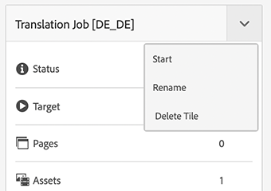

# 翻譯內容 {#translate-content}

使用翻譯連接器和規則來翻譯無頭內容。

## 迄今為止的故事 {#story-so-far}

在AEM無頭翻譯歷程的上一份檔案中， [配置翻譯規則](translation-rules.md) 您已學習如何使用AEM翻譯規則來識別您的翻譯內容。 您現在應該：

* 了解翻譯規則的功用。
* 可定義您自己的翻譯規則。

現在已設定連接器和翻譯規則，本文會帶您完成轉譯無頭內容的下一步。

## 目標 {#objective}

本檔案可協助您了解如何使用AEM翻譯專案以及連接器和翻譯規則來翻譯內容。 閱讀本檔案後，您應：

* 了解翻譯專案是什麼。
* 能夠建立新的翻譯專案。
* 使用翻譯專案來翻譯無頭內容。

## 建立翻譯專案 {#creating-translation-project}

翻譯專案可讓您管理無頭AEM內容的翻譯。 翻譯專案會收集要在一個位置翻譯成其他語言的內容，以集中檢視翻譯工作。

將內容新增至翻譯專案時，會為其建立翻譯工作。 作業提供命令和狀態資訊，用於管理在資源上執行的人工翻譯和機器翻譯工作流。

翻譯專案可透過兩種方式建立：

1. 選取內容的語言根目錄，並讓AEM根據內容路徑自動建立翻譯專案。
1. 建立空白專案，並手動選取要新增至翻譯專案的內容

這兩種有效方法通常都只會因執行翻譯的角色而異：

* 翻譯項目經理(TPM)通常需要靈活地手動選擇翻譯項目的內容。
* 如果內容擁有者也負責翻譯，讓AEM根據選取的內容路徑自動建立專案通常會比較容易。

以下幾節探討了這兩種方法。

### 根據內容路徑自動建立翻譯專案 {#automatically-creating}

對於同樣負責翻譯的內容擁有者，讓AEM自動建立翻譯專案通常較為容易。 若要讓AEM根據您的內容路徑自動建立翻譯專案：

1. 導覽至 **導覽** -> **資產** -> **檔案**. 請記住，AEM中的無頭內容會儲存為稱為內容片段的資產。
1. 選取專案的語言根目錄。 在此案例中，我們已選取 `/content/dam/wknd/en`.
1. 點選或按一下邊欄選取器並顯示 **參考** 中。
1. 點選或按一下 **語言副本**.
1. 檢查 **語言副本** 核取方塊。
1. 展開區段 **更新語言副本** 在「參考」(references)面板的底部。
1. 在 **專案** 下拉式清單，選取 **建立翻譯專案**.
1. 為您的翻譯專案提供適當的標題。
1. 點選或按一下 **開始**.


您會收到已建立專案的訊息。

>[!NOTE]
>
>假定已建立翻譯語言的必要語言結構，作為 [內容結構的定義。](getting-started.md#content-structure) 這應與內容架構師共同執行。
>
>如果沒有提前建立語言資料夾，您將無法如前面的步驟所述建立語言副本。

### 選取您的內容，手動建立翻譯專案 {#manually-creating}

對於翻譯專案經理，通常需要手動選取要包含在翻譯專案中的特定內容。 若要建立此類手動翻譯專案，您必須先建立空白專案，然後選取要新增的內容。

1. 導覽至 **導覽** -> **專案**.
1. 點選或按一下 **建立** -> **資料夾** 來建立專案的資料夾。
   * 這是可選的，但有助於組織翻譯工作。
1. 在 **建立資料夾** 窗口，添加 **標題** ，然後點選或按一下 **建立**.

   

1. 點選或按一下資料夾以開啟資料夾。
1. 在新專案資料夾中，點選或按一下 **建立** -> **專案**.
1. 專案以範本為基礎。 點選或按一下 **翻譯專案** 選取範本，然後點選或按一下 **下一個**.

   

1. 在 **基本** 頁簽，輸入新項目的名稱。

   

1. 在 **進階** 頁簽，使用 **目標語言** 下拉式清單，選取內容應翻譯到的語言。 點選或按一下 **建立**.

   

1. 點選或按一下 **開啟** 在確認對話方塊中。

   

專案已建立，但不含要翻譯的內容。 下一節將詳細說明專案的結構以及如何新增內容。

## 使用翻譯專案 {#using-translation-project}

翻譯項目旨在集中收集與翻譯工作相關的所有內容和任務，讓您的翻譯簡單易懂。

要查看翻譯項目，請執行以下操作：

1. 導覽至 **導覽** -> **專案**.
1. 點選或按一下在上一節中建立的專案。


專案分為多張卡片。

* **摘要**  — 此卡顯示項目的基本標題資訊，包括所有者、語言和翻譯提供者。
* **翻譯工作**  — 此卡片或這些卡片顯示的實際翻譯工作概述，包括狀態、資產數量等。 通常，每個語言都有一個作業，作業名稱中附加了ISO-2語言代碼。
* **團隊**  — 此卡顯示協作此翻譯項目的用戶。 此歷程不涵蓋此主題。
* **工作**  — 與轉譯內容相關的其他任務，例如執行項目或工作流項目。 此歷程不涵蓋此主題。

翻譯專案的使用方式取決於其建立方式：自動或手動執行。

### 使用自動建立的翻譯專案 {#using-automatic-project}

自動建立翻譯專案時，AEM會根據您先前定義的翻譯規則，評估您選取路徑下的無標題內容。 根據該評估，它將需要翻譯的內容提取到新的翻譯項目中。

若要查看此專案中包含之無標題內容的詳細資訊：

1. 點選或按一下位於 **翻譯工作** 卡片。
1. 此 **翻譯工作** 窗口列出作業中的所有項。
   
1. 請點選或按一下某行以查看該行的詳細資訊，同時請記住，一行可能代表要翻譯的多個內容項目。
1. 點選或按一下條列項目的選取核取方塊，以查看其他選項，例如從工作中刪除該項目，或在「內容片段」或「資產」主控台中檢視該項目的選項。
   

翻譯工作的內容通常始於 **草稿** 狀態，如 **狀態** 欄中 **翻譯工作** 窗口。

若要開始翻譯工作，請返回翻譯專案概述，然後點選或按一下 **翻譯工作** 卡片和選取 **開始**.


AEM現在會與您的翻譯設定和連接器通訊，以將內容傳送至翻譯服務。 您可以返回 **翻譯工作** 窗口和查看 **狀態** 欄。


機器翻譯會自動以 **已核准**. 人類翻譯可讓您進行更多互動，但不在此歷程的範圍內。

### 使用手動建立的翻譯專案 {#using-manual-project}

手動建立翻譯專案時，AEM會建立必要的工作，但不會自動選取要包含的任何內容。 這讓翻譯專案經理能夠靈活地挑選要翻譯的內容。

要向翻譯作業添加內容，請執行以下操作：

1. 點選或按一下其中一個 **翻譯工作** 卡片。
1. 查看該作業不包含任何內容。 點選或按一下 **新增** 按鈕，然後 **資產/頁面** 從下拉式清單中。

   

1. 路徑瀏覽器隨即開啟，可讓您明確選取要新增的內容。 找出您的內容，點選或按一下以選取。

   

1. 點選或按一下 **選擇** 將所選內容添加到作業中。
1. 在 **翻譯** 對話框，指定您希望 **建立語言副本**.

   

1. 內容現在已包含在工作中。

   

1. 點選或按一下條列項目的選取核取方塊，以查看其他選項，例如從工作中刪除該項目，或在「內容片段」或「資產」主控台中檢視該項目的選項。
   

1. 重複這些步驟，將所有必要內容納入工作中。

>[!TIP]
>
>路徑瀏覽器是功能強大的工具，可讓您搜尋、篩選及導覽內容。 點選或按一下 **僅限內容/篩選器** 按鈕切換側面板並顯示高級篩選器，例如 **修改日期** 或 **翻譯狀態**.
>
>您可以在 [其他資源一節。](#additional-resources)

您可以使用前述步驟，將必要的內容新增至專案的所有語言（工作）。 選取所有內容後，即可開始翻譯。

翻譯工作的內容通常始於 **草稿** 狀態，如 **狀態** 欄中 **翻譯工作** 窗口。

若要開始翻譯工作，請返回翻譯專案概述，然後點選或按一下 **翻譯工作** 卡片和選取 **開始**.



AEM現在會與您的翻譯設定和連接器通訊，以將內容傳送至翻譯服務。 您可以返回 **翻譯工作** 窗口和查看 **狀態** 欄。


機器翻譯會自動以 **已核准**. 人類翻譯可讓您進行更多互動，但不在此歷程的範圍內。

## 檢閱翻譯的內容 {#reviewing}

[如先前所見，](#using-translation-project) 機器翻譯的內容會以 **已核准** 因為假設是因為使用機器翻譯，所以不需要人為干預。 不過，當然仍可以檢閱翻譯的內容。

只要前往已完成的翻譯工作，點選或按一下核取方塊以選取條列項目即可。 圖示 **在內容片段中顯示** 會顯示在工具列中。


點選或按一下該圖示，以在其編輯器主控台中開啟翻譯的內容片段，以查看翻譯內容的詳細資訊。


您可以視需要進一步修改內容片段，但前提是您擁有適當權限，但編輯內容片段不在此歷程的範圍內。 請參閱 [其他資源](#additional-resources) 一節以取得本主題的詳細資訊。

項目的目的是在一個地方收集與翻譯相關的所有資源，以便於訪問和清楚的概述。 不過，如您所見，透過檢視翻譯項目的詳細資訊，翻譯本身會回流至翻譯語言的資產資料夾。 在此範例中，資料夾為

```text
/content/dam/wknd/es
```

如果您透過 **導覽** -> **資產** -> **檔案**，您會看到翻譯的內容。


AEM翻譯框架從翻譯連接器接收翻譯，然後根據語言根並使用連接器提供的翻譯自動建立內容結構。

請務必了解此內容未發佈，因此無法供無頭式服務使用。 我們將了解此作者發佈結構，並了解如何在翻譯歷程的下一個步驟中發佈翻譯內容。

## 人類翻譯 {#human-translation}

如果您的翻譯服務提供人工翻譯，則審閱流程提供更多選項。 例如，翻譯會以狀態傳回專案 **草稿** 和必須手動審核及核准或拒絕。

人類翻譯不在本地化歷程中。 請參閱 [其他資源](#additional-resources) 一節以取得本主題的詳細資訊。 不過，除了其他核准選項，人工翻譯的工作流程與本歷程中所述的機器翻譯相同。

## 下一步 {#what-is-next}

現在您已完成無頭翻譯歷程的這一部分，您應：

* 了解翻譯專案是什麼。
* 能夠建立新的翻譯專案。
* 使用翻譯專案來翻譯無頭內容。

基於此知識，接下來檢閱此檔案，繼續您的AEM無頭翻譯歷程 [發佈翻譯的內容](publish-content.md) 您將在何處學習如何發佈翻譯的內容，以及如何隨著語言根內容的變更更新這些翻譯。

## 其他資源 {#additional-resources}

雖然建議您透過檢閱檔案，繼續進行無頭式翻譯歷程的下一個階段 [發佈翻譯的內容，](publish-content.md) 以下是一些額外的選用資源，可更深入探討本檔案中提及的一些概念，但您不需要繼續進行無頭歷程。

* [管理翻譯專案](/help/sites-administering/tc-manage.md)  — 了解翻譯專案的詳細資訊和其他功能，例如人工翻譯工作流程和多語言專案。
* [製作環境和工具](/help/sites-authoring/author-environment-tools.md##path-selection) - AEM提供多種組織及編輯內容的機制，包括強大的路徑瀏覽器。
