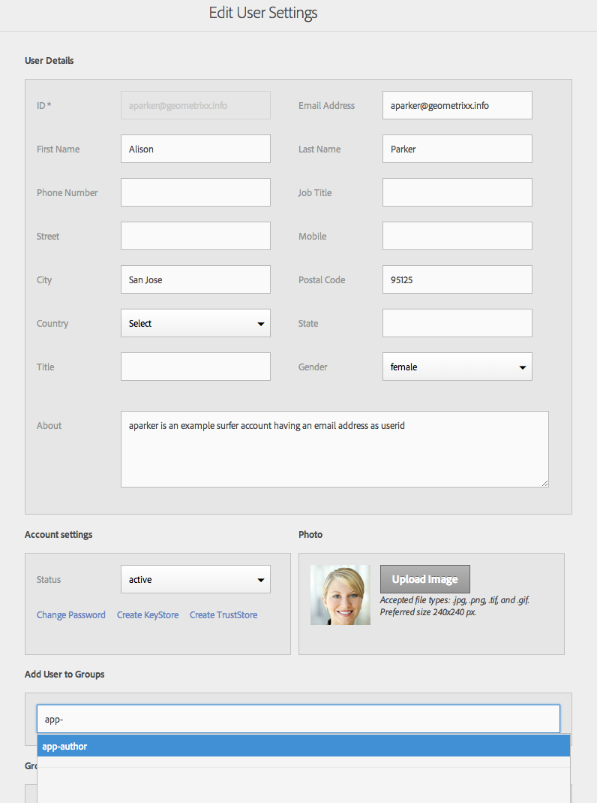

# 設定您的使用者和使用者群組 {#configure-your-users-and-user-groups}

>[!NOTE]
>
>Adobe建議針對需要單頁應用程式架構用戶端轉換的專案使用SPA編輯器（例如React）。 [了解更多](/help/sites-developing/spa-overview.md).

本章說明使用者角色以及如何設定您的使用者和群組，以支援製作和管理行動應用程式。

## AEM mobile應用程式使用者和群組管理 {#aem-mobile-application-users-and-group-administration}

### AEM mobile應用程式內容作者（應用程式作者群組） {#aem-mobile-application-content-authors-app-author-group}

應用程式作者群組成員負責製作AEM mobile應用程式內容，包括頁面、文字、影像和視訊。

#### 群組設定——應用程式作者 {#group-configuration-app-authors}

1. 建立名為&#39;app-authors&#39;的新使用者群組：

   導覽至「使用者管理控制台」: [http://localhost:4502/libs/granite/security/content/groupadmin.html](http://localhost:4502/libs/granite/security/content/groupadmin.html)

   在使用者群組控制台中，選取「+」按鈕以建立群組。

   將此群組的ID設為&#39;app-authors&#39;，表示它是AEM內特定於製作行動應用程式的特定類型的作者使用者群組。

1. 將成員添加到組：作者

   

1. 現在您已建立應用程式作者使用者群組，您可以透過使用者管理控制台，將個別團隊成員新 [增至此群組](http://localhost:4502/libs/granite/security/content/useradmin.md)。

   

1. 下列項目可讓您新增至AEM的內容作者群組：

   （讀取）on

   * /app
   * /etc/clientlibs
   * /etc/designs
   * /etc/cloudservices/dps2015

### AEM Mobile應用程式管理員群組（應用程式管理員群組） {#aem-mobile-application-administrators-group-app-admins-group}

應用程式管理員群組成員可以使用應用程式作者隨附的相同權限來製作應用程式內容 **AND** ，此外還負責：

* 測試、發佈和清除應用程式ContentSync OTA更新

>[!NOTE]
>
>權限會決定AEM App Command Center中某些使用者動作的可用性。
>
>您會注意到，有些選項不適用於應用程式管理員可用的應用程式作者。

### 群組設定——應用程式管理員 {#group-configuration-app-admins}

1. 建立新群組，稱為應用程式管理員。
1. 將下列群組新增至新的應用程式管理員群組：

   * 內容作者
   * workflow-users
   

   >[!NOTE]
   >
   >workflow —— 使用者必須使用PhoneGap Build服務進行遠端建置

1. 導覽至「權 [限」主控台](http://localhost:4502/useradmin) ，並新增管理CloudServices的權限

   * （讀取、修改、建立、刪除、複製）/etc/cloudservices/mobileservices

1. 在相同的「權限」主控台上，新增舞台、發佈及清除應用程式內容更新的權限；

   * （讀取、修改、建立、刪除、複製）/etc/packages/mobileapp
   * （讀取）於/var/contentsync
   >[!NOTE]
   >
   >套件複製可用來從作者例項發佈應用程式更新至發佈例項

   >[!CAUTION]
   >
   >/var/contentsync存取被拒絕OOTB。
   >
   >省略READ權限會導致生成和複製空的更新包。

1. 視需要新增成員至此群組
1. 若要匯出內容或上傳

   * （讀取）在/etc/contentsync上，以存取匯出範本
   * （讀取）在/var上，對於讀取的路徑遍歷，請執行
   * （讀取、寫入、修改、刪除）/var/contentsync上的內容，以寫入、讀取和清除ContentSync快取匯出內容

### 其他資源 {#additional-resources}

若要進一步瞭解建立AEM Mobile隨選服務應用程式的其他兩個角色和責任，請參閱下列資源：

* [針對AEM Mobile隨選服務開發AEM內容](/help/mobile/aem-mobile-on-demand.md)
* [製作適用於AEM Mobile隨選服務應用程式的AEM內容](/help/mobile/mobile-apps-ondemand.md)
