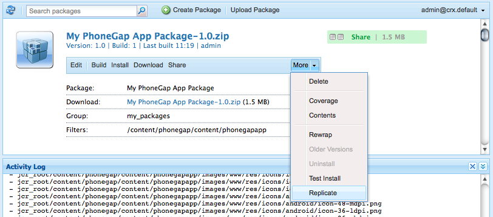

# 建立行動應用程式{#building-mobile-applications}

>[!NOTE]
>
>Adobe建議針對需要單頁應用程式架構用戶端轉換的專案使用SPA編輯器（例如React）。 [了解更多](/help/sites-developing/spa-overview.md).

建立應用程式以安裝至裝置或模擬器以進行測試或發佈至應用程式商店。 您可以使用PhoneGap命令列介面在本機建立應用程式，或使用PhoneGap Build在雲端建立應用程式。

這裡提供如何使用GitHub提供的程式碼建立行動應用程式的完整逐步文 [章](https://helpx.adobe.com/experience-manager/using/aem62_mobile.html)。

## 將應用程式移至發佈例項 {#moving-the-application-to-the-publish-instance}

將應用程式檔案移至發佈例項，以便您能夠針對行動應用程式的已安裝例項提供內容更新，並使用發佈內容建立應用程式。 應用程式由儲存庫中的兩個節點分支組成：

* `/content/phonegap/apps/<application name>`:作者建立並啟動的網頁。
* `/content/phonegap/content/<application name>`:應用程式設定檔案和內容同步設定。

>[!NOTE]
>
>如果您未將應用程式檔案移至發佈例項，內容作者將無法更新「內容同步」快取。

您只需將分支中的檔案移 `/content/phonegap/content/<application name>` 至發佈例項即可。 當作者啟動頁 `/content/phonegap/apps/<application name>` 面時，會移動分支中的檔案。

AEM提供兩種將大量內容移至發佈例項的方法：

* [使用複製控制台上的「激活樹](/help/sites-authoring/publishing-pages.md) 」命令。
* [建立包含內容的套件](/help/sites-administering/package-manager.md) ，並複製套件。

例如，會建立名為phonegapapp的行動應用程式。 下列節點必須移至發佈例項：/content/phonegap/content/phonegapapp。

**** 提示：要將包從作者實例移動到發佈實例，請使用包上的「複製」命令。



## 使用PhoneGap命令列介面建立 {#building-using-the-phonegap-command-line-interface}

使用PhoneGap命令列介面(CLI)編譯您電腦上的PhoneGap應用程式。 若要將AEM內容加入您的應用程式中，AEM會建立ZIP檔案，其中包含您的行動應用程式內容、內容同步設定和其他必要資產。 下載ZIP檔案並將它加入您的組建版本中。

### 準備構建環境 {#preparing-your-build-environment}

要使用PhoneGap CLI構建，需要安裝Node.js和PhoneGap客戶端實用程式。 您需要使用Internet連線才能執行下列程式。

1. 下載並安裝 [Node.js](https://nodejs.org/)。
1. 開啟終端或命令提示符，然後輸入以下節點命令以安裝PhoneGap實用程式：

   ```shell
   npm install -g phonegap
   ```

   在Unix或Linux系統上，您可能需要在命令前面加上前置詞 `sudo`。

   終端顯示一系列HTTP GET命令的結果。 當安裝成功時，終端會顯示程式庫的安裝位置，類似下列範例：

   ```xml
   /usr/local/bin/phonegap -> /usr/local/lib/node_modules/phonegap/bin/phonegap.js
   phonegap@3.3.0-0.19.6 /usr/local/lib/node_modules/phonegap
   ├── pluralize@0.0.4
   ├── colors@0.6.0-1
   ├── semver@1.1.0
   ├── qrcode-terminal@0.9.4
   ├── shelljs@0.1.4
   ├── optimist@0.6.0 (...)
   ├── prompt@0.2.11 (...)
   ├── phonegap-build@0.8.4 (...)
   ├── connect-phonegap@0.8.1 (...)
   └── cordova@3.3.0-0.1.1 (...)
   ```

1. （可選）取得您所定位之行動平台的SDK:

   * 若要建立適用於iOS平台的應用程式，請安裝最新版 [Xcode](https://developer.apple.com/xcode/)。
   * 若要建立Android應用程式，請安 [裝Android SDK](https://developer.android.com/)。

### 下載內容ZIP檔案 {#downloading-the-content-zip-file}

將行動應用程式的內容移至檔案系統。

1. 在「行動應用程式」頁面上，選取您的應用程式。
1. （可選）若要建立完整安裝的應用程式，請在工具列上按一下或點選「清除快取」圖示。

   

   >[!NOTE]
   >
   >快取保存已安裝應用程式的內容更新。 清除快取會撤消所有快取更新。

1. 在工具列上，按一下或點選「下載CLI資產」圖示。

   

1. 儲存ZIP檔案後，按一下「成功」對話方塊上的「關閉」。
1. 解壓ZIP檔案的內容。

### 使用PhoneGap CLI來建立 {#using-the-phonegap-cli-to-build}

使用PhoneGap CLI編譯和安裝應用程式。 有關如何使用PhoneGap CLI的資訊，請參閱PhoneGap [命令列介面檔案](https://docs.phonegap.com/en/3.0.0/guide_cli_index.md.html) 。

1. 開啟終端或命令提示，並將目前的目錄變更為下載的應用程式ZIP檔案。 例如，下列項目將目錄更改為ng-app-cli.1392137825303.zip檔案：

   ```shell
   cd ~/Downloads/ng-app-cli.1392137825303
   ```

1. 輸入您所定位平台的phonegap命令。 例如，下列命令會建立Android適用的應用程式：

   ```shell
   phonegap build android
   ```

## 使用PhoneGap Build建立 {#building-using-phonegap-build}

使用PhoneGap雲端服務來建立您的應用程式。 若要執行此程式，您必須先建立PhoneGap Build組態。

### 正在連線到 PhoneGap Build {#connecting-to-phonegap-build}

建立PhoneGap Build設定，以便您可以從AEM中使用PhoneGap Build服務。 提供您用來建立行動應用程式的PhoneGap Build帳戶的使用者名稱和密碼。

1. 開啟「工具」頁面。 ([http://localhost:4502/tools.html](http://localhost:4502/tools.html))。
1. 在「CQ操作」區域，按一下「雲端服務」。
1. 按一下PhoneGap Build的「Configure Now」（立即設定）連結。

   

1. 在「建立配置」對話框中，鍵入「標題」屬性的值。 預設情況下，Name屬性的值是從標題中派生的，但您可以輸入名稱。 按一下「建立」。
1. 在「PhoneGap Build Configuration」（PhoneGap建置設定）對話方塊中，輸入您的PhoneGap Build使用者名稱和密碼，然後按一下「OK」（確定）。

### 使用PhoneGap Build {#using-phonegap-build}

將您的應用程式資源傳送至PhoneGap Build，以編譯各種行動平台的應用程式資源。

1. 在「行動應用程式」頁面上，開啟您的行動應用程式。 ([http://localhost:4502/mobile.html/content/phonegap](http://localhost:4502/mobile.html/content/phonegap))
1. （可選）要構建應用程式以完成安裝，請選擇該應用程式並按一下清除快取表徵圖。

   

   >[!NOTE]
   >
   >快取保存已安裝應用程式的內容更新。 清除快取會撤消所有快取更新。

1. 選擇啟動顯示頁，然後按一下「生成遠程」表徵圖。

   

   **** 注意：AEM Beta的測試版不會在建立成功完成時建立收件匣通知。

1. 在「成功」對話方塊中，按一下「PhoneGap Build」以開啟「Adobe phoneGap Build」頁面，網址為 [https://build.phonegap.com/apps](https://build.phonegap.com/apps)。 如果您正在等待應用程式出現，可以勾選「 [PhoneGap建立狀態」頁面](https://status.build.phonegap.com/) 。

   如需有關安裝組建版本的詳細資訊，請參 [閱PhoneGap建立檔案](https://docs.build.phonegap.com/en_US/3.1.0/#googtrans%28en%29)。

   >[!NOTE]
   >
   >免費的PhoneGap Build帳戶允許使用一個私人應用程式。 如果您要建立額外的私人應用程式，PhoneGap建置會失敗。

### 後續步驟 {#the-next-steps}

建立程式後的下一個步驟是瞭解應 [用程式的結構](/help/mobile/phonegap-structure-an-app.md)。
