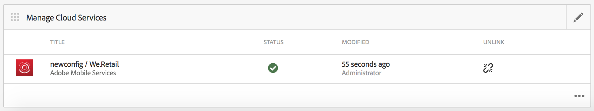

# 設定您的Adobe Mobile Services cloud服務 {#configure-your-adobe-mobile-services-cloud-service}

>[!NOTE]
>
>Adobe建議針對需要單頁應用程式架構用戶端轉換的專案使用SPA編輯器（例如React）。 [了解更多](/help/sites-developing/spa-overview.md).

指 **令中心的「行動量度圖格** 」可為您的行動應用程式提供即時分析。

Adobe [Mobile Analytics](https://www.adobe.com/ca/solutions/digital-analytics/mobile-web-apps-analytics.html) SDK可透過PhoneGap外掛程式提供。 量度會在裝置上收集並快取，直到裝置連線為止，屆時資料會推送至Adobe Mobile Services Cloud以進行報告和分析。

Adobe Mobile Analytics SDK提供下列功能：

1. **針對行動通道收集資料** -針對所有主要作業系統上的行動網站和應用程式收集完整的資料。
1. **行動互動分析** -瞭解您行動應用程式、網站或視訊中的使用者互動，包括消費者啟動渠道的頻率、他們是否從渠道購買等。
1. **行動應用程式控制面板和報表** -取得包含應用程式生命週期度量和應用程式商店度量的使用狀況報表— 檢視使用者、啟動、平均作業長度、保留長度和當機的趨勢。
1. **行動宣傳分析** -量化行動特定宣傳的成效，例如SMS、行動搜尋廣告、行動展示廣告和QR Code。
1. **地理位置分析** -根據GPS位置或興趣點，尋找應用程式使用者在何處啟動並與行動體驗互動。
1. **路徑分析** -瞭解使用者如何瀏覽您的應用程式，以判斷哪些螢幕和UI元素吸引使用者，以及哪些元素會導致使用者流失。

>[!CAUTION]
>
>分析 **量度圖格** (Analyze Metrics Tile)只會在您已設定雲端服務時顯示在控制面板中。

AEM命令中心量度圖格

## 設定雲端服務 {#configuring-the-cloud-service}

為了善用Adobe Mobile Services Analytics，您需要使用您的Adobe Analytics帳戶資訊來設定AEM Mobile Analytics Cloud服務。

1. 按一下右上角的圖示，從應用程式儀表板的「管理雲端服務」方塊新增或編輯 **雲端服務** 。

   

1. 隨即 **顯示「新增或編輯雲端服務** 」畫面。 選取 **Adobe Mobile Services** ，然後按一 **下「下一步**」。

   

1. 從 **Mobile Services選擇現有的** 組態 **，或選擇** 「建立組態」以建立新組態。

   若為新設定，請輸入 **Mobile Services屬性並**&#x200B;按一下&#x200B;**「驗證」。**

   

   如果驗證了憑據，則「 **Verify** （驗證）」按鈕 **將更改為「** Verified（驗證）」。 您可以從「選擇行動應用程式服務」 **中選擇行動服務應用程式**。

   按一 **下「送出** 」以設定您的設定。

   

1. 設定雲端設定後，您就可以在控制面板中檢視相同的設定。

   

   >[!NOTE]
   >
   >設定雲端設定後，您就可以在應用程式儀表板中 **檢視「分析量度** 」圖格。

   

