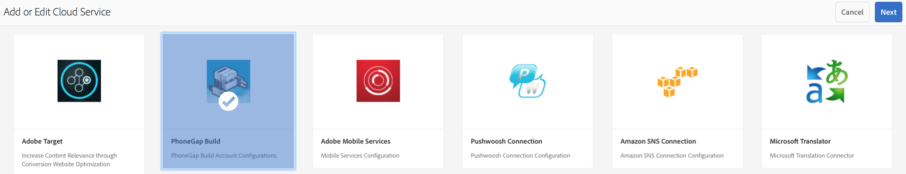

# 設定您的Adobe phoneGap Build cloud服務 {#configure-your-adobe-phonegap-build-cloud-service}

>[!NOTE]
>
>Adobe建議針對需要單頁應用程式架構用戶端轉換的專案使用SPA編輯器（例如React）。 [了解更多](/help/sites-developing/spa-overview.md).

應用程 **式儀表板上的PhoneGap Build Tile** ，可讓您透過Adobe phoneGap Build Service建立和散發您的PhoneGap行動應用程式。

使用PhoneGap Build **Tile推送遠端建置時，「管理應用程式」** 圖格中定義的所有支援平台都會使用PhoneGap Build **** Build建立。

您可以將遠端建置推送至 [https://build.phonegap.com](https://build.phonegap.com) ，或下載來源，以便使用 [PhoneGap CLI在本機建置](https://docs.phonegap.com/references/phonegap-cli/)。


## 設定雲端服務 {#configuring-the-cloud-service}

為了善用PhoneGap Build，您必須使用您的PhoneGap Build帳戶資訊來設定AEM PhoneGap Build Cloud服務。

如果您目前沒有帳戶，請導覽至 [https://build.phonegap.com](https://build.phonegap.com) 並註冊！ 如果您有Adobe Creative cloud會籍，您最多可支援25個私人應用程式（非開放原始碼應用程式）。

在您驗證PhoneGap Build帳戶是否啟用後，請導覽至您的AEM Cloud Management Console，尤其是 [PhoneGap Build cloud服務](http://localhost:4502/etc/cloudservices/phonegap-build.html) (http://localhost:4502/etc/cloudservices/phonegap-build.html)。

使用「 **管理雲端服務** 」方塊來設定新的雲端服務設定。

### 使用「管理雲端服務」圖格 {#using-manage-cloud-services-tile}

在開始使用 **PhoneGap Build** tile建立應用程式之前，您必須使用AEM Mobile儀表板中的「 **Manage Cloud Services** 」（管理雲端服務）圖格來設定雲端服務。

若要為您的應用程式設定雲端服務，請遵循下列步驟：

1. 按一下「管理雲端服務」方塊 **右上角的** 。

   

1. 從「 **新增或編輯雲端服務** 」畫面 **選擇「PhoneGap Build」選項** 。

   按一 **下「下一步**」。

   

1. 輸入您的認證以建立新的雲端設定。

   驗證完成後，按一下「 **提交**」。 此設定的雲端設定現在會顯示在「管 **理雲端服務」方塊** 。

   

### 使用PhoneGap Build建立應用程式 {#building-your-application-with-phonegap-build}

在您設定雲端服務後，就可以使用 **PhoneGap Build圖格來建立應用程式** 。 按一下右上角的，從「建立遠端」或「 **下載來源** 」選 **項中選擇** 。


若要使用Adobe PhoneGap Build叫用遠端建置，請按一下「 **Build Remote**」。

>[!NOTE]
>
>如果建置因故而失敗（下方的紅色iOS圖示表示平台失敗），您可以將滑鼠指標暫留在圖示上，以取得錯誤訊息。 或者，您也可以按一下三點，「...」 在方塊底部，直接導覽至https://build.phonegap.com（您必須驗證），並直接檢視和管理您的建置。

### 使用PhoneGap CLI構建應用程式 {#building-your-application-with-phonegap-cli}

PhoneGap提供命令列介面，可在本端建立您的應用程式。

使用PhoneGap命令行介面(CLI)編譯電腦上的PhoneGap應用程式。 若要將AEM內容加入您的應用程式中，AEM會建立ZIP檔案，其中包含您的行動應用程式內容、內容同步設定和其他必要資產。 下載ZIP檔案並將它加入您的組建版本中。

為了利用PhoneGap的命令列介面，您需要設定您的本機環境以包括：

1. 平台SDK(iOS、Android、WindowsPhone、...)和
1. PhoneGap CLI

您可以在這裡閱讀 [更多](https://docs.phonegap.com/references/phonegap-cli/)。

在您安裝先決條件後，請先建立簡單的應用程式，然後從終端試用，讓它在您的模擬器或裝置上執行，以進行簡單的測試：

```xml
phonegap create myApp
cd myApp
phonegap run ios (or android, ...)
```

>[!NOTE]
>
>add —imulate在此行末尾處，如果您不想在連接的設備上運行它。

在您確認上述功能正常後，請使用 **PhoneGap Build** Tile來 **下載來源**。 將檔案儲存並解壓縮至您的本機系統。 完成後：

* 導覽至儲存的檔案（資料夾）
* 執行&#39;phonegap run ios&#39;（或android等）

### 其他資源 {#additional-resources}

若要瞭解作者和開發人員的角色和責任，請參閱下列資源：

* [使用AEM為Adobe PhoneGap Enterprise進行開發](/help/mobile/developing-in-phonegap.md)
* [在AEM中製作Adobe phoneGap Enterprise的內容](/help/mobile/phonegap.md)
