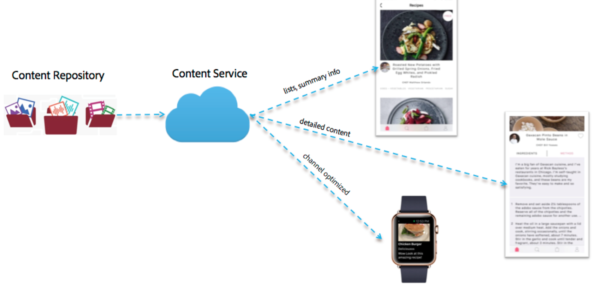

# 內容傳送{#content-delivery}

>[!NOTE]
>
>Adobe建議針對需要單頁應用程式架構用戶端轉換的專案使用SPA編輯器（例如React）。 [了解更多](/help/sites-developing/spa-overview.md).

Mobile Apps應可視需要使用AEM中的任何和所有內容，以提供目標應用程式體驗。

這包括使用資產、網站內容、CaaS內容（透視）和自訂內容，這些內容可能有其自訂結構。

>[!NOTE]
>
>**Over-the-Air內容可透過** ContentSync處理常式從上述任一種方式取得。 它可用於透過zip批次封裝和傳送，以及維護更新或這些封裝。

內容服務提供的內容有三種主要類型：

1. **資產**
1. **封裝的HTML內容(HTML/CSS/JS)**
1. **不受頻道影響的內容**

## 資產 {#assets}

資產集合是AEM結構，包含其他集合的參考。

資產收集可透過內容服務公開。 在請求中呼叫資產收集會傳回資產清單的物件——包括其URL。 資產可透過URL存取。 URL是在物件中提供。 例如：

* 頁面實體會傳回包含影像參考的JSON（頁面物件）。 影像參考是用於取得影像資產二進位檔案的URL。
* 要求資料夾中的資產清單時，會傳回JSON，內含該資料夾中所有實體的詳細資訊。 該清單是一個對象。 JSON有URL參考，可用來取得該資料夾中每個資產的資產二進位。

### 資產最佳化 {#asset-optimization}

Content services的一個關鍵價值是能夠傳回已針對裝置最佳化的資產。 這可降低本機裝置儲存空間需求，並改善應用程式效能。

根據API要求中提供的資訊，資產最佳化將是伺服器端功能。 盡可能快取資產轉譯，如此類似的請求就不需要重新產生資產轉譯。

### 資產工作流程 {#assets-workflow}

資產工作流程如下：

1. AEM現成可用的資產參考
1. 建立給定其模型的資產參考圖元
1. 編輯實體

   1. 挑選資產或資產收集
   1. 自訂JSON轉換

下圖顯示「資產參 **考工作流程」**:

### 管理資產 {#managing-assets}

Content services提供對AEM管理資產的存取權，這些資產可能無法透過其他AEM內容參考。

#### 現有受管理資產 {#existing-managed-assets}

現有的AEM Sites和Assets使用者正使用AEM Assets來管理其所有通道的所有數位資料。 他們正在開發原生行動應用程式，並需要使用由AEM Assets管理的數個資產。 例如標誌、背景影像、按鈕圖示等。

目前，這些資產分散在資產儲存庫中。 應用程式需要參考的檔案位於：

* /content/dam/geometrixx-outdoors/brand/logo_light.png
* /content/dam/geometrixx-outdoors/brand/logo_dark.png
* /content/dam/geometrixx-outdoors/styles/backgrounds/gray_blue.jpg
* /content/dam/geometrixx-outdoors/brand/icons/app/cart.png
* /content/dam/geometrixx-outdoors/brand/icons/app/home.png

#### 存取CS資產實體 {#accessing-cs-asset-entities}

現在，讓我們暫且擱置透過API提供頁面的步驟（AEM UI說明將會涵蓋此頁面），並假設頁面已完成。 資產實體已建立並新增至「appImages」空間。 為了組織目的，在空間下建立了其他資料夾。 因此，資產實體會儲存在AEM JCR中，如下：

* /content/entities/appImages/logo/logo_light
* /content/entities/appImages/logo/logo_dark
* /content/entities/appImages/bkgnd/gray_blue
* /content/entities/appImages/icons/cart
* /content/entities/appImages/icons/home

#### 取得可用資產實體清單 {#getting-a-list-of-available-asset-entities}

應用程式開發人員可以擷取資產實體，以取得可用資產的清單。 Content services空間端點可以透過web service API SDK提供該資訊。

結果會是JSON格式的物件，提供「圖示」檔案夾中資產的清單。

#### 取得影像 {#getting-an-image}

JSON會針對每個影像提供URL，由Content services產生至影像。

若要取得「購物車」影像的二進位檔，會再次使用用戶端程式庫。

## 封裝的HTML內容 {#packaged-html-content}

需要維護內容版面的客戶需要HTML內容。 這對於使用Web容器（例如Cordova webview）來顯示內容的原生應用程式非常有用。

AEM Content services將可透過API提供HTML內容至行動應用程式。 想要將AEM內容公開為HTML的客戶將會建立指向AEM內容來源的HTML頁面實體。

會考慮下列選項：

* **** Zip檔案：為了在裝置上正確顯示，所有頁面的參考資料（css、JavaScript、資產等）都有最佳的顯示機會。 -將包含在具有響應的單個壓縮檔案中。 HTML頁面中的參照將會調整為使用這些檔案的相對路徑。
* **** 串流：從AEM取得必要檔案的資訊清單。 然後使用該資訊清單來要求所有檔案（HTML、CSS、JS等）與後續的要求。

## 不受頻道影響的內容 {#channel-independent-content}

不受頻道影響的內容是公開AEM內容建構（例如頁面）的方式，而不需擔心版面配置、元件或其他頻道特定資訊。

這些內容實體是使用內容模型產生，以將AEM結構翻譯為JSON格式。 產生的JSON資料包含與內容資料相關的資訊，這些資訊會與AEM儲存庫分離。 這包括傳回資產的中繼資料和AEM參考連結，以及內容結構之間的關係——包括實體階層。

### 管理與頻道無關的內容 {#managing-channel-independent-content}

內容可透過數種方式進入應用程式。

1. 透過AEM Over-the-Air取得內容ZIP

   * 內容同步處理常式可直接更新zip套件，或呼叫現有內容轉譯器

      * 平台處理常式
      * AEMM處理常式
      * 自訂處理常式

1. 透過內容轉譯器直接取得內容

   * Out-of-the-box預設Sling Renderers
   * AEM Mobile/Content services內容轉譯器
   * 自訂轉譯

