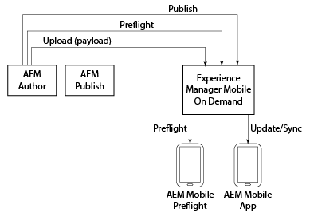

# AEM Mobile隨選{#aem-mobile-on-demand}

>[!NOTE]
>
>Adobe建議針對需要單頁應用程式架構用戶端轉換的專案使用SPA編輯器（例如React）。 [了解更多](/help/sites-developing/spa-overview.md).

>[!NOTE]
>
>如果您不是使用AEM做為內容管理來源，請參閱 [AEM Mobile隨選服務說明](https://helpx.adobe.com/digital-publishing-solution/topics.html)。

AEM提供數種工具，讓您將內容整合至行動應用程式。

下圖說明AEM mobile和On-Demand services的各個元件如何搭配使用，以便將內容發佈至行動應用程式。

AEM Preflight應用程式可視為測試環境，以在發佈前預覽應用程式和內容；而AEM mobile應用程式是最後一個專為散發而建立的應用程式。

>[!NOTE]
>
>若要深入瞭解Preflight應用程式，請參閱「 [AEM Mobile隨選服務說明」中的](https://helpx.adobe.com/digital-publishing-solution/help/preflight-app.html) 「使用AEM Preflight應用程式」。

>[!NOTE]
>
>在上圖中，AEM Mobile On-Demand services的典型部署藍本不需要AEM Publish例項。

## 啟動新行動應用程式 {#starting-a-new-mobile-app}

AEM mobile只是構成完整AEM平台的一個支柱。

要開始新的AEM mobile應用程式體驗，您必須先整合角色，才能準備好進行內容編輯。 以下角色提供建立新AEM mobile應用程式的起點：

* **管理員**
* **開發人員**
* **作者**

>[!NOTE]
>
>在使用AEM mobile並依照本快速入門手冊中的步驟進行之前，使用者應該熟悉AEM。 在這裡瞭解AEM的基 [本概念](/help/sites-deploying/deploy.md)。

### 瞭解AEM Mobile應用程式儀表板 {#understanding-the-aem-mobile-application-dashboard}

在瞭解角色和責任之前，使用者應具備 **AEM Mobile Control Center** 或應用程式 **儀表板的相關知識**。 按一 [下這裡](/help/mobile/mobile-apps-ondemand-application-dashboard.md) ，以深入瞭解您。

### AEM管理員 {#aem-administrator}

AEM管理員 ****** (Administrator)負責將新應用程式新增至AEM mobile目錄，方法是使用建立精靈建立新應用程式，或匯入現有的應用程式。 使用AEM mobile的建立精靈建立新應用程式的AEM管理員通常會從我們的現成可用的參考範例或（在大多數情況下） ***AEM開發人員建立的自訂應用程式範本中，選取所要的應用程式範本。*

AEM管理員在使用AEM Mobile隨選服務建立應用程式時，負責下列工作：

* [設定AEM Mobile](/help/mobile/aem-mobile-setup.md)
* [設定您的使用者和使用者群組](/help/mobile/aem-mobile-configure-users.md)
* [使用預檢預覽](/help/mobile/aem-mobile-manage-ondemand-services.md)
* [管理內容服務](/help/mobile/developing-content-services.md)

若要開始使用管理員的角色和責任，請參閱「 [管理內容以使用AEM Mobile隨選服務」](/help/mobile/aem-mobile.md)。

## AEM開發人員 {#aem-developer}

AEM開 **** 發人員可擴充並建立自訂的網頁範本和元件，讓*AEM Author *建立精美而引人入勝的行動體驗。 這些範本和元件不僅針對行動應用程式世界最佳化；但是，您可以與裝置和AEM伺服器（任何遠端伺服器）通訊，以全通道服務端點。 AEM的內建內容編輯器是 ** AEM作者用來在應用程式中建立豐富且相關的體驗，包括與其他Adobe Marketing cloud整合。

AEM開發人員在使用AEM Mobile隨選服務建立應用程式時，需負責下列工作：

* [應用程式範本和元件](/help/mobile/app-templates-and-components1.md)
* [具備內容同步功能的行動裝置](/help/mobile/mobile-ondemand-contentsync.md)
* [內容屬性和匯出內容](/help/mobile/on-demand-content-properties-exporting.md)
* [開發AEM Mobile內容服務](//help/mobile/developing-content-services.md)

若要開始使用開發人員的角色和責任，請參閱「 [開發適用於AEM Mobile隨選服務的AEM內容」](/help/mobile/aem-mobile-on-demand.md)。

>[!NOTE]
>
>AEM開 *發人員的角色* ，不會從範本和元件的開發開始和結束。 AEM開 ** 發人員可以建立全新的應用程式，而不只是擴充現成可用的參考實作範例。

## AEM 作者 {#aem-author}

***AEM Author *(或*Marketer *)**（使用自訂開發或現成可用的範本和元件）來新增和編輯頁面、拖放元件以及新增DAM中所有類型的媒體，包括影像、視訊和文字片段（內容片段）。 然後**AEM作者會使用AEM的內建內容編輯器，在應用程式中建立豐富且相關的體驗，包括與Adobe Marketing cloud的其他整合。

AEM作者在使用AEM Mobile隨選服務建立應用程式時，必須瞭解下列主題：

* [AEM Mobile應用程式儀表板](/help/mobile/mobile-apps-ondemand-application-dashboard.md)
* [應用程式建立和配置操作](/help/mobile/mobile-apps-ondemand-application-create-configure-action.md)
* [雲端設定](/help/mobile/mobile-on-demand-associating-an-on-demand-app-to-cloud-configuration.md)
* [管理內容](/help/mobile/mobile-apps-ondemand-manage-content-ondemand.md)
* [內容服務概觀](/help/mobile/develop-content-as-a-service.md)

若要開始使用作者的角色和責任，請參閱「 [Authoring AEM Content for AEM Mobile On-Demand Services App」（針對AEM Mobile隨選服務應用程式編寫AEM內容）](/help/mobile/mobile-apps-ondemand.md)。

>[!NOTE]
>
>AEM Author也負責設定權益、建立卡片和版面，以及傳送推播通知。 此外，如需更多有關內容製作方法的資訊；管理文章和系列；在AEM mobile中建立橫幅、卡片和版面，請參閱 [AEM Mobile隨選入口網站](https://helpx.adobe.com/digital-publishing-solution/topics.html#dynamicpod_reference_2)。

