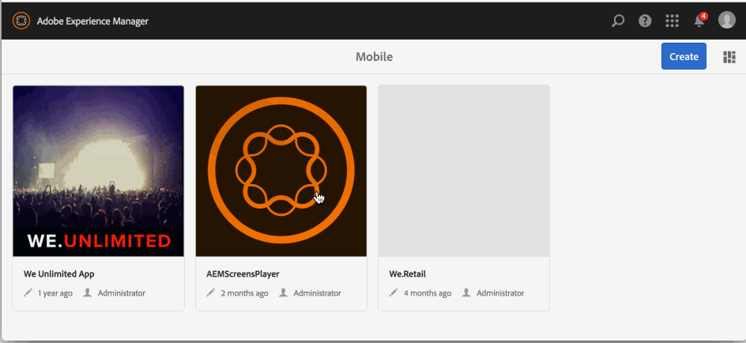

# 應用程式建立和配置操作{#application-create-and-configuration-actions}

>[!NOTE]
>
>Adobe建議針對需要單頁應用程式架構用戶端轉換的專案使用SPA編輯器（例如React）。 [了解更多](/help/sites-developing/spa-overview.md).

## 建立隨選應用程式 {#creating-an-on-demand-application}

建立應用程式通常是建立和管理AEM Mobile隨選內容的第一步，通常是在AEM管理員層級執行。 它代表內容殼層，可在行動裝置上檢視，可隨時顯示作者建立的內容，例如文章、影像、系列等。

您的應用程式詳細資訊可在儀表板或AEM Mobile控制中心中檢視。

>[!NOTE]
>
>「儀表板」是一系列有用的圖格，提供應用程式內容、中繼資料和AEM Mobile隨選連線狀態的概觀。
>
>如需詳 [細資訊，請參閱「AEM Mobile應用程式儀表板](/help/mobile/mobile-apps-ondemand-application-dashboard.md) 」。

**若要建立隨選應用程式：**

1. 從側 **欄選取** 「行動」。
1. 從「導 **覽」中** ，選取「應用程式」。
1. 按一 **下「建立** 」，然後從下 **拉式清單中選取「應用程式** 」。
1. 選擇「行動應用程式」範本，然後按「下 **一步**」。
1. 輸入應用程式屬性， **例如**「標題 **」**、「名稱 **」**、「說明」。
1. 按一 **下「下一步**」。
1. 如果已知，請輸入雲端設定詳細資訊，否則按一 **下建立**。
1. 按一 **下「完成** 」，在目錄中檢視您的新AEM mobile應用程式。

>[!NOTE]
>
>此程式可讓您在AEM中建立應用程式例項。

## 使用應用程式範本 {#using-app-templates}

應用程式範本提供簡單的方式，來運用開發人員建立的現有設計，以便在AEM中建立新應用程式。

什麼是應用程式範本？ 將它設想成代表應用程式基準或基礎的頁面範本和元件集合。
根據其他應用程式的範本建立新應用程式時，您會得到一個應用程式，其起點代表建立應用程式的應用程式。

您必須有現有的行動應用程式範本（或已安裝應用程式範本的應用程式），才能使用此功能。

### 下一步 {#the-next-step}

當您從應用程式儀表板建立隨選應用程式後，下一步就是將應用程式與雲端設定建立關聯。

如需詳 [細資訊，請參閱將應用程式與雲端設定關聯](/help/mobile/mobile-on-demand-associating-an-on-demand-app-to-cloud-configuration.md) 。

### 搶先一步 {#getting-ahead}

一旦您熟悉如何建立隨選應用程式，並因此將該應用程式關聯至雲端設定後，請參閱內容管 [理動作](/help/mobile/mobile-apps-ondemand-manage-content-ondemand.md)。

**內容管理操作** ，涉及建立和管理以下內容：

* [管理文章](/help/mobile/mobile-on-demand-managing-articles.md)
* [管理橫幅](/help/mobile/mobile-on-demand-managing-banners.md)
* [管理系列](/help/mobile/mobile-on-demand-managing-collections.md)
* [上傳共用資源](/help/mobile/mobile-on-demand-shared-resources.md)
* [發佈取消發佈內容](/help/mobile/mobile-on-demand-publishing-unpublishing.md)

要瞭解管理員和開發人員的角色和責任，請參閱以下資源：

* [針對AEM Mobile隨選服務開發AEM內容](/help/mobile/aem-mobile-on-demand.md)
* [管理內容以使用AEM Mobile隨選服務](/help/mobile/aem-mobile.md)
