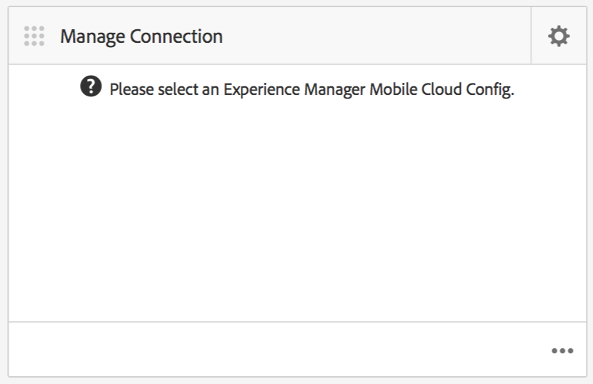

# AEM Mobile應用程式控制面板 {#aem-mobile-application-dashboard}

>[!NOTE]
>
>Adobe建議針對需要單頁應用程式架構用戶端轉譯（例如React）的專案使用SPA編輯器。 [了解更多](/help/sites-developing/spa-overview.md).

您可以從AEM Mobile Application Dashboard或控制中心管理應用程式和行動應用程式內容。

您可以鑽取「控制中心」中的每個表徵圖，以查看或編輯詳細資訊，方法是按一下「……」 在右下角。

>[!NOTE]
>
>您可以按一下圖磚的抓圖圖示（左上角9個點）來重新排列圖磚的順序。 順序變更是使用者專屬的 — 個別使用者不同。

管理應用程式內容需要開發人員、內容作者和管理員共同努力。 作者操作頁面，而頁面則是根據應用程式開發人員產生的範本和元件操作。

最後，管理員會策略性地發佈更新的應用程式內容。

## 管理應用程式圖磚 {#the-manage-app-tile}

此 **管理應用程式** 表徵圖顯示可用的應用程式資訊：

* 標題
* 說明
* 圖示
* 上次修改時間
* 上次修改者:

## 管理連接表徵圖 {#the-manage-connection-tile}

此 **管理連線** 圖磚會顯示AEM Mobile On-demand Services連線資訊：

* 計算配置名稱
* 專案名稱和ID
* 連接狀態

>[!NOTE]
>
>按一下右上方的齒輪，設定Mobile On-Demand Cloud設定。
>
>請參閱 [設定Mobile On-Demand Services](/help/mobile/mobile-on-demand-associating-an-on-demand-app-to-cloud-configuration.md) 以取得詳細資訊。

## 管理實體 {#managing-entities}

這3個圖磚可提供應用程式內容狀態的概觀：

* **橫幅**
* **文章**
* **集合**

按一下右下角的省略號(...)，可展開每個圖磚，提供更詳細的清單檢視。 這些清單檢視提供存取常見「行動隨選」動作（例如刪除、上傳和編輯屬性）的替代方式。

### 管理橫幅圖磚 {#the-manage-banners-tile}

此 **管理橫幅** 圖磚可讓您管理橫幅的內容。 系統會為橫幅顯示下列資訊：

* 影像
* **標題**:橫幅的名稱
* **已修改**:上次在AEM中修改
* **已上傳**:上次從AEM上傳
* **已發佈**:上次發佈的申請表AEM
* **來源**:來源(AEM本機或遠端來自Mobile On Demand)

下圖顯示 **管理橫幅** 「AEM Mobile應用程式控制面板」中的圖磚：

>[!NOTE]
>
>請參閱 **[管理橫幅](/help/mobile/mobile-on-demand-managing-banners.md)** 來建立、刪除或更新橫幅。

### 管理文章圖磚 {#the-manage-articles-tile}

此 **管理文章** 圖磚可讓您管理文章的內容。 文章會顯示下列資訊：

* 影像
* **標題**:文章名稱
* **已修改**:上次在AEM中修改
* **已上傳**:上次從AEM上傳
* **已發佈**:上次發佈的申請表AEM
* **來源**:來源(AEM本機或遠端來自Mobile On-Demand)

下圖顯示 **管理文章** 「AEM Mobile應用程式控制面板」中的圖磚：

>[!NOTE]
>
>請參閱 [**管理文章**](/help/mobile/mobile-on-demand-managing-articles.md) 來建立、刪除或更新文章。

### 「管理集合」表徵圖 {#the-manage-collections-tile}

此 **管理集合** 圖磚可讓您管理集合的內容。 系列會顯示下列資訊：

* 影像
* **標題**:集合的名稱
* **已修改**:上次在AEM中修改
* **已上傳**:上次從AEM上傳
* **已發佈**:上次發佈的申請表AEM
* **來源**:來源(AEM本機或遠端來自Mobile On-Demand)

下圖顯示 **管理集合** 「AEM Mobile應用程式控制面板」中的圖磚：

>[!NOTE]
>
>請參閱 **[管理集合](/help/mobile/mobile-on-demand-managing-collections.md)** 來建立、刪除或更新集合。

### 後續步驟 {#the-next-steps}

在您熟悉應用程式控制面板後，請參閱下列資源以建立行動應用程式：

* [應用程式建立和配置操作](/help/mobile/mobile-apps-ondemand-application-create-configure-action.md)
* [將隨選應用程式與雲端設定關聯](/help/mobile/mobile-on-demand-associating-an-on-demand-app-to-cloud-configuration.md)
* [內容管理動作](/help/mobile/mobile-apps-ondemand-manage-content-ondemand.md)

### 其他資源 {#additional-resources}

若要了解管理員和開發人員的角色和責任，請參閱下列資源：

* [為AEM Mobile On-demand Services開發AEM內容](/help/mobile/aem-mobile-on-demand.md)
* [管理內容以使用AEM Mobile On-demand Services](/help/mobile/aem-mobile.md)
