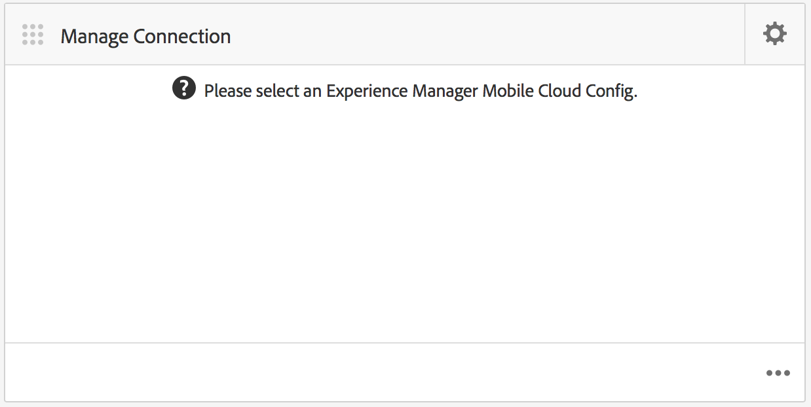
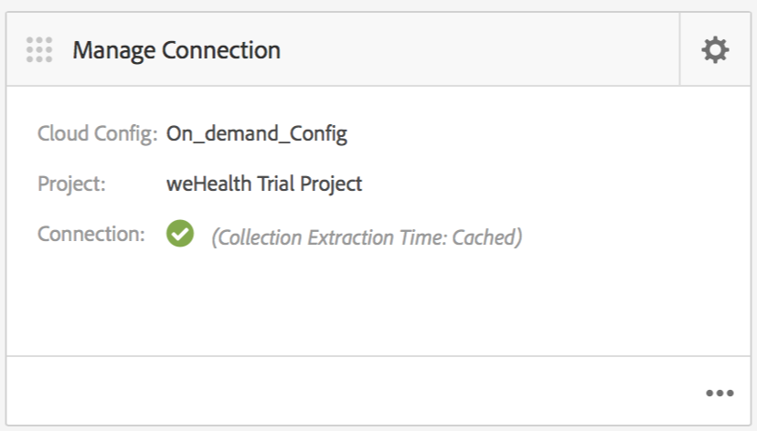

# 雲端設定{#cloud-configuration}

>[!NOTE]
>
>Adobe建議針對需要單頁應用程式架構用戶端轉換的專案使用SPA編輯器（例如React）。 [了解更多](/help/sites-developing/spa-overview.md).

將隨選應用程式與雲端設定關聯後，Adobe Experience Manager(AEM)可以建立雙向連結，直接與Mobile On-Demand代管專案通訊。 透過將應用程式連結至Mobile On-Demand專案，您就可以在AEM中執行內容建立，例如文章、橫幅和系列，但也可以將該內容提供給Mobile On-Demand。

從那裡，發佈、預覽和管理內容變得可能。 您也可以將現有的Mobile On-Demand內容匯入AEM並執行內容編輯。

## 設定雲端設定 {#setting-up-cloud-configuration}

>[!CAUTION]
>
>在您開始為隨選應用程式設定雲端設定之前，您必須熟悉AEM Mobile布建和設定AEM Mobile隨選服務用戶端。
>
>如需詳細資訊， [請參閱「管理」區段中的「設定AEM Mobile隨選服務](/help/mobile/aem-mobile-setup.md) 」。

若要設定Mobile On-Demand Cloud Services，請從應用程式儀表板按一下「管理連線」方塊右上角的 **** 上檔。

您應該熟悉應用程式儀表板和可用的圖格。 如需詳 [細資訊，請參閱「AEM Mobile應用程式儀表板](/help/mobile/mobile-apps-ondemand-application-dashboard.md) 」。

### 設定雲端設定連結 {#setting-up-link-to-cloud-configuration}

>[!CAUTION]
>
>確定您有現有的隨選用戶端和雲端設定。
>
>如需詳細資訊， [請參閱「管理」區段中的「設定AEM Mobile隨選服務](/help/mobile/aem-mobile-setup.md) 」。

下列步驟說明設定雲端設定連結：

1. 從 **Mobile**，從型錄中選 **擇「應用程式** 」，然後選擇您的Mobile On-Demand應用程式。
1. 按一下「管理連接」( **Manage Connection** )表徵圖上的齒輪表徵圖。

   

1. 輸入現有的設定，或輸入設定標題、裝 **置Id****和裝置Token**，以建立新 ****&#x200B;的設定。

   

1. 在驗證 **您的裝置Id****和裝置Token後** ，請從清單中選擇您的隨選專案。

   按一 **下提交**。

   

   「管 **理連線** 」方塊會顯示您的雲端設定。

   

   >[!CAUTION]
   >
   >如果您嘗試變更此應用程式與哪個專案相關聯，在儀表板中切換專案時，您會收到內容完整性問題的警告，如下圖所示：

   

### 後續步驟 {#the-next-steps}

在您為應用程式設定雲端設定後，請參閱下列內容管理資源：

* [管理文章](/help/mobile/mobile-on-demand-managing-articles.md)
* [管理橫幅](/help/mobile/mobile-on-demand-managing-banners.md)
* [管理系列](/help/mobile/mobile-on-demand-managing-collections.md)
* [上傳共用資源](/help/mobile/mobile-on-demand-shared-resources.md)
* [發佈／取消發佈內容](/help/mobile/mobile-on-demand-publishing-unpublishing.md)
* [使用預檢預覽](/help/mobile/aem-mobile-manage-ondemand-services.md)
