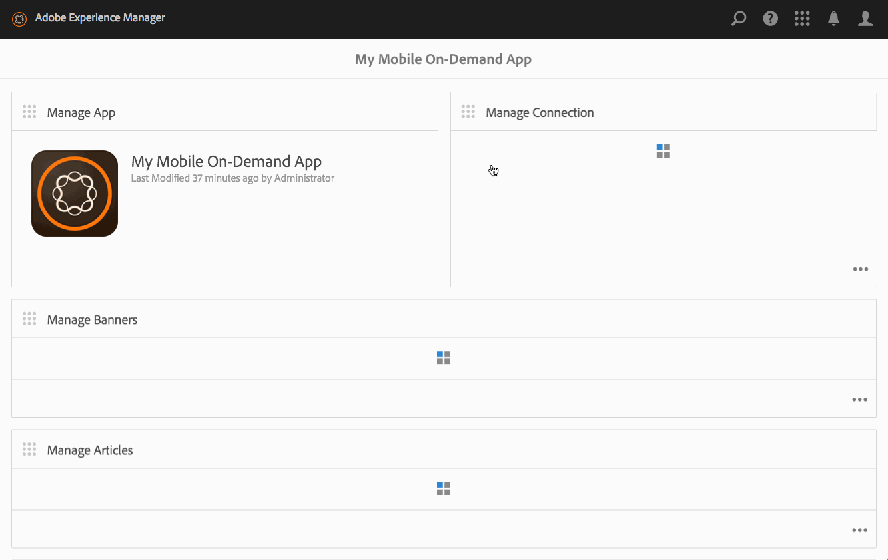

# 管理文章{#managing-articles}

>[!NOTE]
>
>Adobe建議針對需要單頁應用程式架構用戶端轉換的專案使用SPA編輯器（例如React）。 [了解更多](/help/sites-developing/spa-overview.md).

「內容管理」動作是協助在應用程式中建立和管理文章的建立區塊。 下列動作會在應用程式內的文章上執行。

## 文章概觀 {#articles-overview}

文章會以文字和圖稿來表示資訊。

>[!NOTE]
>
>請參閱「線上說明」中的下列資源，以瞭解AEM mobile應用程式中的下列主題：
>
>* [設計考量](https://helpx.adobe.com/digital-publishing-solution/help/design-app.html)
   >
   >
* [管理文章](https://helpx.adobe.com/digital-publishing-solution/help/creating-articles.html)
>

## 建立文章 {#creating-an-article}

建立文章的一般工作流程如下：

1. 從側 **欄選取** 「行動」。
1. 從Mobile，從目錄中選擇您的Mobile On-Demand應用程式。
1. 按一下「管理文章」方塊右上角的 **向下箭頭** 。
1. 選擇文章範本，然後按一下「 **下一步**」。
1. 在精靈的每個步驟中工作，以繼續建立新文章。
1. 準備就緒後，按一下「 **建立**」。
1. 您的新文章會出現在「管理 **文章」方塊** 。

## 匯入新文章 {#importing-a-new-article}

現有的Mobile On-Demand內容可從Mobile On-Demand下載（匯入）至AEM。 這可讓您編輯和檢視本機內容。

>[!NOTE]
>
>匯入不包含影像。

匯入新文章的工作流程

1. 從Mobile，從目錄中選擇您的行動隨選應用程式。
1. 按一下「管理文章」方塊右上角的向下箭頭， **然後選取「匯入文章** 」。
1. 按一 **下對話方塊上的** 「匯入文章」，然後按一下「關閉」。
1. 您的Mobile On-Demand文章現在會顯示在「管理文 **章** 」方塊中。

>[!CAUTION]
>
>您必須先建立行動隨選連線的關聯。

## 編輯文章 {#editing-an-article}

使用內建的AEM拖放編輯器來新增或變更文章。 可新增／移除文字和影像等元件。 可插入DAM資產的影像。

>[!CAUTION]
>
>只有在AEM中建立的文章才能在編輯器中開啟。

編輯文章的工作流程：

1. 從Mobile，從目錄中選擇您的Mobile On-Demand應用程式。
1. 從「管理文章」方塊選取AEM **來源的文章** 。
1. 按一下清單檢視中反白顯示的文章，在內容編輯器中開啟它。
1. 使用內容編輯器來拖曳文章內容（手稿、影像、文字等）。

### 檢視和編輯文章中的中繼資料 {#viewing-and-editing-the-metadata-within-an-article}

文章、橫幅等內容擁有許多屬性，例如標題、說明、影像。 此操作用於查看和修改這些屬性。 （可選）這些變更可在儲存時上傳至Mobile On-Demand。

檢視／編輯文章的一般工作流程：

1. 從Mobile，從目錄中選擇您的Mobile On-Demand應用程式。
1. 從「管理文章」方塊 **中選擇文章** 。

1. 從操 **作欄中選擇** 「查看屬性」。
1. 檢視該文章的所有可用中繼資料。
1. 視需要編輯中繼資料，然後在完成時 **按一下** 「儲存」。
1. （可選）立即將變更上傳至Mobile On-Demand。

## 上傳文章 {#uploading-an-article}

上傳動作會複製選取的內容，並將其新增至Mobile On-Demand專案。 現有的行動隨選內容會由新版本取代。

上傳文章的一般工作流程：

1. 從 **Mobile**，從型錄中選擇您的Mobile On-Demand應用程式。
1. 在「管 **理文章** 」方塊中，選取要上傳至「行動隨選」的文章。
1. 視需要從清單檢視新增更多文章。
1. 從動 **作列選取** 「上傳」，然後在對話方塊中按一下「上傳」。
1. 您的文章現在會上傳到行動隨選。

## 刪除文章 {#deleting-an-article}

此作業會從Mobile On-Demand中刪除選取的內容，並選擇性地從本機AEM例項中刪除。

刪除文章的一般工作流程：

1. 從Mobile，從目錄中選擇您的Mobile On-Demand應用程式。
1. 在「管理文章」方塊中選取要刪 **除的文章** 。
1. 請確定清單中已選取（視需要選取其他要刪除的項目）。
1. 按一 **下動作列** 中的「刪除」。
1. 檢查您是否要從AEM和Mobile On-Demand中刪除。
1. 按一 **下刪除**。
1. 您的文章現在會從清單中移除。

### 後續步驟 {#the-next-steps}

一旦您瞭解管理文章，請參閱

* [管理橫幅](/help/mobile/mobile-on-demand-managing-banners.md)
* [管理系列](/help/mobile/mobile-on-demand-managing-collections.md)
* [上傳共用資源](/help/mobile/mobile-on-demand-shared-resources.md)
* [發佈／取消發佈內容](/help/mobile/mobile-on-demand-publishing-unpublishing.md)
* [使用預檢預覽](/help/mobile/aem-mobile-manage-ondemand-services.md)
