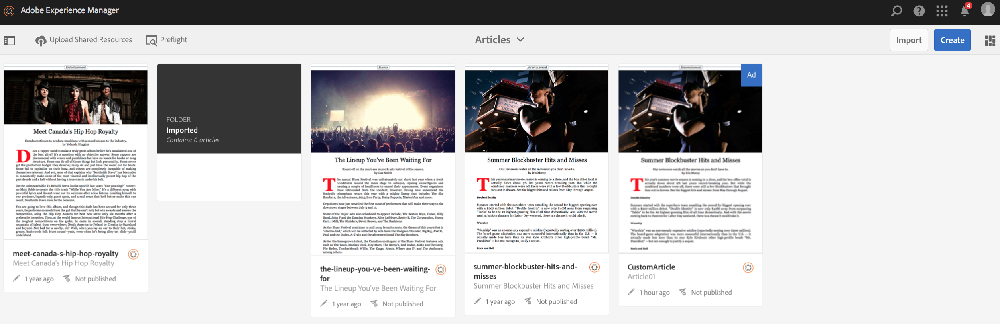

# 上傳共用資源 {#uploading-shared-resources}

>[!NOTE]
>
>Adobe建議針對需要單頁應用程式架構用戶端轉換的專案使用SPA編輯器（例如React）。 [了解更多](/help/sites-developing/spa-overview.md).

內容管理動作是協助建立和管理應用程式內容的建立區塊。 對應用程式內的內容執行下列動作。

>[!NOTE]
>
>若要進一步瞭解AEM mobile應用程式的設計考量，請參閱「線上說 [明」中的「AEM mobile應用程式的設計考量](https://helpx.adobe.com/digital-publishing-solution/help/design-app.html) 」。

>[!CAUTION]
>
>您必須先建立行動隨選連線的關聯。

## 上傳共用資源 {#uploading-shared-resources-1}

通常，文章等內容必須在所有作者甚至應用程式中擁有相同的外觀和感覺。 因此，讓所有人都能使用指令碼、css和字型是必要的。 此操作會將這些共用資源傳送至Mobile On-Demand，然後視需要使用。

在您設定應用程式並將其關聯至雲端設定後，就可以上傳共用資源。 如需將應用程式關聯至雲端設定的詳細步驟，請按一下 [這裡](/help/mobile/mobile-apps-ondemand-application-create-configure-action.md)。

>[!NOTE]
>
>共用資源使用ContentSync收集所有不同的資源。 如需詳 [細資訊，請參閱Mobile with ContentSync](/help/mobile/mobile-ondemand-contentsync.md) 。

請依照下列步驟，上傳文章的共用資源：

1. 從「管理文章」方 **塊中選取文章** 。
1. 按一 **下「上傳共用資源** 」以上傳共用的HTML資源。

   

### 下一步 {#the-next-step}

在您瞭解建立和發佈內容後，請參閱

* [針對AEM Mobile隨選服務開發AEM內容](/help/mobile/aem-mobile-on-demand.md)
* [管理內容以使用AEM Mobile隨選服務](/help/mobile/aem-mobile.md)

或者，您仍需瞭解製作主題，請參閱

[製作適用於AEM Mobile隨選服務應用程式的AEM內容](/help/mobile/mobile-apps-ondemand.md)
