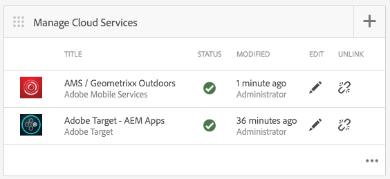

# AEM Mobile內容個人化{#aem-mobile-content-personalization}

>[!NOTE]
>
>Adobe建議針對需要以單頁應用程式框架為基礎的使用者端轉譯（例如React）的專案，使用SPA編輯器。 [深入了解](/help/sites-developing/spa-overview.md)。

>[!NOTE]
>
>本檔案屬於 [AEM Mobile快速入門](/help/mobile/getting-started-aem-mobile.md) 指南，AEM Mobile參考的建議起點。

AEM Mobile內容個人化功能允許 [AEM作者](#author) 使用個人化行動應用程式內容 [Adobe Target](https://business.adobe.com/products/target/adobe-target.html). 這可讓您將目標優惠方案傳送給行動應用程式使用者。 Adobe Experience Manager Mobile提供建立、鎖定和傳送內容的功能，這些內容將為使用者提供適合其個人品味的內容。

在AEM中，若要讓作者開始建立此內容，管理員和開發人員必須先準備環境。

[AEM管理員](#administrator) 在AEM Mobile與Adobe TargetCloud Service之間建立連線時需要使用。

與此同時，AEM Mobile [開發人員](#developer) 必須編輯其現有的指令碼，以利製作目標內容。

## 適用於管理員 {#for-administrators}

必須先執行數個步驟，內容作者才能開始為行動應用程式產生鎖定內容：為使用者和群組取得正確的一組許可權、建立雲端服務、為活動設定應用程式，以及最終產生內容。

本文會逐步引導您完成設定 [AEM Mobile混合式參考應用程式](https://github.com/Adobe-Marketing-Cloud-Apps/aem-mobile-hybrid-reference) 進行目標定位。

我們日後會假設AEM Mobile混合參考應用程式已透過AEM Mobile控制面板成功部署及存取。

在作者可以在應用程式中產生目標內容之前，您的AEM例項必須 [以Adobe TargetCloud Service設定。](/help/mobile/aem-mobile-configuring-cloud-service.md)

### 權限 {#permissions}

需要存取個人化主控台的使用者必須屬於 `target-activity-authors` 群組。

建議將target-activity-group新增至apps-admins群組，作為使用者和群組設定的一部分。 透過新增target-activity-authors群組，這可讓使用者看到「個人化」導覽功能表專案。

>[!NOTE]
>
>若忘記將您想要存取個人化Admin Console的使用者或群組新增至target-activity-authors群組，會導致使用者無法看到個人化主控台。

### 雲端服務 {#cloud-services}

若要讓目標內容適用於行動應用程式，有兩個服務必須設定： Adobe Target服務和Adobe行動服務服務。 Adobe Target服務提供處理使用者端請求和傳回個人化內容的引擎。 Adobe行動服務會透過AMS Cordova外掛程式使用的ADBMobileConfig.json檔案，提供Adobe服務和行動應用程式之間的連線。 在AEM Mobile Dashboard中，您可以新增兩項服務來設定應用程式。

在AEM Mobile控制面板中，找出管理Cloud Service並按一下+按鈕。


在新增Cloud Service精靈中，選取「Adobe Target」雲端服務卡並按下一步。


從「選取組態」下拉式清單中，您可以建立組態或從現有組態中選取。 若要建立設定，請從下拉式清單中選取「建立設定」。 輸入Target設定的標題。 輸入與您的Target帳戶相關聯的使用者端代碼、電子郵件和密碼。 如果您不知道這些欄位的值，請聯絡Adobe Target支援。 按一下「驗證」按鈕以驗證認證。 確認後，按一下提交按鈕以建立雲端服務。

>[!NOTE]
>
>所建立的雲端服務會透過精靈自動關聯至行動應用程式。 在應用程式群組節點的jcr：content節點上設定cq：cloudserviceconfigs屬性值。 對於混合式應用程式範例，它會在/content/mobileapps/hybrid-reference-app/jcr：content上設定，且值指向在/etc/cloudservices/testandtarget/adobe-target—aem-apps/framework自動產生的架構節點。 框架節點預設會設定兩個屬性：性別和年齡。 此架構僅供AEM預覽使用，對裝置沒有任何影響。

完成精靈後， 「管理Cloud Service」表徵圖會包含Target雲端服務。 但是，其中包含有關遺失Adobe Mobile Service帳戶的警告。


### Adobe行動服務 {#adobe-mobile-services}

也必須將AdobeMobile Services (AMS)帳戶連結至應用程式，AMS服務提供必要的ADBMobileConfig.json檔案（其中包含Target使用者端程式碼資訊）。 在與AMS帳戶建立關聯之前，必須由擁有AMS許可權的使用者修改AMS帳戶。

### 用戶端代碼 {#client-code}

若要登入AMS服務，請造訪 [https://mobilemarketing.adobe.com](https://mobilemarketing.adobe.com/)，選取行動應用程式並按一下設定。 找出「SDK目標選項」欄位，並將使用者端代碼置於欄位中，然後按一下「儲存」。


現在，使用者端代碼已與行動應用程式相關聯，當透過Adobe行動儀表板設定AMS雲端服務時，服務設定的設定將透過ADBMobileConfig.json檔案傳送。

### Adobe行動服務Cloud Service {#adobe-mobile-service-cloud-service}

現在已設定AMS，是時候在Adobe行動控制面板中建立行動應用程式的關聯了。 在AEM Mobile控制面板中，找出管理Cloud Service並按一下+按鈕。


選取AdobeMobile Services卡片，然後按下一步。


從建立或選取精靈步驟中，選取行動服務下拉式清單，然後選取建立設定專案。 提供標題、公司、使用者名稱、密碼，並選取適當的資料中心。 如果您不知道這些值，請聯絡您的Adobe Mobile Service管理員以取得這些值。 填寫完所有欄位後，按一下 **驗證**. 驗證程式會移至AMS並驗證帳戶的憑證，在成功驗證時，行動應用程式清單會填入，您可在此處從下拉式清單中選取關聯的行動應用程式。 按一下 **提交** 以完成精靈。 此程式可能需要一點時間才能取得設定資料，以及與應用程式關聯的任何分析。 程式完成後，按一下 **完成** 以返回Adobe行動儀表板。

回到行動控制面板時，「管理Cloud Service」表徵圖會包含AMS雲端服務。 此外，「分析量度」圖磚會填入生命週期報表。



## 適用於作者 {#for-authors}

**先決條件：** 如上所述，管理員必須先設定與Adobe Target服務的連線，作者才能產生新的目標內容。

在管理員設定了兩個雲端服務，且開發人員設定了mobileappoffers處理常式後，內容作者現在可以開始產生鎖定目標的體驗。

在AEM Mobile應用程式中編寫目標內容時，會遵循與編寫AEM Sites類似的程式：

如需下列專案的完整概觀，請參閱這裡 [在AEM中製作目標內容](/help/sites-authoring/personalization.md)

## 適用於開發人員 {#for-developers}

建置行動應用程式的AEM開發人員在開發元件時，應該繼續遵循AEM中常用的模式。 在此，Adobe會逐步引導您執行必要步驟，讓內容作者建立目標內容：

### Adobe Target ContentSync處理常式 {#adobe-target-contentsync-handlers}

為了將內容傳送至使用者的裝置，內容會透過轉譯AEM內容作者建立的選件來產生。 為了處理目標選件的轉譯，有一個新的內容同步處理常式可處理選件。 使用混合參考應用程式作為範例，en （英文）內容套件包含的ContentSyncConfig具有 [mobileappoffers](https://github.com/Adobe-Marketing-Cloud-Apps/aem-mobile-hybrid-reference/blob/master/aem-package/content-author/src/main/content/jcr_root/content/mobileapps/hybrid-reference-app/en/_jcr_content/pge-app/app-config-dev/targetOffers/.content.xml) 處理常式。 下一步是將選件轉譯至裝置時十分重要。 mobileappoffers處理常式具有path屬性，可識別用於應用程式的個人化活動路徑。

例如，如果活動在 */content/campaigns/hybridref*，複製此路徑，並將其作為值貼到 *路徑* mobileappoffers處理常式的屬性。

>[!NOTE]
>
>對於混合參考應用程式，有兩個mobileappoffers處理常式，一個用於開發，另一個用於生產。

在mobileappoffers處理常式的path屬性中設定活動路徑後，請儲存處理常式。 處理常式現在已準備好開始呈現行動裝置的選件。

### 演算模式 {#render-mode}

Mobileappoffers處理常式的設定方式與發佈和開發設定不同。 對於發佈設定，有一個稱為的屬性 *轉譯模式* ，值為 *發佈* 在cq：ContentSyncConfig節點上設定。 mobileappoffers處理常式會參照renderMode，並在設為publish時編輯所建立的mbox id。 依預設，AEM建立的mbox會將 — author值附加至mbox ID。 這會識別活動尚未發佈，且應使用未發佈的行銷活動來解析優惠方案。

透過Adobe行動儀表板將內容分段時，分段內容會被視為生產就緒內容，並透過非開發內容同步設定進行轉譯。 以此方式呈現會導致 — author從所有mbox id中移除，並預期Target伺服器上會有已發佈的活動。 在測試分階段內容之前，請確定活動已發佈。

### 個人化應用程式開發 {#personalization-app-development}

#### 元件 {#components}

任何內容的基礎通常是頁面元件，可根據您使用的是HTL或JSP來擴充其中一個基本AEM頁面元件wcm/foundation/components/page或foundation/components/page。 這些步驟的持續時間聚焦於使用wcm/foundation/components/page元件。 頁面元件的基本結構會劃分為多個指令碼，每個指令碼提供特定用途，讓開發人員可視需要整理及覆寫其程式碼。 個人化感興趣的兩個指令碼是head.html和body.html。 這兩個指令碼提供一個區域，其中可插入程式碼以支援Context Hub、Cloud Service和行動編寫。

以下是啟用內容鎖定目標的兩個主要指令碼概觀。

#### head.html {#head-html}

若要讓作者能夠鎖定其內容，必須將目標功能表新增至頁面，讓作者可以將內容從編輯模式變更為目標定位模式。 若要啟用此功能，開發人員應修改head.html指令碼，在靠近head.html頂端或靠近 &lt;title>&lt;/title> 元素的位置。

```xml
<meta data-sly-test="${!wcmmode.disabled}">
    <div data-sly-call="${clientLib.all @ categories='personalization.kernel'}" data-sly-unwrap></div>
    <div data-sly-resource="${'config' @ resourceType='cq/personalization/components/clientcontext_optimized/config'}" data-sly-unwrap></div>
    <div data-sly-resource="${'contexthub' @ resourceType='granite/contexthub/components/contexthub'}" data-sly-unwrap></div>
</meta>
```

>[!NOTE]
>
>只有在停用WCM模式（例如停用WCM模式）（請參閱ContentSync處理常式一節的詳細資訊）時，指令碼才會包含在最終應用程式程式碼中。

為了讓作者能預覽目標內容，編輯器必須能找到Adobe Target雲端服務的設定。 下列程式碼區塊新增兩個重要指令碼。 首次新增頁面尋找相關Target雲端服務，並向Adobe Target發出呼叫的功能。 第二個是新增cq.apps.targeting類別。

此 **cq.apps.targeting** 類別會覆寫預設的cq/personalization/component/target元件，並使用可呈現專門供行動應用程式使用之選件的mobileapps/components/target元件。 有關詳細資訊，請參閱Target元件區段。

程式碼應新增至head.html中，並放置在 &lt;/head> 元素。

```xml
<div data-sly-test="${!wcmmode.disabled}">
    <div data-sly-include="/libs/cq/cloudserviceconfigs/components/servicelibs/servicelibs.jsp" data-sly-unwrap></div>
    <meta data-sly-call="${clientLib.all @ categories='cq.apps.targeting'}" data-sly-unwrap></meta>
</div>
```

>[!NOTE]
>
>程式碼區塊包裝在WCM模式中時不會停用，因此只有在內容作者正在建立內容時才會發揮作用。 雲端服務指令碼不會新增至產生的行動執行階段程式碼。

#### body.html {#body-html}

若要讓內容作者能夠測試不同角色，body.html指令碼必須包括下列程式碼區塊，作為body元素的第一個子項。

```xml
<div data-sly-test="${!wcmmode.disabled}">
    <div data-sly-resource="${'clientcontext' @ resourceType='cq/personalization/components/clientcontext_optimized'}" data-sly-unwrap></div>
</div>
```

最後需要的程式碼位元位於body.html底部。 此程式碼位元會尋找關聯的雲端服務，並注入適當的目標定位引擎程式碼。

```xml
<div data-sly-test="${!wcmmode.disabled}">
    <div data-sly-resource="${'cloudservices' @ resourceType='cq/cloudserviceconfigs/components/servicecomponents'}" data-sly-unwrap></div>
</div>
```

### 參考應用程式 {#reference-application}

head.html和body.html的範例可以在 [AEM Mobile混合式參考應用程式](https://github.com/Adobe-Marketing-Cloud-Apps/aem-mobile-hybrid-reference) 向開發人員顯示將指令碼區塊置於兩個指令碼中的位置。

### 內容同步處理常式 {#content-sync-handlers}

當內容作者完成行動應用程式的內容建立後，下一步就是下載來源並建置應用程式，或暫存要發佈的內容。 要實現這一目標，開發人員必須參與數個步驟。 為協助呈現內容，AEM Mobile使用內容同步處理常式來呈現及封裝內容。 已為「個人化」使用案例引入新的內容同步處理常式，以便呈現目標內容。 「mobileappoffers」處理常式會知道如何呈現內容作者所建立的相關目標選件。 mobileappoffers處理常式會擴充抽象頁面更新處理常式，因此許多屬性都類似。 mobileappoffers處理常式的詳細資訊有下列屬性。

<table>
 <tbody>
  <tr>
   <td><strong>屬性</strong></td>
   <td><strong>值</strong></td>
   <td><strong>說明</strong></td>
  </tr>
  <tr>
   <td>重寫</td>
   <td>+相對父路徑<p> - "/"</p> </td>
   <td>rewrite屬性可識別應如何重寫內容中的路徑。</td>
  </tr>
  <tr>
   <td>includedPageTypes</td>
   <td><p>"cq/personalization/components/teaserpage",</p> <p>"cq/personalization/components/offerproxy"</p> </td>
   <td>includePageTypes屬性是選用屬性，預設為具有cq/personalization/components/teaserpage和cq/personalization/components/offerproxy資源型別的頁面。 鎖定內容時，系統會使用這兩種資源型別作為預設資源型別。 如果必須支援其他資源型別，請將它們新增至includePageTypes清單。</td>
  </tr>
  <tr>
   <td>locationRoot</td>
   <td>/content/mobileapps/&lt;app&gt;</td>
   <td>應用程式的位置。</td>
  </tr>
  <tr>
   <td>類型</td>
   <td>mobileappoffers</td>
   <td>正在執行mobileappoffers的處理常式名稱。</td>
  </tr>
  <tr>
   <td>選擇器</td>
   <td>tandt</td>
   <td>tandt選擇器可用來轉譯目標內容。 </td>
  </tr>
  <tr>
   <td>targetRootDirectory</td>
   <td>www</td>
   <td>要保留轉譯之內容的根目錄。</td>
  </tr>
  <tr>
   <td>includeImages</td>
   <td>true | false</td>
   <td>如果為True，則會轉譯選件中包含的任何影像。 若為false，則會略過影像。</td>
  </tr>
  <tr>
   <td>includeVideo</td>
   <td>true | false</td>
   <td>如果為True，則會轉譯選件中包含的任何影片。 若為false，則會略過視訊。</td>
  </tr>
  <tr>
   <td>path</td>
   <td>/content/campaigns/&lt;brand&gt;</td>
   <td>指向優惠方案參與的行銷活動品牌。 目前所有優惠方案必須來自相同行銷活動。</td>
  </tr>
  <tr>
   <td>深入</td>
   <td>true | false</td>
   <td>如果為true會遞迴轉譯所有子頁面，如果為false則不會遞回。 </td>
  </tr>
  <tr>
   <td>副檔名</td>
   <td>html</td>
   <td>設定正在轉譯之資源的延伸。 設定為html，讓頁面的副檔名為.html。</td>
  </tr>
 </tbody>
</table>

>[!NOTE]
>
>此 [AEM Mobile混合參考應用程式](https://github.com/Adobe-Marketing-Cloud-Apps/aem-mobile-hybrid-reference) 具有預設mobileappoffer處理常式的設定。 範例中的路徑屬性是空的，因為它取決於行銷活動位置。 Campaign作者建立行銷活動後，應用程式管理員應指定指向行銷活動的路徑屬性，將Campaign與處理常式建立關聯。

### 目標元件 {#target-component}

為協助轉譯行動應用程式專屬的內容，AEM Mobile使用mobileapps/components/target元件。 行動目標元件會擴充cq/personalization/components/target元件，並覆寫engine_tnt.jsp指令碼。 藉由覆寫engine_tnt.jsp，AEM Mobile可控制為行動應用程式使用案例產生的HTML。 對於內容作者鎖定的每個元件，都會由engine_tnt.jsp建立關聯的mbox。

對於每個mbox，屬性為 **cq目標定位** 新增功能，讓應用程式開發人員可撰寫自訂程式碼，以便依需求使用及使用。 此 [AEM Mobile混合參考應用程式](https://github.com/Adobe-Marketing-Cloud-Apps/aem-mobile-hybrid-reference) 有一個使用cq-targeting屬性的Angular指示詞範例。 內容取代的概念（何時及如何進行）由行動應用程式開發人員決定。 有一個透過AEM /etc/clientlibs/mobileapps/js/mobileapps.js傳遞的行動SDK，其提供呼叫Adobe鎖定目標服務的API。 應用程式開發人員可自行指定何時應根據應用程式的設計進行呼叫。

## 下一步? {#what-s-next}

1. [開始我的AEM Mobile應用程式體驗](/help/mobile/starting-aem-phonegap-app.md)
1. [管理我的應用程式內容](/help/mobile/phonegap-manage-app-content.md)
1. [建置我的應用程式](/help/mobile/building-app-mobile-phonegap.md)
1. [透過AdobeMobile Analytics追蹤我的應用程式效能](/help/mobile/phonegap-intro-to-app-analytics.md)
1. [使用Adobe Target提供個人化應用程式體驗](/help/mobile/phonegap-aem-mobile-content-personalization.md)
1. [傳送重要訊息給我的使用者](/help/mobile/phonegap-push-notifications.md)
