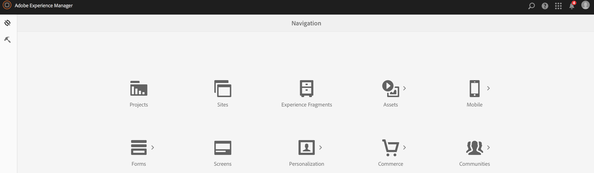

# 應用程式定義{#app-definitions}

>[!NOTE]
>
>Adobe建議針對需要單頁應用程式架構用戶端轉換的專案使用SPA編輯器（例如React）。 [了解更多](/help/sites-developing/spa-overview.md).

應用程式定義是識別哪些空格和其他組態適合應用程式的方法。 應用程式定義可讓使用者新增空間，而不需重新編譯應用程式。 應用程式定義會更新，其中會包含任何新空格的資訊。

>[!NOTE]
>
>應用程式定義會系結至應用程式，因此需要在AEM Mobile應用程式主控台中建立應用程式。

## 建立新的應用程式定義 {#creating-a-new-app-definition}

1. 從「 **AEM Navigation Console** 」中選擇「Mobile」。

   

1. 選擇「 **Apps** from **Mobile** 」，然後按一下「 **建立」。**

   選擇「 **應用程式** 」並輸入詳細資訊，以建立您的新應用程式。

   

### 後續步驟 {#the-next-steps}

熟悉「應用程式定義」後，請進一步瞭解下列製作資源：

* [匯入現有的混合應用程式](/help/mobile/phonegap-adding-content-to-imported-app.md)
* [使用「建立應用程式精靈」建立新應用程式](/help/mobile/phonegap-create-new-app.md)
* [Content Services](/help/mobile/develop-content-as-a-service.md)

## 其他資源 {#additional-resources}

要瞭解管理員和開發人員的角色和責任，請參閱以下資源：

* [使用AEM為Adobe PhoneGap Enterprise進行開發](/help/mobile/developing-in-phonegap.md)
* [使用AEM管理Adobe PhoneGap Enterprise的內容](/help/mobile/administer-phonegap.md)

