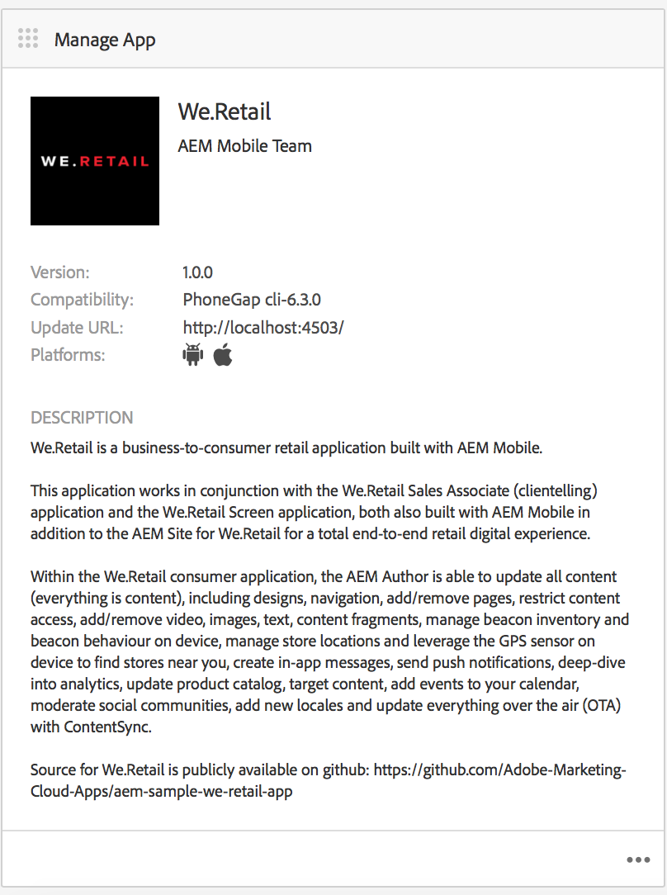

# 管理應用程式圖格{#manage-app-tile}

>[!NOTE]
>
>Adobe建議針對需要單頁應用程式架構用戶端轉換的專案使用SPA編輯器（例如React）。 [了解更多](/help/sites-developing/spa-overview.md).

「應 **用程式儀表板** 」上的「管理應用程式圖格」可讓您修改應用程式的詳細資訊。 若要開啟「詳細資料」頁面，請按一下「管理應用程式」圖格的詳細資料連結。 在「管理應用程式」頁面中，您可以編輯PhoneGap應用程式設定(config.xml)設定，並準備您的應用程式以送出至各種應用程式商店。



## 瞭解管理應用程式圖格 {#understanding-the-manage-app-tile}

您可以按一下「 **Manage App** 」（管理應用程式）方塊中的每個方塊來檢視或編輯詳細資訊 在右下角。

### 「基本」頁籤 {#the-basic-tab}

您可以從此標籤中編 **輯應用程式的名稱**、作者、簡 **短說明**，以及您應 ******** 用程式的說明。


### 進階標籤 {#the-advanced-tab}

每個行動應用程式平台都會說明所收集的資料，並特別針對每個應用程式商店。

顯示的平台由PhoneGap config.xml內容驅動：

```xml
<widget>
<gap:platform name="ios"/>
<gap:platform name="android"/>
</widget>
```

例如，每個廠商應用程式商店（例如Apple App Store或Google Play商店）都需要您行動應用程式的一或多個螢幕擷取畫面，才能向客戶顯示您的應用程式詳細資訊。 這些螢幕擷取畫面在尺寸和內容方面可能有嚴格要求（基本上它們必須真正代表應用程式）。 AEM Apps提供支援，可針對支援的平台選取和管理這些螢幕擷取畫面，並視每個廠商的應用程式商店需要檢視埠尺寸。

>[!NOTE]
>
>AEM Verify應用程式提供在AEM中直接將螢幕擷取畫面傳送至您的應用程式詳細資訊的功能。
>
>如需詳 [細資訊，請參閱AEM的Mobile快速入門](/help/mobile/phonegap-mobile-quickstart.md) (Quickstart)。


### 中繼資料 {#metadata}

>[!NOTE]
>
>熟悉「管理應用程式」圖 **格後** ，請參閱「編 [輯應用程式中繼資料](/help/mobile/phonegap-editmetadata.md) 」以檢視和編輯中繼資料。

#### 常見中繼資料 {#common-metadata}

每個應用程式都應該有關聯的中繼資料，以協助設定應用程式的不同層面。 「管理應用程式」頁面會分為兩個與中繼資料收集相關的不同區域。 平台特定的中繼資料和一般中繼資料。

所有平台都有通用的組態和中繼資料。

在本節中，您定義Content Update Server URL、行動應用程式的登陸頁面、用於編譯的PhoneGap版本、應用程式版本、名稱、說明等。

**應用程式版本** (App Version)是您應用程式的運作版本。 通常的最佳實務是使用3小數記號，並在第一個版本之前從1.0.0以下開始。

**PhoneGap Version** 是您希望使用PhoneGap編譯應用程式的版本。 最佳實務是跟上最新版本，以確保您取得最新、最好的功能和錯誤修正。

**Content Update Server URL** （內容更新伺服器URL）是您的應用程式用來呼叫ContentSync更新的URL。 它必須設定為您的Dispatcher URL，或（若未使用Dispatcher）設定為其中一個發佈例項，用以將ContentSync更新提供給您的應用程式。


>[!NOTE]
>
>除非有資料填入欄位，否則此區段可能會顯示為空白。
>
>在詳細資訊檢視的頂端，您會看到「應用程式版本」、「PhoneGap版本」和「更新URL」，這些值都可在「常用中繼資料」區段中設定。 不過，無法編輯應用程式ID。

#### 平台中繼資料 {#platform-metadata}

在PhoneGap config.xml中定義的每個平台都可包含自訂平台屬性。 AEM開發人員必須提供內容結構才能擷取這些屬性。 如需iOS平台特定屬性的提供範例，請參閱。

所有已設定平台的中繼資料現在會同時顯示在「管理應用程式」方塊的「進階」標籤上。

>[!NOTE]
>
>在CLI或Remote PhoneGap建置期間，PhoneGap不會使用平台中繼資料區段，而是AEM會嘗試擷取平台的中繼資料，以便稍後在提交至目標廠商的應用程式商店時使用這些區段。

對於AEM不瞭解的平台，AEM開發人員仍可延伸UI以擷取此中繼資料，稍後可匯出並在應用程式提交程式期間使用這些中繼資料。

#### iOS 中繼資料 {#ios-metadata}

Apple AppStore需要額外的中繼資料，才能送出您的應用程式以進行散發。 iOS中繼資料區段會嘗試收集Apple的iTMSTransporter工具可用來將中繼資料發佈至相關Apple開發人員帳戶的必要資訊。

若要取得Apple特定的中繼資料，您必須先在https://itunesconnect.apple.com上建立應用程 [式](https://itunesconnect.apple.com/)。 在建立您的應用程式時，如果您想使用Apple iTMSTransporter工具來驗證中繼資料並上傳至itunesconnect.apple.com,Apple將會產生iOS中繼資料區段所需的中繼資料。 如果您只想要取得中繼資料以收集內容，則不一定需要填寫iOS專用的中繼資料。 您仍可匯出將合併iOS和常用中繼資料的中繼資料，並將所有螢幕擷取畫面收集到Zip檔案中，以便隨時下載。

下載的zip檔案包含一個itmsp檔案，可檢查metadata.xml的檔案。 itmsp檔案包含匯出的中繼資料（在metadata.xml檔案中），以及所有相關的螢幕擷取畫面。

匯出功能用來提供收集螢幕擷取畫面和中繼資料的便利方式，這些螢幕擷取畫面和中繼資料可傳遞給應用程式發佈者，以輸入至廠商特定的應用程式商店。


#### Android 中繼資料 {#android-metadata}

當選取Android平台時，目前沒有可設定的自訂中繼資料。 當按一下下載按鈕時，會產生包含所有中繼資料和相關螢幕擷取畫面的屬性檔案。

匯出功能用來提供收集螢幕擷取畫面和中繼資料的便利方式，這些螢幕擷取畫面和中繼資料可傳遞給應用程式發佈者，以輸入至廠商特定的應用程式商店。


### 內容更新伺服器 URL {#content-update-server-url}

AEM Apps的主要功能之一，就是讓行動應用程式透過ContentSync要求新內容，內容可以是html資源、頁面、視訊、影像、文字等。 一旦內容作者更新了內容，然後發佈該內容後，伺服器就會提供內容更新供行動應用程式下載。

Content Update Server URL屬性是必須指向發佈實例的URL;直接或透過dispatcher或CDN。 URL的格式很簡單：

`https://[hostname]:[port]`

>[!NOTE]
>
>如果您的「作者」伺服器例項正在複製至多個發佈伺服器例項（AEM的通用架構），每個發佈伺服器都會有相同的更新內容，因為更新是建立在作者上，並複製至所有發佈例項。 基本上，完全支援負載平衡和故障切換。

### 外掛程式標籤 {#the-plugins-tab}

「外 **掛程式** 」標籤會說明與您的應用程式相關聯的外掛程式。 此資訊將用於在建立期間擷取適當的外掛程式。


### 「螢幕擷取」標籤 {#the-screenshots-tab}

「熒 **幕擷取** 」標籤會顯示不同平台上支援的螢幕擷取解析度。


>[!NOTE]
>
>若要新增和移除螢幕擷取畫面，請參閱「編 [輯應用程式中繼資料](/help/mobile/phonegap-editmetadata.md)」。

### 驗證頁籤 {#the-authentication-tab}

「驗 **證** 」標籤可讓您選取要與應用程式關聯的OAuth用戶端，讓開發人員運用Adobe Experience Manager的OAuth驗證。


### 後續步驟 {#the-next-steps}

在您瞭解應用程式儀表板中管理應用程式圖格後，請參閱下列其他編寫角色的資源：

* [編輯應用程式中繼資料](/help/mobile/phonegap-editmetadata.md)
* [應用程式定義](/help/mobile/phonegap-app-definitions.md)
* [使用「建立應用程式精靈」建立新應用程式](/help/mobile/phonegap-create-new-app.md)
* [匯入現有的混合應用程式](/help/mobile/phonegap-adding-content-to-imported-app.md)
* [Content Services](/help/mobile/develop-content-as-a-service.md)

### 其他資源 {#additional-resources}

要瞭解管理員和開發人員的角色和責任，請參閱以下資源：

* [使用AEM為Adobe PhoneGap Enterprise進行開發](/help/mobile/developing-in-phonegap.md)
* [使用AEM管理Adobe PhoneGap Enterprise的內容](/help/mobile/administer-phonegap.md)

