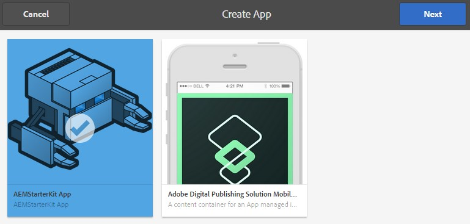

# 使用Apps Console建立和編輯應用程式{#creating-and-editing-apps-using-the-apps-console}

>[!NOTE]
>
>Adobe建議針對需要單頁應用程式架構用戶端轉換的專案使用SPA編輯器（例如React）。 [了解更多](/help/sites-developing/spa-overview.md).

AEM行動應用程式開發程式承認，不同專業的使用者有助於行動應用程式的開發。 以下流程圖說明內容作者和應用程式開發人員執行工作的一般順序。

有關如何執行行銷人員工作的資訊會顯示在此頁面上。 如需開發人員工作的詳細資訊，請參閱「建立PhoneGap應用程式」。

## 行動應用程式的結構 {#the-structure-of-mobile-applications}

AEM mobile提供Phonegap應用程式藍圖，以建立行動應用程式。 Blueprint會定義您所建立之應用程式的結構。 應用程式套件括以下項目：

* 根頁面。
* 應用程式的語言變化。
* 語言變異的首頁。

### Phonegap應用程式的根目錄 {#the-root-of-a-phonegap-app}

您在AEM中建立的行動應用程式根頁面會顯示在「應用程式」主控台中。

根頁面儲存在建立應用程式時指定之應用程式的「目標路徑」屬性下方（預設路徑為/content/phonegap/apps）。 頁面名稱是應用程式的Name屬性。 例如，名為之網站的根頁面的預設URL `myphonegapapp` 為 `http://localhost:4502/content/phonegap/apps/myphonegapapp.html`。

### PhoneGap應用程式的語言變化 {#the-language-variation-of-a-phonegap-app}

根頁面的第一個子頁面是應用程式的語言變化。 每個頁面的名稱是建立應用程式的語言。 例如，英文是應用程式英文變體的名稱。

**** 注意：預設的PhoneGap藍圖僅會建立英文版應用程式。 您的開發人員可修改藍圖，以建立更多語言變化。

語言頁面有兩種用途：

* 頁面內容是應用程式語言變化的浮動頁面。
* 頁面屬性可控制應用程式的數個設計層面，例如用於請求內容更新的URL，以及與雲端建置和Adobe Analytics服務整合相關的資訊。

### 首頁 {#the-home-page}

當應用程式開啟時，會出現應用程式語言變異的首頁或index.html頁面。首頁提供使用者應用程式中各頁面的連結功能表。 段落系統可讓您新增元件至頁面，以建立內容。

## 建立行動應用程式 {#creating-a-mobile-application}

行動應用程式是以定義頁面結構和屬性的藍圖為基礎。 您可以設定下列應用程式屬性：

* **** 標題：應用程式標題。
* **** 目標路徑：儲存應用程式的儲存庫中的位置。 保留預設值，以根據應用程式名稱建立路徑。

* **** 名稱：預設值是Title屬性的值，並刪除空格字元。 名稱在CQ中用於引用應用程式，例如代表應用程式的儲存庫節點。
* **** 說明：應用程式的說明。
* **** 伺服器URL:提供Over-the-Air(OTA)內容更新至應用程式的URL。 預設值是用來建立應用程式（取自外部化器服務）之例項的發佈伺服器URL。 請注意，此為發佈伺服器例項，而非需要驗證的作者。

您也可以提供影像檔案做為應用程式縮圖，選取要使用的PhoneGap Build設定，然後選取要使用的行動應用程式分析設定。 此影像僅用作縮圖，以在Experience Manager的行動應用程式主控台中呈現您的行動應用程式。

建立雲端服務並將Adobe Mobile Services SDK外掛程式整合至應用程式時，會有其他（和選用）標籤。

* 構建：按一下「管理設定」，並在此處設定build.phonegap.com組建服務。 然後，您就可以從下拉式清單中選取新建立的PhoneGap組建雲端服務。
* 分析：按一下「管理組態」，並設定 [您的Adobe Mobile Services SDK](https://marketing.adobe.com/developer/en_US/get-started/mobile/c-measuring-mobile-applications) cloud服務。 然後，您就可以從下拉式清單中，選取新建立的Mobile Service，以整合到您的行動應用程式中。

>[!NOTE]
>
>開發人員可使用AEM PhoneGap Starter Kit來建立應用程式並將它們新增至主控台。

下列程式使用Touch UI來建立行動應用程式。

1. 在邊欄上，按一下「應用程式」。
1. 按一下或點選「建立」圖示。

   

1. （可選）在「進階」標籤上，提供應用程式的說明，並視需要變更伺服器URL。
1. （可選）如果您使用PhoneGap Build編譯應用程式，請在「Build」（構建）頁籤上，選擇要使用的配置。

   若要建立PhoneGap建置設定，請按一下「管理設定」。

1. （可選）如果您使用SiteCatalyst來追蹤應用程式活動，請在「分析」標籤上選取要使用的設定。

   若要建立行動應用程式設定，請按一下「管理設定」。

1. （可選）若要提供應用程式圖示，請按一下「瀏覽」按鈕，從檔案系統選取影像檔案，然後按一下「開啟」。
1. 按一下「建立」。

### 變更行動應用程式的屬性 {#changing-the-properties-of-a-mobile-application}

建立行動應用程式後，您可以變更屬性。

#### 變更標題、說明和圖示 {#change-the-title-description-and-icon}

1. 在邊欄上，按一下或點選「應用程式」。
1. 選擇要配置的應用程式，然後按一下「查看頁面屬性」表徵圖。

   

1. 若要變更屬性值，請按一下或點選「編輯」圖示。

   

1. 設定「基本」和「進階」屬性，然後按一下或點選「完成」圖示。

   

#### 設定應用程式的語言變數 {#configure-a-language-variation-of-the-application}

1. 在邊欄上，按一下或點選「應用程式」。
1. 按一下，深入探索您想在應用程式管理控制台中編輯的行動應用程式。 選擇要配置的應用程式的語言版本，然後按一下「查看應用程式屬性」表徵圖。

   

1. 若要變更屬性值，請按一下或點選「編輯」圖示。

   

1. 在「基本」、「進階」、「建立」和「分析」標籤上設定屬性，然後按一下或點選「完成」圖示。

   

### 製作行動應用程式的內容 {#authoring-the-content-of-a-mobile-application}

建立行動應用程式後，請新增用作應用程式UI的內容。

1. 在邊欄上，按一下或點選「應用程式」。
1. 按一下或點選應用程式，然後按一下或點選「英文」。
1. 編輯首頁，或視需要新增子頁面。

### 將內容移至行動應用程式 {#moving-content-to-mobile-applications}

AEM發佈例項上的「內容同步」快取會用作行動應用程式的內容存放庫：

* 當開發人員編譯應用程式時，「內容同步」快取中的內容會包含在應用程式中。
* 快取中的內容可用於已安裝的移動應用程式以更新應用程式內容。

行動應用程式包含「更新」命令，可下載並安裝更新的應用程式內容。 當應用程式例項傳送更新請求時，內容同步會判斷自上次更新或安裝應用程式以來哪些內容已變更，並提供新內容。

若要讓更新的內容可供應用程式使用，請更新「內容同步」快取。 第一次更新快取時，會新增所有發佈的內容。 後續更新只會新增自上次更新後變更的已發佈內容。

「內容同步」也會追蹤更新何時發生。 有了這些資訊，內容同步可決定要傳送至行動應用程式的快取更新。

對要更新快取的實例執行以下過程。 例如，如果您的應用程式要求從發佈例項進行更新，請在發佈例項上執行程式。

1. 在邊欄上，按一下或點選「應用程式」，然後按一下或點選您的應用程式。
1. 選取啟動顯示頁面，然後按一下或點選「更新快取」圖示。

   

### 使用應用程式範本 {#using-app-templates}

這是Apps 6.1 Feature Pack 2提供的功能，可讓您輕鬆運用現有的應用程式範本，在AEM中建立新應用程式。

什麼是應用程式範本？ 將它設想成代表應用程式基準或基礎的頁面範本和元件集合。
根據其他應用程式的範本建立新應用程式時，您會得到一個應用程式，其起點代表建立應用程式的應用程式。

您必須有現有的行動應用程式範本（或已安裝應用程式範本的應用程式），才能使用此功能。

最新的AEM Apps 6.1範例套件包含Geometrixx應用程式的更新版本及應用程式範本。 或者，您也可以安裝StarterKit，該StarterKit也提供範本。

根據應用程式範本建立新應用程式的步驟：

1. 確定您已安裝最新的AEM Apps 6.1功能套件和參考範例套件
1. 按一下左側導軌中的「應用程式」。

1. 按一下頂端的「+建立」按鈕，然後選取「建立應用程式」。
1. 在顯示應用程式範本清單後，請選取一個：

1. 按一下「下一步」。
1. 提供應用程式ID和標題，但您可能也想要包含名稱和說明。

   1. 此外，您也可以瀏覽AEM資產，將PNG（支援的PhoneGap圖示格式）提供為圖示。
   1. 請記得，在「管理應用程式」方塊中建立應用程式後，您可以編輯這些欄位。 除應用程式ID外，一旦設定應用程式ID，您就無法變更它。

1. 按一下「建立」按鈕，您將會看到2個選項： 「完成」（返回「應用程式目錄檢視」）或「管理應用程式」（開啟應用程式儀表板）。
1. 建立後，您應會在「應用程式目錄」中看到新的應用程式：

1. 按一下應用程式以開啟它，您就已根據現有應用程式的範本成功建立新應用程式。

>[!NOTE]
>
>如果您從AEM解除安裝Geometrixx Outdoors參考應用程式套件，並且已根據其範本建立應用程式，該應用程式將無法繼續運作。 Geometrixx Outdoors應用程式可以移除，但是，如果其他行動應用程式使用應用程式，則應用程式範本必須保留。

## 探索Sample Geometrixx Outdoors應用程式 {#exploring-the-sample-geometrixx-outdoors-app}

Geometrixx Outdoors應用程式是範例PhoneGap應用程式，可展示預設PhoneGap應用程式藍圖和範例行動元件的功能。

若要開啟應用程式，請從邊欄按一下「行動應用程式」，然後選取「Geometrixx Outdoors應用程式」。

### 常見頁面功能- Geometrixx行動應用程式 {#common-page-features-geometrixx-mobile-app}

行動應用程式的每個頁面都包含下列功能：

* 返回父頁面的返回按鈕。 請注意，「上一步」按鈕不會出現在「首頁」上。
* 可擴充的邊欄，提供指令和連結選單：

   * 開啟「位置」頁面。
   * 開啟購物車。
   * 登入。
   * 更新應用程式。

* 段落系統，用於添加元件和建立內容。

### 首頁- Geometrixx行動應用程式 {#the-home-page-geometrixx-mobile-app}

首頁內容由下列導覽工具組成：

* 「功能表清單」元件，提供「齒輪」、「評論」、「新聞」和「關於我們」子頁面的連結。
* 「滑動轉盤」元件，會顯示子頁面。

### The Gear Page - Geometrixx行動應用程式 {#the-gear-page-geometrixx-mobile-app}

「齒輪」(Gear)頁面可讓使用者存取產品頁面。 菜單清單元件提供對「齒輪」(Gear)頁的子頁的訪問。 子頁面是網站所提供的產品類別。

* 季節
* 服裝
* 性別
* 活動

每個類別頁面使用與「齒輪」頁面相同的內容結構。 轉盤可讓您存取子頁面，這些子頁面是產品的子類別。 子類別頁面包含提供產品頁面連結的產品清單。

### 產品頁面- Geometrixx行動應用程式 {#the-products-page-geometrixx-mobile-app}

「產品」頁面及其子頁面階層會為產品頁面實施分類系統。 階層中每個分支中最低的頁面是包含ng產品元件的產品頁面。

「產品」頁面不適用於應用程式使用者。 「齒輪」(Gear)頁面可讓您存取每個產品頁面。

### The Reviews Page - Geometrixx行動應用程式 {#the-reviews-page-geometrixx-mobile-app}

包含上一步按鈕。 段落系統允許您添加元件。

使用應用程式時，「英文」頁面上的轉盤會顯示「檢閱」頁面。

### The News Page - Geometrixx行動應用程式 {#the-news-page-geometrixx-mobile-app}

包含上一步按鈕。 段落系統允許您添加元件。

使用應用程式時，「英文」頁面上的轉盤會顯示「新聞」頁面。

### The About Us Page - Geometrixx行動應用程式 {#the-about-us-page-geometrixx-mobile-app}

「關於我們」頁包含多個兩列行元件。 每欄都包含影像或文字元件。 元件是可編輯的，段落系統可讓您新增元件。

使用應用程式時，「英文」頁面上的轉盤可使用「關於我們」頁面。

### 位置頁面- Geometrixx行動應用程式 {#the-locations-page-geometrixx-mobile-app}

「位置」頁包含「位置」元件。

使用應用程式時，「英文」頁面的功能表清單中會顯示「位置」頁面。

## 行動元件範例 {#sample-mobile-components}

製作行動應用程式的頁面時，Sidekick中會立即提供數個元件。 這些元件屬於PhoneGap元件組。

### 滑動轉盤 {#swipe-carousel}

滑動轉盤元件是用於展示和導覽網站頁面的工具。 該元件包括旋轉頁面的轉盤，該轉盤在頁面連結清單上方的頁面上循環顯示影像。 編輯元件以指定要公開的頁面以及轉盤的行為。

請注意，影像會以特定方式出現在與影像相關聯之頁面的轉盤中。 當頁面與影像不關聯時，只會顯示連結清單。

**轉盤屬性標籤**

設定轉盤的行為：

* 播放速度：每張影像在顯示下一張影像之前顯示的時間（以毫秒為單位）。
* 轉換時間：影像轉場動畫的持續時間（以毫秒為單位）。
* 控制項樣式：在影像之間移動所提供的控制項類型。

**「清單屬性」頁籤**

指定頁面清單的產生方式：

* 使用：用於指定要包含在轉盤中的頁面的方法。 請參閱建立頁面清單。
* 訂購方式：選擇用於排序頁清單的頁屬性。 例如，選取jcr:title可依標題的字母順序排序頁面。
* 限制：要包含的最大頁數。 此屬性適用於建立頁面清單的搜尋式方法。

#### 建立頁面清單 {#building-the-page-list}

「滑動轉盤」元件為「使用建立清單」屬性提供下列值。 編輯對話框會根據您選擇的值而改變：

**子頁面**

該元件列出特定頁的所有子頁。 選取此值後，請在「子頁面」標籤上選取頁面，或指定不要列出目前頁面的子頁面。

**固定清單**

指定包含的頁面清單。 選擇此值後，在選擇「固定清單」時顯示的「固定清單」頁籤上配置清單：

* 若要新增頁面，請按一下「新增項目」，然後瀏覽頁面。
* 使用向上和向下箭頭圖示在清單中移動頁面。
* 按一下「移除」按鈕，從清單中移除頁面。

Order by屬性不會影響固定清單的順序。

**搜尋**

使用關鍵字搜尋結果填入清單。 搜索在您指定的頁的子項中執行：

1. 要指定搜索的根頁面，請使用「開始於」屬性選擇頁面路徑。 指定目前頁面下方的搜尋路徑。
1. 在「搜尋查詢」屬性中，輸入搜尋關鍵字。

**進階搜尋**

使用Querybuilder查詢填 [入清單](/help/sites-developing/querybuilder-api.md) 。

### 影像 {#image}

將影像新增至您的應用程式內容。

### 文字 {#text}

將豐富式文字新增至您的應用程式內容。

### 商店位置 {#store-locations}

「商店地點」元件為使用者提供尋找商務門市的工具：

* 搜尋
* 接近或遠離設備GPS座標的位置清單。

元件要求儲存庫包含每個儲存的位置資訊。 範例位置會安裝在/etc/commerce/locations/adobe節點。 

### 兩欄列 {#two-column-row}

可讓您將並排元件新增至頁面。

