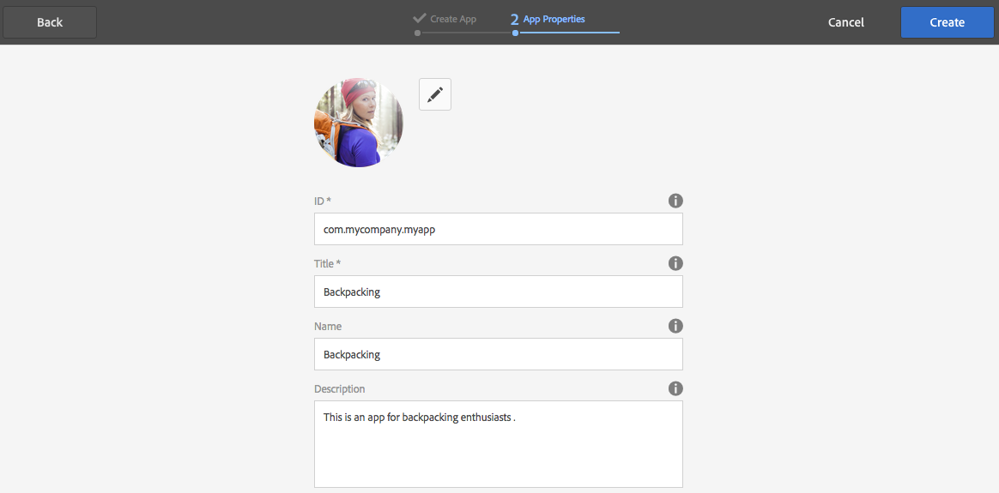

# 使用應用控制台建立和編輯應用{#creating-and-editing-apps-using-the-apps-console}

>[!NOTE]
>
>Adobe建SPA議對需要基於單頁應用程式框架的客戶端呈現（如React）的項目使用編輯器。 [深入了解](/help/sites-developing/spa-overview.md).

移動應AEM用程式開發過程認識到，擁有不同專業知識的用戶有助於移動應用程式的開發。 以下流程圖說明了內容作者和應用程式開發人員執行任務的一般順序。

有關如何執行Marketer任務的資訊將顯示在此頁上。 有關開發人員任務的資訊，請參閱構建PhoneGap應用程式。

## 移動應用的結構 {#the-structure-of-mobile-applications}

AEM Mobile公司提供了Phonegap應用建立移動應用的藍圖。 藍圖定義您建立的應用程式的結構。 應用程式套件括以下項：

* 根頁。
* 應用程式的語言變體。
* 語言變體的首頁。

### 電話間隙應用的根 {#the-root-of-a-phonegap-app}

您在中建立的移動應用程式的根頁AEM將顯示在應用控制台中。

根頁儲存在建立應用程式時指定的應用程式的「目標路徑」屬性下（預設路徑為/content/phonegap/apps）。 頁名是應用程式的Name屬性。 例如，名為的站點的根頁的預設URL `myphonegapapp` 是 `http://localhost:4502/content/phonegap/apps/myphonegapapp.html`。

### PhoneGap應用的語言變異 {#the-language-variation-of-a-phonegap-app}

根頁的第一個子頁是應用程式的語言變體。 每個頁面的名稱是為其建立應用程式的語言。 例如，英文是應用程式的英文變體的名稱。

**注：** 預設的PhoneGap藍圖只建立英文應用程式。 您的開發人員可以修改藍圖，以便建立更多語言變體。

語言頁面有兩個用途：

* 頁面內容是應用程式語言變體的頁面。
* 頁面屬性控制應用程式的幾個設計方面，例如用於請求內容更新的URL，以及有關連接到雲構建和Adobe Analytics服務整合的資訊。

### 首頁 {#the-home-page}

開啟應用程式時，將顯示應用程式的語言變體的首頁或index.html頁。首頁為用戶提供了指向應用程式中各種頁面的連結菜單。 段落系統允許您將元件添加到頁面以建立內容。

## 建立移動應用程式 {#creating-a-mobile-application}

移動應用程式基於定義頁面結構和屬性的藍圖。 可以配置以下應用程式屬性：

* **標題：** 應用程式標題。
* **目標路徑：** 儲存應用程式的儲存庫中的位置。 保留預設值以基於應用名稱建立路徑。

* **名稱：** 預設值是刪除空格字元的Title屬性的值。 CQ中使用該名稱來引用應用程式，例如，用於表示該應用程式的儲存庫節點。
* **描述：** 應用程式的說明。
* **伺服器URL:** 為應用程式提供空中傳輸(OTA)內容更新的URL。 預設值是用於建立應用程式（從外部化程式服務獲取）的實例的發佈伺服器URL。 注意，這必須是發佈伺服器實例，而不是需要身份驗證的作者。

您還可以提供要用作應用程式縮略圖的影像檔案，選擇要使用的PhoneGap Build配置，以及選擇要使用的Mobile App分析配置。 此影像僅用作縮略圖，用於在Experience Manager中的移動應用控制台中表示您的移動應用程式。

存在用於構建雲服務和將Adobe移動服務SDK插件整合到應用的其他（可選）頁籤。

* 生成：按一下「管理配置」，然後在此處設定build.phonegap.com構建服務。 然後，您將能夠從下拉清單中選擇新建立的PhoneGap構建雲服務。
* 分析：按一下管理配置並設定 [Adobe移動服務SDK](https://experienceleague.adobe.com/docs/mobile-services/using/home.html) 雲服務。 然後，您將能夠從下拉清單中選擇新建立的移動服務，以整合到您的移動應用。

>[!NOTE]
>
>開發人員可以AEM使用PhoneGap入門工具包建立應用並將其添加到控制台。

以下過程使用Touch UI建立移動應用程式。

1. 在滑軌上，按一下「Apps（應用）」。
1. 按一下或點擊「建立」表徵圖。

   

1. （可選）在「高級」頁籤上，提供應用程式的說明，並根據需要更改伺服器URL。
1. （可選）如果您正在使用PhoneGap Build編譯應用程式，請在「生成」頁籤上選擇要使用的配置。

   要建立PhoneGap生成配置，請按一下管理配置。

1. （可選）如果您正在使用SiteCatalyst跟蹤應用程式活動，請在「分析」頁籤上選擇要使用的配置。

   要建立Mobile App配置，請按一下「管理配置」。

1. （可選）要提供應用程式表徵圖，請按一下「瀏覽」按鈕，從檔案系統中選擇影像檔案，然後按一下「開啟」。
1. 按一下建立。

### 更改移動應用程式的屬性 {#changing-the-properties-of-a-mobile-application}

建立移動應用程式後，可以更改屬性。

#### 更改標題、說明和表徵圖 {#change-the-title-description-and-icon}

1. 在滑軌上，按一下或點擊「Apps（應用）」。
1. 選擇要配置的應用程式，然後按一下「查看頁面屬性」表徵圖。

   

1. 要更改屬性值，請按一下或點擊「編輯」表徵圖。

   

1. 配置「基本」和「高級」屬性，然後按一下或點擊「完成」表徵圖。

   

#### 配置應用程式的語言變體 {#configure-a-language-variation-of-the-application}

1. 在滑軌上，按一下或點擊「Apps（應用）」。
1. 按一下可深入到您希望在應用程式管理控制台中編輯的移動應用程式。 選擇要配置的應用程式的語言版本，然後按一下查看應用程式屬性表徵圖。

   

1. 要更改屬性值，請按一下或點擊「編輯」表徵圖。

   

1. 在「基本」、「高級」、「生成」和「分析」頁籤上配置屬性，然後按一下或點擊「完成」表徵圖。

   

### 創作移動應用程式的內容 {#authoring-the-content-of-a-mobile-application}

建立移動應用程式後，添加用作應用程式UI的內容。

1. 在滑軌上，按一下或點擊「Apps（應用）」。
1. 按一下或點擊應用程式，然後按一下或點擊「English（英語）」。
1. 編輯首頁或根據需要添加子頁。

### 將內容移動到移動應用程式 {#moving-content-to-mobile-applications}

發佈實例上的內容同AEM步快取用作移動應用程式的內容儲存庫：

* 開發人員編譯應用程式時，內容同步快取中的內容將包括在應用程式中。
* 快取中的內容可用於安裝的移動應用程式以更新應用程式內容。

移動應用程式套件括「更新」命令，用於下載和安裝更新的應用程式內容。 當應用程式實例發送更新請求時，內容同步確定自上次更新或安裝應用程式以來哪些內容已更改，並提供新內容。

要使更新的內容可供應用程式使用，請更新內容同步快取。 首次更新快取時，將添加所有已發佈的內容。 後續更新僅添加自上次更新後更改的已發佈內容。

內容同步還會在更新發生時跟蹤。 通過此資訊，內容同步可以確定要發送到移動應用程式的快取更新。

對要更新快取的實例執行以下過程。 例如，如果應用程式請求發佈實例的更新，請對發佈實例執行該過程。

1. 在導軌上，按一下或點擊「Apps（應用程式）」 ，然後按一下或點擊應用程式。
1. 選擇閃屏頁，然後按一下或點擊「更新快取」表徵圖。

   

### 使用應用模板 {#using-app-templates}

這是Apps 6.1功能包2中提供的功能，它提供了一種利用現有應用模板在中建立新應用的簡便方AEM法。

什麼是應用模板？ 將其視為表示應用的基線或基礎的頁面模板和元件的集合。
在基於另一個應用的模板建立新應用時，您將得到一個應用，該應用的起始點代表從中建立該應用的應用。

您必須擁有現有的移動應用模板（或安裝了應用模板的應用）才能使用此功能。

最新的AEMApps 6.1示例包包含帶應用模板的Geometrixx應用的更新版本。 或者，您也可以安裝StarterKit，該StarterKit還提供模板。

基於應用模板建立新應用的步驟：

1. 確保安裝了最AEM新的Apps 6.1功能包和參考示例包
1. 按一下左欄上的「Apps（應用）」。

1. 按一下頂部的+ Create按鈕，然後選擇Create App。
1. 在顯示應用程式模板清單後，選擇以下選項之一：

1. 按一下下一步。
1. 提供應用ID和標題，但您可能還希望包括名稱和說明。

   1. 此外，還可以通過瀏覽資產將PNG（支援的PhoneGap表徵圖格式）作為圖AEM標。
   1. 請記住，在「管理應用」磁貼中建立應用後，可以編輯所有這些欄位。 除應用ID外，一旦設定了應用ID，您就無法更改它。

1. 按一下「建立」按鈕，將顯示2個選項，即「完成」（返回「應用程式目錄」視圖）或「管理應用程式」（開啟應用程式儀表板）。
1. 建立後，您應看到「應用程式」目錄中列出的新應用：

1. 按一下該應用以開啟它，您已基於現有應用的模板成功建立新應用。

>[!NOTE]
>
>如果從中卸載Geometrixx Outdoors引用應用程式套件AEM，並且根據其模板建立了應用，則該應用將不再有效。 Geometrixx Outdoors應用程式可以刪除，但如果其他移動應用程式使用應用程式模板，則必須保留該應用程式模板。

## 瀏覽示例Geometrixx Outdoors應用 {#exploring-the-sample-geometrixx-outdoors-app}

Geometrixx Outdoors應用是一個示例PhoneGap應用程式，演示了預設PhoneGap應用程式藍圖和示例移動元件的功能。

要開啟應用程式，請從滑軌中按一下「移動應用程式」，然後選擇「Geometrixx Outdoors應用程式」。

### 常用頁面功能 — Geometrixx移動應用 {#common-page-features-geometrixx-mobile-app}

移動應用的每個頁面都包括以下功能：

* 返回父頁的後退按鈕。 請注意，「首頁」上未顯示「後退」按鈕。
* 可擴展的滑軌，提供命令和連結菜單：

   * 開啟「位置」頁。
   * 開啟購物車。
   * 登錄。
   * 更新應用程式。

* 段落系統，用於添加元件和建立內容。

### 首頁 — Geometrixx移動應用 {#the-home-page-geometrixx-mobile-app}

首頁的內容由下列導航工具組成：

* 一個「菜單清單」元件，它提供指向「齒輪」、「評論」、「新聞」和「關於我們」子頁面的連結。
* 顯示子頁面的「輕掃旋轉」元件。

### 齒輪頁 — Geometrixx移動應用 {#the-gear-page-geometrixx-mobile-app}

「齒輪」(Gear)頁面為用戶提供了對產品頁面的訪問權限。 「菜單」清單元件提供對「齒輪」頁子頁的訪問。 子頁面是網站所具有的產品類別。

* 季
* 服裝
* 性別
* 活動

每個類別頁面使用與「齒輪」(Gear)頁面相同的內容結構。 傳送帶提供對子頁的訪問，子頁是產品的子類別。 子類別頁包含提供產品頁連結的產品清單。

### 產品頁面 — Geometrixx移動應用 {#the-products-page-geometrixx-mobile-app}

「產品」頁面及其子頁面層次實現了產品頁面分類系統。 層次結構的每個分支中最低的頁是包含ng Product元件的產品頁。

「產品」頁面對應用程式用戶不可用。 「齒輪」(Gear)頁面提供對每個產品頁面的訪問。

### 「複查」頁 — Geometrixx移動應用 {#the-reviews-page-geometrixx-mobile-app}

包含後退按鈕。 段落系統允許您添加元件。

使用應用程式時，「審閱」(Reviews)頁面可從「英文」(English)頁面的旋轉軸獲得。

### 新聞頁面 — Geometrixx移動應用 {#the-news-page-geometrixx-mobile-app}

包含後退按鈕。 段落系統允許您添加元件。

使用該應用程式時，「新聞」頁面可從「英文」頁面的旋轉軸獲得。

### 關於Us頁面 — Geometrixx移動應用 {#the-about-us-page-geometrixx-mobile-app}

「關於我們」頁包含多個兩列行元件。 每列都包含「影像」或「文本」元件。 元件是可編輯的，段落系統允許您添加元件。

使用應用程式時，「關於我們」(About Us)頁面可從「英文」(English)頁面的旋轉軸獲得。

### 「位置」頁 — Geometrixx移動應用 {#the-locations-page-geometrixx-mobile-app}

「位置」頁包含「位置」元件。

使用應用程式時，「位置」(Locations)頁面可從「英文」(English)頁面的菜單清單中找到。

## 移動元件示例 {#sample-mobile-components}

創作移動應用程式的頁面時，Sidekick中立即提供了幾個元件。 這些元件屬於PhoneGap元件組。

### 輕掃旋轉 {#swipe-carousel}

「輕掃旋轉」元件是用於展示和導航網站頁面的工具。 該元件包括旋轉旋轉的旋轉傳送器，該旋轉傳送器在頁面連結清單上的頁面中旋轉影像。 編輯元件以指定要公開的頁面和旋轉傳送器的行為。

請注意，與影像以特定方式關聯的頁面的影像出現在旋轉傳送中。 當頁面未與影像關聯時，只顯示連結清單。

**「旋轉木馬屬性」頁籤**

配置旋轉傳送器的行為：

* 播放速度：顯示下一個影像之前顯示每個影像的時間（毫秒）。
* 轉換時間：影像過渡的動畫持續時間（毫秒）。
* 控制項樣式：為在影像之間移動而提供的控制項的類型。

**「清單屬性」頁籤**

指定頁清單的生成方式：

* 生成清單使用：用於指定要包含在旋轉傳送器中的頁面的方法。 請參閱生成頁面清單。
* 訂單依據：選擇要用於對頁清單進行排序的頁屬性。 例如，選擇jcr:title按標題的字母順序對頁面進行排序。
* 限制：要包括的最大頁數。 此屬性適用於基於搜索的生成頁面清單的方法。

#### 生成頁面清單 {#building-the-page-list}

「輕掃旋轉」元件為「使用生成清單」屬性提供以下值。 編輯對話框會根據您選擇的值進行更改：

**子頁面**

該元件列出特定頁面的所有子頁面。 選擇此值後，在「子頁」(Child Pages)頁籤上選擇該頁，或指定不值以列出當前頁的子頁。

**固定清單**

指定包含的頁的清單。 選擇此值後，在「固定清單」(Fixed List)頁籤上配置在選擇「固定清單」(Fixed List)時顯示的清單：

* 要添加頁面，請按一下「添加項目」，然後瀏覽該頁面。
* 使用上箭頭和下箭頭表徵圖在清單中移動頁面。
* 按一下「刪除」按鈕，從清單中刪除頁面。

Order By屬性不影響固定清單的順序。

**搜尋**

使用關鍵字搜索的結果填充清單。 搜索在您指定的頁面的子級中執行：

1. 要指定搜索的根頁，請使用「開始於」屬性選擇頁路徑。 指定當前頁面下方的搜索路徑。
1. 在「搜索查詢」屬性中，輸入搜索關鍵字。

**進階搜尋**

使用 [查詢生成器](/help/sites-developing/querybuilder-api.md) 的子菜單。

### 影像 {#image}

向應用程式內容添加影像。

### 文字 {#text}

將富格文本添加到應用程式內容。

### 商店位置 {#store-locations}

「儲存位置」元件為用戶提供了查找營業網點的工具：

* 搜尋
* 接近或遠離設備GPS坐標的位置清單。

該元件要求儲存庫包含每個儲存的位置資訊。 示例位置安裝在/etc/commerce/locations/adobe節點。 

### 兩列行 {#two-column-row}

允許您將並排元件添加到頁面。

