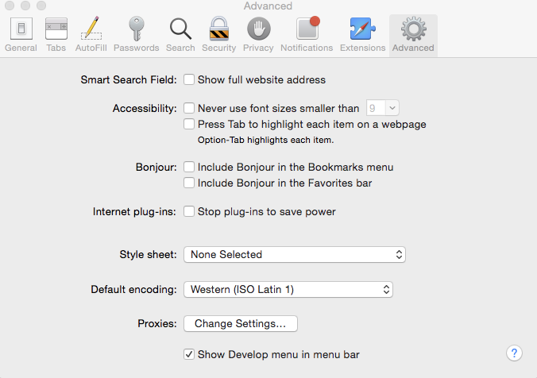
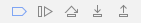

# 使用PhoneGap CLI開發應用程式{#developing-apps-with-phonegap-cli}

>[!NOTE]
>
>Adobe建議針對需要單頁應用程式架構用戶端轉換的專案使用SPA編輯器（例如React）。 [了解更多](/help/sites-developing/spa-overview.md).

只要您已設定開發環境，您就可以在任何指定時間，以開發人員身分，在裝置或模擬器中執行應用程式。

若要執行下列範例，您將需要使用Xcode執行OSx(Mac)的系統，或使用安裝Android SDK的Mac/Win/Linux系統。

## 引導您的開發環境 {#bootstrap-your-development-environment}

[設定PhoneGap CLI](https://docs.phonegap.com/en/4.0.0/guide_cli_index.md.html#The%20Command-Line%20Interface)

針對iOS:若要針對iPhone和iPad進行開發，您需要Apple的Xcode IDE。

* 在這裡免費下 [載](https://developer.apple.com/xcode/downloads/)。
* [PhoneGap iOS平台指南](https://docs.phonegap.com/en/4.0.0/guide_platforms_ios_index.md.html#iOS%20Platform%20Guide)

針對Android:若要針對iPhone和iPad進行開發，您需要使用Google的Android Stuido IDE。

* 在這裡免費下 [載](https://developer.android.com/sdk/index.html)。
* [PhoneGap android平台指南](https://docs.phonegap.com/en/4.0.0/guide_platforms_android_index.md.html#Android%20Platform%20Guide)

## 下載來源 {#download-the-source}

在您成功啟動開發環境後，請從「AEM App Build Tile」（AEM應用程式組建圖格）下載來源：

* 按一下「PhoneGap Build」圖格下拉式雪佛龍。


* 按一下「下載來源」。
* 從「下載來源」模式中選取所需來源。


>[!NOTE]
>
>開發來源包含應用程式的最新狀態，同時包含未暫存的變更。 使用「測試」來源建立要送出至應用程式商店廠商的發行申請。
>
>如果您從未儲存應用程式，選取「測試」將會觸發測試工作流程(提示：這將會在AppStore和Google playStore中的PhoneGap Enterprise Viewer應用程式中顯示為分段應用程式)。

* 按一下「下載」並儲存ZIP至您的電腦。
* 將下載的zip檔案解壓縮至您的工作區。

## 建立和載入應用程式（從來源） {#build-and-load-the-app-from-source}

PhoneGap CLI可以建立平台專案、編譯來源，並以單一命令部署應用程式。

>[!NOTE]
>
>您可以分別執行這些步驟，請參 [閱PhoneGap CLI檔案](https://phonegap.com/blog/2014/11/13/phonegap-cli-3-6-3/)。

1. 請確定您已安裝PhoneGap CLI，請參閱上文。
1. 在控制台（或終端機）視窗中，導覽至擷取來源的根目錄。
1. 輸入以下命令：

```xml
phonegap run android

// -- or -- //

phonegap run ios
```

>[!NOTE]
>
>如果您目前有問題，請回到基本的問題處理-
>
>1. 建立新資料夾（mkdir測試）
>1. 導覽至這個新資料夾(cd test)
>1. 執行&#39;phonegap create helloWorld&#39;
>1. 導覽至helloWorld(cd helloWorld)
>1. 執行&#39;phonegap run android（或如上所示，以ios取代android）。
>1. 模擬器會開啟，執行您新建立的PhoneGap應用程式，如果JavaScript原生橋接器運作正常，則會說「裝置就緒」。
>
>
這將驗證您的PhoneGap CLI開發環境是否已正常啟動並正常運行。

## 使用Safari和IOS除錯來除錯Javascript {#debug-javascripts-with-safari-and-ios-debug}

您可以使用Safari的開發人員工具來除錯應用程式的JavaScript，就像使用Web應用程式一樣。

## 啟用Safari開發人員工具 {#enable-safari-developer-tools}

若要啟用開發人員工具：

* 開啟Safari的偏好設定

   * 按一下功能表列中的Safari
   * 按一下「偏好設定」

* 按一下「首選項」(Preference)窗口中的「高級」(Advanced)



* 勾選「在功能表列中顯示開發功能表」
* 關閉「首選項」窗口

## 將Safari連接至iOS {#connect-safari-to-ios}

您可將Safari連接至iOS裝置或模擬器。

* 在控制台窗口中，導航到解壓源的根目錄。
* 輸入下列命令，在您的裝置或模擬器上啟動您的應用程式。

```xml
phonegap run <platform> --device

// -- or -- //

phonegap run <platform> --emulator
```

* Open Safari
* 按一下功能表列中的「開發」
* 選擇iOS模擬器子功能表
* 按一下home.html


## 使用Safari的Web Inspector對JavaScript進行除錯 {#debug-javascript-with-safari-s-web-inspector}

您可以在來源中的任意位置設定中斷點。 當您與模擬器或裝置互動時，應用程式的執行將停止在這些中斷點處。 您可以逐步執行並檢查變數中的值。

* 在「Web Inspector」（網頁檢查器）窗口中按一下「Resources」（資源）
* 導覽來源樹狀結構，然後按一下所要的來源檔案
* 按一下相鄰的行號添加斷點
* 與裝置或模擬器互動


* 使用控制按鈕來繼續執行、逐步移至、逐步移至和退出方法：



>[!NOTE]
>
>若要查看變數的值，請將滑鼠暫留在目前方法中。

## 後續步驟 {#the-next-steps}

在您瞭解使用PhoneGap CLI開發應用程式後，請參閱 [存取裝置功能](/help/mobile/phonegap-access-device-features.md)。
