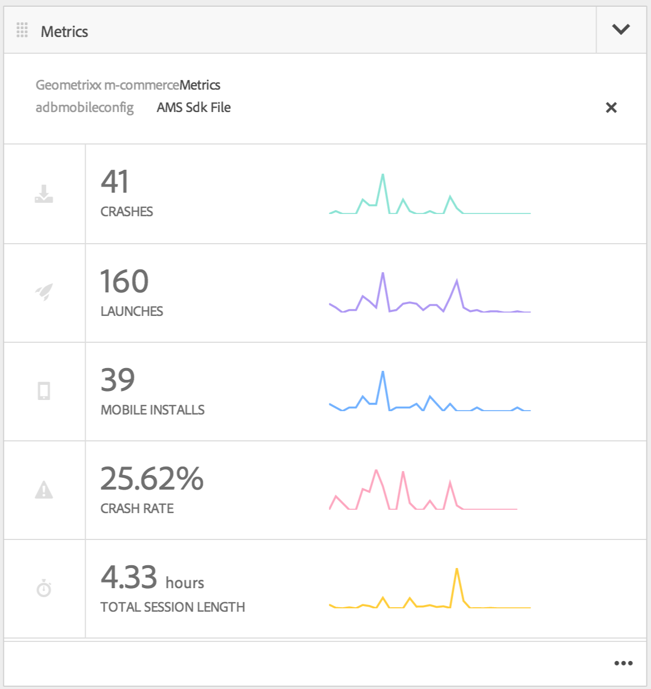

# 製作行動應用程式{#authoring-mobile-applications}

>[!NOTE]
>
>Adobe建議針對需要單頁應用程式架構用戶端轉換的專案使用SPA編輯器（例如React）。 [了解更多](/help/sites-developing/spa-overview.md).

AEM Mobile Dashboard可讓您建立、建立和部署行動應用程式、建立、刪除和編輯應用程式中繼資料。 在應用程式上線後，您可以分析應用程式分析，包括生命週期和使用量度，以改善客戶轉化率和品牌忠誠度。

若要建立AEM mobile應用程式，請參閱「建立 [行動應用程式](/help/mobile/building-app-mobile-phonegap.md) 」頁面。

若要設定您的環境並開始使用，請 [參閱「管理AEM以使用AEM PhoneGap Enterprise](/help/mobile/administer-phonegap.md)」。

## AEM mobile應用程式目錄 {#the-aem-mobile-apps-catalog}

AEM Mobile Apps Catalog [(](http://localhost:4502/aem/apps.html/content/phonegap) AEM Mobile應用程式目錄)會顯示您在AEM中管理的所有行動應用程式。

將此目錄設想成AEM mobile的「著陸頁面」，管理員可以在此處，根據範本建立新的AEM mobile應用程式，或上傳行動開發人員已啟動的現有應用程式。

請依照下列步驟前往應用程式目錄登陸頁面：

1. 瀏覽至「 **導覽** 」，然後選 **擇「Mobile**」。

1. 選擇「 **應用程式** 」以開啟應用程式目錄。

## AEM Mobile應用程式儀表板 {#the-aem-mobile-app-dashboard}

從目錄選取AEM mobile應用程式時，將會顯示其控制面板。 您可以在這裡管理應用程式、檢視統計資料、建立、部署及管理行動應用程式內容。

您可以展開至AEM Mobile Dashboard中的每個圖格，以按一下「...」來檢視或編輯詳細資訊 在右下角。

### 管理應用程式圖格 {#the-manage-app-tile}

「管理應用程式圖格」會顯示您的應用程式圖示、名稱、說明、支援的平台、呼叫首頁以取得更新URL和版本資訊。 您可以深入檢視此圖格，以編輯和維護PhoneGap應用程式設定(config.xml)，並準備您的應用程式以送出至各種應用程式存放區進行散發。

按一 [下這裡](/help/mobile/phonegap-app-details-tile.md) ，以取得詳細資訊。

### 管理頁面內容圖格 {#the-manage-page-content-tile}

在AEM mobile中建立、更新和刪除內容的方式與在AEM Sites中執行相同。 「管 **理頁面內容圖格** 」會顯示受管理內容和上次修改的頁面數。 您可以按一下方塊中的每個記錄，深入鑽研內容以建立、複製、移動、刪除和更新頁面。 內容更新後，您可以透過「管理內容封裝」方塊，將內容更 **新推送給客戶。**

### 「管理內容封裝」方塊 {#the-manage-content-packages-tile}

一旦您透過「管理頁面內容」方塊新增或修改內容後，您就可以透過「內容發行」更新將這些變更推送給客戶。

「內容封裝」可讓AEM App Author管理AEM中的頁面內容，並讓您的開發團隊變更您的PhoneGap Shell應用程式（即應用程式架構或基礎架構），然後快速將這些變更推送給客戶，而不需徵募開發人員將變更重新提交至各種商店進行散發。

「內容套件」會針對每次更新建立ZIP檔案，視為「內容發行套件」。 這些套件包含在轉譯應用程式時產生的html資源和html頁面，而且智慧程度足以僅封裝自上次更新以來已修改的檔案。

「管理內容封裝圖格」的 **Type** 」欄會顯示「App」，以表示應用程式殼層內容，例如由開發人員管理的應用程式架構或基礎架構，或「內容」，代表由內容作者管理的頁面內容。

內容可以表示為語言，或是應用程式使用多個內容發行套件的應用程式的特定部分。 您可選擇如何整合內容，其設計不但靈活而且完全符合您管理應用程式內容的方式。

「已 **修改** 」欄會指出最近修改頁面的時間。

「 **分段** 」欄會顯示上次內容更新的建立時間。 若要建立新內容更新並載入變更，請開啟圖格中的任何記錄並建立新的更新。

「已 **發佈** 」欄會顯示上次內容更新的發佈時間，並讓客戶可供使用。 若要發佈內容，您必須先階段該內容，然後透過鑽取此方塊並從「內容發行詳細資訊」主控台發佈來發佈更新。

 

此圖示代表應用程式殼層的內容發行套件

這些圖示代表應用程式內容的內容發行套件

### PhoneGap Build圖格 {#the-phonegap-build-tile}

PhoneGap Build Tile **與** https://build.phonegap.com連  接，以建立和代管遠端Buid。 建置完成後，您就可以下載或透過QR code直接將建置內容發佈至您的裝置。

或者，您也可以下載裝置來源，透過 [PhoneGap CLI在本機建立](https://docs.phonegap.com/en/3.5.0/guide_cli_index.md.html)。

### 量度圖格 {#the-metrics-tile}

>[!CAUTION]
>
>「量度」方塊只會在您設定雲端服務後顯示。
>
>如需詳 [細資訊，請參閱設定您的Adobe Mobile Services Cloud服務](/help/mobile/configure-adobe-mobile-cloud-service.md) 。

AEM mobile透過 [Adobe Mobile Services SDK](https://www.adobe.com/ca/solutions/digital-marketing/mobile-services/app-sdk.html) (AMS)與Adobe Analytics整合。

「控制中心 **量度」圖格** ，會顯示從AMS提取的應用程式摘要分析。 您可以按一下「...」深入分析控制面板 在右下角。

### 管理實體內容圖格 {#the-manage-entity-content-tile}

「管理實體內容圖格」可讓您新增及管理應用程式定義。 應用程式定義是識別哪些空格（和其他設定）適合應用程式的方式。 如此可新增空格，而不需重新編譯應用程式。 應用程式定義會更新，其中會包含任何新空格的資訊。

按一 [下這裡](/help/mobile/phonegap-app-definitions.md) ，以建立並管理您的應用程式定義。

您可以按一下「...」，深入鑽研管理實體內容控制面板 在右下角。

#### 其他資源 {#additional-resources}

要瞭解管理員和開發人員的角色和責任，請參閱以下資源：

* [使用AEM為Adobe PhoneGap Enterprise進行開發](/help/mobile/developing-in-phonegap.md)
* [使用AEM管理Adobe PhoneGap Enterprise的內容](/help/mobile/administer-phonegap.md)

