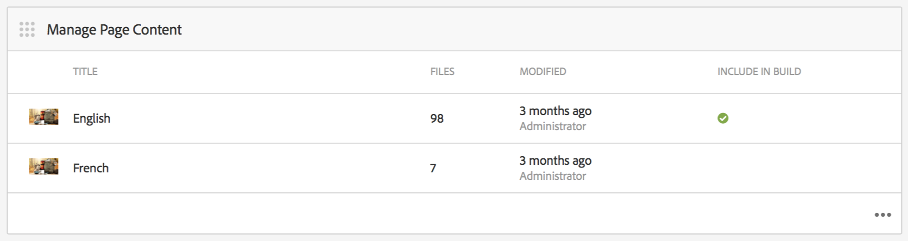

# 創作移動應用程式{#authoring-mobile-applications}

>[!NOTE]
>
>Adobe建議對需SPA要基於單頁應用程式框架的客戶端呈現的項目使用編輯器（例如，React）。 [深入了解](/help/sites-developing/spa-overview.md).

AEM Mobile儀表板允許您建立、構建和部署移動應用程式、建立、刪除和編輯應用程式元資料。 在您的應用程式生存後，您可以分析應用程式分析，包括生命週期和使用量度，以提高客戶轉換和品牌忠誠度。

要構建您的AEM Mobile應用程式，請參閱 [構建移動應用程式](/help/mobile/building-app-mobile-phonegap.md) 的子菜單。

要設定環境並開始，請參閱 [管AEM理以使AEM用PhoneGap Enterprise](/help/mobile/administer-phonegap.md)。

## AEM Mobile應用目錄 {#the-aem-mobile-apps-catalog}

的 [AEM Mobile應用程式目錄](http://localhost:4502/aem/apps.html/content/phonegap) 顯示在中管理的所有移動應AEM用。

將此目錄視為AEM Mobile的「登錄頁」，管理員可以通過基於模板建立或上傳移動開發人員已啟動的現有應用程式來啟動新的AEM Mobile應用程式。

按照以下步驟訪問應用程式目錄登錄頁：

1. 瀏覽到 **導航** 然後選擇 **移動**。

1. 選擇 **應用** 開啟應用程式目錄。

## AEM Mobile應用儀表板 {#the-aem-mobile-app-dashboard}

從目錄中選擇AEM Mobile應用將顯示其儀表板。 在這裡，您可以管理應用程式、查看統計資訊、構建、部署和管理移動應用內容。

可以展開到「AEM Mobile儀表板」中的每個磁貼中，通過按一下「……」查看或編輯詳細資訊 在右下角。

### 管理應用程式磁貼 {#the-manage-app-tile}

「管理應用程式平鋪」顯示您的應用程式表徵圖、名稱、說明、支援的平台，呼叫首頁以獲取更新URL和版本資訊。 您可以鑽入此磁貼，以編輯和維護PhoneGap應用程式配置(config.xml)，並準備您的應用程式提交到各種應用程式儲存以供分發。

按一下 [這裡](/help/mobile/phonegap-app-details-tile.md) 的雙曲餘切值。

### 管理頁面內容磁貼 {#the-manage-page-content-tile}

內容可以在AEM Mobile建立、更新和刪除，與在AEM Sites內執行同樣操作的方式大同小異。 的 **管理頁面內容磁貼** 顯示托管內容和上次修改的頁數。 您可以通過按一下磁貼中的每個記錄來深入建立、複製、移動、刪除和更新頁面。 內容更新後，您可以通過 **管理內容包磁貼。**

### 管理內容包磁貼 {#the-manage-content-packages-tile}

一旦通過「管理頁面內容磁貼」添加或修改了您的內容，您就可以通過內容發佈更新將這些更改推送到您的客戶。

內容包允許AEMApp Author在中管理頁面內容AEM，並讓您的開發團隊對PhoneGap Shell應用程式（即應用框架或基礎架構）進行更改，然後快速將這些更改推送到您的客戶，而不需要請開發人員重新提交到各種商店進行分發。

內容包為每個更新建立一個ZIP檔案，該檔案被視為內容發佈包。 這些包包含在呈現應用程式時生成的html資源和html頁面，並且智慧到僅包含上次更新後修改的檔案。

管理內容包磁貼 **類型** 列顯示「App」以表示應用程式Shell內容，例如由開發人員管理的應用的框架或基礎結構，或「Content」（表示由內容作者管理的頁面內容）。

內容可以表示為語言，也可以表示為應用程式的特定部分，在該應用程式中會使用多個內容發佈包。 選擇捆綁內容的方式是靈活的，完全取決於您希望如何管理應用程式的內容。

的 **已修改** 列指示最近修改頁面的時間。

的 **已轉移** 列顯示上次內容更新的建立時間。 要建立內容更新並存放更改，請開啟磁貼中的任何記錄並建立更新。

的 **已發佈** 列顯示上次內容更新發佈和可供客戶使用的時間。 要發佈內容，您必須首先將該內容放置，然後通過鑽入此磁貼並從「內容發佈詳細資訊」控制台發佈來發佈更新。

 

此表徵圖表示應用程式shell的內容發佈包

這些表徵圖表示應用內容的內容發佈包

### PhoneGap Build磁貼 {#the-phonegap-build-tile}

的 **PhoneGap Build磁貼** 連接 [https://build.phonegap.com](https://build.phonegap.com) 生成和承載遠程生成。 生成後，該生成可以作為下載提供，也可以通過QR碼直接提供到您的設備。

或者，您可以下載設備源，通過 [PhoneGap CLI](https://docs.phonegap.com/en/3.5.0/guide_cli_index.md.html)。

### 度量平鋪 {#the-metrics-tile}

>[!CAUTION]
>
>「度量」磁貼僅在配置雲服務後顯示。
>
>請參閱 [配置Adobe移動服務Cloud Service](/help/mobile/configure-adobe-mobile-cloud-service.md) 的雙曲餘切值。

AEM Mobile通過Adobe Analytics [Adobe移動服務SDK](https://experienceleague.adobe.com/docs/mobile.html?lang=en) (AMS)。

控制中心 **度量平鋪** 顯示從AMS中為應用程式提取的摘要分析。 可通過按一下「……」鑽入分析儀表板 右下角。

### 管理實體內容磁貼 {#the-manage-entity-content-tile}

管理實體內容磁貼允許您添加和管理應用定義。 應用定義是確定哪些空間（和其他配置）適合應用的一種方法。 這樣，就可以添加新空間，而無需重新編譯應用。 應用定義將更新，其中包含任何新空間的資訊。

按一下 [這裡](/help/mobile/phonegap-app-definitions.md) 建立和管理應用定義。

通過按一下「……」，可以鑽入管理實體內容儀表板 右下角。

#### 其他資源 {#additional-resources}

要瞭解管理員和開發人員的角色和職責，請參閱以下資源：

* [Adobe PhoneGap企業AEM發展](/help/mobile/developing-in-phonegap.md)
* [為Adobe PhoneGap企業管理內AEM容](/help/mobile/administer-phonegap.md)
