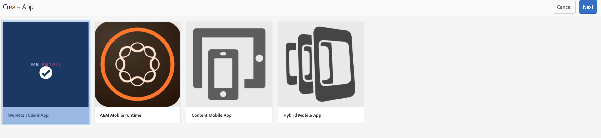

# 使用建立精靈建立AEM Mobile應用程式{#creating-a-new-aem-mobile-app-using-create-wizard}

{{ue-over-mobile}}

AEM Mobile應用程式以定義頁面結構和屬性的Blueprint為基礎。 您可以設定下列應用程式屬性：

* **標題：**&#x200B;應用程式標題。
* **目的地路徑：**&#x200B;儲存應用程式的存放庫位置。 保留預設值，以根據應用程式名稱建立路徑。

* **名稱：**&#x200B;預設值是移除空格字元的Title屬性值。 此名稱在AEM中用來參照應用程式，例如代表應用程式的儲存區域節點。
* **描述：**&#x200B;應用程式的描述。
* **伺服器URL：**&#x200B;為應用程式提供Over-The-Air (OTA)內容更新的網址。 預設值是用來建立應用程式（取自外部器服務）之執行個體的發佈伺服器URL。 請注意，這必須是發佈伺服器執行個體，而非作者（需要驗證）。

您也可以提供影像檔案，以用作應用程式縮圖、選取要使用的PhoneGap Build設定，並選取要使用的行動應用程式分析設定。 此影像僅會作為縮圖，在Experience Manager的行動應用程式主控台內代表您的行動應用程式。

其他（和選用）標籤可用於建立雲端服務，以及將Adobe Mobile Services SDK外掛程式整合至您的應用程式。

* 組建：按一下這裡的管理設定並設定您的build.phonegap.com組建服務。 然後從下拉式清單，選取新建立的PhoneGap Build雲端服務。
* Analytics：按一下管理設定，然後設定您的[Adobe Mobile Services SDK](https://experienceleague.adobe.com/docs/mobile-services/using/home.html)雲端服務。 然後從下拉式清單，選取新建立的行動服務以整合至行動應用程式。

## 使用應用程式範本 {#using-app-templates}

應用程式範本可讓您輕鬆使用開發人員建立的現有設計，以便在AEM中建立新的應用程式。

什麼是應用程式範本？ 將其視為代表應用程式基準或基礎的頁面範本和元件的集合。
根據其他應用程式的範本建立應用程式時，您會得到其起點代表在其中建立該應用程式之應用程式的應用程式。

您必須擁有現有的行動應用程式範本（或已安裝具備應用程式範本的應用程式），才能使用此功能。

最新AEM應用程式範例套件包含具有應用程式範本的Geometrixx應用程式更新版本。 或者，您可以安裝也提供範本的[StarterKit](https://github.com/Adobe-Marketing-Cloud-Apps/aem-phonegap-starter-kit)。

根據應用程式範本建立應用程式的步驟：

1. 導覽至AEM Mobile應用程式目錄： &lt;*server-url*>aem/apps.html/content/mobileapps
1. 選取「**建立**」，然後選擇「**應用程式**」，如下所示

選取AEM開發人員提供的應用程式範本。 如需開發人員協助，請參閱[AEM Mobile應用程式的結構](/help/mobile/phonegap-structure-an-app.md)。

視需要填寫新應用程式的詳細資訊，包括選擇性地變更其縮圖影像。 這些值稍後可從&#x200B;**管理應用程式**&#x200B;動態磚進行編輯。

## 後續步驟 {#the-next-steps}

請參閱下列資源，以進一步瞭解其他撰寫角色：

* [「管理應用程式」動態磚](/help/mobile/phonegap-app-details-tile.md)
* [編輯應用程式中繼資料](/help/mobile/phonegap-editmetadata.md)
* [應用程式定義](/help/mobile/phonegap-app-definitions.md)
* [匯入現有的混合式應用程式](/help/mobile/phonegap-adding-content-to-imported-app.md)
* [Content Services](/help/mobile/develop-content-as-a-service.md)

## 其他資源 {#additional-resources}

若要瞭解管理員和開發人員的角色和責任，請參閱以下資源：

* [使用AEM為Adobe PhoneGap Enterprise開發](/help/mobile/developing-in-phonegap.md)
* [使用AEM管理Adobe PhoneGap Enterprise的內容](/help/mobile/administer-phonegap.md)
