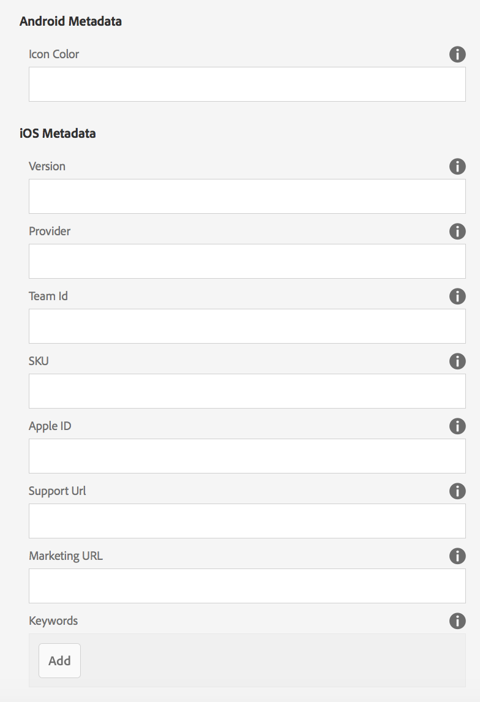

# 編輯應用程式中繼資料 {#editing-app-metadata}

>[!NOTE]
>
>Adobe建議針對需要單頁應用程式架構用戶端轉換的專案使用SPA編輯器（例如React）。 [了解更多](/help/sites-developing/spa-overview.md).

「管 **理應用程式** 」圖格和「管理應用程式」頁面提供檢視和編輯應用程式中繼資料的方式。 應用程式中繼資料是將應用程式發佈至廠商商店的必要詳細資訊。 這可能包括通用中繼資料、iOS中繼資料和螢幕擷取畫面。 如需常見  和iOS中繼資料的詳細資訊，請參閱「管理應用程式圖格」。

## 編輯應用程式資料 {#editing-the-app-data}

若要編輯應用程式的中繼資料：

1. 導覽至應用程式的控制面板頁面。

   

1. 若要檢視或編輯詳細資訊，請按一下「...」 在「管理應用程式」方塊的右下 **角** 。

1. 在下圖所示的五個頁籤中輸入或查看詳細資訊。

   

## 編輯常用和IOS中繼資料 {#editing-common-and-ios-metadata}

您可以編輯常用和IOS中繼資料：

* 從應用程 **式說明頁** 面選取「進階」標籤。
* 編輯或檢視常用和IOS中繼資料。 請參閱下圖以取得詳細資訊。

 

## 新增和移除螢幕擷取 {#add-and-remove-screenshots}

您可以將應用程式螢幕擷取畫面加入中繼資料統計。 有些廠商在將任何應用程式送出至其應用程式商店時，都需要精確的螢幕擷取畫面。 這些影像必須已存在於資產中。 請參 [閱「資產選擇器](../assets/search-assets.md#assetselector) 」以上傳螢幕擷取畫面。

### 新增螢幕擷取 {#add-screenshots}

若要新增資產做為螢幕擷取：

1. 在「管理應用程式」頁面的編 **輯模式中** ，按一下「新增」（加號圖示）。
1. 選取資產，然後按一 **下** 「選取」以新增資產。

   

1. 選取資產，然後按一 **下** 「選取」以新增資產。

>[!NOTE]
>
>螢幕擷取必須符合目標裝置的螢幕解析度。

### 刪除螢幕擷取 {#delete-screenshots}

若要移除螢幕擷取：

按一下資產上的刪除。

## 後續步驟 {#the-next-steps}

請參閱下列資源以進一步瞭解其他編寫角色：

* [管理應用程式圖格](/help/mobile/phonegap-app-details-tile.md)
* [應用程式定義](/help/mobile/phonegap-app-definitions.md)
* [使用「建立應用程式精靈」建立新應用程式](/help/mobile/phonegap-create-new-app.md)
* [匯入現有的混合應用程式](/help/mobile/phonegap-adding-content-to-imported-app.md)
* [Content Services](/help/mobile/develop-content-as-a-service.md)

### 其他資源 {#additional-resources}

要瞭解管理員和開發人員的角色和責任，請參閱以下資源：

* [使用AEM為Adobe PhoneGap Enterprise進行開發](/help/mobile/developing-in-phonegap.md)
* [使用AEM管理Adobe PhoneGap Enterprise的內容](/help/mobile/administer-phonegap.md)
