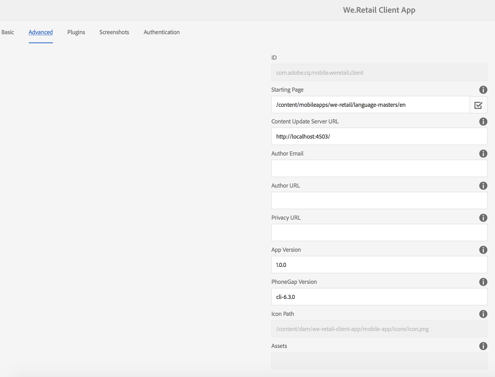

# 編輯應用程式中繼資料 {#editing-app-metadata}

>[!NOTE]
>
>Adobe建議針對需要單頁應用程式架構用戶端轉譯（例如React）的專案使用SPA編輯器。 [了解更多](/help/sites-developing/spa-overview.md).

此 **管理應用程式** 並排和「管理應用程式」頁面提供檢視和編輯應用程式中繼資料的方法。 向供應商商店發佈應用程式時，需要應用程式元資料。 這可能包括通用中繼資料、iOS中繼資料和螢幕擷取畫面。 請參閱 [管理應用程式圖磚](/help/mobile/phonegap-app-details-tile.md) 如需常見和iOS中繼資料的詳細資訊。

## 編輯應用程式資料 {#editing-the-app-data}

若要編輯應用程式的中繼資料：

1. 導覽至應用程式的控制面板頁面。

   

1. 要通過按一下「……」來查看或編輯詳細資訊 在 **管理應用程式** 方塊。

1. 輸入或檢視下圖所示的五個可用索引標籤中的任何一個的詳細資訊。

   

## 編輯常見和IOS中繼資料 {#editing-common-and-ios-metadata}

您可以編輯通用和IOS中繼資料：

* 選取 **進階** 頁簽。
* 編輯或檢視通用和IOS中繼資料。 如需詳細資訊，請參閱下圖。

 

## 添加和刪除螢幕截圖 {#add-and-remove-screenshots}

您可以將應用程式螢幕擷取畫面加入中繼資料統計。 有些廠商在將任何應用程式提交至其應用程式商店時，都需要準確的螢幕擷取畫面。 這些影像必須已存在於資產中。 請參閱 [資產選擇器](../assets/search-assets.md#assetpicker) 上傳螢幕截圖。

### 添加螢幕截圖 {#add-screenshots}

若要新增資產作為螢幕擷取：

1. 在 **管理應用程式** 頁面，按一下「新增」（加號圖示）。
1. 選取資產，然後按一下 **選擇** 以新增資產。

   

1. 選取資產，然後按一下 **選擇** 以新增資產。

>[!NOTE]
>
>螢幕截圖必須與目標設備的螢幕解析度相匹配。

### 刪除螢幕截圖 {#delete-screenshots}

要刪除螢幕截圖：

按一下資產上的刪除。

## 後續步驟 {#the-next-steps}

請參閱下列資源，以進一步了解其他製作角色：

* [管理應用程式圖磚](/help/mobile/phonegap-app-details-tile.md)
* [應用程式定義](/help/mobile/phonegap-app-definitions.md)
* [使用建立應用程式精靈建立新應用程式](/help/mobile/phonegap-create-new-app.md)
* [匯入現有的混合應用程式](/help/mobile/phonegap-adding-content-to-imported-app.md)
* [Content Services](/help/mobile/develop-content-as-a-service.md)

### 其他資源 {#additional-resources}

若要了解管理員和開發人員的角色和責任，請參閱下列資源：

* [使用AEM為Adobe PhoneGap企業開發](/help/mobile/developing-in-phonegap.md)
* [使用AEM管理Adobe PhoneGap Enterprise的內容](/help/mobile/administer-phonegap.md)
