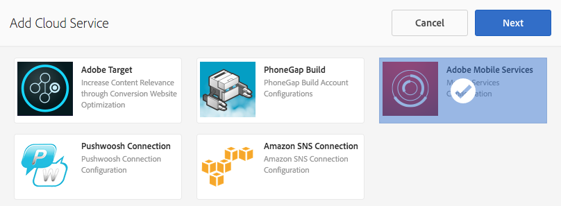
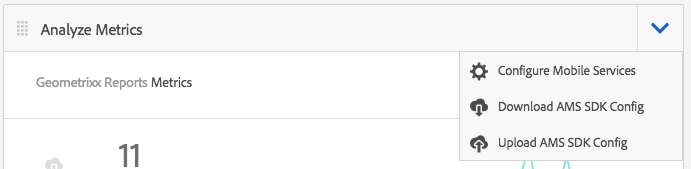

# 使用Adobe Mobile Analytics追蹤應用程式效能{#track-app-performance-with-adobe-mobile-analytics}

>[!NOTE]
>
>Adobe建議針對需要單頁應用程式架構用戶端轉換的專案使用SPA編輯器（例如React）。 [了解更多](/help/sites-developing/spa-overview.md).

您希望推動更高的客戶轉化率和忠誠度。

您希望為客戶提供相關且有吸引力的體驗。

您的AEM mobile應用程式對您的行銷宣傳有何作用？

如何微調行動應用程式，為您的使用者提供最佳體驗？

透過Adobe Mobile Services，您可以追蹤行動應用程式的使用狀況、應用程式當機、裝置詳細資訊以及許多其他重要度量，從而深入瞭解您的使用者使用行動應用程式的方式。

Adobe Experience Manager mobile可讓您直接從AEM mobile應用程式儀表板瞭解行動分析的詳細資訊。 儀表板中 **的「行動量度圖格** 」可為行動應用程式提供即時分析，讓開發人員、作者和管理員可快速瞭解行動應用程式的運行狀況。 Adobe Mobile Analytics SDK是分析的  支柱。 Adobe Mobile Analytics SDK可以原生方式插入您的應用程式，或透過PhoneGap網橋外掛程式進行網頁檢視。 量度會在裝置上收集並快取，直到裝置連線為止，資料會推送至Adobe Mobile Services Cloud以進行報告和分析。

Adobe Mobile Analytics SDK提供下列功能：

1. **針對行動通道收集資料** -針對所有主要作業系統上的行動網站和應用程式收集完整的資料。
1. **行動互動分析** -瞭解您行動應用程式、網站或視訊中的使用者互動，包括消費者啟動渠道的頻率、他們是否從渠道購買等。
1. **行動應用程式控制面板和報表** -取得包含應用程式生命週期度量和應用程式商店度量的使用狀況報表— 檢視使用者、啟動、平均作業長度、保留長度和當機的趨勢。
1. **行動宣傳分析** -量化行動特定宣傳的成效，例如SMS、行動搜尋廣告、行動展示廣告和QR Code。
1. **地理位置分析** -根據GPS位置或興趣點，尋找應用程式使用者在何處啟動並與行動體驗互動。
1. **路徑分析** -瞭解使用者如何瀏覽您的應用程式，以判斷哪些螢幕和UI元素吸引使用者，以及哪些元素會導致使用者流失。

本節說明  AEM Developers如何學習如何使用分析追蹤來測量AEM Mobile應用程式。

最後， [AEM管理員](#administrators) 會學習：

* 建立Adobe Mobile services的雲端服務
* 建立行動服務設定並關聯報表套裝
* 將行動服務設定與行動應用程式建立關聯
* 透過AEM Apps Command center檢視量度
* 將AMS SDK設定指派給您的行動應用程式

## 針對開發人員——將Analytics整合至您的應用程式 {#for-developers-integrate-analytics-into-your-app}

**** 先決條件：AEM管理員需要設定Adobe Mobile Services雲端設定，如 [下所述](#amscloudserviceconfig)。

開發人員負責視需要將 [分析新增至AEM Mobile應用程式](/help/mobile/phonegap-add-analytics-to-apps.md) ，以追蹤、報告並瞭解您的使用者如何與行動應用程式內容互動，並測量關鍵生命週期度量，例如啟動、應用程式逗留時間和當機率。

## 管理員——設定Adobe Mobile Services cloud服務 {#for-administrators-configure-the-adobe-mobile-services-cloud-service}

為了善用Adobe Mobile Services，您需要使用您的Adobe Analytics帳戶資訊來設定AEM Adobe Mobile Services Cloud服務。 「應用程式命令中心」提供「 **分析量度」方塊** ，您可以在其中建立雲端服務與行動應用程式關聯。

按一下「分析量度」方塊上的齒輪圖示，即可開始為您的行動應用程式設定雲端服務。

按一下「分析量度」方塊中的齒輪圖示，將開啟「設定Mobile Services Analytics」模式對話方塊。 從「選擇行動服務設定」下拉式清單中選取您的設定。 如果您需要建立新的設定，請按一下扳手按鈕。

若要建立Adobe Mobile Service雲端服務，需執行兩個步驟：連線至服務，以及選取要指派給設定的報表套裝。

若要開始，請按一下控制面板中「管理雲端服務」方塊上的「+」按鈕。

按一下「**+**」按鈕後，就會顯 **** 示「新增雲端服務」精靈。

填寫必要欄位以選擇或建立新的行動服務設定，如下所示。 您的AEM管理員將需要這項資訊才能成功建立與Adobe Mobile services的連線。

完成Mobile services帳戶設定後，系統會提示您選取應用程式。 如此可將Adobe Mobile Service分析報表連結至該應用程式。

選擇所要的行動服務，然後按一下「更新」以指派行動服務設定並關閉對話方塊。

現在，您已將行動服務設定關聯至AEM mobile應用程式，圖格會開始擷取量度資料並開始報告。

### Adobe Mobile Services SDK設定檔案 {#adobe-mobile-services-sdk-config-file}

目前，您的行動應用程式已與雲端服務相關聯，但行動應用程式尚未知道如何將收集的行動量度傳回Adobe Analytics。 若要將行動應用程式連線至Adobe Analytics,Adobe Mobile Services SDK config檔案必須新增至Adobe Experience Manager。

在「分析量度」方塊中，按一下箭頭圖示以公開「下載／上傳AMS SDK設定」功能表項目。

第一步是從Adobe Mobile services取得SDK設定，按一下「下載AMS SDK設定」就會將您重新導向至Adobe Mobile services網站，您可從中下載設定檔案。 取得ADBMobileConfig.json檔案後，按一下「上傳AMS SDK設定」，將設定檔案上傳至AEM。

按一下「上傳Adobe Mobile services應用程式設定」按鈕並瀏覽ADBMobileConfig.json檔案，然後按一下「上傳」。

現在，行動應用程式可存取ADBMobileConfig.json檔案，並具備如何傳回Adobe Analytics並開始報告有助於推動應用程式成功的重要量度值的相關知識。

## 下一步是什麼？ {#what-s-next}

1. [開始我的AEM mobile應用程式體驗](/help/mobile/starting-aem-phonegap-app.md)
1. [管理我的應用程式內容](/help/mobile/phonegap-manage-app-content.md)
1. [建立我的應用程式](/help/mobile/building-app-mobile-phonegap.md)
1. [使用Adobe Mobile Analytics追蹤我的應用程式效能](/help/mobile/phonegap-intro-to-app-analytics.md)
1. [使用Adobe Target提供個人化的應用程式體驗](/help/mobile/phonegap-aem-mobile-content-personalization.md)
1. [傳送重要訊息給我的使用者](/help/mobile/phonegap-push-notifications.md)