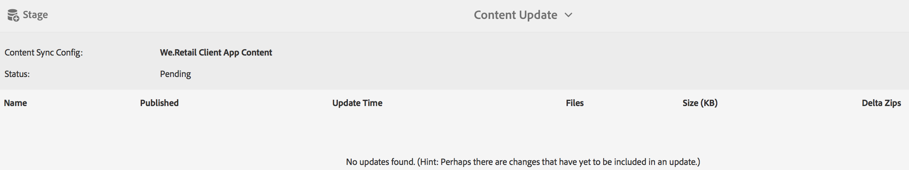

# 建立和管理應用程式內容{#creating-and-managing-app-content}

>[!NOTE]
>
>Adobe建議針對需要單頁應用程式架構用戶端轉換的專案使用SPA編輯器（例如React）。 [了解更多](/help/sites-developing/spa-overview.md).

管理應用程式內容需要開發人員、內容製作 [者和管理](#developer)員共同努力 。 作者會控制頁面，而頁面則會以應用程式開發人員產生的範本和元件為基礎。

最後，管理員策略性地發佈更新的應用程式內容。

>[!NOTE]
>
>**先決條件**:
>
>在「 [部署與維護](/help/sites-deploying/deploy.md)」中，開發人員已熟悉AEM的元件和範本系統。

## 管理頁面內容圖格 {#the-manage-page-content-tile}

>[!CAUTION]
>
>如果您未使用現成可用的應用程式範本，為了啟用新的應用程式內容可發佈至OTA，您必須設定內容同步處理常式。
>
>如需詳 [細資訊，請參閱「開發人員](/help/mobile/phonegap-contentsync.md) 」區段中的「具備內容同步功能的行動裝置」。

在此處，您可在AEM mobile中建立、編輯和刪除內容，其方式與在AEM Sites中的方式大同小異。

「管 **理頁面內容」方塊** ，會顯示受管理內容的頁數，以及針對特定裝載上次修改的頁數。 您可以按一下方塊中的每個記錄，深入鑽研內容以建立、複製、移動、刪除和更新頁面。

內容更新後，管理員可以透過「管理內容封裝」方塊，將內容更新Over-the-Air(OTA)裝載發佈 **給客戶。**

選擇其中一個列出的內容套件，以建立或編輯內容，例如建立、編輯或移除頁面、變更導覽和頁面順序、建立或更新內容，例如複製（文字）和媒體。

請注 *意，所有內容都是內容*，這表示應用程式樣式、複製（文字）、媒體、頁面、導覽，以及內容定位都可在OTA中編輯和更新，毋需前往應用程式商店。

若要編輯AEM mobile內容，*AEM作者*將需要對AEM的內容編輯介面有深入的瞭解：在 [AEM中編寫頁面。](/help/sites-authoring/qg-page-authoring.md)

## 「管理內容封裝」方塊 {#the-manage-content-packages-tile}

在這裡， ** AEM管理員可以快速輕鬆地更新其應用程式，以提供引人入勝的體驗和最新內容，以推動品牌參與度並達成業務目標，而不需要開發人員或應用程式商店重新送出。

一旦 *AEM作者透過「管理內容圖格」新增或修改內容後，*** AEM管理員就可以透過「內容套件」更新將這些變更推送給客戶。

「內容封裝」動作可讓 *AEM Author* （作者）建立和編輯頁面內容，而開發團隊則變更主機應用程式設計與實作，包括導覽、樣式、伺服器端邏輯、範本和元件，然後將這些變更推出OTA給客戶，而不需重新提交至各種商店進行散發。

**若要發佈新內容或更新內容**

從表徵圖中選擇內容包，在此示例中為英文包。 請注意，內容更新對話方塊會列出相關的 *內容同步* 設定。 如果應用程式內容自上次更新後已修改，狀態將顯示「待 *定*」，如下所示。

接著，選取右 **上角的** 「舞台(Stage)」動作，以建立新的內容更新。 添加適當的更新資訊並按「完成」。

然後 *Content Sync* （內容同步）處理常式會透過形成delta(只包含已變更的 *內容* )來建立必要的封裝。 完成後，此更新內容套件已暫存，如下所示。

將更新移轉至內容，可讓您在將更新發佈至OTA至行動裝置之前進行數項更新。

>[!NOTE]
>
>您可在發佈之前，使用AEM Verify應用程式來驗證分段內容。
>
>如需AEM Verify應 [用程式的詳細資訊，請參閱「AEM Verify的Mobile快速入門](/help/mobile/phonegap-mobile-quickstart.md) 」。

當準備好使用Content Sync OTA將新內容傳送給您的應用程式使用者時，請選取「 **發佈** 」，如下所示。

### 後續步驟 {#the-next-steps}

在您瞭解應用程式儀表板中的「建立和管理應用程式內容」後，請參閱下列其他編寫角色的資源：

* [管理應用程式圖格](/help/mobile/phonegap-app-details-tile.md)
* [編輯應用程式中繼資料](/help/mobile/phonegap-editmetadata.md)
* [應用程式定義](/help/mobile/phonegap-app-definitions.md)
* [使用「建立應用程式精靈」建立新應用程式](/help/mobile/phonegap-create-new-app.md)
* [匯入現有的混合應用程式](/help/mobile/phonegap-adding-content-to-imported-app.md)

### 其他資源 {#additional-resources}

要瞭解管理員和開發人員的角色和責任，請參閱以下資源：

* [使用AEM為Adobe PhoneGap Enterprise進行開發](/help/mobile/developing-in-phonegap.md)
* [使用AEM管理Adobe PhoneGap Enterprise的內容](/help/mobile/administer-phonegap.md)
