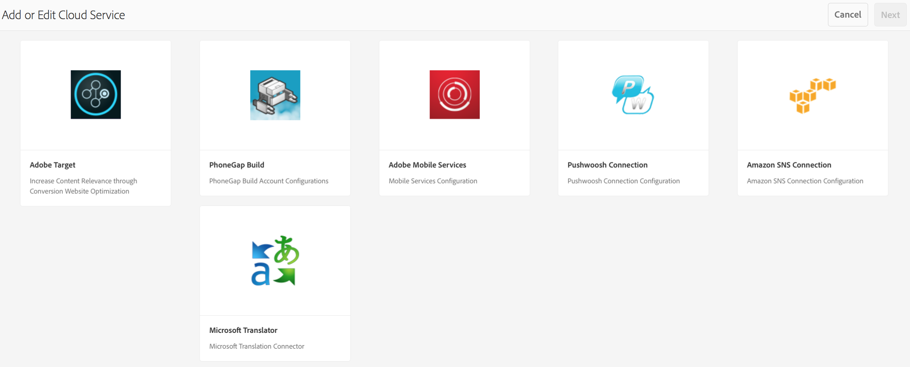
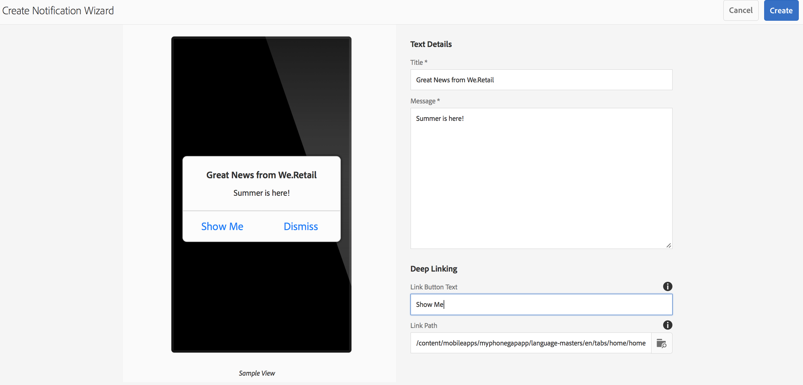

# 推播通知{#push-notifications}

>[!NOTE]
>
>Adobe建議針對需要單頁應用程式架構用戶端轉換的專案使用SPA編輯器（例如React）。 [了解更多](/help/sites-developing/spa-overview.md).

如果能夠立即以重要通知提醒您的AEM mobile應用程式使用者，對行動應用程式及其行銷宣傳的價值至關重要。 在這裡，我們將說明允許應用程式接收推播通知所需執行的步驟，以及如何設定並傳送來自AEM mobile的推播至手機上安裝的應用程式。 此外，本節說明如何設定推 [播通知的](#deeplinking) 「深層連結」功能。

>[!NOTE]
>
>*推播通知無法保證傳送；更像是公告。 我們盡力確保每個人都能收到它們，但它們並非保證的交付機制。 此外，傳送推播的時間可能會從不到一秒到半小時不等。*

搭配AEM使用推播通知需要一些不同的技術。 首先，推播通知服務提供者必須用來管理通知和裝置（AEM目前尚未這麼做）。 兩個提供者是使用AEM立即設定的：Amazon [Simple Notification Service](https://aws.amazon.com/sns/) （或SNS）和 [Pushwoosh](https://www.pushwoosh.com/)。 其次，針對特定行動作業系統的推播技術必須經過適當的服務— iOS裝置專用的Apple推播通知服務（或APNS）;和Android裝置專用的Google雲端訊息（或GCM）。 雖然AEM不會直接與這些平台特定服務通訊，但AEM必須提供某些相關的設定資訊以及通知，這些服務才能執行推播。

安裝並配置後（如下所述），其運作方式如下：

1. 推播通知會在AEM中建立，並傳送至服務提供者（Amazon SNS或Pushwoosh）。
1. 服務提供者會收到它，並將它傳送至核心提供者（APNS或GCM）。
1. 核心提供者會將通知推送至所有註冊該推播的裝置。 對於每個設備，它使用蜂窩資料網路或WiFi（以當前設備上可用的為準）。
1. 如果註冊的應用程式未執行，通知會顯示在裝置上。 點選通知的使用者會啟動應用程式，並在應用程式中顯示通知。 如果應用程式已在執行中，則只會顯示應用程式內通知。

此AEM版本支援iOS和Android行動裝置。

## 概觀與程式 {#overview-and-procedure}

若要在AEM mobile應用程式中使用推播通知，必須執行下列高階步驟。

通常，AEM開發人員會：

1. 註冊Apple和Google訊息服務
1. 向推播訊息服務註冊並加以設定
1. 新增推播支援至應用程式
1. 準備手機以進行測試

AEM管理員將：

1. 設定AEM應用程式的推播
1. 建立和部署應用程式
1. 傳送推播通知
1. 設定深層連 *結（選用）*

### 步驟1:註冊Apple和Google訊息服務 {#step-register-with-apple-and-google-messaging-services}

#### 使用Apple推播通知服務(APNS) {#using-the-apple-push-notification-service-apns}

請前往此處的Apple [頁面](https://developer.apple.com/library/ios/documentation/NetworkingInternet/Conceptual/RemoteNotificationsPG/Chapters/ApplePushService.html) ，以熟悉Apple推播通知服務。

若要使用APNS，您需要 **Apple的Certificate** file（.cer檔案）、推播 **私密金鑰** （.p12檔案） **和私密金鑰密碼** 。 有關如何做到的說明，請參 [閱](https://developer.apple.com/library/ios/documentation/NetworkingInternet/Conceptual/RemoteNotificationsPG/Chapters/ProvisioningDevelopment.html)。

#### 使用Google雲端訊息(GCM)服務 {#using-the-google-cloud-messaging-gcm-service}

>[!NOTE]
>
>Google正以類似的服務Firebase Cloud Messaging(FCM)取代GCM。 有關FCM的詳細資訊，請按一下 [此處](https://developers.google.com/cloud-messaging/faq)。

請前往此處的Google [頁面](https://developer.android.com/google/gcm/index.html) ，以熟悉Android專用的Google Cloud Messaging。

您必須依照此處的 [步驟](https://developer.android.com/google/gcm/gs.html)**來建立Google API專案**、 **啟用GCM服務**, ****&#x200B;以及取得API金鑰JeyCliz。 您將需要 **API金鑰** ，才能傳送推播通知至Android裝置。 此外，請記錄您的 **專案編號**，有時也稱為 **GCM傳送者Id**。

以下步驟顯示了建立GCM API密鑰的不同方法：

1. 登入google並前往 [Google的「開發人員」頁面](https://developers.google.com/mobile/add?platform=android&cntapi=gcm)。
1. 從清單中選擇您的應用程式（或建立新的應用程式）。
1. 在「Android套件名稱」下方，輸入您的應用程式ID，例如： `com.adobe.cq.mobile.weretail.outdoorsapp`。 （如果無法運作，請使用「test.test」再試一次。）
1. 按一 **下「繼續」選擇並設定服務**
1. 選取「雲端訊息」，然後按一下「 **啟用Google雲端訊息」**。
1. 接著會顯示新的伺服器API金鑰和（新的或現有的）傳送者ID。

>[!NOTE]
>
>記錄伺服器API金鑰。 此值是在您的推播提供者的網站上輸入。

### 步驟2:註冊和配置推送訊息服務 {#step-register-and-configure-a-push-messaging-service}

AEM已設定為使用三種服務之一來傳送推播通知：

* Amazon SNS
* Pushwoosh
* Adobe Mobile Services

*Amazon SNS* 和 ** Pushwoosh組態可讓您從AEM畫面內傳送推播。

*Adobe Mobile Services* Configuration可讓您使用Adobe Analytics帳戶在Adobe Mobile services中設定和傳送推播通知（但應用程式必須使用此組態設定來建立，才能啟用AMS推播通知）。

#### 使用Amazon SNS消息服務 {#using-the-amazon-sns-messaging-service}

>[!NOTE]
>
>*有關Amazon SNS的資訊，以及建立新AWS帳戶的連結，可在此處[找到](https://aws.amazon.com/sns/)。 您可以取得一年免費帳戶。*

如果您不想使用Amazon SNS，可以跳過這些步驟。

請遵循下列步驟，為推播通知設定Amazon SNS:

1. **向Amazon SNS註冊**

   1. 記錄您的帳戶ID。 格式應為12位數，不含空格或破折號，即&quot;123456789012&quot;。
   1. 請確定您位於「美國東部」或「歐盟」地區，因為後續步驟（身分集建立）需要其中一個步驟。
   1. 註冊後，登錄到管理控制台並選擇 [SNS](https://console.aws.amazon.com/sns/) （推播通知服務）。 如果出現「Get Started（開始）」，請按一下。

1. **建立存取金鑰和ID**

   1. 按一下畫面右上角的登入名稱，然後從選單選擇「安全性認證」。
   1. 按一下「Access Keys（訪問密鑰）」 ，然後在下面的空格中按一下「Create **New Access Key（建立新訪問密鑰）**」。
   1. 按一 **下「顯示存取金鑰**」，然後複製並儲存顯示的存取金鑰ID和密碼存取金鑰。 如果您選擇下載索引鍵的選項，您將會收到包含這些相同值的csv檔案。
   1. 本頁可管理其他安全相關憑證和其他憑證。
   >[!NOTE]
   >
   >存取金鑰可用於多個應用程式。

   對於使用「AWS沙盒」帳戶的組織，步驟非常相似，並概述如下：

   1. 按一下畫面右上角的登入名稱，然後從選單選擇「我的安全性認證」。
   1. 按一下動作左側清單中的「使用者」，然後選擇您的使用者名稱。
   1. 按一下「安全憑據」頁籤。
   1. 從這裡，您可以看到您的按鍵並建立新的按鍵。 儲存金鑰以供日後使用。

1. **建立主題**

   1. 按一 **下「建立主題** 」，然後選擇主題名稱。 記錄所有欄位，例如「主題ARN」、「主題擁有者」、「地區」、「顯示名稱」。
   1. 按一 **下「其他主題動作** >編 **輯主題原則」**。 在「 **允許這些用戶訂閱此主題」下**，選擇「每 **個人」。**
   1. 按一 **下更新原則**。
   >[!NOTE]
   >
   >您可以針對不同的藍本建立多個主題，例如開發、測試、示範等。 其餘的SNS配置可以保持不變。 使用不同的主題建立應用程式；傳送至該主題的推播通知，只會由以該主題建立的應用程式接收。

1. **建立平台應用程式**

   1. 按一下「應用程式」，然後按一下「建立平台應用程式」。 選擇名稱並選取平台（iOS適用的APNS、Android適用的GCM）。 視平台而定，其他欄位需要填入：

      1. 對於APNS，必須輸入P12檔案、密碼、憑證和私密金鑰。 這些應已在上述的「使 *用Apple推播通知服務(APNS)」步驟中取得* 。
      1. 對於GCM，必須輸入API金鑰。 這應該是在上述「使用 *Google雲端訊息(GCM)服務」步驟中取得* 。
   1. 針對您要支援的每個平台重複上述步驟一次。 若要同時推送至iOS和Android，必須建立兩個平台應用程式。

1. **建立身份池**

   1. 使用 [Cognito](https://console.aws.amazon.com/cognito) 建立身份池，該池將儲存未驗證用戶的基本資料。 請注意，目前只有「美國東部」和「歐盟」地區受Amazon Cognito支援。
   1. 為其命名，並勾選「啟用未驗證身分的存取」方塊。
   1. 在下一頁(「您的&#x200B;*Cognito身份需要訪問您的資源*」)，按一下「允許」。
   1. 在頁面右上方，按一下連結「編輯&#x200B;*識別池」*。 此時將顯示身份池ID。 儲存此文字以供稍後使用。
   1. 在同一頁上，選擇「未驗證角色」旁邊的下拉清單，並確保其已選中「Cognito_&lt;池名稱>未驗證角色」。 儲存您的變更。

1. **設定存取權限**

   1. 登錄 [Identity and Access Management](https://console.aws.amazon.com/iam/home) (IAM)
   1. 選擇角色
   1. 按一下在上一步中建立的角色，名為Cognito_&lt;yourIdentityPoolName>Unauth_Role。 記錄顯示的「角色ARN」。
   1. 如果尚未開啟「內嵌原則」，請開啟「內嵌原則」。 您應該看到一個名稱為oneClick_Cognito_&lt;yourIdentityPoolName>Unauth_Role_1234567890123的策略。
   1. 按一下「編輯原則」。 以此JSON片段取代原則檔案的內容：
   <table>
    <tbody>
     <tr>
     <td>
 
 
{
 
 "版本":「2012-10-17」,
 
 "陳述式": [
 
 {
 
 "動作": [
 
 "mobileanalytics:PutEvents",
 
 "cognito-sync:*",
 
 "SNS:CreatePlatformEndpoint",
 
 "SNS：訂閱"
 
 ],
 
 「效果」:"允許",
 
 "資源": [
 
 "*"
 
 ]
 
 }
 
 ]
 
}
 
 
 </td>
     </tr>
    </tbody>
    </table>

   1. 按一下「套 **用原則」**

#### 使用Pushwoosh傳訊服務 {#using-the-pushwoosh-messaging-service}

如果您不想使用Pushwoosh，可以跳過此步驟。

若要使用Pushwoosh:

1. **向Pushwoosh註冊**

   1. 前往pushwoosh.com並建立新帳戶。

1. **建立API存取Token**

   1. 在Pushwoosh網站上，前往「API存取」功能表項目以產生API存取Token。 您必須安全地記錄此檔案。

1. **建立新的應用程式**

   1. 若需Android支援，您必須提供GCM API金鑰。
   1. 設定應用程式時，請選擇Cordova做為架構。
   1. 若要取得iOS支援，您必須提供憑證檔案(.cer)、推播憑證(.p12)和私密金鑰密碼；這些應該是從蘋果的APNS網站上獲得的。 對於「框架」，請選擇Cordova。
   1. Pushwoosh將為該應用程式產生一個應用程式ID，格式為「XXXXX-XXXXX」，其中每個X都是十六進位值（0到F）。

>[!NOTE]
>
>*如果在AEM中設定第二個應用程式，且其應用程式ID與其他相關值相同：AI存取Token和GCM Id)，透過AEM上第二個應用程式傳送的任何推播通知，都會使用該應用程式ID前往任何其他應用程式。*

### 步驟3:新增推播支援至應用程式 {#step-add-push-support-to-the-app}

#### 添加ContentSync配置 {#add-contentsync-configuration}

建立兩個名為notificationsConfig的內容節點（一個在app-config中，一個在app-config-dev中）:

* /content/`<your app>`/shell/jcr:content/pge-app/app-config-dev/notificationsConfig
* /content/`<your app>`/shell/jcr:content/pge-app/app-config/notificationsConfig

使用這些屬性（.content.xml檔案）:&lt;jcr:root xmlns:jcr=&quot; [https://www.jcp.org/jcr/1.0](https://www.jcp.org/jcr/1.0)&quot; xmlns:nt=&quot; [https://www.jcp.org/jcr/nt/1.0](https://www.jcp.org/jcr/nt/1.0)&quot;jcr:primaryType=&quot;nt:entructedProperties=&quot;[appAPIAccessToken]&quot;path=&quot;。././....&quot;
targetRootDirectory=&quot;www&quot;type=&quot;notificationsconfig&quot;/>

>[!NOTE]
>
>內容同步處理常式會尋找這些節點，如果節點不在，則不會寫出pge-notifications-config.json檔案。

#### 添加客戶端庫 {#add-client-libraries}

推播通知用戶端程式庫必須依照下列步驟新增至應用程式：

在CRXDE Lite中：

1. 導覽至 */etc/designs/phonegap/&lt;app name>/clientlibsall。*
1. 連按兩下屬性窗格中的內嵌區段。
1. 在出現的對話方塊中，按一下+按鈕以新增用戶端程式庫。
1. 在新文字欄位中，新增「cq.mobile.push」，然後按一下「確定」。
1. 再新增一個稱為cq.mobile.push.amazon的項目，然後按一下「確定」。
1. 儲存變更。

>[!NOTE]
>
>如果推播通知已移除或未使用，請針對應用程式的空間考量，並避免主控台錯誤訊息，從您的應用程式移除這些clientlib。

### 步驟4:準備電話進行測試 {#step-prepare-a-phone-for-testing}

>[!NOTE]
>
>*對於推播通知，您必須在實際裝置上進行測試，因為模擬器無法接收推播通知。*

#### IOS {#ios}

若是iOS，您必須使用Mac OS電腦，而且必須加入 [iOS開發人員計畫](https://developer.apple.com/programs/ios/)。 有些公司擁有公司授權，可供所有開發人員使用。

使用XCode 8.1時，您必須先移至專案的「功能」標籤，然後切換「推播通知」切換為「開啟」。

#### Android {#android}

若要使用CLI在Android手機上安裝應用程式(請參閱下列內容：步 **驟6 —— 建立和部署應用程式**)，您必須先將手機置於「開發人員模式」。 如需 [執行此動作的詳細資訊，請參閱啟用裝置上的開發人員選項](https://developer.android.com/tools/device.html#developer-device-options) 。

### 步驟5:設定AEM應用程式的推播 {#step-configure-push-on-aem-apps}

在建立並部署至您所設定的行動裝置之前，您必須針對您決定使用的訊息服務設定通知設定。

1. 建立推播通知的適當授權群組。
1. 以適當的使用者身分登入AEM，按一下「應用程式」標籤。
1. 按一下應用程式。
1. 尋找「管理雲端服務」方塊，然後按一下鉛筆，以修改您的雲端設定。
1. 選擇Amazon SNS連接、Pushwoosh連接或Adobe Mobile services作為通知配置。
1. 輸入提供者屬性，然後按一下提交以保存它們，然後按一下完成。 除AMS外，在此階段未進行遠程驗證。
1. 您現在應該會看到您剛在「管理雲端服務」方塊中輸入的設定。

### 步驟6:建立和部署應用程式 {#step-build-and-deploy-the-app}

**** 注意：請參閱我們有關建立PhoneGap應 [用程式](/help/mobile/building-app-mobile-phonegap.md) 的說明。

使用PhoneGap建立和部署應用程式有兩種方式。

**** 注意：對於推播通知測試，模擬器將不夠，因為推播通知會在推播提供者（Apple或Google）和裝置之間使用不同的通訊協定。 目前的Mac/PC硬體和模擬器不支援此功能。

1. *PhoneGap Build* 是PhoneGap提供的服務，可在其伺服器上為您建立應用程式，並讓您直接將它下載至裝置。 請參閱 [PhoneGap Build檔案](https://build.phonegap.com/) ，瞭解如何設定和使用PhoneGap Build。

1. *PhoneGap命令列介面* (CLI)可讓您在命令列上使用豐富的PhoneGap命令集來建立、除錯和部署應用程式。 請參閱 [PhoneGap開發人員檔案](https://docs.phonegap.com/en/edge/guide_cli_index.md.html#The%20Command-Line%20Interface) ，瞭解如何設定和使用PhoneGap CLI。

### 步驟7:傳送推播通知 {#step-send-a-push-notification}

若要建立新通知並傳送，請依照下列步驟進行。

1. 建立新通知

   * 在AEM mobile應用程式的儀表板中，尋找「推播通知」方塊。
   * 在右上方的功能表中，選擇「建立」。 請注意，此按鈕在雲端設定首次設定之前才可用。
   * 在「建立通知精靈」中，輸入標題和訊息，然後按一下「建立」按鈕。 您的通知現在已準備好立即或稍後傳送。 可以編輯消息和／或標題，並且可以更改和保存。

1. 傳送通知

   * 在「應用程式」儀表板中，尋找「推播通知」方塊。
   * 選擇通知，或按一下右下方(...)，以顯示通知清單。 此清單也會指出通知是否已準備好傳送、已傳送，或是傳送期間發生錯誤。
   * 選取一個通知的核取方塊（僅限），然後按一下清單上方的「傳送通知」按鈕。 您將有一次機會在出現的對話方塊上「取消」或「傳送」通知。

1. 處理結果

   * 如果推播通知服務（Amazon SNS或Pushwoosh）收到Send請求，確認其有效，並將其成功發送給本機提供者（APNS和GCM），則「發送」對話框將關閉，不顯示任何消息。 在通知清單中，該通知的狀態會列為「已傳送」。
   * 如果推播傳送失敗，對話方塊將顯示指示問題的訊息。 在通知清單中，該通知的狀態會列為「錯誤」，但如果問題已修正，則可再次傳送通知。 發生錯誤時，伺服器錯誤記錄中應會顯示其他錯誤資訊。
   * 請注意，iOS和Android推播通知之間有一些平台差異。 其中：

      * 使用CLI建立應用程式後，應用程式會部署在Android上。 在iOS上，您必須手動啟動它。 由於推播註冊步驟會在啟動時進行，因此Android應用程式可以立即接收推播通知（因為它已啟動並註冊），而iOS應用程式則不會。
      * 在Android上，「確定」按鈕文字會以所有大寫顯示（以及應用程式內通知中新增的任何其他按鈕），而在iOS中則否。

對於AMS推播通知，通知必須由AMS伺服器編寫併發送。 AMS提供的推播通知功能，超出AEM透過AWS和Pushwoosh提供的通知功能。

>[!NOTE]
>
>*推播通知無法保證傳送；更像是公告。 我們盡力確保每個人都聽到，但它們並非保證的交付機制。 此外，傳送推播的時間可能會從不到一秒到半小時不等。*

### 使用推播通知設定深層連結 {#configuring-deep-linking-with-push-notifications}

什麼是深層連結？ 在推播通知的內容中，這是允許應用程式開啟或導向（如果開啟）至應用程式內指定位置的一種方式。

它如何運作？ 推播通知的作者可選擇新增按鈕標籤(即「給我看看！」)至通知，並透過視覺化路徑瀏覽器選擇想要連結至通知的頁面。 傳送時，推播會正常進行，只不過應用程式內訊息中的「確定」按鈕會由「關閉」按鈕取代，而指定的新按鈕（「顯示我！」）的雙曲餘切值。 按一下新按鈕，應用程式就會移至應用程式中指定的頁面。 按一下「關閉」將只關閉消息。

如果應用程式未開啟，陰影會顯示為正常。 在陰影中對通知採取動作會開啟應用程式，然後根據推播通知中設定的內容向使用者呈現深層連結按鈕。

建立通知、新增按鈕文字和連結路徑供選用的深層連結使用：

>[!CAUTION]
>
>.若要存取控制面板中的「推播通知」方塊，請遵循下列步驟。

1. 按一下「管理雲端服務」方塊右上角 **的編輯** 。

   

1. 選取「 **Pushwoosh連線」**。 按一 **下「下一步**」。

   

1. 輸入屬性的詳細資訊，然後按一下「 **提交」**。

   

   在您送出設定後，「推 **播通知」方塊會顯示** 在控制面板中。

   

### 建立通知精靈 {#create-notification-wizard}

推播通 **知方塊顯示在控制面板中** ，使用建立通知精靈來新增內容：

1. 按一下「推播通知」方塊右上角的新 **增符號** ，以開啟「 **建立通知精靈」**。

   

1. 按一下連結路徑中的瀏覽圖示，向使用者呈現應用程式的內容結構。

   選擇路徑後，按一下檢查表徵圖。

   

   >[!NOTE]
   >
   >「連結按鈕文字」的限制為20個字元。
   >
   >如果使用者沒有應用程式的最新版本，而連結的路徑不可用，則確認深層連結的動作會將使用者帶往應用程式的首頁面。

1. 在「建立 **通知嚮導** 」中輸入「文本詳細資訊」，然後按一下「建立 **」(** Create ****)。

   

   按一下您從「推播通知」方塊建立的推播通知，以開啟 **詳細資訊** 。

   您可以編輯屬性、傳送通知或刪除通知。

   

>[!NOTE]
>
>**其他資訊**:
>
>在6.4版發行後將不支援Pushwoosh和Amazon SNS，而且將可作為套件共用的附加元件使用。

### 後續步驟 {#the-next-steps}

瞭解應用程式推播通知的詳細資訊後，請參閱「 [AEM Mobile內容個人化」](/help/mobile/phonegap-aem-mobile-content-personalization.md)。

