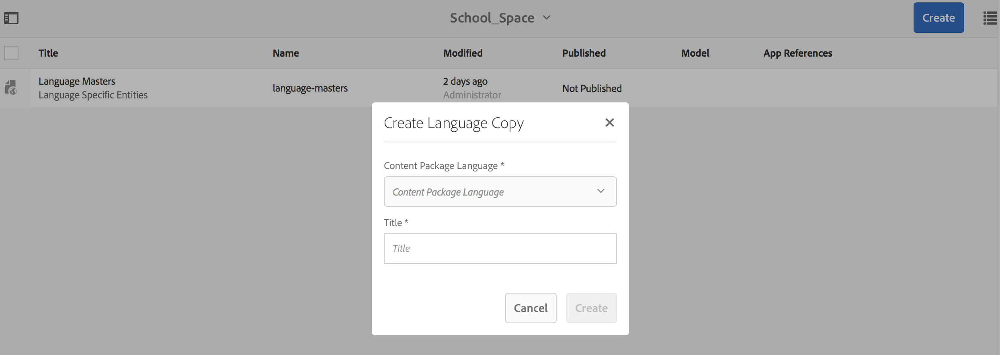
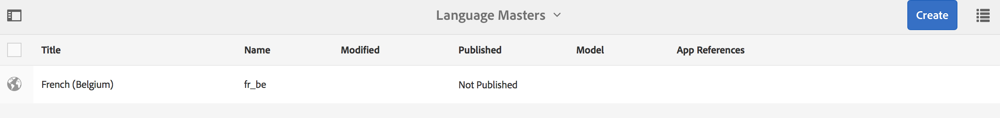

# 空格和圖元{#spaces-and-entities}

>[!NOTE]
>
>Adobe建議針對需要單頁應用程式架構用戶端轉換的專案使用SPA編輯器（例如React）。 [了解更多](/help/sites-developing/spa-overview.md).

空間是儲存透過Content Services REST API公開之實體的便利位置。 這特別有用，因為應用程式（或任何渠道）可與許多實體關聯。 強制實體位於空間內，會強制採用將應用程式需求分組的最佳實務。 或者，您可以將AEM中的應用程式與少量的「空格」建立關聯。

>[!NOTE]
>
>若要讓內容服務的任何通道都能使用內容，它必須位於空間之下。

## 建立空間 {#creating-a-space}

如果使用者想要將許多內容和資產公開給行動應用程式，使用者會使用AEM mobile儀表板建立空間。

對於尚未設定內容服務以搭配空格運作的首次使用者，AEM mobile儀表板在選取「內容服務」後只會顯示「 **應用程式」**。

>[!CAUTION]
>
>**添加空間的先決條件**
>
>勾選「 **啟用AEM Content Services** to wath Spaces」（啟用AEM Content Services以使用空格），並在您的AEM mobile應用程式儀表板中啟用它。
>
>如需詳 [細資訊，請參閱](/help/mobile/developing-content-services.md) 「管理內容服務」。

在控制面板中配置空格後，請依照下列步驟建立空格：

1. 從「內 **容服務** 」中選擇「空格」。

   

1. 選擇「 **建立** 」以建立空間。 輸 **入空**&#x200B;格的Title ****、Name **和** Description。

   按一下&#x200B;**「建立」**。

   

## 管理空間 {#managing-a-space}

建立空間後，按一下左側以管理清單中的空間。

您可以檢視空間的屬性、刪除空間，或將空間及其內容發佈至AEM發佈例項。

**查看和編輯空間的屬性**

1. 從清單中選擇空間
1. 從工 **具列選擇** 「屬性」
1. 完成時 **按一下** 「關閉」

**發佈空間** ：發佈空間時，該空間中的所有資料夾和實體也會發佈。

1. 按一下「空間控制台」清單中的空間表徵圖以選擇空間
1. 選擇發 **布樹**

>[!NOTE]
>
>您可以 **取消發佈** 「空間」，這會從發佈例項中移除空間。
>
>下圖說明了發佈空間後可執行的操作。

## 在空間中使用資料夾 {#working-with-folders-in-a-space}

空間可以包含資料夾，以幫助進一步組織空間的內容和資產。 使用者可以在空格下建立自己的階層。

### 建立資料夾 {#creating-a-folder}

1. 按一下空間控制台中清單中的空間，然後按一下「創 **建資料夾」**

   

1. 輸入 **資料夾的Title**(標 **題)** 、Name **（名稱）** 和Description（說明）

   

1. 按一下 **建立** ，在空間中建立資料夾

## 語言副本 {#language-copy}

>[!CAUTION]
>
>語言副本在本版本中無法完全運作。 它只設定結構。

「語 **言複製** 」功能可讓作者複製其主要語言複製，然後建立專案和工作流程以自動翻譯內容。 「語言副本」會建立正確的結構。 在空間中添加資料夾後，可以將「語言副本」添加到空間。

>[!NOTE]
>
>建議將任何可能翻譯的內容放在「語言複製」節點下。

### 添加語言副本 {#adding-language-copy}

1. 建立空間後，按一下該空間可建立語言副本。

   按一 **下「建立** 」，然後選 **擇「語言副本」**。

   

   >[!NOTE]
   >
   >語言複製節點只能作為空間的直接子節點存在。

1. **** 選擇 **Content Package Language&amp;ast;並輸入** Title&amp;ast;在「創 **建語言副本** 」對話框中。

   按一下&#x200B;**「建立」**。

   

1. 一旦您建立「語言副本」後，它就會出現在「語言主版」的 **您的空間中**。

   

   >[!NOTE]
   >
   >選擇 **語言主版** ，以查看語言副本資料夾。

### 從空間中刪除資料夾 {#removing-a-folder-from-the-space}

1. 從空間內容清單中選擇資料夾
1. 從工具 **列按一下** 「刪除」

   >[!NOTE]
   >
   >要導航到資料夾並查看其內容或添加子資料夾或實體，請按一下空間內容清單中該資料夾的標題。

## 在空間中使用圖元 {#working-with-entities-in-a-space}

實體代表透過web service端點公開的內容。 實體會儲存在空格中，因此可輕鬆找到並獨立於AEM儲存庫結構，而AEM儲存庫結構可保存其相關內容。

您可能希望在某些邏輯收集中將實體分組。 若要這麼做，您可以建立任意數目的檔案夾。

如果收集其他實體的實體子項以進行資料模型化，開發人員使用者可從「實體群組」模型類型（即裝即用）建立特定「群組模型」。

>[!NOTE]
>
>實體始終與空間相關聯，因此大部分實體用戶介面都通過空間控制台訪問。

### 建立實體 {#creating-an-entity}

1. 開啟「空間」控制台，然後按一下空間標題。

   或者，您可以按一下清單中資料夾的標題，以導覽至資料夾。

   

1. 選擇圖元的模型。 這是您要建立的圖元類型。 按一下「下一步」。

   

   >[!NOTE]
   >
   >您可以選擇「資產模型」 **、「頁面模**&#x200B;型」 ****，或先前建立的圖元類型模型。
   >
   >請參 [閱建立模型](/help/mobile/administer-mobile-apps.md)，以建立自定義實體。

1. 輸入實 **體的**、名稱 **、說**&#x200B;明 **、**&#x200B;標 **** 簽標題。 按一下&#x200B;**「建立」**。

   

   完成後，實體將出現在空間的子體中。

### 編輯實體 {#editing-an-entity}

1. 建立實體後，請轉至資料夾或空間，然後從「空間」控制台選擇要編輯的實體。

   

1. 選擇要編輯的實體，然後按一下「編 **輯」**。

   

   >[!CAUTION]
   >
   >視您選擇建立實體的範本而定，編輯和檢視實體屬性時，兩者的UI會有所不同。 如需詳細資訊，請參閱下列步驟。

   ***如果選擇將實體建立為「資產模型」的模板***，則按一下「編輯」( **Edit** )允許您添加資產，如下圖所示：

   

   或者，您也可以按一下「 **預覽** 」來檢視json連結。

   

   ***如果您選擇用於將實體建立為「頁面模型***」的模板，則按一下「編輯」( **Edit** )允許您添加資產，如下圖所示：

   

   按一下路徑中的圖 **示** ，新增資產

   

   >[!NOTE]
   >
   >新增實體後，必須儲存實體，「預覽」連結才能運作。 若要檢視預覽，請按一下「 **儲存**」。 按一下「 **預覽** 」會顯示新增資產的json，如下圖所示：

   

   >[!NOTE]
   >
   >將資產新增到實體後，您可以選擇「儲存」以儲存變更，或選擇「儲存並關閉 ******** 」以儲存並重新導向至定義實體的「空間控制台」清單。

   此外，從空間控制台清單中選擇一個實體，然後按一下「屬 **性** 」(Properties)以查看和編輯已定義實體的屬性。

   

   您可以編輯標題、說明、標籤，並將資產新增至實體。

   

### 移除實體 {#removing-an-entity}

1. 從空間內容清單中選擇實體

   

1. 按一下 **工具欄** 「刪除」(Delete)，從空間中刪除特定圖元

### 發佈實體 {#publishing-an-entity}

您可以選擇「發佈樹」 **或「快速發佈** 」 **** 來發佈實體。

1. 從空間控制台清單中選擇一個實體，然後按一下「發佈樹」**來發佈該實體及其子項。

   

   **或**,

   按一 **下「快速發佈** 」以發佈該特定實體。
