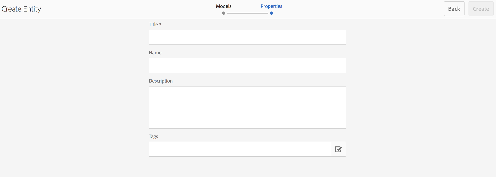
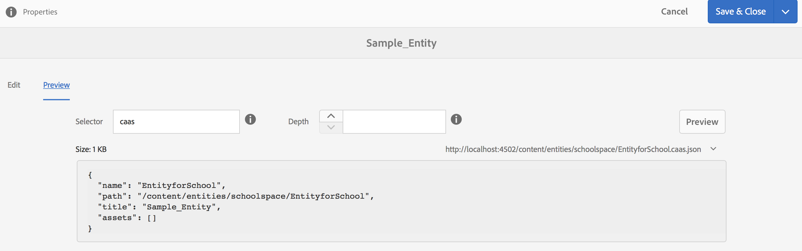

# 空間與實體{#spaces-and-entities}

{{ue-over-mobile}}

空間是儲存透過Content Services REST API公開之實體的便利位置。 這個方法特別實用，因為應用程式（或任何管道）可以與許多實體相關聯。 強制實體位於空間內會強制將應用程式需求分組的最佳實務。 或者，您也可以將AEM中的應用程式與少量的空間建立關聯。

>[!NOTE]
>
>若要讓內容服務的任何管道都能使用，內容必須位於空格下。

## 建立空間 {#creating-a-space}

如果使用者想要將一棧內容和資產公開至行動應用程式，使用者會使用AEM Mobile儀表板建立空間。

使用者第一次未設定讓內容服務使用空間，AEM Mobile儀表板在選取&#x200B;**內容服務**&#x200B;後只顯示應用程式。

>[!CAUTION]
>
>**新增空間的先決條件**
>
>勾選&#x200B;**啟用AEM Content Services**&#x200B;以使用空間，並在AEM Mobile應用程式儀表板中啟用它。
>
>如需詳細資訊，請參閱[管理內容服務](/help/mobile/developing-content-services.md)。

在控制面板中設定空間後，請依照下列步驟建立空間：

1. 從Content Services選擇&#x200B;**空間**。

   

1. 選擇&#x200B;**建立**&#x200B;以建立空間。 輸入分享空間的&#x200B;**Title**、**Name**&#x200B;和&#x200B;**Description**。

   按一下&#x200B;**建立**。

   

## 管理空間 {#managing-a-space}

建立空間後，按一下左側以管理清單中的空間。

您可以檢視空間的屬性、刪除空間，或將空間及其內容發佈到AEM發佈執行個體。

**檢視及編輯空間內容**

1. 從清單中選取空間
1. 從工具列選擇&#x200B;**屬性**
1. 完成時，按一下&#x200B;**關閉**

**發佈分享空間**&#x200B;發佈分享空間時，也會發佈該分享空間中的所有資料夾和實體。

1. 按一下空間控制檯清單中的空間圖示以選取空間
1. 選擇&#x200B;**Publish樹狀結構**

>[!NOTE]
>
>您可以&#x200B;**取消發佈**&#x200B;空間，這會移除發佈執行個體的空間。
>
>下圖說明發佈空間後可以執行的動作。

## 使用空間中的資料夾 {#working-with-folders-in-a-space}

空間可包含資料夾，以協助進一步組織空間的內容和資產。 使用者可以在空間下建立自己的階層。

### 建立資料夾 {#creating-a-folder}

1. 按一下空間主控台清單中的空間，然後按一下&#x200B;**建立資料夾**

   

1. 輸入資料夾的&#x200B;**標題**、**名稱、**&#x200B;和&#x200B;**描述**

   

1. 按一下&#x200B;**建立**，在空間中建立資料夾

## 語言副本 {#language-copy}

>[!CAUTION]
>
>語言副本無法在這個版本中完整運作。 它只會設定結構。

**語言副本**&#x200B;功能可讓作者複製其主要語言副本，然後建立專案和工作流程以自動翻譯內容。 語言副本會建立正確的結構。 在分享空間新增資料夾後，您就可以新增語言副本至分享空間。

>[!NOTE]
>
>建議您將所有可能翻譯的內容放在「語言副本」節點下。

### 新增語言副本 {#adding-language-copy}

1. 建立空間後，按一下該空間可建立語言副本。

   按一下&#x200B;**建立**&#x200B;並選擇&#x200B;**語言副本**。

   

   >[!NOTE]
   >
   >語言副本節點只能作為空間的直接子項存在。

1. 選擇&#x200B;**Content Package Language&amp;amp；ast；**，然後在&#x200B;**建立語言副本**&#x200B;對話方塊中輸入&#x200B;**Title&amp;amp；ast；**。

   按一下&#x200B;**建立**。

   

1. 建立語言副本後，它會顯示在&#x200B;**語言主版**&#x200B;的分享空間中。

   

   >[!NOTE]
   >
   >選取&#x200B;**語言主版**&#x200B;以檢視語言副本資料夾。

### 從空間移除資料夾 {#removing-a-folder-from-the-space}

1. 從空間內容清單中選取資料夾
1. 按一下工具列中的&#x200B;**刪除**

   >[!NOTE]
   >
   >若要導覽至資料夾並檢視其內容或新增子資料夾或實體，請按一下空間內容清單中的資料夾標題。

## 使用空間中的實體 {#working-with-entities-in-a-space}

實體代表透過Web服務端點公開的內容。 實體儲存在空格中，以便輕鬆找到，並保持獨立於儲存其相關內容的AEM存放庫結構。

您可能想要在某些邏輯集合中將實體群組在一起。 若要這麼做，您可以建立任意數量的資料夾。

如果為資料建模而收集的是其他圖元的圖元子件，則開發人員使用者可以從「圖元群組」模型型別建立特定的「群組模型」（現成可用）。

>[!NOTE]
>
>實體一律與空間相關聯，因此大多數實體使用者介面都是透過空間控制檯來存取。

### 建立實體 {#creating-an-entity}

1. 開啟分享空間主控台，然後按一下分享空間的標題。

   或者，您可以按一下清單中資料夾的標題，導覽至資料夾。

   

1. 選擇圖元的模型。 這是您要建立的實體型別。 按一下「下一步」。

   

   >[!NOTE]
   >
   >您可以選擇使用&#x200B;**Assets模型**、**頁面模型**，或您之前建立的實體型別模型。
   >
   >請參閱[建立模型](/help/mobile/administer-mobile-apps.md)，以建立您的自訂實體。

1. 輸入實體的&#x200B;**標題**、**名稱**、**描述**&#x200B;和&#x200B;**標籤**。 按一下&#x200B;**建立**。

   

   完成後，實體會顯示在您空間的子代中。

### 編輯實體 {#editing-an-entity}

1. 建立實體後，請前往資料夾或分享空間，然後從「分享空間」主控台中選擇要編輯的實體。

   

1. 選取要編輯的實體，然後按一下&#x200B;**編輯**。

   

   >[!CAUTION]
   >
   >根據您選擇建立實體的範本，用於編輯和檢視實體屬性的UI將有所不同。 如需詳細資訊，請參閱下列步驟。

   ***如果您選擇將實體建立為Assets模型的範本***，按一下&#x200B;**編輯**&#x200B;可讓您新增資產，如下圖所示：

   

   或者，您可以按一下&#x200B;**預覽**&#x200B;以檢視json連結。

   

   ***如果您選擇將實體建立為頁面模型的範本***，按一下&#x200B;**編輯**&#x200B;可讓您新增資產，如下圖所示：

   

   按一下&#x200B;**路徑**&#x200B;中的圖示以新增資產

   

   >[!NOTE]
   >
   >新增實體後，必須儲存該實體才能讓預覽連結運作。 若要檢視預覽，請按一下[儲存]。**** 按一下&#x200B;**預覽**&#x200B;會顯示新增資產的json，如下圖所示：

   

   >[!NOTE]
   >
   >將資產新增至實體之後，您可以選擇&#x200B;**儲存**&#x200B;以儲存變更，或選擇&#x200B;**儲存並關閉**&#x200B;以儲存並重新導向至定義實體的分享空間主控台清單。

   此外，從空間控制檯清單中選取一個實體，然後按一下&#x200B;**屬性**&#x200B;以檢視和編輯已定義實體的屬性。

   

   您可以編輯標題、說明、標籤，並將資產新增至您的實體。

   

### 移除實體 {#removing-an-entity}

1. 從空間內容清單中選取實體

   

1. 按一下工具列中的&#x200B;**刪除**，從空間移除特定實體

### 發佈實體 {#publishing-an-entity}

您可以選擇使用&#x200B;**Publish樹狀結構**&#x200B;或&#x200B;**快速Publish**&#x200B;來發佈您的實體。

1. 從空間控制檯清單中選取一個實體，然後按一下**Publish樹狀結構**以發佈該實體及其子系。

   

   **或**，

   按一下&#x200B;**快速Publish**&#x200B;以發佈該特定實體。
