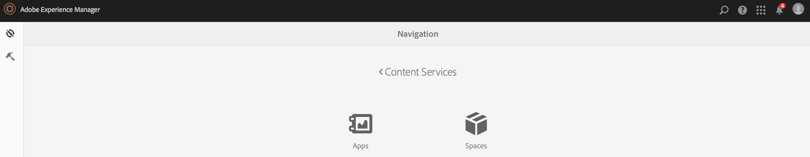
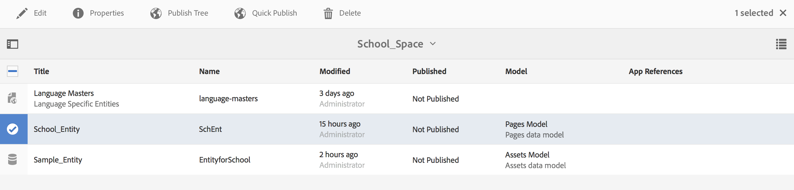

# 空格和圖元{#spaces-and-entities}

>[!NOTE]
>
>Adobe建SPA議對需要基於單頁應用程式框架的客戶端呈現（如React）的項目使用編輯器。 [深入了解](/help/sites-developing/spa-overview.md).

空間是儲存通過Content Services REST API公開的實體的方便位置。 這特別有用，因為應用（或任何渠道）可以與許多實體關聯。 強制實體在空間內強制將應用程式要求分組的最佳做法。 （可選）可以將應用與AEM少量空格相關聯。

>[!NOTE]
>
>要使Content Services的任何渠道都能使用某些內容，它需要位於空間下。

## 建立空間 {#creating-a-space}

如果用戶希望向移動應用公開大量內容和資產，則用戶使用AEM Mobile儀表板建立空間。

首次將內容服務配置為使用空格的用戶，AEM Mobile儀表板在選擇後僅顯示應用 **內容服務**。

>[!CAUTION]
>
>**添加空間的先決條件**
>
>檢查 **啟AEM用Content Services** 使用空格並在AEM Mobile應用程式儀表板中啟用它。
>
>請參閱 [管理Content Services](/help/mobile/developing-content-services.md) 的子菜單。

在儀表板中配置「空格」後，請按照以下步驟建立空格：

1. 選擇 **空格** 從Content Services中。

   

1. 選擇 **建立** 來建立空格。 輸入 **標題**。 **名稱**, **說明** 的上限。

   按一下&#x200B;**建立**。

   

## 管理空間 {#managing-a-space}

建立空間後，按一下左側以管理清單中的空間。

您可以查看空間的屬性、刪除空間或將空間及其內容發佈到發佈實AEM例中。

**查看和編輯空間的屬性**

1. 從清單中選擇空間
1. 選擇 **屬性** 的子菜單。
1. 按一下 **關閉** 完成

**發佈空間** 發佈空間時，該空間中的所有資料夾和實體也會發佈。

1. 通過按一下「空間控制台」清單中的空間表徵圖來選擇空間
1. 選擇 **發佈樹**

>[!NOTE]
>
>你可以 **取消發佈** a空間，從發佈實例中刪除該空間。
>
>下圖說明了發佈空間後可執行的操作。

## 在空間中使用資料夾 {#working-with-folders-in-a-space}

共用空間可以包含資料夾，以幫助進一步組織空間的內容和資產。 用戶可以在空間下建立自己的層次結構。

### 建立資料夾 {#creating-a-folder}

1. 按一下空間控制台清單中的空間，然後按一下 **建立資料夾**

   

1. 輸入 **標題**。 **姓名，** 和 **說明** 資料夾

   

1. 按一下 **建立** 在空間中建立資料夾

## 語言副本 {#language-copy}

>[!CAUTION]
>
>此版本的語言副本功能不全。 它只設定結構。

的 **語言副本** 功能允許作者複製其主語言副本，然後建立項目和工作流以自動翻譯內容。 「語言副本」(Language Copy)建立正確的結構。 在空間中添加資料夾後，可以將「語言副本」添加到空間。

>[!NOTE]
>
>建議將任何可能被翻譯的內容放在「語言複製」節點下。

### 添加語言副本 {#adding-language-copy}

1. 建立空間後，按一下該空間以建立語言副本。

   按一下 **建立** 選擇 **語言副本**。

   

   >[!NOTE]
   >
   >語言複製節點只能作為空間的直接子節點存在。

1. 選擇 **內容包語言(&amp;A);** 輸入 **標題(&amp;A);** 在 **建立語言副本** 對話框。

   按一下&#x200B;**建立**。

   

1. 建立語言副本後，它將出現在您的共用空間中 **語言大師**。

   

   >[!NOTE]
   >
   >選擇 **語言大師** 的子菜單。

### 從空間中刪除資料夾 {#removing-a-folder-from-the-space}

1. 從空間內容清單中選擇資料夾
1. 按一下 **刪除** 的子菜單。

   >[!NOTE]
   >
   >要導航到資料夾並查看其內容或添加子資料夾或實體，請按一下空間內容清單中資料夾的標題。

## 在空間中使用圖元 {#working-with-entities-in-a-space}

實體表示通過Web服務終結點公開的內容。 實體儲存在空格中，以便能夠輕鬆找到並保持與保存其相關內AEM容的儲存庫結構無關。

您可能希望在某些邏輯收集中將實體分組在一起。 為此，您可以建立任意數量的資料夾。

如果為資料建模收集了其他實體的實體子項，則開發人員用戶可以從現成提供的「實體組」模型類型建立特定的「組模型」。

>[!NOTE]
>
>實體始終與空間關聯，因此大多數實體用戶介面都通過空間控制台訪問。

### 建立實體 {#creating-an-entity}

1. 開啟「空間」控制台，然後按一下空間標題。

   或者，您可以通過按一下清單中資料夾的標題來導航到資料夾。

   

1. 選擇實體的模型。 這是要建立的實體類型。 按一下下一步。

   

   >[!NOTE]
   >
   >您可以選擇 **資產模型**。 **頁面模型**&#x200B;或之前建立的圖元類型的模型。
   >
   >請參閱 [建立模型](/help/mobile/administer-mobile-apps.md)，以建立自定義實體。

1. 輸入 **標題**。 **名稱**。 **說明**, **標籤** 的雙曲餘切值。 按一下&#x200B;**建立**。

   

   完成後，該實體將出現在共用空間的後代中。

### 編輯實體 {#editing-an-entity}

1. 建立實體後，轉到資料夾或空間，然後從「空間」控制台中選擇要編輯的實體。

   

1. 選擇要編輯的實體並按一下 **編輯**。

   

   >[!CAUTION]
   >
   >根據您選擇建立實體的模板，在編輯和查看實體屬性時，UI將不同於兩者。 有關詳細資訊，請參閱以下步驟。

   ***如果選擇將實體建立為資產模型的模板***，按一下 **編輯** 允許您添加如下圖所示的資產：

   

   或者，可按一下 **預覽** 查看json連結。

   

   ***如果選擇了用於將實體建立為頁面模型的模板***，按一下 **編輯** 允許您添加如下圖所示的資產：

   

   按一下 **路徑** 添加資產

   

   >[!NOTE]
   >
   >添加實體後，必須保存該實體，以使「預覽」(Preview)連結工作。 要查看預覽，請按一下 **保存**。 按一下 **預覽** 顯示添加的資產的json，如下圖所示：

   

   >[!NOTE]
   >
   >將資產添加到實體後，您可以選擇 **保存** 保存更改或選擇 **保存並關閉** 保存並重定向到定義實體的空間控制台清單。

   此外，從空間控制台清單中選擇一個實體，然後按一下 **屬性** 查看和編輯定義圖元的屬性。

   

   您可以編輯標題、說明、標籤並將資產添加到實體中。

   

### 刪除實體 {#removing-an-entity}

1. 從空間內容清單中選擇實體

   

1. 按一下 **刪除** 從工具欄中刪除特定圖元

### 發佈實體 {#publishing-an-entity}

你可以選擇 **發佈樹** 或 **快速發佈** 來發佈實體。

1. 從空間控制台清單中選擇一個實體，然後按一下**發佈樹**以發佈該實體及其子實體。

   

   **或**,

   按一下 **快速發佈** 發佈特定實體。
