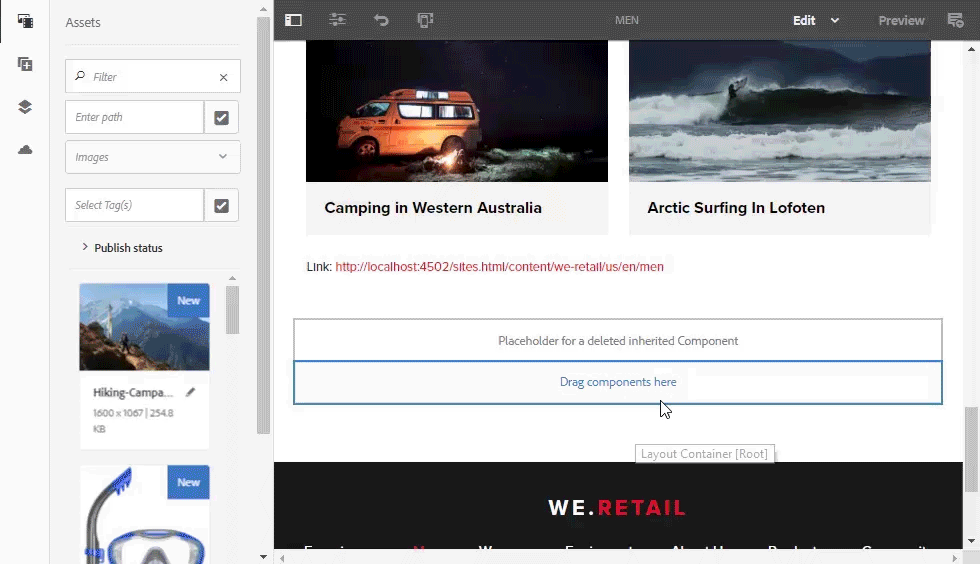

# AEM Assets發行說明{#aem-assets-release-notes}

以下是AEM 6.5 Assets版本的主要功能與重點。

## 與Adobe Creative cloud整合及創意工作流程 {#integration-with-adobe-creative-cloud-and-creative-workflows}

AEM提供多種方式來整合Adobe Creative Cloud，並分享資產，以便在創意與行銷或商業團隊緊密協作的工作流程中使用。 AEM 6.5持續改善整合併進一步簡化整合，以發掘更多機會並簡化現有方法。

閱讀以瞭解AEM 6.5的特定功能與整合，以最佳化支援您的內容速度使用案例。

### Adobe Asset Link {#aal}

Adobe Asset Link可加強創意人員與行銷人員在內容建立程式中的協作。 創意人員可以存取儲存在Adobe Experience Manager Assets(AEM Assets)中的內容，而不需離開他們最熟悉的應用程式。 創意人員可使用Photoshop、Illustrator和InDesign應用程式中的應用程式內面板，順暢地瀏覽、搜尋、結帳和結帳資產。

Adobe Asset Link是適用於企業的 [Creative cloud產品的一部分](https://www.adobe.com/creativecloud/business/enterprise.html) 。 如需詳細資訊，包括AEM部署的必要設定，請參閱 [Adobe Asset Link](https://helpx.adobe.com/enterprise/using/adobe-asset-link.html)。

### Adobe Stock整合 {#stock}

貴組織可在AEM Assets中使用其Adobe Stock企業計畫，以確保授權資產廣泛適用於您的創意和行銷專案。 您可以使用AEM的強大DAM功能，快速尋找、預覽和授權儲存在AEM中的Adobe Stock資產。

Adobe Stock服務可讓設計人員和企業針對其所有創意專案，取用數百萬個高品質、優質且免版稅的像片、向量、插圖、視訊、範本和3D資產。

如需詳細資訊，請參 [閱「在AEM Assets中使用Adobe Stock資產」](/help/assets/aem-assets-adobe-stock.md)。

從AEM Assets預覽Adobe Stock影像和授權

在AEM中搜尋及篩選已授權的Adobe Stock影像

### Adobe inDesign中的動態參照 {#dynamic-references-in-indesign}

Adobe inDesign檔案中使用的AEM資產是動態的。 如果參考資產在JCR階層中移動，則參考會自動更新。 如需詳細資訊，請參閱「管 [理複合資產」](/help/assets/managing-linked-subassets.md)。

## 品牌入口網站功能 {#brand-portal-capabilities}

AEM Assets Brand Portal可協助您輕鬆取得、有效控制並安全地將核准的資產發佈給外部廠商／機構以及跨裝置的內部商業使用者。 它有助於提高資產分享的效率，加速資產上市時間，並消除不合規使用和未經授權存取的風險。

如需詳細資訊，請 [參閱「品牌入口網站的新增功能](https://helpx.adobe.com/experience-manager/brand-portal/using/whats-new.html)」。

## 連線資產 {#connectedassets}

在大型企業中，建立網站所需的基礎架構可以分散。 有時，網站建立功能和所需的數位資產會處在不同的孤島中。

AEM Sites提供建立網頁的功能，而AEM Assets是數位資產管理(DAM)系統，可為網站提供必要的資產。 AEM現在整合AEM Sites和AEM Assets，以支援上述使用案例。

如需詳細資訊，請參 [閱使用來自已連接資產的資產](/help/assets/use-assets-across-connected-assets-instances.md)。

從不同AEM例項的「網站」頁面中的AEM例項拖放DAM資產

## 動態媒體 {#dynamic-media}

Dynamic media在AEM Assets中提供增強的豐富型媒體製作和發佈功能，以推動如臨現場的尖端體驗和個人化體驗。 透過上傳單一高品質的主資產，並使用我們的進階雲端演算和檢視器，您可以即時提供任何轉譯組合，以支援組織的媒體策略。

如需新動態媒體功能的詳細資訊，請參 [閱動態媒體發行說明](https://marketing.adobe.com/resources/help/en_US/s7/release_notes/)。

### 360視訊支援 {#video-support}

使用Dynamic media的尖端檢視器，直接在AEM中管理您的360視訊檔案，將VR體驗提供至桌上型電腦、行動裝置和VR頭戴式裝置。 如需詳細資訊，請 [參閱使用360視訊](/help/assets/360-video.md)。

### 自訂視訊縮圖 {#custom-video-thumbnails}

您現在可以使用視訊本身的影格或儲存在DAM中的其他內容，自訂視訊資產的縮圖。 如需其他指示，請參 [閱關於視訊縮圖](/help/assets/video.md#about-video-thumbnails-in-dynamic-media-scene-mode)。

### 協助工具增強功能 {#accessibility-enhancements}

動態媒體檢視器現在包含增強的協助工具功能支援，例如Aria支援、螢幕閱讀程式和Alt-text。 如需詳細資訊，請參 [閱動態媒體檢視器發行說明](https://marketing.adobe.com/resources/help/en_US/s7/viewers_ref/index.html)。

## 搜尋體驗增強功能 {#search-experience-enhancement}

AEM 6.5之後，行銷人員可以更快速地從搜尋結果頁面發現所需的資產。 即使在套用搜尋篩選器之前，搜尋Facet也會以資產數目進行更新。 查看篩選的預期計數有助於使用者有效率地瀏覽搜尋結果。 如需詳細資訊，請參 [閱「在AEM中搜尋資產」](../assets/search-assets.md)。

在搜尋刻面中查看資產數目，而不篩選搜尋結果。

## 可用性增強功能 {#usability-enhancement}

您現在可以選擇資料夾內或搜尋結果中的所有資產。 它可協助您快速管理多個資產。 此核取方塊會選取符合藍本的所有資產，例如搜尋結果，而不只是AEM介面中可見的資產。

使用「全選」選項，只要按一下即可選取所有資產。

## 中繼資料增強功能 {#metadata-enhancements}

資產可讓您建立資產資料夾的中繼資料結構，以定義資料夾屬性頁面中顯示的版面和中繼資料。 您現在可以將資料夾元資料架構分配給現有資料夾或建立新資料夾。 如需詳細資訊，請參閱資 [料夾中繼資料結構](/help/assets/folder-metadata-schema.md)。

指定階層式中繼資料時，可在執行時期從JSON檔案載入選項，例如，而不需在表單中手動輸入。 如需詳細資訊，請參 [閱階層式中繼資料](/help/assets/cascading-metadata.md)。

## 報告增強功能 {#reporting-enhancements}

「內容片段」和連結分享現在會包含在「已下載的資產」報表中。 如需詳細資訊，請參閱「 [資產」報表](/help/assets/asset-reports.md)。
