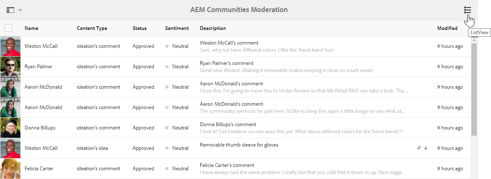

# AEM Communities發行說明{#aem-communities-release-notes}

閱讀自6.4版以來對AEM Communities的改進。 若要進一步瞭解新功能，請參閱 [AEM 6.5 Communities使用指南](https://helpx.adobe.com/experience-manager/6-4/communities/user-guide.html)。

若要取得最新版本，請參閱文 [件的「部署社群](https://helpx.adobe.com/in/experience-manager/6-4/help/communities/deploy-communities.html#LatestReleases) 」區段。

## 主要增強功能 {#major-enhancements}

### 增強社群參與 {#enhancements-to-community-engagement}

**@Mentions support** AEM Communities現在允許註冊使用者在「使用者產生的內容」中標籤（提及）其他已註冊的會員，以吸引其注意。 接著會通知標籤（提及的）成員，並包含對應使用者產生內容的深層連結。 不過，使用者可以選擇停用／啟用網頁和電子郵件通知。

社群使用者不需搜尋其名字、姓氏或使用者名稱，即可查看是否有人與他們聯絡或需要他們注意。 此外，它允許UGC作者向能夠最好地解決問題並添加投入的特定註冊用戶尋求回應。

社群管理員需要**在社群元件上啟用提及**，讓已註冊的使用者能夠使用這些元件的功能。

**群組訊息**

已註冊的社群成員現在可以透過單一電子郵件組合大量傳送直接訊息給群組，而不是個別傳送相同的訊息給群組成員。 要允許 [組消息](/help/communities/configure-messaging.md)，請啟用兩個 [消息操作服務實例](/help/communities/messaging.md#group-messaging)。

### 大量協調的增強功能 {#enhancements-to-bulk-moderation}

大量協調中的自訂篩選

[自訂篩選](/help/communities/moderation.md#custom-filters) ，現在可以開發並新增至「大量協調UI」。

Github中 [提供示範](https://github.com/Adobe-Marketing-Cloud/aem-communities-extensions/tree/master/aem-communities-moderation-filter) ，示範透過標籤篩選的范 [例專案](https://github.com/Adobe-Marketing-Cloud/aem-communities-extensions/tree/master/aem-communities-moderation-filter)。 此專案可做為開發類似自訂篩選器的基礎。

**大量協調中的清單檢視**

已在大量協調中提供具有改良UI的新清單檢視，以顯示「使用者產生的內容」項目。

### 網站和群組管理的增強功能 {#enhancements-to-site-and-group-management}

**作者端網站和群組管理員**

社群，AEM 6.5以後，可讓不同社群網站和群組／巢狀群組分散管理（和管理）。 托管多個社群網站和巢狀群組的組織現在可以在建立網站（和群組）時，為作者端的管理員角色選擇成員。

網站管理員可以在任何階層層級建立群組，成為預設管理員。 這些管理員稍後可由其他群組管理員移除。 群組管理員可以管理其群組G1，並建立G1下巢狀的子群組。

### 啟用增強功能 {#enhancements-to-enablement}

**SCORM 2017.1支援**

AEM 6.5 Communities的啟用功能支援可分享的內容物件參考模型(Shareable Content Object Reference Model, SCORM)2017.1  引擎。

**AEM Communities中的鍵盤導覽支援啟用元件**AEM Communities中的啟用元件（例如目錄和課程播放、作業、檔案庫）支援鍵盤導覽，以改善協助工具。

### 其他增強功能 {#other-enhancements}

* **Solr 7支援**AEM 6.5社群支援Apache Solr 7.0版的搜尋平台，同時設定MSRP和DSRP。
