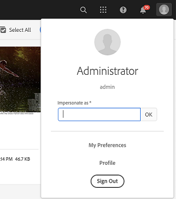

# 先前Service Pack中包含的Hotfix和Feature Pack {#hotfixes-and-feature-packs-included-in-previous-service-packs}

## [!DNL Adobe Experience Manager] 6.5.10.0 {#experience-manager-65100}

[!DNL Adobe Experience Manager] 6.5.10.0包含自2019年4月發行6.5版以來所發行的新功能、客戶要求的重要增強功能，以及效能、穩定性和安全性等改善項目。 Service Pack安裝在 [!DNL Adobe Experience Manager] 6.5。

中推出的主要功能和增強功能 [!DNL Adobe Experience Manager] 6.5.10.0為：

* **增強功能 [!DNL Content Fragment] 模型與編輯器**:您現在可以使用巢狀內容，為結構化內容建立複雜的自訂模型 [!DNL Content Fragment] 模型。 內容結構被模組化為基本元素，這些基本元素被建模為子片段。 較高層級片段會參考這些子片段。 進階驗證規則等更多資料類型增強功能，可進一步增強內容模型的彈性，具有 [!DNL Content Fragments]. 此 [!DNL Experience Manager] [!DNL Content Fragment] 編輯器支援通用編輯器工作階段中的巢狀片段結構，並增強功能，例如結構樹檢視和透過片段階層的標籤式階層連結導覽。

* **GraphQL API，適用於[!DNL Content Fragments]**:全新的GraphQL API是以JSON格式傳送結構化內容的標準方法。 GraphQL查詢可讓用戶端僅要求相關內容項目來呈現體驗。 這種選擇消除了需要在用戶端剖析內容的內容過傳送（在HTTP REST API中可能）。 GraphQL結構衍生自 [!DNL Content Fragment] 模型和API回應會以JSON格式產生。 在 [!DNL Experience Manager] as a [!DNL Cloud Service], [GraphQL查詢持續存在](https://experienceleague.adobe.com/docs/experience-manager-cloud-service/assets/admin/graphql-api-content-fragments.html#persisted-queries-caching) 和處理快取友好GET請求。 在 [!DNL Experience Manager] 6.5.10.0。

* **GraphQL API，適用於[!DNL Content Fragments]**:為了支援GraphQL API，「內容片段模型屬性」欄位中不再允許使用連字型大小。 如果任何「內容片段模型」屬性名稱中都存在連字型大小，GraphQL查詢可能會傳回不想要的結果。
屬性名稱僅允許使用下列字元：A-Za-z0-9_。 數字不能位於第一個位置。

* **階層管理與未來預覽**:使用者現在有介面可存取其內容結構 [!DNL Experience Manager] 啟動，包括在啟動中新增和移除頁面的功能。 此功能增強了 [!DNL Experience Manager] 啟動以製作鎖定於未來發佈的內容版本。 [時間扭曲功能](/help/sites-authoring/working-with-page-versions.md#timewarp) 可讓使用者將啟動預覽為未來的內容狀態。

* **連線資產**: [!DNL Experience Manager] 延伸 [!DNL Connected Assets] 功能以使用 [!DNL Dynamic Media] 影像。 請參閱 [使用連線資產](/help/assets/use-assets-across-connected-assets-instances.md).

* **連結共用選項以下載資產或轉譯**:將資產和集合共用為連結時，使用者可以選擇是否允許下載原始資產或其轉譯，或是同時使用共用連結。 此外，透過連結下載與他們共用之資產的使用者也可以選擇只下載原始資產、僅下載轉譯或兩者。

* **限制產生的子資產**:管理員可以限制 [!DNL Experience Manager] 為複合資產(如PDF、PowerPoint、InDesign和Keynote檔案)生成。 請參閱 [管理複合資產](/help/assets/managing-linked-subassets.md#generate-subassets).

* **Camera Raw支援**:新 [!DNL Camera Raw] 套件可支援 [!DNL Adobe Camera Raw] v10.4。見 [使用 [!DNL Camera Raw]](/help/assets/camera-raw.md).

* 內建存放庫(Apache Jackrabbit Oak)更新至1.22.8。

* **協助工具增強功能**:

   * [!DNL Dynamic Media] 為檢視器提供許多協助工具增強功能。 請參閱 [[!DNL Dynamic Media] 更新](#dynamic-media-65100).

   * Platform提供幾項協助工具增強功能。 請參閱 [平台更新](#platform-65100).

* **使用者體驗增強功能**:

   * [!DNL Experience Manager] 直接在資料夾下顯示所有內容模型的清單，內容作者不必瀏覽檔案結構。 此功能現在需要的點按次數更少，而且可改善製作效率。

   * 路徑欄位 [!DNL Sites] 編輯器可讓作者從 [!DNL Content Finder].

* 新增 `GuideBridge#getGuidePath` API [!DNL AEM Forms].

* 您現在可以使用Automated forms conversion服務 [以法文、德文、西班牙文、義大利文和葡萄牙文轉換PDF forms](https://experienceleague.adobe.com/docs/aem-forms-automated-conversion-service/using/extending-the-default-meta-model.html#language-specific-meta-model) 最適化表單。

* **屬性瀏覽器中的錯誤訊息**:已針對適用性Forms屬性瀏覽器中的每個屬性新增錯誤訊息。 這些訊息有助於了解欄位的允許值。

* **支援使用常值選項來設定JSON類型變數的值**:您可以在AEM工作流程的設定變數步驟中使用文字選項來設定JSON類型變數的值。 文字選項可讓您以字串的形式指定JSON。

* [平台更新](../forms/using/aem-forms-jee-supported-platforms.md): [!DNL Adobe Experience Manager Forms] on JEE已新增對下列平台的支援：
   * [!DNL Adobe Acrobat 2020]
   * [!DNL Ubuntu 20.04]
   * [!DNL Open Office 4.1.10]
   * [!DNL Microsoft Office 2019]
   * [!DNL Microsoft Windows Server 2019]
   * [!DNL RHEL8]

如需中推出的所有功能和增強功能的清單，請參閱 [!DNL Experience Manager] 6.5.10.0，見 [新增功能 [!DNL Adobe Experience Manager] 6.5 Service Pack 10](new-features-latest-service-pack.md).

以下是中提供的修正清單 [!DNL Experience Manager] 6.5.10.0版。

### [!DNL Sites] {#sites-65100}

* 輸入 **[!UICONTROL 預設值]** 欄位 **[!UICONTROL 屬性]** (NPR-36992)。

* 篩選時 [!DNL Content Fragment] 模型， [!DNL Experience Manager] 搜索返回所有節點 `cq:Template` 而非僅傳迴路徑和節點 [!DNL Content Fragment] 型號(SITES-1453)。
* [!DNL Content Fragments] 傳回 `null` 作為資料夾的狀態(SITES-1157)。
* [!DNL Experience Manager] 不讓使用者停用和啟用 [!DNL Content Fragment] 型號(SITES-1088)。
* 使用者移動、重新命名或刪除 [!DNL Content Fragments] 或媒體資產，參考 [!DNL Content Fragments] 不會自動更新(SITES-196)。
* 將元件從一個頁面貼到另一個頁面會產生JavaScript錯誤(NPR-37030)。
* 快速檢視頁面屬性時，會開啟不同頁面的頁面屬性(NPR-37025)。
* 內容片段可讓內容片段參考本身。 選擇器不支援操作(NPR-36993)。
* 升級至Service Pack 9後，某些使用者無法移動Experience Manager中的資料夾，且在記錄中看到錯誤(SITES-1481)。
* 在編輯模式下調整版面容器中元件的寬度時，發現忽隱忽現的情況(NPR-36961)。
* 促銷啟動時，促銷的啟動中的變更會雙重推出至其他啟動。 如果使用者促銷雙重推出的啟動，來源頁面上會反映雙重內容(NPR-36893)。
* [!DNL Experience Manager] 如果您使用「影像核心元件」將影像新增至頁面，或使用Foundation Image元件調整大小，則會為某些PNG影像新增灰色邊框，且具有透明度(NPR-36879)。
* [!DNL Experience Manager Sites] 管理員UI含有大量範本，導覽速度緩慢(NPR-36870)。
* 升級到Service Pack 9會阻止編寫一些元件。 此問題不允許 [!DNL Sites] 建立新頁面的使用者(NPR-36857)。
* 此 `ContextHubImpl` 方法建立 `ResourceResolver` 沒有關閉。 這會導致有關長時間執行的警告訊息 `ResourceResolver` 而服務有時會傳回非預期的結果(NPR-36853)。
* 從Blueprint頁面屬性同步單一即時副本時，所有其他即時副本也會同步(NPR-36829、NPR-36522)。
* 只使用XLS MIME類型時，檔案上傳函式無法如預期運作(NPR-36785)。
* 帶有帕斯卡大小寫和所有大寫字詞的新標籤不會顯示在 [!DNL Content Fragments] (NPR-36742)。
* 新增 [!DNL Content Fragment] 導致文字遺失，並產生與清單和巢狀清單相關的奇數格式(NPR-36565)。
* 當作者註解頁面上的任何元件、刪除元件並對刪除操作執行還原時，嘗試在網站主控台中檢視頁面的時間軸資料時，會發生錯誤(NPR-36528)。
* 頁面屬性大量編輯器的 [!UICONTROL 儲存並關閉] 選項會儲存變更但不會關閉編輯器(NPR-36527)。
* 當使用者嘗試將新的文字元件拖放至頁面時，元件會立即消失(NPR-36442)。
* 當使用者在包含空格的隨需標籤中輸入內容時（系統上不存在的標籤），按下Enter鍵，標籤就會顯示在欄位下。 但若 [!DNL Content Fragment] 儲存並重新開啟，不會顯示隨選標籤(NPR-36441)。
* 透過Dispatcher存取執行個體時，無法刪除範本(NPR-36385)。
* 移動頁面時，需要手動重新整理瀏覽器，才能轉譯變更(NPR-36381)。
* 選取元件時，您可以按Ctrl+X或Ctrl+C(以及Mac上的Command+X或Command+C)來剪下或複製元件。 按一下其他元件時，您可以貼上工具列，但無法貼上鍵盤（Ctrl+V或Command+V）(NPR-36379)。
* 當使用者嘗試使用剪刀圖示將元件移至其他位置時，會發生主控台錯誤。 此外，在貼上單一元件時會移動(NPR-36378)。
* [!DNL Experience Manager] 在WCM或通知上有沒有索引的查詢，會降低效能(NPR-36303)。
* 當作者還原已刪除繼承元件的繼承時，可用選項是同步所有頁面內容。 即使繼承僅還原於一個元件，內容作者仍須同步完成的頁面。 完全同步可能會導致不想要的內容同步(NPR-34456、CQ-4310183)。
* 製作例項上元件的即時使用不會顯示所有發生次數。 某些元件用於超過1000個頁面，但報表只會顯示約40個頁面(CQ-4323724)。
* 當網站結構中有許多子頁面時，在欄檢視中載入子頁面的Experience Manager6.5.8比Experience Manager6.4.8.2(CQ-4322766)需要更多時間。
* 在「轉出頁面」選項上取消勾選「全部」無法運作(NPR-37070)。
* 開啟現有的v3元件版本頁面時，頁面屬性對話方塊不會開啟，且 `NullPointerException` 已記錄(SITES-1830)。

### [!DNL Assets] {#assets-65100}

已在 [!DNL Assets]:

* 屬性的值 `jcr:title` 移動資料夾後，不會在Publish例項上更新。 在作者中重新命名和重新發佈資料夾不會更新 `jcr:title` 發佈執行個體中相同的屬性值(NPR-36369)。

* 如果選取兩個或多個資產並編輯一個或多個中繼資料欄位，儲存作業會在Safari瀏覽器中失敗，錯誤代碼為500(NPR-36413)。

* 由於日期格式錯誤，大量中繼資料匯入失敗(NPR-36428)。

* 當在 [!UICONTROL 屬性] 頁面更新中繼資料時，當結構提供許多選項時介面回應速度緩慢(NPR-36430)。

* 使用 [!UICONTROL 到期狀態] 述詞無法運作(NPR-36436)。

* 中各欄位的快顯功能表 [!UICONTROL 資料夾中繼資料] 屬性不會顯示最後選取的值(NPR-36937、CQ-4314429)。

* 搜索檔案和資料夾時，如果用戶應用了篩選器並選擇 [!UICONTROL 檔案和資料夾]，只會顯示檔案，但不會顯示資料夾(CQ-4319543、NPR-36627)。

* 從資料夾內選取相同集合，以及從搜尋結果選取集合時，工具列選項不同(NPR-36620)。

* 此 [!UICONTROL 快速發佈] 選項在搜尋結果頁面上無法使用(NPR-36904、CQ-4317748)。

* 使用者在未指定副檔名的情況下建立資產的即時副本時，下載後即時副本檔案無法使用(NPR-36903、CQ-4326305)。

* 將用戶添加為子資料夾的所有者時，用戶也獲得其父資料夾的所有者權限，因此也獲得父資料夾的其他子資料夾的所有者權限。 此外，嘗試移除時，不會將使用者移除為父資料夾的擁有者。 (NPR-36801、CQ-4323737)。

* [!DNL Experience Manager] 嘗試為複合資產（如PowerPoint演示文稿）建立子資產時，會產生記憶體不足的例外狀況(NPR-36668)。

* 當使用者移動已在已發佈網站頁面中使用的資產時，即使未選取發佈選項，網站頁面仍會再次發佈(NPR-36636、CQ-4323500)。

* 使用Apache Tika MIME類型偵測功能時，會使用 `AssetManager.createAsset` 方法保留名為的臨時檔案 `apache-tika-*.tmp` 檔案。 此臨時檔案使用所有可用的可用磁碟空間(NPR-36545)。

* 所有受DRM保護的資產都會下載，且使用者不會選擇下載特定資產(CQ-4327422)。

* 無法將資產拖曳至 `pathfield` (NPR-36849)。

* 在欄檢視中選取資產時，資產詳細資訊面板會消失(NPR-36667)。

### [!DNL Dynamic Media] {#dynamic-media-65100}

**協助工具增強功能**

下列協助工具增強功能適用於 [!DNL Dynamic Media Viewers].

* 螢幕助讀程式現在會提供旁白，說明預留位置文字以供搜尋，並新增電子郵件地址作為共用資產作為連結對話方塊的必要欄位，同時也會朗讀 [!UICONTROL 請填寫此欄位] 工具提示(CQ-4327761)。

* 螢幕助讀程式現在會正確提供 [!UICONTROL 影像預設集編輯器] 使用鍵盤存取使用者介面欄位時(CQ-4325677)。

* 鍵盤焦點現在可適當移至的搜尋標籤 [!UICONTROL 檢視器預設集] 對話框， [!UICONTROL 多媒體類型] 選項(CQ-4324736)。

* 使用鍵盤鍵在表單模式中導覽時，螢幕助讀程式會提供與上的遞增和遞減選項對應的標籤旁白 [!UICONTROL 建立] 標籤 [!UICONTROL 影像預設集] (CQ-4323900)。

* 螢幕助讀程式現在會宣佈 [!UICONTROL 搜尋及新增電子郵件地址] 選項(CQ-4323352)。

* 使用鍵盤鍵導覽資產時，工具列上會保留鍵盤焦點(CQ-4322037)。

* 螢幕助讀程式現在會提供新增的旁白 [!UICONTROL 編輯] 欄位資訊 [!UICONTROL 新增裁切] 選項 [!UICONTROL 回應式影像裁切] on [!UICONTROL 編輯影像處理設定檔] 第(CQ-4290734)頁。

* 開啟 [!UICONTROL 編輯影像預設集] 和 [!UICONTROL 建立互動式影片] 頁面時，螢幕助讀程式現在會在使用標題鍵盤快速鍵(CQ-4290730)(CQ-4290701)導覽頁面時適當地朗讀頁面標題。

* 現在，在導覽下列頁面時，螢幕助讀程式可以使用里程碑和區域快捷鍵，來識別螢幕的各個區域（例如右面板區域、左面板、動作工具列、檢視器工具列地標和可縮放的影像地標）。

   * [!UICONTROL 檢視器預設集編輯器] (CQ-4290729)

   * [!UICONTROL 影像集編輯器] (CQ-4290710)

   * [!UICONTROL 建立互動式影片] (CQ-4290702)。

* 使用向下鍵導覽時，螢幕助讀程式現在會朗讀視訊影格中的共用選項名稱(CQ-4290728)。

* 螢幕助讀程式現在會提供 [!UICONTROL Sprite] 和 [!UICONTROL 背景] 標籤 [!UICONTROL 外觀] 標籤 [!UICONTROL 檢視器預設集編輯器] (CQ-4290727)。

* 必填欄位，例如要編輯的欄位 [!UICONTROL 寬度]，在 [!UICONTROL 基本] 標籤 [!UICONTROL 編輯視訊編碼] 頁面現在有星號符號(*)(CQ-4290725)。

* 螢幕助讀程式現在會朗讀 [!UICONTROL 影像設定檔] 第(CQ-4290723)頁。

* Windows使用者現在可以在上導覽至展開的CSS編輯器外 [!UICONTROL 檢視器預設集編輯器] 時(CQ-4290720)。

* 開啟 [!UICONTROL 基本] 標籤 [!UICONTROL 編輯影像預設集] 在表單模式中導覽時，螢幕助讀程式現在會提供各種編輯欄位和選項的標籤旁白(CQ-4290717)。

* 螢幕助讀程式現在會在資產詳細資訊頁面的左側導覽中，提供角色和狀態（選取或未選取）的旁白，以供使用者介面選項使用(CQ-4290709)。

* 螢幕助讀程式現在會正確提供狀態旁白（已選取或未選取），而影像的連結會切換至 [!UICONTROL 內容] 標籤 [!UICONTROL 建立互動式影片] 第(CQ-4290707)頁。

* 使用向下鍵導覽時，螢幕助讀程式現在會正確提供視訊時間軸縮放中各區段的名稱、角色和狀態旁白 [!UICONTROL 建立互動式影片] 第(CQ-4290706)頁。

* 螢幕助讀程式現在會在導覽中的選項時，提供名稱、角色和預設狀態（選取或未選取）及屬性的旁白 [!UICONTROL 建立互動式影片] 第(CQ-4290704)頁。

* 螢幕助讀程式現在會提供旁白，說明 [!UICONTROL 所有資產] 和 [!UICONTROL 所有集合] 選項 [!UICONTROL 發佈] 第(CQ-4290705)頁。

* 上傳不支援的視訊格式（MP4除外）時， [!UICONTROL 建立互動式影片] 頁面、Experience Manager顯示並朗讀錯誤訊息(CQ-4290700)。

* 時間軸中數字的對比（以秒為單位） [!UICONTROL 建立互動式影片] 頁面現在符合最低的明度比例，因此對顏色有限的使用者可輕鬆閱讀(CQ-4290699)。

* 螢幕助讀程式現在會朗讀 [!UICONTROL 產品名稱] 欄位 [!UICONTROL 建立互動式影片] 第(CQ-4290697)頁。

**已修正的問題**

下列錯誤修正適用於 [!DNL Dynamic Media].

* 上傳的影片至 [!DNL Experience Manager] 顯示 `Process failed` after `dynamicmedia_scene7` 執行模式已啟用且同步已停用(CQ-4327791)。

### 平台 {#platform-65100}

此Service Pack提供下列增強功能：

* 當使用者在樹狀檢視中選取項目時，螢幕助讀程式會宣佈選取項目，而頂端會顯示工具列選項(NPR-36504)。
* 有些文字和控制項名稱較容易閱讀，因為明度比符合4.5:1的最低需求比率(NPR-36503)。
* 使用者使用日曆控制項時，螢幕助讀程式會提供描述性日期、月份和工作日資訊的旁白。 使用者使用日曆快捷鍵時，螢幕助讀程式會提供日期、月份和年份變更的旁白(NPR-36498)。
* 提供執行自訂JavaScript的支援 `Clientlibs` 使用ECMAScript 6功能，而不遵循嚴格模式。 具體來說， `emitUseStrict` 旗標會新增至 `GCCScriptProcessor` (NPR-36411)。

下列錯誤修正是此Service Pack的一部分：

* 自訂健全狀態檢查的執行頻率比排程的更高(NPR-36985)。
* 此 `Resourceresolver map` 方法針對別名頁面傳回錯誤的結果(NPR-36767)。
* [!DNL Experience Manager] 啟動因載入工作流程而延遲(NPR-36615)。

### Integrations {#integrations-65100}

* 當主要MongoDB節點切換至其他節點時，Experience Manager會停止回應(NPR-36566)。
* [!DNL Sling content distribution] 執行收整合員刪除操作時失敗(NPR-36521、CQ-4323578)。

### 使用者介面 {#user-interface-65100}

* 此 **[!UICONTROL 參考]** 側面板不會顯示資產和網站參考(GRANITE-35078、GRANITE-34892)。

### 翻譯專案 {#translation-65100}

* 刪除多翻譯專案語言副本中的額外子頁面(NPR-36622)。

### 工作流程 {#workflow-65100}

* 如果伺服器收到不在辦公室的訊息，則會回報記憶體警報並停止回應(NPR-36768)。

### [!DNL Communities] {#communities-65100}

* 在中開啟社群網站頁面 `LoggedIn` 匿名訪客使用者的狀態(NPR-36908)。

* 當 **[!UICONTROL 社群]** > **[!UICONTROL 構想]** > **[!UICONTROL 註解]** 頁面，頁面導覽無法運作(NPR-36541)。

<!--
Need to verify with Engineering, the status is currently showing as Resolved
-->


<!--
### [!DNL Brand Portal] {#brandportal-65100}

*
-->

### [!DNL Forms] {#forms-65100}


>[!NOTE]
>
>* [!DNL Experience Manager Forms] 會在預定的 [!DNL Experience Manager] Service Pack 發行日期一週後發行附加元件的套件。


[!DNL AEM 6.5.10.0 Forms] 包含下列錯誤修正：

* 安裝時 [!DNL AEM 6.5 Forms]，會自動安裝下列第三方程式庫(CQDOC-18373):
   * [!DNL Microsoft Visual C++ 2008 Service Pack 1 (x86)]
   * [!DNL Microsoft Visual C++ 2010 Service Pack 1 (x86)]

**調適型表單**

* 如果適用性表單中欄位值的驗證成功， [!DNL AEM Forms] 無法叫用表單資料模型(CQ-4325491)。

* 在翻譯專案中新增語言字典，然後開啟專案時， [!DNL AEM Forms] 顯示錯誤訊息(CQ-4324933):

   ```TXT
   Uncaught TypeError: Cannot read property 'PROJECT_LISTING_PATH' of undefined
   at openButtonClickHandler (clientlibs.js:245)
   at HTMLButtonElement.onclick (clientlibs.js:258)
   ```

* 安裝後出現效能問題 [!DNL AEM Forms] Service Pack 7(CQ-4326828)。

**通信管理**

* 在 [!UICONTROL 資料] 標籤以及HTML信函預覽(NPR-37020)。

* 編輯文字檔案片段時，儲存片段後新字詞會顯示為HTML標籤(NPR-36837)。

* 無法檢視另存為草稿的信函(NPR-36816)。

* 當您編輯文字檔案片段並預覽信函時，AEM Forms會在HTML信函預覽中顯示運算式語言(CQ-4322331)。

* 使用自助信函範本轉譯資料時發生問題(NPR-37161)。


**互動式通訊**

* 編輯文字檔案片段後，每次您列印預覽互動式通訊時，索引標籤字元會在兩個字之間重複(NPR-37021)。

* [!DNL AEM Forms] 儲存超過最大大小限制的文字檔案片段時顯示錯誤(NPR-36874)。

* 將影像新增至互動式通訊時，影像後面會顯示另一個空白區塊(NPR-36659)。

* 在編輯器中選取所有文字時，無法將字型文字變更為Arial(NPR-36646)。

* 在編輯器中建立URL並預覽變更時，畫面會顯示黑色背景，而非URL文字(NPR-36640)。

* 將文字複製並貼到編輯器時，針對檔案中可用的項目符號將字型變更為Arial時會發生問題(NPR-36628)。

* 文字編輯器中的項目符號縮排問題(NPR-36513)。

**設計工具**

* 螢幕Reader無法讀取動態PDF中，置於主版頁面或子表單頁面文字標籤內的浮動欄位資料(CQ-4321587)。

**文件服務**

* 將XDP檔案轉換為PDF檔案，然後組合產生的PDF時，PDF層代會失敗，並顯示下列錯誤訊息：

   ```TXT
   Caused by: com.adobe.fd.assembler.client.AssemblerException$ClientException: Document is in a disposed state!
   ```

**表單工作流程**

* 升級至AEM Forms Service Pack 8後，無法將表單提交至Workbench程式(CQ-4325846)。

**HTML5 Forms**

* 當您為 `mfAllowAttachments` 屬性為 `True` 在CRX DE存放庫中， `dataXml` 提交HTML5表單時損毀(NPR-37035)。

* 將XDP呈現為HTML時，請使用 `dataXml`, [!DNL AEM Forms] 顯示 `Page Unresponsive` 錯誤(NPR-36631)。

### 商務 {#commerce-65100}

* 中的值 **[!UICONTROL 發佈者]** 欄檢視中顯示的欄位不正確(NPR-36902)。
* 推出目錄時，新產品未正確標示為修改的產品(NPR-36666)。
* 當您重新建立已刪除的產品時，不會重新建立產品頁面(NPR-36665)。
* 已修改的頁面已更新，但目錄轉出時沒有更新對應的連結產品(CQ-4321409、NPR-36422)。
* 此 **[!UICONTROL 稍後發佈]** 和 **[!UICONTROL 稍後取消發佈]** 工作流程無法運作(CQ-4327679)。

如需安全性更新的詳細資訊，請參閱 [[!DNL Experience Manager] 安全性佈告欄頁面](https://helpx.adobe.com/security/products/experience-manager.html).

## Experience Manager6.5.10.0中的已知問題 {#known-issues}

* As [!DNL Microsoft Windows Server 2019] 不支援 [!DNL MySQL 5.7] 和 [!DNL JBoss EAP 7.1], [!DNL Microsoft Windows Server 2019] 不支援全包安裝 [!DNL AEM Forms 6.5.10.0].

* 如果您要升級 [!DNL Experience Manager] 執行個體(從6.5版到6.5.10.0版)，您可以檢視 `RRD4JReporter` 例外 `error.log` 檔案。 若要解決問題，請重新啟動執行個體。

* 如果您安裝 [!DNL Experience Manager] 6.5 Service Pack 10或上一個Service Pack [!DNL Experience Manager] 6.5，資產自訂工作流程模型的執行階段副本(在 `/var/workflow/models/dam`)。
若要擷取執行階段副本，Adobe建議使用HTTP API，將自訂工作流程模型的設計時間副本與其執行階段副本同步：
   `<designModelPath>/jcr:content.generate.json`。

* 使用者可以在 [!DNL Assets] 並將巢狀資料夾發佈至 [!DNL Brand Portal]. 不過，資料夾的標題不會在 [!DNL Brand Portal] 直到重新發佈根資料夾為止。

* 當使用者首次選取以最適化表單設定欄位時，「屬性瀏覽器」中不會顯示儲存設定的選項。 在相同編輯器中選取以設定最適化表單的其他一些欄位，即可解決問題。

* 安裝Experience Manager6.5.x.x期間可能會顯示下列錯誤和警告訊息：
   * 「使用Target Standard API（IMS驗證）在Experience Manager中設定Adobe Target整合時，將體驗片段匯出至Target會導致建立錯誤的選件類型。 Target會建立數個具有「HTML」/來源「Adobe Target Classic」類型的選件，而非「體驗片段」/來源「Adobe Experience Manager」。
   * `com.adobe.granite.maintenance.impl.TaskScheduler`:在granite/operations/maintenance找不到維護窗口。
   * 使用SUM、MAX和MIN等匯總函式時(CQ-4274424)，適用性表單伺服器端驗證會失敗。
   * `com.adobe.granite.maintenance.impl.TaskScheduler`  — 在granite/operations/maintenance處找不到維護窗口。
   * 透過Shopbable Banner檢視器預覽資產時，Dynamic Media互動式影像中的熱點不會顯示。
   * `com.adobe.cq.social.cq-social-jcr-provider bundle com.adobe.cq.social.cq-social-jcr-provider:1.3.5 (395)[com.adobe.cq.social.provider.jcr.impl.SpiSocialJcrResourceProviderImpl(2302)]` :等待登錄更改完成解除登錄的超時。

## [!DNL Adobe Experience Manager] 6.5.9.0 {#experience-manager-6590}

[!DNL Adobe Experience Manager] 6.5.9.0包含自2019年4月發行6.5版以來所推出的新功能、客戶要求的重要增強功能，以及效能、穩定性和安全性等改善項目。 Service Pack安裝在 [!DNL Adobe Experience Manager] 6.5。

中推出的主要功能和增強功能 [!DNL Adobe Experience Manager] 6.5.9.0包括：

* [!DNL Experience Manager Sites] Dynamic Media Foundation元件現在可讓您在使用回應式影像預設集或智慧型裁切時，開啟或關閉高解析度裝置的最佳化。

* 為了改善效能， `hidden=false` 條件從JCR查詢移至 [!UICONTROL QueryBuilder] 求值器。 若要確認變更後隱藏的述詞是否運作正常， [!DNL Experience Manager] 檢查是否未顯示任何隱藏資料夾。

* 能夠還原 [!DNL Experience Manager Sites] 頁面。

* 支援新使用者使用郵件程式設定服務的重新整理Token來重新整理存取Token。

* [支援SMTP XOAUTH2](/help/sites-administering/notification.md#setting-up-oauth) 郵件設定服務的機制。

* 支援 [!DNL MongoDB] 版本4.2和4.4。

* 根據中國地區和地區的新命名慣例，會更新與香港、澳門和台灣相關的名稱出現次數。

* 無障礙增強功能(位於 [!DNL Experience Manager] [[!DNL Assets]](#assets-accessibility-6590) 和 [[!DNL Dynamic Media]](#accessibility-dm-6590).

* 智慧影像處理DPR（設備像素比率）和網路頻寬最佳化可讓您高效地提供最佳品質影像；在具有高解析度顯示器且網路頻寬受限的設備上。 如需詳細資訊和時間表，請參閱 [智慧型影像常見問題集](/help/assets/imaging-faq.md).

* [!DNL Dynamic Media] 傳送(`fmt` URL修飾元)支援新一代影像格式AVIF（AV1影像格式）。 如需詳細資訊和時間表，請參閱 [影像提供與轉譯API fmt](https://experienceleague.adobe.com/docs/dynamic-media-developer-resources/image-serving-api/image-serving-api/http-protocol-reference/command-reference/r-is-http-fmt.html).

* 可使用 [!UICONTROL 分配任務] 工作流程步驟。

* 修改源互動式通信後檢索互動式通信草稿的功能。

* 設定自訂網域名稱，以在 [!DNL Experience Manager Forms].

* 的輸入資料增強功能 [!UICONTROL 調用表單資料模型服務] 工作流程步驟。

* 可在以下欄位中使用「記錄文檔」模板中的多個首頁： [!DNL Experience Manager Forms].

* 支援記錄檔中的分頁符(在 [!DNL Experience Manager Forms].

* 內建存放庫(Apache Jackrabbit Oak)更新至1.22.7。

如需中推出功能和增強功能的完整清單，請參閱 [!DNL Experience Manager] 6.5.9.0，見 [新增功能 [!DNL Adobe Experience Manager] 6.5 Service Pack 9](new-features-latest-service-pack.md).

>[!NOTE]
>
>從Service Pack 9開始， [!DNL Experience Manager] 客戶可開發及經營 [!DNL Experience Manager] 應用程式 [!DNL Azul Zulu] OpenJDK的構建，與Java™ SE相容。
>支援 [!DNL Azul Zulu] JDK也由Adobe提供給 [!DNL Experience Manager] 客戶。
>您可以下載 [!DNL Azul Zulu] 來自的JDK [Adobe軟體分發](https://experience.adobe.com/#/downloads/content/software-distribution/en/aem.html).
>oracleJava™技術的使用權(由Adobe分發)將於2022年12月底前到期。 [!DNL Experience Manager] 建議客戶規劃及實作 [!DNL Azul Zulu] 此日期之前最新的JDK。 如需關於 [!DNL Oracle Java™] 技術與 [!DNL Azul Zulu] 技術，請參閱 [常見問題集](https://experienceleague.adobe.com/docs/experience-manager-65/assets/adobe-azul-openjdk-license-agreement.pdf).

以下是中提供的修正清單 [!DNL Experience Manager] 6.5.9.0版。

### [!DNL Sites] {#sites-6590}

* 已啟用「驗證需求」屬性的已發佈頁面不會重新導向至登入頁面並傳回404錯誤訊息(NPR-36354)。

* 建立超連結時，文字元件中無法使用搜尋連結的選項(NPR-35849)。

* 遍歷查詢是在使用 `com.day.cq.wcm.commons.ReferenceSearch` API。 這會影響 [!DNL Experience Manager] 伺服器(NPR-36407)。

* 另一個已調整大小的配置容器內的巢狀配置容器顯示其子元件的列數不正確，導致這些元件與網格不對齊(NPR-36359)。

* 外部連結檢查程式將有效的外部連結顯示為無效連結(NPR-36289)。

* 顯示參考一段時間後，參考面板開始顯示錯誤訊息(NPR-36167)。

* 移動元件時，自動建立的parsys沒有 `sling:resourceType` node(NPR-36165)。

* 嘗試同步LiveCopy時（使用轉出設定時） [!UICONTROL 啟動Blueprint時啟動] 和 [!UICONTROL 在Blueprint啟動時停用])如果元件已在livecopy主版中刪除，同步會失敗，且 `NullPointerException` 已記錄(NPR-36127)。

* 當使用者輸入簡易文字標籤時（系統上不存在的標籤），按下Enter時，標籤會出現在欄位下方，但當內容片段儲存並重新開啟時，簡易標籤會消失(NPR-36132)。

* 收件匣沒有顯示非同步操作狀態的選項(NPR-36104)。

* 還原繼承後會建立重複的元件(NPR-36000)。

* 使用 `RemoteContentRenderingService`，向 `RemoteContentRendererRequestHandler.getRequest` 一律包含  `ComponentExporter`，但如果根模型未根據周遊深度和篩選選項設定包含要求的頁面，則不包含該頁面。 要求必須一律包含要求的頁面，讓SPA有足夠的資訊來轉譯回應(NPR-35961)。

* onTime/offTime項目不會在預期的onTime/offTime上啟用/停用(NPR-35936)。

* 發佈包含體驗片段的頁面時， `cq:lastModified` 屬性， a `NullPointerException` 發生(NPR-35914)。

* 嘗試在容器內調整元件大小時，無法將元件重新調整為原始大小。 元件容器大小縮小時，無法將大小設回原始容器(NPR-35809)。

* 在轉出對話方塊中，編輯器中或從即時副本概述中觸發，已分離、暫停或未建立頁面的狀態圖示錯誤(NPR-35691)。

* 多網站管理員主版的轉出頁面屬性忽略轉出頁面和子頁面核取方塊(NPR-35634)。

* 觸控式UI(CQ-4315352、CQ-4309415)缺少傳統UI中可用的還原樹功能。

* 在上還原繼承和轉出頁面時發生問題 [!DNL Experience Manager Sites] 第(NPR-36033)頁。

### [!DNL Assets] {#assets-6590}

下列是在 [!DNL Assets]:

* 若要檢視未根據 [!UICONTROL 建立], [!UICONTROL 修改]，或 [!UICONTROL 名稱] 參數， [!DNL Adobe Experience Manager] 選件a [!UICONTROL 無] 選項 [!UICONTROL 排序依據] 選項。 此 [!UICONTROL 無] 選項可確保「資產」使用者介面（在「卡片」、「欄」和「前瞻分析」檢視中）中的資產順序與JCR節點中的相同(NPR-36356)。

* 若要在ACP API回應中將電子郵件ID設為小寫，請從 [!DNL Adobe Experience Manager] 導入了可選設定；作為 [!DNL Adobe Asset Link] 如果使用者的ID並非全部字元皆為小寫，則無法簽入資產。 此 [!DNL Adobe Asset Link] 面板會從中取用ACP API響應 [!DNL Adobe Experience Manager] (CQ-4317704)。

下列協助工具增強功能適用於 [!DNL Assets] 作為service pack 9的一部分：

改善下列文字和表徵圖的對比度（與背景），以便視力和顏色感知受限的用戶能夠理解：

* 上的資產標題 [!UICONTROL 屬性] 第(NPR-35967)頁。
* 星級評等圖示，位於 [!UICONTROL 評等] 各地的分區(NPR-36009)。
* 資產和資料夾卡片檢視的文字(NPR-35966)。
* 上的預留位置文字 [!UICONTROL 時間表] 檢視(NPR-35965)。
* 資產搜尋結果上的資產名稱(NPR-35964)。
* 上的預留位置文字 [!UICONTROL 連結共用] 對話(NPR-35963)。
* [!UICONTROL 中繼資料], [!UICONTROL 狀態]，和 [!UICONTROL 其他] 文字 [!UICONTROL 清單] 選項 [!UICONTROL 檢視設定] 對話(NPR-35910)。
* [!UICONTROL 位置] 和 [!UICONTROL 要搜索的類型] 全局搜索中的佔位符文本(NPR-35909)。
* 展開和折疊下的圖示 [!UICONTROL 內容樹] (NPR-35908)。
* 此 [!UICONTROL 資產] 在顯示資產資料夾的頁面上顯示文字(NPR-35905)。
* 中的文字 [!UICONTROL 資產中繼資料], [!UICONTROL 使用情況統計資料] with [!UICONTROL 概述] 選項(NPR-35904)。
* 快捷鍵的文本 [!UICONTROL 屬性] 和 [!UICONTROL 編輯] 資產詳細資訊頁面中的選項(NPR-35904)。

下列錯誤修正適用於 [!DNL Assets] 作為service pack 9的一部分：

* 從 [!UICONTROL 資料夾中繼資料結構] 未儲存表單(NPR-36119)。

* 當使用小橢圓來注釋資產時，橢圓與打印版本中的注釋數重疊(NPR-36114)。

* 有時候，在欄的視圖中， [!DNL Experience Manager] 上傳重複資產時，不會提示出現重複資產衝突(NPR-36048)。

* 如果「共用連結」對話方塊已開啟且未變更，按一下關閉按鈕就不會關閉(NPR-36030)。

* 選取多個資產以更新屬性時，有時會發生錯誤，或取消選取資產的屬性被更新(NPR-36002)。

* 當資產上傳時，資產檔案名稱的開頭或結尾新增了空格，其餘字元與存放庫中現有資產的名稱相同，現有資產會取代而未記錄任何錯誤(NPR-36001)。

* 在資產詳細資訊頁面中播放視訊時，播放和暫停選項無法運作(NPR-35999)。

* 大量取消發佈資產時，Brand Portal會產生錯誤，指出請求URI太長(NPR-35954)。

* 打印具有長注釋文本的資產時，即使空間可用，也會修剪注釋文本(NPR-35948)。

* 在「建立目錄」頁面的「選取範本」檢視上選取頁面時，系統會停用移至下一頁的選項(CQ-4315462)。

* 視訊資產上啟動更新資產工作流程時，頁面會重複重新整理(CQ-4313375)。

* 無法刪除或移動DAM資料夾，且會記錄例外狀況(NPR-35942)。

### [!DNL Dynamic Media] {#dynamic-media-6590}

在 [!DNL Adobe Experience Manager] 6.5.9.0中提供下列協助工具增強功能 [!DNL Dynamic Media]:

* 當您在中使用鍵盤鍵開啟對話方塊以新增資產時， [!UICONTROL 影像集] 編輯器：
   * 螢幕助讀程式會提供對話方塊已開啟的旁白。
   * 鍵盤焦點在開啟時移至對話方塊。
   * 對話方塊關閉時，鍵盤焦點會移回「新增資產」選項(CQ-4312134)。

* 您現在可以使用熱點編輯器中的鍵盤鍵來新增及編輯資產上的熱點(CQ-4305965)。

* 您現在可以使用鍵盤鍵，透過熱點管理將超連結置於熱點上。 螢幕助讀程式焦點現在會移至欄位以編輯URL路徑，並選擇開啟選取對話方塊(CQ-4290735)。

* 改善影像集編輯器頁面上文字和控制項的對比（與背景），以便視力和顏色感知受限的使用者能夠理解(CQ-4290733)。

* 您現在可以導覽至檢視器預設集編輯器上的資產共用選項，並使用鍵盤鍵收合展開的共用選項(CQ-4290724)。

* 您現在可以使用鍵盤鍵，導覽及檢視「編輯視訊編碼」頁面「基本」和「進階」標籤上資訊圖示和警報圖示的工具提示(CQ-4290722)。

* 螢幕助讀程式現在會提供旁白，說明檢視器預設集編輯器上「外觀」標籤和「行為」標籤中各種欄位的指示(CQ-4290721)。

* 以「表單」模式導覽「編輯影像預設集」頁面時，螢幕助讀程式會提供各種欄位和控制項的用途和名稱旁白(CQ-4290717)。

* 導覽資產詳細資料頁面時，螢幕助讀程式現在會說明檢視器中各種選項的用途(CQ-4290716)。

* 改善資產詳細資訊頁面之預留位置文字的對比（與背景）「所有轉譯在轉譯中」選項，讓視力和顏色感知受限的使用者能夠理解(CQ-4290713)。

* 影像集編輯器的資產標題欄位中現在提供表示必填欄位的視覺星號，螢幕助讀程式會朗讀欄位的必要資訊(CQ-4290712)。

* 螢幕助讀程式現在可以在資產詳細資訊頁面的檢視器記憶體取及提供各種互動式選項的用途(CQ-4290708)。

Adobe Experience Manager 6.5.9.0 Assets修正 [!DNL Dynamic Media]:

* 自訂檢視器預設集和CSS不會複製到 [!DNL Dynamic Media] when [!DNL Dynamic Media] 有選擇地激活和禁用 [預設](https://experienceleague.adobe.com/docs/experience-manager-cloud-service/assets/dynamicmedia/config-dm.html#troubleshoot-dm-config) (NPR-36232)。

* 嘗試在資產詳細資訊頁面上預覽視訊轉譯時，視訊載入速度緩慢(CQ-4320122)。

* 上傳超過200個資產且已啟用重複資產偵測器(CQ-4319633)時，瀏覽器頁面會停止回應並減慢速度。

* 將全景影像資產新增至頁面上的全景媒體元件時，會記錄未捕獲的參考錯誤(CQ-4317666)。

* 使用體驗片段實作互動式媒體檢視器時，不會從發佈者開啟體驗片段，且會記錄錯誤(CQ-4317655)。

* [!UICONTROL 發佈至Dynamic Media] 選項在 [!UICONTROL 快速發佈] 選項 [!UICONTROL 屬性] 第(CQ-4317199)頁。

* 擁有唯讀權限的網站作者可以對資產使用智慧型裁切功能，並編輯智慧型裁切轉譯(CQ-4316450)。

* 若資料夾路徑中 [!DNL Dynamic Media] 未啟用設定，即使 [!DNL Experience Manager] 例項設定於 [!DNL Dynamic Media] 模式(CQ-4314950)。

* 當資產標題有雙位元組、多位元組、高ASCII、西里爾文、代理對、希伯來文、阿拉伯文和GB18030字元時，資產標題在發佈至Dynamic Media時會有問號(?) (CQ-4311872).

>Dynamic Media中的已知視訊播放問題 *僅Experience Manager6.5.9.0*:
>
>* 

   <!-- CQDOC-18116 -->You cannot play video renditions from the asset's Details page on Experience Manager - Dynamic Media running in hybrid mode.
>* 

   <!-- CQDOC-18116 -->You cannot stream videos on Experience Manager - Dynamic Media running in hybrid mode.


### 平台 {#platform-6590}

* 當您產生Blueprint的縮圖並轉出對即時副本的變更時，某些欄位的繼承無法運作(CQ-4319517)。

* 建立資料夾時，選取「可排序」屬性並新增超過20個資產至資料夾，選取資料夾中的所有資產時，系統會顯示錯誤計數(CQ-4316243)。

* 重新整理頁面時，資料夾或資產的排序不會顯示適當的結果(CQ-4316200)。

* Handlebars JavaScript程式庫已升級至v4.7.7(NPR-36375)。

* 使用封裝管理器安裝新的程式碼封裝時，自訂套件組合沒有更新(NPR-35949)。

* A `resourceresolver` Sling套件組合造成 `Sling:alias` 查詢失敗(NPR-35335)。

* 在Experience Manager中設定SSL時，內容路徑會遭到移除(NPR-35294)。

* 此 `SegmentNotFound` 長時間執行的工作階段後傳回例外狀況(NPR-36405)。

### 整合 {#integrations-6590}

* 無法儲存Cloud Services體驗片段已啟用繼承的頁面屬性(NPR-36107)。

* IMS使用者介面分頁和延遲載入未顯示適當結果(NPR-36046)。

* 建立A4T目標設定時，請選取報表來源作為 [!DNL Adobe Analytics]，下拉式清單中沒有啟用Adobe Target的報表套裝(NPR-36006)。

### 專案 {#projects-6590}

* 無法儲存專案的屬性，因為專案的JCR路徑因額外的斜線(`/`)附加至專案路徑(NPR-36191)。

### 畫面 {#screens-6590}

* [!DNL Experience Manager Screens] 使用自訂的雙因素驗證處理常式時，播放器無法驗證(NPR-35854)。

### 商務 {#commerce-6590}

* 此 [!UICONTROL 商務目錄] 精靈無法在欄檢視中載入超過40個項目(CQ-4318379)。

### 翻譯專案 {#translation-6590}

* 重新轉譯時不會顯示更新或覆寫選項 `es` to `es_es` 第(NPR-36170)頁。

* 為具有人工翻譯的專案選取自動核准選項時，工作狀態會顯示為 `Unknown` (NPR-35981)。

* 轉譯頁面時，參考路徑為 [!DNL Experience Fragments] 未更新到目標 [!DNL Experience Fragment] 參考路徑(NPR-35911)。

* 當您變更父頁面和子頁面，並傳送父頁面進行翻譯時，子頁面也會遭到錯誤的翻譯(NPR-35896)。

* 若選定頁面有多個同時翻譯專案，則 [!UICONTROL 前往專案] 選項未連結至最新的翻譯專案(NPR-35454)。

* 將資產發佈至 [!DNL Dynamic Media], [!DNL Experience Manager] 未發佈標籤顯示錯誤訊息(CQ-4315914、CQ-4315913)。

* 開啟已刪除的作業時， [!DNL Experience Manager] 顯示錯誤訊息(CQ-4315910)。

### 工作流程 {#workflow-6590}

* 按一下收件匣中可用項目的「完成」、「委派」或「開啟」動作時，沒有完成這些動作的視覺提示(NPR-36317)。

### [!DNL Communities] {#communities-6590}

* 在垃圾訊息篩選中，系統會耗用100%的Java™堆積空間，導致Experience Manager伺服器無反應(NPR-36316、NPR-36493)。
* 在論壇中，JCR會議資料源自 `SearchCommentSocialComponentListProvider` 被洩漏了(NPR-36235)。
* 開啟特定收件匣訊息會反映所有郵件分頁錯誤及其他問題(NPR-35917)。

### [!DNL Brand Portal] {#brandportal-6590}

* 「資產來源補充」功能旗標會在設定時自動啟用 [!DNL Experience Manager Assets] with [!DNL Brand Portal] (NPR-36010)。

### [!DNL Forms] {#forms-6590}

>[!NOTE]
>
>* [!DNL Experience Manager Forms] 會在預定的 [!DNL Experience Manager] Service Pack 發行日期一週後發行附加元件的套件。


**調適型表單**

* 中的語言初始化問題 [!DNL Experience Manager Forms] 6.5.7.0，同時產生多個翻譯字典(NPR-36439)。
* 將附件新增至最適化表單片段並提交表單時， [!DNL Experience Manager Forms] 顯示下列錯誤訊息(NPR-36195):

   ```TXT
    POST /content/forms/af/attachmentissue/jcr:content/guideContainer.af.submit.jsp HTTP/1.1] com.adobe.aemds.guide.servlet.GuideSubmitServlet [AF] Invalid file name or mime type for file resulted in submission failure
   ```

* 當您使用人工翻譯來更新字典並預覽最適化表單時，修改內容不會顯示(NPR-36035)。

**互動式通訊**

* 使用互動式通訊列印管道上傳影像並加以編輯時，影像不再顯示(NPR-36518)。

* 編輯文字資產和填入預留位置時，會從導覽窗格中移除所有互動式元素(NPR-35991)。

**工作流程**

* 當呼叫 [!DNL Experience Manager Forms] 在JBoss®上提供服務， [!DNL Experience Manager] 顯示下列錯誤訊息(NPR-36305):

   ```TXT
   Invalid input. The maximum length of 2000 characters was exceeded.
   ```

**後端整合**

* 將讀取服務引數系結至包含破折號的常值時，無法儲存表單資料模型(NPR-36366)。

**文件安全性**

* 當您為GlobalSign設定認證和HSM時， [!DNL Experience Manager Forms] 顯示 `Unsuported Algorithm` 和 `Invalid TSA Certificate` 將時間戳記新增至LTV時出現錯誤訊息(NPR-36026、NPR-36025)。

**文件服務**

* 更新至 [!DNL Gibson] 與整合的程式庫 [!DNL Experience Manager Forms] (NPR-36211)。

**Foundation JEE**

* 在AdminUI上選取「端點管理」時， [!DNL Experience Manager Forms] 顯示 `endpoint registry failure` 錯誤訊息(CQ-4320249)。

如需安全性更新的詳細資訊，請參閱 [[!DNL Experience Manager] 安全性佈告欄頁面](https://helpx.adobe.com/security/products/experience-manager.html).

### Experience Manager6.5.9.0的已知問題 {#known-issues-6590}

* 如果您要升級 [!DNL Experience Manager] 執行個體(從6.5版到6.5.10.0版)，您可以檢視 `RRD4JReporter` 例外 `error.log` 檔案。 若要解決問題，請重新啟動執行個體。

* 如果您安裝 [!DNL Experience Manager] 6.5 Service Pack 5或上一個Service Pack [!DNL Experience Manager] 6.5，資產自訂工作流程模型的執行階段副本(在 `/var/workflow/models/dam`)。
若要擷取執行階段副本，Adobe建議使用HTTP API，將自訂工作流程模型的設計時間副本與其執行階段副本同步：
   `<designModelPath>/jcr:content.generate.json`。

* 使用者可以在 [!DNL Assets] 並將巢狀資料夾發佈至 [!DNL Brand Portal]. 不過，資料夾的標題不會在 [!DNL Brand Portal] 直到重新發佈根資料夾為止。

* 當使用者首次選取以最適化表單設定欄位時，「屬性瀏覽器」中不會顯示儲存設定的選項。 在相同編輯器中選取以設定最適化表單的其他一些欄位，即可解決問題。

* 安裝Experience Manager6.5.x.x期間可能會顯示下列錯誤和警告訊息：
   * 「使用Target Standard API（IMS驗證）在Experience Manager中設定Adobe Target整合時，將體驗片段匯出至Target會導致建立錯誤的選件類型。 Target會建立數個具有「HTML」/來源「Adobe Target Classic」類型的選件，而非「體驗片段」/來源「Adobe Experience Manager」。
   * `com.adobe.granite.maintenance.impl.TaskScheduler`:在granite/operations/maintenance找不到維護窗口。
   * 使用SUM、MAX和MIN等匯總函式時(CQ-4274424)，適用性表單伺服器端驗證會失敗。
   * `com.adobe.granite.maintenance.impl.TaskScheduler`  — 在granite/operations/maintenance處找不到維護窗口。
   * 透過Shopbable Banner檢視器預覽資產時，Dynamic Media互動式影像中的熱點不會顯示。
   * `com.adobe.cq.social.cq-social-jcr-provider bundle com.adobe.cq.social.cq-social-jcr-provider:1.3.5 (395)[com.adobe.cq.social.provider.jcr.impl.SpiSocialJcrResourceProviderImpl(2302)]` :等待登錄更改完成解除登錄的超時。

## [!DNL Adobe Experience Manager] 6.5.8.0 {#experience-manager-6580}

[!DNL Adobe Experience Manager] 6.5.8.0包含自2019年4月發行6.5版以來所推出的新功能、客戶要求的重要增強功能，以及效能、穩定性和安全性等改善項目。 Service Pack安裝在 [!DNL Adobe Experience Manager] 6.5。

中推出的主要功能和增強功能 [!DNL Adobe Experience Manager] 6.5.8.0包括：

<!-- TBD:
* Using the Connected Assets functionality, it is now possible to connect up to 3 [!DNL Sites] instances with 1 [!DNL Assets] instances. The configuration user interface now allows the administrators to provide the details of these [!DNL Sites] instances. -->

* 使用時 [連線資產功能](/help/assets/use-assets-across-connected-assets-instances.md)，您現在可以檢視 [!DNL Sites] 使用資產的頁面。 資產的這些參考可在資產的 [!UICONTROL 屬性] 頁面。 這可讓管理員、行銷人員和圖書館員全面了解資產使用情形，進而提供更佳的追蹤、管理和品牌一致性。

* 刪除網頁中參考的資產時， [!DNL Experience Manager] [顯示警告](/help/assets/use-assets-across-connected-assets-instances.md#asset-usage-references). 您可以強制刪除參照的資產，或勾選並修改顯示在 [!DNL Properties] 頁面。 按一下參照會開啟本機和遠端 [!DNL Sites] 頁面。

* 使用排序可轉出的即時副本頁面 [!UICONTROL 名稱], [!UICONTROL 上次修改日期，] 和 [!UICONTROL 上次轉出日期] 屬性。

* 內建存放庫(Apache Jackrabbit Oak)更新至1.22.6。 <!-- TBD: Mention the version -->

如需中推出功能和增強功能的完整清單，請參閱 [!DNL Experience Manager] 6.5.8.0，見 [新增功能 [!DNL Adobe Experience Manager] 6.5 Service Pack 8](new-features-latest-service-pack.md).

以下是中提供的修正清單 [!DNL Experience Manager] 6.5.8.0版。

### [!DNL Sites] {#sites-6580}

* 將頁面移至Blueprint時，連結的目的地不會更新(NPR-35724)。
* 基於Tizen的播放器無法在某些瀏覽器上驗證。 不支援samesite=none屬性的瀏覽器發生問題(NPR-35589)。
* 未鎖定的回應式容器未顯示允許的元件(NPR-35565)。
* 當您建立新增頁面的即時副本時，語言主版會為每個網域建立兩個副本(NPR-35545)。
* 當由於以下原因而阻止許多線程時，SCR元件註冊表中的死鎖 `org.apache.felix.scr.impl.ComponentRegistry` 計時器。 因此， [!DNL Experience Manager] 不定時間停止響應(GRANITE-33125、FELIX-6252)。
* 在側邊欄中搜尋特定資產時，結果會包含一些未搜尋的資產(NPR-35524)。
* 為Experience Manager例項啟用SSL時，內容路徑已移除(NPR-35477)。
* 建立清單時，新增一些文字作為第一個元素、新增表格作為第二個元素，以及在表格內新增清單，父清單會扭曲(NPR-35465)。
* 若您對連續的清單項目使用不同的外掛程式， <br> 標籤已新增至清單項目(NPR-35464)。
* 在兩段之間放置清單時，無法將表格新增至清單(NPR-35356)。
* 當您開始從AEM 6.3升級至AEM 6.5的AEM執行個體時，升級執行個體需要較長的時間才能開始(NPR-35323)。
* 複製包含括弧()的AEM資產時。 在名稱中，復寫會失敗(GRANITE-27004、NPR-35315)。
* 在RTF編輯器中新增標題時，段落按鈕遭到停用(NPR-35256)。
* 將項目新增至現有清單時，它會刪除後續的可折疊或切換清單(NPR-35206)。
* 選取轉出頁面選項後，會出現一個對話方塊，其中包含所有可用的即時副本，並自動轉出。 頁面的即時副本會推出至所有地理位置，不需使用者動作(NPR-35138)。
* 使用包含子項選項時，「管理出版物」選項不會列出所有頁面。 僅列出22頁(NPR-35086)。
* 編輯原則時，文字元件不會保留原則變更(NPR-35070)。
* 在編號清單中縮進某些項目時，所有項目都會保持相同的編號，但具有相同縮進的項目的編號應從1開始(CQ-4313011)。
* 啟用縮制時，您無法編輯任何頁面或元件。 安裝AEM 6.5 Service Pack 7後開始出現問題(CQ-4311133)。
* 全方位搜尋和資產篩選器會傳回不相關或沒有結果(CQ-4312322、NPR-35793)。
* 當多個頁面同時存取用戶端程式庫時，HTML程式庫管理員無法載入用戶端程式庫。 這會導致不正確的頁面轉譯(NPR-35538)。
* 當您在 [!DNL Experience Manager] (NPR-35294)。
* 封裝管理員按一下「登出」選項後沒有登出使用者(NPR-35160)。

### [!DNL Assets] {#assets-6580}

[!DNL Adobe Experience Manager] 6.5.8.0 [!DNL Assets] 修正下列問題，並提供下列增強功能。

* 還原舊版資產時，OSGi主控台不會觸發事件DamEvent.Type RESTORED(NPR-35789)。
* `IndexWriter.merge` 原因 `OutOfMemoryError` 錯誤，因為智慧標籤功能會造成大 `/oak:index/lucene` 和 `/oak:index/ntBaseLucene` 索引(NPR-35651)。
* 嘗試儲存 [!UICONTROL 資產貢獻] 在名稱中輸入多位元組字元的資料夾(NPR-35605)。
* 使用階層式中繼資料子類型欄位時，發生錯誤的「請填寫此欄位」錯誤(NPR-35643)。
* 拖曳現有資產至 [!DNL Assets] 使用者介面和新版本已建立，中繼資料中的變更不會持續存在(NPR-34940)。
* 在階層式功能表的中繼資料結構編輯器中建立規則時， [!UICONTROL 視] 選項重複相同的名稱(NPR-35596)。
* 編輯後，相似性搜尋無法運作 [!UICONTROL Assets管理搜尋邊欄] (NPR-35588)。
* 在資料夾內，如果您按一下左側邊欄中的 [!UICONTROL 篩選]，則中的篩選器 [!UICONTROL 狀態] > [!UICONTROL 結帳] > [!UICONTROL 已簽出] 無法運作(NPR-35530)。
* 如果您嘗試刪除資產的所有智慧標籤並儲存變更，則不會移除標籤。 不過，使用者介面會指出已儲存變更(NPR-35519)。
* 使用者無法重新排列或排序可排序資料夾中清單檢視中的資產(NPR-35516)。
* 如果您編輯預設中繼資料結構，資產的 [!UICONTROL 屬性] 頁面變更為文字欄位。 這項變更可讓不知情的使用者新增隨選標籤，且標籤會儲存為存放庫中的字串(NPR-35478)。
* 下載資產時，如果您提供的名稱沒有有效的電子郵件地址，則下載選項無法使用。 不過，如果選取下載對話方塊中的其他選項，按鈕會啟用，但不會傳送電子郵件(NPR-35365)。
* 在中編輯資產後，使用者無法登入資產 [!DNL Adobe InDesign] 並收到關於缺少權限的錯誤(NPR-35341)。
* Handlebars JavaScript程式庫已升級至v4.7.6(NPR-35333)。
* 從大量中繼資料編輯開始並取消選取項目時，中繼資料編輯器介面會停止正常運作，直到仍選取單一項目為止(NPR-35144)。
* 從內按一下時，全域導覽無法開啟正確的主控台 `assets.html` 第(CQ-4312311)頁。
* [!DNL Assets] 不會針對具有RGB轉譯的資產顯示RGB轉譯(CQ-4310190)。
* 此 [!UICONTROL 相關] 中的選項未正確顯示在 [!UICONTROL 屬性] 第(CQ-4310188)頁。
* 如果使用檔案的檔案類型篩選器來搜尋資產和建立智慧型集合，則存取集合時不會套用篩選器。 而是在搜尋中顯示所有類型的資產(NPR-35759)。
* 您無法從 [!DNL Assets] 使用者介面(NPR-35901)。
* 解決命名衝突後建立新版本的現有資產時，會覆寫原始資產的中繼資料(CQ-4313594)。
* 使用搜尋篩選器或述詞篩選資產搜尋時，請開啟資產以檢視或編輯資產，然後返回搜尋結果頁面，篩選器無法運作。 所有搜尋的資產都會未篩選列出(NPR-35913)。

#### [!DNL Dynamic Media] {#dynamic-media-6580}

* RESS影像預設集的URL選項會在資產詳細資訊頁面上啟用。 現在，當在動態轉譯區段中選取RESS影像預設集時，URL和RESS選項都可在資產詳細資訊頁面上使用。 (CQ-4311241)
* 互動式媒體元件 — 如果使用者已 [!DNL Experience Manager] 選擇性發佈設定(CQ-4311054)。
* 如果您在資料夾間移動資產，則會同步 [!DNL Experience Manager] 和 [!DNL Dynamic Media–Scene7] 透過API的速度很慢(CQ-4310001)。
* 使用Omnisearch時，記錄檔的大小會顯著增加(CQ-4309153)。
* 啟用選擇性同步且資產複製（未移動）至同步資料夾時，不會如預期同步(CQ-4307122)。
* 對於自動發佈至DM的已上傳資產，狀態不會顯示在AEM上。 此外，Dynamic Media發佈狀態欄未顯示正確的發佈狀態(CQ-4306415)。
* 如果資產發佈於 [!DNL Experience Manager] 和設為發佈至 [!DNL Dynamic Media] 啟動時， `scene7FileStatus` 中繼資料值未如預期更新(CQ-4308269)。
* 編輯視訊設定檔時， [!DNL Experience Manager] 不會顯示為視訊預設集設定的高度和位元速率值。 欄位會顯示為空白(CQ-4311828)。

### [!DNL Commerce] {#commerce-6580}

* 無法為商務中的所有產品建立自訂標籤(CQ-4310682)。

* 產品資產參考更新會導致復寫執行緒處於等候狀態，直到ProductAssetListener執行緒完成對JCR的提交為止(NPR-35269)。

### 平台 {#platform-6580}

* 使用沒有標籤的Coral Tab檢視元件並觸發Foundation驗證器時，會發生下列錯誤(NPR-35636):

   ```TXT
    Uncaught TypeError: Cannot set property 'invalid' of undefined
     at enable (foundation.js:10703)
     at foundation.js:10710
   ```

* 對於名稱中包含逗號的節點，SCD轉發復寫無法刪除事件(NPR-35191)。

* 升級至AEM 6.5.7後，組建會開始失敗。 原因是，uber-jar中內嵌舊版或未內嵌jackson-core(GRANITE-33006)。

### 使用者介面 {#ui-6580}

* 在Assets控制台中，從卡片檢視切換為資料夾中檔案的清單檢視時，排序無法正常運作(NPR-35842)。

* 當您超連結文字元件中的文字時，搜尋功能沒有顯示適當的結果(NPR-35849)。

* 未將值提供給標示為必要的隱藏欄位時，會阻擋您儲存元件(NPR-35219)。

### 整合 {#integrations-6580}

* 當您對IMS租用戶ID和Target用戶端代碼使用不同值時， [!DNL Experience Manager] 無法與整合 [!DNL Adobe Target] (NPR-35342)。

### 翻譯專案 {#translation-6580}

* 在中匯出或匯入翻譯工作時發生問題 [!DNL Experience Manager] (NPR-35259)。

### 行銷活動 {#campaign-6580}

* 當您使用觸控式UI中的現成可用範本建立促銷活動頁面，並在頁面屬性對話方塊上開啟「電子郵件」標籤時，主旨和內文欄位的個人化變數仍為停用狀態(CQ-4312388)。

### [!DNL Communities] {#communities-6580}

* 將頁面結構新增至社群群組時， [!UICONTROL 群組] 階層連結中的標題會變更為第一個的標題 [!UICONTROL 頁面] (NPR-35803)。
* 與協調者不同，標準社群成員無法存取和編輯任何草稿貼文(NPR-35339)。
* 訪問控制和拒絕服務(使用 `DSRPReindexServlet` 這會將Communities網站拉下來，直到索引完成(NPR-35591)。
* 移除 [!UICONTROL 所有使用者] 從 [!UICONTROL 管理員] 欄位實際上並未從後端移除這些欄位(NPR-35592、NPR-35611)。
* 此 [!UICONTROL 撰寫訊息] 輸入的文字部分相符時，元件沒有傳回任何結果(NPR-35666)。

* 嘗試透過選取 **[!UICONTROL 新增標籤]**. 要提高效能，請安裝 [cqTagLucene-0.0.1.zip Hotfix](https://experience.adobe.com/#/downloads/content/software-distribution/en/aem.html?package=/content/software-distribution/en/details.html/content/dam/aem/public/adobe/packages/cq650/hotfix/cqTagLucene-0.0.1.zip).

### [!DNL Brand Portal] {#brandportal-6580}

* 將成員添加到 [!UICONTROL 資產貢獻] 類型資料夾顯示 [!UICONTROL 新增使用者或群組] 雖然僅支援Brand Portal作用中使用者，而不支援群組(NPR-35332)，但使用者介面中的註解。

### [!DNL Forms] {#forms-6580}

>[!NOTE]
>
>[!DNL Experience Manager Forms] 會在預定的 [!DNL Experience Manager] Service Pack 發行日期一週後發行附加元件的套件。

**調適型表單**

* 將具有可重複列的表格插入具有適用性表單中多個例項的可重複面板時，表格一律會新增至面板的第一個例項(NPR-35635)。

* 標籤焦點在以最適化表單成功驗證CAPTCHA元件後，再次抵達CAPTCHA元件時， [!DNL Experience Manager Forms] 顯示 `Provide Captcha phrase to proceed` 錯誤訊息(NPR-35539)。

**互動式通訊**

* 提交翻譯的表單時，提交消息顯示為英文，不翻譯為適當的語言(NPR-35808)。

* 在附加的XDP或檔案片段中加入隱藏條件時，互動式通訊無法載入(NPR-35745)。

**通信管理**

* 編輯信函時，含有條件的模組需要較長的載入時間(NPR-35325)。

* 當您從左側導覽窗格中選取未包含在信函中的資產，然後選取下一個資產時，系統不會從先前選取的資產中移除藍色醒目提示(NPR-35851)。

* 編輯信函中的文字欄位時， [!DNL Experience Manager Forms] 顯示 `Text Edit Failed` 錯誤訊息(CQ-4313770)。

**工作流程**

* 當您嘗試在 [!DNL Experience Manager Forms] iOS的行動應用程式時，應用程式會停止回應(CQ-4314825)。

* 此 [!UICONTROL 待辦事項] 標籤中顯示HTML字元(NPR-35298)。

**XMLFM**

* 使用輸出服務生成XML文檔時， `OutputServiceException` 某些XML檔案(CQ-4311341、CQ-4313893)發生錯誤。

* 將上標屬性套用至項目符號的第一個字元時，項目符號的大小會變小(CQ-4306476)。

* 使用輸出服務產生的PDF forms不包含邊框(CQ-4312564)。

**設計工具**

* 當您在 [!DNL Experience Manager Forms] Designer，則會在與XDP檔案(CQ-4309427、CQ-4310865)相同的資料夾中產生designer.log檔案。

**HTML5Forms**

* 在 [!DNL Safari] 網頁瀏覽器 [!DNL iOS 14.1 or 14.2]，不會顯示其他欄位(NPR-35652)。

**Forms管理**

* 沒有確認訊息可指出XDP檔案已成功大量上傳至CRX存放庫(NPR-35546)。

**文件安全性**

* 針對 [!UICONTROL 編輯策略] 選項(NPR-35747)。

### Experience Manager6.5.8.0的已知問題 {#known-issues-6580}

* 如果您要升級 [!DNL Experience Manager] 從6.5版到6.5.8.0版的執行個體，您可以檢視 `RRD4JReporter` 例外 `error.log` 檔案。 重新啟動執行個體以解決問題。

* 如果您安裝 [!DNL Experience Manager] 6.5 Service Pack 5或上一個Service Pack [!DNL Experience Manager] 6.5，資產自訂工作流程模型的執行階段副本(在 `/var/workflow/models/dam`)。
若要擷取執行階段副本，Adobe建議使用HTTP API，將自訂工作流程模型的設計時間副本與其執行階段副本同步：
   `<designModelPath>/jcr:content.generate.json`。

* 如果您在中編輯和建立階層式規則時遇到問題，請聯絡Adobe客戶支援 [!UICONTROL 資料夾中繼資料結構Forms編輯器] 和 [!UICONTROL 中繼資料結構Forms編輯器] 使用 [!UICONTROL 定義規則] 對話框。 已建立和儲存的規則可如預期運作。

* 如果將階層中的資料夾重新命名為 [!DNL Experience Manager Assets] 和包含資產的巢狀資料夾會發佈至 [!DNL Brand Portal]，資料夾的標題不會在 [!DNL Brand Portal] 直到重新發佈根資料夾為止。

* 當使用者首次選取以最適化表單設定欄位時，「屬性瀏覽器」中不會顯示儲存設定的選項。 在相同編輯器中選取以設定最適化表單的其他一些欄位，即可解決問題。

* 若 [!UICONTROL 連線資產設定] 嚮導在安裝後返回404錯誤消息，手動重新安裝 `cq-remotedam-client-ui-content` 和 `cq-remotedam-client-ui-components` 包使用包管理器。

* 安裝Experience Manager6.5.x.x期間可能會顯示下列錯誤和警告訊息：
   * 「使用Target Standard API（IMS驗證）在Experience Manager中設定Adobe Target整合時，將體驗片段匯出至Target會導致建立錯誤的選件類型。 Target會建立數個具有「HTML」/來源「Adobe Target Classic」類型的選件，而非「體驗片段」/來源「Adobe Experience Manager」。
   * `com.adobe.granite.maintenance.impl.TaskScheduler`:在granite/operations/maintenance找不到維護窗口。
   * 使用SUM、MAX和MIN等匯總函式時(CQ-4274424)，適用性表單伺服器端驗證會失敗。
   * `com.adobe.granite.maintenance.impl.TaskScheduler`  — 在granite/operations/maintenance處找不到維護窗口。
   * 透過Shopbable Banner檢視器預覽資產時，Dynamic Media互動式影像中的熱點不會顯示。
   * `com.adobe.cq.social.cq-social-jcr-provider bundle com.adobe.cq.social.cq-social-jcr-provider:1.3.5 (395)[com.adobe.cq.social.provider.jcr.impl.SpiSocialJcrResourceProviderImpl(2302)]` :等待登錄更改完成解除登錄的超時。

## [!DNL Adobe Experience Manager] 6.5.7.0 {#experience-manager-6570}

[!DNL Adobe Experience Manager] 6.5.7.0為重要更新，包含自2019年4月發行6.5版以來所推出的新功能、客戶要求的重要增強功能，以及效能、穩定性和安全性等改善項目。 Service Pack安裝在 [!DNL Adobe Experience Manager] 6.5。

中推出的主要功能和增強功能 [!DNL Adobe Experience Manager] 6.5.7.0包括：

* 以非同步操作執行頁面移動和MSM轉出，以減少其對執行階段效能的影響。

* 使用者可以在「卡片」和「欄」檢視中排序數位資產。

* [!DNL Assets] 和 [!DNL Dynamic Media] 提供多項協助工具增強功能。 這些增強功能與鍵盤導覽、使用螢幕助讀程式，以及讓使用者能使用類似的輔助技術(AT)有關。 請參閱 [[!DNL Assets] 增強功能](#assets-6570) 和 [[!DNL Dynamic Media] 增強功能](#dynamic-media-6570).

* [表單資料模型HTTP用戶端設定](../../help/forms/using/configure-data-sources.md#fdm-http-client-configuration) 以優化效能。

* [每個元件的重置選項可用性](../../help/forms/using/resize-using-layout-mode.md#resize-components) 在「佈局」模式中

* [!DNL Experience Manager] 6.5 Service Pack 7 Forms改善以下項目的效能：

   * 在提交最適化表單時驗證伺服器上的欄位值。

   * 使用將PDF表單轉換為最適化表單 [!DNL Automated Forms Conversion service].

* 支援 [!DNL Microsoft SQL Server] 2019英吋 [!DNL Experience Manager Forms].

* 支援 [!DNL Microsoft] SQL Server 2016始終處於可用性組中，以實現OSGi部署的高可用性。

* 內建存放庫 (Apache Jackrabbit Oak) 更新至 1.22.5 版。

如需中推出功能和增強功能的完整清單，請參閱 [!DNL Experience Manager] 6.5.7.0，見 [新增功能 [!DNL Adobe Experience Manager] 6.5 Service Pack 7](new-features-latest-service-pack.md).

以下是中提供的修正清單 [!DNL Experience Manager] 6.5.7.0版。

### [!DNL Sites] {#sites-6570}

* 當您開啟 [!UICONTROL 時間繞排] 選項，保持時間軸側邊欄選項開啟，然後導覽至 [!UICONTROL 網站] 主控台， `Failed to Load` 發生錯誤(NPR-34951)。

* 此 [!UICONTROL 時間繞排] 選項不會顯示所選日期和時間範圍的影像(NPR-34951)。

* 篩選呼叫時 `getHeader()` 從包含內容片段的頁面， `java.lang.AbstractMethodError` 發生錯誤(NPR-34942)。

* 當頁面的路徑包含多個內容子字串時，預覽無法轉譯，版本比較函式也失敗(NPR-34740)。

* 若您為 `String` 鍵入元件的label屬性，可以刪除元件並撤消刪除操作。 但是，撤消刪除後，標籤屬性將從 `String` to `Long` (NPR-34739)。

* 根據具有鎖定配置的範本新增體驗片段至頁面時發生下列例外狀況(NPR-34632):

   ```TXT
   org.apache.sling.api.SlingException: Cannot get DefaultSlingScript: org.apache.sling.api.SlingException: Cannot get DefaultSlingScript: org.mozilla.javascript.EcmaError: TypeError: Cannot call method "getChildren" of null
   ```

* 移動資料夾時，會導致周遊問題，並發生下列錯誤(NPR-34554):

   ```TXT
   org.apache.sling.api.SlingException: Cannot get DefaultSlingScript. org.apache.jackrabbit.oak.query.RuntimeNodeTraversalException: The query read or traversed more than 100000 nodes. To avoid affecting other tasks, processing was stopped
   ```

* 建立、發佈新資產並移至新位置時， `Request to complete move operation` 工作流程會建立，並導致「中止」狀態。 上傳新資產並執行 `move` 操作導致建立 `Request to complete move operation` 處於待定狀態的工作流程(NPR-34543)。

* 從匯出體驗片段時 [!DNL Experience Manager] 6.5.2環境至 [!DNL Target] 標準時，API呼叫會失敗，因為無法使用工作區屬性 [!DNL Target] 標準(NPR-34557)。

* 使用者無法透過 [!UICONTROL 管理出版物] 選項，因為 [!UICONTROL 發佈] 選項會消失(NPR-34542)。

* 當您新增一些樣式至文字時， `<div>` 標籤已新增至文字，且樣式無法再套用至文字(NPR-34531)。

* 在快顯功能表中選取項目並更新所需檔案時，不允許儲存對話方塊值，因為其他功能表含有空白的必要欄位(NPR-34529)。

* 從自訂範本建立頁面並在Blueprint階層內移動時，先前從頁面刪除的元件會開始顯示在Live Copy階層的頁面上(NPR-34527)。

* 文章樣式一旦套用至內容，就無法移除(NPR-34486)。

* 體驗片段的所有即時副本和副本都指向相同 [!DNL Adobe Target] 選件ID(NPR-34469)。

* 項目符號清單項目除了會顯示編號清單(NPR-34455)。

* 來源比較選項無法顯示來源頁面與已編輯頁面版本之間的差異(NPR-34285)。

* 刪除頁面時，無法設定版本設定詳細資訊(NPR-34159)。

* 當使用者選取 [!UICONTROL 開啟選取項目] 對話方塊選項中，鍵盤焦點會移至頁面上顯示的隱藏控制項(CQ-4307779、CQ-4293601)。

* 當您在作者上移動已發佈的資料夾時，資料夾路徑在發佈執行個體上不會據以更新(CQ-4305144)。

* 當使用者選取 `Enter` 鍵 [!UICONTROL 全選] 選項，鍵盤焦點不會移到 [!UICONTROL 建立控制項] 選項(CQ-4293599)。

* 選取 `Esc` 索引鍵，焦點不會還原至上層控制項(CQ-4293593、CQ-4293590)。

* 改善的WCAG合規性 [!DNL Sites] UI與核心元件(CQ-4293448)。

* [!UICONTROL 縮放] 和 [!UICONTROL 規模] 函式在 [!DNL Sites Editor] 第(CQ-4282353)頁。

* 使用「向右旋轉」選項後，螢幕助讀程式會停止旁白提供目前的旋轉或翻轉狀態(CQ-4282128)。

* 「完成」和「取消設定」對話方塊按鈕有許多索引標籤停止(CQ-4274601)。

* 不允許在相同層級移動名稱相似的頁面(NPR-35041)。

* 選取「清除(x)」選項後，鍵盤焦點不會移至 [!UICONTROL 篩選] 欄位(CQ-4293581)。

* 當您升級至 [!DNL Experience Manager] 6.5.6.0，繼承段落系統的行為會變更，且無法正常運作(NPR-35117)。

* 選取 [!UICONTROL 動作] 區段 [!DNL AEM Sites] 第(CQ-4307786)頁。

* 在編輯內容片段時，在RTE工具列的連結目標功能表清單中選取選項後，內容片段製作對話方塊會開始忽隱忽現(CQ-4305532)。

* 鍵盤使用者無法選取 [!UICONTROL 新增元件] 下拉式清單（使用向下鍵）(CQ-4295097)。

* 從 [!UICONTROL 資產] 標籤 [!DNL Sites] 第(CQ-4293600)頁。

* 刪除編輯網站頁面時可用的連結或文字選項後，索引標籤焦點不會移至鍵盤使用者的下一個或上一個選項(CQ-4293597)。

* 鍵盤使用者無法將索引標籤焦點移回 [!UICONTROL 動作] 區段，並按 `Esc` 索引鍵(CQ-4293592)。

* 當您啟用 [!UICONTROL 旋轉] 選項 [!UICONTROL 編輯] 模式，則頁簽焦點（而不是保持在旋轉上）將切換到 [!UICONTROL 取消復原] 鍵盤使用者選項(CQ-4293587)。

* 在 [!UICONTROL 開啟選取項目] 對話框 [!UICONTROL 連結和動作] 標籤，則標籤焦點會移至頁面中 [!UICONTROL 取消] 選項(CQ-4293579)。

* 鍵盤使用者編輯影像時，請導覽至 [!UICONTROL 完成] 選項，然後按Enter鍵，螢幕助讀程式不會宣佈完成(CQ-4282351)。

* 上移和下移選項 [!UICONTROL 連結和動作] 螢幕助讀程式和鍵盤使用者無法使用對話方塊(CQ-4281120)。

* 導覽至 [!UICONTROL 屬性] 第(CQ-4293581、NPR-34653)。

### [!DNL Assets] {#assets-6570}

[!DNL Adobe Experience Manager] 6.5.7.0 [!DNL Assets] 修正下列問題，並提供下列增強功能。

* 針對無障礙功能，在 [!DNL Experience Manager Assets] 在此版本中。 如需詳細資訊，請參閱 [協助工具功能 [!DNL Assets]](/help/assets/accessibility.md).

   * 使用鍵盤導覽時間軸時， `Esc` 鍵可以折疊 [!UICONTROL 全部顯示] (CQ-4293598)。
   * 使用鍵盤Tab鍵導覽時，從新增的標籤中移除最後一個標籤後，標籤欄位會保留焦點(NPR-35109)。
   * [!DNL Experience Manager] 元件現在包含供螢幕助讀程式使用的名稱、角色和值的適當資訊(NPR-34255)。
   * 刪除「類型/大小」組合框、「連結」組合框、「語言」組合框或「文本」編輯框後，鍵盤焦點將返回到下一個或上一個用戶介面元素或更相關的用戶介面元素(CQ-4293585)。
   * 將游標移至選項時，會顯示「選取」和「下載」等提示。 使用螢幕放大鏡的用戶可能看不到檔案縮圖，因為這些提示。 現在，您可以在使用移除選項後，保留焦點 `Escape` 鍵。 (CQ-4293554).
   * 從頁面中顯示的格線選取格線儲存格後，焦點會移至顯示在畫面上的動作列(CQ-4282127)。
   * 視覺使用者可區分一般文字和連結，因為系統會顯示視覺線索（底線和>形圖示），以供連結至 [!DNL Experience Manager] 首頁(CQ-4282072)。

* 下列使用者體驗增強功能已在 [!DNL Assets]:

   * 啟用卡片檢視和欄檢視中的資產排序(NPR-35097)。

* 升級至6.5後，如果使用Assets HTTP API產生JSON檔案，檔案中使用的編碼會有問題(NPR-35129)。

* 未提供建立集合權限（「建立集合」選項不可用）的組的用戶仍可以通過直接訪問URL來建立集合 `https://[aem_server]:[port]/mnt/overlay/dam/gui/content/collections/createcollectionwizard.html/content/dam/collections?contentPath=/content/dam/collections` (NPR-35115)。

* 依名稱排序時，搜尋的資產會區分大小寫排序。 這會根據搜尋結果中以有序方式顯示的大小寫，建立兩個不同的排序清單(NPR-35068)。

* 在編輯器中開啟內容片段時，會出現警告訊息(`Invalid value specified for a metadata property`)記錄在錯誤記錄中(NPR-35012)。

* 沒有管理員權限的使用者可以使用 [Experience Manager] 案頭應用程式。 (NPR-34993).

* 在Assets使用者介面上拖曳相同的Asset並建立新版本時，中繼資料中的變更不會持續存在(NPR-34940)。

* 編輯集合時，使用者可以刪除集合的標題並成功儲存變更(NPR-34889)。

* 上傳重複影像時，會顯示刪除選項。 選取「刪除」即可上傳影像。 也會觸發DAM更新資產工作流程(NPR-34744)。

* 使用時 [!DNL Adobe Asset Link] with [!DNL Adobe InDesign]，搜尋結果不包含資料夾和集合，但僅包含資產(NPR-34699、CQ-4303666)。

* 將指標移至卡片檢視上，卡片中可用的快速動作會（自動）聚焦而導致畫面捲動(NPR-34514)。

* 大量編輯多個資產的屬性時，請選取 [!UICONTROL 儲存] 選項會關閉大量編輯器檢視並重新導向至主要 [!DNL Assets] 頁面。 此行為與 [!UICONTROL 儲存並關閉] 選項且不預期(NPR-34546)。

* 儲存後，智慧型集合未顯示正確的使用者介面設定。 查詢已正確儲存，但介面一律顯示上次新增的選項述詞(NPR-34539)。

* 將資產新增至 [!DNL Experience Manager]，系統不會匯入沒有命名空間的中繼資料(NPR-34530)。

* 在資料夾上拖曳資產以移動資產時，使用者介面也會顯示 [!UICONTROL 放置燈箱] 和 [!UICONTROL 拖放集合]. 即使取消移動操作，使用者介面仍會繼續顯示後兩個選項(NPR-34526)。

* 符號 `%>` 顯示在集合頁面上(NPR-34499)。

* 在欄檢視中， [!DNL Assets] 在向上和向下捲動所有資產之前，會顯示重複的資料夾和資產名稱(NPR-34464)。

* 如果您在建立公用資料夾後立即建立私人資料夾，則公用資料夾會使用私人資料夾設定(NPR-34415)。

* 在卡片檢視中，卡片未按字母順序列出，而卡片無法按字母順序排序(NPR-34234)。

* 重新開啟階層式規則時，不會在使用者介面上維護選擇(CQ-4301452)。

#### [!DNL Dynamic Media] {#dynamic-media-6570}

* 針對無障礙功能，在 [!DNL Dynamic Media] (CQ-4290306)。 如需詳細資訊，請參閱 [協助工具功能 [!DNL Dynamic Media]](/help/assets/accessibility-dm.md).

   * 螢幕助讀程式(JAWS、Nadror)提供內嵌大小功能表選項(CQ-4290927)中功能表項目的名稱、角色和狀態旁白。
   * 使用者可使用 `Tab` 索引鍵(CQ-4290926)。
   * 鑑於螢幕助讀程式增強功能(CQ-4290623、CQ-4290622)，建立視訊編碼設定檔的工作流程更方便使用。
   * 使用進行導覽時 `Tab` 索引鍵，焦點會移至工作流程中適當的使用者介面元素，以建立互動式視訊(CQ-4290621、CQ-4290620、CQ-4290619)。
   * 「發佈」頁、「編輯資產」頁、「編輯智慧裁切」頁和「影像集編輯器」頁經過改進，以符合Web標準。 輔助技術(AT)使用者現在可以輕鬆導覽這些頁面，並採取裁切影像(CQ-4290617、CQ-4290616、CQ-4290613、CQ-4290612、CQ-4290610、CQ-4290614)等動作。
   * 檢視器經過改良，可讓使用者使用鍵盤導覽(CQ-4290615)。
   * 鍵盤和螢幕助讀程式的使用者可使用裁切功能(CQ-4290609)。
   * 鍵盤用戶可以更好地管理熱點(CQ-4290604、CQ-4290603)。

* 遠端影像集在 [!DNL Experience Manager] 如果公司名稱和資料夾名稱相同(NPR-31340)。

* 在將熱點新增到 [!DNL Dynamic Media] 影像或編輯後 [!DNL Dynamic Media] 視訊或 [!DNL Experience Fragment] (CQ-4307267)。

* [!DNL Dynamic Media] 重新處理混合媒體集時，同步會失敗(CQ-4307184)。

* 如果資產移至自動同步至的資料夾 [!DNL Dynamic Media] 設定後，資產不會同步(CQ-4307122)。

* [!DNL Dynamic Media] 使用原生HTML5視訊控制項(CQ-4306977、CQ-4306727)時，iOS裝置上不會播放視訊。

* 無法下載要套用SmartCrop的影像(CQ-4304558)。

* 無法選擇性地將資料夾發佈至Dynamic Media(CQ-4304526)。

* 取消發佈視訊檔案的來源 [!DNL Experience Manager] 請勿從已設定的Scene7部署中取消發佈最適化視訊集(CQ-4304405)。

* 在全景媒體元件中新增全景影像資產並重新整理頁面會導致 `Uncaught ReferenceError: $ is not defined` 錯誤(CQ-4302810)。

* 在 [!UICONTROL 檢視器預設集編輯器]，編輯時 [!UICONTROL PanoramicImage/PanoramicImage_VR] 預設集，在 `PanoramicView` 元件， `PANORAMICVIEW_AUTOROTATE` 修飾符標籤不可用(CQ-4302443)。

* 如果視訊不是MixedMediaSet中的第一個視訊標題，則不會顯示視訊標題(CQ-4298161)。

* iPhone行動裝置上的HTML5 eCatalog檢視器無法轉換頁面或翻轉頁面(CQ-4296611)。

* 在行動裝置上捲動色票時，色票會捲動至可見區域的右側和外側數秒，再捲動回檢視(CQ-4296439)。

* 建立檢視器預設集主要記錄時，不會發佈CSS和圖稿，而只會發佈檢視器預設集(CQ-4262205)。

* 嘗試連結中指定熱點的體驗片段時 [!UICONTROL 互動式視訊/影像] 元件，則不會顯示選取的體驗片段路徑。 而是從路徑欄位傳回空白值(NPR-35146、CQ-4298136)。

* 無法在IVV編輯器中預覽體驗片段(CQ-4308560)。

* 將熱點新增至影像並選取體驗片段時，無法選取體驗片段的子檔案夾和變體(CQ-4307455)。

* 非影像資產在上傳後未顯示為已發佈(CQ-4306415)。

#### [!DNL Experience Manager] 3D資產 {#three-d-assets-6570}

* `DAM CQ MIME Type` 服務將錯誤的MIME類型套用至3D資產，導致不正確的轉譯(NPR-34731)。

### [!DNL Commerce] {#commerce-6570}

* 商務產品收集使用者介面未列出集合中超過15種產品(NPR-34502)。

### 平台 {#platform-6570}

* 透過HTTPS的HTTP工作階段未失效(NPR-35083)。
* A `NullPointerException` 從使用者介面開始每日或每週維護任務時傳回(NPR-34953)。
* W3C驗證器會針對相容的用戶端程式庫JavaScript檔案報告警告(NPR-34898)。
* 此 `AudienceOmniSearchHandler` 函式使用已棄用的索引(NPR-34870)。
* 從Experience Manager登出不會清除Cookie(NPR-34743)。
* 此 `findByTitle` 函式 `TagManager` 如果標籤名稱包含特殊字元，API就無法運作(NPR-34357)。
* 匯入使用者同步套件的程式失敗(NPR-34399)。
* 新增 `ariaLabel` 和 `ariaLabelledby` 屬性 `Coral.Masonry` 元件(GRANITE-29962)。
* 安裝最新的核心元件套件後，系統不會針對含有內容片段的頁面重新整理Dispatcher快取(CQ-4306788)。
* 帶引號的本地化標籤名稱(`"`)未正確顯示在使用者介面上(CQ-4305439)。

### 使用者介面 {#ui-6570}

* 此 [!UICONTROL 連結至] 元件屬性中的欄位會顯示不符合指定字串的自動完成建議(NPR-34865)。

* AEM會在您排程2天之間分發的每日維護視窗時顯示下列錯誤訊息(NPR-35280):

   ```TXT
   ERROR The start time must precede (be less than) the end time
   ```

### 整合 {#integrations-6570}

* 編輯現有 [!DNL Adobe Launch] 配置失敗(NPR-35045)。
* 無法導出 [!DNL Experience Fragments] to [!DNL Adobe Target] 若使用IMS設定，且 [!DNL Adobe Target Standard] 環境(NPR-34555)。
* 此 [!UICONTROL 建立] 選項 [!UICONTROL 對象] 頁 [!UICONTROL 對象] 第(NPR-35151)頁。

### Sling {#sling-6570}

* 預設的登入狀況檢查會驗證不存在的使用者憑證(NPR-34686)。

### 翻譯專案 {#translation-6570}

* 關於取消翻譯項目 [!DNL Experience Manager]，取消請求不會傳送給翻譯提供者(NPR-34433)。

### [!DNL Communities] {#communities-6570}

* 產品中所有不公平術語的實例都被接受的等價物取代(NPR-34311)。
* [!DNL Google+] 已從社交分享選項清單中移除(NPR-33877)。

### [!DNL Brand Portal] {#brandportal-6570}

* 使用者介面在選取 [!UICONTROL 清單檢視] (NPR-34728)。

### [!DNL Forms] {#forms-6570}

>[!NOTE]
>
>[!DNL Experience Manager Forms] 會在預定的 [!DNL Experience Manager] Service Pack 發行日期一週後發行附加元件的套件。

>[!NOTE]
>
>[!DNL Experience Manager] Service Pack不包含 [!DNL Forms]. 它們是使用 [!DNL Forms] 附加套件。 此外，已發行包含修正的累積安裝程式 [!DNL Experience Manager Forms] JEE版。 如需詳細資訊，請參閱 [安裝AEM Forms附加元件](#install-aem-forms-add-on-package) 和 [在JEE上安裝AEM Forms](#install-aem-forms-jee-installer).

**調適型表單**

* 套用後無法使用傳統UI編輯最適化表單 [!DNL Experience Manager] Service Pack 6(NPR-35126)。

* 將PDF轉換為最適化表單時，無法使用標籤式佈局上的表單資料模型來設定巢狀面板的值。 此外，使用程式碼編輯器以靜態陣列動態設定選項按鈕群組的值時，也會發生問題(NPR-35062)。

* 在最適化表單的文字欄位元件中輸入日文字元時，可以指定超過35個字元上限的字元數(NPR-35039)。

* 最適化表單會顯示不想要的參數，例如 `owner` 和 `status`，在 **[!UICONTROL 謝謝]** 表單提交後顯示的頁面(NPR-34989)。

* 此 [!UICONTROL 檔案選擇] 對話框 [!UICONTROL 附件] 元件會顯示不支援的檔案類型以及因選取而導致適用性表單提交期間發生錯誤(NPR-34970)。

* 在 [!DNL Experience Manager Sites] 包含表單前文字的頁面，游標焦點會直接移至表單而非表單前的文字(NPR-34947)。

* [!UICONTROL 使用資料預覽] 使用預填最適化表單的選項 [!DNL Experience Manager] 6.2資料XML檔案無法正常運作(NPR-35087)。

* 更新最適化表單的資料字典時，表單無法轉譯，因為適用性表單會傳回快取值(NPR-34845)。

* 由於快取失效，片段以最適化形式載入所需的時間較長(NPR-34567)。

* 針對最適化表單中的螢幕助讀程式，索引標籤導覽無法正常運作(NPR-34544)。

**通信管理**

* 無法將含有數值資料（包括浮點類型）的XML標籤的值儲存為草稿(NPR-35050)。

* 從ES3移轉資產時，資產包含兩個不可編輯的預設條件(NPR-34972)。

* 當您編輯信函中的資料字典時， [!UICONTROL 借出內容] 區段顯示旋轉的矩形，而非有用的資訊(NPR-34853)。

**互動式通訊**

* 互動式通訊的轉出設定名稱，安裝後即可使用 [!DNL Forms] 附加套件，重複標準轉出組態名稱(NPR-34976)。

**文件安全性**

* 儲存新檔案安全性原則時，Experience Manager Forms會顯示 `Relative validity period is required` 錯誤訊息(NPR-34679)。

* 檔案安全性無法保護PDF2.0檔案(CQ-4305851)。

如需安全性更新的詳細資訊，請參閱 [Experience Manager安全性佈告欄頁面](https://helpx.adobe.com/security/products/experience-manager.html).

## [!DNL Adobe Experience Manager] 6.5.6.0 {#experience-manager-6560}

Adobe Experience Manager 6.5.6.0為重要更新，包含自6.5版正式發行以來所推出的新功能、客戶要求的重要增強功能，以及效能、穩定性和安全性等改善項目 **2019年4月**. 可在Adobe Experience Manager 6.5上安裝。

Adobe Experience Manager 6.5.6.0推出的主要功能和增強功能包括：

* 選擇性地將資產發佈或取消發佈至 [!DNL Experience Manager] 或 [!DNL Dynamic Media] 使用 [!UICONTROL 快速發佈] 或 [!UICONTROL 管理出版物] 嚮導。

* 使用 [!DNL Dynamic Media] 使內容傳遞網路(CDN)快取內容無效的使用者介面。

* 現在也支援透過Proxy伺服器，將資產貢獻資料夾從Brand Portal發佈至Experience Manager Assets。

* 現在，刪除中的私人資料夾時，會自動產生的私人資料夾群組會遭到清除 [!DNL Experience Manager Assets].

* 視訊中的修飾元說明 [!UICONTROL 檢視器] 預設集編輯器在 [!DNL Dynamic Media].

* 提供新的公司設定，以反映 [!DNL Dynamic Media] 連接器。

* 的預設選項 `test` 和 `aiprocess` 更新為 `Thumbnail`從 `Rasterize` 先前在Dynamic Media中，以確保使用者僅需建立縮圖，並略過頁面擷取和關鍵字擷取。

* [在用戶端預填最適化表單](../../help/forms/using/prepopulate-adaptive-form-fields.md#prefill-at-client).

* [透過雙向SSL實作，整合伺服器上的表單資料模型與RESTful API](../../help/forms/using/configure-data-sources.md).

* [增強轉譯的最適化表單頁面快取](../../help/forms/using/configure-adaptive-forms-cache.md).

* 支援 [Adobe SignAutomated forms conversion服務中的文字標籤](https://experienceleague.adobe.com/docs/aem-forms-automated-conversion-service/using/convert-existing-forms-to-adaptive-forms.html).

* 支援 [將彩色表單轉換為最適化表單](https://experienceleague.adobe.com/docs/aem-forms-automated-conversion-service/using/convert-existing-forms-to-adaptive-forms.html) 使用 [!DNL Automated Forms Conversion service].

* 支援SMB 2和SMB 3協定。

* 內建存放庫 (Apache Jackrabbit Oak) 更新至 1.22.4 版。

如需Experience Manager6.5.6.0中推出功能和增強功能的完整清單，請參閱 [Adobe Experience Manager 6.5 Service Pack 6的新增功能](new-features-latest-service-pack.md).

以下是中提供的修正清單 [!DNL Experience Manager] 6.5.6.0版。

### [!DNL Sites] {#sites-6560}

* 在 [!DNL Sites] 或 [!DNL Screens]，選取專案並按一下 [!UICONTROL 管理出版物]. 使用者無法進入 [!UICONTROL 管理出版物] 嚮導。 具體而言， [!UICONTROL 發佈] 選項無法運作(NPR-34099)。
* 取消選取後，iParsys（繼承的段落系統）的位置不會還原為其原始預設位置 [!UICONTROL 取消繼承] 或 [!UICONTROL 禁用繼承] 選項(NPR-34097)。
* 若 `RolloutConfigManagerFactoryImpl` 無法載入轉出設定，不會嘗試載入遺失的設定。 它會傳回快取設定(NPR-34092)。
* 在文本核心元件中，使用源HTML編輯選項後， `em` 標籤已移除(NPR-34081)。
* 從Experience Manager6.3.3升級至Experience Manager6.5.3後，轉出程式需要更長時間，且轉出失敗並出現逾時錯誤(NPR-34049)。
* 此 `htmlwriter` 不會將屬性值編碼回去。 XF標籤中出現的標籤用解碼的屬性值(即 `"` 而非 `&#34`)。 這會造成可視化體驗撰寫器在Target端使用XF匯出的問題(NPR-34048)。
* 在 [!DNL Experience Manager Sites]，增強記錄功能以擷取有原因的版本建立失敗(NPR-34014)。
* 在 [!DNL Rich Text Editor] 如果移除所有文字，也會移除段落標籤(NPR-33976)。
* 當 `siteadmin` 頁面（在傳統UI中）開啟或重新整理時， `New` 功能表已停用(NPR-33949)。

   

* A [!DNL Content Fragment] 無法作為 `TemplatedResource` 當它失效時 `ContentFragmentUsePojo` (NPR-33911)。
* 同步和非同步移動操作可能會因為同時傳輸而導致錯誤。 頁面移動操作僅限於非同步移動。 它可防止頁面同時移動(NPR-33875)。
* [!UICONTROL 管理出版物] 將內容從製作複製到發佈執行個體的作業失敗並產生JavaScript錯誤(NPR-33872)。
* 選取多個頁面或資產以建立版本時，系統只會為最後一個選取的頁面或資產建立新版本(NPR-33866)。
* 將含有即時副本的Blueprint頁面移至另一個資料夾。 將其移至原始資料夾時，移動作業會失敗且沒有任何錯誤(NPR-33864)。
* 使用移動動作來重新命名 [!DNL Sites] 主控台，在精靈的最後一個步驟會顯示兩個重疊的對話方塊(NPR-33831)。

   

* 此 `cq:acLinks` 和 `cq:acUUID` 屬性 [!DNL Adobe Campaign] 複製和貼上作業期間會移除復本上的(NPR-33794)。
* 嘗試在分離的父即時副本的子頁面上轉出時， [!DNL Experience Manager] 產生Null指標例外狀況(NPR-33676)。
* 此 [!DNL RTE] 當版面容器複製並貼上到頁面時，版面容器中的元件不會顯示。 此 [!DNL RTE] 元件無法編輯，但會在重新整理頁面時顯示(NPR-33662)。
* 針對不同分界點（中和大）調整版面元件大小時，版面沒有如預期般運作(NPR-33608)。
* 在內嵌編輯模式中， [!DNL RTE]，拖曳影像對文字元件無法運作(NPR-33602)。
* 您可以在Blueprint頁面中建立與頁面名稱同名的元件。 轉出期間， `_msm_moved` 尾碼會重新命名元件。 元件會移至 [!UICONTROL 段落制度] (NPR-33535)。
* 在許多頁或資產上設定offTime或onTime時，會耗用大量資源，並在啟動和關閉期間拖慢系統速度(NPR-33482)。
* 具有CRUD權限的使用者 `/content/experience-fragment` 無法刪除資料夾(NPR-33436)。
* 您可以選取 [!UICONTROL HTML與JSON] 作為 [!UICONTROL Adobe Target匯出格式] 在 [!DNL Experience Fragments] 區段。 此父資料夾子資料夾的觸控式UI中會顯示相同的屬性。 但在CRXDE中， `cq:adobeTargetExportFormat`，它只會顯示HTML，而非顯示 `html,json` (NPR-33423)。
* 不支援從頁面別名發佈或取消發佈。 移除其他似乎主張的選項(NPR-33415)。
* 特定標籤可在 [!DNL Experience Manager]. 移動前後，也可套用至不同的頁面。 編輯頁面屬性時，即使標籤相同，標籤也不會顯示以供編輯(NPR-33353)。
* 從包含多個版面容器的範本中刪除版面容器時，頁面範本無法正確呈現(NPR-33347)。
* 在範本編輯器中，嘗試刪除由下列超過100000個頁面使用的範本： `/content/`. 顯示錯誤，但沒有任何錯誤訊息(NPR-33312)。
* 重定向至 [!DNL Experience Manager] 具有錨點的頁面在作者例項上無法作為 `PageRedirectServlets` 會在URL片段或錨點後放置查詢字串(NPR-34288)。
* 在下建立品牌 `/content/campaign` 會產生不允許建立促銷活動的結構。 [!UICONTROL 建立品牌] 選項會讓新建立的品牌無法建立 [!UICONTROL 選件與活動] 因為沒有 [!UICONTROL 建立] 選項(NPR-34113)。
* 您可以暫停 [!DNL Live Copy] 中的繼承會中斷，如編輯器模式所示。 在頁面屬性中，代表繼承的圖示不正確地指出繼承存在且未中斷(NPR-34017)。
* 具有許多參考的頁面無法非同步移動，有時移動作業會失敗(CQ-4297969)。
* 具有 `/` 編寫時，URL中的字元會停止回應。 製作時新增元件時，CPU使用量會增加，瀏覽器會停止回應(CQ-4295749)。
* 在瀏覽模式中，NVDA不會提供從「類型/大小」菜單選項中選取的值的旁白。 視覺焦點不在選取的元素上。 依賴螢幕助讀程式的使用者無法使用瀏覽模式(CQ-4294993)。
* 建立網頁時，使用者可以選取 [!UICONTROL 內容頁面] 範本。 在 [!UICONTROL 社交媒體] 頁簽，用戶選擇 [!UICONTROL 首選XF變化]. 若要在NVDA瀏覽模式中選取體驗片段，使用者無法使用鍵盤鍵(CQ-4292669)。
* 將handlebars程式庫更新至更安全的v4.7.3(NPR-34484)。
* 中有多個跨網站指令碼執行個體 [!DNL Experience Manager Sites] 元件(NPR-33925)。
* 建立新資料夾時的資料夾名稱欄位容易受到儲存型跨網站指令碼攻擊(GRANITE-30094)。
* 上的搜尋結果[!UICONTROL  歡迎] 頁面和路徑完成範本容易受到跨網站指令碼攻擊(NPR-33719、NPR-33718)。
* 在非結構化節點上建立二進位屬性會導致在二進位屬性對話方塊上執行跨網站指令碼(NPR-33717)。
* 使用 [!UICONTROL 訪問控制測試] 選項(NPR-33716)。
* 傳送資訊至用戶端時，使用者輸入內容未針對各種元件進行適當編碼(NPR-33695)。
* 在日曆檢視中跨網站指令碼執行Experience Manager收件匣(NPR-33545)。
* 結尾為 `childrenlist.html` 顯示HTML頁面，而非404回應。 這類URL容易遭受跨網站指令碼攻擊(NPR-33441)。


### [!DNL Assets] {#assets-6560}

**Experience Manager Assets中的協助工具增強功能**

* 使用鍵盤鍵，使用者現在可以存取並聚焦於 [!UICONTROL 參考] 資產清單(NPR-34115)。

* 螢幕助讀程式現在會朗讀搜尋頁面上述述詞的預期動作(NPR-34104)。

* 搜尋頁面和搜尋結果頁面現在提供更多資訊標題，以便更清楚了解螢幕助讀程式的使用者(NPR-34093)。

* 螢幕助讀程式現在會朗讀刪除中所選標籤的選項 [!UICONTROL 基本] 資產索引標籤 [!UICONTROL 屬性] 第(NPR-33972)頁。

* 螢幕助讀程式現在會將清單檢視中每一列的元素宣佈為同一列的元素(NPR-33932)。

* 使用 `Tab` 索引鍵現在會移至版本預覽中的關閉選項(NPR-33863)。

* 關閉Omnisearch後，使用者焦點現在會移至搜尋圖示(NPR-33705)。

* 使用鍵盤鍵導覽時，可操作的使用者介面選項現在可提供更突出的視覺焦點，並增強對比度。 鍵盤使用者可識別重點區域(NPR-33542)。

* 使用鍵盤的拖曳功能現在可在 [!UICONTROL 中繼資料結構編輯器] (CQ-4296326)。

* 在連結共用對話方塊中，以瀏覽模式導覽時，螢幕助讀程式會：

   * 不會在對話方塊載入時立即提供表格資訊的旁白。

   * 可以導覽至所有列出的自動建議。

   * 提供旁白來敘述針對 [!UICONTROL 新增電子郵件地址/搜尋] (CQ-4294232)。

* 使用 `Esc` 從卡片檢視中移除快速動作圖示的鍵，不再從最後一個焦點項目移除鍵盤焦點(CQ-4293554)。

* 針對使用者介面上的互動式選項，螢幕助讀程式現在會朗讀其用途，而非圖示的文字名稱(CQ-4272943)。

* 鍵盤焦點現在已成功移至 [!UICONTROL 飛出], [!UICONTROL InlineZoom], [!UICONTROL Shopbable_Banner], [!UICONTROL 縮放深(_D)], [!UICONTROL Zoom_light], [!UICONTROL ZoomVertical_dark]，和 [!UICONTROL ZoomVertical_light] 在資產詳細資訊中使用鍵盤Tab鍵導覽時的選項 [!UICONTROL 檢視器] in [!DNL Dynamic Media] (CQ-4290605)。

* [!UICONTROL 儲存並關閉] 資產選項 [!UICONTROL 屬性] 現在可使用鍵盤鍵存取頁面(NPR-34107)。

* 現在，螢幕助讀程式會在每次發生錯誤時，宣佈因使用者名稱和密碼組合不正確而導致的錯誤訊息(NPR-33722)。

* 在 [!DNL Experience Manager] 標題區段時，螢幕助讀程式現在會朗讀，

   * 在中自動編輯建議 [!UICONTROL 要搜索的類型] 在Omnisearch中。

   * 該州的擴展或崩潰 [!UICONTROL 解決方案], [!UICONTROL 說明], [!UICONTROL 收件匣]，和 [!UICONTROL 使用者] 選項。

   * 此 [!UICONTROL 搜索幫助] 當用戶在 [!UICONTROL 搜尋說明] 欄位 [!UICONTROL 說明] 選項。

   

   *圖： [!UICONTROL 搜尋說明] in [!UICONTROL 說明] 功能表。*

   * 如果在中輸入了錯誤的值，則會顯示錯誤訊息 [!UICONTROL 模擬為] 欄位 [!UICONTROL 使用者] 選項和焦點可正確移至文字欄位(NPR-33804)。

   

   *圖： [!UICONTROL 模擬為] 欄位 [!UICONTROL 使用者] 的子菜單。*

* 使用者現在可以在下列位置使用鍵盤來變更焦點：

   * [!UICONTROL 搜尋/新增電子郵件地址] 欄位 [!UICONTROL 連結共用] 對話框。

   * [!UICONTROL 新增使用者或群組] 欄位 [!UICONTROL 封閉用戶組] 在 [!UICONTROL 權限] 資料夾標籤 [!UICONTROL 屬性] (NPR-34452)。

**在Experience Manager Assets中修正的問題**

[!DNL Adobe Experience Manager] 6.5.6.0 [!DNL Assets] 提供下列問題的修正：

* 從資產時間軸中選取時，註解不會醒目提示(CQ-4302422)。

* 預覽使用 [!DNL Adobe InDesign] 範本未顯示分行符號和分段符號(NPR-34268)。

* 文字擷取以及因此上傳之PDF檔案的全文搜尋無法運作(NPR-34164)。 若要修正，請重新啟動 [!DNL sAdobe Experience Manager] 安裝Service Pack 6後進行部署。

* 多頁資產的時間軸會在時間軸檢視中瀏覽資產時顯示套用至所有子資產的註解，而非顯示特定子資產的註解(NPR-34100)。

* Assets資料夾無法使用發佈 [!UICONTROL 管理出版物] 選項（如果資料夾包含JavaScript、CSS或JSON檔案格式的資源）(NPR-34090)。

* 取消選取或移除Omnisearch中套用的標籤或篩選器時，會執行搜尋查詢多次，而導致搜尋時間增加(NPR-34078)。

* 在卡片檢視中，當工作流程（資料夾中的資產）進行中或待定時，頁面會重新載入，直到工作流程完成或終止為止。 因此，作者無法處理必須向下捲動之資料夾中的資產(NPR-33986)。

* 如果使用者將已發佈的資產移至新位置，則即使資產已重新發佈， [!UICONTROL 重新發佈] 選項。 這會導致發佈執行個體上出現許多孤立的資產。 然而，預設行為是已發佈資產上的移動操作會自動取消發佈；如果作者選取了 [!UICONTROL 重新發佈] 選項(NPR-33934)。

* 此 [!UICONTROL 移動資產] 集合中資產的頁面不會載入所有HTML內容，例如 [!UICONTROL 調整/重新發佈] 選項。 因此，使用者無法完成移動作業(NPR-33860)。

* 移動資產並在移動資產的名稱和標題中新增特殊字元，會在資產的新位置建立額外的資料夾（名稱相同）(NPR-33826)。

* [!UICONTROL 下載] 當 [!UICONTROL 電子郵件] 選項 [!UICONTROL 下載] 對話(NPR-33730)。

* 對資產執行大量作業時（例如大量中繼資料編輯）出現「Request-URI過長」錯誤(NPR-33723)。

* 觀察到JavaScript錯誤，且使用者無法選取或刪除中產生的選擇 [!UICONTROL 下拉式清單] 欄位 [!UICONTROL 透過JSON路徑新增] 功能 [!UICONTROL 資料夾元資料結構表單編輯器]，如果上傳的JSON檔案值中有空格或特殊字元(NPR-33712)。

* 使用更新資產時，不會更新資產的靜態轉譯 [!UICONTROL 開啟] 選項 [!DNL desktop app] 或 [!DNL Adobe Asset Link] 和會同步回 [!DNL Adobe Experience Manager] (CQ-4296279)。

* 在欄檢視中，一組資產的移動操作也會移動使用前已選取的資產 [!UICONTROL 篩選] 選項。 請注意， [!UICONTROL 篩選] 選項會取消選取先前的選取項目(NPR-34018)。

* 在資產的搜尋建議中，會在特殊字元前面加上反斜線，這些資產的名稱中有特殊字元(NPR-33834)。

* 在中建立下拉式清單規則時 [!UICONTROL 資料夾中繼資料結構表單]，用戶無法從中選擇值 [!UICONTROL 欄位選擇] 欄(CQ-4297530)。

* 資產自訂工作流程模型的執行階段復本(於 `/var/workflow/models/dam`)會在您安裝時刪除 [!DNL Experience Manager] 6.5 Service Pack 5或上一版 [!DNL Experience Manager] 6.5(NPR-34532)。 若要擷取執行階段復本，請使用HTTP API將工作流程模型的設計階段復本與執行階段復本同步：
   `<designModelPath>/jcr:content.generate.json`。

**在Dynamic Media中修正的問題**

* 如果使用者在建立視訊描述檔後在編輯中定義編碼設定，則會從視訊描述檔中移除智慧型裁切設定(CQ-4299177)。

* 使用者在側邊欄選項之間切換時，頁面載入時資產忽隱忽現(例如 [!UICONTROL 概述], [!UICONTROL 時間表], [!UICONTROL 檢視器])（位於資產詳細資訊頁面）(NPR-34235)。

* 在重新處理作業時發現下列問題：

   * 重新處理作業傳回的作業處理中缺少作業ID。

   * 重新處理視訊記錄的工作，僅檔案名稱而非完整路徑。

   * 重新處理工作沒有將資產類型設為靜態的選項。

   * `ExcludeFromAVS` 未提供選項(CQ-4298401)。

* 將影像描述檔新增至具有多個（例如11）外觀比例的資料夾時，智慧型裁切功能會因錯誤而失敗(NPR-34082)。

* 使用者向下捲動時，會觸發DAM更新資產工作流程 [!UICONTROL 工作流程封存] 頁面 [!UICONTROL 工作流程] 標籤 [!UICONTROL 工具] in [!DNL Adobe Experience Manager] 已設定Dynamic Media Scene7(CQ-4299727)。

* 符號 [!UICONTROL 行為] 標籤 [!UICONTROL 檢視器預設集編輯器] 未本地化(CQ-4299026)。

* 如果檢視器處於回應模式，則主檢視會以錯誤的版面顯示影像，而不適合檢視器(CQ-4298293)。

* 中影像預設集的變更 [!UICONTROL Adobe Experience Manager] 請勿同步至Scene7 Publishing System(CQ-4299713)。

### [!DNL Commerce] {#commerce-6560}

* 移動資產時，產品中資產的連結沒有重構(NPR-34098)。

### 平台 {#platform-6560}

* 無法在升級的Experience Manager執行個體上使用診斷工具下載記錄檔(NPR-34336)。
* 升級因依賴特定版本的 `cq-wcm-api` 基礎套件(CQ-4300520)。
* 的預設值 **[!UICONTROL 連接超時]** 和 **[!UICONTROL 通訊端逾時]** 未指定預設代理（發佈）組態的設定(NPR-33707)。
* 更新下的對應設定 `/etc/map.publish` 請勿在網頁上反映(NPR-34015)。
* [API參考檔案](https://helpx.adobe.com/experience-manager/6-5/sites/developing/using/reference-materials/javadoc/com/day/cq/tagging/package-summary.html) 不包含 `com.day.cq.tagging` 套件(CQ-4295864)。

### 使用者介面 {#ui-6560}

* 卸載瀏覽器介面不會顯示所有作業主題(NPR-34308)。
* 此 [配置瀏覽器](/help/sites-administering/configurations.md) 介面未顯示所有設定(NPR-33644)。
* 按 `Esc` 索引鍵在搜尋要模擬的使用者時， **[!UICONTROL 使用者]** 對話方塊會關閉，而非使用者清單(NPR-34084)。

### 整合 {#integrations-6560}

* 名稱較長的活動不會與同步 [!DNL Adobe Target] (NPR-34254)。

* 在建立新Adobe時選取屬性Launch設定會產生下列錯誤訊息(NPR-33947):

   ```javascript
   GET http://hostname:Port/libs/cq/dtm-reactor/content/configurations/createcloudconfigwizard/jcr:content/body/items/form/items/wizard/items/general/items/fixedcolumns/items/container/items/general/items/property/data.html?query=&start=0&end=25&imsConfigurationId=Adobe%20Launch&companyId=&_charset_=utf-8 400 (Bad Request)
   ```

### 翻譯專案 {#translation-6560}

* 若使用者的 `authorizableID` 包含特殊字元(NPR-33828)。

### Sling {#sling-6560}

* 運行狀況檢查和模式檢測器功能重疊。 因此，已從產品中移除了健康檢查(NPR-33928)。

### WCM {#wcm-6560}

* 基礎元件 — 將基礎影像元件新增至頁面並參考影像時， `Undo` 操作無法運作(NPR-34516)。

* 無法使用頁面移動操作(CQ-4303028)。

### [!DNL Communities] {#communities-6560}

* 在社交媒體上分享貼文時顯示過時的Google+選項(NPR-33877)。

* 社區成員無法修改組模板或其他組功能設定(NPR-33530)。

* 論壇貼文中未正確產生影像上的超連結標籤(NPR-33464)。

* 社群指派功能中指出無障礙(NPR-33442)。

* 透過管理控制台新增的社群群組現有使用者，會在社群群組主控台中進行任何修改時從使用者清單中移除(NPR-34315)。

* 此 `TagFilterServlet` 洩漏可能敏感的資料(NPR-33868)。

<!--
* Tag filters are vulnerable to sensitive information disclosure (NPR-33868).
-->

### [!DNL Forms] {#forms-6560}

>[!NOTE]
>
>[!DNL Experience Manager] Service Pack不包含 [!DNL Forms]. 它們是使用 [!DNL Forms] 附加套件。 此外，已發行包含修正的累積安裝程式 [!DNL Experience Manager Forms] JEE版。 如需詳細資訊，請參閱 [安裝AEM Forms附加元件](#install-aem-forms-add-on-package) 和 [在JEE上安裝AEM Forms](#install-aem-forms-jee-installer).

安裝 [!DNL Experience Manager Forms] 6.5.6.0附加元件套件：

* 停止 [!DNL Experience Manager Forms] 例項。

* 刪除 `bcpkix-1.51`, `bcmail-1.51`，和 `bcprov-1.51` 來自 `crx-repository\launchpad\ext` 目錄。

* 刪除` sling.bootdelegation.class.org.bouncycastle.jce.provider.BouncyCastleProvider` 屬性 `sling.properties` 檔案。

* 重新啟動 [!DNL Experience Manager Forms] 例項。

**調適型表單**

* 缺少最適化表單片段時，適用性表單無法轉譯(NPR-34302)。

* 適用性表單欄位的說明內容說明會顯示段落HTML標籤(NPR-34116)。

* 選取 **[!UICONTROL 在伺服器上重新驗證]** 屬性，適用性表單無法提交(NPR-33876)。

* 此 **[!UICONTROL 提交到REST端點]** 提交動作無法用於最適化表單(CQ-4299044)。

* 協助工具：當您嘗試提交適用性表單而未上傳必填欄位的附件時，焦點不會自動移至附件欄位(CQ-4298065)。

* 將列新增至最適化表單的表格時， **[!UICONTROL 新增至頂端]** 和 **[!UICONTROL 添加到底部]** 選項未顯示適當的結果(CQ-4297511)。

* 此 [!UICONTROL 值提交] 指令碼觸發不正確，導致適用性表單中的資料遺失(CQ-4296874)。

* 本地化適用性表單的日期選擇器無法正常運作(NPR-34333)。

* 檔案名稱中有底線或空格時，您無法將檔案附加至最適化表單(CQ-4301001)。

* 當巢狀可重複面板的發生次數超過其父面板時，這類巢狀可重複面板的所有發生次數都無法預填(NPR-33666)。

* 適用性表單有一些開放的資源解析器。 這會導致提交失敗。 問題間歇性發生(CQ-4299407)。

* 第一次開啟欄位設定時，屬性圖示不會顯示(CQ-4296284)。

* 使用者可以編輯提交中繼資料，例如 `afPath`, `afSubmissionTime` 和 `signers`，即提交最適化表單時。 為了解決此問題，會從用戶端的表單提交資料中移除中繼資料值。 使用者可以使用 `FormSubmitInfo` 物件，從伺服器擷取這些值(NPR-33654)。

* 未針對 [!DNL Forms] 元件傳送資訊給用戶端時(NPR-33611)。

**工作流程**

* 當工作流程核准者上傳附件時，附件會重新命名為 `undefined` (NPR-33699)。

* [!DNL Experience Manager] 工作流程清除作業失敗並顯示下列錯誤訊息(NPR-33575):

   `java.lang.UnsupportedOperationException: The query read more than 500000 nodes in memory`

* [!DNL Experience Manager Forms] 應用程式 [!DNL Windows] 提交表單後停止回應(NPR-34409)。

* 安裝AEM Service Pack時， **待辦事項** 項目清單不會顯示為連結。 的文字 **待辦事項** 項目包含HTML標籤(NPR-34317)。

**互動式通訊**

* 當您加入含有巢狀可重複元件的文字檔案片段時，互動式通訊無法儲存(NPR-34095)。

**通信管理**

* 修改包含資料字典值的文字檔案片段時，代理UI停止回應(NPR-33930)。

* 從 [!DNL Microsoft Word] 信函中檔案轉換為文字檔案片段會導致格式問題(NPR-33536)。

**文件服務**

* 使用輸出和Forms服務從XDP檔案產生PDF檔案時，會導致遺失和重疊的文字(NPR-34237、CQ-4299331)。

* 將HTML檔案轉換為PDF時， `MaxReuseCount` 屬性無法設定(NPR-33470)。

* 下載包含PDF副檔名互動功能的PDF檔案時，無法使用將附件新增至Reader檔案 [!DNL Adobe Reader] (NPR-33729)。

**文件安全性**

* 安裝後，無法在PDF檔案中使用基於HSM的證書執行Sign操作 [!DNL Experience Manager] Service Pack(NPR-34310)。

**設計工具**

* 無法在Designer 6.5.x版中開啟XForms(CQ-4295322)。

* 開啟Designer時，歡迎畫面顯示錯誤的年份(CQ-4295289)。

* 安裝時 [!DNL Acrobat DC] 在伺服器上， **[!UICONTROL 分發表單]** 選項無效(CQ-4296304)。

如需安全性更新的詳細資訊，請參閱 [Experience Manager安全性佈告欄頁面](https://helpx.adobe.com/security/products/experience-manager.html).

## [!DNL Adobe Experience Manager] 6.5.5.0 {#experience-manager-6550}

Adobe Experience Manager 6.5.5.0為重要更新，包含自6.5版正式發行以來所推出的新功能、客戶要求的重要增強功能，以及效能、穩定性和安全性等改善項目 **2019年4月**. 可在Adobe Experience Manager 6.5上安裝。

中推出的一些主要功能和增強功能 [!DNL Adobe Experience Manager] 6.5.5.0包括：

* 不允許匿名訪問CRXDE Lite。 而是將使用者導向登入畫面。 請參閱 [使用CRXDE Lite開發](/help/sites-developing/developing-with-crxde-lite.md).

* 自訂顯示在 [!DNL Adobe Experience Manager] 收件匣。

* 改善Experience Manager網頁內容管理(WCM)中各種區域的協助工具，例如頁面編輯器、核心元件、RTE和管理員使用者介面。

* 儲存 [!DNL Interactive Communication] 作為草稿。

* 支援 [!DNL Oracle WebLogic 12] Experience Manager Forms的JEE版。

* 改善 [!DNL Adobe Experience Manager Assets] 使用者介面流程。

* 若要取得Dynamic Media Scene7的發佈URL，新方法 `getRemoteAssetPublishURL` 新增至 `com.day.cq.dam.api.s7dam.scene7.ImageUrlApi` 介面。

* [協助工具增強功能](#assets-6550) in [!DNL Adobe Experience Manager Assets] 符合網頁內容可及性指引(WCAG)。

* 從Adobe Experience Manager中移除Package Share整合。

* 內建存放庫 (Apache Jackrabbit Oak) 更新至 1.22.3 版。

如需Experience Manager6.5 Service Pack 5推出的完整功能、關鍵重點、主要功能清單，請參閱 [Adobe Experience Manager 6.5 Service Pack 5的新增功能](new-features-latest-service-pack.md) .

以下是中提供的修正清單 [!DNL Experience Manager] 6.5.5.0版。

### [!DNL Sites] {#sites-6550}

* Experience Manager Sites提供從別名發佈或取消發佈頁面的選項。 選項無法運作(NPR-33415)。
* 從包含多個範本的範本中刪除版面容器時，範本無法正確轉譯(NPR-33347)。
* 當Experience Manager Sites頁面屬於具有多個即時副本的大型內容集時，頁面版本歷史記錄預覽無法載入(NPR-33311)。
* 使用Move命令重新命名Experience Manager Sites頁面時，頁面標題沒有更新(NPR-33264)。
* 在欄檢視中移動頁面時，欄會消失(NPR-33216)。
* 當語言副本中的本地元件名稱與Blueprint中的元件名稱相同，並且該元件從Blueprint、Term中推出時 `_msm_moved` 未新增至本機元件的名稱(NPR-33208)。
* 頁面重新導向servlet會將.html附加至Experience Manager Sites URL，其中ResourceType不在 `cq:Page` (NPR-33176)。
* 貼上子樹狀結構時，沒有選項可決定是否貼上對應的子頁面(NPR-33149)。
* 元件的即時使用結果數目限制為第49個(NPR-33058)。
* 將內容片段建立在架構上且其中包含強制文字區域或路徑欄位時，內容片段無法儲存(NPR-33007)。
* 使用預設的體驗片段元件建立自訂元件並在Experience Manager Sites頁面中使用時，Experience Manager不會顯示自訂元件的參考（用法）(NPR-32852)。
* 重新命名具有大量參照的資料夾時，不會更新該資料夾的許多參照(NPR-32765)。
* 啟用源編輯選項後，該選項可用於內嵌全螢幕選項，但RTF編輯器的編輯對話框和全螢幕選項仍缺少它(NPR-32763)。
* 如果您有多欄位，且Blueprint的頁面屬性中包含必填欄位（例如下拉式清單或路徑欄位），則當卷出包含此多欄位的頁面時，不會儲存即時副本的頁面屬性(NPR-32751)。
* 螢幕助讀程式無法使用標題結構來導覽頁面。 此外，元件索引標籤有錯誤的標籤(NPR-32648)。
* 分頁開始時，體驗片段選擇器不會載入所有項目(NPR-32605)。
* 讀取、修改、建立和刪除即時副本的作者權限將被撤銷。 每個作者都必須明確提供讀取和修改權限，才能在Blueprint中移動頁面(NPR-32550)。
* 內容作者無法為與Adobe Analytics整合的頁面建立Launch(NPR-32548)。
* 當使用者以同步方式繼續繼承時，上層頁面的即時副本不會與Blueprint同步，且顯示不正確的狀態(NPR-32500)。
* Experience Manager Sites編輯器頁面載入所需時間超過15秒(NPR-32413)。
* 某些欄位沒有顯示取消繼承選項(NPR-32362)。
* 當您選取體驗片段元件的路徑，並選取「開啟選取對話方塊」核取方塊時，路徑瀏覽器中並未導覽至您所選的路徑(NPR-32308)。
* 從Experience Manager6.2升級至Experience Manager6.5時，靜態範本的Parsys元件無法正確顯示。 Parsys元件的高度設為0，且其中的元件不可見(NPR-33663)。
* 使用者複製並貼上版面容器在相同頁面時，版面容器中的元件不會顯示(NPR-33648)。
* Dispatcher健康狀況檢查顯示 `Invalid cookie header` 記錄檔中出現警告訊息(NPR-33629)。
* PreferencesServlet中反映的XSS(NPR-33438)。
* 匿名使用者可存取CRXDE Lite功能(GRANITE-27790)。

### [!DNL Assets] {#assets-6550}

>[!IMPORTANT]
>
>Windows用戶 [!DNL Experience Manager desktop app] 建議升級至 [案頭應用程式2.0.3.2版](https://experienceleague.adobe.com/docs/experience-manager-desktop-app/using/release-notes.html#what-is-new) 若要在上存取DAM存放庫 [!DNL Adobe Experience Manager 6.5.5.0] 例項。 因為他們在存取DAM存放庫時可能會遇到問題 [!DNL Adobe Experience Manager] 6.5.5.0執行個體（使用案頭應用程式2.0.2版）。

**Experience Manager Assets中的協助工具增強功能**

* 現在可以將鍵盤聚焦到 [!UICONTROL 註解] 清單和可點按的選項 [!UICONTROL 建立] 版本注釋 [!UICONTROL 建立新版本] in [!UICONTROL 時間表] 資產面板(NPR-33424)。

* 現在可以觸及 [!UICONTROL 檢視設定] 選項，並變更 [!UICONTROL 檢視設定] 對話(NPR-33420)。

* 下拉式方塊的清單方塊快顯視窗（位於不同頁面上的各個欄位中）現在會將項目顯示為可由螢幕助讀程式宣佈的選項清單(NPR-33516)。

* 可排序標題的排序功能(在清單檢視中， [!UICONTROL 時間表] 檢視，和 [!UICONTROL 管理出版物] 頁面)現在由螢幕助讀程式宣佈，且可使用鍵盤存取欄標題的排序控制項(NPR-32979)。

* 可點按的元素，例如留言卡、版本更新、下拉式方塊和功能表的>形圖示，現在可以透過鍵盤來聚焦並互動(NPR-33514)。

* 分析圖示的功能（或動作用途）（用途、曝光次數及點按） [!UICONTROL 前瞻分析檢視] 現在螢幕助讀程式已正確宣告(NPR-33513)。

* 唯讀表單欄位(例如 [!UICONTROL 基本標籤] 資產 [!UICONTROL 屬性])現在可使用鍵盤聚焦(NPR-33493、CQ-4273031)。

* 各種輸入欄位中的標籤現在都是永久標籤（因此可存取），而不只是預留位置標籤，在輸入文字時這些標籤會消失(NPR-33475)。

* 對螢幕助讀程式使用者而言，不同的標題層級（例如頁面標題和區段標題）現在被視為具有不同層級的標題(NPR-33471)。

* 互動式使用者介面元素，例如連結和選項（位於資產頁面的標題和縮放選項、資料夾導覽），現在可使用鍵盤存取(NPR-33468、CQ-4271412)。

* 此 [!UICONTROL 選項], [!UICONTROL 範圍]，和 [!UICONTROL 工作流程] 進展指標 [!UICONTROL 管理出版物] 螢幕助讀程式現在會將頁面正確讀出為進度指標，而非標籤(NPR-33416)。

* 星級評等圖示的顏色(例如 [!UICONTROL 評等] 區段 [!UICONTROL 進階] 標籤 [!UICONTROL 屬性] 或卡片檢視中)已變更，以提供適當的對比，讓視力有限且無法分辨顏色的使用者能看見(NPR-33414)。

* 旁邊的>形向上箭頭 [!UICONTROL 註解] 現在可以使用鍵盤鍵存取「資產詳細資料」頁面上的欄位(NPR-33397)。

* 這個 [!UICONTROL 標籤] 對話方塊 [!UICONTROL 屬性] 螢幕助讀程式現在會正確宣告和左側邊欄導覽（在資產使用者介面上）(NPR-33396)。

* 上所有已瀏覽頁面的標題 [!DNL Adobe Experience Manager] 資產現在是唯一的(NPR-33343)。

* 導覽樹狀結構時，螢幕助讀程式現在會正確宣佈樹狀檢視控制項的各種元素(NPR-33304)。

* 中不同版本的資產 [!UICONTROL 時間表] 現在可使用鍵盤鍵存取「資產詳細資訊」頁面的檢視(NPR-33283)。

* 使用搜尋功能時，螢幕助讀程式現在會朗讀出現在Omnisearch下拉式方塊中的搜尋建議名稱(NPR-33280)。

* 可點按的元素和 [!UICONTROL 前往連結] in [!UICONTROL 參考邊欄] 現在由螢幕助讀程式宣佈為可點按的元素(NPR-33278)。

* 表結構資訊（如行1、單元格1、表） [!UICONTROL 共用連結] 當對話方塊開啟時，螢幕助讀程式不再宣佈對話方塊(NPR-33268)。

* 螢幕助讀程式現在已正確宣告各種下拉式方塊元素的用途（例如路徑欄位和在資產屬性的基本索引標籤中開啟選取對話方塊的選項）(NPR-33235)。

* 現在，當鍵盤焦點位於螢幕助讀程式用戶時，將向清單視圖表中可選擇的行傳送資訊。 當指標停留在列上時，螢幕助讀程式會宣佈資訊(NPR-33234)。

* 選項(具有 [!UICONTROL x])，移除 [!UICONTROL 標籤] 欄位 [!UICONTROL 基本] 標籤 [!UICONTROL 屬性] 現在供螢幕助讀程式存取(NPR-33206)。

* 螢幕助讀程式使用者和視力不佳的鍵盤使用者現在可聚焦並使用鍵盤操作日曆日期選擇器(NPR-33200)。

* 在清單檢視和卡片檢視之間切換的切換功能現在可正確向螢幕助讀程式顯示其功能（調整檢視）(NPR-33069)。

* 現在可存取左側邊欄中的功能表。 螢幕助讀程式已適當宣佈擴充功能表的功能和用途(NPR-33068)。

* 現在無視螢幕助讀程式的使用者可以存取清單方塊和許多其他使用者介面元素，螢幕助讀程式會公佈下列相關資訊(NPR-33040):

   * 表單提交前，是否需要在元素上輸入使用者。
   * 元素是否不可編輯。
   * 是否選取了介面工具集。

* 開啟篩選器側欄的選項現在可以使用鍵盤存取(NPR-32842、CQ-4273018)。

* 現在可存取清單檢視欄標題中的核取方塊控制項，螢幕助讀程式已宣佈使用控制項的目的(NPR-32722、NPR-33005)。

* 日曆日期選擇器中小時(HH)和分鐘(mm)欄位的標籤現在是永久標籤，而非預留位置標籤，且使用者在這些欄位中輸入文字時不會消失(NPR-32720)。

* 螢幕助讀程式使用者現在會收到通知的連結文字（按一下鈴聲圖示後顯示），他們會使用標籤來存取每個連結(NPR-32645)。

* [!UICONTROL 選擇], [!UICONTROL 下載], [!UICONTROL 屬性]，和 [!UICONTROL 更多動作] 資產卡中的選項 [!UICONTROL 前瞻分析檢視] 現在可使用鍵盤存取(NPR-32609)。

* 使用鍵盤存取時，螢幕助讀程式不再公告視覺隱藏的內容（例如搜尋結果上標題功能表列的內容）(NPR-32606)。

* 螢幕助讀程式現在已公佈控制項移至日曆日期選擇器下一個月和前幾個月的用途(NPR-32604)。

* 星級評等圖示現在可以透過鍵盤鍵聚焦並操作(NPR-32513)。

* 控制視訊音量的功能現在可透過索引標籤（聚焦在音量滑桿上）和鍵盤上的箭頭鍵（調整音量）存取(NPR-32065)。

* 下限([!UICONTROL 從])和上界([!UICONTROL 結束日期])「檔案大小」篩選器的輸入欄位現在已對無視力的螢幕助讀程式使用者宣佈(NPR-32064)。

* 此 [!UICONTROL 語言] 功能表 [!UICONTROL 建立和翻譯] 現在螢幕助讀程式可在瀏覽模式下存取表單(CQ-4293906)。

* 此 [!UICONTROL 參考] 現在可透過下列增強功能存取面板(NPR-33261、CQ-4293798):

   * 在瀏覽模式中，螢幕助讀程式焦點不再移至下方隱藏的多行編輯欄位 [!UICONTROL 網站參考], [!UICONTROL 資產參考], [!UICONTROL 復本]，和 [!UICONTROL 表單參考] 區段。

   * 螢幕助讀程式現在會宣佈 [!UICONTROL 網站參考] 和 [!UICONTROL 語言副本] 元素。

   * 瀏覽模式中螢幕閱讀器的焦點會以有意義的順序移至各種元素。

* [!UICONTROL 中繼資料結構編輯器] 頁面及其元素現在可使用鍵盤存取，且螢幕助讀程式易記(CQ-4290962、CQ-4272953)。

* 此 `X` 移除所選標籤的符號現在會由螢幕助讀程式連同所選標籤的數目一併宣佈(CQ-4273017)。

* 為了避免使用螢幕助讀程式的無視使用者造成混淆，螢幕助讀程式現在會忽略裝飾圖示和影像(CQ-4272944)。

**在Experience Manager Assets中修正的問題**

[!DNL Adobe Experience Manager] 6.5.5.0 Assets修正了下列問題：

* [!UICONTROL 開始] 選項 [!UICONTROL 建立工作流程] 集合中資產的對話方塊已停用，因此無法觸發工作流程(NPR-32471)。

* 在中繼資料結構中使用階層式快顯視窗時，選取並儲存包含縮寫符號的下拉式選項（從子下拉式清單中）時，重新開啟資產後會消失選取的縮寫符號選項 [!UICONTROL 屬性] (NPR-32649)。

* [!UICONTROL Assets Insights同步工作] 在遇到無效項目時（在Analytics端）會停止並失敗，而非移至下一個項目(NPR-32674)。

* 陀螺儀無法運作，因為全景檢視器中的行動瀏覽器預設會停用運動感測器(CQ-4272937)。

* [!UICONTROL 連線資產設定] 在6.5.1上安裝6.5.3時精靈無法處理404錯誤(NPR-32730)。

* 在XMP回寫程式期間，所有自訂命名空間中繼資料屬性都會將自訂命名空間前置詞變更為ns2，而非設定的命名空間前置詞(NPR-32748)。

* 不會觸發延遲載入，選取並檢閱通知收件匣中的工作時只會顯示100個資產(NPR-32750)。

* `NullPointerException` 由於新建立的使用者設定檔(SAML/SSO)中缺少節點偏好設定，而觀察到此值。 此錯誤會讓新登入的使用者無法使用 [!DNL Adobe Experience Manager Stock] 整合(NPR-32777)。

* 開啟包含超過10,000個資產的智慧型集合時，在記錄中觀察到周遊警告(NPR-32980)。

* 將資產從資料夾移至 [!DNL Adobe Experience Manager] 使用Dynamic Media Scene7執行模式(NPR-32995)。

* 從搜尋結果導覽至其屬性，然後返回搜尋結果刪除後，無法刪除已搜尋的資產(NPR-32998)。

* [!UICONTROL 下一個] 在中選取目標資料夾時，選項仍為停用狀態 [!UICONTROL 移動資產] 介面(NPR-33356)。

* [!UICONTROL 下一個] 選取父節點（其中顯示單個子資料夾）和選取子資料夾時未啟用選項(NPR-33275)。

* 對於具有刪除權限的使用者，即使已授予讀取、建立或修改等其他權限，簽入和簽出權限仍在Adobe資產連結(AAL)上停用(NPR-33272)。

* 資產下載對話方塊中無法使用智慧型裁切轉譯(NPR-33167)。

* 在具有智慧型裁切設定檔的資料夾下開啟PDF的轉譯邊欄時，記錄中發現例外狀況(CQ-4294201)。

* 影像預設集不會發佈，如果 [!UICONTROL Dynamic Media同步模式] 在使用Dynamic Media Scene7執行模式進行Experience Manager時，預設會停用(CQ-4294200)。

* 大量上傳時的資產處理停滯，而工作流程例項顯示DAM更新資產的停滯例項(CQ-4293916)。

* 在Experience Manager上建立Dynamic Media設定有效，但在使用者介面上選取「儲存」時，不會發生任何事件(CQ-4292442)。

* 在Safari/Mac上漸進式播放中無法預覽F4V視訊資產(CQ-4289844)。

* 系統會在智慧型裁切位於父資料夾內帶點的資產時，建立額外的資料夾 `.` 字元(CQ-4289337)。

* 縮圖損毀，且複製視訊時不會顯示視訊處理橫幅(CQ-4284125)。

* 某些具有空白相機檢視的模型的維度檢視器在Firefox中未正確地顯示空白縮圖(CQ-4283447)。

* 6.5.5.0中修正的效能問題為(CQ-4279206):

   * 將大型二進位檔上傳至Dynamic Media影像處理伺服器需要太長的時間。

   * 由於Dynamic Media Scene7架構，Experience Manager上的縮圖產生時間會增加。

* Dynamic Media Scene7移轉問題失敗，適用於資產數量眾多的客戶(CQ-4279206)。

* 如果 `setVideo` 已使用，且視訊會在使用時切換 `video= modifier` (CQ-4263201)。

* 安裝Experience ManagerSDL包時顯示錯誤消息(NPR-33175)。

* SSRF在Experience Manager中的漏洞(NPR-33435)。

### 平台 {#platform-6550}

* 此 [!DNL Sling] 若 `sling:match` 對應項目建立於 `/etc/maps` (NPR-33362)。
* Experience Manager因區段錯誤而當機，與 [!DNL Apache Lucene] (NPR-32988)。
* [!DNL Jackson] Experience Manageruberjar檔案中缺少核心套件(NPR-32848)。
* CRXDE Lite不會為沒有讀取權限的使用者載入內容 `jcr:primaryType` 節點的屬性(NPR-32611)。
* [!DNL Granite] 維護任務調度程式在Experience Manager部署期間重新初始化的頻率過高(CQ-4294627)。
* SQL查詢長時間執行（例如7小時）時，Experience Manager停止回應(NPR-33044)。

### 使用者介面 {#ui-6550}

* 多欄位中不會持續選擇選項按鈕(NPR-33309)。
* 清單檢視沒有延遲載入限制(NPR-33124)。
* 如果沒有相符項目，Omnisearch結果頁面不會顯示訊息(NPR-32974)。
* Omnisearch篩選器會傳回 `/content` 節點會忽略選取的位置(NPR-32849)。

### 整合 {#integrations-6550}

* 發佈含有Adobe Target元件的頁面時，會清除內部快取(NPR-33162)。
* 與Adobe Target的整合無法運作 [!DNL Windows Internet Explorer] 11(NPR-33111)。
* 設定Adobe Target時， [!UICONTROL 公司] 和 [!UICONTROL 報表套裝] 選取報表來源時沒有顯示欄位(NPR-32502)。
* 匯出時 [!DNL Experience Fragments] 使用 [!DNL Adobe I/O]，沒有將來源產品等中繼資料匯出至Adobe Target(NPR-32159)。
* 本機Experience Manager管理員群組中的授權IMS使用者無法建立或修改IMS設定(NPR-33045)。
* Adobe啟動設定頁面未顯示所有記錄(NPR-33011)。
* 內容作者群組中的使用者由於JavaScript錯誤而無法編輯Adobe Target元件的屬性(NPR-32996)。
* 適用於JSON的跨網站指令碼(NPR-32744)。

### 翻譯專案 {#translation-6550}

* 翻譯的標籤沒有從協力廠商翻譯服務匯入Experience Manager(NPR-33154)。
* 翻譯設定頁面顯示的翻譯提供者比翻譯使用的提供者不正確(NPR-32971)。
* 將體驗片段資料夾新增至現有翻譯專案會建立新專案(NPR-32843)。
* A `NullPointerException` 執行翻譯工作時記錄中出現錯誤(NPR-32628)。

### WCM {#wcm-6550}

* 頁面編輯器 —  [!DNL Sites] 頁面編輯器不允許僅限鍵盤的使用者略過至主要內容，而非透過標題中可用的所有選項來切換索引標籤焦點(CQ-4293883)。
* 頁面編輯器 — 使用良好元件並包含已儲存資料的面板，由於中的更新，不會顯示 [!DNL Chrome] 和 [!DNL Firefox] 版本(CQ-4292995)。
* MSM — 從頁面刪除元件不會從已發佈的頁面版本中刪除元件(CQ-4292360)。

### [!DNL Brand Portal] {#assets-brand-portal-6550}

* 將發佈的中繼資料結構從 [!DNL Brand Portal] 導致錯誤(CQ-4292063)。
* 如果管理員配置 [!DNL Experience Manager Assets] 6.5.4與Brand Portal，可透過「Adobe開發人員控制台」 [!DNL Brand Portal] 使用者無法從發佈貢獻資料夾的資產 [!DNL Brand Portal] to [!DNL Experience Manager] (NPR-33046)。
* 重複複製導致衝突的父資料夾(NPR-33001)。

### [!DNL Communities] {#communities-6550}

* 無法使用快速編輯功能表選項刪除協調控制台中的資訊卡(NPR-33117)。
* 存取 [!UICONTROL 活動資料流] 第(NPR-33146)頁。
* 在製作執行個體上刪除的群組並未從所有發佈執行個體中移除(NPR-33199)。
* 建立新群組後，作者不會重新導向至 [!UICONTROL 社群群組] 一節 [!DNL Internet Explorer] 11(NPR-33205)。
* 存取「Experience Manager收件匣」中的訊息時，不會將訊息的狀態變更為「已讀取」(NPR-32764)。
* 編輯 [!DNL Communities] 群組和變更縮圖影像不會更新群組縮圖影像(NPR-32599)。
* 使用者無法傳送電子郵件給社群中的其他使用者(NPR-32598)。
* 在使用者重新整理頁面之前，系統不會顯示已提交的部落格(NPR-32391)。
* 建立使用者產生內容(UGC)的通知和訂閱版本時，儲存的來源頁面ID不正確(CQ-4279355、CQ-4289703)。
* 跨網站指令碼問題(NPR-33203)。

### 工作流程 {#workflow-6550}

* 此 [!UICONTROL 時間表] 左側邊欄中的選項載入所需時間超過預期(NPR-32851)。
* 重新啟動Experience Manager例項後，集合之審核工作的電子郵件包含錯誤的裝載連結(NPR-32774)。

### [!DNL Forms] {#forms-6550}

>[!NOTE]
>
>Experience ManagerService Pack不包含 [!DNL Forms]. 會使用個別的Forms附加套件來傳送。 此外，已發行包含JEE上AEM Forms修正的累積安裝程式。 如需詳細資訊，請參閱 [安裝Experience Manager Forms附加元件](/help/release-notes/sp-release-notes.md#install-aem-forms-add-on-package) 和 [在JEE上安裝Experience Manager Forms](/help/release-notes/sp-release-notes.md#install-aem-forms-jee-installer).

* 通信管理：提交信函後，目標區域中的資產順序不同(NPR-33359、NPR-33153)。
* 適用性Forms:使用者編輯最適化表單時， [!UICONTROL 開始工作流程] 選項 [!UICONTROL 頁面資訊] 功能表無法運作(NPR-33004)。
* 適用性Forms:使用者無法儲存包含多個附件的最適化表單(NPR-32997)。
* 適用性Forms:以最適化表單變更面板配置會導致錯誤(CQ-4293880)。
* 適用性Forms:適用性表單字典中字串的新行會新增 `&#xa;` 字元加到字典(NPR-33266)。
* 適用性Forms協助工具：當使用者以HTML表單預覽最適化表單時， [!UICONTROL 手寫簽名] 欄位無法保留索引標籤焦點(NPR-33159)。
* 適用性Forms協助工具：提交最適化表單時顯示的錯誤訊息不會連結至 `aria-describedBy` 屬性(NPR-33071)。
* 適用性Forms協助工具：在ARIA協助工具結構中，在適用性表單中標示為必填的欄位未將必填屬性設為True(NPR-33070)。
* PDFG服務：當使用者將文字檔轉換為PDF時，日文字元無法正確轉譯(NPR-33238)。
* PDFG服務： `CreatePDF` 操作無法將PDF檔案轉換為PDFOCR格式(NPR-32994)。
* PDFG服務：PDF轉換對第200個執行個體失敗 [!DNL OpenOffice] 檔案(NPR-32766)。
* 後端整合：由於重新整理代號因非作用中狀態不正確而過期，表單資料模型請求會失敗(NPR-33169)。
* 設計器：螢幕助讀程式會根據預設的地理順序執行Tab鍵順序，而非XDP檔案中定義的自訂Tab鍵順序(NPR-32160)。
* 設計器：如果啟用標籤選項，產生的PDF輸出中子表單邊框會消失(NPR-32778)。
* 使用GuideSOMProviderServlet儲存XSS(NPR-32700)。

## Adobe Experience Manager 6.5.4.0 {#experience-manager-6540}

Adobe Experience Manager 6.5.4.0為重要更新，包含自6.5版正式發行以來所推出的新功能、客戶要求的重要增強功能以及效能、穩定性、安全性等改善項目 **2019年4月**. 可在Adobe Experience Manager 6.5上安裝。

Adobe Experience Manager 6.5.4.0中推出的一些主要功能和增強功能包括：

* Adobe Experience Manager Assets現在可透過Brand Portal設定， [!DNL Adobe I/O] 主控台。

* 新 [生成可打印輸出](../forms/using/aem-forms-workflow-step-reference.md) 步驟現在可用於Adobe Experience Manager Forms工作流程。

* [多欄支援](../forms/using/resize-using-layout-mode.md) 適用於最適化表單和互動式通訊的版面模式。

* 支援 [RTF](../forms/using/designing-form-template.md) 在HTML5表單中。

* [協助工具增強功能](new-features-latest-service-pack.md#accessibility-enhancements) 在Experience Manager Assets。

* 內建存放庫 (Apache Jackrabbit Oak) 更新至 1.10.8 版。

* 您現在可以將選擇性內容子樹同步至 *Dynamic Media - Scene7模式* 而非所有可用於 `content/dam`.

* 與SOAP Web服務整合的表單資料模型現在支援元素上的選擇群組或屬性。

* SOAP輸入或輸出以及複雜的資料結構現在支援動態群組替代。

如需最新Service Pack推出之功能和重要功能的完整清單，請參閱 [Adobe Experience Manager 6.5 Service Pack的新功能](new-features-latest-service-pack.md).

### 網站 {#sites-fixes}

* 當Adobe Experience Manager Sites頁面的URL包含冒號(`:`)或百分比符號(`%`)，瀏覽器就會停止回應，而CPU使用量尖峰(NPR-32369、NPR-31918)。

* 開啟Experience Manager Sites頁面進行編輯並複製元件時，某些預留位置仍無法使用貼上動作(NPR-32317)。

* 開啟「管理出版物」精靈時，連結至核心元件的體驗片段不會顯示在已發佈的參考清單中(NPR-32233)。

* 觸控式UI中的即時副本概觀呈現所需時間比傳統UI長得多(NPR-32149)。

* 當伺服器時間和電腦時間位於不同時區時，排程的發佈時間會在觸控式UI中顯示伺服器時間，而在傳統UI中則會顯示電腦時間(NPR-32077)。

* Experience Manager Sites無法開啟URL中尾碼為的頁面(NPR-32072)。

* 使用者編輯內容片段時，內容片段的已刪除變數會還原(NPR-32062)。

* 使用者可以儲存內容片段，而不需在必要欄位中提供任何資訊(NPR-31988)。

* 內核.js和ui.js未預先編譯或快取。 這會導致轉譯頁面的時間增加(NPR-31891)。

* 啟用PageEventAuditListener時，提交隊列的長度將增加。 這會影響許多作業的效能，例如大量發佈、導覽、大量資產移動(NPR-31890)。

* 拖曳體驗片段時，觀察到較長的回應時間(NPR-31878)。

* 在回應式格線的預留位置中選取「拖曳元件到此處」選項時，會傳送GET要求，而要求會導致HTTP 403錯誤(NPR-31845)。

* 在相同資料夾內移動內容時，停用頁面移動選項(NPR-31840)。

* 在可編輯的範本結構模式中，版面容器中允許的元件清單顯示錯誤的結果。 佈局容器中僅顯示具有設計對話框的元件(NPR-31816)。

* 當頁面具有使用者的唯讀權限時，sites.html中會顯示「開啟屬性」選項，但editor.html中不會顯示選項(NPR-31770)。

* 使用者按一下「建立」按鈕時無法使用頁面選項(NPR-31756)。

* 無法同步包含OOTB（現成）設計匯入工具元件的Adobe促銷活動中的促銷活動(NPR-31728)。

* 嘗試將項目符號清單變更為編號清單時，只變更清單的前兩個項目(NPR-31636)。

* 取消創作頁面並選取子節點時，選取對話方塊仍會顯示初始節點。 當頁面製作完成且使用者按一下瀏覽時，頁面會將重新導向至根節點，而非製作節點(NPR-31618)。

* 收件匣自訂工作流程功能(NPR-32503和NPR-32492)的檢視設定對話方塊無法正常運作。

* 使用收件匣檢視工作流程資訊時，會顯示錯誤訊息(CQ-4282168)。

### 資產 {#assets-6540-enhancements}

* 資產收集頁面上觸發工作流程的按鈕已停用(NPR-32471)。

* 使用Scene7 Scene7設定將資產從一個資料夾移至另一個資料夾時，系統會在SPS(Experience Manager Publishing System)中建立沒有名稱的資料夾(NPR-32440)。

* 將所有資產（使用「全部選取，然後移動」）移至包含已發佈資產的資料夾的動作會因錯誤而失敗(NPR-32366)。

* 產生${extension}資產的轉譯失敗(NPR-32294)。

* 版本記錄URL會顯示在資產屬性頁面的「參考者」欄位下(NPR-31889)。

* 無法使用WinZip開啟從DAM下載的ZIP檔案(NPR-32293)。

* 開啟「資料夾設定」以變更資料夾標題或縮圖影像並儲存時，會更新資料夾的原始權限(NPR-32292)。

* 針對已排程日期和時間稍後啟動的資產，已排程啟動的日曆圖示不會顯示在「狀態」欄（位於DAM資產清單的傳統UI中）(NPR-32291)。

* 使用程式碼片段範本建立程式碼片段時，在程式碼片段建立程式期間搜尋集合時發生錯誤(NPR-32290)。

* 從搜尋篩選器中選取多個標籤時，會引發多個搜尋查詢(NPR-32143)。

* Experience Manager Assets UI會在檔案名稱超過50個字元的資產上傳時顯示截斷的檔案名稱(NPR-32054)。

* 當選取Adobe Stock中核取方塊樹狀結構的第二層核取方塊時，清除第一個和第二個核取方塊時，篩選面板中的所有核取方塊都會清除(NPR-31919)。

* 使用Omnisearch Facet的檔案和資料夾搜尋會出現例外狀況(NPR-31872)。

* 在對應的中繼資料結構表單中設定相依性規則時，即使選取必要欄位後，中繼資料編輯器中強制欄位選取的欄位醒目提示也不會移除(NPR-31834)。

* 葉層級標籤的完整名稱（來自標籤階層）未顯示在資產屬性頁面中(NPR-31820)。

* 在Safari瀏覽器上使用來自資產屬性頁面的back命令時發生錯誤(NPR-31753)。

* 觸控式UI搜尋（透過Omnisearch完成）結果頁面會自動向上捲動並遺失使用者的捲動位置(NPR-31307)。

* PDF資產的「資產」詳細資料頁面沒有顯示動作按鈕，但Dynamic Media Scene7執行模式上執行之Experience Manager中的「收集」和「新增轉譯」按鈕除外(CQ-4286705)。

* 透過Scene7的批次上傳程式處理資產需要太長的時間(CQ-4286445)。

* 使用者在Dynamic Media用戶端的設定編輯器中未進行任何變更時，儲存按鈕不會匯入遠端設定(CQ-4285690)。

* 將支援的3D模型擷取至Experience Manager時，3D資產縮圖無法提供資訊(CQ-4283701)。

* 智慧型裁切視訊檢視器預設集的未處理狀態會在橫幅文字上與預設集名稱旁顯示兩次(CQ-4283517)。

* 在資產的詳細資訊頁面上發現預覽於3D檢視器中的已上傳3D模型的容器高度不正確(CQ-4283309)。

* Experience ManagerDynamic Media混合模式(CQ-4255590)上的轉盤編輯器未在IE 11中開啟。 **針對AdobeDynamic Media — 混合模式客戶：** Adobe將於2022年5月後，停止在Dynamic Media — 混合模式中支援Internet Explorer 11。

* 在Chrome和Safari瀏覽器中，「下載」對話方塊的「電子郵件」下拉式清單中，鍵盤焦點卡住(NPR-32067)。

* 嘗試在Experience Manager上新增DM雲端設定時，「同步所有內容」核取方塊預設不會啟用(CQ-4288533)。

### Foundation UI {#foundation-ui-6540}

* 使用「篩選」面板搜尋資產時，滑鼠控制項會移至上一個篩選欄位，而非停留在現有的篩選欄位中(NPR-32538)。

* 平台標籤：在標籤欄位中輸入以搜尋標籤時，會顯示根界限以外的標籤，而不會遵循 `rootPath` 標籤欄位的屬性(NPR-31895)。

* 平台UI:如果文字欄位中新增了無效路徑，路徑瀏覽器會中斷(NPR-31884)。

* 選取頁面時，通知會隱藏在黏著功能表後面(NPR-31628)。

### 平台 {#platform-sling-6540}

* (HTL)URL路徑區段中的底線取代冒號(NPR-32231)。

### 專案 {#projects-6540}

* 即使使用者有在子資料夾中建立專案的權限，使用者仍看不到「建立」按鈕(NPR-31832)。

### 專案翻譯 {#projects-translation-6540}

* 在中啟動「修剪空間」選項時，翻譯專案的建立會中斷UI `Apache Sling JSP Script Handler` (NPR-32154)。

* 將任何要翻譯的標籤新增至翻譯專案時，UI中發生錯誤，且發現錯誤記錄中出現Null點例外狀況(NPR-31896)。

### 整合 {#integrations-6540}

* Launch程式庫URL產生僅根據 `path` 和 `library_name` 值，且不以 `library_path` 值(NPR-31550)。

* 處理LiveFyre相關項目時會顯示錯誤訊息(FYR-12420)。

* ReportSuitesServlet 容易遭受 SSRF 攻擊 (NPR-32156)。

### WCM範本編輯器 {#wcm-template-editor-6540}

* 在可編輯的範本結構模式中，版面容器中允許的元件清單未顯示連結按鈕元件(CQ-4282099)。

### WCM頁面編輯器 {#wcm-page-editor-6540}

* 選取覆蓋圖然後選取回應式格線「拖曳元件至此」時發現錯誤(CQ-4283342)。

### Campaign 目標定位 {#campaign-targeting-6540}

* Target雲端設定失敗，錯誤導致get mbox要求失敗(CQ-4279880)。

### Brand Portal {#assets-brand-portal-6540}

* Brand Portal使用者無法將貢獻資料夾資產發佈至 [!DNL Assets] 升級至 [!DNL Adobe I/O] Experience Manager6.5.4(CQDOC-15655)。 若要立即修正Experience Manager6.5.4，建議您 [下載hotfix](https://www.adobeaemcloud.com/content/marketplace/marketplaceProxy.html?packagePath=/content/companies/public/adobe/packages/cq650/hotfix/cq-6.5.0-hotfix-33041) 並安裝在您的author例項上。

* 資產屬性中看不到中繼資料結構快顯值(CQ-4283287)。

* 中繼資料子結構不會根據資產屬性中的MIME類型顯示索引標籤(CQ-4283288)。

* 取消發佈中繼資料結構會填入錯誤訊息，儘管該結構在後端移除。

* 已發佈資產的預覽影像沒有顯示(CQ-4285886)。

* 使用者無法發佈或取消發佈名稱中包含單引號的資產(CQ-4272686)。

* 下載多個資產時不會顯示詞語和條件(CQ-4281224)。

* 已解決次要的安全漏洞。

### 社群 {#communities-6540}

* 「建立成員」表單顯示為空白頁面(NPR-31997)。

* 使用者無法檢視關於製作例項的Analytics報表(NPR-30913)。

### Oak — 索引和查詢 {#oak-indexing-6540}

* 使用Tika剖析器剖析時，包含JPEG影像的MS Word和MS Excel檔案無法剖析，且發現類別找不到錯誤(NPR-31952)。

### Forms {#forms-6540}

>[!NOTE]
>
>Experience ManagerService Pack不包含Experience Manager Forms的修正。 會使用個別的Forms附加套件來傳送。 此外，已發行包含JEE上Adobe Experience Manager Forms修正的累積安裝程式。 如需詳細資訊，請參閱 [安裝Experience Manager Forms附加元件](/help/release-notes/sp-release-notes.md#install-aem-forms-add-on-package) 和 [在JEE上安裝Experience Manager Forms](/help/release-notes/sp-release-notes.md#install-aem-forms-jee-installer).

* 通信管理：信函在提交至後續處理工作流程後會顯示額外的字元(NPR-32626)。

* 通信管理：信函提交至後續處理工作流程後，下拉式預留位置會顯示為文字元件(NPR-32539)。

* 通信管理：信函範本中定義的預設值不會顯示在預覽模式中(NPR-32511)。

* 行動Forms:以HTML版本轉譯XDP表單時，提交按鈕會以展開的大小顯示(NPR-32514)。

* 文檔服務：套用Service Pack 2後，信函和其他部分頁面的URL存取問題(NPR-32508、NPR-32509)。

* 文檔服務：如果伺服器上的事務數超過特定限制，則PDF轉換的HTML將失敗，檔案類型設定將從 [!DNL Forms] 伺服器(NPR-32204)。

* 適用性Forms:瀏覽器協助工具會根據WCAG2 Level AA指引(NPR-32312、NPR-32309、CQ-4285439)，報告適用性表單的失敗情況。

* 適用性Forms:Chrome瀏覽器協助工具回報最佳作法失敗(NPR-32310)。

* 適用性Forms:設定內嵌於Experience Manager Sites頁面中的最適化表單時發生翻譯問題(NPR-32168)。

* Workbench:對PDF公用程式服務使用取得PDF屬性作業時，系統會顯示錯誤訊息(NPR-32150)。

* 檔案安全性：將DisableGlobalOfflineSynchronizationData選項設為True時，受保護的PDF檔案無法離線開啟(NPR-32078)。

* 設計器：如果啟用標籤選項，產生的PDF輸出中子表單邊框會消失(NPR-32547、NPR-31983、NPR-31950)。

* 設計器：如果表格中有合併的儲存格，協助工具測試就無法輸出透過輸出服務從XDP表單轉換的輸出PDF檔案(CQ-4285372)。

* Foundation JEE:如果Experience Manager Forms伺服器已中斷叢集的連線，快取問題會使其無法重新連線至伺服器(NPR-32412)。

## Adobe Experience Manager 6.5.3.0 {#experience-manager-6530}

[!DNL Adobe Experience Manager] 6.5.3.0為重要版本，包含效能、穩定性、安全性，以及自6.5版正式發行以來所發行的重要客戶修正和增強功能， **2019年4月**. 可安裝在 [!DNL Adobe Experience Manager] 6.5。

此Service Pack版本的部分關鍵重點為：

* 內建存放庫 (Apache Jackrabbit Oak) 更新至 1.10.6 版。

* [!DNL Experience Manager Assets] 現在支援使用Deflate64演算法建立的ZIP封存檔。

* 已在DAM清單檢視和清單檢視的資產搜尋結果中，新增可排序的建立日期欄。

* 已在清單檢視中啟用根據名稱欄的資產排序功能。

* [!DNL Dynamic Media] 現在支援智慧型裁切視訊資產。 「智慧型裁切」是機器學習驅動的功能，可在移動影格時重新裁切影片，以遵循場景的焦點。

* [!DNL Dynamic Media] 支援智慧型影像處理。

* 能 [設定不在辦公室](../forms/using/configure-out-of-office-settings.md) 偏好設定 [!DNL Experience Manager] 工作流程。

* 能 [共用收件匣或收件匣項目](../forms/using/configure-shared-queues-osgi.md) 與 [!DNL Experience Manager] 工作流程。

* 能 [以批處理模式生成互動式通信](../forms/using/generate-multiple-interactive-communication-using-batch-api.md).

* 將ContextHub中隨附的jQuery版本更新至3.4.1。

### 資產 {#assets-6530-enhancements}

**產品增強功能**

* [!DNL Experience Manager Assets] 現在支援使用Deflate64演算法建立的ZIP封存檔(NPR-27573)。

* 針對建立日期新增欄（可排序），會新增至DAM清單檢視中，以及在清單檢視中針對資產搜尋結果新增(NPR-31312)。

* 在清單檢視中，使用者可以使用 [!UICONTROL 名稱] 欄(NPR-31299)。

* GLB、GLTF、OBJ和STL檔案可在 [!UICONTROL 資產詳細資料] 頁面(CQ-4282277)。

* `ReplicationOnModifyListener` 區塊上傳期間，區塊節點會觸發事件 [!DNL Dynamic Media] (CQ-4281279)。

* [!DNL Dynamic Media] 現在支援智慧型裁切視訊資產。 「智慧型裁切」是機器學習驅動的功能，可在移動影格時重新裁切影片，以遵循場景的焦點(CQ-4278995)。

* [!DNL Dynamic Media] 支援智慧型影像處理(CQ-4222249)。

* 如果傳入請求中有查詢參數，則搜尋或瀏覽檢視會設為Foundation選擇器中的預設檢視(NPR-31601)。

**修正**

* 某些PDF檔案的中繼資料沒有更新，且在標題修改時會儲存至PDF(NPR-31629)。

* 具有加號字元(`+`)（在檔案名中）(NPR-31547)。

* 預設搜尋表單「資產管理搜尋邊欄」中的編輯作業未如預期運作(NPR-31502)。

* 對資產檢視使用Omnisearch來搜尋資產時，沒有顯示建議(NPR-31496)。

* 當參考的資產移至其他位置時，集合內的資產參考不會更新，當不同的使用者參照不同的集合時(NPR-31486)。

* 重複的IPTC標籤已新增至資產中繼資料(NPR-31328)。

* 從篩選器邊欄觸發搜尋時，搜尋結果計數沒有準確更新(NPR-31316)。

* 取消選取檔案類型篩選器中的第二層核取方塊時，會清除所有核取方塊，且搜尋列中的文字未與選取或取消選取的屬性同步(NPR-31287)。

* 無法從資料夾的「成員」部分中刪除所有成員（用戶/組）;嘗試移除所有使用者時，登入的使用者會被新增至清單(NPR-31171)。

* 帶加號的資產(`+`)無法刪除(NPR-31162)。

* 「建立」下拉式功能表（選取資料夾時顯示在頂端功能表中）不會將「資料夾」顯示為建立選項(NPR-30877)。

* 資料夾選擇拒絕ACL時缺少「建立」>「檔案上載」操作項 `jcr:removeChildNodes` 和 `jcr:removeNode` 在路徑上對使用者套用(NPR-30840)。

* 上傳某些mp4資產時，DAM工作流程會進入過時狀態，導致所有剩餘的工作流程都進入過時狀態(NPR-30662)。

* 將大型PDF檔案（數GB）上傳至DAM並處理其子資產時，發現記憶體不足錯誤(NPR-30614)。

* 資產大量移動失敗並顯示警告訊息(NPR-30610)。

* 將資產從一個資料夾移至另一個資料夾時，資產名稱會變更為小寫 [!DNL Experience Manager] 正在運行 [!DNL Dynamic Media]-Scene7模式(NPR-31630)。

* 針對位於與Scene7公司名稱相同之資料夾中的影像，在編輯遠端影像集時發現錯誤(NPR-31340)。

* [!DNL Dynamic Media] 未發佈包含參考的資產(NPR-31180)。

* 從上傳 [!DNL Dynamic Media]7-Scene7模式至 [!DNL Dynamic Media Classic] 需要太長的時間才能完成(NPR-31048)。

* 在資產詳細資訊頁面中，透過互動式影像檢視器看不到新增至影像資產的熱點(NPR-30979)。

* 對中的資產執行動作後，便會建立巨量Sling工作，並重新顯示處理橫幅 [!DNL Experience manager Assets] 傳遞至Scene7(NPR-30947)。

* 建立「資產的語言副本」時發生衝突，且資產未上傳至Scene7(NPR-30932)。

* 從下載的動態轉譯 [!DNL Experience Manager] 正在運行 [!DNL Dynamic Media] — 混合模式損毀（它們屬於內容為「找不到影像」而非影像內容類型的文字類型）(NPR-30876)。

* [!DNL Dynamic Media] 「編碼視訊」工作流程無法為移轉自的視訊產生縮圖 [!DNL Dynamic Media Classic] to [!DNL Dynamic Media]-Scene7模式(CQ-4282011)。

* 使用不同的Scene7公司ID將資產從一個執行個體移轉至另一個執行個體時發現IpsApiException(CQ-4280548)。

* 將支援的3D模型擷取至時，3D資產縮圖無法提供資訊 [!DNL Experience Manager] (CQ-4283701)。

* 如果3D資產的相機檢視次數不多，檢視器中會顯示捲動按鈕(CQ-4283322)。

* 在「資產詳細資料」頁面的DimensionalViewer中預覽的已上傳3D模型的容器高度不正確(CQ-4283309)。

* 無法在Internet Explorer 11和Safari(CQ-4281422)上使用SmartCropVideoViewer播放視訊。

* 使用移動按鈕將多個資產從一個資料夾移動到另一個資料夾時，無法進行移動 [!DNL Experience Manager] 正在運行 [!DNL Dynamic Media]-Scene7運行模式(CQ-4280384)。

* 當MIME類型不是MP4時，資產詳細資料上會顯示扭曲的視訊(CQ-4279704)。

* 即使編碼百分比完成至100%，新擷取至資料夾中含有視訊設定檔的視訊仍維持處理狀態(CQ-4279389)。

* 從資料夾移動資產會建立大量Sling工作(Scene7 API呼叫)，而非理想情況下的必要(CQ-4278664)。

* 在Scene7中建立影像集（或mediaset）並以DAM中適當的命名慣例命名時，影像集的名稱會變更為小寫(CQ-4281112)。

* Scene7 Migrator設定發佈狀態不正確(CQ-4263492)。

* 觸控式UI搜尋（透過Omnisearch完成）結果頁面會自動向上捲動，並遺失使用者在內容片段中的捲動位置(CQ-4282898)。

* PDF檔案沒有編列索引，且內容無法搜尋(CQ-4278916)。

* 出現「用戶選擇器未列出組：在新增具有不同的封閉使用者群組時，會觀察到「應為false」等於true」 `principalName` 和 `authorizableId` (CQ-4278177)。

* 「資產UI欄檢視」會顯示所有路徑，無論特定租戶的dam根路徑為何(CQ-4278175)。

* 資產選擇器的搜尋未如預期運作(CQ-4275886)。

* 轉譯工作流程失敗(CQ-4271928)。

* 「DAM事件清除」會刪除最新的`maxSavedActivities`)事件資料並保留先前建立的資料(NPR-31336)。

* 觸控式UI搜尋（透過Omnisearch完成）結果頁面會自動向上捲動並遺失使用者的捲動位置(NPR-31307)。

* 在觸控式UI中選取全部然後取消選取某些項目（資料夾/個別資產）時，動作列和資產計數沒有更新(NPR-31118)。

* 例外狀況顯示於 [!DNL Experience Manager] 輪詢資產作業詳細資訊時(CQ-4283569)。

### 網站

* 如果LiveCopy繼承中斷，LiveCopy頁面會顯示語言復本連結，而非LiveCopy連結(NPR-30980)。
* 對於新的Blueprint，如果記錄數超過40，則只會顯示前40個記錄。 Blueprint會為其餘的記錄顯示空白行(NPR-31182)。
* 當使用者在功能表的description屬性中新增日文或韓文字元時，功能表會顯示日文和韓文文字的扭曲字元(NPR-31331)。
* RTF編輯器(RTE)不允許將內嵌表格插入為清單項目(NPR-30879)。
* 現成的支架RTF編輯器(RTE)。 未預期地對元素套用內嵌字型大小(NPR-31284)。
* 當使用者聚焦於左方邊欄的欄位，並使用鍵盤快速鍵貼上內容時，貼上了頁面編輯器剪貼簿的內容，而非左方邊欄的欄位內容 (NPR-31172)。
* 當使用者將「檔案上傳」欄位新增至多欄位時，影像路徑會儲存在元件節點中，而非多欄位節點(NPR-30882)。
* 此 `ResponsiveGridExporter` API未傳回 `com.day.cq.wcm.foundation.model.impl.export.AllowedComponentsExporter` 介面。 此 `com.day.cq.wcm.foundation.model.impl` 套件宣告為私人套件(NPR-31398)。

<!-- Review: NPR-31398 has fixVersion as 6530. However, it is mentioned twice in 6530 and 6520 as fixed. 
Remove one mention of this fix.
-->

* 以非編輯器模式開啟包含某些體驗片段的頁面時(在「作者」中開啟，但 `editor.html` 前置詞和 `wcmmode=disabled`，或在Publisher中)。要求會以HTTP狀態錯誤代碼結束 `500` (NPR-30743)。
* 使用者無法變更密碼和存取其設定檔頁面(NPR-31161)。

### 搜尋和使用者介面 {#ui-interface-and-search}

* 從卡片檢視切換為搜尋結果頁面上的清單檢視時，可能會有頁面捲動的延遲(NPR-31286)。

* 此 [!UICONTROL 全選] 核取方塊會隱藏在 [!DNL Sites] 使用者介面(NPR-31614)。

* 此 [!UICONTROL 全選] 搜尋結果頁面的計數不正確(NPR-31120)。

* 中繼資料編輯器會顯示不存在的標籤(NPR-31119)。

### 轉換 {#translation}

* 在翻譯工作中選取「到期日」選項時，會出現兩個日曆快顯視窗(NPR-31270)。

### 平台

* Web主控台中的Mime類型選項無法運作(NPR-31108)。

* 設定單一登入時不接受用戶端憑證(NPR-31165)。

* 未儲存 Jetty 型 HTTP 服務的緩衝區大小設定更新 (NPR-30925)。

* QueryBuilder現在支援orderby `fn:name()` (NPR-31322)。

* 從升級時會建立重複的激活樹 [!DNL Experience Manager] 6.3(NPR-31513)。

* 轉送的要求不會保留Sling驗證期間設定的回應標頭(NPR-30013)。

* 在選擇器元件內搜尋無法運作(NPR-31692)。

* 將ZIP檔案附加至 [!DNL Experience Manager Communities] 因為Apache POI和Apache Tika套件組合的不同版本而發佈(NPR-31018)。

* 此 `org.apache.sling.distribution.api` 套件組合隱藏在設定管理器中，因此無法用於自訂套件組合(NPR-31720)。

### 專案

* 切換日曆檢視無法運作(NPR-31271)。

### Brand Portal {#assets-brand-portal-6530}

**產品增強功能**

* 資產來源補充匯入工作流程(於 [!DNL Experience Manager Assets] 已修改，僅從中擷取新建立的資產 [!DNL Brand Portal] to [!DNL Experience Manager]，並略過NEW資料夾中已存在的資產以避免復寫(CQ-4278527)。

**修正**

* 在「資產來源補充」功能(CQ-4282825)中建立新的「貢獻」資料夾時，畫面會顯示不正確的圖示。
* 建立新的「貢獻」資料夾時，一個或兩個子資料夾（NEW和SHARED）不會顯示在「貢獻」資料夾內(CQ-4282424)。
* 如果使用者嘗試從重新發佈貢獻資料夾，系統會擲回例外狀況 [!DNL Experience Manager] to [!DNL Brand Portal] 在「貢獻」資料夾中收到新資產後 [!DNL Brand Portal] 結束(CQ-4279740)。
* 禁止在「貢獻」資料夾（巢狀資料夾）中建立「貢獻」資料夾，以避免複雜性(CQ-4278391)。
* 系統在上傳 [!DNL Brand Portal] 從 [!DNL Experience Manager] Admin Console。 只有.csv檔案中的「電子郵件」、「名字」和「姓氏」欄位是必填欄位(CQ-4278390)。

### 社群 {#communities-6530}

**修正**

* 社群管理員（群組管理員/網站管理員）看不到管理群組的快速連結（開啟/編輯/發佈/刪除群組）(NPR-31627)。
* 除非頁面手動重新整理/重新載入，否則不會顯示已提交的部落格(NPR-31599)。
* 「提及次數」功能使用的JCR查詢會區分大小寫，且傳回結果所需時間過長(NPR-31475)。
* [!DNL Experience Manager] 6.5 UberJar檔案擲回例外狀況， `cq-social-translation` 缺少的套件 [!DNL Experience Manager] 6.5 UberJar檔案(NPR-31186)。
* Jackson Databind程式庫已更新至2.9.9.3版，以解決新的弱點(NPR-30967)。
* 活動與通知標題不一致 (NPR-30941)。
* 分頁在 [!DNL Communities] 部落格(NPR-30914)。
* Analytics報表未填入 [!DNL Experience Manager] 製作環境中會顯示空白頁面(NPR-30913)。

### Oak {#oak}

* Lucene索引更新導致製作伺服器速度變慢(NPR-31548)。

### Forms {#forms-6530}

>[!NOTE]
>
>[!DNL Experience Manager] Service Pack不包含 [!DNL Experience Manager Forms]. 會使用個別的Forms附加套件來傳送。 此外，已發行包含修正的累積安裝程式 [!DNL Experience Manager Forms] JEE版。 如需詳細資訊，請參閱 [安裝Experience Manager Forms附加元件](/help/release-notes/sp-release-notes.md#install-aem-forms-add-on-package) 和 [在JEE上安裝Experience Manager Forms](/help/release-notes/sp-release-notes.md#install-aem-forms-jee-installer).

#### Forms 附加元件套件 {#forms-add-on-package-6530}

**調適型表單**

* 將最適化表單當地語系化時，字串會包含字典索引鍵(NPR-31110)。

**互動式通訊**

* **MissingNode.toString()** 將Jackson程式庫升級至2.10.0後，傳回不正確的結果(NPR-31549)。

* 文字編輯器會從從Microsoft Word複製的文字中隨機移除空格字元(NPR-31113)。

**通信管理**

* 將信函從LiveCycleES4SP1移轉至時，字幕和工具提示不會顯示 [!DNL Experience Manager] 6.5(NPR-31615)。

* **不再支援文本流格式** 將信函儲存為草稿時顯示錯誤訊息(NPR-30463)。

**工作流程**

* OSGi工作流程因CPU使用率100%而失敗(NPR-31233)。

**HTML5Forms**

* 新增子表單的例項時，產生 XDP 表單的 HTML5 預覽後出現閃爍畫面 (NPR-30909)。

#### Forms on JEE安裝程式 {#forms-jee-installer-6530}

**Forms - 文件服務**

* 在.NET項目中使用MTOM的SOAP Web服務顯示AssemblerServiceClient調用和HtmlToPDF2方法的異常(NPR-4281771)。

* AXIS 1.4 jar中發現的安全漏洞2012-5784和2014-3596，以及隨附的修正 [AXIS1.4.1 jar](https://helpx.adobe.com/aem-forms/quick-fixes/6-5/jee-patch-0014.html) (NPR-31015)。

**Foundation JEE**

* 動作設定沒有載入叫用Forms Workflow提交動作的程式名稱(NPR-31478)。

### 包含 Feature Pack {#feature-packs-included-6530}

>[!NOTE]
>
>針對 [!DNL Experience Manager Forms] 客戶，則安裝 [!DNL Experience Manager Forms] 安裝任何 [!DNL Experience Manager] Service Pack、Cumulative Fix Pack或Feature Pack。

#### Forms - Foundation JEE {#forms-foundation-jee-feature}

* [!DNL Experience Manager] Forms支援Oracle18c(NPR-29155)。

## Adobe Experience Manager 6.5.2.0 {#experience-manager-6520}

[!DNL Adobe Experience Manager] 6.5.2.0為重要版本，包含效能、穩定性、安全性，以及自全面推出以來所發行的重要客戶修正和增強功能 [!DNL Adobe Experience Manager] 6.5英吋 **2019年4月**. 可安裝在 [!DNL Experience Manager] 6.5。

此Service Pack版本的部分關鍵重點為：

* 內建存放庫 (Apache Jackrabbit Oak) 更新至 1.10.3 版。
* 新增設定屬性，允許直接將體驗片段匯出至使用者定義的工作區 [!DNL Adobe Target].
* Assets使用者可以搜尋視覺上類似的影像。 [!DNL Experience Manager]會顯示來自DAM儲存庫的智慧型標籤影像，這些影像類似於使用者選取的影像。請參閱 [視覺搜尋](../assets/search-assets.md#visualsearch).

* 增強「連線資產」功能，新增從遠端DAM部署擷取檔案的支援。 網站作者現在可以在「內容尋找器」中搜尋及篩選支援的檔案類型。 可將遠程文檔添加到網頁上的「下載」元件中。 請參閱 [使用連線資產](../assets/use-assets-across-connected-assets-instances.md).

* 使用更多MIME類型增強文檔類型篩選器以支援多值選項。
* 為多資源支援引入外部重新處理工作流。
* 最佳化 [!DNL Dynamic Media] 效能，使用復寫的預設資產篩選器。
* 還原DMS7的裁切/旋轉資產編輯選項。
* 已實作在VideoPlayer中載入時將視訊靜音的選項。
* 修正以確保資產UI欄檢視只顯示租用戶專屬內容。
* 修正，以允許樣式設定追蹤器變更反映在搜尋結果中。

### 資產

**產品增強功能**

* 增強「連線資產」功能，新增從遠端DAM部署擷取檔案的支援。 網站作者現在可以在「內容尋找器」中搜尋及篩選支援的檔案類型。 可將遠程文檔添加到網頁上的「下載」元件中。 CQ-4270245 的 Hotfix. 請參閱 [使用連線資產](/help/assets/use-assets-across-connected-assets-instances.md).

* [!DNL Experience Manager Assets] 使用者可以搜尋視覺上類似的影像。 [!DNL Experience Manager]會顯示來自DAM儲存庫的智慧型標籤影像，這些影像類似於使用者選取的影像。請參閱 [視覺搜尋](../assets/search-assets.md#visualsearch).

**修正**

* ACP API產生的URL和資料夾中繼資料中的資產路徑未經URL編碼。 GRANITE-26198:CQ-4271814的Hotfix
* 無法使用開啟封存檔，其名稱中包含百分比符號(%)的資料夾 [!DNL Experience Manager Assets] 介面。 NPR-29989：CQ-4270467 的 Hotfix
* 觸控式UI:在管理出版物精靈期間，會在貼文要求內文的頁面之後新增參考，導致所有資產在頁面之後發佈，而在轉譯頁面時，發佈例項中的部分資產會遺失。 NPR-29985：CQ-4270724 的 Hotfix
* 名稱中有特殊字元（變成URI編碼的字元）的相關資產，無法使用「取消關聯資產」功能。 NPR-30387：CQ-4274446 的 Hotfix
* 編輯內容片段時，系統會以錯誤的使用者建立版本。
* 在基於租戶的系統上建立集合期間失敗。 NPR-30114：CQ-4272948 的 Hotfix
* 資產UI欄檢視不遵循目前租用戶的dam根路徑，而是存取所有租用戶dam路徑。 NPR-30636：CQ-4275481 的 Hotfix
* 可能的跨網站指令碼(XSS)攻擊會透過受限的檔案警報視窗發生，因為可看到插入的影像。 NPR-30617：CQ-4270133 的 Hotfix
* 多租戶：儲存資料夾屬性的租戶看到成功提示和描述操作未成功的錯誤訊息，「無法編輯屬性」。 權限不足。」 因此，他們被弄糊塗了。 NPR-30545：CQ-4275333 的 Hotfix
* 資產選擇器對話方塊不允許選取資產，因此無法使用相關來源取代功能更新來源。 NPR-30502：CQ-4275029 的 Hotfix
* [!UICONTROL DAM更新資產] 工作流程 — 上傳大型mp4檔案時處於過時狀態。 NPR-30480：CQ-4271352 的 Hotfix
* 「建立審核任務」功能無法運作，因為空負載導致所有後續審核任務相關操作失敗。 NPR-30468：CQ-4274263 的 Hotfix
* Adobe 智慧標記透過 Datapower 連線的問題。NPR-30026：CQ-4269457 的 Hotfix
* 嘗試開啟篩選器後，「資產UI欄檢視」擲回錯誤。 NPR-30501：CQ-4273862 的 Hotfix
* 在資產資料夾的封閉使用者群組(CUG)屬性中新增從LDAP同步的群組時，系統不會儲存及擷取群組。 NPR-30615：CQ-4274689 的 Hotfix
* 篩選器搜索樣式和方向欄位不將自動完成值應用於搜索查詢。 NPR-30620：CQ-4275724 的 Hotfix
* 資料夾的資產共用連結名稱中包含空格和「&amp;」字元，某些資產會顯示空白灰色卡片。 NPR-30557：CQ-4270187 的 Hotfix
* 資料夾元資料結構表單不會自動檢測資料類型，因此不會在表單提交中建立相關的TypeHint。 NPR-30599：CQ-4275227 的 Hotfix
* DMS7編寫UI會停用裁切和旋轉資產編輯選項。 NPR-30118：CQ-4273221 的 Hotfix
* 共用連結功能無法使用 [!DNL Experience Manager] 執行個體（DMS7設定）。 NPR-30080、NPR-30492：CQ-4273651 的 Hotfix
* 新增 [!DNL Dynamic Media]-Scene7元件傳送至頁面，然後發佈頁面時不會每次觸發dmscene7設定。 NPR-30641：CQ-4275962 的 Hotfix
* 新增IPSJobJournal至 [!DNL Experience Manager] 為每個處理配置檔案僅建立一個入侵防護系統(IPS)作業。 NPR-30490：CQ-4273614 的 Hotfix
* [!DNL Dynamic Media]:新增預設篩選條件，以排除資產不會複製至 [!DNL Experience Manager] 發佈節點。 NPR-30538：CQ-4274678 的 Hotfix
* 引入外部重新處理工作流程以支援多資源，以允許將資料夾作為裝載。 工作流程有兩個步驟：透過中繼資料對應至下一個步驟，重新處理沒有控制代碼的資產，並在單一IPS工作中將沒有資產控制代碼的所有資產重新上傳至S7。 如需詳細資訊，請參閱設定 [!DNL Dynamic Media] Cloud Services。 NPR-30489：CQ-4272903 的 Hotfix
* 正確的CSV清除掉正確的CSV後，上傳不正確的CSV。 CQ-4277694、CQ-4277814
* 要移除之貢獻資料夾的特定圖示不正確。 CQ-4277580 的 Hotfix
* 在「資產貢獻」索引標籤的使用者選擇器中選取使用者時，使用者的名稱不會出現在表格中，而「屬性」頁面上的「刪除使用者」對話方塊會顯示錯誤的文字。 CQ-4277875 的 Hotfix
* 無法透過選取使用者並按一下「新增」，從使用者選擇器將貢獻者新增至資產貢獻資料夾。 CQ-4277824、CQ-4278087
* 在使用者選擇器中，無法依小寫搜尋使用者名稱。 CQ-4277958、CQ-4277930
* 非管理員可將資產發佈至資產貢獻資料夾的新資料夾。 CQ-4278200 的 Hotfix
* dam-user（非管理員）不提供將貢獻者新增至資產貢獻資料夾的選項。 CQ-4278192 的 Hotfix
* 資產貢獻資料夾中會顯示「建立」按鈕。 CQ-4277560 的 Hotfix
* 按關聯返回排序搜索查詢 [!DNL InDesign] 文檔 [!DNL InDesign] 範本。 CQ-4273864 的 Hotfix
* 如果使用者的電子郵件ID為大寫，使用者將無法登入先前已登出的資產。 CQ-4276575 的 Hotfix
* 「刪除」操作僅適用於所選的預設集，如果螢幕在操作後自動刷新清單，則它將顯示已刷新的其他預設集。 CQ-4261461 的 Hotfix
* 設定 [!DNL Dynamic Media] Cloud Services [!DNL Dynamic Media] — 混合模式會產生在 [!DNL Analytics]，且沒有儲存任何報表套裝id [!DNL Experience Manager]，導致報表套裝重複。 CQ-4249780 的 Hotfix
* 在中更名操作 [!DNL Experience Manager] 重複名稱的資產無法同步至Scene7。 CQ-4276763 的 Hotfix
* 搜尋篩選器面板中顯示的使用者產生內容不正確。 CQ-4273875 的 Hotfix
* 「查找類似項」選項不適用於TIFF影像。 CQ-4278238 的 Hotfix
* 已實作在VideoPlayer中載入時將視訊靜音的選項。 CQ-4266465 的 Hotfix
* 檢視器 — 視訊檢視器：如果使用外部影片，poster=none的運作不正確。 CQ-4265536 的 Hotfix
* 在IE11和MS Edge瀏覽器上的視訊播放期間，會顯示等候圖示。 CQ-4251539 的 Hotfix
* 3.8 SDK和5.13檢視器自述檔案未更新，且包含舊版的資訊。 CQ-4273737 的 Hotfix
* 內容片段在儲存變更之前即會進行版本控制。 NPR-30616：CQ-4273088 的 Hotfix
* 在縮圖處理中將Asset#getMetadata(String)取代為Asset#getMetadataValueFromJcr(String)。 NPR-30491：CQ-4273067 的 Hotfix
* 上傳jpg會造成訊息的多個例項：每個資產的「ReplicateOnModifyWorker Replicating UPDATED」，導致效能降低。
* 使用「解壓縮封存」功能解壓縮郵遞區號封存時，會造成資料夾標題中名稱包含百分比(%)的問題。 NPR-29990：CQ-4270467 的 Hotfix

### 網站 {#sites-6520}

* 如果LiveCopy繼承中斷，LiveCopy頁面會顯示語言復本連結，而非LiveCopy連結(NPR-30980)。
* 對於新的Blueprint，如果記錄數超過40，則只會顯示前40個記錄。 Blueprint會為其餘的記錄顯示空白行(NPR-31182)。
* 文字元件的RTF編輯器(RTE)外掛程式顯示日文和韓文文字的扭曲字元(NPR-31331)。
* RTF編輯器(RTE)不允許將內嵌表格插入為清單項目(NPR-30879)。
* 現成可用的架構RTF編輯器(RTE)未預期地對元素套用內嵌字型大小(NPR-31284)。
* 當使用者專注在左側邊欄欄位，並使用鍵盤快速鍵貼上內容時，貼上了頁面編輯器剪貼簿的內容，而非左側邊欄欄位複製的內容(NPR-31172)。
* 當使用者將「檔案上傳」欄位新增至多欄位時，影像路徑會儲存在元件節點中，而非多欄位節點(NPR-30882)。
* 此 `ResponsiveGridExporter` API未傳回 `com.day.cq.wcm.foundation.model.impl.export.AllowedComponentsExporter` 介面。 此 `com.day.cq.wcm.foundation.model.impl` 套件宣告為私人套件(NPR-31398)。
* 以非編輯器模式開啟包含某些體驗片段的頁面時(在「作者」中開啟，但 `editor.html` 前置詞和 `wcmmode=disabled`，或在Publisher中)，要求的結尾為HTTP狀態錯誤碼500(NPR-30743)。

### WCM - 頁面編輯器 {#wcm-page-editor-6520}

**產品增強功能**

* `EnhanceDocument` 鍵入具有更多MIME類型的篩選器以支援多值選項。 CQ-4270694 的 Hotfix

### 內容片段管理 {#content-fragment-management-6520}

* 內容片段模型UI使用的查詢速度非常緩慢，最終導致錯誤。 CQ-4270807 的 Hotfix

### UI - Foundation {#ui-foundation}

* 快捷方式觸發器，阻止用戶在特定用戶介面中使用「m」、「p」、「e」。 NPR-30355：GRANITE-26346 的 Hotfix
* 結束 [!DNL Experience Manager Assets] 搜尋UI不會將左側邊欄重設為「內容」選取項目，而防止使用者隨後第二次開啟篩選邊欄。 NPR-30509：CQ-4274716 的 Hotfix
* 多租用戶環境： [!DNL Experience Manager Assets] 無法使用UI頂端導覽，並擲回JavaScript錯誤。 NPR-30104：GRANITE-26344 的 Hotfix

### 轉換 {#translation-6520}

* 翻譯問題 — 使用機器翻譯時只翻譯了幾個元件。 NPR-30079：CQ-4273764 的 Hotfix

### 平台 {#platform-6520}

* [!DNL Experience Manager] 預設郵件發送者無法透過TLS v1.2傳送郵件至遠端SMTP伺服器。NPR-30476:GRANITE-26605的Hotfix

### 專案 {#projects-6520}

* dam:folderThumbnailPaths值即使刪除資料夾內的資產，也不會重新整理並顯示舊的縮圖。 NPR-30424：CQ-4273667 的 Hotfix
* 完成「移動」選項時，資產的標題和名稱維持不變。 NPR-30647：CQ-4276265 的 Hotfix

### 社群 {#communities-6520}

* 用戶同步診斷完全中斷，無法工作。 NPR-30004、NPR-29943：CQ-4270287、CQ-4271348 的 Hotfix

### Sling {#sling}

* 從6.3.3.2升級至6.5的執行個體會產生重複的OSGi設定。 NPR-30130：CQ-4274016 的 Hotfix

### 整合

* 在重新啟動執行個體之前，自訂內容無法在發佈執行個體上正確顯示。 NPR-30377：CQ-4273706 的 Hotfix
* 在網站上設定Launch時，程式庫位址會在前端加上斜線(/)，導致每次都手動干預。 NPR-30694：CQ-4275501 的 Hotfix

### Forms {#forms-6520}

>[!NOTE]
>
>[!DNL Experience Manager] Service Pack不包含 [!DNL Experience Manager Forms]. 它們是使用 [!DNL Forms] 附加套件。 此外，已發行包含修正的累積安裝程式 [!DNL Experience Manager Forms] JEE版。 如需詳細資訊，請參閱 [安裝Experience Manager Forms附加元件](/help/release-notes/sp-release-notes.md#install-aem-forms-add-on-package) 和 [在JEE上安裝Experience Manager Forms](/help/release-notes/sp-release-notes.md#install-aem-forms-jee-installer).

的關鍵重點 [!DNL Experience Manager] 6.5.2.0表單為：

* 將「自動」設定新增至 `RenderAtClient` in `PDFFormRenderOptions` 適用於 [!DNL Experience Manager] FormsOSGi。

#### Forms 附加元件套件

**後端整合**

* 無法使用AWS托管負載平衡URL來設定表單資料模型。 NPR-30123：CQ-4273359 的 Hotfix
* 使用Web服務定義語言(WSDL)建立表單資料模型(FDM)時，出現錯誤消息 `Caused by: com.adobe.aem.dermis.exception.DermisException: java.lang.Exception: Unable to handle content type` 傳回：NPR-30477:CQ-4272921的Hotfix

**通信管理**

* 「建立通信UI(CCR UI)轉譯在主控台中間歇性失敗，出現以下錯誤：
   `- Uncaught Error: variable [object Object]is already known the letter`- NPR-30127

**互動式通訊**

* 表單資料模型中標示為必填的欄位，在「建立通信UI」(CCR UI)中會視需要顯示。 NPR-30623：CQ-4274902 的 Hotfix

**Forms - 工作流程**

* 監看資料夾上未映射的輸出變數會導致調用失敗。 CQ-4264451 的 Hotfix

**HTML5Forms**

* 第二次部署自訂程式碼或專案時，頁面不會呈現，並發生下列錯誤：

   `org.apache.sling.scripting.sightly.SightlyException.`

   NPR-30539：CQ-4272509 的 Hotfix

* 以瀏覽模式使用 NonVisual Desktop Access 來讀取 HTML5 Forms時，Chrome 瀏覽器在表單設計中的每個可縮放向量圖形 (SVG) 之前讀到「graphic」。NPR-30449：CQ-4274732 的 Hotfix

#### Forms - JEE 安裝程式

**Forms - 文件安全性**

* 套用具有時間戳記的簽名失敗，並出現錯誤：ALC-DSC-003-000:com.adobe.idp.dsc.DSCIndigationException:調用錯誤。 NPR-30820：CQ-4275852 的 Hotfix

**Forms - 文件服務**

* 如果「SubmitURL」包含&amp;符號，則當對 `renderpdf` servlet。 NPR-30865：CQ-4278232 的 Hotfix

**Forms - Foundation JEE**

* HTMLtoPDF服務在JMX控制台中未顯示maxReuseCount。 NPR-30134、NPR-30304：CQ-4273763 的 Hotfix
* 通過調用 [!DNL Experience Manager Forms] Workbench擲回錯誤：ClassNotFoundException org.apache.axis.message.SOAPBodyElement。 NPR-30105：CQ-4273217 的 Hotfix

### 包含 Feature Pack

>[!NOTE]
>
>針對 [!DNL Experience Manager Forms] 客戶，則安裝 [!DNL Experience Manager Forms] 安裝任何 [!DNL Experience Manager] Service Pack、Cumulative Fix Pack或Feature Pack。

#### 網站 {#sites-feature-packs-included}

* 新增設定屬性，允許直接將體驗片段匯出至使用者定義的工作區 [!DNL Adobe Target]. NPR-29189：CQ-4249782 的 Hotfix

#### Forms - 文件服務 {#forms-document-services-1}

* 將「自動」設定新增至 `RenderAtClient` in `PDFFormRenderOptions` 適用於 [!DNL Experience Manager Forms] OSGi。 NPR-30759：CQ-4278193 的 Hotfix

## Adobe Experience Manager 6.5.1.0 {#experience-manager-6510}

[!DNL Adobe Experience Manager] 6.5.1.0為重要版本，包含效能、穩定性、安全性，以及自全面推出以來所發行的重要客戶修正和增強功能 [!DNL Adobe Experience Manager] 6.5英吋 *2019年4月。* 可安裝在 [!DNL Experience Manager] 6.5。

此Service Pack版本的部分關鍵重點為：

* 啟用將dynamic-UI狀態納入追蹤事件中作為自訂屬性的功能。
* 包括支援在 [!DNL Dynamic Media]-Scene7模式。
* 已啟用 *日文字繞排* 功能。 如需詳細資訊，請參閱 [配置日文換行](/help/sites-administering/configure-rich-text-editor-plug-ins.md#jpwordwrap)

### 資產

* 更新 DAM DMGateway 介面以提供 S3 多部分支援。NPR-29740：CQ-4226303 的 Hotfix
* 轉譯預覽會產生 `Only empty tenantId is currently supported` 升級到 [!DNL Experience Manager] 6.5.NPR-29986:CQ-4272353的Hotfix
* 不顯示刪除對話框以允許刪除作業。 NPR-29720：CQ-4271074 的 Hotfix
* 在屬性頁面中新增資產標題後，當使用者嘗試關閉頁面時， [!DNL Experience Manager] 再次開啟屬性頁面。 NPR-29627：CQ-4264929 的 Hotfix
* VersioningTimelineEventProvider應提供根版本和類型nt的節點：版本。 GRANITE-26063的Hotfix
* 已實作上傳和播放360個球形視訊的功能，位於 [!DNL Experience Manager] DM-Scene7模式。 CQ-4265131 的 Hotfix
* 如果編輯了源，則Live Copy會檢索不正確的狀態。 CQ-4265451 的 Hotfix
* 為 [!DNL Experience Manager Assets]. CQ-4271453、CQ-4268621、CQ-4257491的Hotfix
* [!DNL Experience Manager] 介面應在時間軸歷史記錄中顯示資產目前版本的額外項目，並顯示來自的最新簽入備注 [!DNL Adobe Asset Link]. CQ-4262864 的 Hotfix
* 內容片段時間軸在屬性遺失時顯示錯誤訊息。 CQ-4272560 的 Hotfix
* Scene7視訊播放器展開至全螢幕時的問題。 CQ-4266700 的 Hotfix
* ZoomVerticalViewer:如果使用單一影像資產，則不應顯示平移按鈕。 CQ-4264795 的 Hotfix
* 刪除即時副本中的子節點應會分離liveRelationship。 CQ-4270395 的 Hotfix
* 中繼資料結構僅包含全域設定的項目，且缺少作用中租用戶的項目。 formPath URL值即使已變更，也會回復為預設值。 NPR-29945：CQ-4262898 的 Hotfix
* 將影像預設集發佈至 [!DNL Brand Portal] 失敗，錯誤碼為500。 NPR-29510：CQ-4268659 的 Hotfix

### 網站

* 轉出期間，空白屬性和多個屬性不會從Blueprint傳播。 使用Blueprint重設Live Copy對元件無法運作。 NPR-29253：CQ-4264928、CQ-4264926、CQ-4267722 的 Hotfix
* CoralUI，搭配使用時 `Multifield`，儲存 `fileReferenceParameter` 在元件層級，而非多欄位層級。 NPR-29537：CQ-4266129 的 Hotfix
* 增強 [!DNL Experience Manager] 文字元件和文字編輯器。 NPR-29785：CQ-4265090 的 Hotfix
* 以「時間扭曲」還原的頁面，應參照版本設定時的正確圖片。 NPR-29431：CQ-4262638 的 Hotfix
* 樣式系統節點從父節點到子節點的繼承問題。 NPR-29516：CQ-4270330 的 Hotfix
* 將社交貼文設定為 [!DNL Facebook] 驗證。 NPR-29211：CQ-4266630 的 Hotfix
* 內容片段上呈現的縮圖會顯示「日期」和「時間」欄位的內部日曆表示法。 NPR-29531：CQ-4269362 的 Hotfix
* 在Coral2實作中開啟權限標籤時不會顯示按鈕。 CQ-4269419 的 Hotfix

### 商務

* 執行電子商務的延遲內容移轉時，ConstraintViolationException 。 NPR-29247：CQ-4264383 的 Hotfix

### 內容片段管理

* 開啟含有字元元的內容片段時發生解析錯誤 `($)` 大括弧 `({)`. CQ-4270266 的 Hotfix

### 體驗片段

* 匯出 [!DNL Experience Manager] 體驗片段至 [!DNL Adobe Target]. CQ-4265469 的 Hotfix
* 透過智慧影像將體驗片段匯出至目標失敗。 CQ-4269606 的 Hotfix

* 嘗試在卡片檢視中透過Omnisearch移動體驗片段時，使用者會點擊無效端。 CQ-4263848 的 Hotfix

### WCM - 頁面編輯器

* 使用無效的選擇器時出現反射型跨網站指令碼 (XSS)。CQ-4270397 的 Hotfix

### 複寫

* `cq/replication/components/agent` 元件中，使用者提供的資料沒有在輸出上逸出，導致儲存型跨網站指令碼 (XSS) 漏洞。CQ-4266263 的 Hotfix

### 工作流程

* 對話參與者的日曆選擇欄位已損壞。 NPR-29727：CQ-4270423 的 Hotfix

### WCM - SPA編輯器

* 已啟用從遠端端點擷取預先轉譯的內容。 CQ-4270238 的 Hotfix
* 在伺服器端開啟轉譯的SPA範本頁面時，記錄中的警告。 CQ-4270238 的 Hotfix

### WCM - MSM

* 升級至 [!DNL Experience Manager] 6.4.3讓多網站管理員需花很長時間才能推出。 CQ-4271410 的 Hotfix

### 整合

* BrightEdge憑證因連線錯誤而失敗。 NPR-29168：CQ-4265872 的 Hotfix

* 嘗試編輯和儲存 [!DNL Experience Manager] 啟動設定。 NPR-29176：CQ-4265782/CQ-4266153 的 Hotfix

### 使用者介面

* 新增在基礎追蹤API中追蹤特定事件時，以自訂屬性形式追蹤動態UI狀態的支援。 GRANITE-26283的Hotfix
* 無法在提交按鈕上設定追蹤功能。 GRANITE-26326的Hotfix
* 精靈無法設定提交按鈕上的追蹤功能。 NPR-29995、NPR-30025：CQ-4264289 的 Hotfix

### 社群

* 無法對齊成員配置檔案頁面上的下拉清單中的新徽章。 NPR-29381：CQ-4267987 的 Hotfix
* 沒有版主權限的訪客和成員可以透過貼上URL來查看未核准/待審貼文。 NPR-29724：CQ-4271124、CQ-4271441 的 Hotfix
* 觀察到使用者登入 Community 時出現 40-50 秒的長回應時間。NPR-29677：CQ-4269444 的 Hotfix

### 複寫

* 複寫代理元件疑似為漏洞，向未獲授權的使用者洩漏了敏感資訊。NPR-29611：GRANITE-25070 的 Hotfix

* OAuth期間，每次復寫至 [!DNL Brand Portal]. NPR-30001：GRANITE-26196 的 Hotfix

### 專案

* 發佈 [!DNL Experience Manager Assets] 從 [!DNL Experience Manager] 製作/content/dam/mac資料夾以 [!DNL Brand Portal] 沒用。 NPR-29819：CQ-4271118 的 Hotfix

### 平台

* HtmlLibraryManager會在快取失效時刪除crx-quickstart的所有內容。 NPR-29863：GRANITE-26197 的 Hotfix

### Felix

* 使用Java11時，系統主控台不會顯示記憶體使用量詳細資料。 NPR-29669

### Forms

的關鍵重點 [!DNL Experience Manager Forms] 6.5.1.0包括：

* 僅限OSGi:新增屬性 `PAGECOUNT` 輸出和Forms服務。

* 僅限OSGI:啟用使用Forms服務建立靜態PDF檔案的支援。
* 為管理員和根用戶啟用對XMLForm.exe的權限。
* 啟用對ADFS v3.0的支援，以進行Dynamics內部部署整合。

#### Forms 附加元件套件

**後端整合**

* 獲取受保護的Web服務定義語言(WSDL)時失敗。 NPR-29944：CQ-4270777 的 Hotfix
* 當 [!DNL Experience Manager Forms] 安裝在IBM WebSphere上，根據SOAP建立表單資料模型失敗。 CQ-4251134 的 Hotfix
* 為Microsoft Dynamics內部部署整合啟用了對Active Directory聯合身份驗證服務(ADFS)v3.0的支援。 CQ-4270586 的 Hotfix
* 變更資料來源的標題時，表單資料模型不會顯示更新的標題。 CQ-4265599 的 Hotfix
* 如果實體或屬性的名稱包含連字型大小或空格，則運算式無法評估此類實體和屬性。 CQ-4225129 的 Hotfix

* 原始字串輸出中存在冒號時，會觀察到錯誤的輸出。 CQ-4260825 的 Hotfix

* 即使REST API輸出中沒有預期任何內容，表單資料模型的叫用操作仍會擲回錯誤。 CQ-4268828 的 Hotfix

**調適型表單**

* 延遲載入期間無法在適用性表單片段中新增執行個體。 NPR-29818：CQ-4269875 的 Hotfix
* 驗證元件是否未記錄或顯示記錄文檔模板的任何錯誤。 CQ-4272999 的 Hotfix
* 新增對停用適用性Forms版面編輯器的支援。 CQ-4270810 的 Hotfix
* 已還原中適用性Forms的驗證步驟 [!DNL Experience Manager] 6.5. CQ-4269583的Hotfix

* 適用性表單欄位驗證失敗中斷 [!DNL Adobe Sign]. CQ-4269463 的 Hotfix
* 當 [!DNL Experience Manager Forms] 例項有超過20個最適化表單片段，且所有表單片段的名稱以相同字串開頭，搜尋不會傳回或只傳回最近20個建立的片段。 CQ-4264414、CQ-4264914

* 大型資料集搭配使用適用性Forms應用程式時出現效能問題。. CQ-4235310 的 Hotfix

* 透過發佈執行個體上的匿名帳戶存取時，GuideRuntime指令碼無法載入。 CQ-4268679 的 Hotfix

**Forms -互動式通訊**

* 「互動式通訊」範本未將頁首與頁尾元件列在允許的元件清單中。 CQ-4237895 的 Hotfix
* 建立包含影像欄位的互動式通信打印模板時，圖表的標題將設定為空白。 CQ-4264772 的 Hotfix
* 圖表的線條顏色在刪除時設定為未定義。 CQ-4264762 的 Hotfix
* 執行保留變更同步時，對檔案片段所做的版面層變更會消失。 CQ-4266054 的 Hotfix
* 綁定到文本欄位的文檔片段內的表單資料模型元素不顯示繼承表徵圖，並且允許綁定。 CQ-4261089 的 Hotfix
* 列印管道轉譯API沒有選項可將資料作為API中的參數傳遞。 CQ-4263540 的 Hotfix
* 將「字串」欄位/變數的綁定類型從「文本片段」更改為「無/資料模型對象」時，不會顯示代理設定，因為「可編輯」複選框被取消選中。 CQ-4261953 的 Hotfix
* 提交代理UI時，產生的Web資料json檔案會儲存繼承取消未綁定欄位的資訊。 CQ-4265621 的 Hotfix

**Forms - 工作流程**

* 從最適化表單應用程式的外框重新提交表單時，會導致資料遺失。 NPR-28345：CQ-4260929 的 Hotfix
* 針對非變數案例儲存時，檔案不會關閉。 CQ-4269784 的 Hotfix
* 適用性Forms應用程式已停止支援Microsoft Windows 8.1。CQ-4265274的Hotfix
* 超過2 MB的影像以欄位層級附件的形式附加至Android版本的表單時 [!DNL Experience Manager Forms] 應用程式時，應用程式當機。 CQ-4265578 的 Hotfix

* 為「分配」任務中的「互動式通信打印通道」啟用預填充選項。 CQ-4265577 的 Hotfix
* 在用戶成為分配了該任務的組的成員之前，他們無法查看共用任務。 CQ-4248733 的 Hotfix
* 在Windows上封鎖適用性表單應用程式上儲存或提交JEE應用程式。 CQ-4268704 的 Hotfix
* 與表單資料模型變數相關聯的表單資料模型不可見。 CQ-4266554 的 Hotfix
* 不支援使用變數的檔案符號狀態變數。 CQ-4266312 的 Hotfix
* 從工作區提交時會以變母字元失敗。 CQ-4263172 的 Hotfix
* 在升級的設定中，如果開啟工作流程以進行編輯，監看資料夾使用者介面(UI)中會顯示錯誤，而非工作流程名稱。 CQ-4238579 的 Hotfix

**Forms - 管理**

* 上傳xsd或schema.json以外的擴充功能時，不會上傳，且不會產生錯誤訊息。 CQ-4266716 的 Hotfix

**Forms — 通信管理**

* [!DNL Experience Manager Forms] 6.5建立通信UI(CCR UI)無法開啟使用建立的通信 [!DNL Experience Manager Forms] 6.3. CQ-4266392的Hotfix
* 如果DDE資料類型為類型編號，則XDP中的加總函式無法運作。 CQ-4227403 的 Hotfix
* 要更新的記憶體內字母快取無效邏輯，因為發佈資產時，其上次修改的時間不會更新。 CQ-4250465 的 Hotfix
* 無法發佈文檔片段、DD和字母。 CQ-4272893 的 Hotfix

#### Forms - JEE 安裝程式

**PDF 產生器**

* 64位JDK無法將CAD檔案轉換為PDF。 NPR-29924、NPR-29925：CQ-4272113 的 Hotfix
* 將PhantomJS的名稱取代為WebToPDF，以進行HTML轉換為PDF。 NPR-29933：CQ-4234545 的 Hotfix
* 將zip檔案轉換為PDF時產生錯誤。 CQ-4268628 的 Hotfix

**Forms — 設計工具**

* 對使用建立的靜態PDF執行完整的協助工具檢查時 [!DNL Experience Manager Forms Designer]，主要語言檢查會因缺少語言屬性而失敗。 CQ-4272923、CQ-4271002

**Forms - 文件安全性**

* 具有硬體安全模組(HSM)的數字簽名在Java 11和Java 8的OSGi Linux上無法運行。 NPR-29838：CQ-4270441 的 Hotfix
* 具有硬體安全模組(HSM)的數位簽章無法在JEE Linux上運作，且所有支援的應用程式伺服器（即JBoss和Websphere）都無法運作。 NPR-29839：CQ-4266721 的 Hotfix
* 使用PDF高級電子簽名(PAdES)驗證PDF中的簽名會生成InvalidOperationException。 NPR-29842：CQ-4244837 的 Hotfix
* 新增Office 2019的「檔案安全性延伸模組」支援\。 CQ-4254369、CQ-4259764

**Forms - 文件服務**

* PDF無法轉換至「表單」欄位沒有外觀字典的PDF/A-1b。 NPR-29940：CQ-4269618 的 Hotfix

* OSGi:無法判斷呈現期間產生的頁數。 NPR-28922：CQ-4270870 的 Hotfix
* 啟用對使用Forms服務的靜態PDF檔案的支援，位於 [!DNL Experience Manager Forms OSGi]. NPR-28572：CQ-4270869 的 Hotfix
* 無法更改XMLForm.exe的權限。 NPR-29828、NPR-29237:Q-4267080的Hotfix
* 由建立的靜態PDF [!DNL Experience Manager Forms] 伺服器的輸出模組不會將所建立檔案的語言填入語言屬性/標籤。 NPR-27332：CQ-4271002 的 Hotfix

**Forms - Foundation JEE**

* 最終對象中不可用的pdfg_srt會導致安裝程式失敗。 NPR-29854：CQ-4270137 的 Hotfix
* LCBackupMode.sh無法運作。 NPR-29840：CQ-4269424 的 Hotfix
* 應從WebSphere的用戶介面(UI)中刪除UDP埠引用。 CQ-4264782 的 Hotfix

### 包含 Feature Pack

#### 資產 — 包含

* 為 [!DNL Experience Manager Assets]. 如需詳細資訊，請參閱 [使用MSM重複使用資產以用於Experience Manager Assets](https://experienceleague.adobe.com/docs/experience-manager-65/assets/using/reuse-assets-using-msm.html). NPR-29199：CQ-4259922 的 Hotfix

#### 網站 — 包含

* 匯出 [!DNL Experience Manager] 體驗片段至 [!DNL Adobe Target]. 如需詳細資訊，請參閱 [體驗片段連結重寫器提供者 — HTML](https://helpx.adobe.com/experience-manager/6-5/help/sites-developing/experience-fragments.html#TheExperienceFragmentLinkRewriterProviderHTML). CQ-4265469 的 Hotfix

#### Forms — 檔案服務 — 包含

* 僅限OSGi:在輸出和Forms服務中新增屬性PAGECOUNT。 NPR-28922：CQ-4270870 的 Hotfix
* 僅限OSGi:啟用使用Forms服務建立靜態PDF檔案的支援。 NPR-28572：CQ-4270869 的 Hotfix
* 為管理員和根用戶啟用對XMLForm.exe的權限。 NPR-29237：CQ-4267080 的 Hotfix

### OSGi套件組合和內容套件

以下文字檔案列出包含在 [!DNL Experience Manager] 6.5.1.0

包含在 [!DNL Experience Manager] 6.5.1.0

[取得檔案](assets/6_5-bundle-list.txt)

包含在 [!DNL Experience Manager] 6.5.1.0

[取得檔案](assets/6_5-content-package-list.txt)
