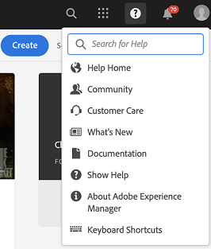

# [!DNL Adobe Experience Manager] 6.5 Service Pack發行說明 {#aem-service-pack-release-notes}

## Release information {#release-information}

| 產品 | Adobe Experience Manager 6.5 |
| -------- | ---------------------------- |
| 版本 | 6.5.6.0 |
| 類型 | Service Pack版本 |
| 日期 | 2020年9月03日 |
| 下載URL | [軟體散發](https://experience.adobe.com/#/downloads/content/software-distribution/en/aem.html?package=/content/software-distribution/en/details.html/content/dam/aem/public/adobe/packages/cq650/servicepack/aem-service-pkg-6.5.6-1.0.zip) |

## Adobe Experience Manager 6.5.6.0包含的功能 {#what-s-included-in-aem}

Adobe Experience Manager 6.5.6.0是重要的更新，其中包括自2019年4月6.5版正式發行以來，新功能、客戶要求的重要增強功能，以及效能、穩定性和安全性 **增強**。 它可安裝在Adobe Experience Manager 6.5之上。

Adobe Experience Manager 6.5.6.0中引進的主要功能和增強功能包括：

* 現在也支援透過Proxy伺服器將資產貢獻資料夾從Brand Portal發佈至Experience Manager Assets。

* 現在，刪除中的專用資料夾時，會自動生成的專用資料夾組會被清除 [!DNL Experience Manager Assets]。

* 視訊檢視器預設集編輯器中 [!UICONTROL 的修飾元] ，說明已在中更新 [!DNL Dynamic Media]。

* 提供新的公司設定以反映連接器的 [!DNL Dynamic Media] 狀態。

* 和的預設選 `test` 項 `aiprocess` 會從Dynamic Media `Thumbnail`的先前版本更新為， `Rasterize` 以確保使用者只需建立縮圖，並略過頁面擷取和關鍵字擷取。

* 在用戶端預先填寫最適化表格。

* 在具有雙向SSL實作的伺服器上，與REST風格的API整合，以建立資料模型。

* 增強轉譯的可調式表單頁面快取功能。

* 在自動化表單轉換服務中支援Adobe Sign文字標籤。

* Support to convert colored forms to adaptive forms using [!DNL Automated Forms Conversion service].

* 支援SMB 2和SMB 3協定。

* 內建儲存庫(Apache Jackrabbit Oak)已更新至1.22.4版。

如需Experience Manager 6.5.6.0中新增功能與增強功能的完整清單，請參閱 [Adobe Experience Manager 6.5 Service Pack 6的新增功能](new-features-latest-service-pack.md)。

以下是6.5.6.0版中提供 [!DNL Experience Manager] 的修正清單。

### [!DNL Sites] {#sites-6560}

* 在或 [!DNL Sites] 中 [!DNL Screens]，選擇項目，然後按一下 [!UICONTROL 管理出版物]。 由於使用者介面錯誤，使 [!UICONTROL 用者無法在「管理出版物] 」精靈中前進。 具體而言， [!UICONTROL Publish] 選項無法運作(NPR-34099)。
* 在取消選擇「取消繼承」( [!UICONTROL Cancel Inheritance] )或「禁用繼承 [!UICONTROL 」(Disable Inheritance] )選項後，iParsys（繼承段落系統）的位置不會恢復為其原始預設位置(NPR-34097)。
* 如果 `RolloutConfigManagerFactoryImpl` 無法載入轉出設定，則不會嘗試載入遺失的設定。 它會傳回快取的組態(NPR-34092)。
* 在Text核心元件中，使用來源HTML編輯選項後，標籤中的 `em` 類別即會移除(NPR-34081)。
* 從Experience Manager 6.3.3升級至Experience Manager 6.5.3後，推出程式會耗時更久，而且推出會因逾時錯誤而失敗(NPR-34049)。
* 不 `htmlwriter` 會將屬性值編碼回去。 XF標籤中存在的標籤以解碼的屬性值（即代替） `"` 導出 `&#34`。 它會在使用XF匯出的Visual Experience Composer的Target端造成問題(NPR-34048)。
* 在移入頁面時 [!DNL Experience Manager Sites]，請加強記錄功能以擷取版本建立失敗的原因(NPR-34014)。
* 如果 [!DNL Rich Text Editor] 移除所有文字，段落標籤也會移除(NPR-33976)。
* 當頁 `siteadmin` 面（在Classic UI）開啟或重新整理時，功能表中的 `New` 選項會停用(NPR-33949)。

   

* A [!DNL Content Fragment] 不能用作 `TemplatedResource` 失敗 `ContentFragmentUsePojo` 的A(NPR-33911)。
* 同步和非同步移動操作可能會導致併發傳輸導致錯誤。 頁面移動操作僅限同步移動。 它可防止頁面同時移動(NPR-33875)。
* [!UICONTROL 管理出版物] (Manage Publication)操作，將內容從「作者」複製到「發佈」實例失敗，並產生JavaScript錯誤(NPR-33872)。
* 當選取多個頁面或資產以建立版本時，新版本僅會針對最後選取的頁面或資產建立(NPR-33866)。
* 將含即時副本的Blueprint頁面移至另一個檔案夾。 將資料夾移動到原始資料夾時，移動操作將失敗而無任何錯誤(NPR-33864)。
* 當在 [!DNL Sites] Console中使用移動動作來重新命名網頁時，在精靈的最後一個步驟中會顯示兩個重疊的對話方塊(NPR-33831)。

   

* 復 `cq:acLinks` 制和 `cq:acUUID` 貼上操 [!DNL Adobe Campaign] 作期間會刪除複製上的和屬性(NPR-33794)。
* 嘗試在已分離父即時副本的子頁面上轉出時， [!DNL Experience Manager] 會產生空指針異常(NPR-33676)。
* 當 [!DNL RTE] 再次復製版面容器並貼上頁面時，版面容器中的元件不可見。 元 [!DNL RTE] 件不可編輯，但會在頁面重新整理時顯示(NPR-33662)。
* 針對不同的中斷點（中型和大型）調整版面元件大小時，版面的運作不如預期(NPR-33608)。
* 在的內嵌編輯模 [!DNL RTE]式中，拖曳影像無法用於文字元件(NPR-33602)。
* 您可以在藍圖頁面中建立與頁面名稱同名的元件。 在轉出期間， `_msm_moved` 會加上後尾以重新命名元件。 該部分被移至段落 [!UICONTROL 制度] (NPR-33535)的末尾。
* 當在許多頁或資產上設定offTime或onTime時，會耗費大量資源，並會在啟動和關閉期間減慢系統速度(NPR-33482)。
* 具有CRUD權限的使 `/content/experience-fragment` 用者無法刪除資料夾(NPR-33436)。
* 您可以在 [!UICONTROL 區段的父資料夾中，選取] HTML &amp; JSON [!UICONTROL ，做為] Adobe Target匯出格式的 [!DNL Experience Fragments] 選項。 此父資料夾的子資料夾在啟用觸控的UI中會顯示相同的屬性。 不過，在CRXDE中， `cq:adobeTargetExportFormat`它只顯示HTML而非 `html,json` 顯示(NPR-33423)。
* 不支援從頁面別名發佈或取消發佈。 刪除看似否的選項(NPR-33415)。
* 特定標籤可從中的一個位置移動到另一個位置 [!DNL Experience Manager]。 移動前後也可套用至不同的頁面。 編輯頁面屬性時，即使標籤相同，標籤也不會顯示以供編輯(NPR-33353)。
* 從包含多個版面容器的範本中刪除版面容器時，頁面範本無法正確呈現(NPR-33347)。
* 在範本編輯器中，嘗試刪除下方超過100000個頁面所使用的範本 `/content/`。 未顯示任何錯誤資訊時顯示錯誤(NPR-33312)。
* 使用錨 [!DNL Experience Manager] 點重新導向頁面在「作者」例項上無法運作，因 `PageRedirectServlets` 為在URL片段或錨點後放置查詢字串(NPR-34288)。
* 在結果下建立 `/content/campaign` 品牌時，會產生不允許建立促銷活動的結構。 [!UICONTROL 「建立品牌] 」選項會讓新建立的品牌無法建立 [!UICONTROL 選件和活動] ，因為沒有「建立  」選項(NPR-34113)。
* 您可以暫停頁 [!DNL Live Copy] 面的繼承，如編輯器模式所示，繼承在中斷。 在頁面屬性中，表示繼承的表徵圖錯誤地指示繼承存在且未中斷(NPR-34017)。
* 具有多個參考的頁面無法非同步移動，有時移動操作會失敗(CQ-4297969)。
* 在編寫時，URL中 `/` 含有字元的網頁會停止回應。 在製作時新增元件時，CPU使用量會增加，瀏覽器會停止回應(CQ-4295749)。
* 在瀏覽模式中，NVDA不會對從「類型／大小」菜單選項中選擇的值進行旁白。 視覺焦點不在選取的元素上。 依賴螢幕閱讀程式的使用者無法使用瀏覽模式(CQ-4294993)。
* 建立網頁時，使用者可以選取「內 [!UICONTROL 容頁面] 」範本。 在「社 [!UICONTROL 交媒體] 」標籤中，使用者選 [!UICONTROL 取偏好的XF變數]。 若要在NVDA瀏覽模式中選取體驗片段，使用者無法使用鍵盤按鍵(CQ-4292669)。
* 將車把庫更新為更安全的v4.7.3(NPR-34484)。

### [!DNL Assets] {#assets-6560}

**Experience Manager Assets中的協助工具增強功能**

* 使用鍵盤按鍵，使用者現在可以存取並專注在資產 [!UICONTROL References] list（參考清單）中的互動式使用者介面選項(NPR-34115)。

* 螢幕閱讀程式現在會宣佈搜尋頁面上謂詞的預期動作(NPR-34104)。

* 搜尋頁面和搜尋結果頁面現在提供更多資訊標題，以更好地瞭解螢幕閱讀程式使用者(NPR-34093)。

* 螢幕閱讀程式現在會宣佈在資產「屬性」頁面的「 [!UICONTROL Basic] 」（基本）標籤中，刪除選  取的標籤選項(NPR-33972)。

* 現在，螢幕閱讀程式會將清單檢視中每一列的元素宣佈為同一列的元素(NPR-33932)。

* 使用鍵導覽時的使 `Tab` 用者焦點現在會移至版本預覽中的關閉選項(NPR-33863)。

* Omnisearch關閉後，使用者焦點現在會移至搜尋圖示(NPR-33705)。

* 可操作的使用者介面選項現在使用鍵盤按鍵進行導覽時，視覺焦點更突出，對比也更強。 鍵盤使用者可識別重點區域(NPR-33542)。

* 使用鍵盤的拖曳功能現在可在螢幕閱讀程式的 [!UICONTROL 「中繼資料結構編輯器」] (CQ-4296326)中運作。

* 在連結共用對話方塊中，當在瀏覽模式中導覽時，會顯示螢幕閱讀程式，

   * 不會在載入對話方塊後立即對表格資訊進行旁白。

   * 可導覽至所有列出的自動建議。

   * 針對新增電子郵件地址／搜尋 [!UICONTROL 所顯示的自動建議] (CQ-4294232)進行旁白。

* 使用鍵 `Esc` 將快速動作圖示從卡片檢視中移除，不會再移除最後焦點項目的鍵盤焦點(CQ-4293554)。

* 針對使用者介面上的互動式選項，螢幕閱讀程式現在會宣佈其用途，而非圖示的文字名稱(CQ-4272943)。

* 現在，當使用鍵盤細節導覽Banner [!UICONTROL Kay Dark Tab in]Banner(CCin)時，鍵盤焦點成功移動至 [!UICONTROL Flyout]、 [!UICONTROL InlineZoom、DarkZoom、ShopZoom][!DNL Dynamic Media] 、ShopZoomLightOptim Optiomin（垂直橫幅中），使用鍵盤導覽BanBanBanerBanerBanq-4290605)。

* [!UICONTROL 現在，您可以使用鍵盤] 鍵(NPR-34107)來存取資產  「屬性」頁面上的「儲存並關閉」選項。

* 現在，每次發生錯誤時，螢幕閱讀程式會宣佈因使用者名稱和密碼組合不正確而導致的錯誤訊息(NPR-33722)。

* 在頁 [!DNL Experience Manager] 首區段中，在瀏覽模式中導覽時，螢幕閱讀程式現在會宣佈，

   * 在Type中自動編輯建議， [!UICONTROL 以便在Omnisearch中] 搜尋。

   * 解決方案、說明、收件匣和 [!UICONTROL 使用者選項], [!UICONTROL 已展開或收] 合的狀態。

   * 當使 [!UICONTROL 用者在「搜尋說明」欄位的「說明」選項下輸入搜尋字串時，會顯示「搜尋說明] 」狀態 [!UICONTROL 訊息] 。

   

   *圖：[!UICONTROL 在「說明」功能表中]，搜尋[!UICONTROL 說明]。*

   * 如果在「模擬為」欄位中 [!UICONTROL 的「使用者] 」選項下輸入錯誤值，且焦點會正確移至文字欄位(NPR-33804)，則會出現錯誤訊息。

   

   *圖：[!UICONTROL 在頁首的]「使用者[!UICONTROL 」選單中]，模擬為欄位。*

* 使用者現在可以使用鍵盤來變更焦點：

   * [!UICONTROL 在「連結共用」對話方塊中] ，搜尋／新增 [!UICONTROL 電子郵件地址] 。

   * [!UICONTROL 在資料夾「屬性] 」的「權限」頁籤 [!UICONTROL 的「關閉的用戶組」下方，添加「用戶」或「組」] 欄位  (NPR-34452)。

**Experience Manager Assets中修正的問題**

[!DNL Adobe Experience Manager] 6.5.6.0提供 [!DNL Assets] 下列問題的修正：

* 從資產時間軸選取註解時，不會反白顯示(CQ-4302422)。

* 預覽使用範本建立的行銷文宣資產（例如手冊、傳單和名片） [!DNL Adobe InDesign] 不會顯示分行和分段(NPR-34268)。

* 文字擷取，因此無法完整搜尋已上傳的PDF檔案(NPR-34164)。 要修復它，請在安裝Service Pack 6 [!DNL sAdobe Experience Manager] 後重新啟動部署。

* 多頁資產的時間軸會在時間軸檢視中瀏覽資產時顯示套用至所有子資產的註解，而非顯示特定子資產的註解(NPR-34100)。

* 如果資料夾包含JavaScript、CSS或JSON檔案格式的資源，則不會使用「管理出版物  」選項來發佈資產資料夾(NPR-34090)。

* 取消選取或移除Omnisearch中套用的標籤或篩選器會多次執行搜尋查詢，這會導致搜尋時間增加(NPR-34078)。

* 在卡片檢視中，當工作流程（在資料夾中的資產上）進行中或待定時，頁面會重新載入，直到工作流程完成或終止為止。 因此，作者無法處理資料夾中必須向下捲動的資產(NPR-33986)。

* 如果使用者將已發佈的資產移至新位置，則即使取消選取「重新發佈」選項，資產 [!UICONTROL 也會重新] 發佈。 這會導致發佈例項上有許多孤立的資產。 不過，預設行為是，已發佈資產上的移動操作會自動取消發佈；如果作者在移動資產時選取「 [!UICONTROL 重新發佈] 」選項，則會重新發佈此資產(NPR-33934)。

* 系列 [!UICONTROL 中資產的「移動資產] 」頁面不會載入所有HTML內容，例如「調 [!UICONTROL 整／重新發佈」選項] 。 因此，用戶無法完成移動操作(NPR-33860)。

* 移動資產並在移動資產的名稱和標題中添加特殊字元會在資產的新位置(NPR-33826)建立一個額外的資料夾（同名）。

* [!UICONTROL 在「下載] 」對話方塊中選取「 [!UICONTROL Email] 」（電子郵件）選項時，資產的「下載」按鈕會  停用(NPR-33730)。

* 在對資產執行大量作業（例如批量中繼資料編輯）時，會發現「請求-URI過長」錯誤(NPR-33723)。

* 如果上傳的JSON檔案有空格或特殊字元的值( [!UICONTROL NPR-33712)，則會發生JavaScript錯誤，而使用者無法在] Folder Metadata Schema Form Editor [!UICONTROL （資料夾中繼資料結構表單編輯器）的「透過JSON路徑]」功能，選取或刪除「下拉式清單」欄位中產生的選項。

* 使用或中的「 [!UICONTROL Open] 」（開啟）選項更新資產時，資產的靜態轉譯 [!DNL desktop app] 不會更新，並會同步回 [!DNL Adobe Asset Link][!DNL Adobe Experience Manager] (CQ-4296279)。

* 在列視圖中，對一組資產的移動操作也會移動在為它們使用「篩選」選項之前選 [!UICONTROL 擇的資] 產。 請注意，使用 [!UICONTROL Filter] 選項會取消選取先前的選取範圍(NPR-34018)。

* 資產的搜尋建議會在特殊字元之前加入反斜線，其名稱中有特殊字元(NPR-33834)。

* 在「資料夾中繼資料結構表單」中 [!UICONTROL 建立下拉式清單規則時]，使用者無法從「欄位選擇  」欄中選取值(CQ-4297530)。

* 在6.5上安裝 `/var/workflow/models/dam`6.5 Service Pack 5或舊版( [!DNL Experience Manager][!DNL Experience Manager] NPR-34532)時，會刪除資產自訂工作流程模型的執行時期副本（在中建立）。 若要擷取執行時期副本，請使用HTTP API將工作流程模型的設計時副本與執行時期副本同步：
   `<designModelPath>/jcr:content.generate.json`。

**動態媒體中修正的問題**

* 如果使用者在建立視訊描述檔後在編輯中定義編碼設定，則智慧型裁切設定會從視訊描述檔中移除(CQ-4299177)。

* 當使用者在資產詳細資訊頁面的側欄選項(例如 [!UICONTROL Overview]、 [!UICONTROL Timeline]、 [!UICONTROL Viewers])之間切換時，頁面載入時資產會閃爍(NPR-34235)。

* 重新處理作業時會發現下列問題：

   * 重新處理工作傳回的工作處理代碼中遺失工作ID。

   * 僅重新處理視訊記錄檔的檔案名稱，而非完整路徑。

   * 重新處理作業沒有將資產類型設定為靜態的選項。

   * `ExcludeFromAVS` 選項(CQ-4298401)。

* 當將影像描述檔新增至具有多個（例如11）外觀比例的資料夾時，智慧型裁切功能會失敗並出現錯誤(NPR-34082)。

* 當使用者在使用Dynamic Media Scene7設定的「工具」中，向下捲動「 [!UICONTROL Workflow] Archive [!UICONTROL 」（工作流程封存）頁面的「工具」標籤時，][!DNL Adobe Experience Manager] 會觸發DAM更新資產工作流程(CQ-4299727)。

* 檢視器預 [!UICONTROL 設集編輯器] 「行為  」索引標籤中的符號未本地化(CQ-4299026)。

* 如果檢視器處於回應模式，則主檢視會以不正確的版面顯示影像，而檢視器則無法配合。(CQ-4298293)

* 對 [!UICONTROL Adobe Experience Manager] 中影像預設集的變更不會同步至Scene7 Publishing System(CQ-4299713)。

### [!DNL Commerce] {#commerce-6560}

* 當資產移動時，不會重新分解產品中資產的連結(NPR-34098)。

### 平台 {#platform-6560}

* 無法在升級的Experience Manager實例上使用診斷工具下載日誌(NPR-34336)。
* 升級失敗，但因為依賴特定版本的基礎套件( `cq-wcm-api` CQ-4300520)而發生錯誤。
* 未指定「預設代理 **[!UICONTROL （發佈）」配置的「連接超時]** 」和「套接字超時 **** 」設定的預設值(NPR-33707)。
* 更新下的對應 `/etc/map.publish` 設定不會反映在網站頁面(NPR-34015)。
* [API參考檔案](https://helpx.adobe.com/experience-manager/6-5/sites/developing/using/reference-materials/javadoc/com/day/cq/tagging/package-summary.html) ，不包含套件的 `com.day.cq.tagging` 檔案(CQ-4295864)。

### 使用者介面{#ui-6560}

* 卸載瀏覽器介面不顯示所有作業主題(NPR-34308)。
* 配置瀏覽器介面不顯示所有配置(NPR-33644)。
* 在搜尋 `Esc` 要模擬的使用者時按下鍵時，會關閉 **[!UICONTROL User]** （使用者）對話方塊，而非使用者清單(NPR-34084)。

### 整合 {#integrations-6560}

* 長名稱的活動不與同 [!DNL Adobe Target] 步(NPR-34254)。

### 翻譯專案 {#translation-6560}

* 如果用戶的翻譯項目包含特殊字 `authorizableID` 符(NPR-33828)，則不建立翻譯項目。

### Sling {#sling-6560}

* Health Check and Pattern Detector具有重疊功能。 因此，Heath檢查從產品中刪除(NPR-33928)。

### WCM {#wcm-6560}

* 基礎元件——將基礎影像元件新增至頁面並參考影像時， `Undo` 此作業無法運作(NPR-34516)。

* 無法使用「頁面移動」操作(CQ-4303028)。

### [!DNL Communities] {#communities-6560}

* 在社交媒體上分享貼文時，會顯示過時的Google+選項(NPR-33877)。

* 社群成員無法修改群組範本或其他群組功能設定(NPR-33530)。

* 影像上的超連結標籤在論壇貼文中無法正確產生(NPR-33464)。

* 無障礙環境支援功能在社群指派功能中識別(NPR-33442)。

* 透過管理控制台新增的社群群組現有使用者會從社群群組主控台中任何修改的使用者清單中移除(NPR-34315)。

<!--
* Tag filters are vulnerable to sensitive information disclosure (NPR-33868).
-->

### [!DNL Forms] {#forms-6560}

>[!NOTE]
>
>[!DNL Experience Manager] Service Pack不包含修正 [!DNL Forms]。 它們是使用個別的附 [!DNL Forms] 加套件傳送。 此外，還會發行包含JEE修正的累 [!DNL Experience Manager Forms] 積安裝程式。 如需詳細資訊，請 [參閱「在JEE上安裝AEM Forms附加元件](#install-aem-forms-add-on-package)[和安裝AEM Forms」](#install-aem-forms-jee-installer)。

**適用性表單**

* 當缺少自適應表單片段時，自適應表單無法轉換(NPR-34302)。

* 最適化表單欄位的說明內容說明會顯示段落HTML標籤(NPR-34116)。

* 當您選擇「在服 **[!UICONTROL 務器上重新驗證]** 」屬性時，自適應表單無法提交(NPR-33876)。

* 提交 **[!UICONTROL 到REST端點]** ，提交操作不適用於自適應表單(CQ-4299044)。

* 協助功能：當您嘗試提交最適化表單而未上傳強制欄位的附件時，焦點不會自動移至附件欄位(CQ-4298065)。

* 將行添加到最適化表單的表格時，「 **[!UICONTROL Add to top]** 」（添加到頂部）和「 **[!UICONTROL Add to bottom]** 」（添加到底部）選項不會顯示適當的結果(CQ-4297511)。

* Value Commit  （值提交）指令碼觸發錯誤，導致資料以最適化形式遺失(CQ-4296874)。

* 日期選擇器無法正確運作於本地化的最適化表單(NPR-34333)。

* 當檔案名稱中有底線或空格時，您無法將檔案附加至最適化表單(CQ-4301001)。

* 當巢狀可重複面板的發生次數多於其父面板時，此類巢狀可重複面板的所有發生次數都無法預先填滿(NPR-33666)。

* 最適化表單有一些開放資源解析器。 這會導致提交失敗。 間歇性出現問題(CQ-4299407)。

* 首次開啟欄位設定時，不會顯示屬性圖示(CQ-4296284)。

**工作流程**

* 當工作流程批准者上傳附件時，附件會重新命 `undefined` 名為(NPR-33699)。

* [!DNL Experience Manager] 「Workflow Purge（工作流清除）」操作失敗，並顯示以下錯誤消息(NPR-33575):

   `java.lang.UnsupportedOperationException: The query read more than 500000 nodes in memory`

* [!DNL Experience Manager Forms] 應用程 [!DNL Windows] 式在送出表格後停止回覆(NPR-34409)。

* 當您安裝AEM Service Pack時，項目 **的「待辦事項** 」清單不會顯示為連結。 「待辦事項」 **項目的文字** ，包含HTML標籤(NPR-34317)。

**互動式通訊**

* 當您包含含有巢狀可重複元件的文字檔案片段時，互動式通訊無法儲存(NPR-34095)。

**信件管理**

* 當您修改包含資料字典值的文字檔案片段時，代理UI會停止回應(NPR-33930)。

* 從檔案複製貼上內 [!DNL Microsoft Word] 容至字母中的文字檔案片段，會造成格式問題(NPR-33536)。

**檔案服務**

* 當您使用Output and Forms服務從XDP檔案產生PDF檔案時，會導致遺失和重疊文字(NPR-34237、CQ-4299331)。

* 當您將HTML檔案轉換為PDF時， `MaxReuseCount` 屬性無法設定(NPR-33470)。

* 當您下載包含Reader Extensions互動功能的PDF檔案時，無法使用 [!DNL Adobe Reader] (NPR-33729)將附件新增至PDF檔案。

**Document Security**

* 在安裝 [!DNL Experience Manager] Service Pack(NPR-34310)後，無法在PDF檔案中使用HSM憑證執行簽署作業。

**設計人員**

* 無法在Designer 6.5.x版(CQ-4295322)中開啟XForms。

* 當您開啟Designer時，「歡迎」畫面會顯示錯誤的年份(CQ-4295289)。

* 當您安裝 [!DNL Acrobat DC] 在伺服器上時，「 **[!UICONTROL Distribute Form]** 」（散發表單）選項會停用(CQ-4296304)。

如需安全性更新的詳細資訊，請參 [閱Experience Manager安全性公告頁面](https://helpx.adobe.com/security/products/experience-manager.html)。

## Install 6.5.6.0 {#install}

**設定需求**

* AEM 6.5.6.0需要AEM 6.5。如需詳 [細指示](/help/sites-deploying/upgrade.md) ，請參閱升級檔案。
* Adobe軟體散發提供Service Pack下 [載](https://experience.adobe.com/#/downloads/content/software-distribution/en/aem.html)。
* 在使用MongoDB和多個執行個體的部署中，使用「套件管理員」將AEM 6.5.6.0安裝在其中一個「作者」執行個體上。
* 在安裝之前，請先拍下快照或AEM例項的新備份。
* 在安裝之前重新啟動實例。 雖然只有在實例仍處於更新模式時才需要此選項（這是從舊版更新實例時的情況），但建議在實例運行較長時段時使用此選項。

>[!NOTE]
>
>Adobe不建議移除或解除安裝Adobe Experience Manager 6.5.6.0套件。

### 安裝Service Pack {#install-service-pack}

執行下列步驟，將Service Pack安裝在現有的Adobe Experience Manager 6.5實例上：

1. 從「軟體散發」下載 [Service Pack](https://experience.adobe.com/#/downloads/content/software-distribution/en/aem.html?package=/content/software-distribution/en/details.html/content/dam/aem/public/adobe/packages/cq650/servicepack/aem-service-pkg-6.5.6-1.0.zip)。

1. 開啟「套件管理員」，然後按 **[!UICONTROL 一下「上傳套件]** 」以上傳套件。 要瞭解如何使用它，請參 [閱Package Manager](https://docs.adobe.com/content/help/en/experience-manager-65/administering/contentmanagement/package-manager.html)。

1. 選擇軟體包，然後按一下 **[!UICONTROL 安裝]**。

>[!NOTE]
>
>由於已知問題，已提供更新的Service Pack包。 建議安裝此套件。

>[!NOTE]
>
>在安裝Service Pack時，有時會退出Package Manager UI的對話方塊。 Adobe建議您在存取部署之前，先等待錯誤記錄穩定下來。 請等待與解除安裝更新程式套件相關的特定記錄，然後確定安裝成功。 通常，這會在任何瀏 [!DNL Safari] 覽器上發生，但是偶爾會發生。

**自動安裝**

在工作實例上自動安裝Adobe Experience Manager 6.5.6.0有兩種方法：

答：當伺服器聯機 `../crx-quickstart/install` 時，將軟體包放入資料夾。 軟體包會自動安裝。

B.使用套 [件管理員的HTTP API](https://docs.adobe.com/content/docs/en/crx/2-3/how_to/package_manager.html)。 使 `cmd=install&recursive=true` 用以安裝巢狀包。

>[!NOTE]
>
>Adobe Experience Manager 6.5.6.0不支援啟動載入。

**驗證安裝**

1. 產品資訊頁面(`/system/console/productinfo`)會在「已安裝產品」下顯示更 `Adobe Experience Manager (6.5.6.0)` 新 [!UICONTROL 的版本字串]。

1. 所有OSGi捆綁包都 **[!UICONTROL 是OSGi控制台中的]****[!UICONTROL ACTIVE或FRAGMENT]** (使用Web控制台： `/system/console/bundles`)。

1. OSGi套件 `org.apache.jackrabbit.oak-core` 版本為1.22.3或更新版本(使用Web Console: `/system/console/bundles`)。

若要瞭解經過認證可與此版本搭配使用的平台，請參閱 [技術需求](/help/sites-deploying/technical-requirements.md)。

### 安裝Adobe Experience Manager Forms附加套件 {#install-aem-forms-add-on-package}

>[!NOTE]
>
>如果您不使用AEM Forms，請略過。 Adobe Experience Manager Forms中的修正是透過個別的附加套件提供。

1. 請確定您已安裝Adobe Experience Manager Service Pack。
1. 下載您作業系統的 [AEM Forms版本中列出的對應Forms附加元件套件](https://helpx.adobe.com/aem-forms/kb/aem-forms-releases.html) 。
1. 如安裝AEM Forms附加元件套件中所述，安 [裝Forms附加元件套件](../forms/using/installing-configuring-aem-forms-osgi.md#install-aem-forms-add-on-package)。

### 在JEE上安裝Adobe Experience Manager Forms {#install-aem-forms-jee-installer}

>[!NOTE]
>
>如果您未在JEE上使用AEM Forms，請略過。 JEE上的Adobe Experience Manager Forms修正可透過個別的安裝程式提供。

如需在JEE上安裝Experience Manager Forms累積安裝程式和部署後設定的詳細資訊，請參閱修補程 [式0018的發行說明](jee-patch-installer-65.md)。

### UberJar {#uber-jar}

UberJar for Experience Manager 6.5.6.0可在 [Maven Central儲存庫中取得](https://repo.maven.apache.org/maven2/com/adobe/aem/uber-jar/6.5.6-1.0/)。

要在Maven項目中使用UberJar，請 [瞭解如何使用UberJar](/help/sites-developing/ht-projects-maven.md) ，並在項目POM中包括以下相關性：

```shell
<dependency>
      <groupId>com.adobe.aem</groupId>
      <artifactId>uber-jar</artifactId>
      <version>6.5.6-1.0</version>  
      <scope>provided</scope>
</dependency>
```

>[!NOTE]
>
>此版本之後，UberJar和其他相關對象可在Maven Central Repository(Adobe Public Maven Repository，而非Adobe Public Maven Repository(repo.adobe.com)上使用。 主UberJar檔案已更名為 `uber-jar-<version>.jar`。 因此，標籤沒 `classifier`有 `apis` 任何值和值 `dependency` 。

## 過時的功能 {#removed-deprecated-features}

本節列出Experience Manager 6.5.6.0中已標示為已過時的功能和功能。計畫在未來版本中移除的功能會先設為不建議使用，並提供替代選項。

建議客戶在目前的部署中是否使用功能，並規劃變更實施以使用替代選項。

| 區域 | 功能 | 替代方案 |
|---|---|---|
| 整合 | AEM Cloud **[!UICONTROL Services選擇加入畫面已過時]** 。 隨著AEM 6.5中的AEM和Target整合更新，以支援Target Standard API（透過Adobe IMS和I/O使用驗證），以及Adobe Launch在檢測AEM頁面以進行分析和個人化方面的角色日漸增加，「選擇加入」精靈在功能上已變得無關緊要。 | 透過個別的AEM雲端服務，設定系統連線、Adobe IMS驗證和Adobe I/O整合。 |
| 連接器 | AEM 6.5不再支援Adobe JCR Connector for Microsoft SharePoint 2010和Microsoft SharePoint 2013。 | N/A |

## 已知問題 {#known-issues}

* 如果安全性健康狀況檢查無效，且系統顯示以下錯誤消息：
   `message: Could not verify users and could not test system account logins.`
執行下列步驟以解決問題：
   1. 前往https://&lt;*hostname*>:&lt;*port*>/system/console/configMgr。

   1. 搜尋 `hc.impl`.

   1. 在「 [!UICONTROL 服務映射]」中，單 `+` 擊並指定 `com.adobe.granite.repository.hc.impl=[user-reader-service]`。

   1. 按一下 [!UICONTROL 保存] ，保存配置。

* 如果您在 [!DNL Experience Manager][!DNL Experience Manager] 6.5上安裝 `/var/workflow/models/dam`6.5 Service Pack 5或舊版Service Pack，則會刪除資產自訂工作流程模型（在中建立）的執行時期副本。
若要擷取您的執行時期副本，Adobe建議使用HTTP API，將自訂工作流程模型的設計時間副本與其執行時期副本同步：
   `<designModelPath>/jcr:content.generate.json`。

* 如果您在「資料夾中繼資料結構表單編輯器」和「中繼資料結構表單編輯器」中編輯和建立階層式規則時遇到問題，請連絡Adobe支援(Adobe Support  )。 請注意，已建立和儲存的規則會如預期般運作。

* 如果階層中的檔案夾已重新命 [!DNL Experience Manager Assets] 名，且包含資產的巢狀檔案夾已發佈至 [!DNL Brand Portal]，則在中不會更新檔案夾的標題，直到 [!DNL Brand Portal] 根檔案夾再次發佈為止。

* 當使用者第一次選擇以最適化表單來設定欄位時，儲存設定的選項不會顯示在「屬性瀏覽器」中。 在相同編輯器中選取以設定最適化表單的其他欄位，可解決此問題。

* 如果 [!UICONTROL Connected assets configuration] wizard在安裝後傳回404錯誤訊息，請使用Package Manager手動重新 `cq-remotedam-client-ui-content` 安裝 `cq-remotedam-client-ui-components` 和套件。

* 在安裝AEM 6.5.x.x時，可能會顯示下列錯誤和警告訊息：
   * 「當使用Target Standard API（IMS驗證）在AEM中設定Target整合時，將「體驗片段」匯出至Target會導致建立錯誤的選件類型。 Target會以「HTML」/來源「Adobe Target Classic」類型建立數個選件，而非「Experience Fragment」/來源類型「Adobe Target Classic」。
   * `com.adobe.granite.maintenance.impl.TaskScheduler`:在granite/operations/maintenance中找不到維護視窗。
   * 當使用SUM、MAX和MIN等集合函式時，Adaptive Form伺服器端驗證將失敗。 CQ-4274424
   * `com.adobe.granite.maintenance.impl.TaskScheduler` -在granite/operations/maintenance中找不到維護視窗。
   * 透過可購買橫幅檢視器預覽資產時，不會顯示動態媒體互動影像中的熱點。

## 隨附的OSGi組合和內容套件 {#osgi-bundles-and-content-packages-included}

下列文字檔案列出AEM 6.5.6.0中包含的OSGi組合和內容套件：

* [AEM 6.5.6.0隨附的OSGi搭售清單](assets/6560_bundles.txt)

* [AEM 6.5.6.0內容套件清單](assets/6560_packages.txt)

## 受限制的網站 {#restricted-sites}

這些網站僅提供給客戶使用。 如果您是客戶，需要存取權，請連絡您的Adobe客戶經理。

* [產品下載，請造訪licensing.adobe.com](https://licensing.adobe.com/)
* [聯絡客戶支](https://docs.adobe.com/content/help/en/customer-one/using/home.html)援如需有關存取支援入口網站的詳細資訊，請 [參閱存取支援入口網站](https://helpx.adobe.com/experience-manager/kb/accessing-aem-support-portal.html)。

>[!MORELIKETHIS]
>
>* [AEM 6.5版本注意事項](/help/release-notes/release-notes.md)
>* [AEM產品頁面](https://www.adobe.com/tw/marketing/experience-manager.html)
>* [AEM 6.5 檔案](https://helpx.adobe.com/tw/support/experience-manager/6-5.html)
>* 訂閱 [Adobe優先產品更新](https://www.adobe.com/subscription/priority-product-update.html)

