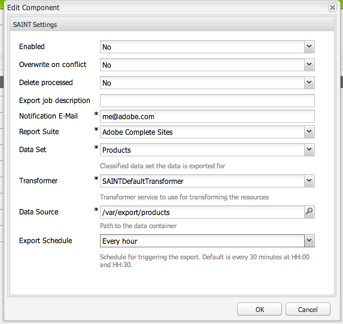

# Adobe Classifications{#adobe-classifications}

Adobe分類會以排程方式將分 [類資料匯出至Adobe Analytics](/help/sites-administering/adobeanalytics.md) 。 導出器是com.adobe.cq.sc **heduled.exporter.Exporter的實現**。

若要設定此值：

1. 透過工 **具、Cloudservices導覽至** 「 **Adobe Analytics** 」區段。
1. 添加新配置。 您會看到 **Adobe Analytics Framework** Configuration範本會顯示在 **Adobe Analytics Framework設定下方** 。 根據需 **要提供****標題和名稱** :

   

1. 按一 **下「建立** 」以設定設定。

   

   屬性包括：

   | **欄位** | **說明** |
   |---|---|
   | 已啟用 | 選取 **「是** 」以啟用「Adobe分類」設定。 |
   | 發生衝突時覆寫 | 選擇 **是** ，覆寫任何資料衝突。 預設情況下，此值設定為 **否**。 |
   | 刪除已處理的項目 | 如果設定為「 **是**」，則在導出處理的節點後將其刪除。 預設值為 **False**。 |
   | 匯出工作說明 | 輸入Adobe分類工作的說明。 |
   | 通知電子郵件 | 輸入Adobe分類通知的電子郵件地址。 |
   | 報表套裝 | 輸入報表套裝以執行其匯入工作。 |
   | 資料集 | 輸入要為其運行導入作業的資料集關係ID。 |
   | 轉換程式 | 從下拉式選單中，選取變壓器實作。 |
   | 資料來源 | 導覽至資料容器的路徑。 |
   | 匯出排程 | 選擇導出的計畫。 預設值是每30分鐘一次。 |

1. 按一 **下「確定** 」以儲存您的設定。

## 修改頁面大小 {#modifying-page-size}

記錄會在頁面中處理。 依預設，Adobe分類會建立頁面大小為1000的頁面。

Adobe分類中的每個定義的頁面大小上限為25000，而且可從Felix主控台修改。 在匯出期間，Adobe分類會鎖定來源節點，以防止並行修改。 導出後、出錯時或會話關閉時，節點將被解鎖。

若要變更頁面大小：

1. 導覽至OSGI主控台(位 **於https://&lt;host>:&lt;port>/system/console/configMgr** )，然後選取 **Adobe AEM Classifications Exporter**。

   

1. 視需要 **更新「匯出頁面大小** 」，然後按一下「 **儲存」**。

## SAINTDefaultTransformer {#saintdefaulttransformer}

>[!NOTE]
>
>Adobe分類先前稱為SAINT匯出器。

導出器可以使用變壓器將導出資料轉換為特定格式。 對於Adobe分類，已提供實 `SAINTTransformer<String[]>` 作「變形器」介面的子介面。 此介面用來限制SAINT API所使 `String[]` 用的資料類型，並具有標籤介面來尋找此類服務以供選擇。

在預設實施SAINTDefaultTransformer中，導出器源的子資源被視為具有屬性名稱作為密鑰的記錄，而屬性值作為值。 Key **** 列會自動添加為第一列——其值將是節點名。 不考慮命名空間屬 `:`性（包含）。

*節點結構：*

* id-classification `nt:unstructured`

   * 1 `nt:unstructured`

      * 產品=我的產品名稱（字串）
      * 價格= 120.90（字串）
      * 大小= M（字串）
      * 顏色=黑色（字串）
      * Color^Code = 101（字串）

**SAINT標題與記錄：**

| **關鍵** | **產品** | **價格** | **大小** | **彩色** | **Color^Code** |
|---|---|---|---|---|---|
| 1 | 我的產品名稱 | 120.90 | M | black | 101 |

屬性包括：

<table>
 <tbody>
  <tr>
   <td><strong>屬性路徑</strong></td>
   <td><strong>說明</strong></td>
  </tr>
  <tr>
   <td>變壓器</td>
   <td>SAINTransfer實施的類名</td>
  </tr>
  <tr>
   <td>電子郵件</td>
   <td>通知電子郵件地址。</td>
  </tr>
  <tr>
   <td>reportsuites</td>
   <td>報表套裝ID，以執行其匯入工作。 </td>
  </tr>
  <tr>
   <td>資料集</td>
   <td>資料集關聯ID，以執行的匯入工作。 </td>
  </tr>
  <tr>
   <td>說明</td>
   <td>工作說明。   </td>
  </tr>
  <tr>
   <td>覆寫</td>
   <td>覆寫資料衝突的旗標。 預設為 <strong>false</strong>。</td>
  </tr>
  <tr>
   <td>checkdipsions</td>
   <td>標幟以檢查報表套裝的相容性。 預設為 <strong>true</strong>。</td>
  </tr>
  <tr>
   <td>deleteprocessed</td>
   <td>標幟可在匯出後刪除已處理的節點。 預設為 <strong>false</strong>。</td>
  </tr>
 </tbody>
</table>

## 自動化Adobe分類匯出 {#automating-adobe-classifications-export}

您可以建立自己的工作流程，讓任何新匯入都能啟動工作流程，以建立適當且結構正確的 **/var/export/** ，以便匯出至Adobe分類。
