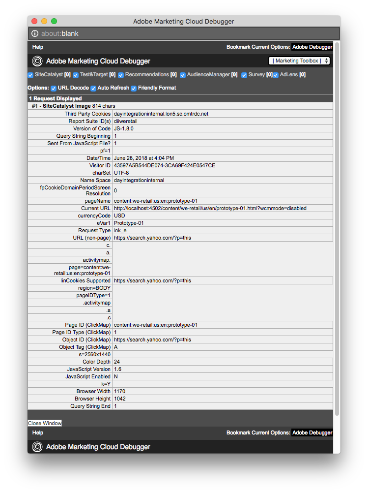

# 設定Adobe Analytics的連結追蹤{#configuring-link-tracking-for-adobe-analytics}

當使用者按一下您網站頁面上的連結時，您可在Adobe Analytics中擷取相關資訊。 例如，使用連結追蹤來瞭解使用者如何與您的網站互動、追蹤檔案下載及追蹤退出連結。

## 設定Adobe Analytics架構的連結追蹤 {#configuring-link-tracking-for-an-adobe-analytics-framework}

1. 使用 **Using****Deployment**, **Cloud Services** ，透過 **** Adobe Analytics導覽區段前往。

1. 使用 **顯示設定**，開啟必要的Adobe Analytics架構。
1. 展開「 **連結追蹤設定** 」區段，並視需要設定（本頁提供詳細資訊）:

   

## 追蹤檔案下載 {#tracking-file-downloads}

設定Adobe Analytics架構，以便從關聯頁面下載的檔案在Adobe Analytics中自動被追蹤為下載。 當您啟用下載追蹤時，只會追蹤您指定的檔案類型。

預設會追蹤下列檔案類型的下載：

* exe
* ZIP
* wav
* mp3
* mov
* mpg
* avi
* wmv
* doc
* PDF
* xls

例如，在PDF檔案啟用下載追蹤後，每當使用者按一下PDF檔案的連結時，就會追蹤PDF的下載。

架構的下載追蹤屬性是以程式碼的形式實作在為頁 `analytics.sitecatalyst.js` 面產生的檔案中。 下列程式碼範例代表預設的下載追蹤設定：

```
s.trackDownloadLinks= true;
s.linkDownloadFileTypes= 'exe,zip,wav,mp3,mov,mpg,avi,wmv,doc,pdf,xls';
```

若要啟用Adobe Analytics架構的下載追蹤：

1. [開啟Adobe Analytics架構並展開「連結追蹤設定」區段](#configuring-link-tracking-for-an-adobe-analytics-framework)。
1. 啟用 **追蹤下載**。
1. 在「下 **載檔案類型** 」方塊中，輸入您要追蹤之檔案類型的副檔名。

## 追蹤外部連結 {#tracking-external-links}

您可以追蹤頁面上外部連結（退出連結）的點按。

若要追蹤Adobe Analytics架構的外部連結：

1. [開啟Adobe Analytics架構並展開「連 **結追蹤設定** 」區段](#configuring-link-tracking-for-an-adobe-analytics-framework)。
1. 根據您的需求設定下列屬性。

在點按外部連結時追蹤的屬性：

* **追蹤外部**&#x200B;啟用外部連結追蹤。

* **外部篩選**（選用）定義篩選器，以比對連結目標的外部URL。 當連結目標符合篩選時，會追蹤連結。 外部篩選器僅適用於追蹤頁面上的部分外部連結。

   若要指定要追蹤的外部連結，請輸入連結目標的全部或部分URL。 以逗號分隔多個篩選。 用單引號括住字串文字。 沒有值(預設值為， `''`兩個單引號)會追蹤所有外部連結。

* **內部篩選**&#x200B;器定義篩選器，以比對內部連結的URL。 當連結定位符合此篩選的URL時，不會追蹤連結。 預設值是javascript命令，可傳回目前視窗位址的URL主機名稱。

   若要指定未追蹤的內部連結，請輸入連結目標的全部或部分內部URL。 以逗號分隔多個篩選。 用單引號括住字串文字。

   預設值為 `'javascript:,'+window.location.hostname`

* **在評估與內部**&#x200B;和外部篩選器的相符項目時，請保留查詢字串包含URL參數。

   啟用以在根據外部和內部篩選器評估連結目標URL時包含URL參數。

外部連結追蹤屬性是以程式碼形式實作在 `analytics.sitecatalyst.js` 為頁面產生的檔案中。 以下范常式式碼是針對與已啟用外部連結追蹤與下列設定之架構關聯的頁面產生：

* 外部篩選器為 `'google.com'`
* 內部篩選是 `'javascript:,'+window.location.hostname`
* 根據篩選條件評估連結目標時，不會包含查詢字串。

```
s.trackExternalLinks= false;
s.linkExternalFilters= 'google.com';
s.linkInternalFilters= 'javascript:,'+window.location.hostname;
s.linkLeaveQueryString= false;
```

## 使用連結點按傳送變數資料 {#sending-variable-data-with-link-clicks}

您可以設定AEM，在使用者按一下連結時，將事件和變數資料傳送至Adobe Analytics。 「連 **結追蹤設定** 」屬性可讓您指定Adobe Analytics事件和變數，以便在發生連結點按時追蹤。

框架映射決定事件和變數值。 您可以將Adobe Analytics變數對應至內容元件的變數，這些變數會儲存您在點按連結時要追蹤的資料。

若要透過連結點按來傳送變數資料：

1. [開啟Adobe Analytics架構並展開「連結追蹤設定」區段](#configuring-link-tracking-for-an-adobe-analytics-framework)。
1. 根據您的需求設定下列屬性。

使用連結點按來傳送變數資料的屬性：

* **連結追蹤事**&#x200B;件輸入您要用來計算連結點按次數的Adobe Analytics事件變數。

   以逗號分隔多個變數名稱。

   預設值不會 `None` 導致事件追蹤。

* **連結追蹤變**&#x200B;數輸入在點按連結時要傳送至Adobe Analytics的Adobe Analytics變數。 以逗號分隔多個變數名稱。

   預設值不 `None` 會傳送任何變數資料。

當您指定要傳送的事件和變數時，設定會在為頁面產生的 `analytics.sitecatalyst.js` 檔案中實作為程式碼。 當架構追蹤事件和屬性時，會為頁面產生下 `event10` 列范常式 `prop4` 式碼：

```
s.linkTrackEvents= 'event10';
s.linkTrackVars= 'prop4';
```

## 連結追蹤設定範例 {#example-link-tracking-configuration}

請執行下列程式，以探索Adobe Analytics整合的連結追蹤行為。 這些程式會顯示 [Adobe Marketing cloud除錯程式的結果](https://marketing.adobe.com/resources/help/en_US/sc/implement/debugger_install.html)。

### General configuration {#general-configuration}

此範例說明對應如何在追蹤和除錯程式中運作：

1. 開啟已與網頁關聯的架構。
1. 將 **Page** 元件拖曳至架構的映射區。 Page **元件屬** 於Sidekick中的General **** （一般）元件群組。

   >[!NOTE]
   >
   >您在實際場景中應使用的元件取決於繼承自的元件（如果是）。
   >
   >如果不是，您應將自己的元件公開於此處（在其頁面元件中定義分析子節點）。

   從左側面板拖曳Analytics(SiteCatalyst)變數，以根據下表設定對應：

<table>
 <tbody>
  <tr>
   <th>CQ Variable<br /> </th>
   <th>變數瀏覽器中的項目<br /> </th>
   <th>Adobe Analytics變數</th>
  </tr>
  <tr>
   <td>pagedata.title</td>
   <td>自訂eVar 1(eVar1)</td>
   <td>eVar1</td>
  </tr>
  <tr>
   <td>eventdata.events.pageView</td>
   <td>自訂1(event1)</td>
   <td>event1</td>
  </tr>
 </tbody>
</table>

1. 將Search元件拖動到框架的映射區域。 Search元件屬於Sidekick中的General元件組。 從左側面板拖曳Analytics(SiteCatalyst)變數，以根據下表設定對應：

<table>
 <tbody>
  <tr>
   <th>CQ Variable<br /> </th>
   <th>變數瀏覽器中的項目</th>
   <th>Adobe Analytics變數</th>
  </tr>
  <tr>
   <td>eventdata.keyword</td>
   <td>自訂eVar 2(eVar2)</td>
   <td>eVar2</td>
  </tr>
  <tr>
   <td>eventdata.results</td>
   <td>自訂eVar 3(eVar3)</td>
   <td>eVar3</td>
  </tr>
  <tr>
   <td>eventdata.events.search</td>
   <td>自訂2(event2)</td>
   <td>event2</td>
  </tr>
 </tbody>
</table>

### 設定外部連結追蹤 {#configure-external-link-tracking}

1. 在您的架構中，展開「連 **結追蹤設定」區** 。
1. 取消選 **取追蹤下載**。

1. 選擇 **追蹤外部**。
1. 取消選 **取「保留查詢字串**」。
1. 請為「外部篩選器 **」清單使用下列值** ，將其識別為外部URL:

   `‘yahoo.com’`

1. 新增下列值至「連結追 **蹤事件」欄位** :

   ```
       event1,event2
   ```

1. 將下列值新增至「連結 **追蹤變數」欄位** :

   ```
       eVar1,eVar2
   ```

1. 在與框架關聯的頁面上，添加 **Text元件** 。 在 **Text** （文字）元件內，新增指向下列位址的超連結：

   `https://search.yahoo.com/?p=this`

1. 切換至「 **預覽」模式** ，然後按一下連結。

使用Adobe Marketing cloud除錯程式檢視時，所進行的呼叫會如下所示：


>[!NOTE]
>
>URL不包含查詢字串： `?p=this`

### 包含URL參數 {#include-the-url-parameter}

1. 在框架中，展開「連 **結追蹤設定」區** 。
1. 啟用 **保留查詢字串**。
1. 重新載入頁面預覽，然後按一下連結。

出現在Adobe Marketing cloud除錯程式中的呼叫詳細資訊類似下列範例：



>[!NOTE]
>
>此時，URL包含查詢字串： `?p=this`

## Ad-Hoc Link Tracking {#ad-hoc-link-tracking}

臨機連結追蹤可讓內容作者為元件設定連結追蹤。 元件的設定會覆寫架構的 **Link Tracking Configuration** ，因此在與架構相關聯的頁面上， **Text** components可以設定為URL的連結追蹤。

臨機連結追蹤可讓您追蹤下載連結、外部連結以及事件和變數資料。

若要啟用臨機連結追蹤，您必須：

* [將包含 **Text元件的頁面** 與框架關聯](/help/sites-administering/adobeanalytics-connect.md#associating-a-page-with-a-adobe-analytics-framework)。
* [設定Adobe Analytics架構以啟用臨機連結追蹤](#enabling-ad-hoc-link-tracking)。
* [為文字元件設定連結追蹤](#configuring-link-tracking-for-a-text-component)。

### 啟用臨機連結追蹤 {#enabling-ad-hoc-link-tracking}

設定您的Adobe Analytics架構以啟用臨機連結追蹤。

1. 開啟Adobe Analytics架構並展開「連結追 **蹤設定」區段** 。

1. 啟用 **臨機連結追蹤**。

   >[!NOTE]
   >
   >並非所有使用者類型都能存取此核取方塊。 如果您需要存取權，請連絡您的網站管理員。

>[!NOTE]
>
>XSS Antisamy組態現在位於路徑 **/libs/sling/xss.config.xml** 下的SLING中，而下列規則需要新增至，才能進行臨機連結：

#### 錨記規則擴充功能 {#anchor-tag-rule-extension}

```xml
<attribute name="onclick">
    <literal-list>
        <literal value="CQ_Analytics.Sitecatalyst.customTrack(this)"/>
    </literal-list>
</attribute>
<attribute name="adhocenable">
    <literal-list>
        <literal value="true"/>
        <literal value="false"/>
    </literal-list>
</attribute>
<attribute name="adhocevents">
    <regexp-list>
        <regexp name="anything"/>
    </regexp-list>
</attribute>
<attribute name="adhocevars">
    <regexp-list>
        <regexp name="anything"/>
    </regexp-list>
</attribute>
```

### 設定文字元件的連結追蹤 {#configuring-link-tracking-for-a-text-component}

您必須先實作下列設定，才能為 **Text** 元件本身設定臨機連結追蹤：

* Adobe [Analytics架構已設定為啟用臨機連結追蹤](#enabling-ad-hoc-link-tracking)。
* 包 [含Text元件的 **頁面與框架相關聯**](/help/sites-administering/adobeanalytics-connect.md#associating-a-page-with-a-adobe-analytics-framework)。

請按下列步驟為 **Text元件設定連結追** 蹤：

1. 以編輯模式開啟頁面並編輯 **Text** 元件。

1. 選擇要用作超文本的文本，然後按一下「超連結」按鈕。

   

1. 在「連結至」方塊中新增目標URL，然後展開「連結追蹤」區域。

   >[!NOTE]
   >
   >自訂連結追蹤會以個別動作顯示，位於「連結／取消連結」動作（Analytics圖示）旁。
   >
   >只有在RTE中選擇了有效的連結時，才會啟用該連結。

   

1. 啟用 **自訂連結追蹤** ，以覆寫Adobe Analytics架構的連結追蹤設定，並啟用目前連結的連結追蹤。

1. （可選）若要透過連結點按來追蹤事件，請在「包含Adobe Analytics變數」欄位中新 **增Adobe Analytics事件名稱** 。 使用逗號分隔多個事件名稱，例如

   `event1, event22`.

1. （選擇性）若要透過連結點按來追蹤變數資料，請在「包含Adobe Analytics變數」欄位中 **新增Adobe Analytics變數** 。 使用下列任一格式：

   * *`<Variable-name>`*: *`<Dynamic Value>`*
   * *`<Variable-name>`*: *`‘CONSTANT'`*
   下列範例說明各種格式：

   * `eVar10:pagedata.title`
   * `prop1: ‘Aubergine'`
   以逗號分隔多個值。

1. 選擇 **確定**。

