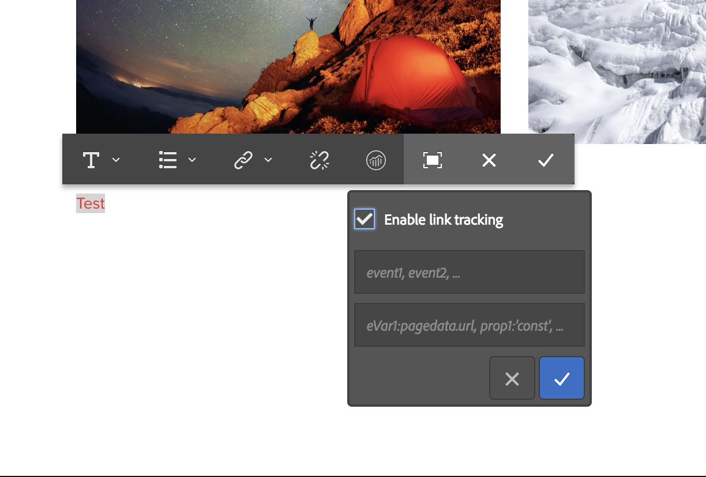

# 設定Adobe Analytics的連結追蹤{#configuring-link-tracking-for-adobe-analytics}

當使用者按一下您網站頁面上的連結時，您可以在Adobe Analytics中擷取相關資訊。 例如，使用連結追蹤來瞭解使用者如何與您的網站互動、追蹤檔案下載和追蹤退出連結。

## 為Adobe Analytics框架設定連結追蹤 {#configuring-link-tracking-for-an-adobe-analytics-framework}

1. 使用&#x200B;**導覽**，透過&#x200B;**部署**、**Cloud Service**&#x200B;前往&#x200B;**Adobe Analytics**&#x200B;區段。

1. 使用&#x200B;**顯示設定**，開啟必要的Adobe Analytics架構。
1. 展開&#x200B;**連結追蹤設定**&#x200B;區段，並視需要設定（此頁面提供進一步的詳細資料）：

   

## 追蹤檔案下載 {#tracking-file-downloads}

設定Adobe Analytics架構，將從關聯頁面下載的檔案自動追蹤為Adobe Analytics中的下載專案。 當您啟用下載追蹤時，只會追蹤您指定的檔案型別。

預設會追蹤下列檔案型別的下載：

* exe
* ZIP
* wav
* mp3
* mov
* mpg
* avi
* wmv
* doc
* PDF
* xls

舉例來說，若為PDF檔案啟用下載追蹤功能，則每當使用者按一下連結以PDF檔案時，就會追蹤PDF的下載。

架構的下載追蹤屬性已實作為針對頁面產生的`analytics.sitecatalyst.js`檔案中的程式碼。 下列程式碼範例代表預設的下載追蹤設定：

```
s.trackDownloadLinks= true;
s.linkDownloadFileTypes= 'exe,zip,wav,mp3,mov,mpg,avi,wmv,doc,pdf,xls';
```

若要為您的Adobe Analytics架構啟用下載追蹤：

1. [開啟Adobe Analytics架構並展開[連結追蹤設定]區段](#configuring-link-tracking-for-an-adobe-analytics-framework)。
1. 啟用&#x200B;**追蹤下載**。
1. 在&#x200B;**下載檔案型別**&#x200B;方塊中，輸入您要追蹤之檔案型別的副檔名。

## 追蹤外部連結 {#tracking-external-links}

您可以追蹤頁面上的外部連結（退出連結）點選次數。

若要追蹤Adobe Analytics架構的外部連結：

1. [開啟Adobe Analytics架構並展開&#x200B;**連結追蹤設定**&#x200B;區段](#configuring-link-tracking-for-an-adobe-analytics-framework)。
1. 根據您的要求設定以下屬性。

點選外部連結時追蹤的屬性：

* **追蹤外部**
啟用外部連結追蹤。

* **外部篩選器**
（選用）定義符合連結目標外部URL的篩選器。 當連結目標符合篩選器時，就會追蹤連結。 外部篩選器適合用來追蹤頁面上的部分外部連結。

  若要指定要追蹤的外部連結，請輸入連結目標的全部或部分URL。 請使用逗號分隔多個篩選器。 將字串常值括在單引號中。 沒有值（預設值`''`，兩個單引號）會導致追蹤所有外部連結。

* **內部篩選器**
定義符合內部連結URL的篩選器。 當連結鎖定符合此篩選器的URL時，將不會追蹤連結。 預設值是一個javascript命令，它會傳回目前視窗位址的URL主機名稱。

  若要指定未追蹤的內部連結，請輸入連結目標的全部或部分內部URL。 請使用逗號分隔多個篩選器。 將字串常值括在單引號中。

  預設值為`'javascript:,'+window.location.hostname`

* **保留查詢字串**
在評估與內部和外部篩選器的比對時包含URL引數。

  如果要在根據外部和內部篩選器評估連結目標URL時包含URL引數，請啟用。

外部連結追蹤屬性已實作為針對頁面產生的`analytics.sitecatalyst.js`檔案中的程式碼。 下列範常式式碼產生自與架構相關聯的頁面，此架構已透過下列設定啟用外部連結追蹤：

* 外部篩選器為`'google.com'`
* 內部篩選器是`'javascript:,'+window.location.hostname`的預設值
* 根據篩選條件評估連結目標時，未包含查詢字串。

```
s.trackExternalLinks= false;
s.linkExternalFilters= 'google.com';
s.linkInternalFilters= 'javascript:,'+window.location.hostname;
s.linkLeaveQueryString= false;
```

## 透過連結點選傳送變數資料 {#sending-variable-data-with-link-clicks}

您可以設定AEM，讓使用者按一下連結時，將事件和變數資料傳送至Adobe Analytics。 **連結追蹤設定**&#x200B;屬性可讓您指定要在發生連結點選時追蹤的Adobe Analytics事件和變數。

框架對應決定事件和變數值。 您可以將Adobe Analytics變數對應至內容元件的變數，這些變數會儲存您要在點按連結時追蹤的資料。

若要透過連結點選傳送變數資料：

1. [開啟Adobe Analytics架構並展開[連結追蹤設定]區段](#configuring-link-tracking-for-an-adobe-analytics-framework)。
1. 根據您的要求設定以下屬性。

透過連結點選傳送變數資料的屬性：

* **連結追蹤事件**
輸入您要用來計算連結點按次數的Adobe Analytics事件變數。

  請使用逗號分隔多個變數名稱。

  預設值`None`不會造成事件追蹤。

* **連結追蹤Var**
輸入您要在點按連結時傳送至Adobe Analytics的Adobe Analytics變數。 請使用逗號分隔多個變數名稱。

  預設值`None`不會傳送任何變數資料。

當您指定要傳送的事件和變數時，設定會在針對頁面產生的`analytics.sitecatalyst.js`檔案中實作為程式碼。 當架構追蹤`event10`事件和`prop4`屬性時，會產生下列頁面的範常式式碼：

```
s.linkTrackEvents= 'event10';
s.linkTrackVars= 'prop4';
```

## 連結追蹤設定範例 {#example-link-tracking-configuration}

執行以下程式，探索Adobe Analytics整合的連結追蹤行為。 程式會顯示來自[Adobe Marketing Cloud Debugger](https://experienceleague.adobe.com/docs/debugger/using/experience-cloud-debugger.html?lang=zh-Hant)的結果。

### 一般設定 {#general-configuration}

此範例說明對應在追蹤和Debugger環境中如何運作：

1. 開啟與網頁關聯的架構。
1. 將&#x200B;**Page**&#x200B;元件拖曳至框架的對映區域。 **頁面**&#x200B;元件屬於Sidekick中的&#x200B;**一般**&#x200B;元件群組。

   >[!NOTE]
   >
   >您應在實際案例中使用的元件取決於繼承自的元件（如果有的話）。
   >
   >如果您不該在該處公開自己的元件（透過在其頁面元件中定義分析子節點），

   從左側面板拖曳Analytics (SiteCatalyst)變數，根據下表設定對應：

<table>
 <tbody>
  <tr>
   <th>CQ變數<br /> </th>
   <th>變數瀏覽器<br />中的專案 </th>
   <th>Adobe Analytics變數</th>
  </tr>
  <tr>
   <td>pagedata.title</td>
   <td>自訂eVar1 (eVar1)</td>
   <td>EVAR1</td>
  </tr>
  <tr>
   <td>eventdata.events.pageView</td>
   <td>自訂1 (event1)</td>
   <td>event1</td>
  </tr>
 </tbody>
</table>

1. 將搜尋元件拖曳至框架的對映區域。 搜尋元件屬於Sidekick中的「一般」元件群組。 從左側面板拖曳Analytics (SiteCatalyst)變數，根據下表設定對應：

<table>
 <tbody>
  <tr>
   <th>CQ變數<br /> </th>
   <th>變數瀏覽器中的專案</th>
   <th>Adobe Analytics變數</th>
  </tr>
  <tr>
   <td>eventdata.keyword</td>
   <td>自訂eVar2 (eVar2)</td>
   <td>EVAR2</td>
  </tr>
  <tr>
   <td>eventdata.results</td>
   <td>自訂eVar3 (eVar3)</td>
   <td>EVAR3</td>
  </tr>
  <tr>
   <td>eventdata.events.search</td>
   <td>自訂2 (event2)</td>
   <td>event2</td>
  </tr>
 </tbody>
</table>

### 設定外部連結追蹤 {#configure-external-link-tracking}

1. 在您的架構中，展開&#x200B;**連結追蹤設定**&#x200B;區域。
1. 取消選取&#x200B;**追蹤下載**。

1. 選取&#x200B;**追蹤外部**。
1. 取消選取&#x200B;**保留查詢字串**。
1. 對&#x200B;**外部篩選器**&#x200B;清單使用以下值，將其識別為外部URL：

   `'yahoo.com'`

1. 將下列值新增至&#x200B;**連結追蹤事件**&#x200B;欄位：

   ```
       event1,event2
   ```

1. 將下列值新增至&#x200B;**連結追蹤vars**&#x200B;欄位：

   ```
       eVar1,eVar2
   ```

1. 在與框架關聯的頁面上，新增&#x200B;**Text**&#x200B;元件。 在&#x200B;**文字**&#x200B;元件內，新增指向下列位址的超連結：

   `https://search.yahoo.com/?p=this`

1. 切換至&#x200B;**預覽模式**&#x200B;並按一下連結。

使用Adobe Marketing Cloud Debugger檢視時，所進行的呼叫如下所示：


>[!NOTE]
>
>URL不包含查詢字串： `?p=this`

### 包含URL引數 {#include-the-url-parameter}

1. 在框架中，展開&#x200B;**連結追蹤設定**&#x200B;區域。
1. 啟用&#x200B;**保留查詢字串**。
1. 重新載入頁面預覽，然後按一下連結。

Adobe Marketing Cloud Debugger中顯示的呼叫詳細資訊類似於以下範例：


>[!NOTE]
>
>這次URL不包含查詢字串： `?p=this`

## 隨機連結追蹤 {#ad-hoc-link-tracking}

隨機連結追蹤可讓內容作者設定元件的連結追蹤。 元件的組態會覆寫框架的&#x200B;**連結追蹤組態**，所以在與框架關聯的頁面上，可以設定&#x200B;**Text**&#x200B;元件來連結追蹤URL。

隨選連結追蹤可讓您追蹤下載連結、外部連結，以及事件和變數資料。

若要啟用隨機連結追蹤，您需要：

* [將包含&#x200B;**Text**&#x200B;元件的頁面與架構](/help/sites-administering/adobeanalytics-connect.md#associating-a-page-with-a-adobe-analytics-framework)建立關聯。
* [設定Adobe Analytics架構以啟用隨機連結追蹤](#enabling-ad-hoc-link-tracking)。
* [設定文字元件的連結追蹤](#configuring-link-tracking-for-a-text-component)。

### 啟用隨機連結追蹤 {#enabling-ad-hoc-link-tracking}

設定您的Adobe Analytics框架以啟用隨機連結追蹤。

1. 開啟Adobe Analytics架構並展開&#x200B;**連結追蹤設定**&#x200B;區段。

1. 啟用&#x200B;**個人連結追蹤**。

   >[!NOTE]
   >
   >並非所有使用者型別都可以存取此核取方塊。 如果您需要存取權，請連絡您的網站管理員。

>[!NOTE]
>
>XSS Antisamy設定現在位於SLING中，位於路徑&#x200B;**/libs/sling/xss.config.xml**&#x200B;下，並且需要將下列規則新增到臨機操作中，才能正常連結：

#### 錨點標籤規則延伸 {#anchor-tag-rule-extension}

```xml
<attribute name="onclick">
    <literal-list>
        <literal value="CQ_Analytics.Sitecatalyst.customTrack(this)"/>
    </literal-list>
</attribute>
<attribute name="adhocenable">
    <literal-list>
        <literal value="true"/>
        <literal value="false"/>
    </literal-list>
</attribute>
<attribute name="adhocevents">
    <regexp-list>
        <regexp name="anything"/>
    </regexp-list>
</attribute>
<attribute name="adhocevars">
    <regexp-list>
        <regexp name="anything"/>
    </regexp-list>
</attribute>
```

### 設定文字元件的連結追蹤 {#configuring-link-tracking-for-a-text-component}

您必須先實作下列設定，才能為&#x200B;**文字**&#x200B;元件本身設定臨機連結追蹤：

* [Adobe Analytics架構已設定為啟用隨機連結追蹤](#enabling-ad-hoc-link-tracking)。
* 包含&#x200B;**Text**&#x200B;元件的[頁面與架構](/help/sites-administering/adobeanalytics-connect.md#associating-a-page-with-a-adobe-analytics-framework)相關聯。

使用以下程式設定&#x200B;**Text**&#x200B;元件的連結追蹤：

1. 以編輯模式開啟頁面，並編輯&#x200B;**Text**&#x200B;元件。

1. 選取要當作超文字使用的文字，然後按一下「超連結」按鈕。

   

1. 在「連結至」方塊中新增目標URL，然後展開「連結追蹤」區域。

   >[!NOTE]
   >
   >自訂連結追蹤會以個別動作顯示，位於連結/取消連結動作（Analytics圖示）旁。
   >
   >只有當您在RTE中選取有效的連結時，才會啟用它。

   

1. 啟用&#x200B;**自訂連結追蹤**&#x200B;以覆寫Adobe Analytics架構的連結追蹤設定，並啟用目前連結的連結追蹤。

1. （選用）若要追蹤連結點選的事件，請在&#x200B;**包含Adobe Analytics變數**&#x200B;欄位中新增Adobe Analytics事件名稱。 以逗號分隔多個事件名稱，例如

   `event1, event22`。

1. （選用）若要透過連結點選追蹤變數資料，請在&#x200B;**包含Adobe Analytics變數**&#x200B;欄位中新增Adobe Analytics變數。 請使用下列其中一種格式：

   * *`<Variable-name>`*: *`<Dynamic Value>`*
   * *`<Variable-name>`*: *`'CONSTANT'`*

   以下範例說明每種格式：

   * `eVar10:pagedata.title`
   * `prop1: 'Aubergine'`

   請使用逗號分隔多個值。

1. 選取&#x200B;**確定**。
