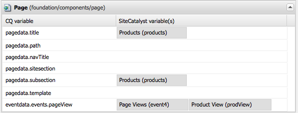

# 將元件資料與Adobe Analytics屬性對應{#mapping-component-data-with-adobe-analytics-properties}

將元件新增至架構，以收集要傳送至Adobe Analytics的資料。 旨在收集分析資料的元件會將資料儲存在適當的 **CQ變數**. 將這類元件新增至架構時，架構會顯示CQ變數清單，以便您能將每個變數 **Analytics變數**.

當 **AEM檢視** 開啟Analytics變數，該變數會出現在內容尋找器中。

您可以使用相同的 **CQ變數**.

當頁面載入且符合下列條件時，會將對應的資料傳送至Adobe Analytics:

* 頁面與框架相關聯。
* 頁面使用新增至架構的元件。

請依照下列程式，將CQ元件變數與Adobe Analytics報表屬性對應。

1. 在 **AEM檢視**，將追蹤元件從sidekick拖曳至架構。 例如，拖曳 **頁面** 元件元件 **一般** 類別。

   

   有數個預設元件群組： **一般**, **商務**, **社群**, **Search&amp;Promote**，和 **其他**. 您的AEM例項可設定為顯示不同的群組和元件。

1. 若要使用元件中定義的變數對應Adobe Analytics變數，請拖曳 **Analytics變數** 從內容尋找器到追蹤元件上的欄位。 例如，拖曳 `Page Name (pageName)` to `pagedata.title`.

   

   >[!NOTE]
   >
   >為架構選取的報表套裝ID(RSID)會決定內容尋找器中顯示的Adobe Analytics變數。

1. 對其他元件和變數重複前兩個步驟。

   >[!NOTE]
   >
   >您可以對應多個Analytics變數(例如 `props`, `eVars`, `events`)至相同的CQ變數(例如 `pagedata.title`)

   >[!CAUTION]
   >
   >強烈建議：
   >
   >* `eVars` 和 `props` 會對應至以下任一項開頭的CQ變數 `pagedata.X` 或 `eventdata.X`
   >* 而事件應對應至以 `eventdata.events.X`

1. 若要讓架構可在網站的發佈例項上使用，請開啟 **頁面** sidekick標籤，然後按一下 **啟動框架。**

## 對應產品相關變數 {#mapping-product-related-variables}

AEM會使用慣例來命名原本要對應至Adobe Analytics產品相關屬性的產品相關變數和事件：

| CQ變數 | Analytics變數 | 說明 |
|--- |--- |--- |
| `product.category` | `product.category` （轉換變數） | 產品類別。 |
| `product.sku` | `product.sku` （轉換變數） | 產品SKU。 |
| `product.quantity` | `product.quantity` （轉換變數） | 要購買的產品數量。 |
| `product.price` | `product.price` （轉換變數） | 產品價格。 |
| `product.events.<eventName>` | 與報表中的產品建立關聯的成功事件。 | `product.events` 是 *eventName。* |
| `product.evars.<eVarName>` | 轉換變數( `eVar`)來與產品建立關聯。 | `product.evars` 是eVar變數的前置詞，命名為 *eVarName。* |

數個AEM Commerce元件會使用這些變數名稱。

>[!NOTE]
>
>請勿將Adobe Analytics產品屬性對應至CQ變數。 如表所述，設定產品相關對應實際上等同於對應產品變數。

### 檢查Adobe Analytics報表 {#checking-reports-on-adobe-analytics}

1. 使用提供給AEM的相同憑證登入Adobe Analytics網站。
1. 請確定選取的RSID是前述步驟中使用的RSID。
1. 在 **報表** （在頁面左側）選取 **自訂轉換**，然後 **自訂轉換1-10** 並選取對應的變數 `eVar7`

1. 根據您使用的Adobe Analytics版本，您平均需要等待45分鐘，報表才會更新為使用搜尋詞；例如茄子

## 搭配Adobe Analytics架構使用內容尋找器(cf#) {#using-the-content-finder-cf-with-adobe-analytics-frameworks}

起初，當您開啟Adobe Analytics架構時，內容尋找器會在下方包含預先定義的Analytics變數：

* 流量
* 轉換
* 事件

當選取RSID時，屬於該RSID的所有變數都會新增至清單。\
此 `cf#` 需要，才能將Analytics變數對應至不同追蹤元件上顯示的CQ變數。 請參閱設定基本追蹤的架構。

根據為架構選取的檢視，內容尋找器將由Analytics變數(在AEM檢視中)或CQ變數（在Analytics檢視中）填入。

可透過下列方式操作清單：

1. 登入時 **AEM檢視**，您可以根據使用3個篩選按鈕選取的變數類型來篩選清單：

   * 若 *無按鈕* ，清單中會顯示完整清單。
   * 若 **流量** 按鈕時，清單只會顯示屬於「流量」區段的變數。
   * 若 **轉換** 按鈕時，清單只會顯示屬於「轉換」區段的變數。
   * 若 **事件** 按鈕時，清單只會顯示屬於「事件」區段的變數。

   >[!NOTE]
   >
   >一次只能有一個活動的篩選按鈕。

   >[!NOTE]
   >
   >Search&amp;Promote變數也屬於「轉換」區段。

   1. 清單也具有搜尋功能，可根據在搜尋欄位中輸入的文字來篩選元素。
   1. 如果在搜尋清單中的元素時啟用了篩選選項，則系統也會根據使用中按鈕來篩選顯示的結果。
   1. 您可以隨時使用旋轉箭頭按鈕重新載入清單。
   1. 若在架構上選取了多個RSID，則清單中的所有變數將會使用所選RSID內使用的所有標籤來顯示。

1. 在Adobe Analytics檢視中時，「內容尋找器」會顯示屬於拖曳至CQ檢視中的追蹤元件的所有CQ變數。

   * 例如，在 **下載元件** 是 *只有一個* 在CQ檢視中（有兩個可映射的變數） *eventdata.downloadLink* 和 *eventdata.events.startDownload*)，則內容尋找器在切換至Adobe Analytics檢視時會如下所示：

   

   * 這些變數可拖放至屬於3個變數區段其中之一的任何Adobe Analytics變數(**流量**, **轉換** 和 **事件**)。

   * 在CQ檢視中將新追蹤元件拖曳至架構時，屬於元件的CQ變數會自動新增至Adobe Analytics檢視的「內容尋找器」(cf#)。
   >[!NOTE]
   >
   >任何指定時間都只能將一個CQ變數對應至Adobe Analytics變數。

## 使用AEM檢視和Analytics檢視 {#using-aem-view-and-analytics-view}

在任何指定時間，使用者都可以選擇在架構頁面上時，在2種檢視Adobe Analytics對應的方式之間切換。 這2個檢視從2個不同的角度提供框架內對應的更佳概覽。

### AEM檢視 {#aem-view}

以上圖為例， **AEM檢視** 具有下列屬性：

1. 這是框架開啟時的預設視圖。
1. 左側：內容尋找器(cf#)是根據所選RSID由Adobe Analytics變數填入。
1. 標籤標題(**AEM檢視** 和 **Analytics檢視**):使用這些來切換兩個檢視。

1. **AEM檢視**:

   1. 如果框架具有從其父級繼承的元件，則這些元件和映射到這些元件的變數將列在此處。

      1. 繼承的元件被鎖定。
      1. 要解鎖繼承的元件，只需按兩下元件名稱旁的掛鎖
      1. 要恢復繼承，必須刪除未鎖定的元件；之後，它將重新獲得其鎖定地位。
   1. **拖曳元件至此處，將其納入分析架構**:可從Sidekick拖曳元件並放置在此處。
   1. 您可以找到分析架構中目前包含的所有元件：

      1. 若要新增元件，請從sidekick的「元件」標籤中拖曳一個元件
      1. 要刪除元件及其所有映射，請從元件的上下文菜單中選擇「刪除」，然後在確認對話框上接受刪除。
      1. 請記住，元件只能從其建立的架構中刪除，而無法從傳統意義上的子架構中刪除（只能覆蓋）。

### 分析檢視 {#analytics-view}

1. 此檢視可透過切換至 **Analytics檢視** 頁簽。
1. 左側：根據拖曳至CQ檢視中架構的元件，由CQ變數填入的內容尋找器(cf#)。
1. 標籤標題(**AEM檢視** 和 **Analytics檢視**):使用這些來切換兩個檢視。

1. 三個表格（流量、轉換、事件）列出所有可用的Adobe Analytics變數。 屬於選取的RSID。 此處顯示的對應應與AEM檢視中的對應相同：

   * **流量**:

      * 流量變數( `prop1`)對應至CQ變數( `eventdata.downloadLink`)

      * 當元件旁邊有掛鎖時，這表示它繼承自父框架，因此無法編輯
   * **轉換**:

      * 轉換變數( `eVar1`)對應至CQ變數( `pagedata.title`)

      * 轉換變數( `eVar3`)已內嵌地對應至已新增的javascript運算式，方法是連按兩下CQ變數欄位並手動輸入程式碼
   * **Event**:

      * 事件變數( `event1`)對應至CQ事件( `eventdata.events.pageView`)

>[!NOTE]
>
>任何表格的CQ變數欄也可以內嵌填入，方法是連按兩下欄位並新增文字。 這些欄位接受javascript作為輸入。
>
>例如，在 `prop3` 您可以新增：
>     `'`* `Adobe:'+pagedata.title+':'+pagedata.sitesection`\
若要傳送 *標題* 與其串連的頁面 *sitesection* 使用 *:* （冒號）和前置詞為 *Adobe* as `prop3`

>[!CAUTION]
任何指定時間都只能將一個CQ變數對應至Adobe Analytics變數。
