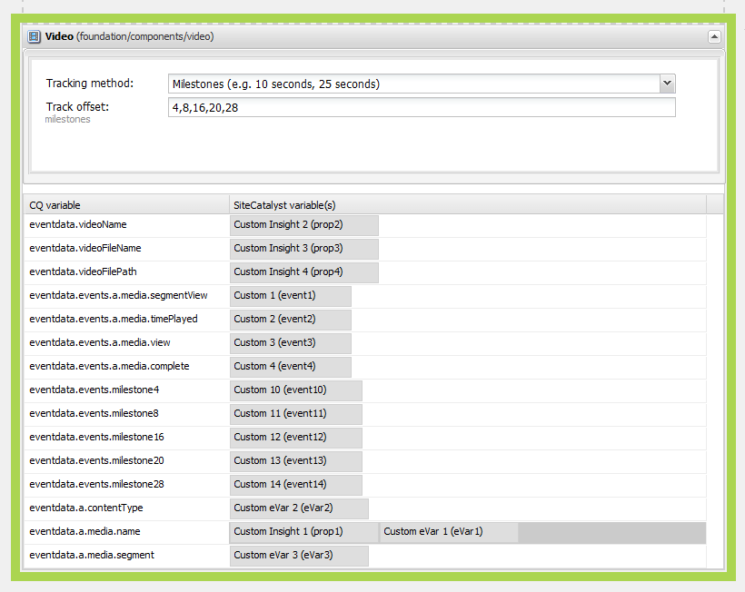

# 設定Adobe Analytics的視訊追蹤{#configuring-video-tracking-for-adobe-analytics}

有數種方法可用來追蹤視訊事件，其中2種是舊版Adobe Analytics的舊版選項。 以下是舊版選項：舊里程碑和舊秒。

>[!NOTE]
>
>繼續之前，請確定您有 **播放影片** 在AEM中上傳。
>
>若要確保您的影片在頁面上播放，請參閱 **[本教學課程](/help/sites-authoring/default-components-foundation.md#video)** 以了解如何在AEM中轉碼視訊檔案。

請依照下列步驟，使用每個方法來設定視訊追蹤的架構。

>[!NOTE]
>
>若為新實作，建議您 **未使用** 視訊追蹤的舊版選項。 請使用 **里程碑** 方法。

## 常見步驟 {#common-steps}

1. 將 **視訊元件** 從sidekick新增可播放項目 **視訊作為資產** 對於元件

1. [建立Adobe Analytics設定和架構](/help/sites-administering/adobeanalytics.md).

   * 後面各節中的範例會使用名稱 **my-sc-configuration** 的設定和 **videow** 框架。

1. 在架構頁面上，選取RSID並將使用情形設為全部。 ([https://localhost:4502/cf#/etc/cloudservices/sitecatalyst/videoconf/videofw.html](https://localhost:4502/cf#/etc/cloudservices/sitecatalyst/videoconf/videofw.html))
1. 從Sidekick中的「一般」元件類別，將視訊元件拖曳至架構上。
1. 選取追蹤方法：

   * [里程碑](/help/sites-administering/adobeanalytics.md)
   * [非舊式里程碑](/help/sites-administering/adobeanalytics.md)
   * [舊里程碑](/help/sites-administering/adobeanalytics.md)
   * [舊秒數](/help/sites-administering/adobeanalytics.md)

1. 選取追蹤方法時，CQ變數清單會隨之變更。 請使用下方的區段，了解如何進一步設定元件，以及將CQ變數與Adobe Analytics屬性對應。

## 里程碑 {#milestones}

Milestones方法可追蹤視訊的最多資訊、高度可自訂，且易於設定。

若要使用里程碑方法，請指定以時間為基礎的追蹤位移以定義里程碑。 當視訊播放超過里程碑時，頁面會呼叫Adobe Analytics以追蹤事件。 元件會針對您定義的每個里程碑建立CQ變數，您可將其對應至Adobe Analytics屬性。 這些CQ變數的名稱會使用下列格式：

```shell
eventdata.events.milestoneXX
```

XX尾碼是定義里程碑的追蹤位移。 例如，指定4、8、16、20和28秒的追蹤位移，會產生下列CQ變數：

* `eventdata.events.milestone4`
* `eventdata.events.milestone8`
* `eventdata.events.milestone16`
* `eventdata.events.milestone20`
* `eventdata.events.milestone28`

下表說明為Milestones方法提供的預設CQ變數：

<table>
 <tbody>
  <tr>
   <th>CQ變數</th>
   <th>Adobe Analytics屬性</th>
  </tr>
  <tr>
   <td>eventdata.videoName </td>
   <td>對應至此的變數將包含 <strong>用戶友好</strong> 名稱(<strong>標題</strong>)，若在DAM中設定；若未設定，則視訊為 <strong>檔案名</strong> 將會改為傳送。 播放視訊時，只傳送一次。</td>
  </tr>
  <tr>
   <td>eventdata.videoFileName </td>
   <td>映射到此變數的變數將包含檔案的名稱。 僅隨eventdata.events.a.media.view一起傳送 </td>
  </tr>
  <tr>
   <td>eventdata.videoFilePath </td>
   <td>映射到此的變數將包含伺服器上檔案的路徑。 僅隨eventdata.events.a.media.view一起傳送 </td>
  </tr>
  <tr>
   <td>eventdata.events.a.media.segmentView </td>
   <td>每次傳遞區段裡程碑時傳送 </td>
  </tr>
  <tr>
   <td>eventdata.events.a.media.timePlayed</td>
   <td>每次觸發里程碑時傳送，使用者觀看指定區段所花費的秒數也會隨此事件一併傳送。 例如eventX=21<br /> </td>
  </tr>
  <tr>
   <td>eventdata.events.a.media.view </td>
   <td>在初始化視訊檢視時傳送</td>
  </tr>
  <tr>
   <td>eventdata.events.a.media.complete </td>
   <td>視訊播放完成時傳送<br /> </td>
  </tr>
  <tr>
   <td>eventdata.events.milestoneX </td>
   <td>當指定的里程碑傳遞時，X代表裡程碑觸發的秒數<br /> </td>
  </tr>
  <tr>
   <td>eventdata.a.contentType </td>
   <td>在每個里程碑上傳送；在Adobe Analytics呼叫中顯示為pev3，通常為「video」傳送<br /> </td>
  </tr>
  <tr>
   <td>eventdata.a.media.name </td>
   <td>完全符合eventdata.videoName </td>
  </tr>
  <tr>
   <td>eventdata.a.media.segment </td>
   <td>包含已檢視區段的相關資訊，例如2:O:4-8 </td>
  </tr>
 </tbody>
</table>

>[!NOTE]
>
>您可以設定視訊的 **用戶友好** 在DAM中開啟要編輯的影片並設定 **標題** 中繼資料欄位至所需名稱。

1. 選取里程碑作為追蹤方法後，在「追蹤位移」方塊中，輸入以逗號分隔的追蹤位移清單（以秒為單位）。 例如，下列值會在視訊開始後的4、8、16、20和28秒定義里程碑：

   ```xml
   4,8,16,20,24
   ```

   偏移值必須是大於0的整數。 預設值為 `10,25,50,75`。

1. 若要將CQ變數對應至Adobe Analytics屬性，請從元件上CQ變數旁的ContentFinder拖曳Adobe Analytics屬性。

   如需關於最佳化對應的資訊，請參閱 [在Adobe Analytics測量視訊](https://experienceleague.adobe.com/docs/media-analytics/using/media-overview.html) 指南。

1. [添加框架](/help/sites-administering/adobeanalytics.md) 到頁面。
1. 若要在 **預覽模式**，播放影片以取得Adobe Analytics呼叫以觸發。

後面的Adobe Analytics追蹤資料範例適用於「里程碑」追蹤，使用4,8,16,20和24的追蹤位移，以及CQ變數的下列對應：

<table>
 <tbody>
  <tr>
   <th>CQ 變數</th>
   <th>Adobe Analytics屬性</th>
  </tr>
  <tr>
   <td>eventdata.videoName </td>
   <td>prop2</td>
  </tr>
  <tr>
   <td>eventdata.videoFileName </td>
   <td>prop3 </td>
  </tr>
  <tr>
   <td>eventdata.videoFilePath </td>
   <td>prop4</td>
  </tr>
  <tr>
   <td>eventdata.events.a.media.segmentView </td>
   <td>event1</td>
  </tr>
  <tr>
   <td>eventdata.events.a.media.timePlayed</td>
   <td>event2<br /> </td>
  </tr>
  <tr>
   <td>eventdata.events.a.media.view </td>
   <td>event3</td>
  </tr>
  <tr>
   <td>eventdata.events.a.media.complete </td>
   <td>event4<br /> </td>
  </tr>
  <tr>
   <td>eventdata.events.milestone4</td>
   <td>event10</td>
  </tr>
  <tr>
   <td>eventdata.events.milestone8</td>
   <td>event11</td>
  </tr>
  <tr>
   <td>eventdata.events.milestone16</td>
   <td>event12</td>
  </tr>
  <tr>
   <td>eventdata.events.milestone20</td>
   <td>event13</td>
  </tr>
  <tr>
   <td>eventdata.events.milestone24</td>
   <td>event14</td>
  </tr>
  <tr>
   <td>eventdata.a.contentType </td>
   <td>eVar3</td>
  </tr>
  <tr>
   <td>eventdata.a.media.name </td>
   <td>eVar1, prop1 </td>
  </tr>
  <tr>
   <td>eventdata.a.media.segment </td>
   <td>eVar2</td>
  </tr>
 </tbody>
</table>

在此範例中，Video元件會在架構頁面上顯示如下：



>[!NOTE]
>
>若要查看對Adobe Analytics進行的呼叫，請使用適當的工具，例如DigitalPulse除錯程式或Fiddler。

使用提供的範例呼叫Adobe Analytics，在使用DigitalPulse除錯程式檢視時應該看起來像這樣：


*這是&#x200B;**首次呼叫**加到Adobe Analytics，其中包含下列值：*

* *eventdata.a.media.name的prop1和eVar1,*
* *prop2-4，以及包含contentType（視訊）和segment(1)的eVar2和eVar3:O:1-4)*
* *event3，已對應至eventdata.events.a.media.view。*


*這是&#x200B;**第三呼叫**加至Adobe Analytics:*

* *prop1和eVar1包含a.media.name;*
* *event1，因為已檢視區段*
* *播放時間時傳送的event2 = 4*
* *event11已傳送，因為已到達eventdata.events.milestone8*
* *prop2至4未傳送（因為eventdata.events.a.media.view未觸發）*

## 非舊式里程碑 {#non-legacy-milestones}

非舊式里程碑方法與里程碑方法類似，但里程碑是使用追蹤長度的百分比定義。 共性如下：

* 當視訊播放超過里程碑時，頁面會呼叫Adobe Analytics以追蹤事件。
* 此 [CQ變數的靜態集](#cqvars) 定義以與Adobe Analytics屬性對應。
* 元件會針對您定義的每個里程碑建立CQ變數，您可將其對應至Adobe Analytics屬性。

這些CQ變數的名稱會使用下列格式：

XX尾碼是定義里程碑之追蹤長度的百分比。 例如，指定10、25、50和75的百分比會產生下列CQ變數：

* `eventdata.events.milestone10`
* `eventdata.events.milestone25`
* `eventdata.events.milestone50`
* `eventdata.events.milestone75`

```shell
eventdata.events.milestoneXX
```

1. 選取「非舊式里程碑」作為追蹤方法後，在「追蹤位移」方塊中，輸入以逗號分隔的追蹤長度百分比清單。 例如，下列預設值會以10、25、50和75%的追蹤長度定義里程碑：

   ```xml
   10,25,50,75
   ```

   偏移值必須是大於0的整數。

1. 若要將CQ變數對應至Adobe Analytics屬性，請從元件上CQ變數旁的ContentFinder拖曳Adobe Analytics屬性。

   如需關於最佳化對應的資訊，請參閱 [在Adobe Analytics測量視訊](https://experienceleague.adobe.com/docs/media-analytics/using/media-overview.html) 指南。

1. [添加框架](/help/sites-administering/adobeanalytics.md) 到頁面。
1. 若要在 **預覽模式**，播放影片以取得Adobe Analytics呼叫以觸發。

## 舊里程碑 {#legacy-milestones}

此方法類似Milestones方法，其差異為 *追蹤位移* 欄位是百分比，而非視訊中的設定點。

>[!NOTE]
>
>「追蹤位移」欄位只接受以逗號分隔的清單，清單中包含1到100之間的整數。

1. 設定「追蹤偏移」。

   * e.g.10,50,75,100

   此外，傳送至Adobe Analytics的資訊不易自訂；僅有3個變數可供對應：

<table>
 <tbody>
  <tr>
   <td>eventdata.videoName <br /> </td>
   <td>對應至此的變數將包含 <strong>用戶友好</strong> 名稱(<strong>標題</strong>)，若在DAM中設定；如果未設定標題，則視訊會 <strong>檔案名</strong> 將會改為傳送。 播放視訊時，只傳送一次。<br /> </td>
  </tr>
  <tr>
   <td>eventdata.videoFileName </td>
   <td>映射到此變數的變數將包含檔案的名稱。 播放視訊時，只傳送一次。</td>
  </tr>
  <tr>
   <td>eventdata.videoFilePath </td>
   <td>映射到此變數的變數將包含伺服器上的檔案路徑。 播放視訊時，只傳送一次。</td>
  </tr>
 </tbody>
</table>

>[!NOTE]
>
>您可以設定視訊的 **用戶友好** 在DAM中開啟要編輯的影片並設定 **標題** 中繼資料欄位至所需名稱。 您也需要儲存完成時所做的變更。

1. 將這些變數對應至prop 1至3

   此 **其他相關資訊** 將在呼叫中傳送串連至 **one** 變數已命名 **pev3**.

   **呼叫範例** 使用提供的範例來檢視Adobe Analytics時，使用DigitalPulse除錯程式檢視時應該如下所示：

   

   *此&#x200B;**pev3**在呼叫中傳送的變數包含下列資訊：*

   * *名稱*  — 視訊檔案的名稱(*film.avi*)

   * *長度*  — 視訊檔案的長度（以秒為單位）(*100*)

   * *播放器名稱*  — 用來播放視訊檔案的視訊播放器(*HTML5影片*)

   * *播放的總秒數*  — 播放視訊的總秒數(*25*)

   * *開始時間戳記*  — 識別視訊播放開始時間的時間戳記(*1331035567*)

   * *播放工作階段*  — 播放工作階段的詳細資訊。 此欄位指出使用者與視訊互動的方式。 這可能包括資料，例如他們開始播放視訊的位置、是否使用視訊滑桿來前進視訊，以及停止播放視訊的位置(*L10E24S58L58 — 秒停止視訊。 第L10節的第25節，然後跳到秒。 48*)

## 舊秒 {#legacy-seconds}

使用**舊秒**方法時，Adobe Analytics呼叫會每隔N秒觸發一次，其中N會在追蹤位移欄位中指定。

1. 將「追蹤位移」設為任何秒數，

   * 例如6
   >[!NOTE]
   >
   >「追蹤位移」欄位僅接受大於0的整數

   傳送至Adobe Analytics的資訊不易自訂。 只有3個變數可用於對應：

<table>
 <tbody>
  <tr>
   <td>eventdata.videoName <br /> </td>
   <td>對應至此的變數將包含 <strong>用戶友好</strong> 名稱(<strong>標題</strong>)，若在DAM中設定；如果未設定標題，則視訊會 <strong>檔案名</strong> 將會改為傳送。 播放視訊時，只傳送一次。<br /> </td>
  </tr>
  <tr>
   <td>eventdata.videoFileName </td>
   <td>對應至此的變數將包含檔案的名稱。 播放視訊時，只傳送一次。</td>
  </tr>
  <tr>
   <td>eventdata.videoFilePath </td>
   <td>映射到此變數的變數將包含伺服器上的檔案路徑。 播放視訊時，只傳送一次。</td>
  </tr>
 </tbody>
</table>

>[!NOTE]
>
>您可以設定視訊的 **用戶友好** 在DAM中開啟要編輯的影片並設定 **標題** 中繼資料欄位至所需名稱。 您也需要儲存完成時所做的變更。

1. 將這些變數對應至prop1、prop2和prop3

   此 **其他相關資訊** 會將呼叫中的 **one** 變數已命名 **pev3**.

   使用提供的範例呼叫Adobe Analytics，在使用DigitalPulse除錯程式檢視時應該看起來像這樣：

   

   *呼叫類似於上述的舊版里程碑呼叫。 請參閱pev3的資訊&#x200B;**[提供](/help/sites-administering/adobeanalytics.md)**.*

**本教學課程中使用的參考：**

[0] [https://experienceleague.adobe.com/docs/media-analytics/using/media-overview.html](https://experienceleague.adobe.com/docs/media-analytics/using/media-overview.html)
