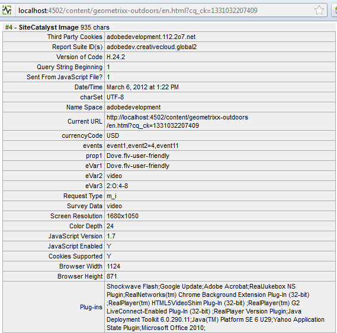

# 設定Adobe Analytics的視訊追蹤{#configuring-video-tracking-for-adobe-analytics}

有數種可追蹤視訊事件的方法，其中2種是舊版Adobe Analytics的舊版選項。 這些舊版選項包括：舊里程碑和舊秒數。

>[!NOTE]
>
>繼續之前，請確定** **您已在AEM中上傳** **可播放的視訊。

>若要確保您的影片在頁面上播放，請參 **[閱本教學課程](/help/sites-authoring/default-components-foundation.md#video)**，以取得如何在AEM中轉碼影片檔的詳細資訊。

請依照下列步驟，使用每個方法來設定視訊追蹤的架構。

>[!NOTE]
>
>對於新實作，建議您不 **要使用** 「舊版」視訊追蹤選項。 請改用 **Milestones** 方法。

## 常見步驟 {#common-steps}

1. 將視訊元件從側腳拖曳 **並新增可播放的視訊作為元** 件的資產 **** ，以設定網頁

1. [建立Adobe Analytics組態和架構](/help/sites-administering/adobeanalytics.md)。

   * 以下各節中的示例使用 **my-sc-configuration** ，用於配置框架， **videof** 。

1. 在框架頁面上，選擇一個RSID並將用法設為全部。 ([https://localhost:4502/cf#/etc/cloudservices/sitecatalyst/videoconf/videofw.html](https://localhost:4502/cf#/etc/cloudservices/sitecatalyst/videoconf/videofw.html))
1. 從Sidekick的「一般」元件類別，將視訊元件拖曳至架構上。
1. 選取追蹤方法：

   * [里程碑](/help/sites-administering/adobeanalytics.md)
   * [非舊式里程碑](/help/sites-administering/adobeanalytics.md)
   * [舊里程碑](/help/sites-administering/adobeanalytics.md)
   * [舊秒數](/help/sites-administering/adobeanalytics.md)

1. 當您選取追蹤方法時，CQ變數的清單會隨之變更。 請使用下列章節，以取得進一步設定元件以及使用Adobe Analytics屬性映射CQ變數的相關資訊。

## Milestones {#milestones}

Milestones方法可追蹤視訊的最多資訊，而且可高度自訂，而且易於設定。

若要使用里程碑方法，請指定基於時間的追蹤偏移來定義里程碑。 當視訊播放通過里程碑時，頁面會呼叫Adobe Analytics以追蹤事件。 對於您定義的每個里程碑，元件會建立CQ變數，您可以將其對應至Adobe Analytics屬性。 這些CQ變數的名稱使用下列格式：

```shell
eventdata.events.milestoneXX
```

XX字尾是定義里程碑的軌道偏移。 例如，指定4、8、16、20和28秒的追蹤偏移，會產生下列CQ變數：

* `eventdata.events.milestone4`
* `eventdata.events.milestone8`
* `eventdata.events.milestone16`
* `eventdata.events.milestone20`
* `eventdata.events.milestone28`

下表說明為Milestones方法提供的預設CQ變數：

<table>
 <tbody>
  <tr>
   <th>CQ變數</th>
   <th>Adobe Analytics屬性</th>
  </tr>
  <tr>
   <td>eventdata.videoName </td>
   <td>若在DAM中設定，則映射 <strong>至此變數的變數將包含視訊的</strong> (<strong>Title</strong>)使用者友好名稱；如果未設定，則會改 <strong>為傳送視訊</strong> 的檔案名稱。 播放視訊時，只傳送一次。</td>
  </tr>
  <tr>
   <td>eventdata.videoFileName </td>
   <td>映射到此變數的變數將包含檔案的名稱。 僅隨eventdata.events.a.media.view一起傳送 </td>
  </tr>
  <tr>
   <td>eventdata.videoFilePath </td>
   <td>映射到此變數的變數將包含檔案在伺服器上的路徑。 僅隨eventdata.events.a.media.view一起傳送 </td>
  </tr>
  <tr>
   <td>eventdata.events.a.media.segmentView </td>
   <td>每次傳遞區段裡程碑時傳送 </td>
  </tr>
  <tr>
   <td>eventdata.events.a.media.timePlayed</td>
   <td>每當觸發里程碑時傳送，使用者觀看指定區段所花費的秒數也會隨此事件傳送。 例如eventX=21<br /> </td>
  </tr>
  <tr>
   <td>eventdata.events.a.media.view </td>
   <td>在初始化視訊檢視時傳送</td>
  </tr>
  <tr>
   <td>eventdata.events.a.media.complete </td>
   <td>視訊播放完成時傳送<br /> </td>
  </tr>
  <tr>
   <td>eventdata.events.milestoneX </td>
   <td>在指定里程碑傳遞時傳送，X代表裡程碑觸發的秒數<br /> </td>
  </tr>
  <tr>
   <td>eventdata.a.contentType </td>
   <td>每個里程碑都傳送；在Adobe Analytics呼叫中顯示為pev3，通常以「視訊」傳送<br /> </td>
  </tr>
  <tr>
   <td>eventdata.a.media.name </td>
   <td>完全符合eventdata.videoName </td>
  </tr>
  <tr>
   <td>eventdata.a.media.segment </td>
   <td>包含已檢視之區段的相關資訊，例如2:O:4-8 </td>
  </tr>
 </tbody>
</table>

>[!NOTE]
>
>您可以在DAM中開啟視訊 **以進行編輯** ，並將「標題 **** 」中繼資料欄位設定為所需名稱，以設定視訊的使用者友好名稱。

1. 選擇里程碑作為追蹤方法後，在「追蹤偏移」方塊中，以秒為單位輸入以逗號分隔的追蹤偏移清單。 例如，下列值定義視訊開始後4、8、16、20和28秒的里程碑：

   ```xml
   4,8,16,20,24
   ```

   偏移值必須是大於0的整數。 預設值為 `10,25,50,75`。

1. 若要將CQ變數對應至Adobe Analytics屬性，請從元件上CQ變數旁的ContentFinder拖曳Adobe Analytics屬性。

   如需最佳化映射的詳細資訊，請參 [閱Adobe Analytics中的測量視訊](https://marketing.adobe.com/resources/help/en_US/sc/appmeasurement/hbvideo/video_overview.html) 。

1. [將架構新增](/help/sites-administering/adobeanalytics.md) 至頁面。
1. 若要在「預覽」模式中測 **試設定**，請播放影片以取得要觸發的Adobe Analytics呼叫。

後續的Adobe Analytics追蹤資料範例適用於使用4,8,16,20和24的追蹤偏移來追蹤里程碑，以及CQ變數的下列對應：

<table>
 <tbody>
  <tr>
   <th>CQ 變數</th>
   <th>Adobe Analytics屬性</th>
  </tr>
  <tr>
   <td>eventdata.videoName </td>
   <td>prop2</td>
  </tr>
  <tr>
   <td>eventdata.videoFileName </td>
   <td>prop3 </td>
  </tr>
  <tr>
   <td>eventdata.videoFilePath </td>
   <td>prop4</td>
  </tr>
  <tr>
   <td>eventdata.events.a.media.segmentView </td>
   <td>event1</td>
  </tr>
  <tr>
   <td>eventdata.events.a.media.timePlayed</td>
   <td>event2<br /> </td>
  </tr>
  <tr>
   <td>eventdata.events.a.media.view </td>
   <td>event3</td>
  </tr>
  <tr>
   <td>eventdata.events.a.media.complete </td>
   <td>event4<br /> </td>
  </tr>
  <tr>
   <td>eventdata.events.milestone4</td>
   <td>event10</td>
  </tr>
  <tr>
   <td>eventdata.events.milestone8</td>
   <td>event11</td>
  </tr>
  <tr>
   <td>eventdata.events.milestone16</td>
   <td>event12</td>
  </tr>
  <tr>
   <td>eventdata.events.milestone20</td>
   <td>event13</td>
  </tr>
  <tr>
   <td>eventdata.events.milestone24</td>
   <td>event14</td>
  </tr>
  <tr>
   <td>eventdata.a.contentType </td>
   <td>eVar3</td>
  </tr>
  <tr>
   <td>eventdata.a.media.name </td>
   <td>eVar1、prop1 </td>
  </tr>
  <tr>
   <td>eventdata.a.media.segment </td>
   <td>eVar2</td>
  </tr>
 </tbody>
</table>

在此範例中，視訊元件會如下顯示在架構頁面上：


>[!NOTE]
>
>若要查看對Adobe Analytics的呼叫，請使用適當的工具，例如DigitalPulse除錯程式或Fiddler。

使用提供範例的Adobe Analytics呼叫在使用DigitalPulse除錯程式檢視時，應如下所示：


*這是對Adobe **Analytics進行的第**一次呼叫，其中包含下列值：*

* *eventdata.a.media.name、*
* *props2-4，以及包含contentType(video)和segment(1:O:1-4)的eVar2和eVar3*
* *event3，此事件3已對應至eventdata.events.a.media.view。*



*這是對Adobe **Analytics進行的第**3次呼叫：*

* *prop1和eVar1包含a.media.name;*
* *event1，因為已檢視區段*
* *event2已傳送，播放時間= 4*
* *event11已傳送，因為已到達eventdata.events.milestone8*
* *prop2至4不會傳送（因為未觸發eventdata.events.a.media.view）*

## 非舊式里程碑 {#non-legacy-milestones}

「非舊有里程碑」方法與「里程碑」方法類似，但里程碑是使用追蹤長度的百分比定義。 共性如下：

* 當視訊播放通過里程碑時，頁面會呼叫Adobe Analytics以追蹤事件。
* 為 [與Adobe Analytics屬性對應而定義的CQ變數的靜態集](#cqvars) 。
* 對於您定義的每個里程碑，元件會建立CQ變數，您可以將其對應至Adobe Analytics屬性。

這些CQ變數的名稱使用下列格式：

XX字尾是定義里程碑的追蹤長度百分比。 例如，指定10、25、50和75的百分比會產生下列CQ變數：

* `eventdata.events.milestone10`
* `eventdata.events.milestone25`
* `eventdata.events.milestone50`
* `eventdata.events.milestone75`

```shell
eventdata.events.milestoneXX
```

1. 選擇「非舊式里程碑」作為追蹤方法後，在「追蹤偏移」方塊中，輸入以逗號分隔的追蹤長度百分比清單。 例如，下列預設值會定義10、25、50和75%追蹤長度的里程碑：

   ```xml
   10,25,50,75
   ```

   偏移值必須是大於0的整數。

1. 若要將CQ變數對應至Adobe Analytics屬性，請從元件上CQ變數旁的ContentFinder拖曳Adobe Analytics屬性。

   如需最佳化映射的詳細資訊，請參 [閱Adobe Analytics中的測量視訊](https://marketing.adobe.com/resources/help/en_US/sc/appmeasurement/hbvideo/video_overview.html) 。

1. [將架構新增](/help/sites-administering/adobeanalytics.md) 至頁面。
1. 若要在「預覽」模式中測 **試設定**，請播放影片以取得要觸發的Adobe Analytics呼叫。

## 舊里程碑 {#legacy-milestones}

此方法類似於Milestones方法，其差異在於，在 *Tracking offset* field中指定的里程碑是百分比，而非視訊中的設定點。

>[!NOTE]
>
>「追蹤偏移」欄位只接受逗號分隔的清單，清單中包含1到100之間的整數。

1. 設定「軌跡偏移」。

   * 例如10,50,75,100
   此外，傳送至Adobe Analytics的資訊可自訂性較低；僅有3個變數可用於映射：

<table>
 <tbody>
  <tr>
   <td>eventdata.videoName <br /> </td>
   <td>若在DAM中設定，則映射 <strong>至此變數的變數將包含視訊的</strong> (<strong>Title</strong>)使用者友好名稱；如果未設定「標題」，則會改 <strong>為傳送視訊的檔</strong> 案名稱。 播放視訊時，只傳送一次。<br /> </td>
  </tr>
  <tr>
   <td>eventdata.videoFileName </td>
   <td>映射到此變數的變數將包含檔案的名稱。 播放視訊時，只傳送一次。</td>
  </tr>
  <tr>
   <td>eventdata.videoFilePath </td>
   <td>映射到此變數的變數將包含檔案在伺服器上的路徑。 播放視訊時，只傳送一次。</td>
  </tr>
 </tbody>
</table>

>[!NOTE]
>
>您可以在DAM中開啟視訊 **以進行編輯** ，並將「標題 **** 」中繼資料欄位設定為所需名稱，以設定視訊的使用者友好名稱。 您還需要保存完成時所做的更改。

1. 將這些變數對應至prop 1至3

   呼 **叫中的其餘相關資訊** ，將串連至一個名為pev3 **的** 變 **數中**。

   **使用Digital** Pulse除錯程式檢視時，使用所提供範例對Adobe Analytics的範例呼叫應如下所示：

   

   *在呼&#x200B;**叫中傳送的**pev3變數包含下列資訊：*

   * *Name* —— 視訊檔案的名稱(*film.avi*)

   * *長度* -視訊檔案的長度，以秒為單位(*100*)

   * *播放器名稱* -用於播放視訊檔案的視訊播放器(*HTML5視訊*)

   * *播放秒數總計* -影片播放的秒數總計(*25*)

   * *開始時間戳記* -識別視訊播放開始時間的時間戳記(*1331035567*)

   * *播放作業* -播放作業的詳細資訊。 此欄位指出使用者與視訊的互動方式。 這可能包括資料，例如他們開始播放視訊的位置、他們是否使用視訊滑桿來推進視訊，以及他們停止播放視訊的位置(*L10E24S58L58 —— 視訊在秒內停止。 第10節的25節，然後跳至秒。 48*)

## 舊秒數 {#legacy-seconds}

使用**舊版秒數**方法時，Adobe Analytics呼叫會每隔N秒觸發一次，其中N會在「追蹤偏移」欄位中指定。

1. 將「追蹤偏移」設為任意秒數，

   * 例如6
   >[!NOTE]
   >
   >「追蹤偏移」欄位只接受大於0的整數

   傳送至Adobe Analytics的資訊無法自訂。 僅有3個可用於映射的變數：

<table>
 <tbody>
  <tr>
   <td>eventdata.videoName <br /> </td>
   <td>若在DAM中設定，則映射 <strong>至此變數的變數將包含視訊的</strong> (<strong>Title</strong>)使用者友好名稱；如果未設定「標題」，則會改 <strong>為傳送視訊的檔</strong> 案名稱。 播放視訊時，只傳送一次。<br /> </td>
  </tr>
  <tr>
   <td>eventdata.videoFileName </td>
   <td>映射到此變數的變數將包含檔案的名稱。 播放視訊時，只傳送一次。</td>
  </tr>
  <tr>
   <td>eventdata.videoFilePath </td>
   <td>映射到此變數的變數將包含檔案在伺服器上的路徑。 播放視訊時，只傳送一次。</td>
  </tr>
 </tbody>
</table>

>[!NOTE]
>
>您可以在DAM中開啟視訊 **以進行編輯** ，並將「標題 **** 」中繼資料欄位設定為所需名稱，以設定視訊的使用者友好名稱。 您還需要保存完成時所做的更改。

1. 將這些變數對應至prop1、prop2和prop3

   呼叫 **中的其餘相關資訊** ，將會連結至名為pev3的 **一** 個變數 **中**。

   使用提供範例的Adobe Analytics呼叫在使用DigitalPulse除錯程式檢視時，應如下所示：

   

   *此呼叫類似於上述的舊式里程碑呼叫。 請參閱此處提供的pev3 **[相關資訊](/help/sites-administering/adobeanalytics.md)**。*

**本教學課程中使用的參考：**

[0][https://marketing.adobe.com/resources/help/en_US/sc/appmeasurement/hbvideo/video_overview.html](https://marketing.adobe.com/resources/help/en_US/sc/appmeasurement/hbvideo/video_overview.html)
