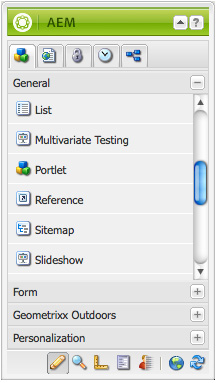

# AEM入口網站與入口網站{#aem-portals-and-portlets}

本檔案說明下列各項：

* AEM入口網站架構
* 管理和設定AEM as a portal
* 使用AEM作為入口網站
* 在Portlet （例如網頁伺服器）中安裝、設定和顯示AEM內容

## AEM入口網站架構 {#aem-portal-architecture}

AEM入口網站架構包含入口網站和portlet的定義。

### 什麼是入口網站？ {#what-is-a-portal}

入口網站是一種網頁應用程式，可提供個人化、單一登入、不同來源的內容整合，並代管資訊系統的展示層。

您可以在AEM中執行符合JSR 286規範的Portlet。 Portlet元件可讓您在頁面上內嵌Portlet。 請參閱[管理AEM內容Portlet](#administeringthecqcontentportlet)。

### 什麼是Portlet？ {#what-is-a-portlet}

Portlet是部署在產生動態內容的容器內的Web元件。 Portlet介面會封裝並部署為Portlet容器內的.war檔案。 如果您以入口網站形式執行AEM，則需要Portlet的.war檔案才能執行Portlet。

若要設定AEM內容顯示在入口網站中，請參閱[在Portlet中安裝、設定和使用AEM](#installingconfiguringandusingcqinaportlet)。

### AEM Portal Director {#aem-portal-director}

>[!CAUTION]
>
>AEM入口網站Director自AEM 6.4起已淘汰。請參閱[已過時和已移除的功能](https://helpx.adobe.com/tw/experience-manager/6-4/release-notes/deprecated-removed-features.html)。

## 管理AEM內容Portlet {#administering-the-aem-content-portlet}

AEM內容Portlet可讓您在入口網站中顯示AEM內容。 此Portlet可在`/crx-quickstart/opt/portal`取得，並可以各種方式自訂。 例如，您可以部署自己的驗證服務，產生AEM覆寫預設行為所需的驗證資訊，以自訂SSO/驗證處理。 外掛程式使用已定義的API，可讓您透過API建立外掛程式，以新增您自己的功能。 外掛程式可部署至執行中的Portlet。 若要正常運作，它需要AEM製作和發佈執行個體的設定，以及要在啟動時顯示的內容路徑。

部分設定可透過Portlet偏好設定進行變更，有些則可透過OSGi服務設定進行變更。 您可使用&#x200B;**config**&#x200B;檔案或OSGi Web主控台變更這些設定。

### Portlet喜好設定 {#portlet-preferences}

Portlet喜好設定可在部署入口網站伺服器時設定，或在部署Portlet Web應用程式之前編輯&#x200B;**WEB-INF/portlet.xml**&#x200B;檔案進行設定。 依預設，portlet.xml檔案會顯示如下：

```xml
<?xml version="1.0" encoding="UTF-8"?>
<portlet-app xmlns="https://java.sun.com/xml/ns/portlet/portlet-app_1_0.xsd"
             xmlns:xsi="https://www.w3.org/2001/XMLSchema-instance"
             xsi:schemaLocation="https://java.sun.com/xml/ns/portlet/portlet-app_1_0.xsd /opt/SUNWps/dtd/portlet.xsd"
             version="1.0">
   <portlet>
      <portlet-name>RSSWeatherPortlet</portlet-name>
      <portlet-class>org.jboss.portlet.weather.WeatherPortlet</portlet-class>
      <init-param>
         <name>default_zipcode</name>
         <value>05673</value>
      </init-param>
      <init-param>
         <name>RSS_XSL</name>
         <value>/WEB-INF/Rss.xsl</value>
      </init-param>
      <init-param>
         <name>base_url</name>
         <value>https://xml.weather.yahoo.com/forecastrss?p=</value>
      </init-param>
      <expiration-cache>180</expiration-cache>
      <supports>
         <mime-type>text/html</mime-type>
         <portlet-mode>VIEW</portlet-mode>
         <portlet-mode>EDIT</portlet-mode>
      </supports>
      <portlet-info>
         <title>Weather Portlet</title>
      </portlet-info>
      <portlet-preferences>
         <preference>
            <name>expires</name>
            <value>180</value>
         </preference>
         <preference>
            <name>RssXml</name>
            <value>https://xml.weather.yahoo.com/forecastrss?p=33145</value>
            <read-only>false</read-only>
         </preference>
      </portlet-preferences>
   </portlet>
</portlet-app>
```

Portlet可使用下列偏好設定進行設定：

<table>
 <tbody>
  <tr>
   <td>start路徑</td>
   <td><p>這是Portlet的開始路徑：它定義最初顯示的內容。</p> <p><strong>重要</strong>：如果將Portlet設定為連線到在<strong> /</strong>以外的內容路徑上執行的AEM作者和發佈執行個體，則必須在這些AEM執行個體的Html資料庫管理員設定（例如，透過Felix Webconsole）中啟用強制<strong>CQUrlInfo</strong>，或無法進行編輯，且不會顯示偏好設定對話方塊。</p> </td>
  </tr>
  <tr>
   <td>html選擇器</td>
   <td>附加至每個url的選擇器。 依預設，這是<strong>Portlet</strong>，所以所有對html頁面的請求都使用以<strong>.portlet.html結尾的url。</strong>這允許在AEM中使用自訂指令碼來轉譯Portlet。</td>
  </tr>
  <tr>
   <td>addCssToPortalHeader</td>
   <td><p>根據預設，AEM的HTML頁面中包含的css檔案會包含在Portlet中。 停用此選項會排除預設的css檔案。</p> <p>如果啟用此選項，會根據入口網站的行為，將CSS檔案新增到html頁面的開頭或嵌入到html頁面中。</p> </td>
  </tr>
  <tr>
   <td>includeToolbar</td>
   <td>依預設，管理功能的工具列會呈現在內容Portlet中。 停用此選項後，不會呈現任何工具列。</td>
  </tr>
  <tr>
   <td>urlParameterName</td>
   <td><p>替代URL引數名稱清單，其中可能包含要為Portlet顯示的新內容URL。 系統會由上到下處理清單，並使用包含值的第一個引數。 如果找不到URL，則會使用預設URL引數。 提供的URL會照原樣使用，而不會進行任何進一步的修改。</p> <p>此設定是根據已部署的Portlet而定，也是為了在OSGi設定中為「Day Portal Director Portlet Bridge」全域設定一些url引數。</p> </td>
  </tr>
  <tr>
   <td>偏好設定對話方塊</td>
   <td>AEM中偏好設定對話方塊的路徑 — 如果留空，則使用內建偏好設定對話方塊。 此預設為/libs/portal/content/prefs.html。</td>
  </tr>
  <tr>
   <td>initialRedirect</td>
   <td>依預設，Portlet會在第一次叫用時，對整個入口網站頁面執行Javascript重新導向。 這是為了支援現代化入口網站伺服器的拖放案例。 在生產環境中，很少需要此重新導向，因此可將此偏好設定設為<em>false</em>來關閉。</td>
  </tr>
 </tbody>
</table>

#### OSGi Web控制檯 {#osgi-web-console}

假設入口網站伺服器執行於主機localhost、連線埠8080，且AEM Portlet Web應用程式已掛接在Web應用程式內容&#x200B;*cqportlet*&#x200B;中，Web主控台的URL為`https://localhost:8080/cqportlet/cqbridge/system/console`。 預設的使用者和密碼為&#x200B;**admin**。

開啟&#x200B;**設定**&#x200B;標籤，並選取&#x200B;**入口網站目錄CQ伺服器設定**。 您可以在此處指定製作和發佈執行個體的基底URL。 此程式在[設定Portlet](#configuring-the-portlet)中說明。

>[!NOTE]
>
>OSGi Web主控台僅用於在開發（或測試）期間變更設定。 請務必封鎖對主控台的生產系統請求。

### 提供設定 {#providing-configurations}

為了支援自動部署和組態布建，AEM內容Portlet內建組態支援，可嘗試從提供給Portlet應用程式的類別路徑讀取組態。

啟動時，讀取系統屬性&#x200B;**com.day.cq.portet.config**&#x200B;以偵測目前的環境。 這個屬性的值通常類似於&#x200B;**dev**、**prod**、**test**&#x200B;等等。 如果未設定任何環境，則不會讀取任何設定。

如果設定了環境，則會在at* ***com/day/cq/portlet/{env}.config**&#x200B;的類別路徑中搜尋設定檔，其中&#x200B;**env**&#x200B;會取代為該環境的實際值。 此檔案應列出此環境的所有組態檔。 系統會根據組態檔的位置來搜尋這些檔案。 例如，如果檔案包含一行`my.service.xml,`，則會從位於`com/day/cq/portlet/my.service.config.`的類別路徑讀取此檔案。檔案名稱由服務的持續性識別碼組成，後面接著&#x200B;**.config**。 在上一個範例中，持續性識別碼是&#x200B;**my.service**。 設定檔案的格式為Apache Sling OSGi安裝程式所使用的格式。

這表示對於每個環境，都需要新增對應的設定檔。 應套用至所有環境的設定需要在所有這些檔案中輸入 — 如果只針對單一環境，則只在該檔案中輸入。 此機制可確保完全控制要在哪個環境中讀取哪些設定。

您可以使用不同的系統屬性來偵測環境。 指定包含要使用的系統屬性名稱的系統屬性&#x200B;**com.day.cq.portet.configproperty**，而非&#x200B;**com.day.cq.portet.config**。

#### 快取和快取失效 {#caching-and-caching-invalidation}

此Portlet在其預設設定中，會將從AEM WCM收到的回應快取到使用者特定的快取中。 當發佈執行個體的內容發生變更時，快取需要失效。 因此，在AEM WCM中，必須在編寫執行個體上設定復寫代理程式。 也可以手動排清快取。 本節將說明這兩個程式。

Portlet可以自行設定快取，以便顯示Portlet中的內容而不需要存取AEM。 入口網站可作為/libs/portal/director中的內容使用。 若要存取內容，請啟動AEM執行個體，並使用CRXDE Lite或Webdav從該位置下載檔案。

您可在執行階段部署此套件，或在部署之前於`WEB-INF/lib/resources/bundles`將其新增至Portlet Web應用程式。

部署快取後，Portlet會快取來自發佈執行個體的內容。 來自AEM的Dispatcher Flush可以使Portlet快取失效。 若要設定Portlet使用自己的快取：

1. 在作者中設定以入口網站伺服器為目標的復寫代理程式。
1. 假設入口網站伺服器執行於主機&#x200B;**localhost**，**連線埠8080 &#x200B;**，且AEM portlet Web應用程式已裝載於內容&#x200B;**cqportlet**&#x200B;中，則清除快取的URL為`https://localhost:8080/cqportlet/cqbridge/cqpcache?Path=$(path)`。 使用GET作為方法。
   **注意：**&#x200B;您可以傳送名稱為&#x200B;**Path**&#x200B;的http標頭，而不使用要求引數。

#### 透過復寫代理程式排清快取 {#flushing-the-cache-via-replication-agent}

就像一般的Dispatcher失效一樣，可設定復寫代理程式來鎖定入口網站的AEM Portlet快取。 在您設定復寫代理程式後，每次定期啟用頁面都會排清入口網站快取。

如果您運算元個執行AEM Portlet的入口網站節點，則需要為每個節點建立一個代理程式，如本程式所述。

設定入口網站的復寫代理程式：

1. 登入作者執行個體。
1. 在[網站]索引標籤中，按一下[*工具*]索引標籤。
1. 按一下復寫代理程式&#x200B;**新增……**&#x200B;功能表中的&#x200B;**新增頁面……**。

   

1. 在&#x200B;*範本*&#x200B;中，選取&#x200B;*復寫代理程式*，然後輸入代理程式的名稱。 按一下&#x200B;*建立*。

   

1. 連按兩下您建立的復寫代理程式。 因為尚未設定，所以會顯示為無效。

   

1. 按一下&#x200B;**編輯。**
1. 在&#x200B;**設定**&#x200B;索引標籤中，選取&#x200B;**已啟用**&#x200B;核取方塊，選取&#x200B;**Dispatcher Flush**&#x200B;作為序列化型別，並輸入重試逾時(例如60000)。

   

1. 按一下「**傳輸**」標籤。
1. 在&#x200B;**URI**&#x200B;欄位中，輸入Portlet的排清URI (URL)。 URI的格式如下：

   ```xml
   https://<wps-host>:<port>/<wps-context>/<cq5-portlet-context>/cqbridge/cqpcache
   ```

   

1. 按一下「**延伸**」標籤。

   

1. 在&#x200B;**HTTP方法**&#x200B;欄位中，輸入&#x200B;**GET**。
1. 在&#x200B;**HTTP標題**&#x200B;欄位中，按一下&#x200B;**+**&#x200B;以新增專案，並輸入&#x200B;**路徑： {path}**。
1. 如有必要，請按一下&#x200B;**Proxy**&#x200B;標籤，然後輸入代理程式的Proxy資訊。
1. 按一下&#x200B;**確定**&#x200B;以儲存變更。
1. 若要測試連線，請按一下&#x200B;**測試連線**&#x200B;連結。 系統會顯示日誌訊息，指出復寫測試是否成功。 例如：

   

#### 手動排清Portlet快取 {#manually-flushing-the-portlet-cache}

您可以存取為復寫代理程式設定的相同URL，以手動清除Portlet快取。 請參閱[清除快取](#flushing-the-cache-via-replication-agent)以取得URL的形式。 此外，URL需要以URL引數Path=&lt;path>擴充，以指出要排清的專案。

例如：

`https://10.0.20.99:10040/wps/PA_CQ5_Portlet/cqbridge/cqpcache?Path=*`會排清完整的快取。 `https://10.0.20.99:10040/wps/PA_CQ5_Portlet/cqbridge/cqpcache?Path=/content/mypage/xyz`從快取中排清`/content/mypage/xyz`。

### 入口網站安全性 {#portal-security}

入口網站是驅動驗證機制。 您可以透過技術使用者、入口網站使用者、群組等登入AEM。 Portlet無法存取入口網站中使用者的密碼，因此，如果Portlet不知道成功登入使用者的所有認證，則必須使用SSO解決方案。 在這種情況下，AEM Portlet會將所有需要的資訊轉送給AEM，又會將此資訊轉送給底層AEM存放庫。 此行為是可插拔的，且可供自訂。

### 在Publish上驗證 {#authentication-on-publish}

本節說明Portlet在與基礎AEM WCM執行個體通訊時可使用的驗證模式。

依預設，不會將任何使用者資訊傳送到AEM的發佈執行個體；內容一律顯示為匿名使用者。 如果應該從AEM傳送使用者特定資訊，或需要發佈的使用者驗證，則必須開啟此功能。

#### 存取Portlet的驗證設定 {#accessing-the-portlet-s-authentication-configuration}

Portlet在AEM WCM執行個體中使用的驗證組態選項可在Web主控台（OSGi組態）中使用。

>[!NOTE]
>
>使用AEM時，有數種方法可管理OSGi服務的組態設定（主控台或存放庫節點）。
>
>如需完整詳細資訊，請參閱[設定OSGi](/help/sites-deploying/configuring-osgi.md)。

若要存取Portlet的驗證設定：

1. 存取位於下列URL的Web主控台：

   `https://localhost:8080/cqportlet/cqbridge/system/console`

   例如，在其預設設定中：

   `https://wps-host:10040/wps/PA_CQ5_Portlet/cqbridge/system/console`

1. 登入網頁主控台。 預設認證為`admin/admin`。
1. 在主控台中，選取&#x200B;**組態**。
1. 在&#x200B;**設定**&#x200B;功能表中，選取要設定的特定服務。 服務是由OSGi框架中的Portlet提供。

   | 服務名稱 | 說明 |
   |---|---|
   | Day Portal Director Authenticator | 設定用於AEM WCM執行個體的驗證模式。 根據選取的模式，可以指定技術使用者或SSO Cookie的名稱。 此外，可以啟用AEM WCM發佈執行個體的驗證。 |
   | Day Portal Director檔案快取 | 設定Portlet如何快取其從AEM WCM執行個體收到的回應的引數。 |
   | Day Portal Director HTTP使用者端服務 | 設定Portlet如何透過HTTP連線至基礎的AEM WCM執行個體。 例如，您可以指定Proxy伺服器。 |
   | Day Portal Director地區設定處理常式 | 設定Portlet支援的區域設定。 對AEM WCM執行個體的要求是根據使用者地區設定；例如，使用者語言*德文*會要求`/content/geometrixx/de/`.... |
   | Day Portal Director許可權管理員 | 設定Portlet是否應該根據目前登入的使用者來測試Websites索引標籤。 |
   | Day Portal Director工具列轉譯器 | 自訂Portlet工具列的呈現。 |

1. 此外，您也可以設定Web主控台和記錄服務。 例如，您可以按一下Apache Felix OSGi Management Console連結，變更Web Console的管理憑證。

#### 技術使用者模式 {#technical-user-mode}

在預設模式中，無論目前的入口網站使用者為何，Portlet針對AEM WCM編寫執行個體發出的所有請求都會使用相同的技術使用者進行驗證。 技術使用者模式預設為啟用。 您可以在OSGi管理主控台的個別設定畫面中啟用/停用此模式：

如果啟用了Publish **上的**&#x200B;驗證，指定的技術使用者必須存在於AEM WCM作者執行個體和發佈執行個體上。 請務必授予使用者足夠的存取許可權以進行編寫工作。

#### SSO {#sso}

Portlet可支援AEM的SSO。 驗證器服務可設定為使用SSO，並將格式為&#x200B;**Basic**&#x200B;的目前入口網站使用者以名稱為`cqpsso`的Cookie傳輸至AEM。 AEM應設定為對路徑/使用SSO驗證處理常式。 Cookie名稱也需要在這裡設定。

AEM存放庫的`crx-quickstart/repository/repository.xml`需要適當地設定：

```xml
<LoginModule class="com.day.crx.security.authentication.CRXLoginModule">
  ...
  <param name="trust_credentials_attribute" value="TrustedInfo"/>
  <param name="anonymous_principal" value="anonymous"/>
</LoginModule>
```

#### SSO驗證模式 {#sso-authentication-mode}

Portlet可以使用單一登入(SSO)配置來驗證AEM WCM的身份。 在此模式中，目前登入入口網站的使用者會以SSO Cookie的形式轉送至AEM WCM。 如果使用SSO模式，底層AEM WCM執行個體必須知道所有可存取AEM Portlet的入口網站使用者，最常用的形式是連線至LDAP的AEM WCM，或事先手動建立使用者。 此外，在Portlet中啟用SSO之前，必須將基礎AEM WCM作者執行個體(以及發佈執行個體，如果Publish **上的**&#x200B;驗證已啟用)設定為接受以SSO為基礎的請求。

若要將Portlet設定為使用SSO驗證模式，請完成下列步驟（以下各節將詳細說明）：

* 啟用AEM WCM的存放庫以接受信任的認證。
* 在AEM WCM中啟用SSO驗證。
* 在AEM Portlet中啟用SSO驗證。

#### 啟用AEM WCM的存放庫以接受信任的認證 {#enabling-aem-wcm-s-repository-to-accept-trusted-credentials}

在AEM WCM啟用SSO之前，基礎存放庫必須設定為接受AEM WCM提供的受信任認證。 為此，您可以配置AEM repository.xml。

1. 在安裝AEM WCM的檔案系統中，開啟下列檔案：

   `//crx-quickstart/repository/repository.xml`

1. 在XML檔案中，尋找&#x200B;**LoginModule**&#x200B;的專案並將trust_credentials_attribute新增至其組態：

   ```xml
   <LoginModule class="com.day.crx.security.authentication.CRXLoginModule">
     ...
     <param name="trust_credentials_attribute" value="TrustedInfo"/>
     <param name="anonymous_principal" value="anonymous"/>
   </LoginModule>
   ```

1. 重新啟動AEM WCM讓變更生效。

#### 在AEM WCM中啟用SSO驗證 {#enabling-sso-authentication-in-the-aem-wcm}

若要在AEM WCM中啟用SSO，請存取AEM WCM的Apache Felix Web管理主控台(OSGi)中的相關設定專案：

1. 透過位於https://&lt;AEM-host>：&lt;port>/system/console的URI存取主控台。
1. 在Configuration功能表中，選取SSO Authentication Handler。 在此範例中，SSO處理常式會根據AEM Portlet提供的Cookie接受所有路徑的SSO要求。 您的設定可能有所不同。

   | 路徑 | / | 為所有要求啟用SSO處理常式 |
   |---|---|---|
   | Cookie名稱 | cqpsso | 由Portlet提供的Cookie名稱（在Portlet的OSGi主控台中設定）。 |

1. 按一下[儲存]以啟用SSO。 **&#x200B;**&#x200B;SSO現在是主要驗證配置。

AEM WCM收到的每個請求都會先嘗試以SSO為基礎的驗證。 失敗時，會執行一般基本驗證方案的遞補。 因此，沒有SSO的情況下與AEM WCM的正常連線仍然可行。

#### 在AEM Portlet中啟用SSO驗證 {#enabling-sso-authentication-in-a-aem-portlet}

為了使基礎AEM WCM執行個體接受SSO要求，必須將Portlet的驗證模式從&#x200B;**技術**&#x200B;切換為&#x200B;**SSO**。

若要在AEM Portlet中啟用SSO驗證：

1. 透過其URI (位於https://&lt;aem-host>：&lt;port>/system/console)存取主控台。
1. 在「設定」功能表中，從可用設定清單中選取「Day Portal Director Authenticator」 。
1. 在模式中，選取SSO。 將其他引數保留為其預設值。

   

1. 按一下儲存，為Portlet啟用SSO。

   出於測試目的，當您在AEM WCM中建立具有管理員許可權的相同使用者後，請使用入口網站的管理使用者來存取Portlet。

執行此程式後，會使用SSO驗證要求。 HTTP通訊的典型程式碼片段會顯示下列SSO和Portlet特定標題：

```xml
C-12-#001898 -> [GET /mynet/en/_jcr_content/par/textimage/image.img.png HTTP/1.1 ]
C-12-#001963 -> [cq5:locale: en ]
C-12-#001979 -> [cq5:used-locale: en ]
C-12-#002000 -> [cq5:locales: en,en_US ]
C-12-#002023 -> [cqp:user: wpadmin ]
C-12-#002042 -> [cqp:portal: IBM WebSphere Portal/6.1 ]
C-12-#002080 -> [cqp:windowid: 7_CGAH47L000CE302V2KFNOG0084 ]
C-12-#002124 -> [cqp:windowstate: normal ]
C-12-#002149 -> [cqp:portletmode: view ]
C-12-#002172 -> [User-Agent: Jakarta Commons-HttpClient/3.1 ]
C-12-#002216 -> [Host: 10.0.0.68:4502 ]
C-12-#002238 -> [Cookie: $Version=0; cqpsso=Basic+d3BhZG1pbg%3D%3D ]
C-12-#002289 -> [ ]
```

### 啟用PIN驗證 {#enabling-pin-authentication}

若您未使用AEM內容Portlet的預設內嵌編輯功能，但希望Portlet的製作和管理部分直接在入口網站之外的AEM製作執行個體中，您應該啟用PIN驗證。 您也需要變更管理按鈕的設定。

若要開啟網站管理頁面或從Portlet編輯頁面，AEM內容Portlet會使用新的pin驗證。 預設會停用釘選驗證，因此，必須在AEM中進行下列設定變更：

1. 透過在repository.xml檔案中新增信任資訊來啟用AEM中的信任驗證：

   ```xml
   <LoginModule class="com.day.crx.security.authentication.CRXLoginModule">
     ...
     <param name="trust_credentials_attribute" value="TrustedInfo"/>
   </LoginModule>
   ```

1. 在OSGi設定主控台中，預設位於https://localhost:4502/system/console/configMgr，從下拉式功能表中選取&#x200B;**CQ PIN驗證處理常式**。
1. 編輯&#x200B;**URL根路徑**&#x200B;引數，使其只包含單一值&#x200B;**/**。

### 權限 {#privileges}

Portlet的某些功能受許可權保護。 目前的使用者需要擁有此許可權才能存取此函式。 預先定義下列許可權：

* &quot;toolbar&quot; ：這是檢視/使用Portlet中工具列的一般許可權。
* &quot;prefs&quot; ：如果使用者擁有此許可權，則允許使用者檢視/變更Portlet的偏好設定。
* &quot;cq-author：edit&quot; ：透過此許可權，使用者可叫用內容的編輯檢視。
* &quot;cq-author：preview&quot; ：透過此許可權，使用者可檢視預覽。
* &quot;cq-author：siteadmin&quot; ：使用此許可權，使用者可以在AEM中開啟siteadmin。

管理許可權的最佳方式是使用入口網站角色，並將角色指派給這些許可權。 這可透過OSGi設定完成。 「Day Portal Director Privilege Manager」可以設定每個許可權的一組角色。 如果使用者具有其中一個角色，則使用者具有對應的許可權。

此外，可以根據每個Portlet執行個體基底來定義此角色存取。 Portlet的偏好設定對話方塊包含上述每個許可權的輸入欄位。 您可以為每個許可權設定逗號分隔的Portlet角色清單。 若已設定值，此值將會覆寫「Day Portal Director Privilege Manager」服務的全域設定，而且可能需要從此全域設定新增相同的角色，因為這些角色不會合併！ 如果未指定任何值，則會使用全域設定。

### 自訂AEM Portlet應用程式 {#customizing-the-aem-portlet-application}

提供的AEM Portlet應用程式會在Web應用程式中啟動OSGi容器，就像AEM一樣。 此架構可讓您使用OSGi的所有優點：

* 易於更新和擴充
* 提供Portlet的熱點更新，而不需與入口網站伺服器互動
* 輕鬆自訂Portlet

### 工具列按鈕 {#toolbar-buttons}

工具列及其按鈕是可設定的，並可以自訂。 您可以將自己的按鈕新增至工具列，或定義哪些按鈕會以何種模式顯示。 每個按鈕都是可透過OSGi設定設定的OSGi服務。

OSGi Web主控台列出&#x200B;**設定**&#x200B;標籤上的所有按鈕設定。 對於每個按鈕，您可以定義此按鈕在哪種模式中顯示。 例如，這可讓您透過移除所有模式來停用按鈕。

依預設，AEM內容Portlet會使用內嵌編輯功能。 不過，如果您偏好切換至AEM作者執行個體進行編輯，請啟用&#x200B;**網站管理員按鈕**&#x200B;和&#x200B;**內容尋找器按鈕**，但停用&#x200B;**編輯按鈕**。 在此情況下，請務必在AEM中正確設定PIN驗證。

可透過Portlet的Felix網頁主控台安裝套件組合(包含預先定義位置處的自訂CSS/HTML)，以自訂Portlet的工具列配置。

#### 組合包結構 {#bundle-structure}

以下是範例的束結構：

```xml
$ jar tvf target/toolbarlayout-0.0.1-SNAPSHOT.jar | awk '{print $8}'
META-INF/
META-INF/MANIFEST.MF
/com/day/cq/portlet/toolbar/layout/
/com/day/cq/portlet/toolbar/layout/author.gif
/com/day/cq/portlet/toolbar/layout/back.gif
/com/day/cq/portlet/toolbar/layout/button.html
/com/day/cq/portlet/toolbar/layout/edit.gif
/com/day/cq/portlet/toolbar/layout/manage.html
/com/day/cq/portlet/toolbar/layout/publish.html
/com/day/cq/portlet/toolbar/layout/refresh.gif
/com/day/cq/portlet/toolbar/layout/siteadmin.gif
/com/day/cq/portlet/toolbar/layout/toolbar.css
```

META-INF資料夾包含OSGi識別為套件組合所需的MANIFEST.MF檔案。 它顯示如下：

```xml
Manifest-Version: 1.0
Built-By: djaeggi
Created-By: Apache Maven Bundle Plugin
Import-Package: com.day.cq.portlet.toolbar.layout
Bnd-LastModified: 1234178347159
Export-Package: com.day.cq.portlet.toolbar.layout
Bundle-Version: 0.0.1.SNAPSHOT
Bundle-Name: Company CQ5 Portal Director Portlet Toolbar Layout
Bundle-Description: This bundle provides a custom layout for the CQ5 P
 ortal Director Portlet Toolbar.
Build-Jdk: 1.5.0_16
Bundle-ManifestVersion: 2
Bundle-SymbolicName: com.day.cq.portlet.company.toolbarlayout
Tool: Bnd-0.0.255
```

HTML/CSS/影像位於/com/day/cq/portlet/toolbar/layout資料夾內是Portlet強制規定的，無法變更。 按照相同的順序，MANIFEST.MF中的Import-Package和Export-Package標頭也必須稱為/com/day/cq/portlet/toolbar/layout。 Bundle-SymbolicName必須是唯一、完全合格的套件名稱。

您可以使用maven之類的工具來建置它，或手動建立具有此區段中所示相關標題集的jar檔案。

#### Portlet工具列檢視 {#portlet-toolbar-views}

Portlet的工具列基本上有兩個檢視狀態。 每個檢視和相關的按鈕都可以使用各自的HTML檔案進行自訂。

#### Publish檢視 {#publish-view}

發佈檢視只有一個按鈕，可將工具列切換至管理檢視。 在[previous bundle](/help/sites-deploying/configuring-osgi.md#bundles)中，發佈檢視由publish.html檔案表示。 在HTML中，您可以使用下列預留位置，在轉譯時這些預留位置會由Portlet以個別內容取代：

#### Publish檢視預留位置 {#publish-view-placeholders}

| 預留位置字串 | 說明 |
|---|---|
| {buttonManage} | 預留位置已由&#x200B;**管理**&#x200B;按鈕取代，該按鈕會將Portlet狀態切換為管理狀態。 |

#### 管理檢視 {#manage-view}

「管理」檢視有四個按鈕：「編輯」、「網站」標籤、「重新整理」和「上一步」。 管理檢視由[previous bundle](/help/sites-deploying/configuring-osgi.md#bundles)中的manage.html檔案表示。 在HTML中，您可以使用下列預留位置，在轉譯時這些預留位置會由Portlet以個別內容取代：

#### 管理檢視預留位置 {#manage-view-placeholders}

| 預留位置字串 | 說明 |
|---|---|
| {buttonEdit} | 預留位置已由&#x200B;**編輯**&#x200B;按鈕取代，該按鈕會以AEM編輯模式開啟包含目前頁面的新視窗。 |
| {buttonWebsites索引標籤} | 預留位置，取代為開啟AEM WCM網站索引標籤的按鈕。 |
| {buttonRefresh} | 重新整理目前的檢視。 |
| {buttonBack} | 將Portlet切換回發佈檢視。 |

#### 按鈕 {#buttons}

按鈕無論在哪個檢視中顯示，都會使用相同的通用HTML（在button.html中定義）。

在HTML中，您可以使用下列預留位置，在轉譯時這些預留位置會由Portlet以個別內容取代：

#### 管理和Publish檢視按鈕 {#manage-and-publish-view-buttons}

| 預留位置字串 | 說明 |
|---|---|
| {name} | 按鈕的名稱，例如，**作者、上一步、重新整理**&#x200B;等等。 |
| {id} | 按鈕的CSS ID。 |
| {url} | 按鈕目標的URL。 |
| {text} | 按鈕的標籤。 |
| {onclick} | JavaScript **onclick**&#x200B;函式（包含{url}）。 |

button.html檔案的範例：

```xml
<div class="cqp_button">

 <a href="#" onclick="{onclick}">

 

 </a>
</div>
```

#### 安裝自訂配置 {#installing-a-custom-layout}

若要安裝自訂配置，請存取Portlet的OSGI Web主控台&#x200B;**套件**&#x200B;區段，然後上傳套件。

#### 套件 {#packages}

如果您需要上傳或建立用於安裝的套件，請參閱AEM檔案中的套件管理員以取得詳細指示。

### 連結處理 {#link-handling}

所有連結都會被重寫以在入口網站內容中運作。 預設會使用附帶轉譯器引數的連結。 入口網站DirectorHTML重寫程式可設定為改用動作連結。

您也可以定義要查詢以顯示內容路徑的其他請求引數。 例如，如果有從外部到特定內容的連結，這會很有用。

此外，入口網站DirectorHTML重寫程式可設定為定義的規則運算式清單，不包含連結重寫。 例如，如果您有外部系統的相對連結，您應該將它們新增至此排除清單。

### 本地化 {#localization}

AEM內容Portlet有內建的本地化功能，可確保AEM中的內容使用正確的語言。

此作業分兩個步驟進行：

1. 入口網站目錄地區設定偵測器會透過從入口網站取得地區設定來偵測入口網站使用者的地區設定。 此服務必須以AEM中的可用語言清單進行設定。
1. 入口網站Director地區設定處理常式會處理目前要求的當地語系化。 它會採用請求內容的路徑，例如`/content/geometrixx/en/company.html`，並根據設定，以使用者的實際地區設定重寫&#x200B;**en**。

Portal Director地區設定處理常式可設定檢查地區設定資訊的路徑，這通常包括`/content`下的所有內容，以及路徑中地區設定資訊的位置。 根據預設，地區設定處理常式會遵循AEM中建構多語言網站時的通用方式。

如果您的網站對於處理路徑中的地區設定資訊沒有嚴格的規則，則可以使用您自己的實作來取代地區設定處理常式。

### 選購的OSGi服務 {#optional-osgi-services}

您可以實作選用的OSGi服務，以自訂Portlet的各個部分。 每個服務都對應至Java介面。 此介面可透過套裝軟體實施並部署至Portlet。

<table>
 <tbody>
  <tr>
   <td>RequestTracker</td>
   <td>每當Portlet顯示內容時，要求追蹤器都會收到通知。 這可讓您追蹤Portlet的叫用情形。</td>
  </tr>
  <tr>
   <td>InvocationContextListener</td>
   <td>在Portlet的每個要求開始和結束時所叫用的監聽器。 監聽器可用來變更或新增目前要求的資訊。<br /> </td>
  </tr>
  <tr>
   <td>ErrorHandler</td>
   <td>轉譯階段期間錯誤的自訂錯誤處理常式。</td>
  </tr>
  <tr>
   <td>Http處理器</td>
   <td>此服務可用來將資訊新增至每個AEM的http呼叫。</td>
  </tr>
  <tr>
   <td>PortletAction</td>
   <td>將自己的動作新增至Portlet — 此動作可透過Portlet動作連結叫用。</td>
  </tr>
  <tr>
   <td>PortletDecoratorService</td>
   <td>此服務可用來裝飾Portlet的內容。</td>
  </tr>
  <tr>
   <td>ResourceProvider</td>
   <td>新增您自己的資源提供者，透過Portlet資源連結將某些資源傳送至使用者端。</td>
  </tr>
  <tr>
   <td>TextMapper</td>
   <td>可讓您發佈程式HTML、CSS和JavaScript檔案。</td>
  </tr>
  <tr>
   <td>ToolbarButton</td>
   <td>將您自己的按鈕新增至工具列。</td>
  </tr>
  <tr>
   <td>UrlMapper</td>
   <td>新增服務以套用自訂URL對應或重寫。</td>
  </tr>
  <tr>
   <td>使用者資訊提供者</td>
   <td>新增您自己的使用者資訊。 此服務可用於從入口網站取得資訊至Portlet。</td>
  </tr>
 </tbody>
</table>

#### 取代預設服務 {#replacing-default-services}

下列服務在內容Portlet中具有預設實作（具有對應的Java介面）。 若要自訂，必須將包含新服務實作的套件組合部署至Portlet應用程式中。

實作此類服務時，請確定將服務的&#x200B;**service.ranking**&#x200B;屬性設定為正值。 預設實施使用排名 **&#x200B; 0**，而Portlet使用排名最高的服務。

| **名稱** | **說明** | **預設行為** |
|---|---|---|
| 驗證者 | 提供驗證資訊給AEM | 對作者和發佈使用可設定的技術使用者。 或使用SSO。 |
| htmlrewriter | 重寫連結和影像 | 將AEM連結重寫至入口網站連結，可由UrlMapper和TextMapper擴充 |
| HttpClientService | 處理所有http連線 | 標準實作 |
| LocaleHandler | 處理地區設定資訊 | 重寫與地區設定相關的內容連結。 |
| LocaleDetector | 偵測使用者的地區設定。 | 使用入口網站提供的地區設定。 |
| PrivilegeManager | 檢查使用者許可權 | 如果允許使用者編輯內容，則檢查對作者例項的存取權 |
| 工具列轉譯器 | 轉譯工具列 | 新增工具列功能 |

### Portlet事件 {#portlet-events}

Portlet API (JSR-286)會指定Portlet事件。 AEM內容Portlet有一個整合式橋接器，可將AEM Portlet的Portlet事件當做OSGi事件發佈，如此一來，處理Portlet事件就變得可插拔。

如果您想要處理特定事件，請在部署描述項中宣告這些事件為接收事件（或透過入口網站伺服器進行設定），並實作宣告EventHandler介面的OSGi服務（請參閱OSGi EventAdmin規格）。

每當Portlet事件發生時，都會傳送特定OSGi事件，以叫用您的處理常式。 處理常式會取得所有內容資訊，並可據以更新Portlet的狀態或傳送新事件。 基本上，在控制代碼方法內部，可以使用Portlet事件階段的所有功能。

## 使用AEM作為入口網站 {#using-aem-as-a-portal}

使用Portlet元件將Portlet視窗新增至AEM頁面。 您安裝至應用程式伺服器的共用程式庫可讓Portlet元件偵測已部署的Portlet應用程式。

若要使用AEM作為入口網站，請執行以下工作：

1. 安裝Portlet元件和共用程式庫。
1. 將Portlet元件新增至Sidekick。
1. 設定並部署包含您要在Portal元件中顯示之Portlet的Web應用程式。
1. 將Portlet元件新增至頁面，並選取要顯示的Portlet。

>[!NOTE]
>
>只有在將AEM部署為Web應用程式時，才能使用Portlet元件。 ([請參閱使用應用程式伺服器安裝AEM &#x200B;](/help/sites-deploying/application-server-install.md)。)

### 安裝Portlet元件 {#installing-the-portlet-component}

AEM Quickstart JAR檔案包含Portlet元件檔案。 若要取得檔案(cq-portlet-components.zip)，您可以執行「快速入門」或擷取內容。

1. 執行或解壓縮Quickstart JAR檔案的內容，並找到相應的cq-portlet-components.zip檔案：

   * 執行Quickstart： crx-quickstart/opt/portal
   * 擷取快速入門內容：static/opt/portal

1. 開啟部署至應用程式伺服器的CQ5編寫執行個體的封裝管理員。 (https://*appserverhost*：*連線埠*/cq5author/crx/packmgr)

1. 使用封裝管理員[上傳並安裝](/help/sites-administering/package-manager.md#uploading-packages-from-your-file-system) cq-portlets-components.zip封裝。

   套件會將cq-portlet-director-sharedlibs-x.x.x.jar安裝在存放庫的/libs/portal/director資料夾中。

1. 將cq-portlet-director-sharedlibs-x.x.x.jar複製到您的硬碟。 使用任何方式取得檔案，例如FileVault或WebDAV使用者端。
1. 將cq-portlet-director-sharedlibs.x.x.jar檔案移至應用程式伺服器的共用程式庫資料夾，讓這些類別可供已部署的Portlet應用程式使用。

### 將Portlet元件新增至Sidekick {#adding-the-portlet-component-to-sidekick}

將Portlet元件新增至段落系統，以供作者使用。

1. 在Sidekick中，按一下尺標圖示以進入設計模式。
1. 在第一段上方的`Design of par`標題旁，按一下&#x200B;**編輯**。

1. 在&#x200B;**一般**&#x200B;元件類別中，選取Portlet元件旁的核取方塊，然後按一下確定。



### 設定和部署您的Portlet應用程式 {#configuring-and-deploying-your-portlet-applications}

將Portlet部署至應用程式伺服器Web容器，以便供Portal元件使用。 部署Portlet應用程式之前，您需要設定應用程式，以便載入AEM Portal容器Servlet。 此設定可讓Portlet元件存取Portlet。

1. 擷取Portlet應用程式WAR檔案的內容。

   **提示：** jar xf *nameofapp*.war命令會擷取檔案。

1. 在文字編輯器中開啟web.xml檔案。
1. 在Web應用程式元素內新增下列servlet設定：

   ```xml
   <servlet>
           <servlet-name>slingportal</servlet-name>
           <servlet-class>org.apache.sling.portal.container.api.ContainerServlet</servlet-class>
           <load-on-startup>1</load-on-startup>
   </servlet>
   <servlet-mapping>
           <servlet-name>slingportal</servlet-name>
           <url-pattern>/SlingPortletInvoker</url-pattern>
   </servlet-mapping>
   ```

1. 儲存web.xml檔案並重新封裝WAR檔案。

   **提示：** `jar cvf nameofapp.war *`命令會將目前目錄的內容新增至nameofapp.war檔案。

1. 將Portlet應用程式部署到應用程式伺服器。 如需詳細資訊，請參閱應用程式伺服器的檔案。

### 新增Portlet至您的AEM頁面 {#adding-portlets-to-your-aem-page}

使用Portal元件將Portlet視窗新增至網頁。 使用元件屬性指定要顯示的Portlet。

1. 在網頁上，將&#x200B;**Portlet**&#x200B;元件從Sidekick中的「一般」群組拖曳到頁面。

   >[!NOTE]
   >
   >將元件拖曳至頁面後，請重新載入頁面以確保其可正常運作。

1. 連按兩下元件以開啟Portlet屬性。
1. 在&#x200B;**Portlet實體**&#x200B;下拉式功能表中，從清單中選取Portlet。
1. 選取或清除&#x200B;**隱藏標題列**&#x200B;核取方塊，視您是否要檢視Portlet的標題列而定。
1. 如果需要，請在&#x200B;**Portlet視窗**&#x200B;欄位中輸入唯一的Portlet視窗ID。

   >[!NOTE]
   >
   >如果您打算在相同頁面上多次使用相同的Portlet，請為每個Portlet指定不同的視窗ID。

1. 按一下&#x200B;**確定**。 Portlet會顯示在AEM頁面上。

   

## 在Portlet中安裝、設定和使用AEM {#installing-configuring-and-using-aem-in-a-portlet}

若要存取AEM WCM提供的內容，入口網站伺服器必須安裝AEM入口網站Director Portlet。 若要這麼做，請使用本節提供的步驟，安裝、設定並新增Portlet至入口網站頁面。

依預設，Portlet會連線至localhost：4503的發佈執行個體以及localhost：4502的製作執行個體。 這些值可在部署Portlet期間變更。 入口網站導向程式可在/libs/portal/directory下的存放庫中作為內容使用。 下載應用程式war檔案後再使用。

### 正在下載war檔案 {#downloading-the-war-file}

1. 使用Webdav或CRXDE Lite，導覽至/libs/portal/director。

1. 下載&#x200B;*cq-portlet-webapp.war*。

>[!NOTE]
>
>這些程式使用Websphere入口網站作為範例，儘管它們儘可能通用；其他入口網站的程式有所不同。 雖然這些步驟對於所有入口網站基本上都相同，但您需要為特定入口網站重新調整步驟。

#### 安裝Portlet {#installing-the-portlet}

若要安裝Portlet：

1. 以管理員許可權登入入口網站。
1. 導覽至您入口網站的「Portlet管理」部分。
1. 按一下安裝並瀏覽至您下載的AEM portlet應用程式(cq-portlet-webapp.war)，然後輸入有關該portlet的其他重要資訊。

   如需其他重要的Portlet資訊，您可以接受預設值或變更值。 如果您接受預設值，便可在https://&lt;wps-host>：&lt;port>/wps/PA_CQ5_Portlet取得Portlet。 Portlet提供的OSGi管理主控台位於https://&lt;wps-host>：&lt;port>/wps/ PA_CQ5_Portlet/cqbridge/system/console （預設使用者名稱/密碼為admin/admin）。

1. 選取該選項或核取方塊，並儲存變更，以確保Portlet應用程式自動啟動。 您會看到安裝成功的訊息。

#### 設定Portlet {#configuring-the-portlet}

安裝Portlet後，您需要加以設定，使其知道基礎AEM執行個體（製作和發佈）的URL。 您也可以設定其他選項。

若要設定Portlet：

1. 在應用程式伺服器的入口網站管理視窗中，導覽至Portlet管理（其中列出所有Portlet），並選取AEM Portal Director Portlet。
1. 視需要設定Portlet。 例如，您可能需要變更作者和發佈執行個體的URL，以及起始路徑的URL。 預設設定在[Portlet喜好設定](/help/sites-administering/aem-as-portal.md#portlet-preferences)中說明。

   >[!NOTE]
   >
   >如果將Portlet設定為連線到在&#x200B;**/**&#x200B;以外的內容路徑上執行的AEM製作和發佈執行個體，則必須在這些AEM執行個體的Html資料庫管理員設定（例如，透過Felix Webconsole）中啟用強制&#x200B;**CQUrlInfo**，或編輯將無法運作，且不會顯示偏好設定對話方塊。

1. 將設定變更儲存在應用程式伺服器中。

1. 導覽至Portlet的OSGI Admin Console。 預設位置為`https://<wps-host>:<port>/wps/PA_CQ5_Portlet/cqbridge/system/console/configMgr`。 預設的使用者名稱/密碼為&#x200B;**admin/admin**。

1. 選取&#x200B;**Day Portal Director CQ Server設定**&#x200B;設定，並編輯下列值：

   * **作者基底URL**： AEM作者執行個體的基底URL。
   * **Publish基底URL**： AEM發佈執行個體的基底URL。
   * **Author用作Publish**：是否將Author執行個體用作發佈
例項（用於開發）？

   

1. 按一下「**儲存**」。您現在可以將Portlet新增至入口網站頁面，並使用入口網站。

### 內容URL {#content-urls}

從AEM請求內容時，Portlet會使用目前的顯示模式（發佈或作者）和目前的路徑來組合完整的URL。 使用預設值，第一個url為`https://localhost:4503/content/geometrixx/en.portlet.html`。 `htmlSelector`的值會自動新增至副檔名之前的URL。

如果Portlet切換到說明模式並選取`appendHelpViewModeAsSelector`，則也會附加`help`選取器，例如`https://localhost:4503/content/geometrixx/en.portlet.html.help`。 如果將Portlet視窗最大化，並選取`appendMaxWindowStateAsSelector`，則也會附加選取器，例如`https://localhost:4503/content/geometrixx/en.portlet.max.help`。

可以在AEM中評估選取器，不同的選取器可使用不同的範本。

### 在AEM中使用內容Url對應 {#using-a-content-url-map-in-aem}

通常起始路徑會直接指向AEM中的內容。 不過，如果您想要在AEM中而不是在Portlet偏好設定中維護開始路徑，您可以在AEM中將開始路徑指向內容地圖，例如`/var/portlets`。 在這種情況下，在AEM中執行的指令碼可以使用從portlet提交的資訊來決定哪個url是起始URL。 它應該會發出重新導向至正確的URL。

#### 將Portlet新增至Portal頁面 {#adding-the-portlet-to-the-portal-page}

若要將Portlet新增至入口網站頁面：

1. 請確定您位於應用程式伺服器的管理視窗中，並導覽至您管理頁面的位置。 （例如，在WebSphere 6.1中，按一下&#x200B;**管理頁面**）。
1. 選取Portlet的名稱，然後選取現有頁面或建立頁面。
1. 編輯頁面配置。
1. 選取Portlet並將其新增至容器。
1. 儲存您的變更。

#### 使用Portlet {#using-the-portlet}

若要存取您新增至Portlet的頁面：

1. 在Portlet的個人化功能表中，依照您在入口網站中的設定來設定Portlet。
1. 開啟設定（Portlet會顯示在Portlet設定中設定的發佈開始URL）並視需要進行編輯，然後儲存。
