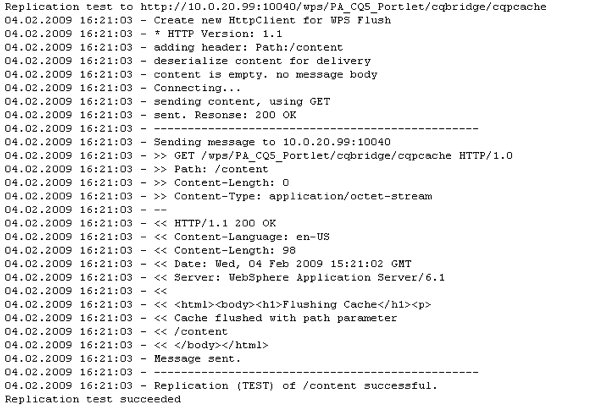

# 門AEM戶和Portlet{#aem-portals-and-portlets}

本文檔介紹以下內容：

* 門AEM戶體系結構
* 管理和配AEM置為入口
* 用作AEM門戶
* 安裝、配置和顯AEM示Portlet中的內容（例如Web伺服器）

## 門AEM戶體系結構 {#aem-portal-architecture}

門戶AEM體系結構包括門戶和portlet的定義。

### 什麼是門戶？ {#what-is-a-portal}

門戶是一個Web應用程式，它提供個性化、單一登錄、來自不同來源的內容整合，並承載資訊系統的呈現層。

您可以在中運行符合JSR 286的PortletAEM。 Portlet元件允許您將Portlet嵌入到頁面中。 請參閱 [管理內AEM容Portlet](#administeringthecqcontentportlet)。

### 什麼是Portlet? {#what-is-a-portlet}

Portlet是部署在容器內的Web元件，用於生成動態內容。 Portlet介面被打包並部署為Portlet容器內的.war檔案。 如果以門戶AEM形式運行，則需要Portlet的.war檔案來運行Portlet。

要配置要AEM在入口中顯示的內容，請參見 [在Portlet中安裝、配AEM置和使用](#installingconfiguringandusingcqinaportlet)。

### 門AEM戶Director {#aem-portal-director}

>[!CAUTION]
>
>從AEM6.4開始，已棄AEM用門戶Director。請參閱 [已棄用和已刪除的功能](https://helpx.adobe.com/experience-manager/6-4/release-notes/deprecated-removed-features.html)。

## 管理內AEM容Portlet {#administering-the-aem-content-portlet}

內AEM容portlet使您能夠在門戶AEM中顯示內容。 Portlet可在 `/crx-quickstart/opt/portal`，並可以以多種方式定制。 例如，可以通過部署您自己的身份驗證服務來生成覆蓋預設行為所需的身份驗證資訊來自AEM定義SSO/身份驗證處理。 插件使用定義的API，通過根據API構建插件，可以添加自己的功能。 該插件可以部署到正在運行的Portlet中。 要正常運行，它需要配置作者AEM和發佈實例以及要在啟動時顯示的內容路徑。

某些配置可通過Portlet首選項進行更改，其他配置可通過OSGi服務配置進行更改。 您使用 **配置** 檔案或OSGi web控制台。

### Portlet首選項 {#portlet-preferences}

可以在門戶伺服器的部署時或通過編輯 **WEB-INF/portlet.xml** 在部署portlet web應用程式之前。 預設情況下，portlet.xml檔案如下所示：

```xml
<?xml version="1.0" encoding="UTF-8"?>
<portlet-app xmlns="https://java.sun.com/xml/ns/portlet/portlet-app_1_0.xsd"
             xmlns:xsi="https://www.w3.org/2001/XMLSchema-instance"
             xsi:schemaLocation="https://java.sun.com/xml/ns/portlet/portlet-app_1_0.xsd /opt/SUNWps/dtd/portlet.xsd"
             version="1.0">
   <portlet>
      <portlet-name>RSSWeatherPortlet</portlet-name>
      <portlet-class>org.jboss.portlet.weather.WeatherPortlet</portlet-class>
      <init-param>
         <name>default_zipcode</name>
         <value>05673</value>
      </init-param>
      <init-param>
         <name>RSS_XSL</name>
         <value>/WEB-INF/Rss.xsl</value>
      </init-param>
      <init-param>
         <name>base_url</name>
         <value>https://xml.weather.yahoo.com/forecastrss?p=</value>
      </init-param>
      <expiration-cache>180</expiration-cache>
      <supports>
         <mime-type>text/html</mime-type>
         <portlet-mode>VIEW</portlet-mode>
         <portlet-mode>EDIT</portlet-mode>
      </supports>
      <portlet-info>
         <title>Weather Portlet</title>
      </portlet-info>
      <portlet-preferences>
         <preference>
            <name>expires</name>
            <value>180</value>
         </preference>
         <preference>
            <name>RssXml</name>
            <value>https://xml.weather.yahoo.com/forecastrss?p=33145</value>
            <read-only>false</read-only>
         </preference>
      </portlet-preferences>
   </portlet>
</portlet-app>
```

可以使用以下首選項配置Portlet:

<table>
 <tbody>
  <tr>
   <td>啟動路徑</td>
   <td><p>這是Portlet的起始路徑：它定義最初顯示的內容。</p> <p><strong>重要</strong>:如果Portlet配置為連接到作AEM者並發佈運行在與上下文路徑不同的上下文路徑上的實例<strong> /</strong>，您需要啟用強制 <strong>CQUrl資訊</strong> 在Html Library Manager中，這些實例AEM（例如，通過Felix Webconsole）的配置或編輯將不起作用，並且不會顯示首選項對話框。</p> </td>
  </tr>
  <tr>
   <td>html選擇器</td>
   <td>附加到每個URL的選擇器。 預設情況下，這是 <strong>portle</strong>，因此所有請求都使用以中結尾的url <strong>.portlet.html。</strong> 這允許在Portlet呈現中使用AEM自定義指令碼。</td>
  </tr>
  <tr>
   <td>addCssToPortalHeader</td>
   <td><p>預設情況下，HTML頁中包含的css文AEM件包含在portlet中。 禁用此選項將排除預設的css檔案。</p> <p>如果啟用此選項，則CSS檔案將添加到html頁面的頭部或嵌入到html頁面中，具體取決於門戶的行為。</p> </td>
  </tr>
  <tr>
   <td>包含工具欄</td>
   <td>預設情況下，在內容portlet內顯示一個工具欄以用於管理功能。 通過禁用此選項，不會呈現任何工具欄。</td>
  </tr>
  <tr>
   <td>url參數名稱</td>
   <td><p>可能包含要為Portlet顯示的新內容URL的備用URL參數名的清單。 從上到下處理清單，使用包含值的第一參數。 如果找不到URL，則使用預設URL參數。 所提供的URL和以前一樣被使用，而不需要進一步修改。</p> <p>此設定是按已部署的portlet進行的 — 還要全局配置「Day PortalDirectorPortlet Bridge」的OSGi配置中的某些URL參數。</p> </td>
  </tr>
  <tr>
   <td>首選項對話框</td>
   <td>中首選項對話框的路AEM徑 — 如果為空，則使用內置首選項對話框。 預設為/libs/portal/content/prefs.html。</td>
  </tr>
  <tr>
   <td>初始重定向</td>
   <td>預設情況下，Portlet在第一次調用時執行整個門戶頁的Javascript重定向。 這是為了支援現代門戶伺服器的拖放方案。 在生產中，很少需要此重定向，因此可以在將此首選項設定為 <em>假</em>。</td>
  </tr>
 </tbody>
</table>

#### OSGi Web控制台 {#osgi-web-console}

假定入口伺服器在主機localhost上運行，埠8080AEM並且Portlet Web應用程式已裝載到Web應用程式上下文 *cqportlet*,web控制台的url為 `https://localhost:8080/cqportlet/cqbridge/system/console`。 預設用戶和密碼為 **管理員**。

開啟 **配置** 頁籤 **門戶目錄CQ伺服器配置**。 在此處，您指定作者和發佈實例的基URL。 此過程在中介紹 [配置Portlet](#configuring-the-portlet)。

>[!NOTE]
>
>OSGi Web控制台僅用於在開發（或測試）期間更改配置。 確保阻止對生產系統控制台的請求。

### 提供配置 {#providing-configurations}

為支援自動部署和配置預配，內AEM容portlet具有內置的配置支援，它嘗試從提供到portlet應用程式的類路徑中讀取配置。

啟動時，系統屬性 **com.day.cq.portet.config** 讀取以檢測當前環境。 通常，此屬性的值 **開發**。 **收縮**。 **test** 等等。 如果未設定環境，則不會讀取配置。

如果設定了環境，則會在類路徑* *中搜索配置檔案&#x200B;**com/day/cq/portlet/{env.config** 何處 **環境** 替換為環境的實際值。 此檔案應列出此環境的所有配置檔案。 這些檔案將相對於配置檔案的位置進行搜索。 例如，如果檔案包含一行 `my.service.xml,` 此檔案從位於的類路徑中讀取 `com/day/cq/portlet/my.service.config.` 檔案名由服務的持久性ID組成，後跟 **.config**。 在上例中，持久性ID為 **my.service**。 配置檔案的格式是Apache Sling OSGi安裝程式使用的格式。

這意味著，對於每個環境，都需要添加相應的配置檔案。 應應用於所有環境的配置需要輸入到所有這些檔案中 — 如果僅用於單個環境，則只需輸入到該檔案中。 此機制確保完全控制在哪個環境中讀取哪個配置。

可以使用不同的系統屬性來檢測環境。 指定系統屬性 **com.day.cq.portet.configproperty** 包含要使用的系統屬性的名稱，而不是 **com.day.cq.portet.config**。

#### 快取和快取無效 {#caching-and-caching-invalidation}

Portlet在其預設配置中將從WCM接收的響應快取AEM到用戶特定的快取中。 當發佈實例的內容發生更改時，快取需要無效。 為此，在AEMWCM中，必須在作者實例上配置複製代理。 也可以手動刷新快取。 本節將介紹這兩個過程。

可以使用其自己的快取配置該portlet，以便該portlet中的內容顯示而無需訪問AEM。 該門戶在/libs/portal/director中作為內容提供。 要訪問內容，請啟AEM動實例，然後使用CRXDE Lite或Webdav從該位置下載檔案。

您可以在運行時部署此捆綁包，也可以將其添加到Portlet Web應用程式 `WEB-INF/lib/resources/bundles` 在部署之前。

在部署快取後，Portlet從發佈實例中快取內容。 使用來自的調度程式刷新可以使Portlet快取無AEM效。 要配置Portlet以使用其自己的快取，請執行以下操作：

1. 在作者中配置針對入口伺服器的複製代理。
1. 假定入口伺服器在主機上運行 **本地主機**, **埠8080 **AEM，並且portlet web應用程式已裝入上下文 **cqportlet**，刷新快取的url為 `https://localhost:8080/cqportlet/cqbridge/cqpcache?Path=$(path)`。 使用GET作為方法。
   **注：** 您可以發送名為HTTP的標頭，而不是使用請求參數 **路徑**。

#### 通過複製代理刷新快取 {#flushing-the-cache-via-replication-agent}

與正常的調度程式失效一樣，可以配置複製代理以針對門戶的Portlet緩AEM存。 配置複製代理後，每次常規頁面激活都會刷新入口快取。

如果運行portlet的幾個入口節AEM點，則需要按本過程中所述為每個節點建立一個代理。

要配置入口的複製代理，請執行以下操作：

1. 登錄到作者實例。
1. 在「網站」頁籤中，按一下 *工具* 頁籤。
1. 按一下 **新建頁面……** 在複製代理中 **新建……** 的子菜單。

   

1. 在 *模板*&#x200B;選中 *複製代理*，並輸入代理的名稱。 按一下&#x200B;*建立*。

   

1. 按兩下剛建立的複製代理。 它顯示為無效，因為尚未配置它。

   

1. 按一下 **編輯。**
1. 在 **設定** 頁籤 **已啟用** 複選框，選擇 **調度程式刷新** 作為序列化類型，並輸入重試超時（例如60000）。

   

1. 按一下 **運輸** 頁籤。
1. 在 **URI** 欄位，輸入portlet的刷新URI(URL)。 URI的格式如下：

   ```xml
   https://<wps-host>:<port>/<wps-context>/<cq5-portlet-context>/cqbridge/cqpcache
   ```

   

1. 按一下 **擴展** 頁籤。

   

1. 在 **HTTP方法** 欄位，類型 **GET**。
1. 在 **HTTP標頭** ，按一下 **+** 添加新條目和類型 **路徑：{path}**。
1. 如有必要，請按一下 **代理** 頁籤，然後輸入代理的代理資訊。
1. 按一下 **確定** 的子菜單。
1. 要test連接，請按一下 **Test連接** 的子菜單。 將顯示一條日誌消息，指明複製test是否成功。 例如：

   

#### 手動刷新Portlet快取 {#manually-flushing-the-portlet-cache}

通過訪問為複製代理配置的相同URL，可以手動刷新Portlet快取。 請參閱 [刷新快取](#flushing-the-cache-via-replication-agent) 的雙曲餘切值。 此外，需要使用URL參數Path=擴展URL&lt;path> 以指示要刷的。

例如：

`https://10.0.20.99:10040/wps/PA_CQ5_Portlet/cqbridge/cqpcache?Path=*` 刷新完整快取。 `https://10.0.20.99:10040/wps/PA_CQ5_Portlet/cqbridge/cqpcache?Path=/content/mypage/xyz` 刷新 `/content/mypage/xyz` 從快取中。

### 門戶安全 {#portal-security}

入口是驅動認證機制。 您可以與技AEM術用戶、門戶用戶、組等進行登錄。 門戶中的用戶無權訪問該門戶中的密碼，因此，如果該門戶不知道成功登錄用戶的所有憑據，則必須使用SSO解決方案。 在這種情況下， portlet將AEM所有必需資訊轉發AEM給，而這些資訊又轉發給基礎儲存AEM庫。 此行為可插拔，可自定義。

### 發佈時的身份驗證 {#authentication-on-publish}

本節介紹Portlet在與基礎WCM實例通信時可以使用的可AEM用驗證模式。

預設情況下，不會向的發佈實例發送用戶信AEM息；內容始終顯示為匿名用戶。 如果應從中傳遞用戶特定信AEM息，或者如果需要發佈用戶身份驗證，則必須啟用此功能。

#### 訪問Portlet的身份驗證配置 {#accessing-the-portlet-s-authentication-configuration}

在Web控制台（OSGi配置）中AEM,Portlet在WCM實例中使用的驗證配置選項可用。

>[!NOTE]
>
>使用時，AEM有幾種方法管理OSGi服務（控制台或儲存庫節點）的配置設定。
>
>請參閱 [配置OSGi](/help/sites-deploying/configuring-osgi.md) 的雙曲餘切值。

要訪問Portlet的身份驗證配置：

1. 通過以下URL訪問Web控制台：

   `https://localhost:8080/cqportlet/cqbridge/system/console`

   例如，在其預設配置中：

   `https://wps-host:10040/wps/PA_CQ5_Portlet/cqbridge/system/console`

1. 登錄到Web控制台。 預設憑據為 `admin/admin`。
1. 在控制台中，選擇 **配置**。
1. 在 **配置** 菜單中，選擇要配置的特定服務。 服務由OSGi框架中的portlet提供。

   | 服務名稱 | 說明 |
   |---|---|
   | 日門戶Director驗證器 | 配置WCM實例使用的AEM驗證模式。 根據所選模式，可以指定技術用戶或SSO Cookie的名稱。 此外，還可AEM以啟用WCM發佈實例的驗證。 |
   | 日門戶Director檔案快取 | 配置Portlet如何快取其從WCM實例接收的響AEM應的參數。 |
   | 日門戶DirectorHTTP客戶端服務 | 配置Portlet通過HTTP連接到基礎AEMWCM實例的方式。 例如，可以指定代理伺服器。 |
   | 日門戶Director區域設定處理程式 | 配置Portlet支援的區域設定。 對WCM實AEM例的請求基於用戶區域設定；例如，用戶語言*德語*將請求 `/content/geometrixx/de/`...。 |
   | 日門戶Director特權經理 | 根據當前登錄的用戶配置Portlet是否應test「網站」頁籤。 |
   | 日門戶Director工具欄呈現器 | 自定義Portlet工具欄的呈現。 |

1. 此外，您還可以配置Web控制台和日誌服務。 例如，您可以通過按一下Apache Felix OSGi管理控制台連結來更改Web控制台的管理憑據。

#### 技術用戶模式 {#technical-user-mode}

在預設模式下，Portlet為AEMWCM作者實例發出的所有請求都使用同一技術用戶進行身份驗證，而與當前門戶用戶無關。 預設情況下啟用「Technical User（技術用戶）」模式。 在OSGi管理控制台的相應配置螢幕中啟用/禁用此模式：

如果WCM作者實例和發佈實例AEM上存在指定的技術用戶， **發佈時驗證** 的子菜單。 請確保為用戶授予足夠的訪問權限以用於創作工作。

#### SSO {#sso}

Portlet支AEM持SSO，而不是開箱。 驗證器服務可配置為使用SSO並以格式傳輸當前入口用戶 **基本** 作為名為 `cqpsso` 到AEM。 應AEM配置為使用路徑/的SSO驗證處理程式。 此處也需要配置Cookie名稱。

的 `crx-quickstart/repository/repository.xml` 儲存AEM庫需要相應配置：

```xml
<LoginModule class="com.day.crx.security.authentication.CRXLoginModule">
  ...
  <param name="trust_credentials_attribute" value="TrustedInfo"/>
  <param name="anonymous_principal" value="anonymous"/>
</LoginModule>
```

#### SSO身份驗證模式 {#sso-authentication-mode}

Portlet可以使用單AEM一登錄(SSO)方案對WCM進行身份驗證。 在此模式下，當前登錄到門戶的用戶將以AEMSSO Cookie的形式轉發到WCM。 如果使用SSO模式，則對AEMPortlet具有訪問權的所有門戶用戶必須知道基礎AEMWCM實例，最常採用AEMWCM連接到LDAP的形式，或通過事先手動建立用戶。 此外，在Portlet中啟用SSO之前，基礎AEMWCM作者實例(以及發佈實例，如果 **發佈時驗證** 啟用)需要配置為接受基於SSO的請求。

要將Portlet配置為使用SSO驗證模式，請完成以下步驟（在以下各節中詳細介紹）:

* 啟用AEMWCM的儲存庫接受受信任的憑據。
* 在WCM中啟用SSOAEM身份驗證。
* 在Portlet中啟用SSOAEM驗證。

#### 使AEMWCM的儲存庫接受受信任的憑據 {#enabling-aem-wcm-s-repository-to-accept-trusted-credentials}

在為WCM啟用SSO之AEM前，需要將基礎儲存庫配置為接受由AEMWCM提供的受信任憑據。 為此，請配置repositoryAEM.xml。

1. 在安裝WCM的文AEM件系統中，開啟以下檔案：

   `//crx-quickstart/repository/repository.xml`

1. 在XML檔案中，查找 **登錄模組** 並將trust_credentials_attribute添加到其配置中：

   ```xml
   <LoginModule class="com.day.crx.security.authentication.CRXLoginModule">
     ...
     <param name="trust_credentials_attribute" value="TrustedInfo"/>
     <param name="anonymous_principal" value="anonymous"/>
   </LoginModule>
   ```

1. 重新啟AEM動WCM以使更改生效。

#### 在AEMWCM中啟用SSO驗證 {#enabling-sso-authentication-in-the-aem-wcm}

要在WCM中啟AEM用SSO，請訪問WCM的Apache Felix Web管理控AEM制台(OSGi)中的相關配置條目：

1. 通過其URI訪問控制台，網址為https://&lt;aem-host>:&lt;port>/system/console。
1. 在「配置」菜單中，選擇「SSO驗證處理程式」。 在本示例中，SSO處理程式基於portlet提供的cookie接受所有路徑的SSOAEM請求。 您的配置可能會有所不同。

   | 路徑 | / | 為所有請求啟用SSO處理程式 |
   |---|---|---|
   | Cookie名稱 | 卡普索 | Portlet在Portlet的OSGi控制台中配置的Cookie的名稱。 |

1. 按一下 **保存** 啟用SSO。 SSO現在是主身份驗證方案。

對於WCM接AEM收的每個請求，首先嘗試基於SSO的驗證。 失敗時，執行對通常的基本認證方案的回退。 因此，與WCM的正常連接(AEM不使用SSO)仍然是可能的。

#### 在Portlet中啟用SSO驗AEM證 {#enabling-sso-authentication-in-a-aem-portlet}

為了使基礎AEMWCM實例接受SSO請求，必須從Portlet的驗證模式切換 **技術** 至 **SSO**。

要在Portlet中啟用SSO驗AEM證：

1. 通過其URI訪問控制台，網址為https://&lt;aem-host>:&lt;port>/system/console。
1. 在「配置」菜單中，從可用配置清單中選擇「日入口Director驗證器」。
1. 在模式中，選擇SSO。 將其它參數保留為預設值。

   

1. 按一下「保存」為portlet啟用SSO。

   為了測試目的，在WCM中以管理員權限建立同一用戶後，使用門戶的管理用戶訪AEM問portlet。

執行此過程後，請求使用SSO進行身份驗證。 HTTP通信中的一個典型代碼段顯示以下特定於SSO和Portlet的標頭：

```xml
C-12-#001898 -> [GET /mynet/en/_jcr_content/par/textimage/image.img.png HTTP/1.1 ]
C-12-#001963 -> [cq5:locale: en ]
C-12-#001979 -> [cq5:used-locale: en ]
C-12-#002000 -> [cq5:locales: en,en_US ]
C-12-#002023 -> [cqp:user: wpadmin ]
C-12-#002042 -> [cqp:portal: IBM WebSphere Portal/6.1 ]
C-12-#002080 -> [cqp:windowid: 7_CGAH47L000CE302V2KFNOG0084 ]
C-12-#002124 -> [cqp:windowstate: normal ]
C-12-#002149 -> [cqp:portletmode: view ]
C-12-#002172 -> [User-Agent: Jakarta Commons-HttpClient/3.1 ]
C-12-#002216 -> [Host: 10.0.0.68:4502 ]
C-12-#002238 -> [Cookie: $Version=0; cqpsso=Basic+d3BhZG1pbg%3D%3D ]
C-12-#002289 -> [ ]
```

### 啟用PIN驗證 {#enabling-pin-authentication}

如果您沒有使用內容portlet的預設內聯編輯功能AEM，但希望門戶外部的創作和管理部分直接位於作者實例中，則應啟AEM用PIN驗證。 您還需要更改管理按鈕的配置。

要開啟網站管理頁面或編輯portlet中的頁面，內AEM容portlet使用新的pin驗證。 預設情況下，禁用PIN驗證，因此必須在中進行以下配置更AEM改：

1. 通過在repository.xml文AEM件中添加可信資訊，在中啟用可信身份驗證：

   ```xml
   <LoginModule class="com.day.crx.security.authentication.CRXLoginModule">
     ...
     <param name="trust_credentials_attribute" value="TrustedInfo"/>
   </LoginModule>
   ```

1. 在OSGi配置控制台中，預設位於https://localhost:4502/system/console/configMgr，選擇 **CQ PIN身份驗證處理程式** 的下界。
1. 編輯 **URL根路徑** 僅包含單個值的參數 **/**。

### 權限 {#privileges}

Portlet的某些功能受權限保護。 當前用戶需要具有此權限才能訪問此功能。 預定義了以下權限：

* &quot;工具欄&quot;:這是查看/使用Portlet中工具欄的一般權限。
* &quot;prefs&quot; :如果用戶具有此權限，則允許用戶查看/更改Portlet的首選項。
* &quot;cq-author:edit&quot;:使用此權限，用戶可以調用內容的編輯視圖。
* &quot;cq-author:preview&quot; :使用此權限，用戶可以查看預覽。
* &quot;cq-author:siteadmin&quot; :使用此權限，允許用戶在中開啟站點管理AEM。

管理權限的最佳方法是使用門戶角色並將角色分配給這些權限。 這可以通過OSGi配置完成。 「日門戶Director權限管理器」可配置為每個權限的一組角色。 如果用戶具有其中一個角色，則用戶具有相應的權限。

此外，還可以根據每個Portlet實例庫定義基於此角色的訪問。 Portlet的首選項對話框包含上述每個權限的輸入欄位。 對於每個權限，可以配置以逗號分隔的Portlet角色清單。 如果配置了值，則會覆蓋「日門戶Director權限管理器」服務中的全局配置，並且可能需要在此全局設定中添加與未合併角色相同的角色！ 如果未指定值，則使用全局配置。

### 自定義Portlet應AEM用程式 {#customizing-the-aem-portlet-application}

提供的AEMPortlet應用程式啟動Web應用程式內的OSGi容AEM器。 此體系結構使您能夠利用OSGi的所有優點：

* 易於更新和擴展
* 提供Portlet的熱更新，而不需要與門戶伺服器進行任何交互
* 易於自定義portlet

### 工具欄按鈕 {#toolbar-buttons}

工具欄及其按鈕是可配置的，可以自定義。 您可以將自己的按鈕添加到工具欄或定義在哪種模式下顯示哪些按鈕。 每個按鈕都是可通過OSGi配置配置的OSGi服務。

OSGi Web控制台列出了 **配置** 頁籤。 對於每個按鈕，您可以定義此按鈕的顯示模式。 這允許您通過刪除所有模式來禁用按鈕。

預設情況下，內AEM容portlet使用內聯編輯功能。 但是，如果您希望切換到作AEM者實例進行編輯，請啟用 **「站點管理」按鈕** 和 **ContentFinder按鈕**，但禁用 **編輯按鈕**。 在這種情況下，請確保正確配置中的PIN身份驗AEM證。

可以通過門戶的Felix Web Console安裝捆綁包來自定義門戶的工具欄佈局，該捆綁包包含預定義位置的自定義CSS/HTML。

#### 束結構 {#bundle-structure}

下面是一個示例束結構：

```xml
$ jar tvf target/toolbarlayout-0.0.1-SNAPSHOT.jar | awk '{print $8}'
META-INF/
META-INF/MANIFEST.MF
/com/day/cq/portlet/toolbar/layout/
/com/day/cq/portlet/toolbar/layout/author.gif
/com/day/cq/portlet/toolbar/layout/back.gif
/com/day/cq/portlet/toolbar/layout/button.html
/com/day/cq/portlet/toolbar/layout/edit.gif
/com/day/cq/portlet/toolbar/layout/manage.html
/com/day/cq/portlet/toolbar/layout/publish.html
/com/day/cq/portlet/toolbar/layout/refresh.gif
/com/day/cq/portlet/toolbar/layout/siteadmin.gif
/com/day/cq/portlet/toolbar/layout/toolbar.css
```

META-INF資料夾包含OSGi將其標識為捆綁所需的MANIFEST.MF檔案。 如下所示：

```xml
Manifest-Version: 1.0
Built-By: djaeggi
Created-By: Apache Maven Bundle Plugin
Import-Package: com.day.cq.portlet.toolbar.layout
Bnd-LastModified: 1234178347159
Export-Package: com.day.cq.portlet.toolbar.layout
Bundle-Version: 0.0.1.SNAPSHOT
Bundle-Name: Company CQ5 Portal Director Portlet Toolbar Layout
Bundle-Description: This bundle provides a custom layout for the CQ5 P
 ortal Director Portlet Toolbar.
Build-Jdk: 1.5.0_16
Bundle-ManifestVersion: 2
Bundle-SymbolicName: com.day.cq.portlet.company.toolbarlayout
Tool: Bnd-0.0.255
```

HTML/CSS/影像位於/com/day/cq/portlet/toolbar/layout資料夾內這一事實由portlet規定，不能更改。 同樣，MANIFEST.MF中的Import-Package和Export-Package標頭也必須被稱為/com/day/cq/portlet/toolbar/layout。 Bundle-SymbolicName必須是唯一且完全限定的包名稱。

可以使用工具（如maven）或手動建立具有本節中所示相關標題集的jar檔案來構建它。

#### Portlet工具欄視圖 {#portlet-toolbar-views}

Portlet的工具欄基本上有兩種視圖狀態。 每個視圖和關聯按鈕都可以用相應的HTML檔案進行定制。

#### 發佈視圖 {#publish-view}

發佈視圖只有一個按鈕將工具欄切換到「管理」視圖。 發佈視圖由中的publish.html檔案表示 [上一束](/help/sites-deploying/configuring-osgi.md#bundles)。 在HTML中，可以使用以下佔位符，在呈現時，這些佔位符將被portlet替換為相應的內容：

#### 發佈視圖佔位符 {#publish-view-placeholders}

| 佔位符字串 | 說明 |
|---|---|
| {buttonManage} | 佔位符替換為 **管理** 按鈕，將portlet狀態切換到管理狀態。 |

#### 管理視圖 {#manage-view}

「管理」視圖有四個按鈕：「編輯」、「網站」頁籤、「刷新」和「後退」。 管理視圖由中的manage.html檔案表示 [上一束](/help/sites-deploying/configuring-osgi.md#bundles)。 在HTML中，可以使用以下佔位符，在呈現時，這些佔位符將被portlet替換為相應的內容：

#### 管理視圖佔位符 {#manage-view-placeholders}

| 佔位符字串 | 說明 |
|---|---|
| {buttonEdit} | 佔位符替換為 **編輯** 的子菜單。 |
| {buttonWeb站點頁籤} | 佔位符，替換為開啟WCM的「網站」頁籤AEM的按鈕。 |
| {buttonRefresh} | 刷新當前視圖。 |
| {buttonBack} | 將portlet切換回發佈視圖。 |

#### 按鈕 {#buttons}

按鈕（無論其顯示哪個視圖）使用在button.html中定義的相同公共HTML。

在HTML中，可以使用以下佔位符，在呈現時，這些佔位符將被portlet替換為相應的內容：

#### 管理和發佈視圖按鈕 {#manage-and-publish-view-buttons}

| 佔位符字串 | 說明 |
|---|---|
| {名稱} | 按鈕的名稱，例如，**作者、後退、刷新**等。 |
| {id} | 按鈕的CSS ID。 |
| {url} | 按鈕目標的URL。 |
| {text} | 按鈕的標籤。 |
| {onclick} | Javascript **按一下** 函式（包含{url}）。 |

button.html檔案示例：

```xml
<div class="cqp_button">

 <a href="#" onclick="{onclick}">

 

 </a>
</div>
```

#### 安裝自定義佈局 {#installing-a-custom-layout}

要安裝自定義佈局，請訪問Portlet的OSGI Web控制台**捆綁包**節並上載捆綁包。

#### 套件 {#packages}

如果需要上載或建立安裝軟體包，請參閱文檔中的「軟體包管理器」AEM瞭解詳細說明。

### 連結處理 {#link-handling}

所有連結都被重寫以在門戶上下文中工作。 預設情況下，使用帶渲染參數的連結。 可以將門戶DirectorHTML重寫器配置為使用操作連結。

您還可以定義要查詢的附加請求參數，以便顯示內容路徑。 例如，如果存在從外部到特定內容的連結，則此功能非常有用。

此外，可以配置門戶DirectorHTML重寫器，其中包含為連結重寫定義的排除的規則運算式清單。 例如，如果您有到外部系統的相對連結，則應將它們添加到此排除清單中。

### 本土化 {#localization}

內AEM容portlet具有內置的本地化功能，可確保來自內容的語AEM言正確無誤。

這分兩步完成：

1. 門戶目錄區域設定檢測器通過從門戶獲取區域設定來檢測門戶用戶的區域設定。 必須使用中可用語言清單配置此服務AEM。
1. 門戶Director區域設定處理程式處理當前請求的本地化。 它採用請求內容的路徑，例如 `/content/geometrixx/en/company.html`根據配置，它重寫 **恩** 和用戶的實際區域設定。

門戶Director區域設定處理程式可以配置用於檢查區域設定資訊的路徑 — 通常，這包括以下所有內容 `/content` 和路徑中區域設定資訊的位置。 預設情況下，區域設定處理程式遵循中構建多語言站點的重新公AEM認。

如果您的站點沒有處理路徑中的區域設定資訊的嚴格規則，則可以用您自己的實現替換區域設定處理程式。

### 可選OSGi服務 {#optional-osgi-services}

可以實施可選的OSGi服務來定制portlet的各個部分。 每個服務都對應一個Java介面。 此介面可通過捆綁到portlet中來實現和部署。

<table>
 <tbody>
  <tr>
   <td>請求跟蹤器</td>
   <td>只要Portlet顯示內容，就會通知請求跟蹤器。 這允許您跟蹤Portlet的調用。</td>
  </tr>
  <tr>
   <td>調用上下文監聽器</td>
   <td>在對Portlet的每個請求的開始和結束時調用的偵聽器。 監聽程式可用於更改或添加當前請求的資訊。<br /> </td>
  </tr>
  <tr>
   <td>錯誤處理程式</td>
   <td>在呈現階段出現錯誤的自定義錯誤處理程式。</td>
  </tr>
  <tr>
   <td>HTTP處理器</td>
   <td>此服務可用於向每個http調用添加信AEM息。</td>
  </tr>
  <tr>
   <td>Portlet操作</td>
   <td>向portlet添加自己的操作 — 此操作可通過portlet操作連結調用。</td>
  </tr>
  <tr>
   <td>PortletDecoratorService</td>
   <td>此服務可用於裝飾portlet的內容。</td>
  </tr>
  <tr>
   <td>資源提供程式</td>
   <td>添加您自己的資源提供程式，通過Portlet資源連結將某些資源傳送到客戶端。</td>
  </tr>
  <tr>
   <td>文本映射器</td>
   <td>允許您發佈進程HTML、CSS和Javascript檔案。</td>
  </tr>
  <tr>
   <td>工具欄按鈕</td>
   <td>將您自己的按鈕添加到工具欄。</td>
  </tr>
  <tr>
   <td>URL映射器</td>
   <td>添加服務以應用自定義URL映射或重寫。</td>
  </tr>
  <tr>
   <td>用戶資訊提供程式</td>
   <td>添加您自己有關用戶的資訊。 此服務可用於從門戶獲取到portlet的資訊。</td>
  </tr>
 </tbody>
</table>

#### 替換預設服務 {#replacing-default-services}

以下服務在內容portlet中具有預設實現（帶有相應的Java介面）。 要自定義，需要將包含新服務實現的捆綁包部署到portlet應用程式中。

在實施此類服務時，請確保設定 **服務。排名** 服務的屬性為正值。 預設實現使用排名** 0**，而portlet使用排名最高的服務。

| **名稱** | **說明** | **預設行為** |
|---|---|---|
| 驗證器 | 將驗證資訊提AEM供 | 為作者和發佈使用可配置的技術用戶。 也可以使用SSO。 |
| HTMLRewriter | 重寫連結、影像等 | 重寫AEM到入口連結的連結，可以通過UrlMapper和TextMapper進行擴展 |
| HttpClientService | 處理所有http連接 | 標準實施 |
| 區域設定處理程式 | 處理區域設定資訊 | 重寫與區域設定相關的內容連結。 |
| 區域設定檢測器 | 檢測用戶的區域設定。 | 使用門戶提供的區域設定。 |
| 權限管理器 | 檢查用戶權限 | 如果允許用戶編輯內容，則檢查對作者實例的訪問 |
| 工具欄呈現器 | 呈現工具欄 | 添加工具欄功能 |

### Portlet事件 {#portlet-events}

Portlet API(JSR-286)指定Portlet事件。 內AEM容portlet具有整合橋，將portlet事件作為AEMOSGi事件分發為portlet — 這使portlet事件的處理可插拔。

如果要處理特定事件，請在部署描述符中將這些事件聲明為接收事件（或通過門戶伺服器進行配置），並實現聲明EventHandler介面的OSGi服務（請參閱OSGi EventAdmin規範）。

每當Portlet事件發生時，都會調用處理程式發送特定的OSGi事件。 處理程式獲取所有上下文資訊，並可以相應更新Portlet的狀態或發送新事件。 基本上，在句柄方法內部可以使用portlet事件階段的所有功能。

## 用作AEM門戶 {#using-aem-as-a-portal}

使用Portlet元件將Portlet窗口添加AEM到頁。 您安裝到應用程式伺服器的共用庫使Portlet元件能夠檢測已部署的Portlet應用程式。

要用作AEM門戶，請執行以下任務：

1. 安裝Portlet元件和共用庫。
1. 將Portlet元件添加到Sidek。
1. 配置和部署包含要顯示在門戶元件中的portlet的Web應用程式。
1. 將Portlet元件添加到頁面並選擇要顯示的Portlet。

>[!NOTE]
>
>只有部署為Web應用程式AEM時，才可使用Portlet元件。 ([請參閱使用AEM應用程式伺服器安裝](/help/sites-deploying/application-server-install.md)。)

### 安裝Portlet元件 {#installing-the-portlet-component}

Quickstart JARAEM檔案包含Portlet元件檔案。 要獲取檔案(cq-portlet-components.zip)，您可以執行快速啟動或提取內容。

1. 執行或提取Quickstart JAR檔案的內容，並相應地找到cq-portlet-components.zip檔案：

   * 執行快速啟動：crx quickstart/opt/portal
   * 提取快速啟動內容：靜態/選擇/入口

1. 開啟部署到應用程式伺服器的CQ5作者實例的包管理器。 https://*appserverhost*:*埠*/cq5author/crx/packmgr

1. 使用包管理器 [上載和安裝](/help/sites-administering/package-manager.md#uploading-packages-from-your-file-system) cq-portlets-components.zip軟體包。

   該軟體包將cq-portlet-director-sharedlibs-x.x.x.jar安裝在儲存庫的/libs/portal/director資料夾中。

1. 將cq-portlet-director-sharedlibs-x.x.jar複製到硬碟。 使用任何方法獲取檔案，例如FileVault或WebDAV客戶端。
1. 將cq-portlet-director-sharedlibs.x.x.x.jar檔案移動到應用程式伺服器的共用庫資料夾，以便這些類可用於部署的portlet應用程式。

### 將Portlet元件添加到Sidekick {#adding-the-portlet-component-to-sidekick}

將portlet元件添加到段落系統，以便作者可以使用它。

1. 在「側腳」中，按一下標尺表徵圖進入「設計」模式。
1. 在 `Design of par` 在第一段上方，按一下 **編輯**。

1. 在 **常規** 元件類別，選中Portlet元件旁邊的複選框，然後按一下確定。


### 配置和部署Portlet應用程式 {#configuring-and-deploying-your-portlet-applications}

將portlet部署到應用程式伺服器Web容器，以便它們可用於門戶元件。 在部署Portlet應用程式之前，需要配置應用程式，以便載入AEMPortal容器Servlet。 此配置使Portlet元件能夠訪問Portlet。

1. 提取Portlet應用程式WAR檔案的內容。

   **提示：** jar xf *名稱應用*.war命令提取檔案。

1. 在文本編輯器中開啟web.xml檔案。
1. 在Web-app元素中添加以下Servlet配置：

   ```xml
   <servlet>
           <servlet-name>slingportal</servlet-name>
           <servlet-class>org.apache.sling.portal.container.api.ContainerServlet</servlet-class>
           <load-on-startup>1</load-on-startup>
   </servlet>
   <servlet-mapping>
           <servlet-name>slingportal</servlet-name>
           <url-pattern>/SlingPortletInvoker</url-pattern>
   </servlet-mapping>
   ```

1. 保存web.xml檔案並重新打包WAR檔案。

   **提示：** 的 `jar cvf nameofapp.war *` 命令將當前目錄的內容添加到nameofapp.war檔案。

1. 將Portlet應用程式部署到應用程式伺服器。 有關資訊，請參閱應用程式伺服器的文檔。

### 將Portlet添加到您的AEM頁面 {#adding-portlets-to-your-aem-page}

使用門戶元件將portlet窗口添加到網頁。 使用元件屬性指定要顯示的portlet。

1. 在網頁上，拖動 **Portlet** 從「Sidekick中的常規」組到頁面的元件。

   >[!NOTE]
   >
   >將元件拖到頁面後，重新載入頁面以確保其正常工作。

1. 按兩下元件以開啟Portlet屬性。
1. 在 **Portlet實體** 下拉菜單，從清單中選擇portlet。
1. 根據是否要查看portlet的標題欄，選擇或清除**隱藏標題欄**複選框。
1. 在 **Portlet窗口** 欄位中，輸入唯一的Portlet窗口ID（如果需要）。

   >[!NOTE]
   >
   >如果您打算在同一頁上多次使用同一Portlet，請為每個Portlet指定不同的窗口ID。

1. 按一下&#x200B;**「確定」**。Portlet顯示在您的頁AEM面上。

   

## 在Portlet中安裝、配AEM置和使用 {#installing-configuring-and-using-aem-in-a-portlet}

要訪問WCM提AEM供的內容，門戶伺服器需要配AEM置門戶Director門戶。 通過使用本節中提供的步驟來安裝、配置和將portlet添加到門戶頁面，可以執行此操作。

預設情況下， Portlet連接到localhost:4503的發佈實例，以及localhost:4502的作者實例。 這些值可以在部署Portlet期間更改。 入口控制器可作為/libs/portal/directory下儲存庫中的內容。 在使用應用程式戰爭檔案之前，需要先下載它。

### 下載戰爭檔案 {#downloading-the-war-file}

1. 使用Webdav或CRXDE Lite導航到/libs/portal/director。

1. 下載 *cq-portlet-webapp.war*。

>[!NOTE]
>
>這些過程以Websphere門戶為例，儘管它們盡可能具有通用性；請注意，其他Web門戶的操作過程各不相同。 儘管所有Web門戶的步驟基本相同，但您需要重新調整特定Web門戶的步驟的用途。

#### 安裝Portlet {#installing-the-portlet}

要安裝Portlet，請執行以下操作：

1. 以管理員權限登錄到門戶。
1. 導航到Web門戶的Portlet Management部分。
1. 按一下「安裝」並瀏覽AEM到您下載的Portlet應用程式(cq-portlet-webapp.war)，並輸入有關Portlet的其他重要資訊。

   對於其他基本Portlet資訊，您可以接受預設值或更改值。 如果您接受預設值，則portlet可在https://上找到&lt;wps-host>:&lt;port>/wps/PA_CQ5_Portlet。 Portlet提供的OSGi管理控制台可在https://上找到&lt;wps-host>:&lt;port>/wps/ PA_CQ5_Portlet/cqbridge/system/console（預設用戶名/密碼為admin/admin）。

1. 通過選中該選項或複選框並保存您所做的更改，確保Portlet應用程式自動啟動。 您會看到一則消息，表明您的安裝成功。

#### 配置Portlet {#configuring-the-portlet}

安裝Portlet後，需要配置它，以便它知道基礎實例的URL(AEM作者和發佈)。 您還可以配置其他選項。

要配置Portlet:

1. 在應用伺服器的「門戶」管理窗口中，導航到Portlet管理，其中列出了所有Portlet，然後選擇「門戶Director」AEM Portlet。
1. 根據需要配置portlet。 例如，您可能需要更改作者的URL和發佈實例以及開始路徑的URL。 有關預設配置的說明，請參見 [Portlet首選項](/help/sites-administering/aem-as-portal.md#portlet-preferences)。

   >[!NOTE]
   >
   >如果portlet配置為連AEM接到作者並發佈運行在與** /**不同的上下文路徑上的實例，則需要啟用強制 **CQUrl資訊** 在Html Library Manager中，這些實例AEM（例如，通過Felix Webconsole）的配置或編輯將不起作用，並且不會顯示首選項對話框。

1. 在應用伺服器中保存配置更改。

1. 導航到Portlet的OSGI管理控制台。 預設位置為 `https://<wps-host>:<port>/wps/PA_CQ5_Portlet/cqbridge/system/console/configMgr`。 預設用戶名/密碼為 **管理員/管理員**。

1. 選擇 **日門戶DirectorCQ伺服器配置** 配置並編輯以下值：

   * **作者基URL**:作者實例的AEM基URL。
   * **發佈基URL**:發佈實例的基AEMURL。
   * **作者用作發佈**:作者實例是否用作發佈實例（用於開發）?

   

1. 按一下「**儲存**」。現在，您可以將portlet添加到門戶頁面並使用門戶。

### 內容URL {#content-urls}

當從中請求內AEM容時， Portlet使用當前顯示模式（發佈或作者）和當前路徑來匯編完整的URL。 使用預設值時，第一個url為 `https://localhost:4503/content/geometrixx/en.portlet.html`。 的值 `htmlSelector` 在副檔名之前自動添加到URL。

如果Portlet切換到幫助模式和 `appendHelpViewModeAsSelector` ，則 `help` selector也附加，例如， `https://localhost:4503/content/geometrixx/en.portlet.html.help`。 如果Portlet窗口已最大化， `appendMaxWindowStateAsSelector` 選中，然後附加選擇器，例如， `https://localhost:4503/content/geometrixx/en.portlet.max.help`。

可以在中評估選AEM擇器，並且可以針對不同的選擇器使用不同的模板。

### 在中使用內容URL映AEM射 {#using-a-content-url-map-in-aem}

通常，起始路徑直接指向中的內AEM容。 但是，如果要在Portlet首選項中AEM而不是在Portlet首選項中維護起始路徑，則可以將起始路徑指向AEM內容映射，例如 `/var/portlets`。 在這種情況下，在中運行的腳AEM本可以使用portlet中提交的資訊來確定哪個url是起始URL。 它應發出指向正確URL的重定向。

#### 將Portlet添加到門戶頁 {#adding-the-portlet-to-the-portal-page}

將Portlet添加到門戶頁面：

1. 請確保您位於應用伺服器的管理窗口中，並導航到管理頁面的位置。 (例如，在WebSphere 6.1中，按一下 **管理頁面**)。
1. 選擇Portlet的名稱，然後選擇現有頁或建立新頁。
1. 編輯頁面佈局。
1. 選擇Portlet並將其添加到容器。
1. 保存更改。

#### 使用Portlet {#using-the-portlet}

要訪問添加到Portlet的頁面：

1. 在portlet的個性化菜單中，按照在入口中配置該portlet的方式配置該portlet。
1. 開啟配置（Portlet顯示在Portlet配置中配置的發佈開始URL），並根據需要進行編輯，然後保存。
