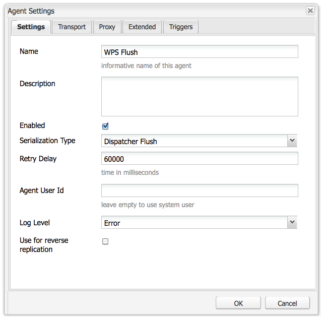

# AEM門戶和門戶{#aem-portals-and-portlets}

本檔案說明下列項目：

* AEM Portal架構
* 管理和設定AEM as a portal
* 使用AEM作為入口網站
* 安裝、配置和顯示portlet中的AEM內容（例如，Web伺服器）

## AEM Portal架構 {#aem-portal-architecture}

AEM門戶體系結構包括門戶和portlet的定義。

### 什麼是門戶？ {#what-is-a-portal}

門戶是Web應用程式，它提供個性化、單一登錄、來自不同來源的內容整合，並承載資訊系統的展示層。

您可以在AEM中運行符合JSR 286的portlet。 Portlet元件允許您在頁上嵌入Portlet。 請參閱 [管理AEM內容Portlet](#administeringthecqcontentportlet).

### 什麼是portlet? {#what-is-a-portlet}

Portlet是部署在容器內的Web元件，用於生成動態內容。 Portlet介面被打包並部署為.war檔案，位於Portlet容器內。 如果您正在運行AEM as a portal，則需要該portlet的.war檔案來運行該portlet。

若要設定AEM內容以顯示在入口網站中，請參閱 [在portlet中安裝、配置和使用AEM](#installingconfiguringandusingcqinaportlet).

### AEM Portal Director {#aem-portal-director}

>[!CAUTION]
>
>自AEM 6.4起，已不再使用AEM Portal Director。請參閱 [過時和移除的功能](https://helpx.adobe.com/experience-manager/6-4/release-notes/deprecated-removed-features.html).

## 管理AEM內容Portlet {#administering-the-aem-content-portlet}

AEM內容Portlet允許您在門戶中顯示AEM內容。 此portlet可在 `/crx-quickstart/opt/portal`，且可以透過各種方式自訂。 例如，您可以部署自己的驗證服務來產生AEM覆寫預設行為所需的驗證資訊，借此自訂SSO/驗證處理。 外掛程式使用已定義的API，可讓您根據API建立外掛程式，以新增您自己的功能。 插件可部署到正在運行的portlet中。 若要正常運作，它需要AEM製作和發佈執行個體的設定以及內容路徑，才能在啟動時顯示。

某些配置可通過Portlet首選項進行更改，其他配置則可通過OSGi服務配置進行更改。 您可以使用 **設定** 檔案或OSGi Web控制台。

### Portlet首選項 {#portlet-preferences}

可在部署時在入口伺服器中配置埠首選項，或通過編輯 **WEB-INF/portlet.xml** 檔案，然後再部署portlet web應用程式。 預設情況下， portlet.xml檔案顯示如下：

```xml
<?xml version="1.0" encoding="UTF-8"?>
<portlet-app xmlns="https://java.sun.com/xml/ns/portlet/portlet-app_1_0.xsd"
             xmlns:xsi="https://www.w3.org/2001/XMLSchema-instance"
             xsi:schemaLocation="https://java.sun.com/xml/ns/portlet/portlet-app_1_0.xsd /opt/SUNWps/dtd/portlet.xsd"
             version="1.0">
   <portlet>
      <portlet-name>RSSWeatherPortlet</portlet-name>
      <portlet-class>org.jboss.portlet.weather.WeatherPortlet</portlet-class>
      <init-param>
         <name>default_zipcode</name>
         <value>05673</value>
      </init-param>
      <init-param>
         <name>RSS_XSL</name>
         <value>/WEB-INF/Rss.xsl</value>
      </init-param>
      <init-param>
         <name>base_url</name>
         <value>https://xml.weather.yahoo.com/forecastrss?p=</value>
      </init-param>
      <expiration-cache>180</expiration-cache>
      <supports>
         <mime-type>text/html</mime-type>
         <portlet-mode>VIEW</portlet-mode>
         <portlet-mode>EDIT</portlet-mode>
      </supports>
      <portlet-info>
         <title>Weather Portlet</title>
      </portlet-info>
      <portlet-preferences>
         <preference>
            <name>expires</name>
            <value>180</value>
         </preference>
         <preference>
            <name>RssXml</name>
            <value>https://xml.weather.yahoo.com/forecastrss?p=33145</value>
            <read-only>false</read-only>
         </preference>
      </portlet-preferences>
   </portlet>
</portlet-app>
```

可以使用以下首選項來配置Portlet:

<table>
 <tbody>
  <tr>
   <td>startPath</td>
   <td><p>這是Portlet的起始路徑：它會定義最初顯示的內容。</p> <p><strong>重要</strong>:如果Portlet被配置為連接到AEM作者，並發佈運行在與不同的上下文路徑上的實例<strong> /</strong>，您需要啟用強制 <strong>CQUrlInfo</strong> 在這些AEM例項（例如透過Felix Webconsole）的Html Library Manager設定中或編輯將無法運作，且偏好設定對話方塊將不會顯示。</p> </td>
  </tr>
  <tr>
   <td>htmlSelector</td>
   <td>附加至每個URL的選取器。 依預設，這是 <strong>portlet</strong>，因此html頁面的所有請求都使用的url結尾為 <strong>.portlet.html。</strong> 這可讓AEM內使用自訂指令碼來轉譯portlet。</td>
  </tr>
  <tr>
   <td>addCssToPortalHeader</td>
   <td><p>預設情況下，AEM的「HTML」頁面中包含的CSS檔案會包含在Portlet中。 禁用此選項會排除預設的CSS檔案。</p> <p>如果啟用此選項，則會根據入口網站的行為，將CSS檔案新增至html頁面的標題或內嵌於html頁面中。</p> </td>
  </tr>
  <tr>
   <td>includeToolbar</td>
   <td>預設情況下，在內容portlet內呈現一個工具欄，以便管理功能。 禁用此選項後，不會呈現任何工具欄。</td>
  </tr>
  <tr>
   <td>urlParameterNames</td>
   <td><p>可能包含要為Portlet顯示的新內容URL的替代URL參數名稱的清單。 此清單會由上到下處理，而使用包含值的第一個參數。 若找不到URL，則會使用預設URL參數。 提供的URL依原樣使用，不需進一步修改。</p> <p>此設定是按部署的portlet進行的 — 它還用於在「Day Portal Director Portlet Bridge」的OSGi配置中全局配置一些url參數。</p> </td>
  </tr>
  <tr>
   <td>preferenceDialog</td>
   <td>AEM中「偏好設定」對話方塊的路徑 — 如果保留為空白，則會使用內建的偏好設定對話方塊。 預設值為/libs/portal/content/prefs.html。</td>
  </tr>
  <tr>
   <td>initialRedirect</td>
   <td>預設情況下，Portlet在第一次調用時執行整個門戶頁面的javascript重定向。 這是為了支援現代門戶伺服器的拖放方案。 在生產環境中，很少需要此重新導向，因此，可以將此偏好設定設為關閉 <em>false</em>.</td>
  </tr>
 </tbody>
</table>

#### OSGi Web控制台 {#osgi-web-console}

假設入口伺服器在主機localhost上運行，埠8080和AEM portlet web應用程式在Web應用程式上下文中裝載 *cqportlet*,web主控台的url為 `https://localhost:8080/cqportlet/cqbridge/system/console`. 預設的用戶和密碼為 **管理員**.

開啟 **配置** 索引標籤和選取 **入口目錄CQ伺服器配置**. 您可在此指定製作和發佈例項的基礎URL。 此程式在 [配置Portlet](#configuring-the-portlet).

>[!NOTE]
>
>OSGi Web主控台僅用於在開發（或測試）期間變更設定。 請務必封鎖對生產系統主控台的要求。

### 提供配置 {#providing-configurations}

為支援自動部署和配置設定，AEM內容portlet具有內置的配置支援，該配置支援嘗試從提供給portlet應用程式的類路徑中讀取配置。

啟動時，系統屬性 **com.day.cq.portet.config** 讀取以檢測當前環境。 通常，此屬性的值類似於 **dev**, **prod**, **測試** 等等。 如果未設定環境，則不會讀取任何配置。

如果設定了環境，則在類路徑中搜索配置檔案（地址* *）**com/day/cq/portlet/{env}.config** where **en** 會以環境的實際值取代。 此檔案應列出此環境的所有配置檔案。 系統會根據設定檔案的位置來搜尋這些檔案。 例如，如果檔案包含行 `my.service.xml,` 從類路徑中讀取此檔案(位於 `com/day/cq/portlet/my.service.config.` 檔案名稱由服務的永續性ID組成，後跟 **.config**. 在上一個範例中，永續性ID為 **my.service**. 設定檔案的格式是Apache Sling OSGi安裝程式使用的格式。

這表示，對於每個環境，都需要新增對應的設定檔案。 應應用於所有環境的配置需要在所有這些檔案中輸入 — 如果它僅用於單一環境，則只需在該檔案中輸入。 此機制可確保完全控制要讀取哪個環境的組態。

可以使用不同的系統屬性來檢測環境。 指定系統屬性 **com.day.cq.portet.configproperty** 包含要使用的系統屬性名稱，而非 **com.day.cq.portet.config**.

#### 快取和快取失效 {#caching-and-caching-invalidation}

Portlet在其預設配置中，將從AEM WCM收到的響應快取到用戶特定的快取中。 當發佈執行個體的內容發生變更時，快取必須失效。 為此，在AEM WCM中，必須在製作執行個體上設定復寫代理。 也可手動清除快取。 本節將介紹這兩個過程。

可以使用其自己的快取來配置portlet，以便在不需要訪問AEM的情況下顯示portlet中的內容。 入口網站在/libs/portal/director中以內容形式提供。 若要存取內容，請啟動AEM執行個體，並使用CRXDE Lite或Webdav從該位置下載檔案。

您可以在運行時部署此捆綁包，或在將它添加到portlet Web應用程式中 `WEB-INF/lib/resources/bundles` 在部署之前。

部署快取後，portlet將快取來自發佈實例的內容。 使用AEM的調度程式刷新可使Portlet快取失效。 要配置Portlet以使用其自己的快取：

1. 在作者中設定以入口伺服器為目標的復寫代理。
1. 假設入口伺服器在主機上運行 **localhost**、 **埠8080 **和AEM portlet web應用程式已裝載在上下文中 **cqportlet**，則用於排清快取的url為 `https://localhost:8080/cqportlet/cqbridge/cqpcache?Path=$(path)`. 使用GET作為方法。
   **注意：** 您可以傳送名為的http標題，取代使用要求參數 **路徑**.

#### 透過復寫代理排清快取 {#flushing-the-cache-via-replication-agent}

就像一般的Dispatcher失效一樣，您也可以將復寫代理設定為目標門戶的AEM Portlet快取。 配置複製代理後，每個常規頁面激活都會刷新門戶快取。

如果運行AEM Portlet的多個入口節點，則需要按本過程所述為每個節點建立代理。

要為門戶配置複製代理，請執行以下操作：

1. 登入製作例項。
1. 在「網站」標籤中，按一下 *工具* 標籤。
1. 按一下 **新頁面……** 復寫代理中 **新……** 功能表。

   

1. 在 *範本*，選取 *復寫代理*，並輸入代理的名稱。 按一下&#x200B;*建立*。

   

1. 按兩下您剛建立的複製代理。 由於尚未設定，因此會顯示為無效。

   

1. 按一下 **編輯。**
1. 在 **設定** 頁簽，選擇 **已啟用** 複選框，選擇 **Dispatcher排清** 作為序列化類型，然後輸入重試逾時(例如60000)。

   

1. 按一下 **運輸** 標籤。
1. 在 **URI** 欄位中，輸入portlet的刷新URI(URL)。 URI的格式如下：

   ```xml
   https://<wps-host>:<port>/<wps-context>/<cq5-portlet-context>/cqbridge/cqpcache
   ```

   

1. 按一下 **延伸** 標籤。

   

1. 在 **HTTP方法** 欄位，類型 **GET**.
1. 在 **HTTP標題** 欄位，按一下 **+** 添加新條目和類型 **路徑：{path}**.
1. 如有必要，請按一下 **代理** 頁簽，然後向代理輸入代理資訊。
1. 按一下 **確定** 以儲存變更。
1. 若要測試連線，請按一下 **測試連線** 連結。 將顯示一條日誌消息，指明複製測試是否成功。 例如：

   

#### 手動刷新Portlet快取 {#manually-flushing-the-portlet-cache}

通過訪問為複製代理配置的相同URL，可以手動刷新Portlet快取。 請參閱 [刷新快取](#flushing-the-cache-via-replication-agent) ，以取得URL的格式。 此外，URL需要以URL參數Path=擴充&lt;path> 來指明要衝的。

例如：

`https://10.0.20.99:10040/wps/PA_CQ5_Portlet/cqbridge/cqpcache?Path=*` 刷新完成的快取。 `https://10.0.20.99:10040/wps/PA_CQ5_Portlet/cqbridge/cqpcache?Path=/content/mypage/xyz` 刷新 `/content/mypage/xyz` 從快取。

### 入口安全性 {#portal-security}

入口是驅動認證機制。 您可以透過技術使用者、入口網站使用者、群組等身分登入AEM。 Portlet無權訪問門戶中用戶的密碼，因此，如果Portlet不知道成功登錄用戶的所有憑據，則必須使用SSO解決方案。 在這種情況下， AEM Portlet會將所有必要的資訊轉發給AEM，會將這些資訊轉發給基礎的AEM儲存庫。 此行為可插拔，可自定義。

### 發佈時驗證 {#authentication-on-publish}

本節介紹Portlet在與基礎AEM WCM實例通信時可使用的可用身份驗證模式。

依預設，不會將任何使用者資訊傳送至AEM的發佈例項；內容一律會顯示為匿名使用者。 如果應從AEM傳送使用者特定資訊，或需要發佈的使用者驗證，則必須開啟此功能。

#### 訪問Portlet的身份驗證配置 {#accessing-the-portlet-s-authentication-configuration}

Portlet在AEM WCM實例中使用的身份驗證配置選項可在Web控制台中使用（OSGi配置）。

>[!NOTE]
>
>使用AEM時，有數種方法可管理OSGi服務（主控台或存放庫節點）的組態設定。
>
>請參閱 [配置OSGi](/help/sites-deploying/configuring-osgi.md) 以取得完整詳細資訊。

要訪問Portlet的身份驗證配置：

1. 透過下列URL存取Web主控台：

   `https://localhost:8080/cqportlet/cqbridge/system/console`

   例如，在其預設設定中：

   `https://wps-host:10040/wps/PA_CQ5_Portlet/cqbridge/system/console`

1. 登入Web主控台。 預設憑證為 `admin/admin`.
1. 在主控台中，選取 **設定**.
1. 在 **設定** 菜單中，選擇要配置的特定服務。 服務由OSGi框架中的portlet提供。

   | 服務名稱 | 說明 |
   |---|---|
   | Day Portal Director Authenticator | 設定用於AEM WCM例項的驗證模式。 視選取的模式而定，可指定技術使用者或SSO Cookie的名稱。 此外，也可以啟用AEM WCM發佈例項的驗證。 |
   | 日門戶Director檔案快取 | 配置Portlet快取其從AEM WCM實例接收的響應的方式的參數。 |
   | Day Portal Director HTTP用戶端服務 | 配置Portlet如何通過HTTP連接到基礎AEM WCM實例。 例如，您可以指定代理伺服器。 |
   | 日門戶Director地區處理程式 | 配置Portlet支援的區域設定。 對AEM WCM例項的請求是根據使用者地區設定；例如，使用者語言*德文*會要求 `/content/geometrixx/de/`.... |
   | 日門戶Director特權管理器 | 根據當前登錄的用戶配置Portlet是否應測試Websites頁簽。 |
   | Day Portal Director工具列轉譯器 | 自定義Portlet工具欄的呈現。 |

1. 此外，您還可以設定Web主控台和記錄服務。 例如，您可以按一下Apache Felix OSGi Management Console連結，以變更Web主控台的管理憑證。

#### 技術使用者模式 {#technical-user-mode}

在預設模式中，Portlet為AEM WCM製作實例發出的所有請求都使用相同的技術用戶進行身份驗證，而不管當前門戶用戶是什麼。 技術使用者模式預設為啟用。 在OSGi管理控制台的相應配置螢幕中啟用/禁用此模式：

指定的技術使用者必須存在於AEM WCM製作例項和發佈例項(若 **發佈時驗證** 啟用。 請務必為使用者授予足夠的存取權限，以便編寫工作。

#### SSO {#sso}

Portlet支援SSO，且AEM現成可用。 驗證器服務可配置為使用SSO並以格式傳送當前門戶用戶 **基本** 名為 `cqpsso` 到AEM。 AEM應已設定為使用路徑/的SSO驗證處理常式。 此處也需要設定Cookie名稱。

此 `crx-quickstart/repository/repository.xml` AEM存放庫需依此設定：

```xml
<LoginModule class="com.day.crx.security.authentication.CRXLoginModule">
  ...
  <param name="trust_credentials_attribute" value="TrustedInfo"/>
  <param name="anonymous_principal" value="anonymous"/>
</LoginModule>
```

#### SSO驗證模式 {#sso-authentication-mode}

Portlet可以使用單一登錄(SSO)方案來驗證AEM WCM。 在此模式中，目前登入入口網站的使用者會以SSO Cookie的形式轉送至AEM WCM。 如果使用SSO模式，則對基礎AEM WCM實例(最常用的形式是將AEM WCM連接到LDAP，或通過事先手動建立用戶)了解具有AEM Portlet訪問權限的所有門戶用戶。 此外，在portlet中啟用SSO之前，基礎AEM WCM製作例項(以及發佈例項，如果 **發佈時驗證** 已啟用)，則需要設定為接受SSO型請求。

要配置Portlet以使用SSO驗證模式，請完成以下步驟（在以下各節中詳細說明）:

* 啟用AEM WCM的存放庫以接受信任的憑證。
* 在AEM WCM中啟用SSO驗證。
* 在AEM Portlet中啟用SSO驗證。

#### 讓AEM WCM的存放庫接受受信任的憑證 {#enabling-aem-wcm-s-repository-to-accept-trusted-credentials}

在為AEM WCM啟用SSO之前，必須將基礎存放庫設定為接受AEM WCM提供的信任憑證。 要執行此操作，請配置AEM repository.xml。

1. 在安裝AEM WCM的檔案系統中，開啟下列檔案：

   `//crx-quickstart/repository/repository.xml`

1. 在XML檔案中，查找 **LoginModule** 並將trust_credentials_attribute添加到其配置中：

   ```xml
   <LoginModule class="com.day.crx.security.authentication.CRXLoginModule">
     ...
     <param name="trust_credentials_attribute" value="TrustedInfo"/>
     <param name="anonymous_principal" value="anonymous"/>
   </LoginModule>
   ```

1. 重新啟動AEM WCM，讓變更生效。

#### 在AEM WCM中啟用SSO驗證 {#enabling-sso-authentication-in-the-aem-wcm}

若要在AEM WCM中啟用SSO，請存取AEM WCM的Apache Felix Web Management Console(OSGi)中的相關設定項目：

1. 通過URI訪問控制台，網址為https://&lt;aem-host>:&lt;port>/system/console。
1. 在「配置」菜單中，選擇「SSO驗證處理程式」。 在此範例中，SSO處理常式會根據AEM Portlet提供的Cookie接受所有路徑的SSO請求。 您的設定可能有所不同。

   | 路徑 | / | 為所有請求啟用SSO處理程式 |
   |---|---|---|
   | Cookie名稱 | cqpsso | Portlet提供的Cookie的名稱，如Portlet的OSGi控制台中所配置。 |

1. 按一下 **儲存** 啟用SSO。 SSO現在是主要的驗證方案。

對於AEM WCM收到的每個請求，首先會嘗試SSO型驗證。 失敗時，會執行回退至通常的基本驗證方案。 因此，若沒有SSO，仍可正常連線至AEM WCM。

#### 在AEM Portlet中啟用SSO驗證 {#enabling-sso-authentication-in-a-aem-portlet}

為了使基礎AEM WCM實例接受SSO請求，必須從 **技術** to **SSO**.

要在AEM Portlet中啟用SSO驗證，請執行以下操作：

1. 通過URI訪問控制台，網址為https://&lt;aem-host>:&lt;port>/system/console。
1. 在「配置」菜單中，從可用配置清單中選擇Day Portal Director Authenticator。
1. 在模式中，選擇SSO。 保留其他參數的預設值。

   

1. 按一下「保存」為portlet啟用SSO。

   為了測試目的，在AEM WCM中建立具有管理員權限的同一個用戶後，使用門戶的管理用戶訪問portlet。

執行此程式後，請求會使用SSO進行驗證。 HTTP通信中的典型代碼段顯示以下SSO和Portlet特定標題：

```xml
C-12-#001898 -> [GET /mynet/en/_jcr_content/par/textimage/image.img.png HTTP/1.1 ]
C-12-#001963 -> [cq5:locale: en ]
C-12-#001979 -> [cq5:used-locale: en ]
C-12-#002000 -> [cq5:locales: en,en_US ]
C-12-#002023 -> [cqp:user: wpadmin ]
C-12-#002042 -> [cqp:portal: IBM WebSphere Portal/6.1 ]
C-12-#002080 -> [cqp:windowid: 7_CGAH47L000CE302V2KFNOG0084 ]
C-12-#002124 -> [cqp:windowstate: normal ]
C-12-#002149 -> [cqp:portletmode: view ]
C-12-#002172 -> [User-Agent: Jakarta Commons-HttpClient/3.1 ]
C-12-#002216 -> [Host: 10.0.0.68:4502 ]
C-12-#002238 -> [Cookie: $Version=0; cqpsso=Basic+d3BhZG1pbg%3D%3D ]
C-12-#002289 -> [ ]
```

### 啟用PIN驗證 {#enabling-pin-authentication}

如果您未使用AEM內容portlet的預設內聯編輯功能，但希望門戶外部門戶的創作和管理部分直接在AEM製作實例中，則應啟用PIN驗證。 您還需要更改管理按鈕的配置。

要開啟網站管理頁面或從portlet中編輯頁面，AEM內容portlet將使用新的pin身份驗證。 預設情況下，PIN驗證將被禁用，因此，必須在AEM中進行以下配置更改：

1. 在repository.xml檔案中新增信任的資訊，以在AEM中啟用信任的驗證：

   ```xml
   <LoginModule class="com.day.crx.security.authentication.CRXLoginModule">
     ...
     <param name="trust_credentials_attribute" value="TrustedInfo"/>
   </LoginModule>
   ```

1. 在OSGi設定主控台中，依預設位於https://localhost:4502/system/console/configMgr ，選取 **CQ PIN驗證處理常式** 從下拉式功能表。
1. 編輯 **URL根路徑** 參數以僅包含單一值 **/**.

### 權限 {#privileges}

Portlet的某些功能受權限保護。 當前用戶需要具有此權限才能訪問此功能。 預先定義的權限如下：

* &quot;toolbar&quot; :這是查看/使用Portlet中工具欄的一般權限。
* &quot;prefs&quot; :如果用戶具有此權限，則允許用戶查看/更改Portlet的首選項。
* &quot;cq-author:edit&quot; :有了此權限，允許用戶調用內容的編輯視圖。
* &quot;cq-author:preview&quot; :有了此權限，用戶可以查看預覽。
* &quot;cq-author:siteadmin&quot; :透過此權限，可讓使用者在AEM中開啟網站管理員。

管理權限的最佳方法是使用門戶角色並將角色分配給這些權限。 這可透過OSGi設定完成。 「Day Portal Director Privilege Manager」可為每個權限配置一組角色。 如果用戶具有其中一個角色，則用戶具有相應的權限。

此外，還可以根據每個portlet實例庫的訪問來定義此角色。 portlet的首選項對話框包含上述每個權限的輸入欄位。 對於每個權限，都可以配置以逗號分隔的portlet角色清單。 如果已配置值，則此操作將覆蓋「Day Portal Director Privilege Manager」服務中的全局配置，並且可能需要從此全局設定中添加相同的角色，因為這些角色未合併！ 如果未指定值，則使用全局配置。

### 自定義AEM Portlet應用程式 {#customizing-the-aem-portlet-application}

提供的AEM Portlet應用程式會像AEM一樣，在Web應用程式內啟動OSGi容器。 此架構可讓您善用OSGi的所有優點：

* 易於更新和擴展
* 提供Portlet的熱更新，而不需要與Portal伺服器進行任何交互
* 易於自定義portlet

### 工具欄按鈕 {#toolbar-buttons}

工具欄及其按鈕是可配置的，可以定制。 您可以將自己的按鈕新增至工具列，或定義要在哪個模式中顯示的按鈕。 每個按鈕都是可透過OSGi設定設定的OSGi服務。

OSGi Web控制台列出 **設定** 標籤。 對於每個按鈕，您可以定義此按鈕的顯示模式。 這可讓您移除所有模式，以停用按鈕。

預設情況下， AEM內容portlet使用內嵌編輯功能。 不過，如果您偏好切換至AEM製作例項進行編輯，請啟用 **站點管理按鈕** 和 **ContentFinder按鈕**，但停用 **編輯按鈕**. 在此情況下，請務必在AEM中正確配置PIN驗證。

通過門戶的Felix Web Console(包含預定義位置的自定義CSS/HTML)安裝包，可以自定義門戶的工具欄佈局。

#### 束結構 {#bundle-structure}

以下是範例套件結構：

```xml
$ jar tvf target/toolbarlayout-0.0.1-SNAPSHOT.jar | awk '{print $8}'
META-INF/
META-INF/MANIFEST.MF
/com/day/cq/portlet/toolbar/layout/
/com/day/cq/portlet/toolbar/layout/author.gif
/com/day/cq/portlet/toolbar/layout/back.gif
/com/day/cq/portlet/toolbar/layout/button.html
/com/day/cq/portlet/toolbar/layout/edit.gif
/com/day/cq/portlet/toolbar/layout/manage.html
/com/day/cq/portlet/toolbar/layout/publish.html
/com/day/cq/portlet/toolbar/layout/refresh.gif
/com/day/cq/portlet/toolbar/layout/siteadmin.gif
/com/day/cq/portlet/toolbar/layout/toolbar.css
```

META-INF資料夾包含OSGi將其標識為捆綁包所需的MANIFEST.MF檔案。 顯示如下：

```xml
Manifest-Version: 1.0
Built-By: djaeggi
Created-By: Apache Maven Bundle Plugin
Import-Package: com.day.cq.portlet.toolbar.layout
Bnd-LastModified: 1234178347159
Export-Package: com.day.cq.portlet.toolbar.layout
Bundle-Version: 0.0.1.SNAPSHOT
Bundle-Name: Company CQ5 Portal Director Portlet Toolbar Layout
Bundle-Description: This bundle provides a custom layout for the CQ5 P
 ortal Director Portlet Toolbar.
Build-Jdk: 1.5.0_16
Bundle-ManifestVersion: 2
Bundle-SymbolicName: com.day.cq.portlet.company.toolbarlayout
Tool: Bnd-0.0.255
```

HTML/CSS/影像位於/com/day/cq/portlet/toolbar/layout資料夾的事實由portlet規定，因此無法更改。 同樣，MANIFEST.MF中的「匯入套件」和「匯出套件」標題也必須命名為/com/day/cq/portlet/toolbar/layout。 Bundle-SymbolicName必須是唯一的完全限定包名。

您可以使用Maven等工具來建置，或手動建立這類jar檔案，並設定如本區段所示的相關標題。

#### Portlet工具欄視圖 {#portlet-toolbar-views}

Portlet的工具欄基本上有兩種視圖狀態。 每個視圖和關聯的按鈕都可以用相應的HTML檔案定制。

#### 發佈檢視 {#publish-view}

發佈檢視只有一個按鈕可將工具列切換為「管理」檢視。 發佈檢視由 [上一捆綁](/help/sites-deploying/configuring-osgi.md#bundles). 在HTML中，可以使用以下佔位符，這些佔位符在呈現時將替換為相應的內容：

#### 發佈視圖佔位符 {#publish-view-placeholders}

| 佔位符字串 | 說明 |
|---|---|
| {buttonManage} | 佔位符由 **管理** 按鈕，該按鈕將portlet狀態切換為管理狀態。 |

#### 管理檢視 {#manage-view}

管理視圖有四個按鈕：編輯、網站索引標籤、重新整理及返回。 管理檢視由 [上一捆綁](/help/sites-deploying/configuring-osgi.md#bundles). 在HTML中，可以使用以下佔位符，這些佔位符在呈現時將替換為相應的內容：

#### 管理視圖佔位符 {#manage-view-placeholders}

| 佔位符字串 | 說明 |
|---|---|
| {buttonEdit} | 佔位符由 **編輯** 按鈕，以在AEM編輯模式中開啟具有目前頁面的新視窗。 |
| {buttonWebsites頁簽} | 佔位符，替換為開啟AEM WCM的「網站」頁簽的按鈕。 |
| {buttonRefresh} | 刷新當前視圖。 |
| {buttonBack} | 將Portlet切換回發佈視圖。 |

#### 按鈕 {#buttons}

按鈕，無論其顯示哪個檢視，都使用在button.html中定義的相同通用HTML。

在HTML中，可以使用以下佔位符，這些佔位符在呈現時將替換為相應的內容：

#### 管理和發佈視圖按鈕 {#manage-and-publish-view-buttons}

| 佔位符字串 | 說明 |
|---|---|
| {名稱} | 按鈕的名稱，例如**作者、返回、重新整理**等。 |
| {id} | 按鈕的CSS ID。 |
| {url} | 按鈕目標的URL。 |
| {text} | 按鈕的標籤。 |
| {onclick} | Javascript **onclick** 函式（包含{url}）。 |

button.html檔案的範例：

```xml
<div class="cqp_button">

 <a href="#" onclick="{onclick}">

 

 </a>
</div>
```

#### 安裝自訂版面 {#installing-a-custom-layout}

要安裝自定義佈局，請訪問portlet的OSGI Web控制台**Bundles **部分並上載該包。

#### 套件 {#packages}

如果您需要上傳或建立安裝的套件，請參閱AEM檔案中的套件管理器以取得詳細指示。

### 連結處理 {#link-handling}

所有連結會重寫為在入口網站內容中運作。 預設情況下，會使用包含呈現參數的連結。 可將Portal DirectorHTML重寫器設定為改用動作連結。

您也可以定義要查詢的其他請求參數，以顯示內容路徑。 例如，如果有從外部連結至特定內容，這個功能就很實用。

此外， Portal DirectorHTML重寫程式可設定為針對連結重寫定義的規則運算式清單。 例如，如果您有外部系統的相對連結，則應將其新增至此排除清單。

### 本土化 {#localization}

AEM內容portlet具有內置的本地化功能，可確保來自AEM的內容使用正確的語言。

這需要兩個步驟來完成：

1. 門戶目錄區域設定檢測器通過從門戶獲取區域設定來檢測門戶用戶的區域設定。 必須以AEM中可用語言的清單來設定此服務。
1. Portal Director地區設定處理常式會處理目前請求的本地化。 它會取用要求內容的路徑，例如 `/content/geometrixx/en/company.html`根據設定，會重新寫入 **en** 以及使用者的實際地區。

Portal Director地區設定處理常式可以設定路徑，以檢查地區設定資訊 — 通常這包括 `/content` 和路徑中地區資訊的位置。 依預設，地區設定處理常式會遵循在AEM中重新建構多語言網站的慣例。

如果您的網站沒有處理路徑中地區設定資訊的嚴格規則，則可以將地區設定處理常式取代為您自己的實施。

### 可選OSGi服務 {#optional-osgi-services}

可選的OSGi服務可以實施以自定義Portlet的各個部分。 每個服務都對應至Java介面。 此介面可通過包實施並部署到portlet中。

<table>
 <tbody>
  <tr>
   <td>RequestTracker</td>
   <td>每當Portlet顯示內容時，請求追蹤器就會收到通知。 這允許您跟蹤Portlet的調用。</td>
  </tr>
  <tr>
   <td>InvocationContextListener</td>
   <td>在對Portlet的每個請求的開始和結束時調用的偵聽器。 監聽程式可用來變更或新增目前請求的資訊。<br /> </td>
  </tr>
  <tr>
   <td>ErrorHandler</td>
   <td>呈現階段期間錯誤的自訂錯誤處理常式。</td>
  </tr>
  <tr>
   <td>HttpProcessor</td>
   <td>此服務可用來將資訊新增至AEM的每個http叫用。</td>
  </tr>
  <tr>
   <td>PortletAction</td>
   <td>向portlet添加自己的操作 — 可以通過portlet操作連結調用此操作。</td>
  </tr>
  <tr>
   <td>PortletDecoratorService</td>
   <td>此服務可用於裝飾portlet的內容。</td>
  </tr>
  <tr>
   <td>ResourceProvider</td>
   <td>添加您自己的資源提供程式，以通過portlet資源連結將某些資源傳送至客戶端。</td>
  </tr>
  <tr>
   <td>TextMapper</td>
   <td>可讓您張貼程式HTML、CSS和Javascript檔案。</td>
  </tr>
  <tr>
   <td>工具欄按鈕</td>
   <td>將您自己的按鈕新增至工具列。</td>
  </tr>
  <tr>
   <td>UrlMapper</td>
   <td>新增服務以套用自訂URL對應或重新寫入。</td>
  </tr>
  <tr>
   <td>UserInfoProvider</td>
   <td>新增您自己的使用者相關資訊。 此服務可用於從門戶獲取到門戶的資訊。</td>
  </tr>
 </tbody>
</table>

#### 替換預設服務 {#replacing-default-services}

以下服務在內容portlet中具有預設實施（具有相應的Java介面）。 要自定義，需要將包含新服務實施的捆綁包部署到portlet應用程式中。

實作此類服務時，請務必將 **service.ranking** 屬性轉換為正值。 預設實施使用排名** 0** ,Portlet使用排名最高的服務。

| **名稱** | **說明** | **預設行為** |
|---|---|---|
| 驗證器 | 提供驗證資訊給AEM | 對製作和發佈使用可設定的技術使用者。 或可使用SSO。 |
| HTMLRewriter | 重寫連結、影像等 | 將AEM連結重新寫入入口連結，可透過UrlMapper和TextMapper擴充 |
| HttpClientService | 處理所有http連接 | 標準實作 |
| LocaleHandler | 處理區域設定資訊 | 重寫與地區相關的內容連結。 |
| LocaleDetector | 檢測用戶的區域設定。 | 使用門戶提供的地區設定。 |
| PrivilegeManager | 檢查用戶權限 | 如果允許使用者編輯內容，則檢查對製作例項的存取權 |
| 工具欄呈現器 | 轉譯工具列 | 新增工具列功能 |

### Portlet事件 {#portlet-events}

Portlet API(JSR-286)指定Portlet事件。 AEM內容Portlet具有整合橋，將AEM Portlet事件作為OSGi事件分發到Portlet中 — 這使得處理Portlet事件可插拔。

如果要處理特定事件，請在部署描述符中將這些事件聲明為接收事件（或通過門戶伺服器配置），並實施聲明EventHandler介面的OSGi服務（請參閱OSGi EventAdmin規範）。

每當Portlet事件發生時，都會調用您的處理程式發送特定的OSGi事件。 處理程式獲取所有上下文資訊，並可以相應地更新Portlet的狀態或發送新事件。 基本上，在handle方法內，可以使用portlet事件階段的所有功能。

## 使用AEM作為入口網站 {#using-aem-as-a-portal}

使用Portlet元件將Portlet窗口添加到AEM頁。 您安裝到應用程式伺服器的共用庫使Portlet元件能夠檢測已部署的Portlet應用程式。

若要使用AEM作為入口網站，請執行下列工作：

1. 安裝Portlet元件和共用庫。
1. 將Portlet元件添加到Sidekick。
1. 配置並部署Web應用程式，該應用程式包含要顯示在Portal元件中的Portlet。
1. 將Portlet元件添加到頁中，並選擇要顯示的Portlet。

>[!NOTE]
>
>只有當AEM部署為Web應用程式時，才能使用Portlet元件。 ([請參閱使用應用程式伺服器安裝AEM](/help/sites-deploying/application-server-install.md).)

### 安裝Portlet元件 {#installing-the-portlet-component}

AEM Quickstart JAR檔案包含portlet元件檔案。 若要取得檔案(cq-portlet-components.zip)，您可以執行快速入門，或解壓縮內容。

1. 執行或解壓縮Quickstart JAR檔案的內容，並相應地找到cq-portlet-components.zip檔案：

   * 執行快速入門：crx-quickstart/opt/portal
   * 提取快速入門內容：靜態/選擇/入口網站

1. 開啟已部署至應用程式伺服器之CQ5製作執行個體的套件管理器。 (https://)*appserverhost*:*埠*/cq5author/crx/packmgr)

1. 使用包管理器 [上傳和安裝](/help/sites-administering/package-manager.md#uploading-packages-from-your-file-system) cq-portlets-components.zip套件。

   該軟體包將cq-portlet-director-sharedlibs-x.x.x.jar安裝在儲存庫的/libs/portal/director資料夾中。

1. 將cq-portlet-director-sharedlibs-x.x.x.jar複製到硬碟。 使用任何方法獲取檔案，例如FileVault或WebDAV客戶端。
1. 將cq-portlet-director-sharedlibs.x.x.x.jar檔案移動到應用程式伺服器的共用庫資料夾，以便這些類可用於部署的portlet應用程式。

### 將Portlet元件添加到Sidekick {#adding-the-portlet-component-to-sidekick}

將portlet元件添加到段落系統，以便供作者使用。

1. 在Sidekick中，按一下尺標表徵圖以進入「設計」模式。
1. 在 `Design of par` 在第一段上方，按一下 **編輯**.

1. 在 **一般** 元件類別中，選擇Portlet元件旁邊的複選框，然後按一下確定。


### 配置和部署Portlet應用程式 {#configuring-and-deploying-your-portlet-applications}

將portlet部署到應用程式伺服器Web容器，以便Portal元件可以使用這些Portlet。 在部署portlet應用程式之前，您需要配置應用程式，以便載入AEM portal容器servlet。 此配置使Portlet元件能夠訪問Portlet。

1. 提取Portlet應用程式WAR檔案的內容。

   **提示：** jar xf *nameofapp*.war命令會提取檔案。

1. 在文字編輯器中開啟web.xml檔案。
1. 在Web-app元素內新增下列Servlet設定：

   ```xml
   <servlet>
           <servlet-name>slingportal</servlet-name>
           <servlet-class>org.apache.sling.portal.container.api.ContainerServlet</servlet-class>
           <load-on-startup>1</load-on-startup>
   </servlet>
   <servlet-mapping>
           <servlet-name>slingportal</servlet-name>
           <url-pattern>/SlingPortletInvoker</url-pattern>
   </servlet-mapping>
   ```

1. 保存web.xml檔案並重新包裝WAR檔案。

   **提示：** 此 `jar cvf nameofapp.war *` 命令將當前目錄的內容添加到nameofapp.war檔案中。

1. 將portlet應用程式部署到應用程式伺服器。 如需詳細資訊，請參閱應用程式伺服器的檔案。

### 向AEM頁添加Portlet {#adding-portlets-to-your-aem-page}

使用Portal元件將Portlet窗口添加到您的網頁。 使用元件屬性指定要顯示的Portlet。

1. 在網頁上，拖曳 **Portlet** 元件（從Sidekick中的「一般」群組）轉至頁面。

   >[!NOTE]
   >
   >將元件拖曳至頁面後，請重新載入頁面，以確保其正常運作。

1. 按兩下元件以開啟Portlet屬性。
1. 在 **Portlet實體** 下拉菜單，從清單中選擇portlet。
1. 根據是否要查看Portlet的標題欄，選擇或清除** Hide Title Bar **複選框。
1. 在 **Portlet窗口** 欄位，視需要輸入唯一的Portlet窗口ID。

   >[!NOTE]
   >
   >如果您打算在同一頁上使用同一Portlet多次，請為每個Portlet指定不同的窗口ID。

1. 按一下&#x200B;**「確定」**。Portlet會顯示在您的AEM頁面上。

   

## 在Portlet中安裝、配置和使用AEM {#installing-configuring-and-using-aem-in-a-portlet}

若要存取AEM WCM提供的內容，入口網站伺服器必須與AEM Portal Director Portlet搭配使用。 要執行此操作，請使用本節中提供的步驟，安裝、配置Portlet並將Portlet添加到門戶頁。

預設情況下，Portlet將連接到localhost:4503處的發佈實例，以及localhost:4502處的作者實例。 在部署Portlet期間可以更改這些值。 入口控制器在/libs/portal/directory下的儲存庫中作為內容。 您需要先下載應用程式戰爭檔案，才能使用它。

### 下載戰爭檔案 {#downloading-the-war-file}

1. 使用Webdav或CRXDE Lite，導覽至/libs/portal/director。

1. 下載 *cq-portlet-webapp.war*.

>[!NOTE]
>
>雖然這些程式盡可能通用，但這些程式以Websphere入口網站為例；請注意，其他Web門戶的程式各不相同。 儘管這些步驟在所有Web門戶上基本相同，但您需要為特定Web門戶重新調整這些步驟的用途。

#### 安裝Portlet {#installing-the-portlet}

要安裝Portlet，請執行以下操作：

1. 以管理員權限登入入口網站。
1. 導航到Web門戶的Portlet Management部分。
1. 按一下「安裝」 ，然後瀏覽到您下載的AEM portlet應用程式(cq-portlet-webapp.war)，並輸入有關portlet的其他重要資訊。

   對於其他基本Portlet資訊，您可以接受預設值或更改值。 如果您接受預設值，則可在https://處獲取該portlet&lt;wps-host>:&lt;port>/wps/PA_CQ5_Portlet。 Portlet提供的OSGi管理控制台可在https://獲得&lt;wps-host>:&lt;port>/wps/ PA_CQ5_Portlet/cqbridge/system/console（預設的使用者名稱/密碼為admin/admin）。

1. 通過選擇該選項或複選框並保存更改，確保Portlet應用程式自動啟動。 您會看到訊息，表示您的安裝成功。

#### 配置Portlet {#configuring-the-portlet}

安裝Portlet後，您需要配置它，以便它知道基礎AEM實例（製作和發佈）的URL。 您也可以設定其他選項。

要配置Portlet:

1. 在應用伺服器的Portal管理窗口中，導航到Portlet管理，其中列出了所有Portlet，然後選擇AEM Portal Director Portlet。
1. 視需要配置Portlet。 例如，您可能需要變更製作和發佈例項的URL，以及開始路徑的URL。 預設配置在 [Portlet首選項](/help/sites-administering/aem-as-portal.md#portlet-preferences).

   >[!NOTE]
   >
   >如果Portlet配置為連接到AEM作者和發佈在不同於** /**的上下文路徑上運行的實例，則需要啟用強制 **CQUrlInfo** 在這些AEM例項（例如透過Felix Webconsole）的Html Library Manager設定中或編輯將無法運作，且偏好設定對話方塊將不會顯示。

1. 將設定變更儲存至應用程式伺服器。

1. 導覽至Portlet的OSGI管理控制台。 預設位置為 `https://<wps-host>:<port>/wps/PA_CQ5_Portlet/cqbridge/system/console/configMgr`. 預設的用戶名/密碼為 **管理員/管理員**.

1. 選取 **Day Portal Director CQ伺服器設定** 設定及編輯下列值：

   * **作者基礎URL**:AEM製作例項的基礎URL。
   * **發佈基礎URL**:AEM發佈例項的基礎URL。
   * **作者是作為發佈使用**:製作例項是否用作發佈例項（供開發使用）?

   

1. 按一下「**儲存**」。您現在可以將Portlet添加到門戶頁面並使用門戶。

### 內容URL {#content-urls}

從AEM請求內容時，Portlet使用當前顯示模式（發佈或製作）和當前路徑來組合完整的URL。 若使用預設值，則第一個url為 `https://localhost:4503/content/geometrixx/en.portlet.html`. 的值 `htmlSelector` 會在擴充功能之前自動新增至URL。

如果Portlet切換到幫助模式，則 `appendHelpViewModeAsSelector` ，則 `help` 選取器也會附加，例如 `https://localhost:4503/content/geometrixx/en.portlet.html.help`. 如果Portlet窗口已最大化，並且 `appendMaxWindowStateAsSelector` ，則也會附加選取器，例如 `https://localhost:4503/content/geometrixx/en.portlet.max.help`.

可在AEM中評估選取器，而不同範本可用於不同選取器。

### 在AEM中使用內容Url對應 {#using-a-content-url-map-in-aem}

通常起始路徑會直接指向AEM中的內容。 但是，如果要在AEM中而不是在portlet首選項中維護起始路徑，則可以將起始路徑指向AEM中的內容映射，如 `/var/portlets`. 在這種情況下，在AEM中運行的指令碼可以使用portlet中提交的資訊來決定啟動URL。 它應會發出重新導向至正確的URL。

#### 將Portlet添加到門戶頁 {#adding-the-portlet-to-the-portal-page}

要將Portlet添加到門戶頁，請執行以下操作：

1. 請確定您位於應用程式伺服器的管理視窗中，並導覽至您管理頁面的位置。 (例如，在WebSphere 6.1中，按一下 **管理頁面**)。
1. 選擇Portlet的名稱，然後選擇現有頁或建立新頁。
1. 編輯頁面配置。
1. 選擇該portlet並將其添加到容器中。
1. 儲存您的變更。

#### 使用Portlet {#using-the-portlet}

要訪問添加到Portlet的頁面，請執行以下操作：

1. 在portlet的個性化菜單中，按照在門戶中配置Portlet的方式配置Portlet。
1. 開啟配置（Portlet顯示在Portlet配置中配置的發佈啟動URL），並根據需要進行編輯，然後保存它們。
